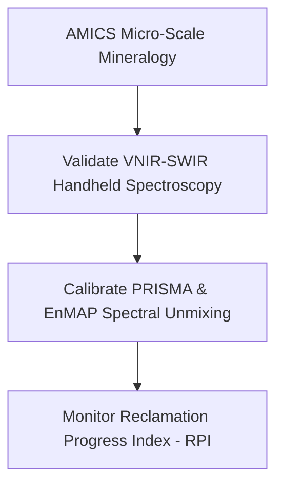
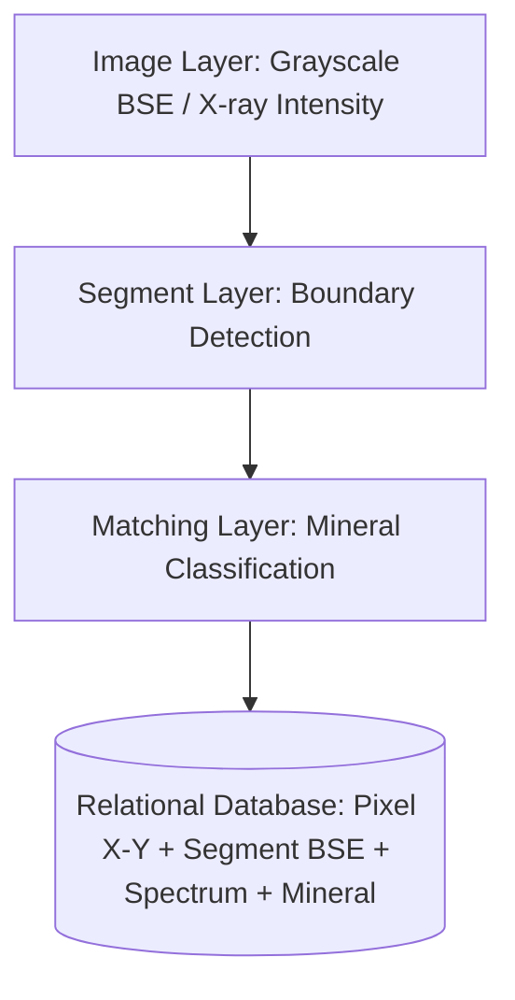
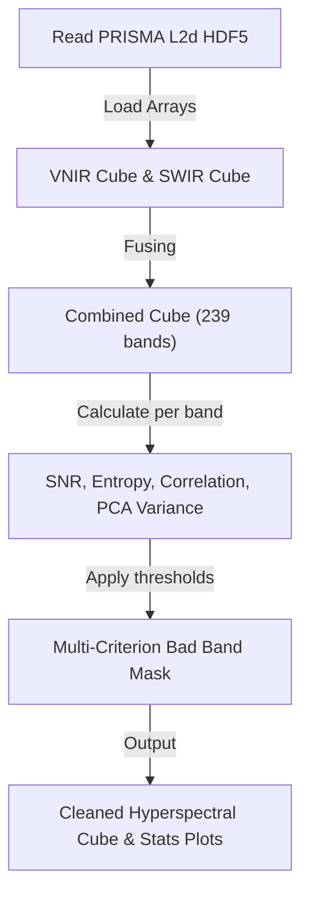
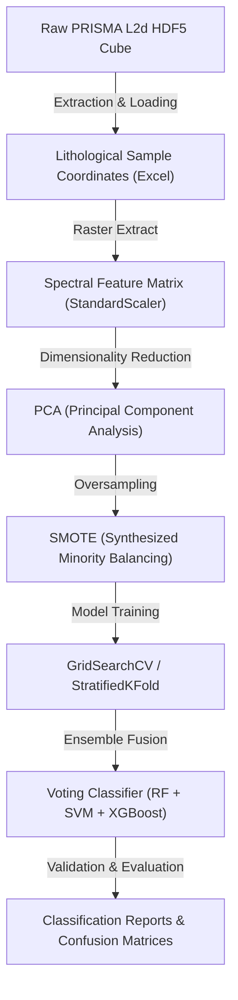
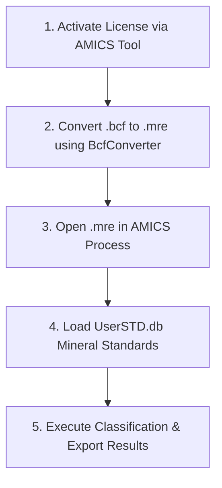
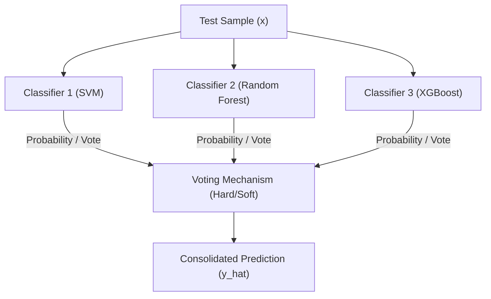
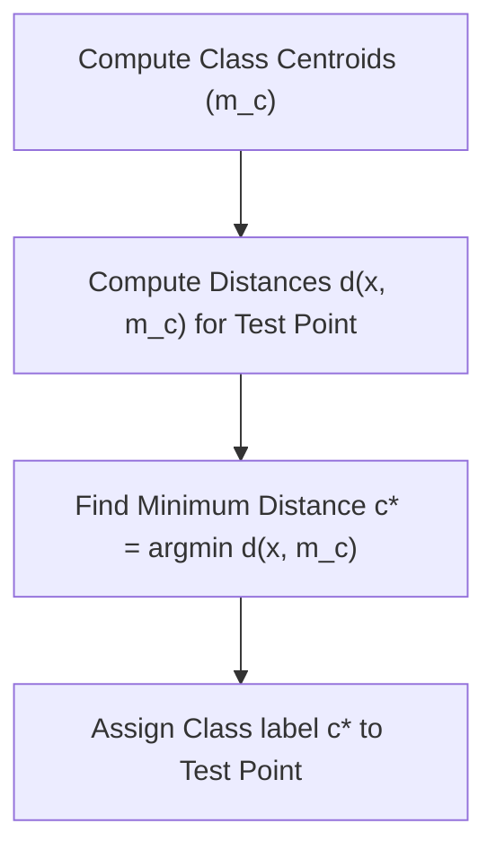
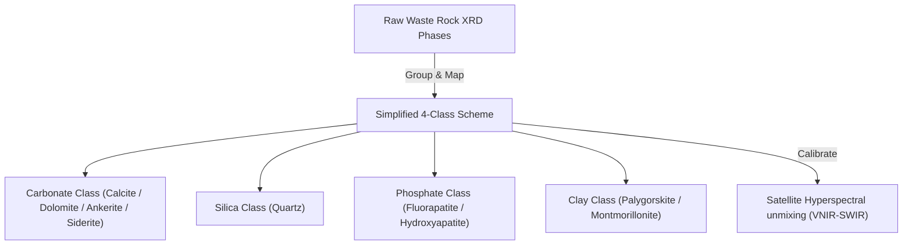
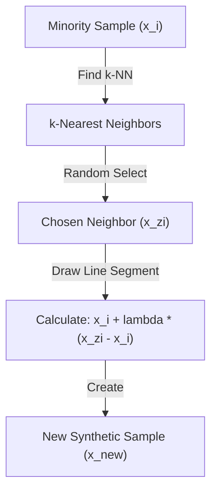
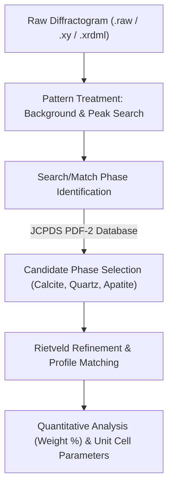

# Abdelhak EL MANSOUR — Compiled Wiki

> **Theme Summary**: Wiki index, concepts, entities, and literature references.
> **Total Files Compiled**: 470 | **Total Word Count**: ~86266 words

## 📂 Table of Contents

- [04_Knowledge Base/wiki/Flashcards — Research Concepts.md](#-file-04_knowledge-base-wiki-flashcards-—-research-concepts-md) (~1583 words)
- [04_Knowledge Base/wiki/Literature MOC - A-C.md](#-file-04_knowledge-base-wiki-literature-moc---a-c-md) (~345 words)
- [04_Knowledge Base/wiki/Literature MOC - C-H.md](#-file-04_knowledge-base-wiki-literature-moc---c-h-md) (~350 words)
- [04_Knowledge Base/wiki/Literature MOC - H-M.md](#-file-04_knowledge-base-wiki-literature-moc---h-m-md) (~345 words)
- [04_Knowledge Base/wiki/Literature MOC - M-R.md](#-file-04_knowledge-base-wiki-literature-moc---m-r-md) (~345 words)
- [04_Knowledge Base/wiki/Literature MOC - R-Z.md](#-file-04_knowledge-base-wiki-literature-moc---r-z-md) (~355 words)
- [04_Knowledge Base/wiki/Literature MOC.md](#-file-04_knowledge-base-wiki-literature-moc-md) (~120 words)
- [04_Knowledge Base/wiki/hot.md](#-file-04_knowledge-base-wiki-hot-md) (~701 words)
- [04_Knowledge Base/wiki/index.md](#-file-04_knowledge-base-wiki-index-md) (~680 words)
- [04_Knowledge Base/wiki/MOCs/Automated Mineralogy MOC.md](#-file-04_knowledge-base-wiki-mocs-automated-mineralogy-moc-md) (~310 words)
- [04_Knowledge Base/wiki/MOCs/Biodiversity MOC.md](#-file-04_knowledge-base-wiki-mocs-biodiversity-moc-md) (~28 words)
- [04_Knowledge Base/wiki/MOCs/Botany MOC.md](#-file-04_knowledge-base-wiki-mocs-botany-moc-md) (~28 words)
- [04_Knowledge Base/wiki/MOCs/Code-Pattern MOC.md](#-file-04_knowledge-base-wiki-mocs-code-pattern-moc-md) (~71 words)
- [04_Knowledge Base/wiki/MOCs/Data-Asset MOC.md](#-file-04_knowledge-base-wiki-mocs-data-asset-moc-md) (~72 words)
- [04_Knowledge Base/wiki/MOCs/Geology MOC.md](#-file-04_knowledge-base-wiki-mocs-geology-moc-md) (~30 words)
- [04_Knowledge Base/wiki/MOCs/Gis MOC.md](#-file-04_knowledge-base-wiki-mocs-gis-moc-md) (~33 words)
- [04_Knowledge Base/wiki/MOCs/Hyperspectral MOC.md](#-file-04_knowledge-base-wiki-mocs-hyperspectral-moc-md) (~30 words)
- [04_Knowledge Base/wiki/MOCs/Hyperspectral Remote Sensing MOC.md](#-file-04_knowledge-base-wiki-mocs-hyperspectral-remote-sensing-moc-md) (~447 words)
- [04_Knowledge Base/wiki/MOCs/Machine-Learning MOC.md](#-file-04_knowledge-base-wiki-mocs-machine-learning-moc-md) (~44 words)
- [04_Knowledge Base/wiki/MOCs/Mineralogy MOC.md](#-file-04_knowledge-base-wiki-mocs-mineralogy-moc-md) (~127 words)
- [04_Knowledge Base/wiki/MOCs/Reclamation MOC.md](#-file-04_knowledge-base-wiki-mocs-reclamation-moc-md) (~101 words)
- [04_Knowledge Base/wiki/MOCs/Remote-Sensing MOC.md](#-file-04_knowledge-base-wiki-mocs-remote-sensing-moc-md) (~43 words)
- [04_Knowledge Base/wiki/MOCs/Visualization MOC.md](#-file-04_knowledge-base-wiki-mocs-visualization-moc-md) (~31 words)
- [04_Knowledge Base/wiki/MOCs/Waste-Rock MOC.md](#-file-04_knowledge-base-wiki-mocs-waste-rock-moc-md) (~48 words)
- [04_Knowledge Base/wiki/MOCs/Wiki-Concept MOC.md](#-file-04_knowledge-base-wiki-mocs-wiki-concept-moc-md) (~634 words)
- [04_Knowledge Base/wiki/entities/Gantour Basin.md](#-file-04_knowledge-base-wiki-entities-gantour-basin-md) (~448 words)
- [04_Knowledge Base/wiki/entities/OCP Group and Benguerir Mine.md](#-file-04_knowledge-base-wiki-entities-ocp-group-and-benguerir-mine-md) (~278 words)
- [04_Knowledge Base/wiki/sources/Abdelhak2022Progressive.md](#-file-04_knowledge-base-wiki-sources-abdelhak2022progressive-md) (~634 words)
- [04_Knowledge Base/wiki/sources/Aghababaei2022Introducing.md](#-file-04_knowledge-base-wiki-sources-aghababaei2022introducing-md) (~444 words)
- [04_Knowledge Base/wiki/sources/BoardmanJWKruse.md](#-file-04_knowledge-base-wiki-sources-boardmanjwkruse-md) (~50 words)
- [04_Knowledge Base/wiki/sources/DataProductsQuality.md](#-file-04_knowledge-base-wiki-sources-dataproductsquality-md) (~50 words)
- [04_Knowledge Base/wiki/sources/DataSeries2017.md](#-file-04_knowledge-base-wiki-sources-dataseries2017-md) (~50 words)
- [04_Knowledge Base/wiki/sources/DataSeries2017a.md](#-file-04_knowledge-base-wiki-sources-dataseries2017a-md) (~50 words)
- [04_Knowledge Base/wiki/sources/DataSeries2017b.md](#-file-04_knowledge-base-wiki-sources-dataseries2017b-md) (~50 words)
- [04_Knowledge Base/wiki/sources/Delogu2023Using.md](#-file-04_knowledge-base-wiki-sources-delogu2023using-md) (~572 words)
- [04_Knowledge Base/wiki/sources/EditorialSpecialIssue.md](#-file-04_knowledge-base-wiki-sources-editorialspecialissue-md) (~53 words)
- [04_Knowledge Base/wiki/sources/EnMAPSpaceborneImaging.md](#-file-04_knowledge-base-wiki-sources-enmapspaceborneimaging-md) (~54 words)
- [04_Knowledge Base/wiki/sources/Ewing2020Utilizing.md](#-file-04_knowledge-base-wiki-sources-ewing2020utilizing-md) (~492 words)
- [04_Knowledge Base/wiki/sources/Forkuor2017High.md](#-file-04_knowledge-base-wiki-sources-forkuor2017high-md) (~518 words)
- [04_Knowledge Base/wiki/sources/Guha2019Reflectance.md](#-file-04_knowledge-base-wiki-sources-guha2019reflectance-md) (~528 words)
- [04_Knowledge Base/wiki/sources/HandheldXrayFluorescence2019.md](#-file-04_knowledge-base-wiki-sources-handheldxrayfluorescence2019-md) (~50 words)
- [04_Knowledge Base/wiki/sources/HandheldXrayFluorescence2019a.md](#-file-04_knowledge-base-wiki-sources-handheldxrayfluorescence2019a-md) (~50 words)
- [04_Knowledge Base/wiki/sources/Heincke2019Developing.md](#-file-04_knowledge-base-wiki-sources-heincke2019developing-md) (~448 words)
- [04_Knowledge Base/wiki/sources/Hernandez2013Spectral.md](#-file-04_knowledge-base-wiki-sources-hernandez2013spectral-md) (~525 words)
- [04_Knowledge Base/wiki/sources/HyperspectralRemoteSensing.md](#-file-04_knowledge-base-wiki-sources-hyperspectralremotesensing-md) (~55 words)
- [04_Knowledge Base/wiki/sources/ImagingSpectrometryEarth.md](#-file-04_knowledge-base-wiki-sources-imagingspectrometryearth-md) (~50 words)
- [04_Knowledge Base/wiki/sources/InterlayersGeoenvironmentalAssessment.md](#-file-04_knowledge-base-wiki-sources-interlayersgeoenvironmentalassessment-md) (~60 words)
- [04_Knowledge Base/wiki/sources/Jacq2022Theoretical.md](#-file-04_knowledge-base-wiki-sources-jacq2022theoretical-md) (~377 words)
- [04_Knowledge Base/wiki/sources/Kashem2004Phosphorus.md](#-file-04_knowledge-base-wiki-sources-kashem2004phosphorus-md) (~441 words)
- [04_Knowledge Base/wiki/sources/Liu2018Quantitative.md](#-file-04_knowledge-base-wiki-sources-liu2018quantitative-md) (~458 words)
- [04_Knowledge Base/wiki/sources/Malainine2021Integrated.md](#-file-04_knowledge-base-wiki-sources-malainine2021integrated-md) (~429 words)
- [04_Knowledge Base/wiki/sources/MappingHyperspectralAVIRIS.md](#-file-04_knowledge-base-wiki-sources-mappinghyperspectralaviris-md) (~55 words)
- [04_Knowledge Base/wiki/sources/McHugh2001Simplified.md](#-file-04_knowledge-base-wiki-sources-mchugh2001simplified-md) (~492 words)
- [04_Knowledge Base/wiki/sources/MineWastesCharacterization.md](#-file-04_knowledge-base-wiki-sources-minewastescharacterization-md) (~50 words)
- [04_Knowledge Base/wiki/sources/MineralCommoditySummaries.md](#-file-04_knowledge-base-wiki-sources-mineralcommoditysummaries-md) (~51 words)
- [04_Knowledge Base/wiki/sources/MineralCommoditySummaries2021.md](#-file-04_knowledge-base-wiki-sources-mineralcommoditysummaries2021-md) (~51 words)
- [04_Knowledge Base/wiki/sources/MineralCommoditySummaries2023.md](#-file-04_knowledge-base-wiki-sources-mineralcommoditysummaries2023-md) (~51 words)
- [04_Knowledge Base/wiki/sources/MineralCommoditySummaries2023a.md](#-file-04_knowledge-base-wiki-sources-mineralcommoditysummaries2023a-md) (~52 words)
- [04_Knowledge Base/wiki/sources/MineralCommoditySummaries2025.md](#-file-04_knowledge-base-wiki-sources-mineralcommoditysummaries2025-md) (~52 words)
- [04_Knowledge Base/wiki/sources/MineralCommoditySummaries2025a.md](#-file-04_knowledge-base-wiki-sources-mineralcommoditysummaries2025a-md) (~52 words)
- [04_Knowledge Base/wiki/sources/MineralCommoditySummaries2025b.md](#-file-04_knowledge-base-wiki-sources-mineralcommoditysummaries2025b-md) (~52 words)
- [04_Knowledge Base/wiki/sources/MineralCommoditySummaries2025c.md](#-file-04_knowledge-base-wiki-sources-mineralcommoditysummaries2025c-md) (~52 words)
- [04_Knowledge Base/wiki/sources/MineralCommoditySummaries2025d.md](#-file-04_knowledge-base-wiki-sources-mineralcommoditysummaries2025d-md) (~52 words)
- [04_Knowledge Base/wiki/sources/MineralCommoditySummaries2025e.md](#-file-04_knowledge-base-wiki-sources-mineralcommoditysummaries2025e-md) (~52 words)
- [04_Knowledge Base/wiki/sources/MitigatingSoilContamination2018.md](#-file-04_knowledge-base-wiki-sources-mitigatingsoilcontamination2018-md) (~54 words)
- [04_Knowledge Base/wiki/sources/NBSAIDS83_Manual.md](#-file-04_knowledge-base-wiki-sources-nbsaids83_manual-md) (~378 words)
- [04_Knowledge Base/wiki/sources/OCPSustainabilityIntegrated2021.md](#-file-04_knowledge-base-wiki-sources-ocpsustainabilityintegrated2021-md) (~52 words)
- [04_Knowledge Base/wiki/sources/OpenFileReport2002.md](#-file-04_knowledge-base-wiki-sources-openfilereport2002-md) (~50 words)
- [04_Knowledge Base/wiki/sources/OpenFileReport2002a.md](#-file-04_knowledge-base-wiki-sources-openfilereport2002a-md) (~50 words)
- [04_Knowledge Base/wiki/sources/ProgressGeoenvironmentalModels2002.md](#-file-04_knowledge-base-wiki-sources-progressgeoenvironmentalmodels2002-md) (~57 words)
- [04_Knowledge Base/wiki/sources/Requejo2014Organic.md](#-file-04_knowledge-base-wiki-sources-requejo2014organic-md) (~462 words)
- [04_Knowledge Base/wiki/sources/Rialland2021Identification.md](#-file-04_knowledge-base-wiki-sources-rialland2021identification-md) (~397 words)
- [04_Knowledge Base/wiki/sources/Shippert2003Introduction.md](#-file-04_knowledge-base-wiki-sources-shippert2003introduction-md) (~472 words)
- [04_Knowledge Base/wiki/sources/SpectralReflectanceCarbonate.md](#-file-04_knowledge-base-wiki-sources-spectralreflectancecarbonate-md) (~62 words)
- [04_Knowledge Base/wiki/sources/TacklingMineWastes.md](#-file-04_knowledge-base-wiki-sources-tacklingminewastes-md) (~52 words)
- [04_Knowledge Base/wiki/sources/USEPA1999Correct.md](#-file-04_knowledge-base-wiki-sources-usepa1999correct-md) (~437 words)
- [04_Knowledge Base/wiki/sources/Uddin2012Effect.md](#-file-04_knowledge-base-wiki-sources-uddin2012effect-md) (~488 words)
- [04_Knowledge Base/wiki/sources/UsingPRISMAHyperspectral.md](#-file-04_knowledge-base-wiki-sources-usingprismahyperspectral-md) (~53 words)
- [04_Knowledge Base/wiki/sources/Wadoux2020Note.md](#-file-04_knowledge-base-wiki-sources-wadoux2020note-md) (~493 words)
- [04_Knowledge Base/wiki/sources/WorldFertilizerTrends.md](#-file-04_knowledge-base-wiki-sources-worldfertilizertrends-md) (~55 words)
- [04_Knowledge Base/wiki/sources/WorldFertilizerTrends2019.md](#-file-04_knowledge-base-wiki-sources-worldfertilizertrends2019-md) (~55 words)
- [04_Knowledge Base/wiki/sources/abdolmalekiOreWasteDiscriminationUsing2022.md](#-file-04_knowledge-base-wiki-sources-abdolmalekiorewastediscriminationusing2022-md) (~58 words)
- [04_Knowledge Base/wiki/sources/achemrkTrackingQuarterCenturySpatioTemporal2026.md](#-file-04_knowledge-base-wiki-sources-achemrktrackingquartercenturyspatiotemporal2026-md) (~73 words)
- [04_Knowledge Base/wiki/sources/achmaniGisementsPhosphatesMaroc2016.md](#-file-04_knowledge-base-wiki-sources-achmanigisementsphosphatesmaroc2016-md) (~263 words)
- [04_Knowledge Base/wiki/sources/acitoAtmosphericCompensationPRISMA2021.md](#-file-04_knowledge-base-wiki-sources-acitoatmosphericcompensationprisma2021-md) (~59 words)
- [04_Knowledge Base/wiki/sources/acitoAtmosphericCompensationPRISMA2021a.md](#-file-04_knowledge-base-wiki-sources-acitoatmosphericcompensationprisma2021a-md) (~59 words)
- [04_Knowledge Base/wiki/sources/agrawalEvaluatingPerformancePRISMA2023.md](#-file-04_knowledge-base-wiki-sources-agrawalevaluatingperformanceprisma2023-md) (~64 words)
- [04_Knowledge Base/wiki/sources/allowayHeavyMetalsSoils2013.md](#-file-04_knowledge-base-wiki-sources-allowayheavymetalssoils2013-md) (~50 words)
- [04_Knowledge Base/wiki/sources/alonsoDataProductsQuality2019.md](#-file-04_knowledge-base-wiki-sources-alonsodataproductsquality2019-md) (~74 words)
- [04_Knowledge Base/wiki/sources/alvesRevisitingRamanSpectra2023.md](#-file-04_knowledge-base-wiki-sources-alvesrevisitingramanspectra2023-md) (~66 words)
- [04_Knowledge Base/wiki/sources/amarMineWasteRock2023.md](#-file-04_knowledge-base-wiki-sources-amarminewasterock2023-md) (~75 words)
- [04_Knowledge Base/wiki/sources/amarWasteRockReprocessing2022.md](#-file-04_knowledge-base-wiki-sources-amarwasterockreprocessing2022-md) (~73 words)
- [04_Knowledge Base/wiki/sources/amrani2019.md](#-file-04_knowledge-base-wiki-sources-amrani2019-md) (~211 words)
- [04_Knowledge Base/wiki/sources/amraniValorizationPhosphateMine2019.md](#-file-04_knowledge-base-wiki-sources-amranivalorizationphosphatemine2019-md) (~65 words)
- [04_Knowledge Base/wiki/sources/anderson1985.md](#-file-04_knowledge-base-wiki-sources-anderson1985-md) (~102 words)
- [04_Knowledge Base/wiki/sources/anjjarPhosphateSeriesBenguerir.md](#-file-04_knowledge-base-wiki-sources-anjjarphosphateseriesbenguerir-md) (~67 words)
- [04_Knowledge Base/wiki/sources/araujoRecyclingReuseMine2022.md](#-file-04_knowledge-base-wiki-sources-araujorecyclingreusemine2022-md) (~52 words)
- [04_Knowledge Base/wiki/sources/aubineauHighlyVariableContent2022.md](#-file-04_knowledge-base-wiki-sources-aubineauhighlyvariablecontent2022-md) (~54 words)
- [04_Knowledge Base/wiki/sources/aubineauPhosphateD13CorgChemostratigraphy2024.md](#-file-04_knowledge-base-wiki-sources-aubineauphosphated13corgchemostratigraphy2024-md) (~50 words)
- [04_Knowledge Base/wiki/sources/audebertDeepLearningClassification2019.md](#-file-04_knowledge-base-wiki-sources-audebertdeeplearningclassification2019-md) (~61 words)
- [04_Knowledge Base/wiki/sources/bache1971.md](#-file-04_knowledge-base-wiki-sources-bache1971-md) (~98 words)
- [04_Knowledge Base/wiki/sources/badiouiEtudeStratigraphiqueListing2015.md](#-file-04_knowledge-base-wiki-sources-badiouietudestratigraphiquelisting2015-md) (~415 words)
- [04_Knowledge Base/wiki/sources/bahhouUsePhosphateMine2021.md](#-file-04_knowledge-base-wiki-sources-bahhouusephosphatemine2021-md) (~77 words)
- [04_Knowledge Base/wiki/sources/barlowStatisticalInferenceOrder1972.md](#-file-04_knowledge-base-wiki-sources-barlowstatisticalinferenceorder1972-md) (~54 words)
- [04_Knowledge Base/wiki/sources/barlowStatisticalInferenceOrder1980.md](#-file-04_knowledge-base-wiki-sources-barlowstatisticalinferenceorder1980-md) (~60 words)
- [04_Knowledge Base/wiki/sources/bayoussefUseClaysByproducts2021.md](#-file-04_knowledge-base-wiki-sources-bayoussefuseclaysbyproducts2021-md) (~82 words)
- [04_Knowledge Base/wiki/sources/bendorReflectanceMeasurementsSoils2015.md](#-file-04_knowledge-base-wiki-sources-bendorreflectancemeasurementssoils2015-md) (~63 words)
- [04_Knowledge Base/wiki/sources/bendorReflectanceMeasurementsSoils2015a.md](#-file-04_knowledge-base-wiki-sources-bendorreflectancemeasurementssoils2015a-md) (~63 words)
- [04_Knowledge Base/wiki/sources/benhassenPetrographieGeochimieComparees2010.md](#-file-04_knowledge-base-wiki-sources-benhassenpetrographiegeochimiecomparees2010-md) (~422 words)
- [04_Knowledge Base/wiki/sources/benjaminiControllingFalseDiscovery1995.md](#-file-04_knowledge-base-wiki-sources-benjaminicontrollingfalsediscovery1995-md) (~63 words)
- [04_Knowledge Base/wiki/sources/benjaminiControllingFalseDiscovery1995a.md](#-file-04_knowledge-base-wiki-sources-benjaminicontrollingfalsediscovery1995a-md) (~64 words)
- [04_Knowledge Base/wiki/sources/bioucas-diasHyperspectralUnmixingOverview2012.md](#-file-04_knowledge-base-wiki-sources-bioucas-diashyperspectralunmixingoverview2012-md) (~60 words)
- [04_Knowledge Base/wiki/sources/bishopInfraredSpectroscopicAnalyses1994.md](#-file-04_knowledge-base-wiki-sources-bishopinfraredspectroscopicanalyses1994-md) (~57 words)
- [04_Knowledge Base/wiki/sources/bishopReflectanceEmissionSpectroscopy2008.md](#-file-04_knowledge-base-wiki-sources-bishopreflectanceemissionspectroscopy2008-md) (~76 words)
- [04_Knowledge Base/wiki/sources/boardmanMAPPINGTARGETSIGNATURES.md](#-file-04_knowledge-base-wiki-sources-boardmanmappingtargetsignatures-md) (~64 words)
- [04_Knowledge Base/wiki/sources/boardmanMappingTargetSignatures1995.md](#-file-04_knowledge-base-wiki-sources-boardmanmappingtargetsignatures1995-md) (~65 words)
- [04_Knowledge Base/wiki/sources/boardmanjosephw.AUTOMATINGSPECTRALUNMIXING.md](#-file-04_knowledge-base-wiki-sources-boardmanjosephw-automatingspectralunmixing-md) (~58 words)
- [04_Knowledge Base/wiki/sources/bosseAssessmentPhosphateLimestone2013.md](#-file-04_knowledge-base-wiki-sources-bosseassessmentphosphatelimestone2013-md) (~55 words)
- [04_Knowledge Base/wiki/sources/boujoContributionLetudeGeologique1976.md](#-file-04_knowledge-base-wiki-sources-boujocontributionletudegeologique1976-md) (~51 words)
- [04_Knowledge Base/wiki/sources/bourazzaRestorationPhosphateMined2025.md](#-file-04_knowledge-base-wiki-sources-bourazzarestorationphosphatemined2025-md) (~73 words)
- [04_Knowledge Base/wiki/sources/bourazzaRestorationPhosphateMined2025a.md](#-file-04_knowledge-base-wiki-sources-bourazzarestorationphosphatemined2025a-md) (~73 words)
- [04_Knowledge Base/wiki/sources/bradshawRestorationMinedLands1997.md](#-file-04_knowledge-base-wiki-sources-bradshawrestorationminedlands1997-md) (~54 words)
- [04_Knowledge Base/wiki/sources/breimanRandomForests2001.md](#-file-04_knowledge-base-wiki-sources-breimanrandomforests2001-md) (~50 words)
- [04_Knowledge Base/wiki/sources/bressanEvaluationMachineLearning2020.md](#-file-04_knowledge-base-wiki-sources-bressanevaluationmachinelearning2020-md) (~74 words)
- [04_Knowledge Base/wiki/sources/brown2005.md](#-file-04_knowledge-base-wiki-sources-brown2005-md) (~135 words)
- [04_Knowledge Base/wiki/sources/buzziMappingChangesRecovering2014.md](#-file-04_knowledge-base-wiki-sources-buzzimappingchangesrecovering2014-md) (~52 words)
- [04_Knowledge Base/wiki/sources/c.heckerSpectralAbsorptionFeature2019.md](#-file-04_knowledge-base-wiki-sources-c-heckerspectralabsorptionfeature2019-md) (~56 words)
- [04_Knowledge Base/wiki/sources/chabrillatEnMAPSpaceborneImaging2024.md](#-file-04_knowledge-base-wiki-sources-chabrillatenmapspaceborneimaging2024-md) (~123 words)
- [04_Knowledge Base/wiki/sources/chakrabortySpectralSpatialComparison2024.md](#-file-04_knowledge-base-wiki-sources-chakrabortyspectralspatialcomparison2024-md) (~59 words)
- [04_Knowledge Base/wiki/sources/charbaouiNewInsightsGeophysical2023.md](#-file-04_knowledge-base-wiki-sources-charbaouinewinsightsgeophysical2023-md) (~74 words)
- [04_Knowledge Base/wiki/sources/charbaouiNewInsightsGeophysical2023a.md](#-file-04_knowledge-base-wiki-sources-charbaouinewinsightsgeophysical2023a-md) (~74 words)
- [04_Knowledge Base/wiki/sources/chein-ichangSpectralInformationDivergence1999.md](#-file-04_knowledge-base-wiki-sources-chein-ichangspectralinformationdivergence1999-md) (~54 words)
- [04_Knowledge Base/wiki/sources/chenIntegratingVisibleNearinfrared2010.md](#-file-04_knowledge-base-wiki-sources-chenintegratingvisiblenearinfrared2010-md) (~75 words)
- [04_Knowledge Base/wiki/sources/chenXGBoostScalableTree2016.md](#-file-04_knowledge-base-wiki-sources-chenxgboostscalabletree2016-md) (~58 words)
- [04_Knowledge Base/wiki/sources/chindongMultiSensorMachineLearning2025.md](#-file-04_knowledge-base-wiki-sources-chindongmultisensormachinelearning2025-md) (~73 words)
- [04_Knowledge Base/wiki/sources/chlahbiGeologicalGeomechanicalCharacterization2023.md](#-file-04_knowledge-base-wiki-sources-chlahbigeologicalgeomechanicalcharacterization2023-md) (~69 words)
- [04_Knowledge Base/wiki/sources/choeMappingHeavyMetal2008.md](#-file-04_knowledge-base-wiki-sources-choemappingheavymetal2008-md) (~72 words)
- [04_Knowledge Base/wiki/sources/clarkHighSpectralResolution1990.md](#-file-04_knowledge-base-wiki-sources-clarkhighspectralresolution1990-md) (~75 words)
- [04_Knowledge Base/wiki/sources/clarkHighSpectralResolution1990a.md](#-file-04_knowledge-base-wiki-sources-clarkhighspectralresolution1990a-md) (~75 words)
- [04_Knowledge Base/wiki/sources/clarkHighSpectralResolution1990b.md](#-file-04_knowledge-base-wiki-sources-clarkhighspectralresolution1990b-md) (~75 words)
- [04_Knowledge Base/wiki/sources/clarkHighSpectralResolution1990c.md](#-file-04_knowledge-base-wiki-sources-clarkhighspectralresolution1990c-md) (~75 words)
- [04_Knowledge Base/wiki/sources/clarkHighSpectralResolution1990d.md](#-file-04_knowledge-base-wiki-sources-clarkhighspectralresolution1990d-md) (~75 words)
- [04_Knowledge Base/wiki/sources/clarkReflectanceSpectroscopyQuantitative1984.md](#-file-04_knowledge-base-wiki-sources-clarkreflectancespectroscopyquantitative1984-md) (~60 words)
- [04_Knowledge Base/wiki/sources/clarkReflectanceSpectroscopyQuantitative1984a.md](#-file-04_knowledge-base-wiki-sources-clarkreflectancespectroscopyquantitative1984a-md) (~60 words)
- [04_Knowledge Base/wiki/sources/clarkReflectanceSpectroscopyQuantitative1984b.md](#-file-04_knowledge-base-wiki-sources-clarkreflectancespectroscopyquantitative1984b-md) (~60 words)
- [04_Knowledge Base/wiki/sources/clarkReflectanceSpectroscopyQuantitative1984c.md](#-file-04_knowledge-base-wiki-sources-clarkreflectancespectroscopyquantitative1984c-md) (~60 words)
- [04_Knowledge Base/wiki/sources/clarkSpectroscopyRocksMinerals1999.md](#-file-04_knowledge-base-wiki-sources-clarkspectroscopyrocksminerals1999-md) (~60 words)
- [04_Knowledge Base/wiki/sources/cogliatiPRISMAImagingSpectroscopy2021.md](#-file-04_knowledge-base-wiki-sources-cogliatiprismaimagingspectroscopy2021-md) (~81 words)
- [04_Knowledge Base/wiki/sources/cogliatiPRISMAImagingSpectroscopy2021a.md](#-file-04_knowledge-base-wiki-sources-cogliatiprismaimagingspectroscopy2021a-md) (~81 words)
- [04_Knowledge Base/wiki/sources/cogliatiPRISMAImagingSpectroscopy2021b.md](#-file-04_knowledge-base-wiki-sources-cogliatiprismaimagingspectroscopy2021b-md) (~81 words)
- [04_Knowledge Base/wiki/sources/cogliatiPRISMAImagingSpectroscopy2021c.md](#-file-04_knowledge-base-wiki-sources-cogliatiprismaimagingspectroscopy2021c-md) (~81 words)
- [04_Knowledge Base/wiki/sources/cohenStatisticalPowerAnalysis2013.md](#-file-04_knowledge-base-wiki-sources-cohenstatisticalpoweranalysis2013-md) (~51 words)
- [04_Knowledge Base/wiki/sources/coppoLeonardoSpaceborneInfrared2020.md](#-file-04_knowledge-base-wiki-sources-coppoleonardospaceborneinfrared2020-md) (~81 words)
- [04_Knowledge Base/wiki/sources/coppoLeonardoSpaceborneInfrared2020a.md](#-file-04_knowledge-base-wiki-sources-coppoleonardospaceborneinfrared2020a-md) (~81 words)
- [04_Knowledge Base/wiki/sources/cordellStoryPhosphorusGlobal2009.md](#-file-04_knowledge-base-wiki-sources-cordellstoryphosphorusglobal2009-md) (~60 words)
- [04_Knowledge Base/wiki/sources/cordellStoryPhosphorusGlobal2009a.md](#-file-04_knowledge-base-wiki-sources-cordellstoryphosphorusglobal2009a-md) (~60 words)
- [04_Knowledge Base/wiki/sources/cortesSupportvectorNetworks1995.md](#-file-04_knowledge-base-wiki-sources-cortessupportvectornetworks1995-md) (~53 words)
- [04_Knowledge Base/wiki/sources/coverNearestNeighborPattern1967.md](#-file-04_knowledge-base-wiki-sources-covernearestneighborpattern1967-md) (~58 words)
- [04_Knowledge Base/wiki/sources/daviesMappingAcidicMine2017.md](#-file-04_knowledge-base-wiki-sources-daviesmappingacidicmine2017-md) (~67 words)
- [04_Knowledge Base/wiki/sources/desanctisSpectroscopicCharacterizationMineralogy2012.md](#-file-04_knowledge-base-wiki-sources-desanctisspectroscopiccharacterizationmineralogy2012-md) (~126 words)
- [04_Knowledge Base/wiki/sources/dobigeonNonlinearUnmixingHyperspectral2014.md](#-file-04_knowledge-base-wiki-sources-dobigeonnonlinearunmixinghyperspectral2014-md) (~70 words)
- [04_Knowledge Base/wiki/sources/edwardsMineralResourceOre2001.md](#-file-04_knowledge-base-wiki-sources-edwardsmineralresourceore2001-md) (~57 words)
- [04_Knowledge Base/wiki/sources/el-arafySuccessfulSpectralRemote2021.md](#-file-04_knowledge-base-wiki-sources-el-arafysuccessfulspectralremote2021-md) (~68 words)
- [04_Knowledge Base/wiki/sources/el-azhariEvaluatingGroundwaterSalinity2025.md](#-file-04_knowledge-base-wiki-sources-el-azharievaluatinggroundwatersalinity2025-md) (~62 words)
- [04_Knowledge Base/wiki/sources/elazhariPollutionEcologicalRisk2017.md](#-file-04_knowledge-base-wiki-sources-elazharipollutionecologicalrisk2017-md) (~79 words)
- [04_Knowledge Base/wiki/sources/elbamikiPhosphateRocksReview2021.md](#-file-04_knowledge-base-wiki-sources-elbamikiphosphaterocksreview2021-md) (~66 words)
- [04_Knowledge Base/wiki/sources/elberdaiValorizationPhosphateMine2024.md](#-file-04_knowledge-base-wiki-sources-elberdaivalorizationphosphatemine2024-md) (~84 words)
- [04_Knowledge Base/wiki/sources/elberdaiValorizationPhosphateMine2024a.md](#-file-04_knowledge-base-wiki-sources-elberdaivalorizationphosphatemine2024a-md) (~84 words)
- [04_Knowledge Base/wiki/sources/elhaddiSilicificationsSeriePhosphate2014.md](#-file-04_knowledge-base-wiki-sources-elhaddisilicificationsseriephosphate2014-md) (~388 words)
- [04_Knowledge Base/wiki/sources/elmachiRecyclingMineWastes2024.md](#-file-04_knowledge-base-wiki-sources-elmachirecyclingminewastes2024-md) (~73 words)
- [04_Knowledge Base/wiki/sources/elmansourCuttingEdgeFrameworkSustainable2025.md](#-file-04_knowledge-base-wiki-sources-elmansourcuttingedgeframeworksustainable2025-md) (~64 words)
- [04_Knowledge Base/wiki/sources/elmeknassiCircularEconomyStrategies2024.md](#-file-04_knowledge-base-wiki-sources-elmeknassicirculareconomystrategies2024-md) (~68 words)
- [04_Knowledge Base/wiki/sources/elserBrokenBiogeochemicalCycle2011.md](#-file-04_knowledge-base-wiki-sources-elserbrokenbiogeochemicalcycle2011-md) (~54 words)
- [04_Knowledge Base/wiki/sources/essingtonSoilWaterChemistry2004.md](#-file-04_knowledge-base-wiki-sources-essingtonsoilwaterchemistry2004-md) (~56 words)
- [04_Knowledge Base/wiki/sources/fauvelAdvancesSpectralSpatialClassification2013.md](#-file-04_knowledge-base-wiki-sources-fauveladvancesspectralspatialclassification2013-md) (~68 words)
- [04_Knowledge Base/wiki/sources/fieldingStatisticalInferenceOrder1974.md](#-file-04_knowledge-base-wiki-sources-fieldingstatisticalinferenceorder1974-md) (~76 words)
- [04_Knowledge Base/wiki/sources/flogeacCharacterizationSoilParticles2005.md](#-file-04_knowledge-base-wiki-sources-flogeaccharacterizationsoilparticles2005-md) (~74 words)
- [04_Knowledge Base/wiki/sources/francosEstimationRelativeAbundance2021.md](#-file-04_knowledge-base-wiki-sources-francosestimationrelativeabundance2021-md) (~58 words)
- [04_Knowledge Base/wiki/sources/gaffeySpectralReflectanceCarbonate1986.md](#-file-04_knowledge-base-wiki-sources-gaffeyspectralreflectancecarbonate1986-md) (~66 words)
- [04_Knowledge Base/wiki/sources/gaffeysSpectralReflectanceCarbonate1986.md](#-file-04_knowledge-base-wiki-sources-gaffeysspectralreflectancecarbonate1986-md) (~67 words)
- [04_Knowledge Base/wiki/sources/gaoGeneralizedUnsupervisedClustering2021.md](#-file-04_knowledge-base-wiki-sources-gaogeneralizedunsupervisedclustering2021-md) (~69 words)
- [04_Knowledge Base/wiki/sources/gasmiUsingPRISMAHyperspectral2022.md](#-file-04_knowledge-base-wiki-sources-gasmiusingprismahyperspectral2022-md) (~56 words)
- [04_Knowledge Base/wiki/sources/gazleyReviewReliabilityValidity2014.md](#-file-04_knowledge-base-wiki-sources-gazleyreviewreliabilityvalidity2014-md) (~72 words)
- [04_Knowledge Base/wiki/sources/gazleyReviewReliabilityValidity2014a.md](#-file-04_knowledge-base-wiki-sources-gazleyreviewreliabilityvalidity2014a-md) (~61 words)
- [04_Knowledge Base/wiki/sources/geladiPartialLeastsquaresRegression1986.md](#-file-04_knowledge-base-wiki-sources-geladipartialleastsquaresregression1986-md) (~58 words)
- [04_Knowledge Base/wiki/sources/geladiPartialLeastsquaresRegression1986a.md](#-file-04_knowledge-base-wiki-sources-geladipartialleastsquaresregression1986a-md) (~58 words)
- [04_Knowledge Base/wiki/sources/genesioUpdatesPRISMAScientific2022.md](#-file-04_knowledge-base-wiki-sources-genesioupdatesprismascientific2022-md) (~104 words)
- [04_Knowledge Base/wiki/sources/geurtsExtremelyRandomizedTrees2006.md](#-file-04_knowledge-base-wiki-sources-geurtsextremelyrandomizedtrees2006-md) (~57 words)
- [04_Knowledge Base/wiki/sources/gewaliMachineLearningBased2019.md](#-file-04_knowledge-base-wiki-sources-gewalimachinelearningbased2019-md) (~63 words)
- [04_Knowledge Base/wiki/sources/giardinoHyperspectralPrismaProducts2021.md](#-file-04_knowledge-base-wiki-sources-giardinohyperspectralprismaproducts2021-md) (~84 words)
- [04_Knowledge Base/wiki/sources/giardinoHyperspectralPrismaProducts2021a.md](#-file-04_knowledge-base-wiki-sources-giardinohyperspectralprismaproducts2021a-md) (~84 words)
- [04_Knowledge Base/wiki/sources/giglioActiveFireDetection2008.md](#-file-04_knowledge-base-wiki-sources-giglioactivefiredetection2008-md) (~70 words)
- [04_Knowledge Base/wiki/sources/gillespie2015.md](#-file-04_knowledge-base-wiki-sources-gillespie2015-md) (~253 words)
- [04_Knowledge Base/wiki/sources/goetzImagingSpectrometryEarth1985.md](#-file-04_knowledge-base-wiki-sources-goetzimagingspectrometryearth1985-md) (~62 words)
- [04_Knowledge Base/wiki/sources/goetzImagingSpectrometryEarth1985a.md](#-file-04_knowledge-base-wiki-sources-goetzimagingspectrometryearth1985a-md) (~62 words)
- [04_Knowledge Base/wiki/sources/grewalMachineLearningDeep2023.md](#-file-04_knowledge-base-wiki-sources-grewalmachinelearningdeep2023-md) (~56 words)
- [04_Knowledge Base/wiki/sources/guanterSpectralCalibrationHyperspectral2006.md](#-file-04_knowledge-base-wiki-sources-guanterspectralcalibrationhyperspectral2006-md) (~63 words)
- [04_Knowledge Base/wiki/sources/guhaReflectanceSpectroscopyASTER2019.md](#-file-04_knowledge-base-wiki-sources-guhareflectancespectroscopyaster2019-md) (~85 words)
- [04_Knowledge Base/wiki/sources/hakkou2009.md](#-file-04_knowledge-base-wiki-sources-hakkou2009-md) (~183 words)
- [04_Knowledge Base/wiki/sources/hakkouValorizationPhosphateWaste2016.md](#-file-04_knowledge-base-wiki-sources-hakkouvalorizationphosphatewaste2016-md) (~58 words)
- [04_Knowledge Base/wiki/sources/hallEvaluationPortableXray2014.md](#-file-04_knowledge-base-wiki-sources-hallevaluationportablexray2014-md) (~57 words)
- [04_Knowledge Base/wiki/sources/hapkeBidirectionalReflectanceSpectroscopy1981.md](#-file-04_knowledge-base-wiki-sources-hapkebidirectionalreflectancespectroscopy1981-md) (~57 words)
- [04_Knowledge Base/wiki/sources/hapkeTheoryReflectanceEmittance2012.md](#-file-04_knowledge-base-wiki-sources-hapketheoryreflectanceemittance2012-md) (~51 words)
- [04_Knowledge Base/wiki/sources/heRecentAdvancesSpectral2018.md](#-file-04_knowledge-base-wiki-sources-herecentadvancesspectral2018-md) (~64 words)
- [04_Knowledge Base/wiki/sources/heckerAssessingInfluenceReference2008.md](#-file-04_knowledge-base-wiki-sources-heckerassessinginfluencereference2008-md) (~60 words)
- [04_Knowledge Base/wiki/sources/heckerAssessingInfluenceReference2008a.md](#-file-04_knowledge-base-wiki-sources-heckerassessinginfluencereference2008a-md) (~60 words)
- [04_Knowledge Base/wiki/sources/heinzFullyConstrainedLeast2001.md](#-file-04_knowledge-base-wiki-sources-heinzfullyconstrainedleast2001-md) (~70 words)
- [04_Knowledge Base/wiki/sources/heinzFullyConstrainedLeast2001a.md](#-file-04_knowledge-base-wiki-sources-heinzfullyconstrainedleast2001a-md) (~70 words)
- [04_Knowledge Base/wiki/sources/heinzFullyConstrainedLeast2001b.md](#-file-04_knowledge-base-wiki-sources-heinzfullyconstrainedleast2001b-md) (~70 words)
- [04_Knowledge Base/wiki/sources/hellerpearlshtienPRISMASensorEvaluation2021.md](#-file-04_knowledge-base-wiki-sources-hellerpearlshtienprismasensorevaluation2021-md) (~58 words)
- [04_Knowledge Base/wiki/sources/hellerpearlshtienPRISMASensorEvaluation2021a.md](#-file-04_knowledge-base-wiki-sources-hellerpearlshtienprismasensorevaluation2021a-md) (~58 words)
- [04_Knowledge Base/wiki/sources/hellerpearlshtienPRISMASensorEvaluation2021b.md](#-file-04_knowledge-base-wiki-sources-hellerpearlshtienprismasensorevaluation2021b-md) (~58 words)
- [04_Knowledge Base/wiki/sources/hudson-edwardsTacklingMineWastes2016.md](#-file-04_knowledge-base-wiki-sources-hudson-edwardstacklingminewastes2016-md) (~49 words)
- [04_Knowledge Base/wiki/sources/huntSPECTRALSIGNATURESPARTICULATE1977.md](#-file-04_knowledge-base-wiki-sources-huntspectralsignaturesparticulate1977-md) (~59 words)
- [04_Knowledge Base/wiki/sources/huntVisibleNearinfraredSpectra1970.md](#-file-04_knowledge-base-wiki-sources-huntvisiblenearinfraredspectra1970-md) (~58 words)
- [04_Knowledge Base/wiki/sources/huntVisibleNearinfraredSpectra1971.md](#-file-04_knowledge-base-wiki-sources-huntvisiblenearinfraredspectra1971-md) (~58 words)
- [04_Knowledge Base/wiki/sources/ibrahimAssessmentMachineLearning2014.md](#-file-04_knowledge-base-wiki-sources-ibrahimassessmentmachinelearning2014-md) (~55 words)
- [04_Knowledge Base/wiki/sources/idrissiSustainableUsePhosphate2021.md](#-file-04_knowledge-base-wiki-sources-idrissisustainableusephosphate2021-md) (~79 words)
- [04_Knowledge Base/wiki/sources/ihbachGeophysicalProspectingGroundwater2020.md](#-file-04_knowledge-base-wiki-sources-ihbachgeophysicalprospectinggroundwater2020-md) (~68 words)
- [04_Knowledge Base/wiki/sources/inabiInvestigationInnovativeCombined2024.md](#-file-04_knowledge-base-wiki-sources-inabiinvestigationinnovativecombined2024-md) (~68 words)
- [04_Knowledge Base/wiki/sources/inabiSustainableMiningRepurposing2025.md](#-file-04_knowledge-base-wiki-sources-inabisustainableminingrepurposing2025-md) (~62 words)
- [04_Knowledge Base/wiki/sources/jahodaMachineLearningRecognizing2021.md](#-file-04_knowledge-base-wiki-sources-jahodamachinelearningrecognizing2021-md) (~72 words)
- [04_Knowledge Base/wiki/sources/jamiesonGeochemistryMineralogySolid2011.md](#-file-04_knowledge-base-wiki-sources-jamiesongeochemistrymineralogysolid2011-md) (~51 words)
- [04_Knowledge Base/wiki/sources/jiangEvaluationPotentialRelease2015.md](#-file-04_knowledge-base-wiki-sources-jiangevaluationpotentialrelease2015-md) (~71 words)
- [04_Knowledge Base/wiki/sources/kalnickyFieldPortableXRF2001.md](#-file-04_knowledge-base-wiki-sources-kalnickyfieldportablexrf2001-md) (~57 words)
- [04_Knowledge Base/wiki/sources/karasiakSpatialDependenceTraining2022.md](#-file-04_knowledge-base-wiki-sources-karasiakspatialdependencetraining2022-md) (~73 words)
- [04_Knowledge Base/wiki/sources/kattenbornSpatiallyAutocorrelatedTraining2022.md](#-file-04_knowledge-base-wiki-sources-kattenbornspatiallyautocorrelatedtraining2022-md) (~84 words)
- [04_Knowledge Base/wiki/sources/kattenbornSpatiallyAutocorrelatedTraining2022a.md](#-file-04_knowledge-base-wiki-sources-kattenbornspatiallyautocorrelatedtraining2022a-md) (~84 words)
- [04_Knowledge Base/wiki/sources/keshavaSpectralUnmixing2002.md](#-file-04_knowledge-base-wiki-sources-keshavaspectralunmixing2002-md) (~55 words)
- [04_Knowledge Base/wiki/sources/keshavaSpectralUnmixing2002a.md](#-file-04_knowledge-base-wiki-sources-keshavaspectralunmixing2002a-md) (~55 words)
- [04_Knowledge Base/wiki/sources/khalilAssessmentSoilContamination2013.md](#-file-04_knowledge-base-wiki-sources-khalilassessmentsoilcontamination2013-md) (~82 words)
- [04_Knowledge Base/wiki/sources/kleinmannPredictionWaterQuality2000.md](#-file-04_knowledge-base-wiki-sources-kleinmannpredictionwaterquality2000-md) (~59 words)
- [04_Knowledge Base/wiki/sources/koiralaRobustSupervisedMethod2021.md](#-file-04_knowledge-base-wiki-sources-koiralarobustsupervisedmethod2021-md) (~65 words)
- [04_Knowledge Base/wiki/sources/koiralaRobustSupervisedMethod2021a.md](#-file-04_knowledge-base-wiki-sources-koiralarobustsupervisedmethod2021a-md) (~65 words)
- [04_Knowledge Base/wiki/sources/kokalyUSGSSpectralLibrary2017.md](#-file-04_knowledge-base-wiki-sources-kokalyusgsspectrallibrary2017-md) (~85 words)
- [04_Knowledge Base/wiki/sources/kruseSpectralImageProcessing1993.md](#-file-04_knowledge-base-wiki-sources-krusespectralimageprocessing1993-md) (~74 words)
- [04_Knowledge Base/wiki/sources/kruseSpectralImageProcessing1993a.md](#-file-04_knowledge-base-wiki-sources-krusespectralimageprocessing1993a-md) (~82 words)
- [04_Knowledge Base/wiki/sources/laaksoAssessingAbilityCombine2018.md](#-file-04_knowledge-base-wiki-sources-laaksoassessingabilitycombine2018-md) (~70 words)
- [04_Knowledge Base/wiki/sources/lawsonSolvingLeastSquares1995.md](#-file-04_knowledge-base-wiki-sources-lawsonsolvingleastsquares1995-md) (~57 words)
- [04_Knowledge Base/wiki/sources/lawsonSolvingLeastSquares1995a.md](#-file-04_knowledge-base-wiki-sources-lawsonsolvingleastsquares1995a-md) (~57 words)
- [04_Knowledge Base/wiki/sources/liDeepLearningHyperspectral2019.md](#-file-04_knowledge-base-wiki-sources-lideeplearninghyperspectral2019-md) (~71 words)
- [04_Knowledge Base/wiki/sources/liMineralProspectivityMapping2025.md](#-file-04_knowledge-base-wiki-sources-limineralprospectivitymapping2025-md) (~61 words)
- [04_Knowledge Base/wiki/sources/loizzoPrismaItalianHyperspectral2018.md](#-file-04_knowledge-base-wiki-sources-loizzoprismaitalianhyperspectral2018-md) (~70 words)
- [04_Knowledge Base/wiki/sources/loizzoPrismaMissionStatus2019.md](#-file-04_knowledge-base-wiki-sources-loizzoprismamissionstatus2019-md) (~68 words)
- [04_Knowledge Base/wiki/sources/loizzoPrismaMissionStatus2019a.md](#-file-04_knowledge-base-wiki-sources-loizzoprismamissionstatus2019a-md) (~68 words)
- [04_Knowledge Base/wiki/sources/lottermoserMineWastes2010.md](#-file-04_knowledge-base-wiki-sources-lottermoserminewastes2010-md) (~50 words)
- [04_Knowledge Base/wiki/sources/loukiliMonitoringLandChanges2025.md](#-file-04_knowledge-base-wiki-sources-loukilimonitoringlandchanges2025-md) (~75 words)
- [04_Knowledge Base/wiki/sources/maSituLeadImmobilization1993.md](#-file-04_knowledge-base-wiki-sources-masituleadimmobilization1993-md) (~69 words)
- [04_Knowledge Base/wiki/sources/malusisRestrictedSaltDiffusion2015.md](#-file-04_knowledge-base-wiki-sources-malusisrestrictedsaltdiffusion2015-md) (~64 words)
- [04_Knowledge Base/wiki/sources/mandendeHyperspectralCoreScanner2023.md](#-file-04_knowledge-base-wiki-sources-mandendehyperspectralcorescanner2023-md) (~66 words)
- [04_Knowledge Base/wiki/sources/mansourIntegratingVNIRSWIR2025.md](#-file-04_knowledge-base-wiki-sources-mansourintegratingvnirswir2025-md) (~68 words)
- [04_Knowledge Base/wiki/sources/marshallFieldlevelCropYield2022.md](#-file-04_knowledge-base-wiki-sources-marshallfieldlevelcropyield2022-md) (~74 words)
- [04_Knowledge Base/wiki/sources/mcclellanMineralogyCarbonateFluorapatites1980.md](#-file-04_knowledge-base-wiki-sources-mcclellanmineralogycarbonatefluorapatites1980-md) (~56 words)
- [04_Knowledge Base/wiki/sources/meerdinkECOSTRESSSpectralLibrary2019.md](#-file-04_knowledge-base-wiki-sources-meerdinkecostressspectrallibrary2019-md) (~65 words)
- [04_Knowledge Base/wiki/sources/melganiClassificationHyperspectralRemote2004.md](#-file-04_knowledge-base-wiki-sources-melganiclassificationhyperspectralremote2004-md) (~66 words)
- [04_Knowledge Base/wiki/sources/melganiSupportVectorMachines2002.md](#-file-04_knowledge-base-wiki-sources-melganisupportvectormachines2002-md) (~61 words)
- [04_Knowledge Base/wiki/sources/menziesLithiumMineralCharacterisation2024.md](#-file-04_knowledge-base-wiki-sources-menzieslithiummineralcharacterisation2024-md) (~304 words)
- [04_Knowledge Base/wiki/sources/meyerImportanceSpatialPredictor2019.md](#-file-04_knowledge-base-wiki-sources-meyerimportancespatialpredictor2019-md) (~65 words)
- [04_Knowledge Base/wiki/sources/meznedPerspectiveChapterOptical2023.md](#-file-04_knowledge-base-wiki-sources-meznedperspectivechapteroptical2023-md) (~51 words)
- [04_Knowledge Base/wiki/sources/mghazliDescriptionMicrobialCommunities2021.md](#-file-04_knowledge-base-wiki-sources-mghazlidescriptionmicrobialcommunities2021-md) (~69 words)
- [04_Knowledge Base/wiki/sources/mielkeEnGeoMAP20AutomatedHyperspectral2016.md](#-file-04_knowledge-base-wiki-sources-mielkeengeomap20automatedhyperspectral2016-md) (~61 words)
- [04_Knowledge Base/wiki/sources/mitchellFundamentalsSoilBehavior2005.md](#-file-04_knowledge-base-wiki-sources-mitchellfundamentalssoilbehavior2005-md) (~56 words)
- [04_Knowledge Base/wiki/sources/mostafaReleasePotentiallyToxic2025.md](#-file-04_knowledge-base-wiki-sources-mostafareleasepotentiallytoxic2025-md) (~68 words)
- [04_Knowledge Base/wiki/sources/moulouaElaborationProjetRehabilitation2012.md](#-file-04_knowledge-base-wiki-sources-moulouaelaborationprojetrehabilitation2012-md) (~343 words)
- [04_Knowledge Base/wiki/sources/mulderQuantifyingMineralAbundances2013.md](#-file-04_knowledge-base-wiki-sources-mulderquantifyingmineralabundances2013-md) (~61 words)
- [04_Knowledge Base/wiki/sources/nascimentoVertexComponentAnalysis2005.md](#-file-04_knowledge-base-wiki-sources-nascimentovertexcomponentanalysis2005-md) (~66 words)
- [04_Knowledge Base/wiki/sources/nascimentoVertexComponentAnalysis2005a.md](#-file-04_knowledge-base-wiki-sources-nascimentovertexcomponentanalysis2005a-md) (~66 words)
- [04_Knowledge Base/wiki/sources/nationalmineralsinformationcenterUSGeologicalSurvey2024.md](#-file-04_knowledge-base-wiki-sources-nationalmineralsinformationcenterusgeologicalsurvey2024-md) (~51 words)
- [04_Knowledge Base/wiki/sources/nordstromMineWatersAcidic2011.md](#-file-04_knowledge-base-wiki-sources-nordstromminewatersacidic2011-md) (~50 words)
- [04_Knowledge Base/wiki/sources/norouziInformationDepthNIR2021.md](#-file-04_knowledge-base-wiki-sources-norouziinformationdepthnir2021-md) (~70 words)
- [04_Knowledge Base/wiki/sources/notescoApplicationHyperspectralRemote2020.md](#-file-04_knowledge-base-wiki-sources-notescoapplicationhyperspectralremote2020-md) (~58 words)
- [04_Knowledge Base/wiki/sources/ongPredictingAcidDrainage2003.md](#-file-04_knowledge-base-wiki-sources-ongpredictingaciddrainage2003-md) (~63 words)
- [04_Knowledge Base/wiki/sources/ouabouSynthesePhosphatogeneseBassins2015.md](#-file-04_knowledge-base-wiki-sources-ouabousynthesephosphatogenesebassins2015-md) (~325 words)
- [04_Knowledge Base/wiki/sources/ouakibi2014.md](#-file-04_knowledge-base-wiki-sources-ouakibi2014-md) (~157 words)
- [04_Knowledge Base/wiki/sources/ouzemouIntegratingPostrainfallMultispectral2026.md](#-file-04_knowledge-base-wiki-sources-ouzemouintegratingpostrainfallmultispectral2026-md) (~80 words)
- [04_Knowledge Base/wiki/sources/ouzemouPredictingSoilSalinity2025.md](#-file-04_knowledge-base-wiki-sources-ouzemoupredictingsoilsalinity2025-md) (~63 words)
- [04_Knowledge Base/wiki/sources/percivalCustomizedSpectralLibraries2018.md](#-file-04_knowledge-base-wiki-sources-percivalcustomizedspectrallibraries2018-md) (~81 words)
- [04_Knowledge Base/wiki/sources/pereiraMultiTemporalMineralMapping2025.md](#-file-04_knowledge-base-wiki-sources-pereiramultitemporalmineralmapping2025-md) (~51 words)
- [04_Knowledge Base/wiki/sources/pignattiEvaluationPRISMAHyperspectral2021.md](#-file-04_knowledge-base-wiki-sources-pignattievaluationprismahyperspectral2021-md) (~81 words)
- [04_Knowledge Base/wiki/sources/plantePredictingGeochemicalBehaviour2011.md](#-file-04_knowledge-base-wiki-sources-plantepredictinggeochemicalbehaviour2011-md) (~59 words)
- [04_Knowledge Base/wiki/sources/plazaForewordSpecialIssue2012.md](#-file-04_knowledge-base-wiki-sources-plazaforewordspecialissue2012-md) (~65 words)
- [04_Knowledge Base/wiki/sources/plazaForewordSpecialIssue2012a.md](#-file-04_knowledge-base-wiki-sources-plazaforewordspecialissue2012a-md) (~65 words)
- [04_Knowledge Base/wiki/sources/plazaRecentDevelopmentsEndmember2011.md](#-file-04_knowledge-base-wiki-sources-plazarecentdevelopmentsendmember2011-md) (~53 words)
- [04_Knowledge Base/wiki/sources/plotonSpatialValidationReveals2020.md](#-file-04_knowledge-base-wiki-sources-plotonspatialvalidationreveals2020-md) (~62 words)
- [04_Knowledge Base/wiki/sources/pottsHandbookSilicateRock1987.md](#-file-04_knowledge-base-wiki-sources-pottshandbooksilicaterock1987-md) (~51 words)
- [04_Knowledge Base/wiki/sources/pourEditorialSpecialIssue2021.md](#-file-04_knowledge-base-wiki-sources-poureditorialspecialissue2021-md) (~63 words)
- [04_Knowledge Base/wiki/sources/prevotCorrespondanceEntreContenu1979.md](#-file-04_knowledge-base-wiki-sources-prevotcorrespondanceentrecontenu1979-md) (~57 words)
- [04_Knowledge Base/wiki/sources/qianGEOTECHNICALASPECTSLANDFILL.md](#-file-04_knowledge-base-wiki-sources-qiangeotechnicalaspectslandfill-md) (~55 words)
- [04_Knowledge Base/wiki/sources/r.desikanExploringRockPhosphates2018.md](#-file-04_knowledge-base-wiki-sources-r-desikanexploringrockphosphates2018-md) (~56 words)
- [04_Knowledge Base/wiki/sources/ramakrishnanHyperspectralRemoteSensing2015.md](#-file-04_knowledge-base-wiki-sources-ramakrishnanhyperspectralremotesensing2015-md) (~57 words)
- [04_Knowledge Base/wiki/sources/ramseyCanSituGeochemical2012.md](#-file-04_knowledge-base-wiki-sources-ramseycansitugeochemical2012-md) (~66 words)
- [04_Knowledge Base/wiki/sources/rastiNoiseReductionHyperspectral2018.md](#-file-04_knowledge-base-wiki-sources-rastinoisereductionhyperspectral2018-md) (~62 words)
- [04_Knowledge Base/wiki/sources/rastiNoiseReductionHyperspectral2018a.md](#-file-04_knowledge-base-wiki-sources-rastinoisereductionhyperspectral2018a-md) (~62 words)
- [04_Knowledge Base/wiki/sources/robertsCrossvalidationStrategiesData2017.md](#-file-04_knowledge-base-wiki-sources-robertscrossvalidationstrategiesdata2017-md) (~81 words)
- [04_Knowledge Base/wiki/sources/roggeIntegrationSpatialSpectral2007.md](#-file-04_knowledge-base-wiki-sources-roggeintegrationspatialspectral2007-md) (~76 words)
- [04_Knowledge Base/wiki/sources/romanoAppropriateStatisticsOrdinal2006.md](#-file-04_knowledge-base-wiki-sources-romanoappropriatestatisticsordinal2006-md) (~69 words)
- [04_Knowledge Base/wiki/sources/rousseauCorrectionsMatrixEffects2006.md](#-file-04_knowledge-base-wiki-sources-rousseaucorrectionsmatrixeffects2006-md) (~59 words)
- [04_Knowledge Base/wiki/sources/ruffinCombinedDerivativeSpectroscopy2008.md](#-file-04_knowledge-base-wiki-sources-ruffincombinedderivativespectroscopy2008-md) (~62 words)
- [04_Knowledge Base/wiki/sources/ryskinVibrationsProtonsMinerals1974.md](#-file-04_knowledge-base-wiki-sources-ryskinvibrationsprotonsminerals1974-md) (~52 words)
- [04_Knowledge Base/wiki/sources/safhiCharacterizationsPotentialRecovery2022.md](#-file-04_knowledge-base-wiki-sources-safhicharacterizationspotentialrecovery2022-md) (~81 words)
- [04_Knowledge Base/wiki/sources/safhiCharacterizationsPotentialRecovery2022a.md](#-file-04_knowledge-base-wiki-sources-safhicharacterizationspotentialrecovery2022a-md) (~81 words)
- [04_Knowledge Base/wiki/sources/sahooModellingSpectralUnmixing2023.md](#-file-04_knowledge-base-wiki-sources-sahoomodellingspectralunmixing2023-md) (~65 words)
- [04_Knowledge Base/wiki/sources/savitzkySmoothingDifferentiationData1964.md](#-file-04_knowledge-base-wiki-sources-savitzkysmoothingdifferentiationdata1964-md) (~52 words)
- [04_Knowledge Base/wiki/sources/savitzkySmoothingDifferentiationData1964a.md](#-file-04_knowledge-base-wiki-sources-savitzkysmoothingdifferentiationdata1964a-md) (~52 words)
- [04_Knowledge Base/wiki/sources/savitzkySmoothingDifferentiationData1964b.md](#-file-04_knowledge-base-wiki-sources-savitzkysmoothingdifferentiationdata1964b-md) (~52 words)
- [04_Knowledge Base/wiki/sources/savitzkySmoothingDifferentiationData1964c.md](#-file-04_knowledge-base-wiki-sources-savitzkysmoothingdifferentiationdata1964c-md) (~52 words)
- [04_Knowledge Base/wiki/sources/sayabFinlandCobalt2024.md](#-file-04_knowledge-base-wiki-sources-sayabfinlandcobalt2024-md) (~284 words)
- [04_Knowledge Base/wiki/sources/schaepmanEarthSystemScience2009.md](#-file-04_knowledge-base-wiki-sources-schaepmanearthsystemscience2009-md) (~75 words)
- [04_Knowledge Base/wiki/sources/scholzSustainableUsePhosphorus2013.md](#-file-04_knowledge-base-wiki-sources-scholzsustainableusephosphorus2013-md) (~63 words)
- [04_Knowledge Base/wiki/sources/schoumans2015.md](#-file-04_knowledge-base-wiki-sources-schoumans2015-md) (~102 words)
- [04_Knowledge Base/wiki/sources/sealProgressGeoenvironmentalModels2002.md](#-file-04_knowledge-base-wiki-sources-sealprogressgeoenvironmentalmodels2002-md) (~57 words)
- [04_Knowledge Base/wiki/sources/seminaireFssMarrakech2015.md](#-file-04_knowledge-base-wiki-sources-seminairefssmarrakech2015-md) (~120 words)
- [04_Knowledge Base/wiki/sources/shadmanroodposhtiUncertaintyAssessmentHyperspectral2019.md](#-file-04_knowledge-base-wiki-sources-shadmanroodposhtiuncertaintyassessmenthyperspectral2019-md) (~60 words)
- [04_Knowledge Base/wiki/sources/sheblPRISMAHyperspectralData2023.md](#-file-04_knowledge-base-wiki-sources-sheblprismahyperspectraldata2023-md) (~53 words)
- [04_Knowledge Base/wiki/sources/shirmardComparativeStudyConvolutional2022.md](#-file-04_knowledge-base-wiki-sources-shirmardcomparativestudyconvolutional2022-md) (~66 words)
- [04_Knowledge Base/wiki/sources/shirmardReviewMachineLearning2022.md](#-file-04_knowledge-base-wiki-sources-shirmardreviewmachinelearning2022-md) (~73 words)
- [04_Knowledge Base/wiki/sources/simapeyghambariHyperspectralRemoteSensing2021.md](#-file-04_knowledge-base-wiki-sources-simapeyghambarihyperspectralremotesensing2021-md) (~65 words)
- [04_Knowledge Base/wiki/sources/slanskyGeologySedimentaryPhosphates1986.md](#-file-04_knowledge-base-wiki-sources-slanskygeologysedimentaryphosphates1986-md) (~55 words)
- [04_Knowledge Base/wiki/sources/smilPhosphorusEnvironmentNatural2000.md](#-file-04_knowledge-base-wiki-sources-smilphosphorusenvironmentnatural2000-md) (~58 words)
- [04_Knowledge Base/wiki/sources/stonerCharacteristicVariationsReflectance1981.md](#-file-04_knowledge-base-wiki-sources-stonercharacteristicvariationsreflectance1981-md) (~59 words)
- [04_Knowledge Base/wiki/sources/storchEnMAPImagingSpectroscopy2023.md](#-file-04_knowledge-base-wiki-sources-storchenmapimagingspectroscopy2023-md) (~81 words)
- [04_Knowledge Base/wiki/sources/sudharsanMachineLearningdrivenMineral2025.md](#-file-04_knowledge-base-wiki-sources-sudharsanmachinelearningdrivenmineral2025-md) (~66 words)
- [04_Knowledge Base/wiki/sources/swayzeUsingImagingSpectroscopy2000.md](#-file-04_knowledge-base-wiki-sources-swayzeusingimagingspectroscopy2000-md) (~98 words)
- [04_Knowledge Base/wiki/sources/tahaZeroSolidWaste2021.md](#-file-04_knowledge-base-wiki-sources-tahazerosolidwaste2021-md) (~60 words)
- [04_Knowledge Base/wiki/sources/tahaZeroSolidWaste2021a.md](#-file-04_knowledge-base-wiki-sources-tahazerosolidwaste2021a-md) (~60 words)
- [04_Knowledge Base/wiki/sources/tahaZeroSolidWaste2021b.md](#-file-04_knowledge-base-wiki-sources-tahazerosolidwaste2021b-md) (~66 words)
- [04_Knowledge Base/wiki/sources/testaBACKFILLINGOPENPITMETALLIC2007.md](#-file-04_knowledge-base-wiki-sources-testabackfillingopenpitmetallic2007-md) (~63 words)
- [04_Knowledge Base/wiki/sources/testaBACKFILLINGOPENPITMETALLIC2007a.md](#-file-04_knowledge-base-wiki-sources-testabackfillingopenpitmetallic2007a-md) (~63 words)
- [04_Knowledge Base/wiki/sources/tsaiDerivativeAnalysisHyperspectral.md](#-file-04_knowledge-base-wiki-sources-tsaiderivativeanalysishyperspectral-md) (~53 words)
- [04_Knowledge Base/wiki/sources/tsaiDerivativeAnalysisHyperspectrala.md](#-file-04_knowledge-base-wiki-sources-tsaiderivativeanalysishyperspectrala-md) (~53 words)
- [04_Knowledge Base/wiki/sources/turnerVisibleShortwaveInfrared2016.md](#-file-04_knowledge-base-wiki-sources-turnervisibleshortwaveinfrared2016-md) (~64 words)
- [04_Knowledge Base/wiki/sources/tusaDrillCoreMineralAbundance2020.md](#-file-04_knowledge-base-wiki-sources-tusadrillcoremineralabundance2020-md) (~54 words)
- [04_Knowledge Base/wiki/sources/valaviBlockCVPackageGenerating2019.md](#-file-04_knowledge-base-wiki-sources-valaviblockcvpackagegenerating2019-md) (~57 words)
- [04_Knowledge Base/wiki/sources/vandermeerAnalysisSpectralAbsorption2004.md](#-file-04_knowledge-base-wiki-sources-vandermeeranalysisspectralabsorption2004-md) (~63 words)
- [04_Knowledge Base/wiki/sources/vandermeerMultiHyperspectralGeologic2012.md](#-file-04_knowledge-base-wiki-sources-vandermeermultihyperspectralgeologic2012-md) (~105 words)
- [04_Knowledge Base/wiki/sources/vandermeerMultiHyperspectralGeologic2012a.md](#-file-04_knowledge-base-wiki-sources-vandermeermultihyperspectralgeologic2012a-md) (~105 words)
- [04_Knowledge Base/wiki/sources/vandijkPhosphorusFlowsBalances2016.md](#-file-04_knowledge-base-wiki-sources-vandijkphosphorusflowsbalances2016-md) (~62 words)
- [04_Knowledge Base/wiki/sources/vangenuchtenClosedformEquationPredicting1980.md](#-file-04_knowledge-base-wiki-sources-vangenuchtenclosedformequationpredicting1980-md) (~57 words)
- [04_Knowledge Base/wiki/sources/vangiNewHyperspectralSatellite2021.md](#-file-04_knowledge-base-wiki-sources-vanginewhyperspectralsatellite2021-md) (~54 words)
- [04_Knowledge Base/wiki/sources/vankauwenberghWorldPhosphateRock2010.md](#-file-04_knowledge-base-wiki-sources-vankauwenberghworldphosphaterock2010-md) (~54 words)
- [04_Knowledge Base/wiki/sources/wafikEtudeGeominiereMineSud2017.md](#-file-04_knowledge-base-wiki-sources-wafiketudegeominiereminesud2017-md) (~439 words)
- [04_Knowledge Base/wiki/sources/wangSpectralSpatialMultifeaturebased2017.md](#-file-04_knowledge-base-wiki-sources-wangspectralspatialmultifeaturebased2017-md) (~71 words)
- [04_Knowledge Base/wiki/sources/wangUncertaintyQuantificationDeep2025.md](#-file-04_knowledge-base-wiki-sources-wanguncertaintyquantificationdeep2025-md) (~57 words)
- [04_Knowledge Base/wiki/sources/waskeMappingHyperspectralAVIRIS2009.md](#-file-04_knowledge-base-wiki-sources-waskemappinghyperspectralaviris2009-md) (~55 words)
- [04_Knowledge Base/wiki/sources/withersStewardshipTackleGlobal2015.md](#-file-04_knowledge-base-wiki-sources-withersstewardshiptackleglobal2015-md) (~73 words)
- [04_Knowledge Base/wiki/sources/woldPLSregressionBasicTool2001.md](#-file-04_knowledge-base-wiki-sources-woldplsregressionbasictool2001-md) (~54 words)
- [04_Knowledge Base/wiki/sources/yangEnvironmentalImpactsCaused2014.md](#-file-04_knowledge-base-wiki-sources-yangenvironmentalimpactscaused2014-md) (~77 words)
- [04_Knowledge Base/wiki/sources/yekutieliResamplingbasedFalseDiscovery1999.md](#-file-04_knowledge-base-wiki-sources-yekutieliresamplingbasedfalsediscovery1999-md) (~67 words)
- [04_Knowledge Base/wiki/sources/yueSpectralSpatialClassification2015.md](#-file-04_knowledge-base-wiki-sources-yuespectralspatialclassification2015-md) (~68 words)
- [04_Knowledge Base/wiki/sources/zainiDeterminationCarbonateRock2014.md](#-file-04_knowledge-base-wiki-sources-zainideterminationcarbonaterock2014-md) (~67 words)
- [04_Knowledge Base/wiki/sources/zhangCHARACTERIZATIONQUANTITATIVEANALYSIS2001.md](#-file-04_knowledge-base-wiki-sources-zhangcharacterizationquantitativeanalysis2001-md) (~67 words)
- [04_Knowledge Base/wiki/sources/zhangPredictionRecyclePhosphate2024.md](#-file-04_knowledge-base-wiki-sources-zhangpredictionrecyclephosphate2024-md) (~78 words)
- [04_Knowledge Base/wiki/sources/zineAdvancementsMineClosure2023.md](#-file-04_knowledge-base-wiki-sources-zineadvancementsmineclosure2023-md) (~730 words)
- [04_Knowledge Base/wiki/sources/zineNativePlantDiversity2023.md](#-file-04_knowledge-base-wiki-sources-zinenativeplantdiversity2023-md) (~654 words)
- [04_Knowledge Base/wiki/sources/zineNativePlantDiversity2023a.md](#-file-04_knowledge-base-wiki-sources-zinenativeplantdiversity2023a-md) (~73 words)
- [04_Knowledge Base/wiki/sources/zineNativePlantDiversity2023b.md](#-file-04_knowledge-base-wiki-sources-zinenativeplantdiversity2023b-md) (~72 words)
- [04_Knowledge Base/wiki/sources/zouhriCretaceousTertiaryPlateaus2008.md](#-file-04_knowledge-base-wiki-sources-zouhricretaceoustertiaryplateaus2008-md) (~59 words)
- [04_Knowledge Base/wiki/concepts/AMICS Automated Mineralogy Workflow.md](#-file-04_knowledge-base-wiki-concepts-amics-automated-mineralogy-workflow-md) (~499 words)
- [04_Knowledge Base/wiki/concepts/AMICS Automated Mineralogy in Phosphate Reclamation.md](#-file-04_knowledge-base-wiki-concepts-amics-automated-mineralogy-in-phosphate-reclamation-md) (~413 words)
- [04_Knowledge Base/wiki/concepts/AMICS Automated Mineralogy.md](#-file-04_knowledge-base-wiki-concepts-amics-automated-mineralogy-md) (~516 words)
- [04_Knowledge Base/wiki/concepts/AMICS Spectrum Tree.md](#-file-04_knowledge-base-wiki-concepts-amics-spectrum-tree-md) (~441 words)
- [04_Knowledge Base/wiki/concepts/AMICS Target Mineral Quantification.md](#-file-04_knowledge-base-wiki-concepts-amics-target-mineral-quantification-md) (~405 words)
- [04_Knowledge Base/wiki/concepts/ANOVA Wavelength Ranking & Selection Stability.md](#-file-04_knowledge-base-wiki-concepts-anova-wavelength-ranking-&-selection-stability-md) (~347 words)
- [04_Knowledge Base/wiki/concepts/Atmospheric Absorption Windows in PRISMA.md](#-file-04_knowledge-base-wiki-concepts-atmospheric-absorption-windows-in-prisma-md) (~373 words)
- [04_Knowledge Base/wiki/concepts/Benguerir Site-Scale Oxide & Mineral Dominance Mapping.md](#-file-04_knowledge-base-wiki-concepts-benguerir-site-scale-oxide-&-mineral-dominance-mapping-md) (~325 words)
- [04_Knowledge Base/wiki/concepts/Chapter 1 Cohort Spectral Similarity Metrics.md](#-file-04_knowledge-base-wiki-concepts-chapter-1-cohort-spectral-similarity-metrics-md) (~340 words)
- [04_Knowledge Base/wiki/concepts/Code — BGimageR — PRISMA Benguerir Scene HDF5.md](#-file-04_knowledge-base-wiki-concepts-code-—-bgimager-—-prisma-benguerir-scene-hdf5-md) (~249 words)
- [04_Knowledge Base/wiki/concepts/Code — BGimageR — PRISMA False Color Composition R.md](#-file-04_knowledge-base-wiki-concepts-code-—-bgimager-—-prisma-false-color-composition-r-md) (~263 words)
- [04_Knowledge Base/wiki/concepts/Code — BGimageR — PRISMA Python Rasterio Display.md](#-file-04_knowledge-base-wiki-concepts-code-—-bgimager-—-prisma-python-rasterio-display-md) (~212 words)
- [04_Knowledge Base/wiki/concepts/Code — BGimageR — PRISMA Random Forest Classification R.md](#-file-04_knowledge-base-wiki-concepts-code-—-bgimager-—-prisma-random-forest-classification-r-md) (~341 words)
- [04_Knowledge Base/wiki/concepts/Code — BGimageR — PRISMA Spectral Signature Extraction R.md](#-file-04_knowledge-base-wiki-concepts-code-—-bgimager-—-prisma-spectral-signature-extraction-r-md) (~253 words)
- [04_Knowledge Base/wiki/concepts/Code — Bibliometric — Paper Visualizations and ML.md](#-file-04_knowledge-base-wiki-concepts-code-—-bibliometric-—-paper-visualizations-and-ml-md) (~369 words)
- [04_Knowledge Base/wiki/concepts/Code — Hamza Collaboration Biodiversity Plotting.md](#-file-04_knowledge-base-wiki-concepts-code-—-hamza-collaboration-biodiversity-plotting-md) (~480 words)
- [04_Knowledge Base/wiki/concepts/Code — Khalil — Ensemble Band Selection.md](#-file-04_knowledge-base-wiki-concepts-code-—-khalil-—-ensemble-band-selection-md) (~366 words)
- [04_Knowledge Base/wiki/concepts/Code — Khalil — Spectral Derivatives Pipeline.md](#-file-04_knowledge-base-wiki-concepts-code-—-khalil-—-spectral-derivatives-pipeline-md) (~374 words)
- [04_Knowledge Base/wiki/concepts/Code — Morocco Map R Script.md](#-file-04_knowledge-base-wiki-concepts-code-—-morocco-map-r-script-md) (~185 words)
- [04_Knowledge Base/wiki/concepts/Code — NEON Tutorial Dataset SJER.md](#-file-04_knowledge-base-wiki-concepts-code-—-neon-tutorial-dataset-sjer-md) (~216 words)
- [04_Knowledge Base/wiki/concepts/Code — Pierre Gy's Fundamental Sampling Error R Script.md](#-file-04_knowledge-base-wiki-concepts-code-—-pierre-gy's-fundamental-sampling-error-r-script-md) (~577 words)
- [04_Knowledge Base/wiki/concepts/Code — R Viz — Ukraine Wheat War Trade Clean.md](#-file-04_knowledge-base-wiki-concepts-code-—-r-viz-—-ukraine-wheat-war-trade-clean-md) (~349 words)
- [04_Knowledge Base/wiki/concepts/Code — R Viz — Ukraine Wheat War Trade Step by Step.md](#-file-04_knowledge-base-wiki-concepts-code-—-r-viz-—-ukraine-wheat-war-trade-step-by-step-md) (~367 words)
- [04_Knowledge Base/wiki/concepts/Code — Root — Articles Progress and Metrics.md](#-file-04_knowledge-base-wiki-concepts-code-—-root-—-articles-progress-and-metrics-md) (~350 words)
- [04_Knowledge Base/wiki/concepts/Code — VLC — Bad Bands Detection.md](#-file-04_knowledge-base-wiki-concepts-code-—-vlc-—-bad-bands-detection-md) (~379 words)
- [04_Knowledge Base/wiki/concepts/Code — VLC — ML Models Classifier.md](#-file-04_knowledge-base-wiki-concepts-code-—-vlc-—-ml-models-classifier-md) (~352 words)
- [04_Knowledge Base/wiki/concepts/Data Asset — Benguerir Mine Species and Shapefiles.md](#-file-04_knowledge-base-wiki-concepts-data-asset-—-benguerir-mine-species-and-shapefiles-md) (~334 words)
- [04_Knowledge Base/wiki/concepts/Data Asset — Books Reference Library.md](#-file-04_knowledge-base-wiki-concepts-data-asset-—-books-reference-library-md) (~382 words)
- [04_Knowledge Base/wiki/concepts/Data Asset — Chapter 1 Supplementary Tables.md](#-file-04_knowledge-base-wiki-concepts-data-asset-—-chapter-1-supplementary-tables-md) (~546 words)
- [04_Knowledge Base/wiki/concepts/Data Asset — Chapter 2 Supplementary Materials.md](#-file-04_knowledge-base-wiki-concepts-data-asset-—-chapter-2-supplementary-materials-md) (~699 words)
- [04_Knowledge Base/wiki/concepts/Data Asset — OCP Institutional Documents.md](#-file-04_knowledge-base-wiki-concepts-data-asset-—-ocp-institutional-documents-md) (~532 words)
- [04_Knowledge Base/wiki/concepts/Data Asset — PHD-1st XRD Reports.md](#-file-04_knowledge-base-wiki-concepts-data-asset-—-phd-1st-xrd-reports-md) (~493 words)
- [04_Knowledge Base/wiki/concepts/Data Asset — PRISMA Khouribga Satellite Scenes.md](#-file-04_knowledge-base-wiki-concepts-data-asset-—-prisma-khouribga-satellite-scenes-md) (~427 words)
- [04_Knowledge Base/wiki/concepts/Data Asset — Shepelife Lithology Datasets.md](#-file-04_knowledge-base-wiki-concepts-data-asset-—-shepelife-lithology-datasets-md) (~403 words)
- [04_Knowledge Base/wiki/concepts/Data Asset — UM6P AMICS MicroXRF Training Datasets.md](#-file-04_knowledge-base-wiki-concepts-data-asset-—-um6p-amics-microxrf-training-datasets-md) (~594 words)
- [04_Knowledge Base/wiki/concepts/ECOSTRESS Application in Thesis Chapter 1.md](#-file-04_knowledge-base-wiki-concepts-ecostress-application-in-thesis-chapter-1-md) (~450 words)
- [04_Knowledge Base/wiki/concepts/ECOSTRESS Library File Structure and Naming.md](#-file-04_knowledge-base-wiki-concepts-ecostress-library-file-structure-and-naming-md) (~367 words)
- [04_Knowledge Base/wiki/concepts/ECOSTRESS Spectral Library.md](#-file-04_knowledge-base-wiki-concepts-ecostress-spectral-library-md) (~390 words)
- [04_Knowledge Base/wiki/concepts/EnMAP Satellite.md](#-file-04_knowledge-base-wiki-concepts-enmap-satellite-md) (~532 words)
- [04_Knowledge Base/wiki/concepts/Ensemble Spectral Band Selection — Feilhauer Method.md](#-file-04_knowledge-base-wiki-concepts-ensemble-spectral-band-selection-—-feilhauer-method-md) (~326 words)
- [04_Knowledge Base/wiki/concepts/Ensemble Voting Classifier.md](#-file-04_knowledge-base-wiki-concepts-ensemble-voting-classifier-md) (~334 words)
- [04_Knowledge Base/wiki/concepts/Feature Selection & Validation Ablation Studies.md](#-file-04_knowledge-base-wiki-concepts-feature-selection-&-validation-ablation-studies-md) (~799 words)
- [04_Knowledge Base/wiki/concepts/Gantour Basin and Benguerir Mine Geological Setting.md](#-file-04_knowledge-base-wiki-concepts-gantour-basin-and-benguerir-mine-geological-setting-md) (~261 words)
- [04_Knowledge Base/wiki/concepts/Geochemical Summary Statistics by Lithological Class.md](#-file-04_knowledge-base-wiki-concepts-geochemical-summary-statistics-by-lithological-class-md) (~376 words)
- [04_Knowledge Base/wiki/concepts/GrosFichiers-SAADAOUI Collaboration Dataset.md](#-file-04_knowledge-base-wiki-concepts-grosfichiers-saadaoui-collaboration-dataset-md) (~262 words)
- [04_Knowledge Base/wiki/concepts/HHXRF Instrument Parameters & QA-QC.md](#-file-04_knowledge-base-wiki-concepts-hhxrf-instrument-parameters-&-qa-qc-md) (~265 words)
- [04_Knowledge Base/wiki/concepts/HHXRF Major-Oxide Concentration Ranges.md](#-file-04_knowledge-base-wiki-concepts-hhxrf-major-oxide-concentration-ranges-md) (~280 words)
- [04_Knowledge Base/wiki/concepts/Handheld XRF.md](#-file-04_knowledge-base-wiki-concepts-handheld-xrf-md) (~508 words)
- [04_Knowledge Base/wiki/concepts/Hyperspectral Imaging.md](#-file-04_knowledge-base-wiki-concepts-hyperspectral-imaging-md) (~503 words)
- [04_Knowledge Base/wiki/concepts/Integrated Sample-Level Mineralogical-Geochemical Profiles.md](#-file-04_knowledge-base-wiki-concepts-integrated-sample-level-mineralogical-geochemical-profiles-md) (~369 words)
- [04_Knowledge Base/wiki/concepts/Landscape-Scale Florida Phosphate Reclamation.md](#-file-04_knowledge-base-wiki-concepts-landscape-scale-florida-phosphate-reclamation-md) (~204 words)
- [04_Knowledge Base/wiki/concepts/Linear Spectral Unmixing (NNLS) in Chapter 1.md](#-file-04_knowledge-base-wiki-concepts-linear-spectral-unmixing-(nnls)-in-chapter-1-md) (~390 words)
- [04_Knowledge Base/wiki/concepts/Lithological Classifier Configurations & Baseline Models.md](#-file-04_knowledge-base-wiki-concepts-lithological-classifier-configurations-&-baseline-models-md) (~372 words)
- [04_Knowledge Base/wiki/concepts/Maastrichtian-Eocene Phosphatic Sequences.md](#-file-04_knowledge-base-wiki-concepts-maastrichtian-eocene-phosphatic-sequences-md) (~311 words)
- [04_Knowledge Base/wiki/concepts/Machine Learning for Hyperspectral.md](#-file-04_knowledge-base-wiki-concepts-machine-learning-for-hyperspectral-md) (~661 words)
- [04_Knowledge Base/wiki/concepts/Micro-XRF Spectroscopy.md](#-file-04_knowledge-base-wiki-concepts-micro-xrf-spectroscopy-md) (~440 words)
- [04_Knowledge Base/wiki/concepts/Mine Rehabilitation and Reclamation MOC.md](#-file-04_knowledge-base-wiki-concepts-mine-rehabilitation-and-reclamation-moc-md) (~342 words)
- [04_Knowledge Base/wiki/concepts/Mineral Assemblages.md](#-file-04_knowledge-base-wiki-concepts-mineral-assemblages-md) (~521 words)
- [04_Knowledge Base/wiki/concepts/Minimum Distance Classifier.md](#-file-04_knowledge-base-wiki-concepts-minimum-distance-classifier-md) (~310 words)
- [04_Knowledge Base/wiki/concepts/Muglight Replicate-Stability Gate.md](#-file-04_knowledge-base-wiki-concepts-muglight-replicate-stability-gate-md) (~372 words)
- [04_Knowledge Base/wiki/concepts/PRISMA Bad Band Removal — Multi-Criterion Method.md](#-file-04_knowledge-base-wiki-concepts-prisma-bad-band-removal-—-multi-criterion-method-md) (~358 words)
- [04_Knowledge Base/wiki/concepts/PRISMA Bad Bands Removal Protocol.md](#-file-04_knowledge-base-wiki-concepts-prisma-bad-bands-removal-protocol-md) (~384 words)
- [04_Knowledge Base/wiki/concepts/PRISMA Band Quality Map — Benguerir Acquisition.md](#-file-04_knowledge-base-wiki-concepts-prisma-band-quality-map-—-benguerir-acquisition-md) (~488 words)
- [04_Knowledge Base/wiki/concepts/PRISMA Image Preprocessing & Spectral Optimization.md](#-file-04_knowledge-base-wiki-concepts-prisma-image-preprocessing-&-spectral-optimization-md) (~314 words)
- [04_Knowledge Base/wiki/concepts/PRISMA Lithological Mapping Performance Metrics.md](#-file-04_knowledge-base-wiki-concepts-prisma-lithological-mapping-performance-metrics-md) (~635 words)
- [04_Knowledge Base/wiki/concepts/PRISMA Satellite.md](#-file-04_knowledge-base-wiki-concepts-prisma-satellite-md) (~382 words)
- [04_Knowledge Base/wiki/concepts/PRISMA Spatial Redundancy Filtering.md](#-file-04_knowledge-base-wiki-concepts-prisma-spatial-redundancy-filtering-md) (~306 words)
- [04_Knowledge Base/wiki/concepts/Panel 2 Linear Sampling Campaign.md](#-file-04_knowledge-base-wiki-concepts-panel-2-linear-sampling-campaign-md) (~334 words)
- [04_Knowledge Base/wiki/concepts/PhD Year 2 Progress and Classifier Decisions.md](#-file-04_knowledge-base-wiki-concepts-phd-year-2-progress-and-classifier-decisions-md) (~445 words)
- [04_Knowledge Base/wiki/concepts/Phosphate Geology and Stratigraphy MOC.md](#-file-04_knowledge-base-wiki-concepts-phosphate-geology-and-stratigraphy-moc-md) (~283 words)
- [04_Knowledge Base/wiki/concepts/Phosphate Mine Waste.md](#-file-04_knowledge-base-wiki-concepts-phosphate-mine-waste-md) (~492 words)
- [04_Knowledge Base/wiki/concepts/Phosphate Mineral Validation Scheme.md](#-file-04_knowledge-base-wiki-concepts-phosphate-mineral-validation-scheme-md) (~414 words)
- [04_Knowledge Base/wiki/concepts/Phosphate Mineralization Types and Lithological Components.md](#-file-04_knowledge-base-wiki-concepts-phosphate-mineralization-types-and-lithological-components-md) (~292 words)
- [04_Knowledge Base/wiki/concepts/Phosphate Waste Rock Piles Sampling Strategy.md](#-file-04_knowledge-base-wiki-concepts-phosphate-waste-rock-piles-sampling-strategy-md) (~369 words)
- [04_Knowledge Base/wiki/concepts/Phosphatogenesis and Phosphate Deposit Formation.md](#-file-04_knowledge-base-wiki-concepts-phosphatogenesis-and-phosphate-deposit-formation-md) (~397 words)
- [04_Knowledge Base/wiki/concepts/Project Overview — Shepelife Lithology Mapping.md](#-file-04_knowledge-base-wiki-concepts-project-overview-—-shepelife-lithology-mapping-md) (~366 words)
- [04_Knowledge Base/wiki/concepts/Raunkiaer's Life Forms.md](#-file-04_knowledge-base-wiki-concepts-raunkiaer's-life-forms-md) (~441 words)
- [04_Knowledge Base/wiki/concepts/Reclamation Monitoring.md](#-file-04_knowledge-base-wiki-concepts-reclamation-monitoring-md) (~664 words)
- [04_Knowledge Base/wiki/concepts/Reclamation Progress Index.md](#-file-04_knowledge-base-wiki-concepts-reclamation-progress-index-md) (~549 words)
- [04_Knowledge Base/wiki/concepts/Research Note — Shepelife Classification Accuracy Analysis.md](#-file-04_knowledge-base-wiki-concepts-research-note-—-shepelife-classification-accuracy-analysis-md) (~590 words)
- [04_Knowledge Base/wiki/concepts/Rietveld Refinement in XRD.md](#-file-04_knowledge-base-wiki-concepts-rietveld-refinement-in-xrd-md) (~427 words)
- [04_Knowledge Base/wiki/concepts/SWIR-HHXRF Spectral-Elemental Validation Criteria.md](#-file-04_knowledge-base-wiki-concepts-swir-hhxrf-spectral-elemental-validation-criteria-md) (~376 words)
- [04_Knowledge Base/wiki/concepts/Shannon Entropy Uncertainty.md](#-file-04_knowledge-base-wiki-concepts-shannon-entropy-uncertainty-md) (~428 words)
- [04_Knowledge Base/wiki/concepts/Spatial Uncertainty & Posterior Probability Score Mapping.md](#-file-04_knowledge-base-wiki-concepts-spatial-uncertainty-&-posterior-probability-score-mapping-md) (~341 words)
- [04_Knowledge Base/wiki/concepts/Spatially Constrained Cross-Validation in Chapter 2.md](#-file-04_knowledge-base-wiki-concepts-spatially-constrained-cross-validation-in-chapter-2-md) (~354 words)
- [04_Knowledge Base/wiki/concepts/Spatially Constrained Cross-Validation.md](#-file-04_knowledge-base-wiki-concepts-spatially-constrained-cross-validation-md) (~559 words)
- [04_Knowledge Base/wiki/concepts/Spectral Analysis.md](#-file-04_knowledge-base-wiki-concepts-spectral-analysis-md) (~345 words)
- [04_Knowledge Base/wiki/concepts/Spectral Library Matching.md](#-file-04_knowledge-base-wiki-concepts-spectral-library-matching-md) (~582 words)
- [04_Knowledge Base/wiki/concepts/Spectral Unmixing VCA-FCLS.md](#-file-04_knowledge-base-wiki-concepts-spectral-unmixing-vca-fcls-md) (~560 words)
- [04_Knowledge Base/wiki/concepts/Stratigraphy of the Gantour Basin and Benguerir Mine.md](#-file-04_knowledge-base-wiki-concepts-stratigraphy-of-the-gantour-basin-and-benguerir-mine-md) (~351 words)
- [04_Knowledge Base/wiki/concepts/Synthetic Minority Over-sampling Technique (SMOTE).md](#-file-04_knowledge-base-wiki-concepts-synthetic-minority-over-sampling-technique-(smote)-md) (~339 words)
- [04_Knowledge Base/wiki/concepts/VNIR-SWIR Spectroscopy.md](#-file-04_knowledge-base-wiki-concepts-vnir-swir-spectroscopy-md) (~520 words)
- [04_Knowledge Base/wiki/concepts/WD-XRF Chemical Characterization of Benguerir Waste Rocks.md](#-file-04_knowledge-base-wiki-concepts-wd-xrf-chemical-characterization-of-benguerir-waste-rocks-md) (~534 words)
- [04_Knowledge Base/wiki/concepts/Waste Rock Characterization.md](#-file-04_knowledge-base-wiki-concepts-waste-rock-characterization-md) (~203 words)
- [04_Knowledge Base/wiki/concepts/Workshop EMEC-SMCE 2022 Participation.md](#-file-04_knowledge-base-wiki-concepts-workshop-emec-smce-2022-participation-md) (~333 words)
- [04_Knowledge Base/wiki/concepts/X'Pert HighScore Plus.md](#-file-04_knowledge-base-wiki-concepts-x'pert-highscore-plus-md) (~368 words)
- [04_Knowledge Base/wiki/concepts/X-Ray Diffraction (XRD) in Mineralogy.md](#-file-04_knowledge-base-wiki-concepts-x-ray-diffraction-(xrd)-in-mineralogy-md) (~342 words)
- [04_Knowledge Base/wiki/concepts/XRD and Petrographic Validation of Classification Labels.md](#-file-04_knowledge-base-wiki-concepts-xrd-and-petrographic-validation-of-classification-labels-md) (~346 words)
- [04_Knowledge Base/wiki/concepts/XRF Training Sample — Carbonates.md](#-file-04_knowledge-base-wiki-concepts-xrf-training-sample-—-carbonates-md) (~331 words)
- [04_Knowledge Base/wiki/concepts/XRF Training Sample — Chlorite.md](#-file-04_knowledge-base-wiki-concepts-xrf-training-sample-—-chlorite-md) (~332 words)
- [04_Knowledge Base/wiki/concepts/XRF Training Sample — Granite.md](#-file-04_knowledge-base-wiki-concepts-xrf-training-sample-—-granite-md) (~326 words)
- [04_Knowledge Base/wiki/concepts/XRF Training Sample — Particle Analysis.md](#-file-04_knowledge-base-wiki-concepts-xrf-training-sample-—-particle-analysis-md) (~437 words)
- [04_Knowledge Base/wiki/concepts/XRF Training Sample — Pegmatite.md](#-file-04_knowledge-base-wiki-concepts-xrf-training-sample-—-pegmatite-md) (~467 words)
- [04_Knowledge Base/wiki/concepts/amd-prevention-alkaline-phosphate-waste.md](#-file-04_knowledge-base-wiki-concepts-amd-prevention-alkaline-phosphate-waste-md) (~363 words)
- [04_Knowledge Base/wiki/concepts/el-mansour-phd-entrance-proposal.md](#-file-04_knowledge-base-wiki-concepts-el-mansour-phd-entrance-proposal-md) (~358 words)
- [04_Knowledge Base/wiki/concepts/mine-rehabilitation-success-criteria.md](#-file-04_knowledge-base-wiki-concepts-mine-rehabilitation-success-criteria-md) (~303 words)
- [04_Knowledge Base/wiki/concepts/phosphate-hill-mine-rehabilitation.md](#-file-04_knowledge-base-wiki-concepts-phosphate-hill-mine-rehabilitation-md) (~369 words)
- [04_Knowledge Base/wiki/concepts/phosphate-mine-waste-rock-road-construction.md](#-file-04_knowledge-base-wiki-concepts-phosphate-mine-waste-rock-road-construction-md) (~351 words)
- [04_Knowledge Base/wiki/concepts/phosphate-rock-dissolution-carbonate-substitution.md](#-file-04_knowledge-base-wiki-concepts-phosphate-rock-dissolution-carbonate-substitution-md) (~298 words)
- [04_Knowledge Base/wiki/concepts/phosphate-saturation-degree-leaching.md](#-file-04_knowledge-base-wiki-concepts-phosphate-saturation-degree-leaching-md) (~259 words)
- [04_Knowledge Base/wiki/concepts/phosphate-sorption-index-soils.md](#-file-04_knowledge-base-wiki-concepts-phosphate-sorption-index-soils-md) (~276 words)
- [04_Knowledge Base/wiki/concepts/store-and-release-covers-phosphate-limestone.md](#-file-04_knowledge-base-wiki-concepts-store-and-release-covers-phosphate-limestone-md) (~329 words)
- [04_Knowledge Base/wiki/concepts/wonarah-phosphate-project-mine-closure.md](#-file-04_knowledge-base-wiki-concepts-wonarah-phosphate-project-mine-closure-md) (~332 words)


## 📄 File: 04_Knowledge Base/wiki/Flashcards — Research Concepts.md

---
tags:
date: 2026-06-07
created: '2026-06-08'
---


# Flashcards — Research Concepts

> Deck: all wiki concepts, sensors, methods, and geology from the thesis.
> Use for defense + job interviews where you'll be asked to explain your methods.
> See also: [[Hyperspectral Imaging]] · [[PRISMA Satellite]] · [[EnMAP Satellite]] · [[Reclamation Progress Index]] · [[Machine Learning for Hyperspectral]] · [[Spectral Analysis]] · [[Waste Rock Characterization]] · [[OCP Group and Benguerir Mine]] · [[Numbers Arsenal]]

---

## Hyperspectral Imaging — Core Definitions

What is hyperspectral imaging?::Acquires continuous spectral info across 100–500+ contiguous narrow bands (5–15 nm bandwidth). Unlike multispectral (3–10 wide bands), it resolves diagnostic spectral features to identify specific minerals, vegetation, or materials.
Another name for hyperspectral imaging::Imaging spectroscopy
What is a hypercube?::The 3D data structure of hyperspectral data — (x pixels × y pixels × λ bands). Each pixel contains a full reflectance spectrum.
How many bands does multispectral have vs hyperspectral?::Multispectral: 3–10 bands, 50–200 nm bandwidth. Hyperspectral: 100–500+ bands, 5–15 nm bandwidth.
What wavelength range is SWIR?::1000–2500 nm. Key for molecular overtones: OH, CO₃, PO₄.
What wavelength range is VNIR?::VIS: 400–700 nm (Fe³⁺ transitions) + NIR: 700–1000 nm (vegetation, Fe²⁺)
Why does hyperspectral work for mineralogy?::Every mineral has a unique spectral signature driven by electronic transitions (VIS-NIR) and vibrational overtones (SWIR). Multispectral bands are too wide to resolve these features.
What are the two main limitations of 30m hyperspectral for mineralogy?::1) Mixed pixels — each pixel averages multiple minerals. 2) Atmospheric water vapor blocks SWIR at ~1350–1450 nm and ~1800–1950 nm.

---

## Diagnostic Absorption Features (Benguerir Context)

Absorption feature at ~2200 nm → which mineral?::Al-OH → Illite, kaolinite (clay minerals)
Absorption feature at ~2320–2350 nm → which mineral?::CO₃ → Calcite, dolomite (carbonates)
Absorption feature at ~2330 nm → which mineral?::Mg-OH → Dolomite, chlorite
Absorption feature at ~2150 nm → which mineral?::PO₄ → Fluorapatite (phosphate mineral)
Absorption feature at ~500 nm and ~680 nm → which mineral?::Fe³⁺ → Iron oxides (hematite, goethite)
Absorption feature at ~1400 nm and ~1900 nm → what?::OH stretch → Water / hydroxyl minerals (REMOVE — atmospheric contamination)
Why is fluorapatite hard to detect in surface spectra?::Masked by clay minerals (illite, montmorillonite) which dominate the surface spectral signal. Apatite ranks 3–7 in field spectra matches.

---

## PRISMA Satellite

PRISMA stands for::PRecursore IperSpettrale della Missione Applicativa
PRISMA launch year and agency::2019 — ASI (Italian Space Agency)
PRISMA total spectral bands::~239 contiguous bands (400–2500 nm)
PRISMA spatial resolution::30 m
PRISMA swath width::30 km
PRISMA data format::HDF5
PRISMA revisit time::~29 days (at equator)
PRISMA spectral resolution::~10 nm
Why does PRISMA need custom loading scripts?::HDF5 format requires indexing; VNIR + SWIR cubes must be fused; bad bands (water vapor, detector overlap) must be identified and removed.
Why can't Sentinel-2 replace PRISMA for mineralogy?::Sentinel-2 has only 13 multispectral bands — completely lacks the spectral resolution for mineral diagnostic features (especially in SWIR). Cannot identify carbonates, clays, or phosphate phases.
PRISMA acquisition date used in thesis (Chapter 2)::January 2022

---

## EnMAP Satellite

EnMAP stands for::Environmental Mapping and Analysis Program
EnMAP launch year and agency::April 2022 — DLR (German Aerospace Center)
EnMAP total bands::242 (total sensor)
EnMAP valid bands after preprocessing in thesis::189 bands, spanning 418–2445 nm
EnMAP spatial resolution::30 m
EnMAP orbit::SSO, 653 km altitude
EnMAP revisit time::~27 days standard, 4 days off-pointing
EnMAP SNR values::>400:1 (VNIR), >150:1 (SWIR)
EnMAP data format::TIF + XML (unlike PRISMA's HDF5)
EnMAP cost for science users::Free
Why EnMAP for Chapter 3 instead of PRISMA?::Higher SNR, different acquisition date enabling backfilling impact assessment, dedicated quality masks, better SWIR sensitivity for detecting subtle spectral changes.
What are the 3 EnMAP band removal reasons?::1) Detector transition at 1342–1391 nm. 2) Water vapor A at 1350–1450 nm. 3) Water vapor B at 1800–1950 nm.
EnMAP CRS used in thesis::EPSG:32629 (WGS84 UTM Zone 29N)
What is the 5-step EnMAP preprocessing pipeline?::1) Spectral masking (189 bands). 2) Pixel flagging (nodata, negative, saturation). 3) Per-column median destriping. 4) Shapefile alignment to EPSG:32629. 5) Zone pixel balancing (32 pixels/zone, seed=42).
EnMAP quality gate — how many criteria?::6 criteria: valid L2A reflectance, correct wavelength masking, nodata/quality processing, ROI-scene overlap, minimum pixel count (>40 per zone), reflectance in 0–1.2 range.

---

## Spectral Unmixing (NNLS, VCA, FCLS)

What is the mixed pixel problem?::At 30m resolution, each pixel contains contributions from multiple minerals. Spectral unmixing decomposes a mixed pixel into endmembers (pure spectra) and abundances (fractional contributions).
Linear mixing model equation::r = Σ(a_i × e_i) + ε. Where r = observed spectrum, a_i = abundances, e_i = endmember spectra, ε = noise.
What is NNLS?::Non-Negative Least Squares. Finds non-negative abundances minimizing ||r − E·a||². Used in Chapter 1 with ECOSTRESS library endmembers.
What is VCA?::Vertex Component Analysis. Unsupervised endmember extraction — assumes endmembers are at vertices of spectral simplex. Uses PCA reduction + iterative vertex finding. No spectral library needed.
What is FCLS?::Fully Constrained Least Squares. Abundance estimation with two constraints: non-negativity (a_i ≥ 0) AND sum-to-one (Σa_i = 1). Implemented via augmented NNLS system.
Number of VCA endmembers used in Chapter 3::k = 4
Why linear mixing model and not nonlinear?::At 30m satellite pixels, areal (checkerboard) mixing dominates — each mineral reflects independently. Nonlinear (intimate) mixing occurs at sub-pixel scales. Linear is standard for geological RS at this scale.
Which endmember dominates the Reclaimed Zone (RZ)?::EM4 — mean RZ abundance 0.516, mean RWR abundance 0.032.
Which endmember dominates the Reference Waste Rock (RWR)?::EM3 — mean RWR abundance 0.612, mean RZ abundance 0.053.

---

## Reclamation Progress Index (RPI)

What is the RPI?::A novel spectral index (0–1) developed in Chapter 3. Satellite-derived metric of reclamation progress, calibrated isotonically against field XRF geochemical support scores. The most original methodological contribution of the thesis.
RPI formula (raw step 4)::Raw_RPI = EM4_abundance / (EM3_abundance + EM4_abundance). Higher value = more "reclaimed" endmember.
RPI — Reclaimed Zone (RZ) median value::0.896 (95% CI: 0.860–0.927)
RPI — Reference Waste Rock (RWR) median value::0.203 (95% CI: 0.161–0.221)
RPI-XRF correlation (Spearman ρ)::0.845
RPI-XRF p-value::1.74 × 10⁻¹²
Why isotonic regression for RPI calibration?::The relationship between spectral similarity scores and XRF-measured reclamation progress is monotone but non-linear. Isotonic regression is non-parametric, enforces monotonicity without assuming any functional form.
Percentage of RZ pixels correctly classified as RZ-like (RPI > threshold)::90.625%
What is the transitional RPI range?::0.35–0.65 — characterizes intermediate reclamation states.
RPI broader impact statement::The framework is generalizable — VCA-FCLS + isotonic XRF calibration applies to any HSI sensor and any mine type with geochemical ground truth. An operational template for satellite-based mine reclamation monitoring.


---

## Machine Learning for Hyperspectral (Chapter 2)

Best ML classifiers for Chapter 2::Extra Trees and Random Forest — most stable, best BAC.
Why Extra Trees over Random Forest?::Extra Trees adds extra randomness (random thresholds, not just random features), making it more robust to overfitting on high-dimensional spectral data with limited samples.
Why use ANOVA F-test for feature selection in Ch.2?::Identifies bands with statistically significant between-class variance. Applied nested inside each CV fold to prevent data leakage.
Number of bands selected by ANOVA::60 SWIR bands (captures CO₃, Al-OH, Mg-OH, PO₄ diagnostic features).
Why only SWIR bands selected (not VNIR)?::Mineralogical molecular absorptions for carbonate/clay/phosphate minerals are exclusively in SWIR. VNIR contains iron oxide info but less discriminative for the 4 lithological classes.
What is spatially constrained cross-validation?::CV with a 30m buffer between train and test samples (= 1 PRISMA pixel distance). Prevents spatial autocorrelation from inflating accuracy. 10 independent replicates.
Why 30m CV buffer?::At 30m PRISMA resolution, samples closer than 30m share the same pixel footprint — not truly independent. Buffer ensures test samples are spatially isolated from training samples.
What is Shannon Entropy uncertainty and what does it reveal spatially?::Entropy = spatial uncertainty of class predictions. High entropy zones concentrate at lithological boundaries and mixed phosphate-siliceous areas — geologically meaningful, exactly where sub-pixel mixing is expected.
Why is BAC 0.60–0.67 the correct result (not a poor result)?::It represents the physically constrained upper bound at 30m with spatially clustered training data. Phosphate-siliceous confusion reflects genuine sub-pixel mixing at mine scale. The 0.92 OA from IGARSS abstract is from a different experimental framework (CNN+SHAP) — NOT the thesis result.

---

## Spectral Library Matching (Chapter 1)

What is spectral library matching?::Comparing field spectra to reference spectra in a library (e.g., ECOSTRESS) using similarity metrics to identify the best matching mineral.
Metrics used for spectral matching in Chapter 1 (4 metrics)::RMSE (magnitude), SAM (spectral angle), SID (divergence), R² (correlation)
ECOSTRESS library — what is it?::The ECOSTRESS (formerly ASTER) spectral library — a large collection of reference mineral spectra maintained by JPL/Caltech. Used for ground-truth matching.
Why does fluorapatite/francolite appear underrepresented in ECOSTRESS?::It is a rare mineral in general geology. The ECOSTRESS library focuses on common minerals. Moroccan francolite (carbonate-fluorapatite) has specific substitutions not always captured.

---

## Study Site Facts

Study site::Benguerir phosphate mine, Morocco
Mine operator::OCP Group (Office Chérifien des Phosphates). Accord-Specific 189: SPGP.
Mine surface area::36 km²
Geographic coordinates (approximate)::~32°N, 7.8°W. CRS: EPSG:32629 (UTM Zone 29N)
Morocco's phosphate resource significance::Morocco holds ~70% of world's known phosphate reserves. OCP is the world's largest phosphate exporter.
4 lithological classes at Benguerir waste rock::Phosphate rock, Siliceous facies, Marl, Limestone
Main environmental concern with waste rock::Exposure of phosphate minerals causes acidification, heavy metal leaching, and landscape degradation. Reclamation (backfilling + revegetation) is legally required.
What is "backfilling" in mine reclamation?::Covering raw waste rock with overburden material, then revegetating. Changes surface mineralogy over time — detectable by hyperspectral RS.


---

*Related: [[04_Knowledge Base/wiki/concepts/Hyperspectral Imaging|Hyperspectral Imaging]] · [[04_Knowledge Base/wiki/concepts/PRISMA Satellite|PRISMA]] · [[04_Knowledge Base/wiki/concepts/EnMAP Satellite|EnMAP]] · [[02_Academic & Work/thesis/Thesis MOC|Thesis MOC]] · [[02_Academic & Work/thesis/defense-prep/Flashcards — Defense|Flashcards — Defense]]*


## 📄 File: 04_Knowledge Base/wiki/Literature MOC - A-C.md

---
date: '2026-06-10'
tags:
created: '2026-06-10'
summary: Sub-MOC for literature sources in alphabetical range A-C.
---


# 📚 Literature Index (A-C)

> Part 1 of the literature index, covering references from **abdolmalekiOreWasteDiscriminationUsing2022** to **clarkReflectanceSpectroscopyQuantitative1984b**.
> Back to [[Literature MOC|Master Literature MOC]].

## 📋 literature Notes

| Filename | Link |
| :--- | :--- |
| `abdolmalekiOreWasteDiscriminationUsing2022` | [[abdolmalekiOreWasteDiscriminationUsing2022]] |
| `achemrkTrackingQuarterCenturySpatioTemporal2026` | [[achemrkTrackingQuarterCenturySpatioTemporal2026]] |
| `acitoAtmosphericCompensationPRISMA2021` | [[acitoAtmosphericCompensationPRISMA2021]] |
| `acitoAtmosphericCompensationPRISMA2021a` | [[acitoAtmosphericCompensationPRISMA2021a]] |
| `agrawalEvaluatingPerformancePRISMA2023` | [[agrawalEvaluatingPerformancePRISMA2023]] |
| `allowayHeavyMetalsSoils2013` | [[allowayHeavyMetalsSoils2013]] |
| `alonsoDataProductsQuality2019` | [[alonsoDataProductsQuality2019]] |
| `alvesRevisitingRamanSpectra2023` | [[alvesRevisitingRamanSpectra2023]] |
| `amarMineWasteRock2023` | [[amarMineWasteRock2023]] |
| `amarWasteRockReprocessing2022` | [[amarWasteRockReprocessing2022]] |
| `amraniValorizationPhosphateMine2019` | [[amraniValorizationPhosphateMine2019]] |
| `anjjarPhosphateSeriesBenguerir` | [[anjjarPhosphateSeriesBenguerir]] |
| `araujoRecyclingReuseMine2022` | [[araujoRecyclingReuseMine2022]] |
| `aubineauHighlyVariableContent2022` | [[aubineauHighlyVariableContent2022]] |
| `aubineauPhosphateD13CorgChemostratigraphy2024` | [[aubineauPhosphateD13CorgChemostratigraphy2024]] |
| `audebertDeepLearningClassification2019` | [[audebertDeepLearningClassification2019]] |
| `bahhouUsePhosphateMine2021` | [[bahhouUsePhosphateMine2021]] |
| `barlowStatisticalInferenceOrder1972` | [[barlowStatisticalInferenceOrder1972]] |
| `barlowStatisticalInferenceOrder1980` | [[barlowStatisticalInferenceOrder1980]] |
| `bayoussefUseClaysByproducts2021` | [[bayoussefUseClaysByproducts2021]] |
| `bendorReflectanceMeasurementsSoils2015` | [[bendorReflectanceMeasurementsSoils2015]] |
| `bendorReflectanceMeasurementsSoils2015a` | [[bendorReflectanceMeasurementsSoils2015a]] |
| `benjaminiControllingFalseDiscovery1995` | [[benjaminiControllingFalseDiscovery1995]] |
| `benjaminiControllingFalseDiscovery1995a` | [[benjaminiControllingFalseDiscovery1995a]] |
| `bioucas-diasHyperspectralUnmixingOverview2012` | [[bioucas-diasHyperspectralUnmixingOverview2012]] |
| `bishopInfraredSpectroscopicAnalyses1994` | [[bishopInfraredSpectroscopicAnalyses1994]] |
| `bishopReflectanceEmissionSpectroscopy2008` | [[bishopReflectanceEmissionSpectroscopy2008]] |
| `boardmanjosephw.AUTOMATINGSPECTRALUNMIXING` | [[boardmanjosephw.AUTOMATINGSPECTRALUNMIXING]] |
| `BoardmanJWKruse` | [[BoardmanJWKruse]] |
| `boardmanMAPPINGTARGETSIGNATURES` | [[boardmanMAPPINGTARGETSIGNATURES]] |
| `boardmanMappingTargetSignatures1995` | [[boardmanMappingTargetSignatures1995]] |
| `bosseAssessmentPhosphateLimestone2013` | [[bosseAssessmentPhosphateLimestone2013]] |
| `boujoContributionLetudeGeologique1976` | [[boujoContributionLetudeGeologique1976]] |
| `bourazzaRestorationPhosphateMined2025` | [[bourazzaRestorationPhosphateMined2025]] |
| `bourazzaRestorationPhosphateMined2025a` | [[bourazzaRestorationPhosphateMined2025a]] |
| `bradshawRestorationMinedLands1997` | [[bradshawRestorationMinedLands1997]] |
| `breimanRandomForests2001` | [[breimanRandomForests2001]] |
| `bressanEvaluationMachineLearning2020` | [[bressanEvaluationMachineLearning2020]] |
| `buzziMappingChangesRecovering2014` | [[buzziMappingChangesRecovering2014]] |
| `c.heckerSpectralAbsorptionFeature2019` | [[c.heckerSpectralAbsorptionFeature2019]] |
| `chabrillatEnMAPSpaceborneImaging2024` | [[chabrillatEnMAPSpaceborneImaging2024]] |
| `chakrabortySpectralSpatialComparison2024` | [[chakrabortySpectralSpatialComparison2024]] |
| `charbaouiNewInsightsGeophysical2023` | [[charbaouiNewInsightsGeophysical2023]] |
| `charbaouiNewInsightsGeophysical2023a` | [[charbaouiNewInsightsGeophysical2023a]] |
| `chein-ichangSpectralInformationDivergence1999` | [[chein-ichangSpectralInformationDivergence1999]] |
| `chenIntegratingVisibleNearinfrared2010` | [[chenIntegratingVisibleNearinfrared2010]] |
| `chenXGBoostScalableTree2016` | [[chenXGBoostScalableTree2016]] |
| `chindongMultiSensorMachineLearning2025` | [[chindongMultiSensorMachineLearning2025]] |
| `chlahbiGeologicalGeomechanicalCharacterization2023` | [[chlahbiGeologicalGeomechanicalCharacterization2023]] |
| `choeMappingHeavyMetal2008` | [[choeMappingHeavyMetal2008]] |
| `clarkHighSpectralResolution1990` | [[clarkHighSpectralResolution1990]] |
| `clarkHighSpectralResolution1990a` | [[clarkHighSpectralResolution1990a]] |
| `clarkHighSpectralResolution1990b` | [[clarkHighSpectralResolution1990b]] |
| `clarkHighSpectralResolution1990c` | [[clarkHighSpectralResolution1990c]] |
| `clarkHighSpectralResolution1990d` | [[clarkHighSpectralResolution1990d]] |
| `clarkReflectanceSpectroscopyQuantitative1984` | [[clarkReflectanceSpectroscopyQuantitative1984]] |
| `clarkReflectanceSpectroscopyQuantitative1984a` | [[clarkReflectanceSpectroscopyQuantitative1984a]] |
| `clarkReflectanceSpectroscopyQuantitative1984b` | [[clarkReflectanceSpectroscopyQuantitative1984b]] |


## 📄 File: 04_Knowledge Base/wiki/Literature MOC - C-H.md

---
date: '2026-06-10'
tags:
created: '2026-06-10'
summary: Sub-MOC for literature sources in alphabetical range C-H.
---


# 📚 Literature Index (C-H)

> Part 2 of the literature index, covering references from **clarkReflectanceSpectroscopyQuantitative1984c** to **hakkouValorizationPhosphateWaste2016**.
> Back to [[Literature MOC|Master Literature MOC]].

## 📋 literature Notes

| Filename | Link |
| :--- | :--- |
| `clarkReflectanceSpectroscopyQuantitative1984c` | [[clarkReflectanceSpectroscopyQuantitative1984c]] |
| `clarkSpectroscopyRocksMinerals1999` | [[clarkSpectroscopyRocksMinerals1999]] |
| `cogliatiPRISMAImagingSpectroscopy2021` | [[cogliatiPRISMAImagingSpectroscopy2021]] |
| `cogliatiPRISMAImagingSpectroscopy2021a` | [[cogliatiPRISMAImagingSpectroscopy2021a]] |
| `cogliatiPRISMAImagingSpectroscopy2021b` | [[cogliatiPRISMAImagingSpectroscopy2021b]] |
| `cogliatiPRISMAImagingSpectroscopy2021c` | [[cogliatiPRISMAImagingSpectroscopy2021c]] |
| `cohenStatisticalPowerAnalysis2013` | [[cohenStatisticalPowerAnalysis2013]] |
| `coppoLeonardoSpaceborneInfrared2020` | [[coppoLeonardoSpaceborneInfrared2020]] |
| `coppoLeonardoSpaceborneInfrared2020a` | [[coppoLeonardoSpaceborneInfrared2020a]] |
| `cordellStoryPhosphorusGlobal2009` | [[cordellStoryPhosphorusGlobal2009]] |
| `cordellStoryPhosphorusGlobal2009a` | [[cordellStoryPhosphorusGlobal2009a]] |
| `cortesSupportvectorNetworks1995` | [[cortesSupportvectorNetworks1995]] |
| `coverNearestNeighborPattern1967` | [[coverNearestNeighborPattern1967]] |
| `DataProductsQuality` | [[DataProductsQuality]] |
| `DataSeries2017` | [[DataSeries2017]] |
| `DataSeries2017a` | [[DataSeries2017a]] |
| `DataSeries2017b` | [[DataSeries2017b]] |
| `daviesMappingAcidicMine2017` | [[daviesMappingAcidicMine2017]] |
| `Delogu2023Using` | [[Delogu2023Using]] |
| `desanctisSpectroscopicCharacterizationMineralogy2012` | [[desanctisSpectroscopicCharacterizationMineralogy2012]] |
| `dobigeonNonlinearUnmixingHyperspectral2014` | [[dobigeonNonlinearUnmixingHyperspectral2014]] |
| `EditorialSpecialIssue` | [[EditorialSpecialIssue]] |
| `edwardsMineralResourceOre2001` | [[edwardsMineralResourceOre2001]] |
| `el-arafySuccessfulSpectralRemote2021` | [[el-arafySuccessfulSpectralRemote2021]] |
| `el-azhariEvaluatingGroundwaterSalinity2025` | [[el-azhariEvaluatingGroundwaterSalinity2025]] |
| `elazhariPollutionEcologicalRisk2017` | [[elazhariPollutionEcologicalRisk2017]] |
| `elbamikiPhosphateRocksReview2021` | [[elbamikiPhosphateRocksReview2021]] |
| `elberdaiValorizationPhosphateMine2024` | [[elberdaiValorizationPhosphateMine2024]] |
| `elberdaiValorizationPhosphateMine2024a` | [[elberdaiValorizationPhosphateMine2024a]] |
| `elmachiRecyclingMineWastes2024` | [[elmachiRecyclingMineWastes2024]] |
| `elmansourCuttingEdgeFrameworkSustainable2025` | [[elmansourCuttingEdgeFrameworkSustainable2025]] |
| `elmeknassiCircularEconomyStrategies2024` | [[elmeknassiCircularEconomyStrategies2024]] |
| `elserBrokenBiogeochemicalCycle2011` | [[elserBrokenBiogeochemicalCycle2011]] |
| `EnMAPSpaceborneImaging` | [[EnMAPSpaceborneImaging]] |
| `essingtonSoilWaterChemistry2004` | [[essingtonSoilWaterChemistry2004]] |
| `fauvelAdvancesSpectralSpatialClassification2013` | [[fauvelAdvancesSpectralSpatialClassification2013]] |
| `fieldingStatisticalInferenceOrder1974` | [[fieldingStatisticalInferenceOrder1974]] |
| `flogeacCharacterizationSoilParticles2005` | [[flogeacCharacterizationSoilParticles2005]] |
| `francosEstimationRelativeAbundance2021` | [[francosEstimationRelativeAbundance2021]] |
| `gaffeySpectralReflectanceCarbonate1986` | [[gaffeySpectralReflectanceCarbonate1986]] |
| `gaffeysSpectralReflectanceCarbonate1986` | [[gaffeysSpectralReflectanceCarbonate1986]] |
| `gaoGeneralizedUnsupervisedClustering2021` | [[gaoGeneralizedUnsupervisedClustering2021]] |
| `gasmiUsingPRISMAHyperspectral2022` | [[gasmiUsingPRISMAHyperspectral2022]] |
| `gazleyReviewReliabilityValidity2014` | [[gazleyReviewReliabilityValidity2014]] |
| `gazleyReviewReliabilityValidity2014a` | [[gazleyReviewReliabilityValidity2014a]] |
| `geladiPartialLeastsquaresRegression1986` | [[geladiPartialLeastsquaresRegression1986]] |
| `geladiPartialLeastsquaresRegression1986a` | [[geladiPartialLeastsquaresRegression1986a]] |
| `genesioUpdatesPRISMAScientific2022` | [[genesioUpdatesPRISMAScientific2022]] |
| `geurtsExtremelyRandomizedTrees2006` | [[geurtsExtremelyRandomizedTrees2006]] |
| `gewaliMachineLearningBased2019` | [[gewaliMachineLearningBased2019]] |
| `giardinoHyperspectralPrismaProducts2021` | [[giardinoHyperspectralPrismaProducts2021]] |
| `giardinoHyperspectralPrismaProducts2021a` | [[giardinoHyperspectralPrismaProducts2021a]] |
| `giglioActiveFireDetection2008` | [[giglioActiveFireDetection2008]] |
| `goetzImagingSpectrometryEarth1985` | [[goetzImagingSpectrometryEarth1985]] |
| `goetzImagingSpectrometryEarth1985a` | [[goetzImagingSpectrometryEarth1985a]] |
| `grewalMachineLearningDeep2023` | [[grewalMachineLearningDeep2023]] |
| `guanterSpectralCalibrationHyperspectral2006` | [[guanterSpectralCalibrationHyperspectral2006]] |
| `guhaReflectanceSpectroscopyASTER2019` | [[guhaReflectanceSpectroscopyASTER2019]] |
| `hakkouValorizationPhosphateWaste2016` | [[hakkouValorizationPhosphateWaste2016]] |


## 📄 File: 04_Knowledge Base/wiki/Literature MOC - H-M.md

---
date: '2026-06-10'
tags:
created: '2026-06-10'
summary: Sub-MOC for literature sources in alphabetical range H-M.
---


# 📚 Literature Index (H-M)

> Part 3 of the literature index, covering references from **hallEvaluationPortableXray2014** to **maSituLeadImmobilization1993**.
> Back to [[Literature MOC|Master Literature MOC]].

## 📋 literature Notes

| Filename | Link |
| :--- | :--- |
| `hallEvaluationPortableXray2014` | [[hallEvaluationPortableXray2014]] |
| `HandheldXrayFluorescence2019` | [[HandheldXrayFluorescence2019]] |
| `HandheldXrayFluorescence2019a` | [[HandheldXrayFluorescence2019a]] |
| `hapkeBidirectionalReflectanceSpectroscopy1981` | [[hapkeBidirectionalReflectanceSpectroscopy1981]] |
| `hapkeTheoryReflectanceEmittance2012` | [[hapkeTheoryReflectanceEmittance2012]] |
| `heckerAssessingInfluenceReference2008` | [[heckerAssessingInfluenceReference2008]] |
| `heckerAssessingInfluenceReference2008a` | [[heckerAssessingInfluenceReference2008a]] |
| `heinzFullyConstrainedLeast2001` | [[heinzFullyConstrainedLeast2001]] |
| `heinzFullyConstrainedLeast2001a` | [[heinzFullyConstrainedLeast2001a]] |
| `heinzFullyConstrainedLeast2001b` | [[heinzFullyConstrainedLeast2001b]] |
| `hellerpearlshtienPRISMASensorEvaluation2021` | [[hellerpearlshtienPRISMASensorEvaluation2021]] |
| `hellerpearlshtienPRISMASensorEvaluation2021a` | [[hellerpearlshtienPRISMASensorEvaluation2021a]] |
| `hellerpearlshtienPRISMASensorEvaluation2021b` | [[hellerpearlshtienPRISMASensorEvaluation2021b]] |
| `heRecentAdvancesSpectral2018` | [[heRecentAdvancesSpectral2018]] |
| `hudson-edwardsTacklingMineWastes2016` | [[hudson-edwardsTacklingMineWastes2016]] |
| `huntSPECTRALSIGNATURESPARTICULATE1977` | [[huntSPECTRALSIGNATURESPARTICULATE1977]] |
| `huntVisibleNearinfraredSpectra1970` | [[huntVisibleNearinfraredSpectra1970]] |
| `huntVisibleNearinfraredSpectra1971` | [[huntVisibleNearinfraredSpectra1971]] |
| `HyperspectralRemoteSensing` | [[HyperspectralRemoteSensing]] |
| `ibrahimAssessmentMachineLearning2014` | [[ibrahimAssessmentMachineLearning2014]] |
| `idrissiSustainableUsePhosphate2021` | [[idrissiSustainableUsePhosphate2021]] |
| `ihbachGeophysicalProspectingGroundwater2020` | [[ihbachGeophysicalProspectingGroundwater2020]] |
| `ImagingSpectrometryEarth` | [[ImagingSpectrometryEarth]] |
| `inabiInvestigationInnovativeCombined2024` | [[inabiInvestigationInnovativeCombined2024]] |
| `inabiSustainableMiningRepurposing2025` | [[inabiSustainableMiningRepurposing2025]] |
| `InterlayersGeoenvironmentalAssessment` | [[InterlayersGeoenvironmentalAssessment]] |
| `jahodaMachineLearningRecognizing2021` | [[jahodaMachineLearningRecognizing2021]] |
| `jamiesonGeochemistryMineralogySolid2011` | [[jamiesonGeochemistryMineralogySolid2011]] |
| `jiangEvaluationPotentialRelease2015` | [[jiangEvaluationPotentialRelease2015]] |
| `kalnickyFieldPortableXRF2001` | [[kalnickyFieldPortableXRF2001]] |
| `karasiakSpatialDependenceTraining2022` | [[karasiakSpatialDependenceTraining2022]] |
| `kattenbornSpatiallyAutocorrelatedTraining2022` | [[kattenbornSpatiallyAutocorrelatedTraining2022]] |
| `kattenbornSpatiallyAutocorrelatedTraining2022a` | [[kattenbornSpatiallyAutocorrelatedTraining2022a]] |
| `keshavaSpectralUnmixing2002` | [[keshavaSpectralUnmixing2002]] |
| `keshavaSpectralUnmixing2002a` | [[keshavaSpectralUnmixing2002a]] |
| `khalilAssessmentSoilContamination2013` | [[khalilAssessmentSoilContamination2013]] |
| `kleinmannPredictionWaterQuality2000` | [[kleinmannPredictionWaterQuality2000]] |
| `koiralaRobustSupervisedMethod2021` | [[koiralaRobustSupervisedMethod2021]] |
| `koiralaRobustSupervisedMethod2021a` | [[koiralaRobustSupervisedMethod2021a]] |
| `kokalyUSGSSpectralLibrary2017` | [[kokalyUSGSSpectralLibrary2017]] |
| `kruseSpectralImageProcessing1993` | [[kruseSpectralImageProcessing1993]] |
| `kruseSpectralImageProcessing1993a` | [[kruseSpectralImageProcessing1993a]] |
| `laaksoAssessingAbilityCombine2018` | [[laaksoAssessingAbilityCombine2018]] |
| `lawsonSolvingLeastSquares1995` | [[lawsonSolvingLeastSquares1995]] |
| `lawsonSolvingLeastSquares1995a` | [[lawsonSolvingLeastSquares1995a]] |
| `liDeepLearningHyperspectral2019` | [[liDeepLearningHyperspectral2019]] |
| `liMineralProspectivityMapping2025` | [[liMineralProspectivityMapping2025]] |
| `loizzoPrismaItalianHyperspectral2018` | [[loizzoPrismaItalianHyperspectral2018]] |
| `loizzoPrismaMissionStatus2019` | [[loizzoPrismaMissionStatus2019]] |
| `loizzoPrismaMissionStatus2019a` | [[loizzoPrismaMissionStatus2019a]] |
| `lottermoserMineWastes2010` | [[lottermoserMineWastes2010]] |
| `loukiliMonitoringLandChanges2025` | [[loukiliMonitoringLandChanges2025]] |
| `malusisRestrictedSaltDiffusion2015` | [[malusisRestrictedSaltDiffusion2015]] |
| `mandendeHyperspectralCoreScanner2023` | [[mandendeHyperspectralCoreScanner2023]] |
| `mansourIntegratingVNIRSWIR2025` | [[mansourIntegratingVNIRSWIR2025]] |
| `MappingHyperspectralAVIRIS` | [[MappingHyperspectralAVIRIS]] |
| `marshallFieldlevelCropYield2022` | [[marshallFieldlevelCropYield2022]] |
| `maSituLeadImmobilization1993` | [[maSituLeadImmobilization1993]] |


## 📄 File: 04_Knowledge Base/wiki/Literature MOC - M-R.md

---
date: '2026-06-10'
tags:
created: '2026-06-10'
summary: Sub-MOC for literature sources in alphabetical range M-R.
---


# 📚 Literature Index (M-R)

> Part 4 of the literature index, covering references from **mcclellanMineralogyCarbonateFluorapatites1980** to **ruffinCombinedDerivativeSpectroscopy2008**.
> Back to [[Literature MOC|Master Literature MOC]].

## 📋 literature Notes

| Filename | Link |
| :--- | :--- |
| `mcclellanMineralogyCarbonateFluorapatites1980` | [[mcclellanMineralogyCarbonateFluorapatites1980]] |
| `meerdinkECOSTRESSSpectralLibrary2019` | [[meerdinkECOSTRESSSpectralLibrary2019]] |
| `melganiClassificationHyperspectralRemote2004` | [[melganiClassificationHyperspectralRemote2004]] |
| `melganiSupportVectorMachines2002` | [[melganiSupportVectorMachines2002]] |
| `meyerImportanceSpatialPredictor2019` | [[meyerImportanceSpatialPredictor2019]] |
| `meznedPerspectiveChapterOptical2023` | [[meznedPerspectiveChapterOptical2023]] |
| `mghazliDescriptionMicrobialCommunities2021` | [[mghazliDescriptionMicrobialCommunities2021]] |
| `mielkeEnGeoMAP20AutomatedHyperspectral2016` | [[mielkeEnGeoMAP20AutomatedHyperspectral2016]] |
| `MineralCommoditySummaries` | [[MineralCommoditySummaries]] |
| `MineralCommoditySummaries2021` | [[MineralCommoditySummaries2021]] |
| `MineralCommoditySummaries2023` | [[MineralCommoditySummaries2023]] |
| `MineralCommoditySummaries2023a` | [[MineralCommoditySummaries2023a]] |
| `MineralCommoditySummaries2025` | [[MineralCommoditySummaries2025]] |
| `MineralCommoditySummaries2025a` | [[MineralCommoditySummaries2025a]] |
| `MineralCommoditySummaries2025b` | [[MineralCommoditySummaries2025b]] |
| `MineralCommoditySummaries2025c` | [[MineralCommoditySummaries2025c]] |
| `MineralCommoditySummaries2025d` | [[MineralCommoditySummaries2025d]] |
| `MineralCommoditySummaries2025e` | [[MineralCommoditySummaries2025e]] |
| `MineWastesCharacterization` | [[MineWastesCharacterization]] |
| `mitchellFundamentalsSoilBehavior2005` | [[mitchellFundamentalsSoilBehavior2005]] |
| `MitigatingSoilContamination2018` | [[MitigatingSoilContamination2018]] |
| `mostafaReleasePotentiallyToxic2025` | [[mostafaReleasePotentiallyToxic2025]] |
| `mulderQuantifyingMineralAbundances2013` | [[mulderQuantifyingMineralAbundances2013]] |
| `nascimentoVertexComponentAnalysis2005` | [[nascimentoVertexComponentAnalysis2005]] |
| `nascimentoVertexComponentAnalysis2005a` | [[nascimentoVertexComponentAnalysis2005a]] |
| `nationalmineralsinformationcenterUSGeologicalSurvey2024` | [[nationalmineralsinformationcenterUSGeologicalSurvey2024]] |
| `nordstromMineWatersAcidic2011` | [[nordstromMineWatersAcidic2011]] |
| `norouziInformationDepthNIR2021` | [[norouziInformationDepthNIR2021]] |
| `notescoApplicationHyperspectralRemote2020` | [[notescoApplicationHyperspectralRemote2020]] |
| `OCPSustainabilityIntegrated2021` | [[OCPSustainabilityIntegrated2021]] |
| `ongPredictingAcidDrainage2003` | [[ongPredictingAcidDrainage2003]] |
| `OpenFileReport2002` | [[OpenFileReport2002]] |
| `OpenFileReport2002a` | [[OpenFileReport2002a]] |
| `ouzemouIntegratingPostrainfallMultispectral2026` | [[ouzemouIntegratingPostrainfallMultispectral2026]] |
| `ouzemouPredictingSoilSalinity2025` | [[ouzemouPredictingSoilSalinity2025]] |
| `percivalCustomizedSpectralLibraries2018` | [[percivalCustomizedSpectralLibraries2018]] |
| `pereiraMultiTemporalMineralMapping2025` | [[pereiraMultiTemporalMineralMapping2025]] |
| `pignattiEvaluationPRISMAHyperspectral2021` | [[pignattiEvaluationPRISMAHyperspectral2021]] |
| `plantePredictingGeochemicalBehaviour2011` | [[plantePredictingGeochemicalBehaviour2011]] |
| `plazaForewordSpecialIssue2012` | [[plazaForewordSpecialIssue2012]] |
| `plazaForewordSpecialIssue2012a` | [[plazaForewordSpecialIssue2012a]] |
| `plazaRecentDevelopmentsEndmember2011` | [[plazaRecentDevelopmentsEndmember2011]] |
| `plotonSpatialValidationReveals2020` | [[plotonSpatialValidationReveals2020]] |
| `pottsHandbookSilicateRock1987` | [[pottsHandbookSilicateRock1987]] |
| `pourEditorialSpecialIssue2021` | [[pourEditorialSpecialIssue2021]] |
| `prevotCorrespondanceEntreContenu1979` | [[prevotCorrespondanceEntreContenu1979]] |
| `ProgressGeoenvironmentalModels2002` | [[ProgressGeoenvironmentalModels2002]] |
| `qianGEOTECHNICALASPECTSLANDFILL` | [[qianGEOTECHNICALASPECTSLANDFILL]] |
| `r.desikanExploringRockPhosphates2018` | [[r.desikanExploringRockPhosphates2018]] |
| `ramakrishnanHyperspectralRemoteSensing2015` | [[ramakrishnanHyperspectralRemoteSensing2015]] |
| `ramseyCanSituGeochemical2012` | [[ramseyCanSituGeochemical2012]] |
| `rastiNoiseReductionHyperspectral2018` | [[rastiNoiseReductionHyperspectral2018]] |
| `rastiNoiseReductionHyperspectral2018a` | [[rastiNoiseReductionHyperspectral2018a]] |
| `robertsCrossvalidationStrategiesData2017` | [[robertsCrossvalidationStrategiesData2017]] |
| `roggeIntegrationSpatialSpectral2007` | [[roggeIntegrationSpatialSpectral2007]] |
| `romanoAppropriateStatisticsOrdinal2006` | [[romanoAppropriateStatisticsOrdinal2006]] |
| `rousseauCorrectionsMatrixEffects2006` | [[rousseauCorrectionsMatrixEffects2006]] |
| `ruffinCombinedDerivativeSpectroscopy2008` | [[ruffinCombinedDerivativeSpectroscopy2008]] |


## 📄 File: 04_Knowledge Base/wiki/Literature MOC - R-Z.md

---
date: '2026-06-10'
tags:
created: '2026-06-10'
summary: Sub-MOC for literature sources in alphabetical range R-Z.
---


# 📚 Literature Index (R-Z)

> Part 5 of the literature index, covering references from **ryskinVibrationsProtonsMinerals1974** to **zouhriCretaceousTertiaryPlateaus2008**.
> Back to [[Literature MOC|Master Literature MOC]].

## 📋 literature Notes

| Filename | Link |
| :--- | :--- |
| `ryskinVibrationsProtonsMinerals1974` | [[ryskinVibrationsProtonsMinerals1974]] |
| `safhiCharacterizationsPotentialRecovery2022` | [[safhiCharacterizationsPotentialRecovery2022]] |
| `safhiCharacterizationsPotentialRecovery2022a` | [[safhiCharacterizationsPotentialRecovery2022a]] |
| `sahooModellingSpectralUnmixing2023` | [[sahooModellingSpectralUnmixing2023]] |
| `savitzkySmoothingDifferentiationData1964` | [[savitzkySmoothingDifferentiationData1964]] |
| `savitzkySmoothingDifferentiationData1964a` | [[savitzkySmoothingDifferentiationData1964a]] |
| `savitzkySmoothingDifferentiationData1964b` | [[savitzkySmoothingDifferentiationData1964b]] |
| `savitzkySmoothingDifferentiationData1964c` | [[savitzkySmoothingDifferentiationData1964c]] |
| `schaepmanEarthSystemScience2009` | [[schaepmanEarthSystemScience2009]] |
| `scholzSustainableUsePhosphorus2013` | [[scholzSustainableUsePhosphorus2013]] |
| `sealProgressGeoenvironmentalModels2002` | [[sealProgressGeoenvironmentalModels2002]] |
| `shadmanroodposhtiUncertaintyAssessmentHyperspectral2019` | [[shadmanroodposhtiUncertaintyAssessmentHyperspectral2019]] |
| `sheblPRISMAHyperspectralData2023` | [[sheblPRISMAHyperspectralData2023]] |
| `shirmardComparativeStudyConvolutional2022` | [[shirmardComparativeStudyConvolutional2022]] |
| `shirmardReviewMachineLearning2022` | [[shirmardReviewMachineLearning2022]] |
| `simapeyghambariHyperspectralRemoteSensing2021` | [[simapeyghambariHyperspectralRemoteSensing2021]] |
| `slanskyGeologySedimentaryPhosphates1986` | [[slanskyGeologySedimentaryPhosphates1986]] |
| `smilPhosphorusEnvironmentNatural2000` | [[smilPhosphorusEnvironmentNatural2000]] |
| `SpectralReflectanceCarbonate` | [[SpectralReflectanceCarbonate]] |
| `stonerCharacteristicVariationsReflectance1981` | [[stonerCharacteristicVariationsReflectance1981]] |
| `storchEnMAPImagingSpectroscopy2023` | [[storchEnMAPImagingSpectroscopy2023]] |
| `sudharsanMachineLearningdrivenMineral2025` | [[sudharsanMachineLearningdrivenMineral2025]] |
| `swayzeUsingImagingSpectroscopy2000` | [[swayzeUsingImagingSpectroscopy2000]] |
| `TacklingMineWastes` | [[TacklingMineWastes]] |
| `tahaZeroSolidWaste2021` | [[tahaZeroSolidWaste2021]] |
| `tahaZeroSolidWaste2021a` | [[tahaZeroSolidWaste2021a]] |
| `tahaZeroSolidWaste2021b` | [[tahaZeroSolidWaste2021b]] |
| `testaBACKFILLINGOPENPITMETALLIC2007` | [[testaBACKFILLINGOPENPITMETALLIC2007]] |
| `testaBACKFILLINGOPENPITMETALLIC2007a` | [[testaBACKFILLINGOPENPITMETALLIC2007a]] |
| `tsaiDerivativeAnalysisHyperspectral` | [[tsaiDerivativeAnalysisHyperspectral]] |
| `tsaiDerivativeAnalysisHyperspectrala` | [[tsaiDerivativeAnalysisHyperspectrala]] |
| `turnerVisibleShortwaveInfrared2016` | [[turnerVisibleShortwaveInfrared2016]] |
| `tusaDrillCoreMineralAbundance2020` | [[tusaDrillCoreMineralAbundance2020]] |
| `UsingPRISMAHyperspectral` | [[UsingPRISMAHyperspectral]] |
| `valaviBlockCVPackageGenerating2019` | [[valaviBlockCVPackageGenerating2019]] |
| `vandermeerAnalysisSpectralAbsorption2004` | [[vandermeerAnalysisSpectralAbsorption2004]] |
| `vandermeerMultiHyperspectralGeologic2012` | [[vandermeerMultiHyperspectralGeologic2012]] |
| `vandermeerMultiHyperspectralGeologic2012a` | [[vandermeerMultiHyperspectralGeologic2012a]] |
| `vandijkPhosphorusFlowsBalances2016` | [[vandijkPhosphorusFlowsBalances2016]] |
| `vangenuchtenClosedformEquationPredicting1980` | [[vangenuchtenClosedformEquationPredicting1980]] |
| `vangiNewHyperspectralSatellite2021` | [[vangiNewHyperspectralSatellite2021]] |
| `vankauwenberghWorldPhosphateRock2010` | [[vankauwenberghWorldPhosphateRock2010]] |
| `wangSpectralSpatialMultifeaturebased2017` | [[wangSpectralSpatialMultifeaturebased2017]] |
| `wangUncertaintyQuantificationDeep2025` | [[wangUncertaintyQuantificationDeep2025]] |
| `waskeMappingHyperspectralAVIRIS2009` | [[waskeMappingHyperspectralAVIRIS2009]] |
| `withersStewardshipTackleGlobal2015` | [[withersStewardshipTackleGlobal2015]] |
| `woldPLSregressionBasicTool2001` | [[woldPLSregressionBasicTool2001]] |
| `WorldFertilizerTrends` | [[WorldFertilizerTrends]] |
| `WorldFertilizerTrends2019` | [[WorldFertilizerTrends2019]] |
| `yangEnvironmentalImpactsCaused2014` | [[yangEnvironmentalImpactsCaused2014]] |
| `yekutieliResamplingbasedFalseDiscovery1999` | [[yekutieliResamplingbasedFalseDiscovery1999]] |
| `yueSpectralSpatialClassification2015` | [[yueSpectralSpatialClassification2015]] |
| `zainiDeterminationCarbonateRock2014` | [[zainiDeterminationCarbonateRock2014]] |
| `zhangCHARACTERIZATIONQUANTITATIVEANALYSIS2001` | [[zhangCHARACTERIZATIONQUANTITATIVEANALYSIS2001]] |
| `zhangPredictionRecyclePhosphate2024` | [[zhangPredictionRecyclePhosphate2024]] |
| `zineAdvancementsMineClosure2023` | [[zineAdvancementsMineClosure2023]] |
| `zineNativePlantDiversity2023` | [[zineNativePlantDiversity2023]] |
| `zineNativePlantDiversity2023a` | [[zineNativePlantDiversity2023a]] |
| `zineNativePlantDiversity2023b` | [[zineNativePlantDiversity2023b]] |
| `zouhriCretaceousTertiaryPlateaus2008` | [[zouhriCretaceousTertiaryPlateaus2008]] |


## 📄 File: 04_Knowledge Base/wiki/Literature MOC.md

---
date: '2026-06-10'
tags:
created: '2026-06-10'
summary: Master Literature Map of Content (MOC) linking to alphabetical sub-MOCs for
---


# 📚 Literature Map of Content (MOC)

> Master directory of all 292 literature notes and bibliography sources ingested in the Second Brain.
> Split into 5 alphabetical sub-MOCs to maintain a clean and clustered graph view.

## 📂 Alphabetical Sub-MOCs

- [[Literature MOC - A-C|Literature MOC — Range A-C]] (58 references)
- [[Literature MOC - C-H|Literature MOC — Range C-H]] (58 references)
- [[Literature MOC - H-M|Literature MOC — Range H-M]] (58 references)
- [[Literature MOC - M-R|Literature MOC — Range M-R]] (58 references)
- [[Literature MOC - R-Z|Literature MOC — Range R-Z]] (60 references)

---

*Back to [[index|Wiki Index]]*


## 📄 File: 04_Knowledge Base/wiki/hot.md

---
tags:
created: '2026-06-08'
---


# Hot Cache — Current Context

> Claude reads this FIRST at every session start. Under 500 words.

---

## WHO: Abdelhak EL MANSOUR
PhD candidate, UM6P, Benguerir, Morocco. Amazigh/Moroccan, from **Errachidia**. Tamazight native.  
@AbdelhakElm (X/Twitter, ~220 followers — consumer not broadcaster).  
Instagram: **phddiarymemes** — 70K+ PhD meme page — NOT a research account.  
Supervisor: Pr. Ahmed LAAMRANI. Department: GSMI.  
Emails: `insitazoult@gmail.com` (personal) | `abdelhak.elmansour@um6p.ma` (institutional)

---

## THE ONE THING: Thesis Defense on June 30, 2026 — **24 days**
*"Multi-Scale Hyperspectral Remote Sensing for Mineralogical Characterization and Reclamation Monitoring of Phosphate Mine Waste Rocks at Benguerir Mine, Morocco"*  
155 pages. PRISMA + EnMAP. Extra Trees/RF/VCA-FCLS. XRD + XRF validation.  
→ [[02_Academic & Work/thesis/defense-prep/36-Day Sprint]] | → [[02_Academic & Work/thesis/defense-prep/Defense Strategy]]

**Source of truth = thesis manuscript ONLY:**
- Ch.2: BAC=0.60–0.67, AUC>0.95 (Marl/Limestone), 127 samples, RF/Extra Trees, spatial CV
- Ch.3: BAC=0.984±0.031, AUC=1.000, 189 valid bands, VCA-FCLS, RPI: RZ=0.896, RWR=0.203, ρ=0.845, p=1.74×10⁻¹²
- Conference abstracts (IGARSS/EGU OA=0.92, CNN+SHAP) = earlier work, NOT thesis results

**Sprint status (Week 2 of 5 — June 2–8):**  
This week: slides complete + first solo oral run (timed, 45 min target). Slides exist as `.pptx` (34 slides, navy/orange, text pre-filled) — real figures still needed before Laamrani review.

---

## Active Priorities
1. **Defense slides** — Week 2 goal: slides done + first oral run timed. → [[02_Academic & Work/thesis/defense-prep/Defense Slides — Master Plan]]
2. **Jury prep** — Verrelst = highest technical threat. → [[02_Academic & Work/thesis/defense-prep/Jury Questions Prep — Advanced]]
3. **Job search** — 15+ cover letters drafted, all held post-defense (rule: defense first). VITO ×2 applied (May 25, no response yet). → [[02_Academic & Work/work/active/Job Board — Live Tracker]]
4. **Domaining** — 86 domains, ~$1.5M BIN. Top 5 to market. Silent this month — defense block.
5. **phddiarymemes** — 70K followers. Silent this month — defense block.

---

## Research Stack
- Ch.1: ASD FieldSpec 4, ECOSTRESS library, NNLS unmixing, HHXRF, 104 samples
- Ch.2: PRISMA (~239 bands, 30m, HDF5), Extra Trees/RF, spatial CV (30m buffer, 10 reps), 127 samples, 4 classes
- Ch.3: EnMAP (189 valid bands, 418–2445nm), VCA (k=4) + FCLS, novel RPI, XRF calibration
- Python: scikit-learn, XGBoost, numpy, ENVI/THOR | Site: Benguerir phosphate mine, OCP Group

---

## Tools & Infrastructure Live
- **Claude Code** (primary AI) + vault-obsidian MCP + brave-search MCP (broken — use WebSearch)
- **NotebookLM:** 3 notebooks — PhD Defense (`bb2823a9`), Hyperspectral Methods (`f5b6cff5`), Job Search (`da39982c`) — 31 sources loaded
- **Zotero + Better BibTeX:** 292 refs in `thesis/references.bib` (auto-sync)
- **obsidian-mind:** 18 slash commands, 9 agents, Node.js hooks live

---

## Publications
- **Published (4):** Sensors 2025 (Ch.1, doi:10.3390/s26010002) · IJEST 2024 · Mining 2023 · BDJ 2023
- **Pipeline (2):** Minerals (Ch.2, **accepted 2026** ✅) · Ch.3 (submission post-defense)
- **Conferences:** EGU 2025 (Austria) · EARSeL 2024 (Spain) · ESPC6 2026 (UM6P, abstract submitted)

---

## Updates 2026-06-08
**Vault audit done:** 181 notes. 3 broken links fixed (Memories weekly path, Domain Portfolio em-dash, work/Index code-notes). 2 flagged stale entries (Key Decisions NORCE, work/Index 30-Day Countdown → now redirects to 36-Day Sprint). Defense Slides Checklist is empty (needs content). hot.md was 2 days stale — now current. No duplicate tags, no misplaced .base files, all AI-Generated frontmatter compliant.
**Vault cleanup (session 2):** Deleted 5 files (3 duplicate HTML in UTwente-2026, 1 Power Automate JSON folder, 1 incomplete Telegram capture). Fixed 8 broken wikilinks: Domain Portfolio em-dash, Domaining Notes → Portfolio Analysis, CLAUDE.md ML shortcut, PRISMA Satellite code-notes, Thesis Overview code-notes, OCP entity UM6P/Consulting links, work/Index papers folder → Sensors paper. Expanded 2 empty wiki stubs (Waste Rock Characterization, Spectral Analysis) with full content. 41 total broken links scanned; 10 genuinely fixed, 31 are template/clip/compiled noise (acceptable).

---

## Updates 2026-06-06
**Vault audit done:** AI policy relaxed (Option B) — `generated_by: claude` required everywhere, files live in contextual folders. `CLAUDE.md` updated.  
**Job board:** 15+ spontaneous application letters drafted (DLR, GFZ, HZDR, UQAT, ITC, Naples, etc.). All held until July 1 post-defense. ETH Zurich + GFZ EURAXESS + U. Copenhagen = open postings, not yet applied.  
**Defense week check:** Week 2 of 5 sprint. Slides must be finalized this week.

---

*Update with `update hot cache` at end of each session*


## 📄 File: 04_Knowledge Base/wiki/index.md

---
tags:
created: '2026-05-24'
---


# Wiki Index — Abdelhak's Knowledge Base

> Master catalog. Domain: Hyperspectral Remote Sensing × Phosphate Mining × AI/ML × Geoscience  
> Study site: Benguerir Mine, Morocco | Sensors: ASD + PRISMA + EnMAP | Institution: UM6P

---

## Remote Sensing & Spectroscopy

| Page | Chapter | Notes |
|------|---------|-------|
| [[concepts/Hyperspectral Imaging]] | All | Foundation — what HSI is, sensors, physics |
| [[concepts/VNIR-SWIR Spectroscopy]] | Ch.1 | Field spectroscopy, ASD FieldSpec 4, 104 samples |
| [[concepts/Spectral Library Matching]] | Ch.1 | ECOSTRESS, RMSE/SAM/SID/R², composite score |
| [[concepts/PRISMA Satellite]] | Ch.2 | HDF5, 239 bands, 30m, VNIR+SWIR |
| [[concepts/EnMAP Satellite]] | Ch.3 | 242 bands, 30m, higher SNR, TIF+XML format |

---

## Methods & Algorithms

| Page | Chapter | Notes |
|------|---------|-------|
| [[concepts/Spectral Unmixing VCA-FCLS]] | Ch.1 + Ch.3 | NNLS (Ch.1), VCA+FCLS (Ch.3), k=4 endmembers |
| [[concepts/Machine Learning for Hyperspectral]] | Ch.2 | Extra Trees, RF, XGBoost, SVM, KNN |
| [[concepts/Spatially Constrained Cross-Validation]] | Ch.2 + Ch.3 | 30m buffer, 10 repeats; Ch.2 BAC=0.60–0.67; Ch.3 BAC=0.984 |
| [[concepts/Shannon Entropy Uncertainty]] | Ch.2 | Per-pixel prediction confidence mapping |
| [[concepts/Reclamation Progress Index]] | Ch.3 | Novel RPI — the thesis's most original contribution |

---

## Geology & Environment

| Page | Chapter | Notes |
|------|---------|-------|
| [[concepts/Phosphate Mine Waste]] | All | Benguerir waste rock piles — context and mineralogy |
| [[concepts/Mineral Assemblages]] | Ch.1 | Illite, kaolinite, dolomite, calcite, apatite, francolite |
| [[concepts/Handheld XRF]] | Ch.1 + Ch.3 | HHXRF paired with spectroscopy; P2O5, CaO, etc. |
| [[concepts/Reclamation Monitoring]] | Ch.3 | RZ vs. RWR zones, what reclamation means |
| [[entities/Gantour Basin]] | Context | Geological setting of Benguerir mine |
| [[entities/OCP Group and Benguerir Mine]] | Context | Operator, 36km², 12.3Mt waste/yr |

---

## Key Entities

| Page | Type | Relevance |
|------|------|-----------|
| [[entities/OCP Group and Benguerir Mine]] | Site/Company | Thesis study site |
| [[entities/Gantour Basin]] | Geology | Geological context |

---

## Sources — Papers Ingested

> 📂 **Master Catalog**: [[Literature MOC|View all 292 literature notes]]


| File | What it contains | Status |
|------|-----------------|--------|
| `Thesis Manuscript` | 155-page thesis (full ingestion) | ✅ `AI-Generated/thesis-ingestion/Thesis Full Ingestion.md` |
| `CV_ELMANSOUR_2026_Latex.pdf` | CV — education, career, publications | ✅ `AI-Generated/CV Ingestion.md` |
| `Abstract EL MANSOUR-IGARSS 2025.pdf` | Conference abstract — earlier experimental work (CNN+SHAP, OA=0.92). **NOT a thesis result.** | ✅ `AI-Generated/thesis-ingestion/Code Ingestion.md` |
| `EGU25-16097-print.pdf` | EGU 2025 abstract, same work | ✅ |
| `Supplementary table S1.csv` | Per-sample spectral metrics (104 samples) | ✅ |
| `domains-export.csv` | Portfolio A: 37 domains, ~$632K BIN | ✅ `money/domaining/Domain Portfolio.md` |
| `domains-1779653896.csv` | Portfolio B: 49 domains, ~$875K BIN | ✅ `money/domaining/Domain Portfolio Analysis — Top 5 to Market.md` |
| `enmap_reclamation_engine_v2.py` | Ch.3 Python engine (1,776 lines) | ✅ `AI-Generated/thesis-ingestion/Code Ingestion.md` |
| `spectroscopy_final_v2.ipynb` | Ch.1 VNIR-SWIR pipeline + run log | ✅ |

**Not readable (flagged):** `sensors-26-00002.pdf` (pdftoppm missing), all .xlsx, .pptx, .docx files

---

## AI-Generated Files

| File | Date | Purpose |
|------|------|---------|
| `AI-Generated/thesis-ingestion/Thesis Full Ingestion.md` | 2026-05-24 | Master thesis reference |
| `AI-Generated/thesis-ingestion/Verrelst Prep.md` | 2026-05-24 | 8 hardest Verrelst Q&A |
| `AI-Generated/thesis-ingestion/Code Ingestion.md` | 2026-05-24 | Python pipelines + notebooks |
| `AI-Generated/CV Ingestion.md` | 2026-05-24 | Career, publications, education |

---

## Active Work Files

| File | Purpose |
|------|---------|
| `work/active/Hot Opportunities — May 2026.md` | Job pipeline: ESA, DLR, VITO, Planet, Rio Tinto, OCP, Airbus, CGG |
| `work/active/Postdoc Applications.md` | Academic postdoc tracking |

---

## Defense Prep Files

| File | Purpose |
|------|---------|
| `thesis/defense-prep/Defense Strategy.md` | Master playbook — jury, answers, logistics |
| `thesis/defense-prep/Jury Questions Prep.md` | 10-member jury + 16 Q&A |
| `thesis/defense-prep/Verrelst Prep.md` | Verrelst-specific 8 questions |
| `thesis/defense-prep/30-Day Countdown.md` | 5-week schedule to June 30 |

---

## Meta
- [[04_Knowledge Base/wiki/hot]] — session context (Claude reads first)
- [[01_System/graphify-out/GRAPH_REPORT|Graph Report]] — Network analysis of the vault structure


## 📄 File: 04_Knowledge Base/wiki/MOCs/Automated Mineralogy MOC.md

---
tags:
date: 2026-06-13
summary: "Map of Content for Automated Mineralogy and XRF/Micro-XRF characterization methods."
---


# Automated Mineralogy MOC

> Map of Content for Automated Mineralogy and XRF/Micro-XRF characterization methods.

---

## 📂 Core Concepts & Workflow
- [[04_Knowledge Base/wiki/concepts/AMICS Automated Mineralogy|AMICS Automated Mineralogy]] — what AMICS is, modules, and data layers
- [[04_Knowledge Base/wiki/concepts/Micro-XRF Spectroscopy|Micro-XRF Spectroscopy]] — definition, advantages, and comparison vs SEM-EDS
- [[04_Knowledge Base/wiki/concepts/AMICS Automated Mineralogy Workflow|AMICS Automated Mineralogy Workflow]] — Matrix/Segmentation/Hyper mapping, segmentation, and matching
- [[04_Knowledge Base/wiki/concepts/AMICS Spectrum Tree|AMICS Spectrum Tree]] — binning, filtering, and manual/automatic clustering
- [[04_Knowledge Base/wiki/concepts/AMICS Target Mineral Quantification|AMICS Target Mineral Quantification]] — grain zonation, shape factors, and elemental deportment

## 🏕️ Training Samples & Data Assets
- [[04_Knowledge Base/wiki/concepts/XRF Training Sample — Granite|XRF Training Sample — Granite]] — block mapping, resolving perthite exsolution textures
- [[04_Knowledge Base/wiki/concepts/XRF Training Sample — Pegmatite|XRF Training Sample — Pegmatite]] — Li pegmatite mineralogy, Li deportment, and scan speed optimization
- [[04_Knowledge Base/wiki/concepts/XRF Training Sample — Chlorite|XRF Training Sample — Chlorite]] — Mg, Al, Si light element detection under vacuum (2 mbar)
- [[04_Knowledge Base/wiki/concepts/XRF Training Sample — Carbonates|XRF Training Sample — Carbonates]] — calcite vs dolomite magnesium-based separation
- [[04_Knowledge Base/wiki/concepts/XRF Training Sample — Particle Analysis|XRF Training Sample — Particle Analysis]] — eclogite granulated particle mapping, BSE background thresholding
- [[04_Knowledge Base/wiki/concepts/Data Asset — UM6P AMICS MicroXRF Training Datasets|Data Asset — UM6P AMICS MicroXRF Training Datasets]] — inventory of .bcf/.spx/.lik files and instructions

## 📈 Integration & Research Applications
- [[04_Knowledge Base/wiki/concepts/AMICS Automated Mineralogy in Phosphate Reclamation|AMICS Automated Mineralogy in Phosphate Reclamation]] — ground-truth validation for remote sensing indices (RPI)
- [[04_Knowledge Base/wiki/concepts/Handheld XRF|Handheld XRF]] — primary thesis XRF baseline

## 📄 Reference Literature
- [[04_Knowledge Base/wiki/sources/menziesLithiumMineralCharacterisation2024|menziesLithiumMineralCharacterisation2024]] — iRIS 2024 pegmatite characterization
- [[04_Knowledge Base/wiki/sources/sayabFinlandCobalt2024|sayabFinlandCobalt2024]] — Mineralium Deposita 2024 structural controls of cobalt mineralization

---
*Related: [[Home|Mission Control]] | [[04_Knowledge Base/wiki/MOCs/Wiki-Concept MOC|Wiki-Concept MOC]]*


## 📄 File: 04_Knowledge Base/wiki/MOCs/Biodiversity MOC.md

---
tags:
---


# Biodiversity MOC

> Auto-generated index for biodiversity concepts.

---

## 📂 Core Concepts
- [[Raunkiaer's Life Forms]] — Initial concept.

---
*Related: [[Home|Mission Control]]*


## 📄 File: 04_Knowledge Base/wiki/MOCs/Botany MOC.md

---
tags:
---


# Botany MOC

> Auto-generated index for botany concepts.

---

## 📂 Core Concepts
- [[Raunkiaer's Life Forms]] — Initial concept.

---
*Related: [[Home|Mission Control]]*


## 📄 File: 04_Knowledge Base/wiki/MOCs/Code-Pattern MOC.md

---
tags:
---


# Code-Pattern MOC

> Auto-generated index for code-pattern concepts.

---

## 📂 Core Concepts
- [[Code — Hamza Collaboration Biodiversity Plotting]] — Initial concept.
- [[Code — R Script — Powder XRD Phase Quantification (powdR)]] — R script for automated mineral phase fitting via XRD
- [[Code — R Script — Pierre Gy Sampling Error Nomogram]] — R script calculating FSE and plotting nomograms

---
*Related: [[Home|Mission Control]]*


## 📄 File: 04_Knowledge Base/wiki/MOCs/Data-Asset MOC.md

---
tags:
---


# Data-Asset MOC

> Auto-generated index for data-asset concepts.

---

## 📂 Core Concepts
- [[Data Asset — Benguerir Mine Species and Shapefiles]] — Initial concept.
- [[Data Asset — DESKTOP-files PCA Reflectance]] — Pixel spectral reflectance values used for PCA validation
- [[Data Asset — Zone 2 Soil pH and Electrical Conductivity]] — Laboratory measurements of soil pH and EC for Zone 2 samples

---
*Related: [[Home|Mission Control]]*


## 📄 File: 04_Knowledge Base/wiki/MOCs/Geology MOC.md

---
tags:
---


# Geology MOC

> Auto-generated index for geology concepts.

---

## 📂 Core Concepts
- [[Phosphate Geology and Stratigraphy MOC]] — Initial concept.

---
*Related: [[Home|Mission Control]]*


## 📄 File: 04_Knowledge Base/wiki/MOCs/Gis MOC.md

---
tags:
---


# Gis MOC

> Auto-generated index for gis concepts.

---

## 📂 Core Concepts
- [[Data Asset — Benguerir Mine Species and Shapefiles]] — Initial concept.

---
*Related: [[Home|Mission Control]]*


## 📄 File: 04_Knowledge Base/wiki/MOCs/Hyperspectral MOC.md

---
tags:
---


# Hyperspectral MOC

> Auto-generated index for hyperspectral concepts.

---

## 📂 Core Concepts
- [[Synthetic Minority Over-sampling Technique (SMOTE)]] — Initial concept.

---
*Related: [[Home|Mission Control]]*


## 📄 File: 04_Knowledge Base/wiki/MOCs/Hyperspectral Remote Sensing MOC.md

---
tags:
date: 2026-06-13
summary: "Map of Content for Hyperspectral Remote Sensing, Satellite Missions, and Machine Learning Spectral Unmixing."
---


# Hyperspectral Remote Sensing MOC

> Map of Content for Hyperspectral Remote Sensing, Satellite Missions, and Machine Learning Spectral Unmixing.

---

## 🛰️ Spaceborne & Airborne Missions
- [[04_Knowledge Base/wiki/concepts/PRISMA Satellite|PRISMA Satellite]] — Italian Space Agency hyperspectral mission (30m HSI, 5m PAN)
- [[04_Knowledge Base/wiki/concepts/EnMAP Satellite|EnMAP Satellite]] — German spaceborne hyperspectral mission
- [[04_Knowledge Base/wiki/concepts/Sentinel-2 Satellite|Sentinel-2 Satellite]] — Multispectral ESA mission used for regional vegetation baseline

## 🗃️ Datasets & Data Assets
- [[04_Knowledge Base/wiki/concepts/Data Asset — PRISMA Khouribga Satellite Scenes|Data Asset — PRISMA Khouribga Satellite Scenes]] — L1/L2D PRISMA scenes over Khouribga for transfer studies
- [[04_Knowledge Base/wiki/concepts/Data Asset — OCP Institutional Documents|Data Asset — OCP Institutional Documents]] — OCP progressive reclamation reports and operations data
- [[04_Knowledge Base/wiki/concepts/Data Asset — Shepelife Lithology Datasets|Data Asset — Shepelife Lithology Datasets]] — CSV and GeoJSON dataset inventory for the Shepelife mapping prototype

## 🧠 Core Spectral Concepts & Classifiers
- [[04_Knowledge Base/wiki/concepts/Hyperspectral Imaging|Hyperspectral Imaging]] — Core definition and scale features (lab, UAV, satellite)
- [[04_Knowledge Base/wiki/concepts/Spectral Analysis|Spectral Analysis]] — Spectral feature extraction, continuum removal, derivatives
- [[04_Knowledge Base/wiki/concepts/Spectral Unmixing VCA-FCLS|Spectral Unmixing VCA-FCLS]] — Sub-pixel abundance estimation (VCA + FCLS algorithms)
- [[04_Knowledge Base/wiki/concepts/Machine Learning for Hyperspectral|Machine Learning for Hyperspectral]] — Support Vector Machines, Random Forests, and CNN architectures
- [[04_Knowledge Base/wiki/concepts/Spatially Constrained Cross-Validation|Spatially Constrained Cross-Validation]] — Block-CV and spatial validation methods to resolve autocorrelation
- [[04_Knowledge Base/wiki/concepts/Reclamation Progress Index|Reclamation Progress Index]] — Formulation of indices to monitor vegetation recovery on waste rock

## 🧪 Project Prototypes & Case Studies
- [[04_Knowledge Base/wiki/concepts/Project Overview — Shepelife Lithology Mapping|Project Overview — Shepelife Lithology Mapping]] — Shepelife regional lithological ML mapping overview
- [[04_Knowledge Base/wiki/concepts/Research Note — Shepelife Classification Accuracy Analysis|Shepelife Accuracy Analysis]] — Analysis of low accuracy metrics (15-27%) and scale mismatches


## 📄 Key Reference Literature
- [[04_Knowledge Base/wiki/sources/Shippert2003Introduction|Shippert2003Introduction]] — Foundational tutorial on hyperspectral image analysis workflows
- [[04_Knowledge Base/wiki/sources/Guha2019Reflectance|Guha2019Reflectance]] — ASTER multispectral mapping of sedimentary rock-phosphate (Aravalli, India)
- [[04_Knowledge Base/wiki/sources/Hernandez2013Spectral|Hernandez2013Spectral]] — VNIR-SWIR-TIR diffuse reflectance spectroscopy of igneous phosphates (Brazil)
- [[04_Knowledge Base/wiki/sources/Heincke2019Developing|Heincke2019Developing]] — Drone-based multi-sensor geoscientific surveying (MULSEDRO project)
- [[04_Knowledge Base/wiki/sources/McHugh2001Simplified|McHugh2001Simplified]] — Tripod-mounted LCTF hyperspectral camera for mine slope geologic mapping
- [[04_Knowledge Base/wiki/sources/Ewing2020Utilizing|Ewing2020Utilizing]] — Correlation of soil grain-size (gradation curves) to spectral scattering properties
- [[04_Knowledge Base/wiki/sources/Forkuor2017High|Forkuor2017High]] — Comparing Random Forest, SVM, SGB, and MLR for high-resolution soil property mapping
- [[04_Knowledge Base/wiki/sources/Wadoux2020Note|Wadoux2020Note]] — Critical critique of using black-box machine learning for pedological knowledge discovery
- [[04_Knowledge Base/wiki/sources/Liu2018Quantitative|Liu2018Quantitative]] — Scaling soil mapping models from lab contact-probe to airborne flights

---
*Related: [[Home|Mission Control]] | [[04_Knowledge Base/wiki/MOCs/Wiki-Concept MOC|Wiki-Concept MOC]] | [[04_Knowledge Base/wiki/MOCs/Automated Mineralogy MOC|Automated Mineralogy MOC]]*


## 📄 File: 04_Knowledge Base/wiki/MOCs/Machine-Learning MOC.md

---
tags:
---


# Machine-Learning MOC

> Auto-generated index for machine-learning concepts.

---

## 📂 Core Concepts
- [[Synthetic Minority Over-sampling Technique (SMOTE)]] — Added automatically.
- [[Minimum Distance Classifier]] — Added automatically.
- [[Ensemble Voting Classifier]] — Initial concept.

---
*Related: [[Home|Mission Control]]*


## 📄 File: 04_Knowledge Base/wiki/MOCs/Mineralogy MOC.md

---
tags:
---


# Mineralogy MOC

> Auto-generated index for mineralogy concepts.

---

## 📂 Core Concepts
- [[X-Ray Diffraction (XRD) in Mineralogy]] — Added automatically.
- [[X'Pert HighScore Plus]] — Added automatically.
- [[Rietveld Refinement in XRD]] — Added automatically.
- [[Phosphate Mineral Validation Scheme]] — Added automatically.
- [[Data Asset — PHD-1st XRD Reports]] — Initial concept.
- [[Pierre Gy's Theory of Sampling]] — Core sampling representativeness theory
- [[Fundamental Sampling Error]] — Unavoidable physical sampling error calculation
- [[Powder XRD Quantitative Phase Analysis]] — Quantitative mineralogy methods
- [[Code — R Script — Powder XRD Phase Quantification (powdR)]] — powdR R implementation
- [[Code — R Script — Pierre Gy Sampling Error Nomogram]] — Sampling error R script and nomogram

---
*Related: [[Home|Mission Control]]*


## 📄 File: 04_Knowledge Base/wiki/MOCs/Reclamation MOC.md

---
tags:
---


# Reclamation MOC

> Auto-generated index for reclamation concepts.

---

## 📂 Core Concepts
- [[Raunkiaer's Life Forms]] — Added automatically.
- [[Data Asset — Benguerir Mine Species and Shapefiles]] — Added automatically.
- [[Code — Hamza Collaboration Biodiversity Plotting]] — Initial concept.
- [[Ecological Restoration Terminology]] — Technical distinction of remediation, reclamation, rehabilitation, and restoration
- [[Uddin2012Effect]] — Literature note on soil amendments and corn P phytoavailability
- [[Kashem2004Phosphorus]] — Literature note on soil P sequential extraction and fractionation
- [[Requejo2014Organic]] — Literature note on long-term organic P pools and soil enzyme activity

---
*Related: [[Home|Mission Control]]*


## 📄 File: 04_Knowledge Base/wiki/MOCs/Remote-Sensing MOC.md

---
tags:
---


# Remote-Sensing MOC

> Auto-generated index for remote-sensing concepts.

---

## 📂 Core Concepts
- [[X'Pert HighScore Plus]] — Added automatically.
- [[Phosphate Mineral Validation Scheme]] — Added automatically.
- [[Minimum Distance Classifier]] — Initial concept.

---
*Related: [[Home|Mission Control]]*


## 📄 File: 04_Knowledge Base/wiki/MOCs/Visualization MOC.md

---
tags:
---


# Visualization MOC

> Auto-generated index for visualization concepts.

---

## 📂 Core Concepts
- [[Code — Hamza Collaboration Biodiversity Plotting]] — Initial concept.

---
*Related: [[Home|Mission Control]]*


## 📄 File: 04_Knowledge Base/wiki/MOCs/Waste-Rock MOC.md

---
tags:
---


# Waste-Rock MOC

> Auto-generated index for waste-rock concepts.

---

## 📂 Core Concepts
- [[X-Ray Diffraction (XRD) in Mineralogy]] — Added automatically.
- [[Phosphate Waste Rock Piles Sampling Strategy]] — Added automatically.
- [[Phosphate Mineral Validation Scheme]] — Initial concept.

---
*Related: [[Home|Mission Control]]*


## 📄 File: 04_Knowledge Base/wiki/MOCs/Wiki-Concept MOC.md

---
tags:
---


# Wiki-Concept MOC

> Auto-generated index for wiki-concept concepts.

---

## 📂 Core Concepts
- [[XRD and Petrographic Validation of Classification Labels]] — Added automatically.
- [[SWIR-HHXRF Spectral-Elemental Validation Criteria]] — Added automatically.
- [[Stratigraphy of the Gantour Basin and Benguerir Mine]] — Added automatically.
- [[Spatially Constrained Cross-Validation in Chapter 2]] — Added automatically.
- [[Spatial Uncertainty & Posterior Probability Score Mapping]] — Added automatically.
- [[PRISMA Spatial Redundancy Filtering]] — Added automatically.
- [[PRISMA Lithological Mapping Performance Metrics]] — Added automatically.
- [[PRISMA Image Preprocessing & Spectral Optimization]] — Added automatically.
- [[PRISMA Band Quality Map — Benguerir Acquisition]] — Added automatically.
- [[PRISMA Bad Band Removal — Multi-Criterion Method]] — Added automatically.
- [[Phosphatogenesis and Phosphate Deposit Formation]] — Added automatically.
- [[Phosphate Mineralization Types and Lithological Components]] — Added automatically.
- [[Muglight Replicate-Stability Gate]] — Added automatically.
- [[Maastrichtian-Eocene Phosphatic Sequences]] — Added automatically.
- [[Lithological Classifier Configurations & Baseline Models]] — Added automatically.
- [[Linear Spectral Unmixing (NNLS) in Chapter 1]] — Added automatically.
- [[Integrated Sample-Level Mineralogical-Geochemical Profiles]] — Added automatically.
- [[HHXRF Major-Oxide Concentration Ranges]] — Added automatically.
- [[HHXRF Instrument Parameters & QA-QC]] — Added automatically.
- [[Geochemical Summary Statistics by Lithological Class]] — Added automatically.
- [[Gantour Basin and Benguerir Mine Geological Setting]] — Added automatically.
- [[Feature Selection & Validation Ablation Studies]] — Added automatically.
- [[ECOSTRESS Spectral Library]] — Added automatically.
- [[ECOSTRESS Library File Structure and Naming]] — Added automatically.
- [[ECOSTRESS Application in Thesis Chapter 1]] — Added automatically.
- [[Data Asset — Chapter 2 Supplementary Materials]] — Added automatically.
- [[Data Asset — Chapter 1 Supplementary Tables]] — Added automatically.
- [[Chapter 1 Cohort Spectral Similarity Metrics]] — Added automatically.
- [[Benguerir Site-Scale Oxide & Mineral Dominance Mapping]] — Added automatically.
- [[Atmospheric Absorption Windows in PRISMA]] — Added automatically.
- [[ANOVA Wavelength Ranking & Selection Stability]] — Added automatically.
- [[AMICS Automated Mineralogy]] — Added automatically.
- [[AMICS Automated Mineralogy Workflow]] — Added automatically.
- [[AMICS Automated Mineralogy in Phosphate Reclamation]] — Added automatically.
- [[AMICS Spectrum Tree]] — Added automatically.
- [[AMICS Target Mineral Quantification]] — Added automatically.
- [[Code — Hamza Collaboration Biodiversity Plotting]] — Added automatically.
- [[Data Asset — Benguerir Mine Species and Shapefiles]] — Added automatically.
- [[Data Asset — PHD-1st XRD Reports]] — Added automatically.
- [[Data Asset — UM6P AMICS MicroXRF Training Datasets]] — Added automatically.
- [[EnMAP Satellite]] — Initial concept.
- [[Ensemble Voting Classifier]] — Added automatically.
- [[Handheld XRF]] — Added automatically.
- [[Hyperspectral Imaging]] — Added automatically.
- [[Machine Learning for Hyperspectral]] — Added automatically.
- [[Micro-XRF Spectroscopy]] — Added automatically.
- [[Minimum Distance Classifier]] — Added automatically.
- [[Mineral Assemblages]] — Added automatically.
- [[Phosphate Mine Waste]] — Added automatically.
- [[Phosphate Mineral Validation Scheme]] — Added automatically.
- [[Phosphate Waste Rock Piles Sampling Strategy]] — Added automatically.
- [[PRISMA Satellite]] — Added automatically.
- [[Raunkiaer's Life Forms]] — Added automatically.
- [[Reclamation Monitoring]] — Added automatically.
- [[Reclamation Progress Index]] — Added automatically.
- [[Rietveld Refinement in XRD]] — Added automatically.
- [[Shannon Entropy Uncertainty]] — Added automatically.
- [[Spatially Constrained Cross-Validation]] — Added automatically.
- [[Synthetic Minority Over-sampling Technique (SMOTE)]] — Added automatically.
- [[Spectral Analysis]] — Added automatically.
- [[Spectral Library Matching]] — Added automatically.
- [[Spectral Unmixing VCA-FCLS]] — Added automatically.
- [[VNIR-SWIR Spectroscopy]] — Added automatically.
- [[Waste Rock Characterization]] — Added automatically.
- [[X'Pert HighScore Plus]] — Added automatically.
- [[X-Ray Diffraction (XRD) in Mineralogy]] — Added automatically.
- [[XRF Training Sample — Carbonates]] — Added automatically.
- [[XRF Training Sample — Chlorite]] — Added automatically.
- [[XRF Training Sample — Granite]] — Added automatically.
- [[XRF Training Sample — Particle Analysis]] — Added automatically.
- [[XRF Training Sample — Pegmatite]] — Added automatically.

---
*Related: [[Home|Mission Control]]*


## 📄 File: 04_Knowledge Base/wiki/entities/Gantour Basin.md

---
tags:
created: '2026-05-24'
---


# Gantour Basin

## Overview
The Gantour Basin is one of Morocco's two major phosphate sedimentary basins (the other being Ouled Abdoun/Khouribga). It hosts the Benguerir and Youssoufia mine sites operated by OCP Group.

---

## Geography

| Parameter | Value |
|-----------|-------|
| Location | Central Morocco, Marrakech-Safi region |
| Approximate coordinates | ~32°N, ~7.5–8°W |
| Area | ~1,600 km² (basin extent) |
| Key city | Benguerir (study site) |
| Distance from Marrakech | ~70 km north |

---

## Geological Setting

**Formation:** Paleocene–Eocene sedimentary sequence (marine phosphate)

**Stratigraphy (simplified):**
```
Top: Quaternary alluvium + lacustrine deposits
     └─ Eocene marls and limestones
     └─ Paleocene phosphate layers (economic horizon)
          ├─ Phosphate series: francolite in marl/limestone matrix
          ├─ Interbedded clays (illite, smectite)
          └─ Carbonate-rich beds (calcite, dolomite)
Bottom: Cretaceous basement
```

**Origin:** Upwelling marine current concentrated biogenic phosphate in shallow tropical sea (Tethys Ocean, Cretaceous-Paleocene). Organic matter decomposition released PO₄, which precipitated as carbonate fluorapatite (francolite).

---

## Mineralogy of the Deposit

The economic mineral is **francolite** (carbonate fluorapatite): Ca₅[(PO₄)(CO₃)]₃F. Unlike pure fluorapatite, francolite has partial CO₃ for PO₄ substitution, giving it a distinctive mixed spectral signature.

| Component | Role |
|-----------|------|
| Francolite | Economic phosphate mineral (ore) |
| Calcite/dolomite | Carbonate gangue |
| Illite/smectite | Clay gangue |
| Quartz | Silica gangue |
| Iron oxides | Accessory weathering products |

---

## Mining at Benguerir

| Parameter | Value |
|-----------|-------|
| Operator | OCP Group (Office Chérifien des Phosphates) |
| Mining method | Open-pit, strip mining |
| Stripping ratio | ~3:1 (3 t waste per 1 t ore) |
| Annual ore production | ~4 Mt/year (approx.) |
| Annual waste generation | ~12.3 Mt/year |
| Mine area (thesis study zone) | ~36 km² |

**Waste rock piles:** Accumulated over decades of mining. Form prominent topographic features visible in satellite imagery. Subject of Abdelhak's thesis.

---

## Environmental Significance

1. **Dust and aerosols:** Fine phosphate particles (PM10, PM2.5) from wind erosion of waste piles
2. **Fluorine leaching:** F⁻ ions from fluorapatite mobilize in rain events → soil and groundwater concerns
3. **Landscape rehabilitation:** OCP Group's sustainability program targets revegetation of all stable dumps
4. **Carbon footprint:** Processing and transport of phosphate rock significant CO₂ source

---

## Morocco's Strategic Role
Morocco holds ~70% of world's known phosphate reserves (primarily Gantour + Ouled Abdoun basins). This makes OCP Group a strategic geopolitical player in global food security (phosphate → fertilizer). Environmental management of waste rock is therefore a high-visibility priority.

---

## Related Concepts
- [[OCP Group and Benguerir Mine]]
- [[Phosphate Mine Waste]]
- [[Mineral Assemblages]]
- [[Reclamation Monitoring]]


## 📄 File: 04_Knowledge Base/wiki/entities/OCP Group and Benguerir Mine.md

---
tags:
created: '2026-06-08'
---


# OCP Group & Benguerir Mine

## OCP Group
- **Full name:** Office Chérifien des Phosphates (OCP Group)
- **Headquarters:** Casablanca, Morocco
- **Role:** World's largest phosphate exporter (~70% of global phosphate reserves in Morocco)
- **Connection to Abdelhak:** Benguerir is an OCP mine. UM6P itself was founded by OCP. The research is directly relevant to their environmental management needs.

## Benguerir Mine
- **Location:** Benguerir, Marrakech-Safi region, Morocco
- **Type:** Open-pit phosphate mine
- **Context:** Active phosphate extraction generating large waste rock dumps
- **Why it matters for thesis:** The waste rock dumps at Benguerir are the study site for mineralogical characterization and reclamation monitoring

## Why This Site?
1. Proximity to UM6P (university is literally in Benguerir, created by OCP)
2. Large waste rock surface area — good for satellite-scale study (PRISMA 30m)
3. Mineralogical diversity — phosphate ore, carbonates, clays, iron minerals
4. Environmental importance — waste rock management is an OCP priority
5. Data access — UM6P-OCP relationship facilitates ground truth collection

## Phosphate Mineralogy at Benguerir
Key minerals to characterize:
- **Phosphate minerals:** fluorapatite, carbonate-fluorapatite (francolite)
- **Carbonates:** calcite, dolomite (buffering capacity)
- **Clay minerals:** kaolinite, smectite, illite
- **Iron minerals:** goethite, hematite (AMD indicator)
- **Accessory:** quartz, feldspar

## Reclamation Context
OCP is actively rehabilitating waste rock dumps — revegetation programs, capping.  
Abdelhak's thesis monitors this process using PRISMA time series.

## Related Pages
- [[02_Academic & Work/thesis/Thesis Overview]]
- [[04_Knowledge Base/wiki/concepts/Waste Rock Characterization]]
- [[04_Knowledge Base/wiki/concepts/PRISMA Satellite]]
- UM6P (entity note not yet created)

## Potential Industry Application
OCP Group is a natural client for remote sensing consulting post-defense.  
→ See [[03_Digital Life/money/Money Overview]] (Consulting stream)


## 📄 File: 04_Knowledge Base/wiki/sources/Abdelhak2022Progressive.md

---
date: 2026-06-13
title: "Progressive Rehabilitation of Phosphate Mining Sites: PhD Year 1 Activity Report"
tags:
---


# 📄 Progressive Rehabilitation of Phosphate Mining Sites: PhD Year 1 Activity Report

* **Author:** Abdelhak El Mansour
* **Supervisors:** Pr. Mostafa Benzaazoua, Pr. Ahmed Laamrani, Pr. Rachid Hakkou, and Pr. Abdellatif El Ghali
* **Date:** July 2022 (covering the 2021/2022 session; PhD start date: 1 July 2021)
* **Zotero Link:** [Open in Zotero](zotero://select/items/@Abdelhak2022Progressive)

---

## 📝 Abstract
This activity report summarizes the progress made during the first year of the PhD project "Progressive rehabilitation of phosphate mines". Open-pit phosphate mining in Morocco generates massive volumes of heterogeneous waste rocks (overburden and interlayers) that are stored in piles (cavaliers). The project aims to chemically, mineralogically, and spectrally characterize these piles using remote sensing (specifically PRISMA hyperspectral imagery) and ground-based analyses (XRD, XRF, ICP-AES) to map the distribution of lost phosphate and predict its proportions across the mine. This characterization serves to evaluate soil fertility and guide soil remediation/restoration plans using amendments (washing sludge, topsoil, phosphate by-products) and wild plant species (*Nicotiana glauca*, *Kali soda* Moench). First-year achievements include the linear sampling of 100 waste rock samples along a Panel 2 transect, PRISMA Level-2D preprocessing, and exploratory supervised/unsupervised classification mapping.

---

## 💡 Key Points
* **Heterogeneity & Circular Economy**: Establishes that phosphate mine waste rocks are highly heterogeneous but hold circular economy value for soil preparation, secondary resource recovery, or environmental stabilization.
* **First-Year sampling**: Collected a linear transect of **100 samples** spaced approximately 5 meters apart (adjusted for slope instabilities) across **Panel 2** of the Benguerir mine over **662 meters**.
* **Hyperspectral mapping**: Acquired a PRISMA Level-2D HDF5 scene (12 February 2022, center coordinates: `32.2157, -7.86712`, cloud cover $<1\%$, spatial area $30 \times 30$ km).
* **Classifier Baseline**: Benchmarked unsupervised classification (K-means, Isodata) and supervised classifiers (Minimum Distance, SAM, Mahalanobis, Maximum Likelihood) in ENVI. Minimum Distance classification was selected as it gave the cleanest mapping of the 8 defined lithology ROIs.
* **Dimensionality Reduction**: Utilized Minimum Noise Fraction (MNF) to isolate redundant bands, showing that 15 bands were sufficient for subsequent processing in R.
* **Mineralogy**: XRD reports on Panel 2 samples showed that almost all samples host phosphate minerals (Fluorapatite, Berlinite) alongside Calcite, Dolomite, and Quartz. Thin sections confirmed phosphate pellets, bio-fragments, and carbonate matrices.
* **Training Activities**: Outlines Abdelhak's first-year courses, including EMEC (Mining Environment and Circular Economy) modules, English courses, Datacamp Introduction to R, and the EO College "Beyond the visible" hyperspectral course.

---

## 🛠️ Methods Summary
* **Sample Preparation**: Pulverized samples to $<75\,\mu\text{m}$. For XRD, 8 g of powder was prepared. For XRF, mixed 4 g of sample with 1 g of CEROX binder and pressed to 30 tons.
* **Spectral Analysis**: Preprocessed PRISMA L2d HDF5 data by stacking VNIR and SWIR bands (470–2500 nm range). Masked out noisy bands and performed dimensionality reduction (PCA, MNF).
* **Supervised Classification**: Map lithology classes using the Minimum Distance algorithm in ENVI.

---

## 🎓 Relevance to Thesis
* This report marks the conceptual origin of Abdelhak's thesis, documenting the transition from exploratory first-year linear sampling to the expanded multi-scale machine learning frameworks developed in Chapter 1 and Chapter 4.
* Contains early-stage mineralogical and hyperspectral parameters that serve as historical context for the final thesis manuscript.

---

## 📓 Notes
* The original document is located at [Activity report-ABDELHAK EL MANSOUR.pdf](file:///D:/PHD-1st/Activity%20report/Activity%20report-ABDELHAK%20EL%20MANSOUR.pdf) in the D-Drive.
* **Discrepancy Note**: The linear sampling of 100 samples over 662 m on Panel 2 was an exploratory first-year campaign. The final thesis Chapter 1 / Chapter 4 publications use an expanded spatial grid of **103 samples** covering **60 km²**.

---

## 🕸️ Links
- [[04_Archives/D-Drive/D-Drive — PHD-1st]]
- [[04_Knowledge Base/wiki/concepts/Phosphate Waste Rock Piles Sampling Strategy]]
- [[04_Knowledge Base/wiki/concepts/Phosphate Mineral Validation Scheme]]
- [[04_Knowledge Base/wiki/concepts/X-Ray Diffraction (XRD) in Mineralogy]]


## 📄 File: 04_Knowledge Base/wiki/sources/Aghababaei2022Introducing.md

---
date: 2026-06-17
title: "Introducing ARTMO’s Machine-Learning Classification Algorithms Toolbox: Application to Plant-Type Detection in a Semi-Steppe Iranian Landscape"
tags:
---


# Introducing ARTMO’s Machine-Learning Classification Algorithms Toolbox: Application to Plant-Type Detection in a Semi-Steppe Iranian Landscape

## Abstract
Accurate plant-type (PT) detection forms an important basis for sustainable land management, maintaining biodiversity, and ecosystem services. This paper introduces the Machine-Learning Classification Algorithms (MLCA) toolbox integrated within the Automated Radiative Transfer Models Operator (ARTMO) framework developed in Matlab. The MLCA toolbox allows systematically training, validating, and applying pixel-based classification models to remote sensing imagery. In a heterogeneous semi-steppe scene in Southwest Iran, 21 supervised MLCAs were evaluated to map four main PTs. The Gaussian Process Classifier (GPC) emerged as the top-performing algorithm with an overall accuracy (OA) of 90%, followed by Random Forests (OA of 86%). The toolbox automates ML model evaluation and thematic mapping.

## Key Points
*   **ARTMO MLCA Toolbox**: A Matlab-based graphical user interface (GUI) that integrates 21 supervised machine-learning classifiers, facilitating automated data splitting, dimensionality reduction, model cross-validation, and accuracy assessment.
*   **GPC Performance**: Gaussian Process Classifier (GPC) outperformed traditional methods (Random Forest, SVM, Decision Trees), achieving 90% overall accuracy. GPC provides a probabilistic formulation that gives sub-pixel class probability and predictive variance at the pixel level.
*   **Data-Driven Dependency**: Since supervised algorithms are heavily data-driven, model performance is highly sensitive to the quality and distribution of training datasets. Hence, multi-model comparison (as enabled by the toolbox) is critical for selecting the best classifier for a specific landscape.
*   **Ecosystem Management**: Accurately mapping plant communities allows monitoring environmental changes, grazing pressures, and land degradation, supporting sustainable conservation planning.

## Methods Summary
*   **Toolbox Architecture**: Programmed in Matlab, executing data splitting, cross-validation, hyperparameter tuning, and thematic mapping output.
*   **Classifiers Evaluated**: 21 algorithms including GPC, Random Forest (RF), Support Vector Machine (SVM), K-Nearest Neighbors (KNN), Naive Bayes, Neural Networks, and Ensemble Trees.
*   **Case Study Data**: Sentinel-2 MSI satellite reflectance bands over Southwest Iran. Four plant classes: shrubland, grassland, semi-shrubland, and mixed shrub-grass vegetation.
*   **Evaluation Metrics**: Overall Accuracy (OA), Producer's Accuracy, User's Accuracy, and Kappa statistics.

## Relevance to Thesis
*   **Remote Sensing Classification Parallel**: Abdelhak's work involves assessing various classifiers (SAM, MDC, MLC, Mahalanobis) for mapping waste rocks (mineral classes) and vegetation at the Benguerir mine.
*   **Revegetation Monitoring**: As the thesis project transitions into monitoring mine reclamation, mapping wild plant colonization (e.g., *Nicotiana glauca*, *Kali soda*) on the waste piles can utilize the machine learning classification protocols described here.

## Links
*   [[04_Knowledge Base/wiki/concepts/Minimum Distance Classification in Hyperspectral Inversion|Minimum Distance Classification]]
*   [[04_Knowledge Base/wiki/concepts/Ecological Restoration Terminology|Ecological Restoration Terminology]]
*   [[Rialland2021Identification|Rialland et al. (2021) — Mineral HSI Fuzzy Logic]]


## 📄 File: 04_Knowledge Base/wiki/sources/BoardmanJWKruse.md

---
tags:
created: '2026-06-09'
---


# 📄 Boardman, J

* **Authors:** Unknown Authors
* **Published in:** *Unknown Source* (Unknown Year)
* **Zotero Link:** [Open in Zotero](zotero://select/items/@BoardmanJWKruse)

---

## 💡 Key Takeaways
* *Summary of findings...*

## 🛠️ Methodology & Relevance
* *How this relates to multi-scale remote sensing / unmixing...*


## 📄 File: 04_Knowledge Base/wiki/sources/DataProductsQuality.md

---
tags:
created: '2026-06-09'
---


# 📄 Data Products

* **Authors:** Unknown Authors
* **Published in:** *Unknown Source* (Unknown Year)
* **Zotero Link:** [Open in Zotero](zotero://select/items/@DataProductsQuality)

---

## 💡 Key Takeaways
* *Summary of findings...*

## 🛠️ Methodology & Relevance
* *How this relates to multi-scale remote sensing / unmixing...*


## 📄 File: 04_Knowledge Base/wiki/sources/DataSeries2017.md

---
tags:
created: '2026-06-09'
---


# 📄 Data Series

* **Authors:** Unknown Authors
* **Published in:** *Unknown Source* (Unknown Year)
* **Zotero Link:** [Open in Zotero](zotero://select/items/@DataSeries2017)

---

## 💡 Key Takeaways
* *Summary of findings...*

## 🛠️ Methodology & Relevance
* *How this relates to multi-scale remote sensing / unmixing...*


## 📄 File: 04_Knowledge Base/wiki/sources/DataSeries2017a.md

---
tags:
created: '2026-06-09'
---


# 📄 Data Series

* **Authors:** Unknown Authors
* **Published in:** *Unknown Source* (Unknown Year)
* **Zotero Link:** [Open in Zotero](zotero://select/items/@DataSeries2017a)

---

## 💡 Key Takeaways
* *Summary of findings...*

## 🛠️ Methodology & Relevance
* *How this relates to multi-scale remote sensing / unmixing...*


## 📄 File: 04_Knowledge Base/wiki/sources/DataSeries2017b.md

---
tags:
created: '2026-06-09'
---


# 📄 Data Series

* **Authors:** Unknown Authors
* **Published in:** *Unknown Source* (Unknown Year)
* **Zotero Link:** [Open in Zotero](zotero://select/items/@DataSeries2017b)

---

## 💡 Key Takeaways
* *Summary of findings...*

## 🛠️ Methodology & Relevance
* *How this relates to multi-scale remote sensing / unmixing...*


## 📄 File: 04_Knowledge Base/wiki/sources/Delogu2023Using.md

---
date: 2026-06-13
title: "Using PRISMA Hyperspectral Data for Land Cover Classification with Artificial Intelligence Support"
tags:
---


# 📄 Using PRISMA Hyperspectral Data for Land Cover Classification with Artificial Intelligence Support

* **Authors:** Gabriele Delogu, Eros Caputi, Miriam Perretta, Maria Nicolina Ripa, and Lorenzo Boccia
* **Published in:** *Sustainability* (2023, Vol. 15, No. 18, Article ID: 13786)
* **Zotero Link:** [Open in Zotero](zotero://select/items/@Delogu2023Using)
* **DOI:** [10.3390/su151813786](https://doi.org/10.3390/su151813786)

---

## 📝 Abstract
Hyperspectral satellite missions, such as PRISMA of the Italian Space Agency (ASI), have opened up new research opportunities. Using PRISMA data in land cover classification has yet to be fully explored, and it is the main focus of this paper. Historically, the main purposes of remote sensing have been to identify land cover types, to detect changes, and to determine the vegetation status of forest canopies or agricultural crops. The ability to achieve these goals can be improved by increasing spectral resolution. At the same time, improved AI algorithms open up new classification possibilities. This paper compares three supervised classification techniques for agricultural crop recognition using PRISMA data: random forest (RF), artificial neural network (ANN), and convolutional neural network (CNN). The study was carried out over an area of 900 km2 in the province of Caserta, Italy. The PRISMA HDF5 file, pre-processed by the ASI at the reflectance level (L2d), was converted to GeoTiff using a custom Python script to facilitate its management in Qgis. The Qgis plugin AVHYAS was used for classification tests. The results show that CNN gives better results in terms of overall accuracy (0.973), K coefficient (0.968), and F1 score (0.842).

---

## 💡 Key Points
* **PRISMA L2d Performance**: Confirms that PRISMA's Level-2D surface reflectance products (atmospherically and geometrically corrected) are highly suitable for detailed crop and land cover classification without requiring complex manual atmospheric corrections.
* **Supervised Classifiers Comparison**: Evaluates three major classification frameworks:
  * **Random Forest (RF)**: Serves as a robust machine learning baseline.
  * **Artificial Neural Network (ANN)**: Standard multilayer perceptron model.
  * **Convolutional Neural Network (CNN)**: 2D convolutional architecture that utilizes both spectral features and spatial context.
* **Accuracy Breakdown**:
  * CNN achieved the highest overall accuracy (**0.973**) and Kappa coefficient (**0.968**), significantly outperforming standard RF and ANN.
  * CNN's spatial-spectral feature extraction helps in minimizing salt-and-pepper noise in agricultural class boundaries.

---

## 🛠️ Methodology & Relevance
* **Data Processing**: Converts raw PRISMA L2d HDF5 data (`.he5`) to multi-band GeoTIFF using custom Python routines to facilitate QGIS integration.
* **Software**: Classification tests performed using the QGIS plugin AVHYAS (Advanced Hyperspectral Data Analysis Software).
* **Model Training**: Trained models on representative land-cover regions in the Caserta province, Italy, focusing on agricultural crop classification.

---

## 🎓 Relevance to Thesis
* Provides an independent benchmark validating PRISMA L2d data accuracy and suitability for land cover classification, similar to Abdelhak's work on waste-rock classification at the Benguerir mine.
* Supports the usage of advanced deep learning (such as CNN architectures) for hyperspectral data over traditional machine learning models (like Random Forests) due to their superior capability to resolve spatial-spectral features.

---

## 📓 Notes
* The original file is stored at [sustainability-15-13786.pdf](file:///D:/PHD-3rd/STO/sustainability-15-13786.pdf) in the D-Drive.
* Shows a comparable workflow to the one developed in [ML-MODELS-VLC.ipynb](file:///D:/PHD-3rd/VLC/ML-MODELS-VLC.ipynb) which compares Random Forest, SVM, XGBoost, and KNN on PRISMA-derived lithology arrays.

---

## 🕸️ Links
- [[Code — VLC — ML Models Classifier]]
- [[04_Archives/D-Drive/D-Drive — PHD-3rd]]
- [[04_Knowledge Base/wiki/concepts/PRISMA Satellite]]
- [[04_Knowledge Base/wiki/concepts/Machine Learning for Hyperspectral]]


## 📄 File: 04_Knowledge Base/wiki/sources/EditorialSpecialIssue.md

---
tags:
created: '2026-06-09'
---


# 📄 Editorial for the Special Issue

* **Authors:** Unknown Authors
* **Published in:** *Unknown Source* (Unknown Year)
* **Zotero Link:** [Open in Zotero](zotero://select/items/@EditorialSpecialIssue)

---

## 💡 Key Takeaways
* *Summary of findings...*

## 🛠️ Methodology & Relevance
* *How this relates to multi-scale remote sensing / unmixing...*


## 📄 File: 04_Knowledge Base/wiki/sources/EnMAPSpaceborneImaging.md

---
tags:
created: '2026-06-09'
---


# 📄 The EnMAP Spaceborne Imaging Spectroscopy Mission

* **Authors:** Unknown Authors
* **Published in:** *Unknown Source* (Unknown Year)
* **Zotero Link:** [Open in Zotero](zotero://select/items/@EnMAPSpaceborneImaging)

---

## 💡 Key Takeaways
* *Summary of findings...*

## 🛠️ Methodology & Relevance
* *How this relates to multi-scale remote sensing / unmixing...*


## 📄 File: 04_Knowledge Base/wiki/sources/Ewing2020Utilizing.md

---
date: 2026-06-13
title: "Utilizing hyperspectral remote sensing for soil gradation"
tags:
---


# 📄 Utilizing hyperspectral remote sensing for soil gradation

* **Authors:** Jordan Ewing, T. Oommen, Paramsothy Jayakumar, and Russell Alger
* **Published in:** *Remote Sensing* (2020, Vol. 12, No. 20, Article ID: 3312)
* **Zotero Link:** [Open in Zotero](zotero://select/items/@Ewing2020Utilizing)
* **DOI:** [10.3390/rs12203312](https://doi.org/10.3390/rs12203312)

---

## 📝 Abstract
Soil gradation, representing the distribution of particle sizes in a soil sample, is a critical parameter for evaluating soil strength, hydraulic conductivity, and trafficability. Traditional laboratory methods for determining soil gradation (sieve analysis and hydrometer tests) are destructive, labor-intensive, and limited in spatial coverage. This study investigates the feasibility of using visible and near-infrared (VNIR) and short-wave infrared (SWIR) hyperspectral remote sensing (350–2500 nm) to estimate soil gradation parameters. Laboratory spectroscopy was performed on soil samples representing various gradation curves. Statistical models and machine learning regressions were used to correlate spectral reflectance curves to soil gradation coefficients ($C_u$ and $C_c$, and particle diameters $D_{10}$, $D_{30}$, $D_{60}$). The findings show that soil surface roughness, micro-topography, and scattering coefficients—which vary systematically with grain size—produce distinct changes in spectral shape and absorption band depths, enabling non-destructive estimation of soil gradation curves.

---

## 💡 Key Points
* **Grain Size and Reflectance Correlation**: Establishes that soil particle size distribution (gradation) affects how light scatters off the surface. Coarser soils have larger pores and create micro-shadows, which reduces overall reflectance. Finer soils increase multiple scattering, resulting in higher overall reflectance.
* **Spectral Feature Extraction**: Demonstrates that the slope of the reflectance curve in VNIR and the depth of water absorption bands (1400 nm and 1900 nm) correlate strongly with the percentage of fines (silt and clay fractions) because smaller grains have a higher specific surface area, retaining more hygroscopic moisture.
* **Regression Modeling**: Utilizes Partial Least Squares Regression (PLSR) and Machine Learning (Random Forest) to predict geotechnical metrics like $D_{50}$ (median grain size) from spectral signatures.

---

## 🛠️ Methodology & Relevance
* **Measurement**: Laboratory hyperspectral signatures (ASD FieldSpec spectroradiometer) paired with geotechnical sieve analysis.
* **Metrics Estimated**: Effective particle size ($D_{10}$), coefficient of uniformity ($C_u$), and coefficient of curvature ($C_c$).

---

## 🎓 Relevance to Thesis
* **Waste Rock Particle Sorting**: Waste rock dumps (cavaliers) at the Benguerir mine exhibit significant spatial segregation of particle sizes (coarse blocks at the bottom, finer gravels/soil at the top due to gravity sorting during tipping). This paper provides a theoretical basis for using remote sensing to map grain-size variations across these dumps.
* **Reclamation Suitability**: Finer-grained waste rocks hold more water and are more suitable for revegetation formulation. Mapping gradation remotely helps target reclamation soils to the optimal areas.

---

## 📓 Notes
* The original file is stored at [346172122.pdf](file:///D:/ALL/core.ac.uk/Remote%20sensing/346172122.pdf) in the D-Drive.
* Explores an innovative extension of remote sensing: moving beyond chemical/mineralogical identification to physical/geotechnical property characterization.

---

## 🕸️ Links
- [[04_Knowledge Base/wiki/concepts/Spectral Analysis|Spectral Analysis]]
- [[04_Knowledge Base/wiki/concepts/Waste Rock Characterization|Waste Rock Characterization]]
- [[04_Archives/D-Drive/D-Drive — ALL]]


## 📄 File: 04_Knowledge Base/wiki/sources/Forkuor2017High.md

---
date: 2026-06-13
title: "High Resolution Mapping of Soil Properties Using Remote Sensing Variables in South-Western Burkina Faso: A Comparison of Machine Learning and Multiple Linear Regression Models"
tags:
---


# 📄 High Resolution Mapping of Soil Properties Using Remote Sensing Variables in South-Western Burkina Faso: A Comparison of Machine Learning and Multiple Linear Regression Models

* **Authors:** Gerald Forkuor, Ozias K. L. Hounkpatin, Gerhard Welp, and Michael Thiel
* **Published in:** *PLoS ONE* (2017, Vol. 12, No. 1, e0170594)
* **Zotero Link:** [Open in Zotero](zotero://select/items/@Forkuor2017High)
* **DOI:** [10.1371/journal.pone.0170594](https://doi.org/10.1371/journal.pone.0170594)

---

## 📝 Abstract
Detailed spatial soil information is crucial for agricultural planning, ecological modeling, and sustainable land management. This study evaluates the effectiveness of incorporating high-resolution multispectral satellite data (RapidEye and Landsat 8) and topographic index variables to map six soil properties: sand, silt, clay, soil organic carbon (SOC), nitrogen, and cation exchange capacity (CEC). The study compares Multiple Linear Regression (MLR) against three machine learning (ML) algorithms: Random Forest (RF), Support Vector Machines (SVM), and Stochastic Gradient Boosting (SGB). Conducted over a 580 km2 watershed in Burkina Faso, the models were trained on 135 soil samples. Results show that machine learning models consistently outperform MLR, with Random Forest and Stochastic Gradient Boosting yielding the lowest root mean square errors (RMSE) and highest $R^2$ values. RapidEye's red-edge channel was identified as a critical variable in mapping soil properties, particularly clay content and CEC.

---

## 💡 Key Points
* **Algorithm Comparison**: Evaluates regression performance:
  * **Random Forest (RF)**: Handled complex interactions and outliers without overfitting, ranking as the most stable and accurate model for clay and SOC mapping.
  * **Stochastic Gradient Boosting (SGB)**: Showed comparable accuracy to RF but was slightly more sensitive to training set configurations.
  * **Support Vector Machine (SVM)**: Effective but required extensive hyperparameter tuning ($C$, $\gamma$) to prevent overfitting.
  * **Multiple Linear Regression (MLR)**: Failed to capture non-linear interactions between covariates and soil properties, showing poor generalizability.
* **Red-Edge Spectral Value**: Demonstrates that sensors containing a red-edge band (like RapidEye or Sentinel-2) significantly improve the prediction accuracy of clay fractions and soil hydration states over traditional RGB-NIR sensors.

---

## 🛠️ Methodology & Relevance
* **Data Sources**: RapidEye (5m spatial resolution, 5 bands including red-edge), Landsat 8 (30m spatial resolution), and ASTER DEM topographic indices.
* **Validation**: 10-fold cross-validation of spatial-spectral predictions.

---

## 🎓 Relevance to Thesis
* Validates the transition from linear models (Multiple Linear Regression) to non-linear machine learning architectures (such as Random Forests) for soil and mine waste characterization.
* Supports the usage of red-edge and SWIR band indicators in Abdelhak's predictive pipelines, reinforcing that non-linear ML models are required to map heterogeneous targets (like phosphate waste rock compositions).

---

## 📓 Notes
* The original file is stored at [forkuor2017.pdf](file:///D:/ALL/core.ac.uk/Remote%20sensing/forkuor2017.pdf) in the D-Drive.
* Emphasizes the value of combining topographic covariates (DEM-derived slope, wetness index) with spectral covariates, which is highly relevant for mapping hummocky waste rock terrains (cavaliers) where slope directly influences weathering and moisture retention.

---

## 🕸️ Links
- [[04_Knowledge Base/wiki/concepts/Machine Learning for Hyperspectral|Machine Learning for Hyperspectral]]
- [[04_Knowledge Base/wiki/concepts/Spectral Analysis|Spectral Analysis]]
- [[04_Archives/D-Drive/D-Drive — ALL]]


## 📄 File: 04_Knowledge Base/wiki/sources/Guha2019Reflectance.md

---
date: 2026-06-13
title: "Reflectance spectroscopy and ASTER based mapping of rock-phosphate in parts of Paleoproterozoic sequences of Aravalli group of rocks, Rajasthan, India"
tags:
---


# 📄 Reflectance spectroscopy and ASTER based mapping of rock-phosphate in parts of Paleoproterozoic sequences of Aravalli group of rocks, Rajasthan, India

* **Authors:** Arindam Guha, K. Vinod Kumar, Alok Porwal, Komal Rani, K.C. Sahoo, S.R. Aneesh Kumar, V. Singaraju, R.P. Singh, M.K. Khandelwal, P.V. Raju, and P.G. Diwakar
* **Published in:** *Ore Geology Reviews* (2019, Vol. 108, pp. 73-87)
* **Zotero Link:** [Open in Zotero](zotero://select/items/@Guha2019Reflectance)
* **DOI:** [10.1016/j.oregeorev.2018.02.021](https://doi.org/10.1016/j.oregeorev.2018.02.021)

---

## 📝 Abstract
Rock-phosphate (phosphorite) deposits are critical raw materials for fertilizer production. Identifying and mapping these deposits is vital for exploration and resource management. This study demonstrates the use of laboratory reflectance spectroscopy and ASTER (Advanced Spaceborne Thermal Emission and Reflection Radiometer) multispectral data to map rock-phosphate occurrences in the Aravalli Basin, India. Laboratory spectral analysis shows that rock-phosphates exhibit diagnostic absorption features in the Short-Wave Infrared (SWIR) region (around 1400 nm, 1900 nm, and 2200-2300 nm) related to water/hydroxyl groups and carbonate substitution in the apatite lattice (carbonate fluorapatite). The authors applied spectral mapping methods—including Matched Filtering (MF) and Adaptive Coherence Estimator (ACE)—to ASTER SWIR and VNIR channels. The results show that ASTER's band configuration (particularly bands 4 to 9 in the SWIR) can successfully delineate rock-phosphate zones, which were validated against field geology maps and geochemical assays.

---

## 💡 Key Points
* **Phosphate Spectral Response**: Identifies that carbonate fluorapatite (francolite) exhibits characteristic absorption features near **1430 nm**, **1920 nm**, and a doublet around **2200-2300 nm** due to structural carbonate ($CO_3^{2-}$) and hydroxyl ($OH^-$) groups.
* **Multispectral Feasibility**: Demonstrates that despite ASTER's relatively broad spectral channels compared to hyperspectral sensors, its 6 SWIR bands are strategically placed to capture the slopes and absorption depths associated with phosphate-rich host rocks (typically dolomites and cherts).
* **Advanced Unmixing Algorithms**:
  * **Matched Filtering (MF)**: Projects the image spectra into a subspace orthogonal to background spectra to map abundance without knowing background endmembers.
  * **Adaptive Coherence Estimator (ACE)**: A detector invariant to scaling, showing superior performance in suppressing background lithologies like pure dolomites.

---

## 🛠️ Methodology & Relevance
* **Spectroscopy**: Laboratory measurements of outcrop samples using a FieldSpec spectroradiometer (350–2500 nm).
* **Satellite Processing**: Radiometric calibration, atmospheric correction (FLAASH), and pixel-based mapping using ASTER's 30-meter SWIR bands.
* **Target Detection**: MF and ACE algorithms are used to generate mineral abundance index maps.

---

## 🎓 Relevance to Thesis
* Validates the spectral characteristics of carbonate fluorapatite in SWIR, confirming the physical basis for mapping phosphate mine waste.
* Offers a direct comparison between multispectral ASTER and the newer hyperspectral sensors (PRISMA and EnMAP) utilized in Abdelhak's thesis, showing how increasing spectral resolution improves mapping accuracy in complex mine environments.

---

## 📓 Notes
* The original file is stored at [1-s2.0-S0169136817306285-main.pdf](file:///D:/ALL/core.ac.uk/Remote%20sensing/1-s2.0-S0169136817306285-main.pdf) in the D-Drive.
* Emphasizes the role of carbonate substitution in apatite spectral behavior, which is critical for distinguishing phosphate ores from background dolomitic waste rock.

---

## 🕸️ Links
- [[04_Knowledge Base/wiki/concepts/PRISMA Satellite|PRISMA Satellite]]
- [[02_Academic & Work/thesis/Chapter 2 - Spectral Library|Chapter 2 - Spectral Library]]
- [[04_Archives/D-Drive/D-Drive — ALL]]


## 📄 File: 04_Knowledge Base/wiki/sources/HandheldXrayFluorescence2019.md

---
tags:
created: '2026-06-09'
---


# 📄 Hand-Held X-ray

* **Authors:** Unknown Authors
* **Published in:** *Analytical Methods* (Unknown Year)
* **Zotero Link:** [Open in Zotero](zotero://select/items/@HandheldXrayFluorescence2019)

---

## 💡 Key Takeaways
* *Summary of findings...*

## 🛠️ Methodology & Relevance
* *How this relates to multi-scale remote sensing / unmixing...*


## 📄 File: 04_Knowledge Base/wiki/sources/HandheldXrayFluorescence2019a.md

---
tags:
created: '2026-06-09'
---


# 📄 Hand-Held X-ray

* **Authors:** Unknown Authors
* **Published in:** *Analytical Methods* (Unknown Year)
* **Zotero Link:** [Open in Zotero](zotero://select/items/@HandheldXrayFluorescence2019a)

---

## 💡 Key Takeaways
* *Summary of findings...*

## 🛠️ Methodology & Relevance
* *How this relates to multi-scale remote sensing / unmixing...*


## 📄 File: 04_Knowledge Base/wiki/sources/Heincke2019Developing.md

---
date: 2026-06-13
title: "Developing multi-sensor drones for geological mapping and mineral exploration: setup and first results from the MULSEDRO project"
tags:
---


# 📄 Developing multi-sensor drones for geological mapping and mineral exploration: setup and first results from the MULSEDRO project

* **Authors:** Björn Heincke, Robert Jackisch, Ari Saartenoja, and the MULSEDRO Consortium
* **Published in:** *Geological Survey of Denmark and Greenland Bulletin* (2019, Vol. 43, Article ID: e2019430302)
* **Zotero Link:** [Open in Zotero](zotero://select/items/@Heincke2019Developing)
* **DOI:** [10.34194/GEUSB-201943-03-02](https://doi.org/10.34194/GEUSB-201943-03-02)

---

## 📝 Abstract
Unmanned Aerial Systems (UAS), or drones, are transforming geologic mapping and mineral exploration by offering a cost-effective, high-resolution bridge between ground surveys and airborne/spaceborne platforms. This paper details the hardware setup and initial survey results of the EU-funded MULSEDRO (MULti-SEnsor DROnes) project. The project focuses on integrating lightweight magnetic and hyperspectral sensors on both fixed-wing and multicopter drones. Fixed-wing platforms equipped with fluxgate magnetometers allow rapid coverage of large areas for structural mapping, while multicopters carrying hyperspectral frame cameras (VNIR-SWIR range) provide ultra-high-resolution spatial-spectral datasets over exposed outcrops. Field tests in well-exposed targets demonstrate the system's ability to map lithological boundaries, alteration mineralogy, and iron-bearing units, providing an optimized operational workflow for commercial exploration.

---

## 💡 Key Points
* **Integrated Positioning System (IPS)**: Introduces a new, non-GPS-based integrated positioning system developed specifically for drones operating in remote, high-latitude, or GPS-denied environments (critical for arctic and sub-arctic exploration).
* **Multi-Sensor Synergy**:
  * **Magnetic Surveys**: Run on lightweight, stable fixed-wing drones to trace deep-seated structural features and iron-ore distributions (magnetite/pyrrhotite).
  * **Hyperspectral Imaging (HSI)**: Deployed on multicopter drones to map surface mineralogy (VNIR-SWIR bands) based on spectral absorption valleys.
* **Outcrop Mapping Success**: Confirms that drone-based hyperspectral cameras can resolve complex mineral configurations on vertical cliff-faces and slopes that are poorly resolved by downward-looking satellites.

---

## 🛠️ Methodology & Relevance
* **Platforms**: Custom-built fixed-wing and octocopter drones carrying magnetometer payloads and frame-based hyperspectral cameras.
* **Relevance to Thesis**: Explains the integration of multi-scale remote sensing systems. UAV drones serve as a vital intermediate scale, validating satellite unmixing models (like those from PRISMA and EnMAP) at sub-meter spatial resolutions.

---

## 🎓 Relevance to Thesis
* Provides independent validation of how hyperspectral imaging can be scaled and integrated with other geophysical variables.
* Supports the usage of drone-derived digital surface models (DSM) and close-range spectral datasets to validate the accuracy of satellite-derived mine reclamation classifications.

---

## 📓 Notes
* The original file is stored at [geusb-201943-03-02.pdf](file:///D:/ALL/core.ac.uk/Remote%20sensing/geusb-201943-03-02.pdf) in the D-Drive.
* Highlights the technological trend of deploying compact, lightweight hyperspectral frame cameras on UAVs for rapid field verification.

---

## 🕸️ Links
- [[04_Knowledge Base/wiki/concepts/Hyperspectral Imaging|Hyperspectral Imaging]]
- [[02_Academic & Work/thesis/Pipeline_MOC|Hyperspectral Pipelines]]
- [[04_Archives/D-Drive/D-Drive — ALL]]


## 📄 File: 04_Knowledge Base/wiki/sources/Hernandez2013Spectral.md

---
date: 2026-06-13
title: "Spectral reflectance and emissivity features of PO4-bearing carbonatitic rocks from the Catalão I and Tapira complexes: New constraints for detection of igneous phosphates with remote sensing data"
tags:
---


# 📄 Spectral reflectance and emissivity features of PO4-bearing carbonatitic rocks from the Catalão I and Tapira complexes: New constraints for detection of igneous phosphates with remote sensing data

* **Authors:** Emanuel Amorer Hernandez and Carlos Roberto de Souza Filho
* **Published in:** *Anais XVI Simpósio Brasileiro de Sensoriamento Remoto - SBSR* (2013, pp. 7320-7327)
* **Zotero Link:** [Open in Zotero](zotero://select/items/@Hernandez2013Spectral)

---

## 📝 Abstract
To determine the feasibility of conducting remote sensing of igneous phosphate rocks, reflectance and diffuse reflectance measurements were performed on carbonatitic rocks and associated weather products from the Catalão I and Tapira alkaline-carbonatitic complexes, Brazil. The study covers the Visible, Near-Infrared, Short-Wave Infrared (VNIR-SWIR: 400-2500 nm), and Thermal Infrared (TIR: 8000-14000 nm) spectral ranges. Results show that phosphate minerals (predominantly fluorapatite) exhibit diagnostic absorption features in both the SWIR and TIR. The VNIR-SWIR range is dominated by features associated with carbonates (calcite/dolomite at 2300 nm and 2500 nm), iron oxides (goethite/hematite in VNIR), and phosphate-bearing minerals, while the TIR range exhibits diagnostic phosphate-reststrahlen bands (around 9000-11000 nm) related to P-O stretching vibrations. These spectral signatures provide new constraints and templates for the detection and mapping of phosphate-bearing units using airborne or spaceborne multispectral/hyperspectral sensors.

---

## 💡 Key Points
* **Multispectral Spectral Ranges**: Maps phosphate spectral behavior across three key regions:
  * **VNIR (400-1000 nm)**: Dominated by charge-transfer and crystal-field transitions in iron oxides (hematite/goethite) present in weathered carbonatite matrices.
  * **SWIR (1000-2500 nm)**: Characterized by structural carbonate vibrational overtones (calcite at 2340 nm, dolomite at 2320 nm) and structural $OH^-$ and water overtones in apatite and accessory clay minerals.
  * **TIR (8000-14000 nm)**: Features the diagnostic $PO_4^{3-}$ fundamental stretching vibrations (reststrahlen bands) between 9000 nm and 11000 nm, which are distinct from silicate or carbonate reststrahlen features.
* **Igneous vs. Sedimentary Phosphates**: Highlights that igneous phosphates (fluorapatite) show slightly different absorption depths and widths than sedimentary carbonates-apatite (francolite) due to differing substitution rates of carbonate for phosphate.

---

## 🛠️ Methodology & Relevance
* **Spectral Analysis**: Lab-based VNIR-SWIR and TIR diffuse reflectance spectroscopy of weathered and unweathered carbonatite drill cores and hand samples.
* **Complexes Studied**: Catalão I and Tapira, major Brazilian phosphate and niobium deposits.

---

## 🎓 Relevance to Thesis
* Validates the spectral mapping of phosphate minerals, specifically providing a template for how apatite features are masked or highlighted by co-existing carbonates (calcite/dolomite) and iron oxides.
* Explores the potential of using Thermal Infrared (TIR) bands for phosphate characterization, representing an alternative or complementary method to the VNIR-SWIR unmixing models used in Chapters 2 and 3 of the thesis.

---

## 📓 Notes
* The original file is stored at [p0420.pdf](file:///D:/ALL/core.ac.uk/Remote%20sensing/p0420.pdf) in the D-Drive.
* Emphasizes that while VNIR-SWIR can map associated alteration minerals (carbonates, clays), TIR holds the most direct chemical signature for fundamental phosphate ($P-O$) vibrations.

---

## 🕸️ Links
- [[04_Knowledge Base/wiki/concepts/Spectral Analysis|Spectral Analysis]]
- [[02_Academic & Work/thesis/Chapter 2 - Spectral Library|Chapter 2 - Spectral Library]]
- [[04_Archives/D-Drive/D-Drive — ALL]]


## 📄 File: 04_Knowledge Base/wiki/sources/HyperspectralRemoteSensing.md

---
tags:
created: '2026-06-09'
---


# 📄 Hyperspectral Remote Sensing and Geological Applications

* **Authors:** Unknown Authors
* **Published in:** *HYPERSPECTRAL REMOTE SENSING* (Unknown Year)
* **Zotero Link:** [Open in Zotero](zotero://select/items/@HyperspectralRemoteSensing)

---

## 💡 Key Takeaways
* *Summary of findings...*

## 🛠️ Methodology & Relevance
* *How this relates to multi-scale remote sensing / unmixing...*


## 📄 File: 04_Knowledge Base/wiki/sources/ImagingSpectrometryEarth.md

---
tags:
created: '2026-06-09'
---


# 📄 Imaging Spectrometry

* **Authors:** Unknown Authors
* **Published in:** *Unknown Source* (Unknown Year)
* **Zotero Link:** [Open in Zotero](zotero://select/items/@ImagingSpectrometryEarth)

---

## 💡 Key Takeaways
* *Summary of findings...*

## 🛠️ Methodology & Relevance
* *How this relates to multi-scale remote sensing / unmixing...*


## 📄 File: 04_Knowledge Base/wiki/sources/InterlayersGeoenvironmentalAssessment.md

---
tags:
created: '2026-06-09'
---


# 📄 Interlayers Geo-Environmental Assessment of Phosphate Waste Rock for Sustainable Management Practices \textbar

* **Authors:** Unknown Authors
* **Published in:** *Unknown Source* (Unknown Year)
* **Zotero Link:** [Open in Zotero](zotero://select/items/@InterlayersGeoenvironmentalAssessment)

---

## 💡 Key Takeaways
* *Summary of findings...*

## 🛠️ Methodology & Relevance
* *How this relates to multi-scale remote sensing / unmixing...*


## 📄 File: 04_Knowledge Base/wiki/sources/Jacq2022Theoretical.md

---
date: 2026-06-17
title: "Theoretical Principles and Perspectives of Hyperspectral Imaging Applied to Sediment Core Analysis"
tags:
---


# Theoretical Principles and Perspectives of Hyperspectral Imaging Applied to Sediment Core Analysis

## Abstract
Hyperspectral imaging (HSI) is a non-destructive, highly reproducible, and rapid technique that provides spatial and contiguous spectral information. This review details the theoretical principles of HSI systems, image acquisition recommendations, spectral preprocessing techniques, chemometrics, and paleoenvironmental applications for sediment core logging. HSI bridges the gap between high-precision point spectroscopy and 2D spatial imaging. Preprocessing steps (spatial/spectral reduction, reflectance conversion, smoothing, derivatives, and compression) are crucial to remove noise, light scattering, and sensor artifacts before applying chemometric models.

## Key Points
*   **Contiguity of Spectra**: HSI registers contiguous bands (typically across VNIR-SWIR ranges), enabling the detection of subtle absorption features associated with minerals and organic molecules, which multispectral systems miss.
*   **Spectral Preprocessing**: Critical steps to prepare HSI cubes include:
    *   *Standard Normal Variate (SNV)* and *Multiplicative Scatter Correction (MSC)* to reduce physical light scattering.
    *   *Savitzky-Golay filtering* for smoothing noise and calculating spectral derivatives (which highlight absorption shoulders and resolve overlapping bands).
*   **Chemometric Processing**: Emphasizes the role of multivariate regression (e.g., PLSR, PCR) and classification (e.g., Random Forests, SVM, SAM) in converting high-dimensional HSI cubes into thematic mineralogical maps.
*   **Non-destructive Advantage**: HSI maintains spatial integrity while capturing chemical heterogeneity, making it ideal for core profiling and waste pile characterizations.

## Methods Summary
*   **Review Focus**: Hyperspectral sensors (pushbroom vs. whiskbroom), calibration protocols (using dark/white reference panels), and HSI data cube manipulation.
*   **Preprocessing Pipeline**: Light scattering correction, noise filtering, HSI cube compression, and dimension reduction.
*   **Analysis Workflow**: Development of predictive regressions (PLSR) and supervised classifiers (data-driven models) to map composition.

## Relevance to Thesis
*   **HSI Pipeline Reference**: Serves as a primary reference for the processing pipeline of PRISMA hyperspectral cubes (calibration, noise reduction, derivative spectroscopy) applied to Benguerir waste rocks.
*   **Core Profiling Analogy**: The sediment core scanning workflow (high spatial resolution, contiguous profiling) mirrors the transect sampling profiling done on Panel 2.

## Links
*   [[04_Knowledge Base/wiki/concepts/Minimum Distance Classification in Hyperspectral Inversion|Minimum Distance Classification]]
*   [[04_Knowledge Base/wiki/concepts/Code — R Script — Powder XRD Phase Quantification (powdR)|XRD powdR Code Note]]
*   [[Rialland2021Identification|Rialland et al. (2021) — Mineral HSI Fuzzy Logic]]


## 📄 File: 04_Knowledge Base/wiki/sources/Kashem2004Phosphorus.md

---
date: 2026-06-17
title: "Phosphorus fractions in soil amended with organic and inorganic phosphorus sources"
tags:
---


# Phosphorus fractions in soil amended with organic and inorganic phosphorus sources

## Abstract
Information on the phosphorus (P) fractions in soils treated with different organic amendments is needed to better manage land application of organic amendments to agricultural soils. This study investigated the forms and distribution of P after 1, 4, and 16 weeks in a Lakeland silty clay loam soil using a sequential fractionation procedure. Phosphorus was added at rates of 0, 123, 307, and 614 mg P kg⁻¹ in the form of biosolids, hog manure, cattle manure, and fertilizer P. The largest difference among the amendments was in the water-extractable P fraction, which was significantly lower in soil amended with biosolids. In the biosolids-amended soil, there was a net increase of H2O-P, NaOH-Pi (inorganic), and HCl-P fractions at the expense of organic P (NaOH-Po) and residual P fractions after 16 weeks of incubation, signifying mineralization.

## Key Points
*   **Water-Extractable P Contrast**: Biosolids produced a significantly lower water-extractable P fraction ($H_2O-P$) compared to hog manure and mineral fertilizer. The slope of $H_2O-P$ increase as a function of P rate was 4 times lower for biosolids (0.06) than for hog manure (0.24), and 7 times lower than for mineral fertilizer (0.42).
*   **P Mineralization**: During a 16-week incubation, biosolids showed a net conversion of organic P ($NaOH-P_o$) and residual P into labile inorganic pools ($H_2O-P$, $NaOH-P_i$, and $HCl-P$), demonstrating active mineralizing kinetics.
*   **Sequential Extraction utility**: The use of sequential extraction chemistry (H2O, NaHCO3, NaOH, HCl) successfully tracks the geochemical transformations and environmental mobility of added P over time.

## Methods Summary
*   **Substrate**: Lakeland silty clay loam soil.
*   **Treatments**: Control (0), Biosolids, Hog Manure, Cattle Manure, and Inorganic Fertilizer P.
*   **P Rates**: 0, 123, 307, and 614 mg P kg⁻¹ soil.
*   **Timeframes**: Incubation analyzed at 1, 4, and 16 weeks using a modified sequential fractionation procedure to isolate various inorganic and organic P pools.

## Relevance to Thesis
*   Highlights the geochemical behaviour of organic vs. mineral P sources. In phosphate mine reclamation (Benguerir), understanding the partition of P into water-soluble, carbonate-bound (HCl-extractable), and organic pools is crucial for predicting plant uptake and leaching risk.
*   Illustrates that phosphorus in complex by-products (like biosolids or washing sludges) is often less immediately soluble than in synthetic fertilizers, which can be advantageous in preventing excessive initial runoff while providing a sustained release through mineralization.

## Links
*   [[04_Knowledge Base/wiki/concepts/Waste Rock Characterization|Waste Rock Characterization]]
*   [[Uddin2012Effect|Uddin et al. (2012) — P Phytoavailability]]
*   [[Requejo2014Organic|Requejo et al. (2014) — Long-term P Forms]]


## 📄 File: 04_Knowledge Base/wiki/sources/Liu2018Quantitative.md

---
date: 2026-06-13
title: "Quantitative Mapping of Soil Property Based on Laboratory and Airborne Hyperspectral Data Using Machine Learning"
tags:
---


# 📄 Quantitative Mapping of Soil Property Based on Laboratory and Airborne Hyperspectral Data Using Machine Learning

* **Author:** Lanfa Liu
* **Published as:** PhD Dissertation, Faculty of Environmental Sciences, TU Dresden, Germany (2018)
* **Zotero Link:** [Open in Zotero](zotero://select/items/@Liu2018Quantitative)

---

## 📝 Abstract
This dissertation investigates the application of laboratory and airborne hyperspectral remote sensing paired with machine learning algorithms to quantitatively map soil properties (organic carbon, soil texture, pH, and nitrogen). The study evaluates the scaling effects when moving from laboratory contact-probe measurements (controlled conditions, high signal-to-noise ratio) to airborne hyperspectral imaging flights (atmospheric attenuation, surface roughness, vegetative cover). It compares multiple regression models—including Partial Least Squares Regression (PLSR), Support Vector Machine Regression (SVMR), Random Forest Regression (RFR), and Artificial Neural Networks (ANN). Furthermore, the author evaluates spectral preprocessing combinations (first/second derivatives, continuum removal, and Savitzky-Golay filtering) and feature selection methods to optimize prediction models, providing a comprehensive framework for digital soil mapping.

---

## 💡 Key Points
* **Scale Transferability Issues**: Focuses on the challenge of applying laboratory-calibrated prediction models directly to airborne or satellite imagery. Lab models often over-predict properties when applied to airborne data due to differences in illumination geometry, soil moisture, and sub-pixel vegetation mixing.
* **Algorithm Benchmarking**:
  * **RFR and SVMR**: Showed superior capability in handling non-linear relationships compared to linear PLSR, particularly in soils with complex agricultural matrices.
  * **Spectral Preprocessing**: Demonstrates that Savitzky-Golay smoothing combined with first derivatives (SG-1D) provides the best balance between signal amplification and noise suppression.
* **Feature Selection**: Compares Genetic Algorithms (GA) and Competitive Adaptive Reweighted Sampling (CARS) to isolate critical spectral bands, which reduces model dimensionality and improves calculation speeds.

---

## 🛠️ Methodology & Relevance
* **Data Ingestion**: Laboratory spectroscopy (350–2500 nm ASD FieldSpec) and airborne HyMap hyperspectral data.
* **Target Parameters**: Soil organic carbon, soil texture fractions (sand, silt, clay), and pH.
* **Software**: Executed using R and Python scripting.

---

## 🎓 Relevance to Thesis
* Directly matches Abdelhak's multi-scale remote sensing framework: collecting laboratory spectrometer signatures (ASD FieldSpec 4) and transferring those calibrations to satellite scales (PRISMA and EnMAP).
* Provides a baseline methodology for spectral preprocessing (Savitzky-Golay smoothing and derivatives) and variable selection which were adapted for the VCA-FCLS unmixing and Random Forest models in the thesis.

---

## 📓 Notes
* The original file is stored at [236379345.pdf](file:///D:/ALL/core.ac.uk/Remote%20sensing/236379345.pdf) in the D-Drive.
* A highly valuable reference for structuring a remote sensing PhD dissertation, illustrating how to systematically lay out scale comparison chapters.

---

## 🕸️ Links
- [[04_Knowledge Base/wiki/concepts/Spectral Analysis|Spectral Analysis]]
- [[02_Academic & Work/thesis/Chapter 2 - Spectral Library|Chapter 2 - Spectral Library]]
- [[04_Archives/D-Drive/D-Drive — ALL]]


## 📄 File: 04_Knowledge Base/wiki/sources/Malainine2021Integrated.md

---
date: 2026-06-17
title: "An integrated ASTER-based approach for mapping carbonatite and iron oxide-apatite deposits"
tags:
---


# An integrated ASTER-based approach for mapping carbonatite and iron oxide-apatite deposits

## Abstract
Mapping carbonatites and related mineral deposits has occupied a prominent place in mineral resource exploration programs given their potential to host critical metals like rare earth elements (REE) and niobium. Based on spectral characteristics of indicative minerals, a mapping approach was developed using Advanced Spaceborne Thermal Emission and Reflection Radiometer (ASTER) data. Band ratioing (TIR and VNIR-SWIR), Principal Component Analysis (PCA), and Minimum Noise Fraction (MNF) techniques were integrated to map carbonatites and iron oxide-apatite deposits. Results were validated using field validation, geochemical portable XRF data, and supervised image classification-based facies mapping.

## Key Points
*   **Apatite Spectral Detection**: Maps iron oxide-apatite ore bodies using ASTER's VNIR-SWIR and TIR bands, focusing on key absorption features of apatite and associated iron oxides.
*   **Dimensionality Reduction**: Demonstrates the efficacy of Principal Component Analysis (PCA) and Minimum Noise Fraction (MNF) in isolating subtle mineral spectral signatures from background geology.
*   **Field-to-Satellite Validation**: Integrates ground-based portable XRF geochemical assays with satellite-derived spectral classification to assess mapping accuracy.
*   **Mineralogical Associations**: Details carbonatite and apatite spectral characteristics, showing how calcite, dolomite, and apatite can be discriminated using TIR carbonate absorption bands and SWIR vibrational features.

## Methods Summary
*   **Remote Sensing Platform**: ASTER multispectral satellite data (VNIR, SWIR, and TIR bands).
*   **Image Processing Methods**:
    *   Band ratioing (TIR band ratios for carbonates; VNIR-SWIR ratios for iron oxides).
    *   Principal Component Analysis (PCA) for spectral subsetting.
    *   Minimum Noise Fraction (MNF) to isolate noise and compress spectral data.
    *   Supervised classification algorithms to map geological facies.
*   **Ground Truth Validation**: Field reconnaissance coupled with portable X-Ray Fluorescence (pXRF) measurements and laboratory X-ray analysis (XRD).

## Relevance to Thesis
*   **Supervisor Collaboration**: Co-authored by [[Ahmed Laamrani]], establishing the institutional and methodological lineage of remote sensing applications for mineral exploration at UM6P.
*   **Apatite Mapping Parallel**: Apatite ($Ca_5(PO_4)_3(F,Cl,OH)$) is the principal phosphate-bearing mineral in the Benguerir mine. This paper validates the use of multispectral/hyperspectral band ratios and PCA for mapping apatite-rich waste rock piles.
*   **Multispectral vs. Hyperspectral**: Serves as a direct contrast to Abdelhak's use of high-resolution PRISMA hyperspectral data. While ASTER has broader spectral bands, it has thermal bands (TIR) which are highly sensitive to carbonates (calcite/dolomite), whereas PRISMA offers superior contiguous SWIR spectral resolution.

## Links
*   [[02_Academic & Work/org/people/Ahmed Laamrani|Ahmed Laamrani]]
*   [[04_Knowledge Base/wiki/concepts/Data Asset — DESKTOP-files PCA Reflectance|DESKTOP-files PCA Reflectance]]
*   [[04_Knowledge Base/wiki/concepts/Minimum Distance Classification in Hyperspectral Inversion|Minimum Distance Classification]]


## 📄 File: 04_Knowledge Base/wiki/sources/MappingHyperspectralAVIRIS.md

---
tags:
created: '2026-06-09'
---


# 📄 Mapping of Hyperspectral AVIRIS

* **Authors:** Unknown Authors
* **Published in:** *Canadian Journal of Remote Sensing* (Unknown Year)
* **Zotero Link:** [Open in Zotero](zotero://select/items/@MappingHyperspectralAVIRIS)

---

## 💡 Key Takeaways
* *Summary of findings...*

## 🛠️ Methodology & Relevance
* *How this relates to multi-scale remote sensing / unmixing...*


## 📄 File: 04_Knowledge Base/wiki/sources/McHugh2001Simplified.md

---
date: 2026-06-13
title: "Simplified Hyperspectral Imaging for Improved Geologic Mapping of Mine Slopes"
tags:
---


# 📄 Simplified Hyperspectral Imaging for Improved Geologic Mapping of Mine Slopes

* **Authors:** Edward L. McHugh, Jami M. Girard, and Louis J. Denes
* **Published by:** National Institute for Occupational Safety and Health (NIOSH) Spokane Research Laboratory & Carnegie Mellon Research Institute (2001)
* **Zotero Link:** [Open in Zotero](zotero://select/items/@McHugh2001Simplified)

---

## 📝 Abstract
A prototype portable hyperspectral imager that operates in the visible and near-infrared (VNIR) ranges of the electromagnetic spectrum was field tested at an open-pit mine. The tests were sponsored by the Spokane Research Laboratory, National Institute for Occupational Safety and Health (NIOSH), as part of an investigation into using remote sensing technologies to identify hazardous geological structures on mine slopes. The imager utilizes a liquid crystal tunable filter (LCTF) to rapidly capture sequential narrow-band spectral images, creating a hyperspectral datacube. The primary objective is to evaluate the system's ability to map geological features, rock classes, clay distributions, and alteration zones directly on exposed mine faces. Field tests demonstrate that the system can resolve fine structural boundaries and identify clay-rich hazard zones that are critical for slope stability monitoring.

---

## 💡 Key Points
* **Liquid Crystal Tunable Filter (LCTF) Technology**: Highlights the use of an LCTF camera system. Instead of using a traditional grating spectrometer which requires line-scanning (push-broom), the LCTF captures full-frame 2D images sequentially at different wavelengths. This makes it highly portable and suitable for static mine-slope imaging.
* **Geologic Structural Mapping**: Demonstrates the detection of joint sets, faults, and weak clay interlayers (such as montmorillonite/kaolinite) on highwalls. Mapping these features helps mine engineers identify potential block-fall or landslide hazards.
* **Spectral Alteration Indicators**: Successfully maps structural water and hydroxyl ($OH$) absorption features in VNIR (specifically looking at iron oxide weathering and clay hydration states).

---

## 🛠️ Methodology & Relevance
* **Equipment**: Tunable filter hyperspectral camera (VNIR: 400-1000 nm range) mounted on a tripod facing open-pit mine highwalls.
* **Data Ingestion**: Sequence of 2D images collected at 10-20 nm intervals, compiled into a 3D spatial-spectral datacube.
* **Processing**: Supervised spectral angle mapping (SAM) and band ratioing to isolate mineral concentrations.

---

## 🎓 Relevance to Thesis
* Provides historical precedent for applying hyperspectral imaging to active mine site characterization and environmental safety.
* Supports the multi-scale characterization framework (ground/close-range vs. satellite) by demonstrating that close-range portable hyperspectral scanners can validate satellite classifications (like PRISMA and EnMAP) on vertical exposures (highwalls and dumps) where downward-looking satellites suffer from geometric distortions.

---

## 📓 Notes
* The original file is stored at [shifig.pdf](file:///D:/ALL/core.ac.uk/Remote%20sensing/shifig.pdf) in the D-Drive.
* Shows how early hyperspectral research in the mining sector was driven by engineering geology and slope stability concerns, prior to the widespread application of the technology for environmental reclamation monitoring.

---

## 🕸️ Links
- [[04_Knowledge Base/wiki/concepts/Hyperspectral Imaging|Hyperspectral Imaging]]
- [[04_Archives/D-Drive/D-Drive — ALL]]
- [[04_Knowledge Base/wiki/entities/OCP Group and Benguerir Mine|OCP Group and Benguerir Mine]]


## 📄 File: 04_Knowledge Base/wiki/sources/MineWastesCharacterization.md

---
tags:
created: '2026-06-09'
---


# 📄 Mine Wastes

* **Authors:** Unknown Authors
* **Published in:** *Unknown Source* (Unknown Year)
* **Zotero Link:** [Open in Zotero](zotero://select/items/@MineWastesCharacterization)

---

## 💡 Key Takeaways
* *Summary of findings...*

## 🛠️ Methodology & Relevance
* *How this relates to multi-scale remote sensing / unmixing...*


## 📄 File: 04_Knowledge Base/wiki/sources/MineralCommoditySummaries.md

---
tags:
created: '2026-06-09'
---


# 📄 Mineral Commodity Summaries

* **Authors:** Unknown Authors
* **Published in:** *Unknown Source* (Unknown Year)
* **Zotero Link:** [Open in Zotero](zotero://select/items/@MineralCommoditySummaries)

---

## 💡 Key Takeaways
* *Summary of findings...*

## 🛠️ Methodology & Relevance
* *How this relates to multi-scale remote sensing / unmixing...*


## 📄 File: 04_Knowledge Base/wiki/sources/MineralCommoditySummaries2021.md

---
tags:
created: '2026-06-09'
---


# 📄 Mineral Commodity Summaries

* **Authors:** Unknown Authors
* **Published in:** *Unknown Source* (Unknown Year)
* **Zotero Link:** [Open in Zotero](zotero://select/items/@MineralCommoditySummaries2021)

---

## 💡 Key Takeaways
* *Summary of findings...*

## 🛠️ Methodology & Relevance
* *How this relates to multi-scale remote sensing / unmixing...*


## 📄 File: 04_Knowledge Base/wiki/sources/MineralCommoditySummaries2023.md

---
tags:
created: '2026-06-09'
---


# 📄 Mineral Commodity Summaries

* **Authors:** Unknown Authors
* **Published in:** *Unknown Source* (Unknown Year)
* **Zotero Link:** [Open in Zotero](zotero://select/items/@MineralCommoditySummaries2023)

---

## 💡 Key Takeaways
* *Summary of findings...*

## 🛠️ Methodology & Relevance
* *How this relates to multi-scale remote sensing / unmixing...*


## 📄 File: 04_Knowledge Base/wiki/sources/MineralCommoditySummaries2023a.md

---
tags:
created: '2026-06-09'
---


# 📄 Mineral Commodity Summaries 2023

* **Authors:** Unknown Authors
* **Published in:** *Unknown Source* (Unknown Year)
* **Zotero Link:** [Open in Zotero](zotero://select/items/@MineralCommoditySummaries2023a)

---

## 💡 Key Takeaways
* *Summary of findings...*

## 🛠️ Methodology & Relevance
* *How this relates to multi-scale remote sensing / unmixing...*


## 📄 File: 04_Knowledge Base/wiki/sources/MineralCommoditySummaries2025.md

---
tags:
created: '2026-06-09'
---


# 📄 Mineral Commodity Summaries 2025

* **Authors:** Unknown Authors
* **Published in:** *Unknown Source* (Unknown Year)
* **Zotero Link:** [Open in Zotero](zotero://select/items/@MineralCommoditySummaries2025)

---

## 💡 Key Takeaways
* *Summary of findings...*

## 🛠️ Methodology & Relevance
* *How this relates to multi-scale remote sensing / unmixing...*


## 📄 File: 04_Knowledge Base/wiki/sources/MineralCommoditySummaries2025a.md

---
tags:
created: '2026-06-09'
---


# 📄 Mineral Commodity Summaries 2025

* **Authors:** Unknown Authors
* **Published in:** *Unknown Source* (Unknown Year)
* **Zotero Link:** [Open in Zotero](zotero://select/items/@MineralCommoditySummaries2025a)

---

## 💡 Key Takeaways
* *Summary of findings...*

## 🛠️ Methodology & Relevance
* *How this relates to multi-scale remote sensing / unmixing...*


## 📄 File: 04_Knowledge Base/wiki/sources/MineralCommoditySummaries2025b.md

---
tags:
created: '2026-06-09'
---


# 📄 Mineral Commodity Summaries 2025

* **Authors:** Unknown Authors
* **Published in:** *Unknown Source* (Unknown Year)
* **Zotero Link:** [Open in Zotero](zotero://select/items/@MineralCommoditySummaries2025b)

---

## 💡 Key Takeaways
* *Summary of findings...*

## 🛠️ Methodology & Relevance
* *How this relates to multi-scale remote sensing / unmixing...*


## 📄 File: 04_Knowledge Base/wiki/sources/MineralCommoditySummaries2025c.md

---
tags:
created: '2026-06-09'
---


# 📄 Mineral Commodity Summaries 2025

* **Authors:** Unknown Authors
* **Published in:** *Unknown Source* (Unknown Year)
* **Zotero Link:** [Open in Zotero](zotero://select/items/@MineralCommoditySummaries2025c)

---

## 💡 Key Takeaways
* *Summary of findings...*

## 🛠️ Methodology & Relevance
* *How this relates to multi-scale remote sensing / unmixing...*


## 📄 File: 04_Knowledge Base/wiki/sources/MineralCommoditySummaries2025d.md

---
tags:
created: '2026-06-09'
---


# 📄 Mineral Commodity Summaries 2025

* **Authors:** Unknown Authors
* **Published in:** *Unknown Source* (Unknown Year)
* **Zotero Link:** [Open in Zotero](zotero://select/items/@MineralCommoditySummaries2025d)

---

## 💡 Key Takeaways
* *Summary of findings...*

## 🛠️ Methodology & Relevance
* *How this relates to multi-scale remote sensing / unmixing...*


## 📄 File: 04_Knowledge Base/wiki/sources/MineralCommoditySummaries2025e.md

---
tags:
created: '2026-06-09'
---


# 📄 Mineral Commodity Summaries 2025

* **Authors:** Unknown Authors
* **Published in:** *Unknown Source* (Unknown Year)
* **Zotero Link:** [Open in Zotero](zotero://select/items/@MineralCommoditySummaries2025e)

---

## 💡 Key Takeaways
* *Summary of findings...*

## 🛠️ Methodology & Relevance
* *How this relates to multi-scale remote sensing / unmixing...*


## 📄 File: 04_Knowledge Base/wiki/sources/MitigatingSoilContamination2018.md

---
tags:
created: '2026-06-09'
---


# 📄 Mitigating Soil Contamination at Abandoned Moroccan

* **Authors:** Unknown Authors
* **Published in:** *Unknown Source* (Unknown Year)
* **Zotero Link:** [Open in Zotero](zotero://select/items/@MitigatingSoilContamination2018)

---

## 💡 Key Takeaways
* *Summary of findings...*

## 🛠️ Methodology & Relevance
* *How this relates to multi-scale remote sensing / unmixing...*


## 📄 File: 04_Knowledge Base/wiki/sources/NBSAIDS83_Manual.md

---
date: 2026-06-13
title: "NBS*AIDS83 Manual: A manual describing the data format used in the PDF Database"
tags:
---


# 📄 NBS*AIDS83 Manual: A manual describing the data format used in the PDF Database

* **Authors:** Standard Reference Data (National Institute of Standards and Technology - NIST) & International Centre for Diffraction Data (ICDD)
* **Published in:** *NIST/ICDD Technical Manual* (Revised July 1997)
* **Zotero Link:** [Open in Zotero](zotero://select/items/@NBSAIDS83_Manual)

---

## 📝 Abstract
A comprehensive technical manual describing the data cards, file formats, and coding rules used to compile and structure the Powder Diffraction File (PDF) database. Developed jointly by the National Bureau of Standards (now NIST) and the JCPDS-International Centre for Diffraction Data, this document outlines the database formats (such as control cards, chemistry fields, crystal data cards, space groups, cell parameters, and structural entries) that govern standard crystallographic reference cards. These card datasets are utilized by powder diffraction analysis software to match, index, and refine raw X-ray diffraction (XRD) patterns against validated standard reference phases.

---

## 💡 Key Points
* **Standardized Format**: Outlines the standard `NBS*AIDS83` ASCII-based card format for storing unit cell parameters, crystal symmetry, space groups, and $d$-spacing intensities.
* **Database Utility**: This coding standard governs the creation of the JCPDS PDF-2 databases (such as `PDF2.DAT` and `ReferenceDatabase.PDB`), which are crucial for search/match phase identification.
* **Metadata Fields**: Dictates constraints on recording experimental setup details, radiation wavelengths, sample preparation methods, and reliability indices ($R$-factors).

---

## 🛠️ Methods Summary
* Technical database specification manual detailing field limits, column positions, and string formats (e.g., control cards, crystal cards, literature citations).

---

## 🎓 Relevance to Thesis
* Provides the technical foundation for understanding the JCPDS reference database cards used by the [X'Pert HighScore Plus](file:///D:/PHD-1st/Xpert%20highscore/) software.
* Helps explain the database-matching protocol used to quantitatively identify the waste rock mineral phases (Calcite, Quartz, Dolomite, Palygorskite, Fluorapatite) that validated Chapter 1's 4-class mineralogical scheme.

---

## 📓 Notes
* The original manual is located at [NBSAIDS.PDF](file:///D:/PHD-1st/Xpert%20highscore/JCPDS-Cards/AIDSMAN/NBSAIDS.PDF) in the D-Drive.
* This is a technical reference manual rather than a research paper, and has been indexed to document the underlying software logic of the XRD database setup.

---

## 🕸️ Links
- [[04_Archives/D-Drive/D-Drive — PHD-1st]]
- [[04_Knowledge Base/wiki/concepts/X'Pert HighScore Plus]]
- [[04_Knowledge Base/wiki/concepts/X-Ray Diffraction (XRD) in Mineralogy]]


## 📄 File: 04_Knowledge Base/wiki/sources/OCPSustainabilityIntegrated2021.md

---
tags:
created: '2026-06-09'
---


# 📄 OCP Sustainability Integrated Report

* **Authors:** Unknown Authors
* **Published in:** *Unknown Source* (Unknown Year)
* **Zotero Link:** [Open in Zotero](zotero://select/items/@OCPSustainabilityIntegrated2021)

---

## 💡 Key Takeaways
* *Summary of findings...*

## 🛠️ Methodology & Relevance
* *How this relates to multi-scale remote sensing / unmixing...*


## 📄 File: 04_Knowledge Base/wiki/sources/OpenFileReport2002.md

---
tags:
created: '2026-06-09'
---


# 📄 Open-File Report

* **Authors:** Unknown Authors
* **Published in:** *Unknown Source* (Unknown Year)
* **Zotero Link:** [Open in Zotero](zotero://select/items/@OpenFileReport2002)

---

## 💡 Key Takeaways
* *Summary of findings...*

## 🛠️ Methodology & Relevance
* *How this relates to multi-scale remote sensing / unmixing...*


## 📄 File: 04_Knowledge Base/wiki/sources/OpenFileReport2002a.md

---
tags:
created: '2026-06-09'
---


# 📄 Open-File Report

* **Authors:** Unknown Authors
* **Published in:** *Unknown Source* (Unknown Year)
* **Zotero Link:** [Open in Zotero](zotero://select/items/@OpenFileReport2002a)

---

## 💡 Key Takeaways
* *Summary of findings...*

## 🛠️ Methodology & Relevance
* *How this relates to multi-scale remote sensing / unmixing...*


## 📄 File: 04_Knowledge Base/wiki/sources/ProgressGeoenvironmentalModels2002.md

---
tags:
created: '2026-06-09'
---


# 📄 Progress on Geoenvironmental Models for Selected Mineral Deposit Types

* **Authors:** Unknown Authors
* **Published in:** *Open-File Report* (Unknown Year)
* **Zotero Link:** [Open in Zotero](zotero://select/items/@ProgressGeoenvironmentalModels2002)

---

## 💡 Key Takeaways
* *Summary of findings...*

## 🛠️ Methodology & Relevance
* *How this relates to multi-scale remote sensing / unmixing...*


## 📄 File: 04_Knowledge Base/wiki/sources/Requejo2014Organic.md

---
date: 2026-06-17
title: "Organic and inorganic phosphorus forms in soil as affected by long-term application of organic amendments"
tags:
---


# Organic and inorganic phosphorus forms in soil as affected by long-term application of organic amendments

## Abstract
Organic amendments contribute significantly to the phosphorus (P) supply in agroecosystems. However, their long-term effects on specific P forms in soils are not completely understood. The objective of this study was to investigate the concentration of organic P forms and inorganic P pools in soil and the activity of enzymes involved in P turnover in a long-term field experiment running since 1998 in Northern Germany. Treatments included control (no P), cattle manure, biowaste compost, and biowaste compost in combination with triple-superphosphate (compost + TSP). Classification of organic P forms using enzyme additions to NaOH-EDTA soil extracts showed non-hydrolyzable organic P as the dominant form in soil, followed by inositol hexakisphosphate (Ins6P)-like P. Long-term manure and compost applications enhanced microbial biomass, dehydrogenase activity, and acid/alkaline phosphatase activity compared to unamended soils.

## Key Points
*   **Dominant Organic P Pools**: Enzyme-assisted NaOH-EDTA soil extraction identified *non-hydrolyzable organic P* as the dominant organic pool, followed by *inositol hexakisphosphate (Ins6P)-like P* (phytate).
*   **Enzymatic Activity Enhancement**: Long-term applications of compost and cattle manure significantly increased dehydrogenase activity (estimating total microbial activity) and acid/alkaline phosphatase activity (mediating organic P ester hydrolysis).
*   **Synergistic P Accumulation**: The combined treatment (compost + TSP) resulted in the highest levels of total organic P and bioavailable P pools (water-extractable and double-lactate soluble P), showing that combining organic and mineral sources yields optimal P build-up.
*   **Alkaline vs. Acid Phosphatase**: Alkaline phosphatase (AlP) is produced by both crops and microorganisms, while acid phosphatase (AcP) is primarily excreted by plant roots. Both activities are crucial for mineralizing recalcitrant organic P.

## Methods Summary
*   **Study Site**: Long-term field experiment (est. 1998 in Northern Germany), sampled in 2012 (14 years of treatment).
*   **Treatments**: Control (No P), Cattle Manure, Biowaste Compost, and Compost + TSP.
*   **Analytical Techniques**: 
    *   Dehydrogenase and phosphatase enzyme activity assays.
    *   NaOH-EDTA extraction of soil P.
    *   Enzymatic incubation assays (using phytase, acid phosphatase, and nuclease) to classify specific organic P species (like phytate-like and monoester P).

## Relevance to Thesis
*   **Enzymatic Characterization**: In reclaiming phosphate mine waste rocks, establishing a functional soil-plant-microbe system requires monitoring enzyme activities like dehydrogenases and phosphatases. These serve as biochemical indicators of soil health and biological recovery.
*   **Organic P Recalcitrance**: Identifies phytate-like P (Ins6P) as a key stable organic reservoir. Understanding how native wild plants excrete phytases or acid phosphatases is vital for unlocking this pool.

## Links
*   [[04_Knowledge Base/wiki/concepts/Waste Rock Characterization|Waste Rock Characterization]]
*   [[Uddin2012Effect|Uddin et al. (2012) — P Phytoavailability]]
*   [[Kashem2004Phosphorus|Kashem et al. (2004) — Soil P Fractionation]]


## 📄 File: 04_Knowledge Base/wiki/sources/Rialland2021Identification.md

---
date: 2026-06-17
title: "Identification of minerals from hyperspectral imaging based on a fuzzy logic approach"
tags:
---


# Identification of minerals from hyperspectral imaging based on a fuzzy logic approach

## Abstract
A fuzzy logic approach was developed to automatically identify minerals from reflectance spectra acquired by hyperspectral sensors in the VNIR and SWIR ranges. The fuzzy logic system mimics human expert reasoning, comparing the positions and depths of main and secondary absorption features of an unknown pixel spectrum with a reference mineral database derived from laboratory spectra. The method was successfully validated on laboratory spectra and then applied to airborne HySpex and spaceborne PRISMA satellite images acquired over two quarries in France. This demonstrates the capacity of the algorithm to identify minerals in diverse geological contexts and in the presence of mineral mixtures.

## Key Points
*   **Expert System Logic**: Instead of purely statistical classifiers, the fuzzy logic approach encodes geological expert knowledge by mapping spectral absorption band positions (centroids, depths, and widths) to membership functions.
*   **PRISMA Satellite Validation**: Proves the feasibility of retrieving surface mineralogy (including carbonates like calcite and dolomite, and hydroxyl-bearing minerals) using PRISMA spaceborne SWIR data (30 m pixel resolution) despite atmospheric interference.
*   **Mixture Resolution**: Fuzzy logic membership values provide a proxy for mineral presence/probability, which is highly useful when pixels contain sub-pixel mixtures of carbonates, quartz, and clay minerals.
*   **VNIR-SWIR Diagnostic Features**: Highlights the diagnostic SWIR absorption features of carbonates (typically around 2300–2350 nm) and clay minerals (around 2200 nm).

## Methods Summary
*   **Methodology**: Fuzzy Logic membership mapping based on absorption centroids.
*   **Input Data**: Reflected radiance converted to surface reflectance.
*   **Reference Database**: Derived from USGS or laboratory mineral libraries.
*   **Datasets Evaluated**:
    *   Laboratory spectral measurements.
    *   Airborne HySpex hyperspectral imagery (high spatial resolution).
    *   Spaceborne PRISMA HSI (30 m spatial resolution, 239 bands).

## Relevance to Thesis
*   **PRISMA Mineral Identification**: Direct methodological parallel to the characterization of Benguerir phosphate waste rocks. The Benguerir mine contains calcite, dolomite, quartz, and apatite, which show diagnostic absorption features in the SWIR.
*   **Mineral Mixture Reference**: Reclaiming waste piles involves heterogeneous mixtures of carbonates (calcite/dolomite) and quartz. This paper provides a framework for resolving these mixtures using spaceborne HSI.

## Links
*   [[04_Knowledge Base/wiki/concepts/Minimum Distance Classification in Hyperspectral Inversion|Minimum Distance Classification]]
*   [[04_Knowledge Base/wiki/concepts/Waste Rock Characterization|Waste Rock Characterization]]
*   [[Jacq2022Theoretical|Jacq et al. (2022) — HSI Principles]]


## 📄 File: 04_Knowledge Base/wiki/sources/Shippert2003Introduction.md

---
date: 2026-06-13
title: "Introduction to Hyperspectral Image Analysis"
tags:
---


# 📄 Introduction to Hyperspectral Image Analysis

* **Author:** Peg Shippert
* **Published by:** Research Systems, Inc. (2003)
* **Zotero Link:** [Open in Zotero](zotero://select/items/@Shippert2003Introduction)

---

## 📝 Abstract
Hyperspectral remote sensing, also known as imaging spectroscopy, is a relatively new technology that compiles continuous, high-resolution spectral profiles for each pixel in an image. Unlike multispectral sensors (such as Landsat or SPOT) which capture discrete, non-contiguous bands, hyperspectral sensors (such as AVIRIS and Hyperion) measure reflectances across dozens or hundreds of narrow, contiguous bands. This allows for the precise identification of materials based on their unique molecular absorption characteristics. This paper provides a comprehensive introduction to hyperspectral image analysis workflows. It reviews: (1) physical concepts of spectroscopy, (2) raw data preprocessing and atmospheric correction, (3) spectral dimensionality reduction techniques, (4) endmember extraction methods, and (5) spatial mapping and classification algorithms.

---

## 💡 Key Points
* **Multispectral vs. Hyperspectral**:
  * *Multispectral*: Measures discrete bands. Useful for broad land cover categories but cannot distinguish specific minerals or vegetative species.
  * *Hyperspectral*: Gathers continuous spectra, making it possible to resolve narrow absorption features (10-20 nm wide) unique to specific compounds.
* **Standard Hyperspectral Analysis Workflow**:
  1.  **Atmospheric Correction**: Converting raw radiances to surface reflectance (e.g., using ATREM, ACORN, or FLAASH) by modeling atmospheric water vapor and aerosols.
  2.  **Minimum Noise Fraction (MNF)**: A two-phase principal component rotation that segregates noise from coherent signal, facilitating data compression.
  3.  **Pixel Purity Index (PPI)**: Iterative projection of MNF-transformed data onto random vectors to locate the most extreme, "pure" pixels (endmembers).
  4.  **Endmember Extraction**: Identifying the core spectral signatures representing pure classes (soil, water, specific minerals, vegetation).
  5.  **Spectral Angle Mapper (SAM)**: Classifies pixels by measuring the angular difference between their spectral vector and reference endmember vectors in $N$-dimensional space.
  6.  **Linear Spectral Unmixing (LSU)**: Models pixel spectra as a linear combination of endmembers, calculating sub-pixel fractional abundances.

---

## 🛠️ Methodology & Relevance
* **Scope**: Theoretical and practical tutorial covering classical hyperspectral analysis tools implemented in ENVI software.
* **Relevance to Thesis**: Provides the textbook definitions and baseline mathematics for the hyperspectral workflows used throughout the PhD research.

---

## 🎓 Relevance to Thesis
* Explains the mathematical progression from raw DN values to sub-pixel abundance maps, directly supporting the unmixing methodologies (VCA-FCLS) developed in Abdelhak's python pipelines.
* Serves as an excellent pedagogical reference note for the thesis introduction and literature review chapters (Chapter 1 and Chapter 2).

---

## 📓 Notes
* The original file is stored at [shippert.pdf](file:///D:/ALL/core.ac.uk/Remote%20sensing/shippert.pdf) in the D-Drive.
* A foundational paper that explains *why* hyperspectral is necessary: multispectral sensors lump key mineral absorption valleys into single broad channels, completely masking their presence.

---

## 🕸️ Links
- [[04_Knowledge Base/wiki/concepts/Hyperspectral Imaging|Hyperspectral Imaging]]
- [[04_Knowledge Base/wiki/concepts/Spectral Analysis|Spectral Analysis]]
- [[04_Archives/D-Drive/D-Drive — ALL]]


## 📄 File: 04_Knowledge Base/wiki/sources/SpectralReflectanceCarbonate.md

---
tags:
created: '2026-06-09'
---


# 📄 Spectral Reflectance of Carbonate Minerals in the Visible and near Infrared (0.35--2.55 Um): Anhydrous

* **Authors:** Unknown Authors
* **Published in:** *Unknown Source* (Unknown Year)
* **Zotero Link:** [Open in Zotero](zotero://select/items/@SpectralReflectanceCarbonate)

---

## 💡 Key Takeaways
* *Summary of findings...*

## 🛠️ Methodology & Relevance
* *How this relates to multi-scale remote sensing / unmixing...*


## 📄 File: 04_Knowledge Base/wiki/sources/TacklingMineWastes.md

---
tags:
created: '2026-06-09'
---


# 📄 Tackling Mine Wastes \textbar

* **Authors:** Unknown Authors
* **Published in:** *Unknown Source* (Unknown Year)
* **Zotero Link:** [Open in Zotero](zotero://select/items/@TacklingMineWastes)

---

## 💡 Key Takeaways
* *Summary of findings...*

## 🛠️ Methodology & Relevance
* *How this relates to multi-scale remote sensing / unmixing...*


## 📄 File: 04_Knowledge Base/wiki/sources/USEPA1999Correct.md

---
date: 2026-06-17
title: "Correct Sampling Using the Theories of Pierre Gy"
tags:
---


# Correct Sampling Using the Theories of Pierre Gy

## Abstract
This U.S. EPA Technology Transfer Note provides an introductory overview of Pierre Gy’s Theory of Sampling (TOS) applied to environmental soil sampling. Gy’s theory addresses seven types of sampling errors and offers proven physical techniques for their minimization. The note categorizes internal sample errors—such as Fundamental Error (FE), Grouping and Segregation Error (GSE), Long-range Heterogeneity Error, and Delimitation/Extraction errors—explaining how to manage them during field sampling and analytical laboratory subsampling. Implementing correct sampling equipment (flat-bottomed, parallel-sided scoops rather than spoon-shaped ones) and splitting protocols (such as alternate shovelling) dramatically improves data quality for little to no added expense.

## Key Points
*   **Seven Sampling Errors**: Pierre Gy's theory identifies:
    1.  *Fundamental Error (FE)*: Loss of precision due to chemical/physical heterogeneity; reduced by increasing sample mass or decreasing particle size.
    2.  *Grouping and Segregation Error (GSE)*: Caused by gravity or spatial segregation; minimized by compositing many random increments or splitting/homogenizing.
    3.  *Long-range Heterogeneity Error*: Spatial fluctuations; minimized by systematic grid sampling.
    4.  *Periodic Heterogeneity Error*: Temporal/spatial cycle fluctuations; minimized by composite sampling.
    5.  *Increment Delimitation Error*: Caused by poor sampling design or incorrect cutter geometries.
    6.  *Increment Extraction Error*: Occurs when equipment fails to extract the exact delimited volume.
    7.  *Preparation Error*: Contamination, sample loss, or chemical alteration during handling.
*   **Correct Sampling Devices**: Pierre Gy recommends scoops and spatulas with flat bottoms and parallel sides. Round, spoon-shaped scoops cause preferential sampling of coarse particles, introducing segregation bias.
*   **Alternate Shovelling**: A manual subsampling technique where a pile is distributed sequentially into multiple smaller piles, preventing the grouping biases introduced by traditional coning and quartering.

## Methods Summary
*   **Application**: Guidance for environmental scientists to transition mining industry sampling standards to hazardous waste site soil characterization.
*   **Protocol Checklist**: Selection of flat-bottomed tools, correct splitters, and systematic increment collection to ensure representative test portions are delivered to analytical instruments (e.g., ICP, XRF, XRD).

## Relevance to Thesis
*   **Phosphate Ore Sampling QA/QC**: Fundamental to ensuring that the 100 Panel 2 rock samples collected along the 662 m transect are representative of the geological layers.
*   **Laboratory Subsampling Protocol**: Provides the theoretical justification for the crushing, grinding, and splitting steps executed prior to XRD/XRF mineralogical analysis, ensuring that the final aliquot (typically <1 gram for XRD) represents the bulk sample.

## Links
*   [[04_Knowledge Base/wiki/concepts/Pierre Gy's Theory of Sampling|Pierre Gy's Theory of Sampling]]
*   [[04_Knowledge Base/wiki/concepts/Fundamental Sampling Error|Fundamental Sampling Error]]
*   [[04_Knowledge Base/wiki/concepts/Code — R Script — Pierre Gy Sampling Error Nomogram|Sampling Nomogram Code]]


## 📄 File: 04_Knowledge Base/wiki/sources/Uddin2012Effect.md

---
date: 2026-06-17
title: "Effect of Organic and Inorganic Amendments on the Phytoavailability of Phosphorus to Corn (Zea mays)"
tags:
---


# Effect of Organic and Inorganic Amendments on the Phytoavailability of Phosphorus to Corn (Zea mays)

## Abstract
A pot experiment was conducted to investigate the effect of cow manure, city waste, chicken manure, and triple superphosphate (TSP) on the growth of corn (*Zea mays*) and the phytoavailability of phosphorus (P) in a Pahartoli silty clay loam soil. Soil was mixed with amendments at rates equivalent to 0, 200, 400, and 800 mg P kg⁻¹ soil based on total P. Dry weight of shoots and roots increased with all amendments, with organic manures outperforming TSP at high application rates in biomass production. Phosphorus concentration in plant parts was highest with TSP. Olsen P, measured after plant harvest, increased with P application rates in the order: city waste < chicken manure < cow manure < TSP. Olsen P was strongly correlated with plant shoot and root P concentration (r = 0.910), verifying its suitability for predicting plant-available P.

## Key Points
*   **Biomass Promotion**: Organic manures (cow and chicken manure) yielded higher shoot and root dry weights than inorganic TSP at equivalent phosphorus rates, likely due to additional macro/micronutrients and soil structural improvements.
*   **P Phytoavailability**: While organic manures produced more biomass, TSP yielded the highest tissue P concentrations, reflecting its immediate solubility compared to organic P sources.
*   **Olsen P Suitability**: Olsen P strongly correlates with tissue P concentrations in corn, serving as an effective soil test indicator for reclamation monitoring in phosphate-rich substrates.
*   **Amendment Ranking**: Soil test phosphorus (Olsen P) extractability followed the sequence: city waste < chicken manure < cow manure < TSP.

## Methods Summary
*   **Substrate**: Pahartoli silty clay loam (pH 5.1, Organic Carbon 0.88%, CEC 7.12 cmol/kg, 66% sand, 19% clay).
*   **Treatments**: 13 treatments (4 amendments × 3 rates + 1 control) with 3 replicates arranged in a completely randomized design.
*   **P Application Rates**: 0, 200, 400, and 800 mg P kg⁻¹ soil.
*   **Duration & Measurement**: Corn was grown in 5 kg soil pots. Biomass, tissue P content, and post-harvest soil Olsen P were measured.

## Relevance to Thesis
*   Provides comparative baseline data on the soil-plant system, particularly comparing mineral TSP (similar to phosphate ore/by-products) with organic amendments for mine soil reclamation.
*   Supports the use of Olsen P as a key chemical assay for mapping nutrient bioavailability in heterogeneous mining soils (relevant to Chapter 4).

## Notes
*   The soil used was highly acidic (pH 5.1), which differs from the alkaline soils (pH 7.5–8.5) typically found at the Benguerir mine. Thus, P fixation chemistry (iron/aluminum oxides vs. calcium carbonates) will differ.

## Links
*   [[04_Knowledge Base/wiki/concepts/Data Asset — Zone 2 Soil pH and Electrical Conductivity|Zone 2 pH and EC Data]]
*   [[04_Knowledge Base/wiki/concepts/Waste Rock Characterization|Waste Rock Characterization]]
*   [[Kashem2004Phosphorus|Kashem et al. (2004) — Soil P Fractionation]]


## 📄 File: 04_Knowledge Base/wiki/sources/UsingPRISMAHyperspectral.md

---
tags:
created: '2026-06-09'
---


# 📄 Using PRISMA Hyperspectral Satellite Imagery

* **Authors:** Unknown Authors
* **Published in:** *Unknown Source* (Unknown Year)
* **Zotero Link:** [Open in Zotero](zotero://select/items/@UsingPRISMAHyperspectral)

---

## 💡 Key Takeaways
* *Summary of findings...*

## 🛠️ Methodology & Relevance
* *How this relates to multi-scale remote sensing / unmixing...*


## 📄 File: 04_Knowledge Base/wiki/sources/Wadoux2020Note.md

---
date: 2026-06-13
title: "A note on knowledge discovery and machine learning in digital soil mapping"
tags:
---


# 📄 A note on knowledge discovery and machine learning in digital soil mapping

* **Authors:** Alexandre M. J.-C. Wadoux, Alessandro Samuel-Rosa, Laura Poggio, and Vera Leatitia Mulder
* **Published in:** *European Journal of Soil Science* (2020, Vol. 71, pp. 133-136)
* **Zotero Link:** [Open in Zotero](zotero://select/items/@Wadoux2020Note)
* **DOI:** [10.1111/ejss.12909](https://doi.org/10.1111/ejss.12909)

---

## 📝 Abstract
In digital soil mapping, machine learning (ML) models are increasingly used to predict soil properties and discover the underlying relationships between soils and environmental covariates. This short communication warns against equating statistical pattern recognition with pedological knowledge discovery. The authors present a hypothetical case study where ML models (Random Forest) are trained on meaningless "pseudo-covariates" (specifically, coordinate matrices and arbitrary random noise grids). They demonstrate that these ML models can achieve very high predictive accuracy ($R^2 > 0.8$) on test datasets by capturing spatial autocorrelation and random overlaps, despite having no physical or causal relationship with soil-forming factors. The authors argue that ML models can identify patterns anywhere, but translating these patterns into scientific "knowledge" requires physical validation, causal reasoning, and pedological theory.

---

## 💡 Key Points
* **The "Pseudo-Covariates" Trap**: Shows that Random Forest models can accurately fit soil organic carbon (SOC) spatial patterns using coordinates and random noise grids. This occurs because ML algorithms excel at partitioning the feature space to memorize local configurations, even when covariates violate basic physical principles of soil science (e.g., Clorpt equation).
* **Prediction vs. Explanation**: Highlights that high predictive performance (low RMSE, high $R^2$) on cross-validation sets does not prove that the model has "discovered" a true physical or geological relationship.
* **Call for Physical Constraints**: Recommends incorporating physical constraints, geochemical limits, or prior geological knowledge into ML architectures, rather than relying on pure data-driven parameterizations.

---

## 🛠️ Methodology & Relevance
* **Case Study**: Simulated soil organic carbon prediction using a Random Forest regression model on spatial datasets, comparing real environmental covariates against random noise.
* **Relevance to Thesis**: A critical warning for hyperspectral and geochemical machine learning pipelines. It highlights the risk of overfitting models to local spatial coordinates or atmospheric noise rather than true mineralogical reflectances.

---

## 🎓 Relevance to Thesis
* Stresses the absolute necessity of validating the machine learning models (used for waste-rock mapping and classification) against physical mineralogy (XRD assays) and geochemical ground-truth (HHXRF), rather than relying solely on high statistical scores.
* Directly informs the cross-validation strategy, supporting the use of spatially independent block cross-validation (Block-CV) rather than random split cross-validation, which is highly prone to spatial autocorrelation bias.

---

## 📓 Notes
* The original file is stored at [wadoux2019.pdf](file:///D:/ALL/core.ac.uk/Remote%20sensing/wadoux2019.pdf) in the D-Drive.
* A crucial paper for maintaining scientific integrity when using black-box classifiers on remote sensing imagery.

---

## 🕸️ Links
- [[04_Knowledge Base/wiki/concepts/Machine Learning for Hyperspectral|Machine Learning for Hyperspectral]]
- [[04_Knowledge Base/wiki/concepts/Waste Rock Characterization|Waste Rock Characterization]]
- [[04_Archives/D-Drive/D-Drive — ALL]]


## 📄 File: 04_Knowledge Base/wiki/sources/WorldFertilizerTrends.md

---
tags:
created: '2026-06-09'
---


# 📄 World Fertilizer Trends and Outlook to 2022

* **Authors:** Unknown Authors
* **Published in:** *Unknown Source* (Unknown Year)
* **Zotero Link:** [Open in Zotero](zotero://select/items/@WorldFertilizerTrends)

---

## 💡 Key Takeaways
* *Summary of findings...*

## 🛠️ Methodology & Relevance
* *How this relates to multi-scale remote sensing / unmixing...*


## 📄 File: 04_Knowledge Base/wiki/sources/WorldFertilizerTrends2019.md

---
tags:
created: '2026-06-09'
---


# 📄 World Fertilizer Trends and Outlook to 2022

* **Authors:** Unknown Authors
* **Published in:** *Unknown Source* (Unknown Year)
* **Zotero Link:** [Open in Zotero](zotero://select/items/@WorldFertilizerTrends2019)

---

## 💡 Key Takeaways
* *Summary of findings...*

## 🛠️ Methodology & Relevance
* *How this relates to multi-scale remote sensing / unmixing...*


## 📄 File: 04_Knowledge Base/wiki/sources/abdolmalekiOreWasteDiscriminationUsing2022.md

---
tags:
created: '2026-06-09'
---


# 📄 Ore-Waste Discrimination Using Supervised

* **Authors:** Abdolmaleki, Mehdi and Consens, Mariano and Esmaeili, Kamran
* **Published in:** *Remote Sensing* (Unknown Year)
* **Zotero Link:** [Open in Zotero](zotero://select/items/@abdolmalekiOreWasteDiscriminationUsing2022)

---

## 💡 Key Takeaways
* *Summary of findings...*

## 🛠️ Methodology & Relevance
* *How this relates to multi-scale remote sensing / unmixing...*


## 📄 File: 04_Knowledge Base/wiki/sources/achemrkTrackingQuarterCenturySpatioTemporal2026.md

---
tags:
created: '2026-06-09'
---


# 📄 Tracking Quarter-Century Spatio-Temporal Soil Salinization Dynamics

* **Authors:** Achemrk, Aiman and Ouzemou, Jamal-Eddine and Laamrani, Ahmed and El Battay, Ali and Hajaj, Soufiane and Oussaoui, Sabir and Chehbouni, Abdelghani
* **Published in:** *Remote Sensing* (Unknown Year)
* **Zotero Link:** [Open in Zotero](zotero://select/items/@achemrkTrackingQuarterCenturySpatioTemporal2026)

---

## 💡 Key Takeaways
* *Summary of findings...*

## 🛠️ Methodology & Relevance
* *How this relates to multi-scale remote sensing / unmixing...*


## 📄 File: 04_Knowledge Base/wiki/sources/achmaniGisementsPhosphatesMaroc2016.md

---
date: 2026-06-13
title: "Les gisements phosphatés au Maroc"
tags:
---


# 📄 Les gisements phosphatés au Maroc

* **Authors:** Jamal Achmani, Loubna Bougarrani, Bouchra Dadi, and Abdelilah Dahane
* **Supervised by:** Mr. Mohamed Raji
* **Date:** 2015-2016 (Master GAPRN Report, University Hassan II Casablanca)
* **Original File:** [Gisement phosphates.pdf](file:///D:/Phos/Gisement%20phosphates.pdf)

---

## 📝 Summary
This academic report presents an overview of the four major sedimentary phosphate basins in Morocco: Gantour, Boucraa (Oued Eddahab), Ouled Abdoun (Khouribga), and Meskala. It describes their geographic locations, geological settings, structural frameworks, and general stratigraphy.

---

## 💡 Key Findings
* **Moroccan Phosphate Wealth**: Morocco contains approximately 75% of the world's phosphate reserves and is the largest exporter.
* **Gantour Basin Structural Borders**: Delineated by the Paleozoic Rehamna massif to the North and the Jbilet massif to the South.
* **Two Structural Domains in Gantour**:
  1. **Western Domain (tabulaire occidental)**: Relatively calm, flat, tabulate structure covering Youssoufia to Youssef (and South of Benguerir), where layers are sub-horizontal and directly overlay a granitic basement at depth.
  2. **Eastern Domain**: Folded and faulted zone with active flexures.

---

## 🎓 Relevance to Benguerir & Gantour Basin
* **Basin Scale Tectonics**: Explains the structural borders of the Benguerir mine, which is situated in the Western tabulate domain but shows local structural disturbances (flexures, NE-SW faults) that explain why waste piles contain slightly deformed and fractured calcaires/silex.

---

## 🕸️ Links
- [[04_Knowledge Base/wiki/concepts/Phosphate Geology and Stratigraphy MOC|Phosphate Geology and Stratigraphy MOC]]
- [[04_Knowledge Base/wiki/entities/Gantour Basin|Gantour Basin]]
- [[04_Knowledge Base/wiki/concepts/Gantour Basin and Benguerir Mine Geological Setting|Gantour Basin and Benguerir Mine Geological Setting]]\n


## 📄 File: 04_Knowledge Base/wiki/sources/acitoAtmosphericCompensationPRISMA2021.md

---
tags:
created: '2026-06-09'
---


# 📄 Atmospheric Compensation

* **Authors:** Acito, Nicola and Diani, Marco and Procissi, Gregorio and Corsini, Giovanni
* **Published in:** *Remote Sensing* (Unknown Year)
* **Zotero Link:** [Open in Zotero](zotero://select/items/@acitoAtmosphericCompensationPRISMA2021)

---

## 💡 Key Takeaways
* *Summary of findings...*

## 🛠️ Methodology & Relevance
* *How this relates to multi-scale remote sensing / unmixing...*


## 📄 File: 04_Knowledge Base/wiki/sources/acitoAtmosphericCompensationPRISMA2021a.md

---
tags:
created: '2026-06-09'
---


# 📄 Atmospheric Compensation

* **Authors:** Acito, Nicola and Diani, Marco and Procissi, Gregorio and Corsini, Giovanni
* **Published in:** *Remote Sensing* (Unknown Year)
* **Zotero Link:** [Open in Zotero](zotero://select/items/@acitoAtmosphericCompensationPRISMA2021a)

---

## 💡 Key Takeaways
* *Summary of findings...*

## 🛠️ Methodology & Relevance
* *How this relates to multi-scale remote sensing / unmixing...*


## 📄 File: 04_Knowledge Base/wiki/sources/agrawalEvaluatingPerformancePRISMA2023.md

---
tags:
created: '2026-06-09'
---


# 📄 Evaluating the Performance

* **Authors:** Agrawal, Neelam and Govil, Himanshu and Mishra, Gaurav and Gupta, Manika and Srivastava, Prashant K.
* **Published in:** *Remote Sensing* (Unknown Year)
* **Zotero Link:** [Open in Zotero](zotero://select/items/@agrawalEvaluatingPerformancePRISMA2023)

---

## 💡 Key Takeaways
* *Summary of findings...*

## 🛠️ Methodology & Relevance
* *How this relates to multi-scale remote sensing / unmixing...*


## 📄 File: 04_Knowledge Base/wiki/sources/allowayHeavyMetalsSoils2013.md

---
tags:
created: '2026-06-09'
---


# 📄 Heavy Metals

* **Authors:** Unknown Authors
* **Published in:** *Unknown Source* (Unknown Year)
* **Zotero Link:** [Open in Zotero](zotero://select/items/@allowayHeavyMetalsSoils2013)

---

## 💡 Key Takeaways
* *Summary of findings...*

## 🛠️ Methodology & Relevance
* *How this relates to multi-scale remote sensing / unmixing...*


## 📄 File: 04_Knowledge Base/wiki/sources/alonsoDataProductsQuality2019.md

---
tags:
created: '2026-06-09'
---


# 📄 Data Products

* **Authors:** Alonso, Kevin and Bachmann, Martin and Burch, Kara and Carmona, Emiliano and Cerra, Daniele and De Los Reyes, Raquel and Dietrich, Daniele and Heiden, Uta and H\
* **Published in:** *Sensors* (Unknown Year)
* **Zotero Link:** [Open in Zotero](zotero://select/items/@alonsoDataProductsQuality2019)

---

## 💡 Key Takeaways
* *Summary of findings...*

## 🛠️ Methodology & Relevance
* *How this relates to multi-scale remote sensing / unmixing...*


## 📄 File: 04_Knowledge Base/wiki/sources/alvesRevisitingRamanSpectra2023.md

---
tags:
created: '2026-06-09'
---


# 📄 Revisiting the Raman Spectra

* **Authors:** Alves, Julliana F. and Edwards, Howell G. M. and Korsakov, Andrey and De Oliveira, Luiz Fernando C.
* **Published in:** *Minerals* (Unknown Year)
* **Zotero Link:** [Open in Zotero](zotero://select/items/@alvesRevisitingRamanSpectra2023)

---

## 💡 Key Takeaways
* *Summary of findings...*

## 🛠️ Methodology & Relevance
* *How this relates to multi-scale remote sensing / unmixing...*


## 📄 File: 04_Knowledge Base/wiki/sources/amarMineWasteRock2023.md

---
tags:
created: '2026-06-09'
---


# 📄 Mine Waste Rock Reprocessing Using Sensor-Based Sorting (SBS

* **Authors:** Amar, Hicham and Benzaazoua, Mostafa and Elghali, Abdellatif and Taha, Yassine and El Ghorfi, Mustapha and Krause, Anna and Hakkou, Rachid
* **Published in:** *Minerals Engineering* (Unknown Year)
* **Zotero Link:** [Open in Zotero](zotero://select/items/@amarMineWasteRock2023)

---

## 💡 Key Takeaways
* *Summary of findings...*

## 🛠️ Methodology & Relevance
* *How this relates to multi-scale remote sensing / unmixing...*


## 📄 File: 04_Knowledge Base/wiki/sources/amarWasteRockReprocessing2022.md

---
tags:
created: '2026-06-09'
---


# 📄 Waste Rock Reprocessing to Enhance the Sustainability of Phosphate Reserves: A

* **Authors:** Amar, Hicham and Benzaazoua, Mostafa and Elghali, Abdellatif and Hakkou, Rachid and Taha, Yassine
* **Published in:** *Journal of Cleaner Production* (Unknown Year)
* **Zotero Link:** [Open in Zotero](zotero://select/items/@amarWasteRockReprocessing2022)

---

## 💡 Key Takeaways
* *Summary of findings...*

## 🛠️ Methodology & Relevance
* *How this relates to multi-scale remote sensing / unmixing...*


## 📄 File: 04_Knowledge Base/wiki/sources/amrani2019.md

---
date: 2026-06-15
tags:
summary: "Evaluates the physical, chemical, and geotechnical properties of Phosphate Mine Waste Rocks (PMWR) from Benguerir mine, Morocco, for road construction aggregates."
---


# Valorization of Phosphate Mine Waste Rocks as Materials for Road Construction

## Summary
Characterizes Phosphate Mine Waste Rocks (PMWR) from Benguerir mine for potential reuse as road construction aggregates. Through laboratory tests and in situ trial embankments, the study demonstrates that PMWR behaves as a non-hazardous, geotechnically viable material, with mechanical properties determined by the balance of hard flintstone and sensitive clays.

## Key Findings
- **Geotechnical Suitability**: Mechanical performance is controlled by **flintstone** content (provides hardness) and **clay** content (increases water sensitivity).
- **Leaching**: Environmental leaching tests show heavy metals are stable within the mineral matrix; PMWR is classified as non-hazardous.
- **Embankment Limits**: Recommends restricting PMWR use to road embankments of **height < 15 m** to prevent differential settlement due to clay content.

## Connections to Abdelhak's Thesis
- Uses the exact same study material (PMWR) and site (Benguerir mine) as Abdelhak's remote sensing classification.
- Provides direct engineering context: mapping flintstone vs carbonate vs clay ratios via PRISMA/EnMAP is vital for assessing which waste rock dumps are geotechnically suitable for road aggregates.

## Link to File
- Original PDF: [amrani2019.pdf](file:///D:/DOcuments%20%23/amrani2019.pdf)


## 📄 File: 04_Knowledge Base/wiki/sources/amraniValorizationPhosphateMine2019.md

---
tags:
created: '2026-06-09'
---


# 📄 Valorization of Phosphate Mine Waste Rocks

* **Authors:** Amrani, Mustapha and Taha, Yassine and Kchikach, Azzouz and Benzaazoua, Mostafa and Hakkou, Rachid
* **Published in:** *Minerals* (Unknown Year)
* **Zotero Link:** [Open in Zotero](zotero://select/items/@amraniValorizationPhosphateMine2019)

---

## 💡 Key Takeaways
* *Summary of findings...*

## 🛠️ Methodology & Relevance
* *How this relates to multi-scale remote sensing / unmixing...*


## 📄 File: 04_Knowledge Base/wiki/sources/anderson1985.md

---
date: 2026-06-15
tags:
summary: "Investigates the dissolution rate of rock phosphate (carbonate apatite) in soil, demonstrating that carbonate lattice substitution controls solubility."
---


# Phosphate Rock Dissolution in Soil: Indications from Plant Growth Studies

## Summary
Evaluates how crystal lattice properties of rock phosphates (specifically carbonate substitution degree, $0.4\%$ to $7.1\%$ $CO_3$) control dissolution and phosphorus availability in agricultural soils.

## Key Findings
- **Carbonate Effect**: Carbonate substitution distorts the apatite lattice, increasing solubility.
- **Agronomic Effectiveness**: Direct linear correlation between carbonate substitution and agronomic performance (accounting for up to $84\%$ of P release variance).

## Connections
- Original PDF: [anderson1985.pdf](file:///D:/DOcuments%20%23/anderson1985.pdf)


## 📄 File: 04_Knowledge Base/wiki/sources/anjjarPhosphateSeriesBenguerir.md

---
tags:
created: '2026-06-09'
---


# 📄 The Phosphate Series of Benguerir

* **Authors:** Anjjar, A and Driouch, Y and Benjelloun, F and Hmeid, H Ait and Alami, A El
* **Published in:** *Unknown Source* (Unknown Year)
* **Zotero Link:** [Open in Zotero](zotero://select/items/@anjjarPhosphateSeriesBenguerir)

---

## 💡 Key Takeaways
* *Summary of findings...*

## 🛠️ Methodology & Relevance
* *How this relates to multi-scale remote sensing / unmixing...*


## 📄 File: 04_Knowledge Base/wiki/sources/araujoRecyclingReuseMine2022.md

---
tags:
created: '2026-06-09'
---


# 📄 Recycling and Reuse

* **Authors:** Araujo, Francisco and Taborda-Llano
* **Published in:** *Geosciences* (Unknown Year)
* **Zotero Link:** [Open in Zotero](zotero://select/items/@araujoRecyclingReuseMine2022)

---

## 💡 Key Takeaways
* *Summary of findings...*

## 🛠️ Methodology & Relevance
* *How this relates to multi-scale remote sensing / unmixing...*


## 📄 File: 04_Knowledge Base/wiki/sources/aubineauHighlyVariableContent2022.md

---
tags:
created: '2026-06-09'
---


# 📄 Highly Variable Content of Fluorapatite-Hosted CO32

* **Authors:** Aubineau, J\
* **Published in:** *Chemical Geology* (Unknown Year)
* **Zotero Link:** [Open in Zotero](zotero://select/items/@aubineauHighlyVariableContent2022)

---

## 💡 Key Takeaways
* *Summary of findings...*

## 🛠️ Methodology & Relevance
* *How this relates to multi-scale remote sensing / unmixing...*


## 📄 File: 04_Knowledge Base/wiki/sources/aubineauPhosphateD13CorgChemostratigraphy2024.md

---
tags:
created: '2026-06-09'
---


# 📄 Phosphate $\delta$13Corg

* **Authors:** Aubineau, J\
* **Published in:** *Chemical Geology* (Unknown Year)
* **Zotero Link:** [Open in Zotero](zotero://select/items/@aubineauPhosphateD13CorgChemostratigraphy2024)

---

## 💡 Key Takeaways
* *Summary of findings...*

## 🛠️ Methodology & Relevance
* *How this relates to multi-scale remote sensing / unmixing...*


## 📄 File: 04_Knowledge Base/wiki/sources/audebertDeepLearningClassification2019.md

---
tags:
created: '2026-06-09'
---


# 📄 Deep Learning

* **Authors:** Audebert, Nicolas and Le Saux, Bertrand and Lefevre, Sebastien
* **Published in:** *IEEE Geoscience and Remote Sensing Magazine* (Unknown Year)
* **Zotero Link:** [Open in Zotero](zotero://select/items/@audebertDeepLearningClassification2019)

---

## 💡 Key Takeaways
* *Summary of findings...*

## 🛠️ Methodology & Relevance
* *How this relates to multi-scale remote sensing / unmixing...*


## 📄 File: 04_Knowledge Base/wiki/sources/bache1971.md

---
date: 2026-06-15
tags:
summary: "Establishes a rapid single-point Phosphate Sorption Index (PSI) to characterize phosphorus retention in diverse soil types."
---


# A Phosphate Sorption Index for Soils

## Summary
Presents the development and validation of the Phosphate Sorption Index (PSI), formulated as $x/\log c$, to estimate maximum soil phosphorus sorption capacity without requiring multi-point adsorption isotherms.

## Key Findings
- **Index**: PSI = $x/\log c$ correlates strongly ($r = 0.974$) with full multi-point isotherm measurements.
- **Standardized Method**: Uses 100 g soil with a single addition of 150 mg P.

## Connections
- Original PDF: [bache1971.pdf](file:///D:/DOcuments%20%23/bache1971.pdf)


## 📄 File: 04_Knowledge Base/wiki/sources/badiouiEtudeStratigraphiqueListing2015.md

---
date: 2026-06-13
title: "Etude stratigraphique listing case et estimation des reserves des couches 4 et 5 du panneau 5"
tags:
---


# 📄 Etude stratigraphique listing case et estimation des reserves des couches 4 et 5 du panneau 5 (Mine Nord Gantour)

* **Authors:** Kaoutar Badioui and Victoire Kamuanya Kalombo
* **Supervised by:** Pr. Raouf Jabrane (FST Fès) and Mr. Abdelmajid Alami (OCP Mines)
* **Academic Year:** 2014-2015 (Licence Memoir, FST Sidi Mohammed Ben Abdellah, Fès)
* **Original File:** [ETUDE STRATIGRAPHIQUE LISTING  - BADIOUI Kaoutar_2610.pdf](file:///D:/Phos/ETUDE%20STRATIGRAPHIQUE%20LISTING%20%20-%20BADIOUI%20Kaoutar_2610.pdf)

---

## 📝 Summary
This memoir focuses on the geological and stratigraphic study of the Maastrichtian phosphate layers (specifically Couche 4 and Couche 5) in Panel 5 of the Mine Nord Gantour (Benguerir). Panel 5 represents a virgin zone of the mine. The authors utilize mining software (AutoCAD, ArcGIS, COVADIS, GDM) to build structural maps (roof altitudes), isopach maps (layer thicknesses), and isoteneur maps (grade distribution of Bone Phosphate of Lime - BPL).

---

## 💡 Key Findings
* **Stratigraphic Context**: The Maastrichtian in Gantour is composed of Couches 6, 5, 4, 3, and 2. 
* **Target Layers**:
  * **Couche 5**: Meuble, clayey-marney phosphate containing limestone bands and chert nodules (rognons de silex). Subdivided into upper, middle, and lower divisions.
  * **Couche 4**: Meuble phosphate with abundant chert nodules, resting on a depositional discontinuity. The lower sub-layer has a significantly higher BPL grade than the upper sub-layer.
* **Reserves Workflow**: Demonstrates the OCP standard workflow of utilizing exploration wells (puits de reconnaissance) to generate a "Listing Case" (case-by-case grade/thickness database) for operational extraction planning.

---

## 🎓 Relevance to Benguerir & Gantour Basin
* **Panel 5 Data**: Provides geological baseline data for the northern sector of the Benguerir mine.
* **Chert and Carbonate Interbeds**: Explicitly defines the lithological nature of the "intercalaries" (sterile layers between the phosphate beds), which are dominated by limestone, cherts (silex), marls, and clays. These correspond exactly to the waste rocks in the waste piles (PWRPs).
* **BPL Grades**: Documents that BPL (Bone Phosphate of Lime, where $BPL = 2.1852 \times P_2O_5$) is the primary quality indicator used by OCP to classify ore vs. waste.

---

## 🕸️ Links
- [[04_Knowledge Base/wiki/concepts/Phosphate Geology and Stratigraphy MOC|Phosphate Geology and Stratigraphy MOC]]
- [[04_Knowledge Base/wiki/concepts/Stratigraphy of the Gantour Basin and Benguerir Mine|Stratigraphy of the Gantour Basin and Benguerir Mine]]
- [[04_Knowledge Base/wiki/concepts/Gantour Basin and Benguerir Mine Geological Setting|Gantour Basin and Benguerir Mine Geological Setting]]
- [[04_Knowledge Base/wiki/concepts/Phosphate Mineralization Types and Lithological Components|Phosphate Mineralization Types and Lithological Components]]\n


## 📄 File: 04_Knowledge Base/wiki/sources/bahhouUsePhosphateMine2021.md

---
tags:
created: '2026-06-09'
---


# 📄 Use of Phosphate Mine By-Products as Supplementary Cementitious Materials

* **Authors:** Bahhou, Abdelmoujib and Taha, Yassine and El Khessaimi, Yassine and Idrissi, Hicham and Hakkou, Rachid and Amalik, Jamal and Benzaazoua, Mostafa
* **Published in:** *Materials Today: Proceedings* (Unknown Year)
* **Zotero Link:** [Open in Zotero](zotero://select/items/@bahhouUsePhosphateMine2021)

---

## 💡 Key Takeaways
* *Summary of findings...*

## 🛠️ Methodology & Relevance
* *How this relates to multi-scale remote sensing / unmixing...*


## 📄 File: 04_Knowledge Base/wiki/sources/barlowStatisticalInferenceOrder1972.md

---
tags:
created: '2026-06-09'
---


# 📄 Statistical Inference Under Order Restrictions

* **Authors:** Barlow, R. E.
* **Published in:** *Unknown Source* (Unknown Year)
* **Zotero Link:** [Open in Zotero](zotero://select/items/@barlowStatisticalInferenceOrder1972)

---

## 💡 Key Takeaways
* *Summary of findings...*

## 🛠️ Methodology & Relevance
* *How this relates to multi-scale remote sensing / unmixing...*


## 📄 File: 04_Knowledge Base/wiki/sources/barlowStatisticalInferenceOrder1980.md

---
tags:
created: '2026-06-09'
---


# 📄 Statistical Inference under Order Restrictions: The Theory and Application of Isotonic Regression

* **Authors:** Unknown Authors
* **Published in:** *Unknown Source* (Unknown Year)
* **Zotero Link:** [Open in Zotero](zotero://select/items/@barlowStatisticalInferenceOrder1980)

---

## 💡 Key Takeaways
* *Summary of findings...*

## 🛠️ Methodology & Relevance
* *How this relates to multi-scale remote sensing / unmixing...*


## 📄 File: 04_Knowledge Base/wiki/sources/bayoussefUseClaysByproducts2021.md

---
tags:
created: '2026-06-09'
---


# 📄 Use of Clays By-Products from Phosphate Mines for the Manufacture of Sustainable Lightweight Aggregates

* **Authors:** Bayoussef, A. and Loutou, M. and Taha, Y. and Mansori, M. and Benzaazoua, M. and Manoun, B. and Hakkou, R.
* **Published in:** *Journal of Cleaner Production* (Unknown Year)
* **Zotero Link:** [Open in Zotero](zotero://select/items/@bayoussefUseClaysByproducts2021)

---

## 💡 Key Takeaways
* *Summary of findings...*

## 🛠️ Methodology & Relevance
* *How this relates to multi-scale remote sensing / unmixing...*


## 📄 File: 04_Knowledge Base/wiki/sources/bendorReflectanceMeasurementsSoils2015.md

---
tags:
created: '2026-06-09'
---


# 📄 Reflectance Measurements of Soils in the Laboratory: Standards

* **Authors:** Ben Dor, Eyal and Ong, Cindy and Lau, Ian C.
* **Published in:** *Geoderma* (Unknown Year)
* **Zotero Link:** [Open in Zotero](zotero://select/items/@bendorReflectanceMeasurementsSoils2015)

---

## 💡 Key Takeaways
* *Summary of findings...*

## 🛠️ Methodology & Relevance
* *How this relates to multi-scale remote sensing / unmixing...*


## 📄 File: 04_Knowledge Base/wiki/sources/bendorReflectanceMeasurementsSoils2015a.md

---
tags:
created: '2026-06-09'
---


# 📄 Reflectance Measurements of Soils in the Laboratory: Standards

* **Authors:** Ben Dor, Eyal and Ong, Cindy and Lau, Ian C.
* **Published in:** *Geoderma* (Unknown Year)
* **Zotero Link:** [Open in Zotero](zotero://select/items/@bendorReflectanceMeasurementsSoils2015a)

---

## 💡 Key Takeaways
* *Summary of findings...*

## 🛠️ Methodology & Relevance
* *How this relates to multi-scale remote sensing / unmixing...*


## 📄 File: 04_Knowledge Base/wiki/sources/benhassenPetrographieGeochimieComparees2010.md

---
date: 2026-06-13
title: "Pétrographie et géochimie comparées des pellets phosphatés et de leur gangue dans le gisement phosphaté de Ras-Draâ (Tunisie). Implications sur la genèse des pellets phosphatés"
tags:
---


# 📄 Pétrographie et géochimie comparées des pellets phosphatés et de leur gangue dans le gisement phosphaté de Ras-Draâ (Tunisie)

* **Authors:** Aïda Ben Hassen, Jean Trichet, Jean-Robert Disnar, and Habib Belayouni
* **Published in:** *Swiss Journal of Geosciences* (2010, Vol. 103, No. 3, pp. 457-473)
* **Original File:** [Article_BEN_HASSEN_09_504_Final.pdf](file:///D:/Phos/Article_BEN_HASSEN_09_504_Final.pdf)

---

## 📝 Abstract & Summary
This study investigates the comparative petrography and geochemistry of phosphatic pellets and their matrix (exogangue) in the Paleocene-Early Eocene sedimentary phosphate deposits of the Ras-Draâ mine (Gafsa-Metlaoui Basin, Tunisia). The phosphate-rich layers contain high P zones ($P_2O_5 \ge 18\%$) consisting of rounded pellets (100–500 µm, $P_2O_5$ grades of 28–38\%) embedded in an clayey-carbonate matrix (exogangue, $P_2O_5 \sim 7\%$) and barren interbeds ($P_2O_5 \le 2\%$). 

The authors use optical microscopy, ICP-AES, and EDS chemical analyses to prove that the phosphatic pellets originated as organic-rich, P-rich faecal pellets (coprolites) from marine fish. These faecal pellets maintained strict local reducing conditions throughout early diagenetic history, preventing mechanical dispersion and promoting the precipitation and recrystallization of Carbonate Fluorapatite (CFA/francolite).

---

## 💡 Key Findings
* **Pellet vs. Gangue Contrast**: High-resolution punctual analyses demonstrate a sharp chemical contrast between the pellets ($P_2O_5 \sim 35\%$) and the matrix exogangue ($P_2O_5 \sim 7\%$, dominated by dolomite/calcite/clays).
* **Fecal Origin Model**: Strong morphological and geochemical evidence links the pellets to fish excrement. The presence of organic matter remnants inside the pellets created micro-reducing niches, triggering francolite precipitation.
* **Tethyan Upwelling Setting**: Placed within the broader Paleogene North African phosphogenic province, characterized by massive bioproductivity and slow terrigenous sedimentation.

---

## 🎓 Relevance to Benguerir & Gantour Basin
* **Depositional Analogue**: The Gafsa-Metlaoui Basin in Tunisia is a direct temporal and sedimentological analogue to the Gantour Basin in Morocco (both Paleogene Tethyan margin upwelling systems).
* **Pelletal Geometry**: Validates that the lithological waste rocks (gangue/matrix) surrounding high-grade pelletal ores have distinct, complex mineral configurations (dolocarbonates, clays) that complicate spectral classification.
* **Diagenetic Constraints**: The model of pellets as organic-rich fecal remains helps explain the spatial distribution of trace elements (e.g., metals and organic matter) in the mine waste rock piles.

---

## 🕸️ Links
- [[04_Knowledge Base/wiki/concepts/Phosphate Geology and Stratigraphy MOC|Phosphate Geology and Stratigraphy MOC]]
- [[04_Knowledge Base/wiki/concepts/Phosphatogenesis and Phosphate Deposit Formation|Phosphatogenesis and Phosphate Deposit Formation]]
- [[04_Knowledge Base/wiki/concepts/Phosphate Mineralization Types and Lithological Components|Phosphate Mineralization Types and Lithological Components]]
- [[04_Knowledge Base/wiki/entities/Gantour Basin|Gantour Basin]]\n


## 📄 File: 04_Knowledge Base/wiki/sources/benjaminiControllingFalseDiscovery1995.md

---
tags:
created: '2026-06-09'
---


# 📄 Controlling the False Discovery Rate

* **Authors:** Benjamini, Yoav and Hochberg, Yosef
* **Published in:** *Journal of the Royal Statistical Society: Series B (Methodological)* (Unknown Year)
* **Zotero Link:** [Open in Zotero](zotero://select/items/@benjaminiControllingFalseDiscovery1995)

---

## 💡 Key Takeaways
* *Summary of findings...*

## 🛠️ Methodology & Relevance
* *How this relates to multi-scale remote sensing / unmixing...*


## 📄 File: 04_Knowledge Base/wiki/sources/benjaminiControllingFalseDiscovery1995a.md

---
tags:
created: '2026-06-09'
---


# 📄 Controlling the False Discovery Rate

* **Authors:** Benjamini, Yoav and Hochberg, Yosef
* **Published in:** *Journal of the Royal Statistical Society Series B: Statistical Methodology* (Unknown Year)
* **Zotero Link:** [Open in Zotero](zotero://select/items/@benjaminiControllingFalseDiscovery1995a)

---

## 💡 Key Takeaways
* *Summary of findings...*

## 🛠️ Methodology & Relevance
* *How this relates to multi-scale remote sensing / unmixing...*


## 📄 File: 04_Knowledge Base/wiki/sources/bioucas-diasHyperspectralUnmixingOverview2012.md

---
tags:
created: '2026-06-09'
---


# 📄 Hyperspectral Unmixing Overview

* **Authors:** Bioucas-Dias
* **Published in:** *IEEE Journal of Selected Topics in Applied Earth Observations and Remote Sensing* (Unknown Year)
* **Zotero Link:** [Open in Zotero](zotero://select/items/@bioucas-diasHyperspectralUnmixingOverview2012)

---

## 💡 Key Takeaways
* *Summary of findings...*

## 🛠️ Methodology & Relevance
* *How this relates to multi-scale remote sensing / unmixing...*


## 📄 File: 04_Knowledge Base/wiki/sources/bishopInfraredSpectroscopicAnalyses1994.md

---
tags:
created: '2026-06-09'
---


# 📄 Infrared Spectroscopic Analyses

* **Authors:** Bishop, Janice L. and Pieters, Carl\
* **Published in:** *Clays and Clay Minerals* (Unknown Year)
* **Zotero Link:** [Open in Zotero](zotero://select/items/@bishopInfraredSpectroscopicAnalyses1994)

---

## 💡 Key Takeaways
* *Summary of findings...*

## 🛠️ Methodology & Relevance
* *How this relates to multi-scale remote sensing / unmixing...*


## 📄 File: 04_Knowledge Base/wiki/sources/bishopReflectanceEmissionSpectroscopy2008.md

---
tags:
created: '2026-06-09'
---


# 📄 Reflectance and Emission Spectroscopy Study of Four Groups of Phyllosilicates: Smectites, Kaolinite-Serpentines, Chlorites and Micas

* **Authors:** Bishop, J. L. and Lane, M. D. and Dyar, M. D. and Brown, A. J.
* **Published in:** *Clay Minerals* (Unknown Year)
* **Zotero Link:** [Open in Zotero](zotero://select/items/@bishopReflectanceEmissionSpectroscopy2008)

---

## 💡 Key Takeaways
* *Summary of findings...*

## 🛠️ Methodology & Relevance
* *How this relates to multi-scale remote sensing / unmixing...*


## 📄 File: 04_Knowledge Base/wiki/sources/boardmanMAPPINGTARGETSIGNATURES.md

---
tags:
created: '2026-06-09'
---


# 📄 MAPPING TARGET SIGNATURES VIA PARTIAL UNMIXING OF AVIRIS DATA

* **Authors:** Boardman, Joseph and Kruse, F.A. and Green, Robert, O.
* **Published in:** *Unknown Source* (Unknown Year)
* **Zotero Link:** [Open in Zotero](zotero://select/items/@boardmanMAPPINGTARGETSIGNATURES)

---

## 💡 Key Takeaways
* *Summary of findings...*

## 🛠️ Methodology & Relevance
* *How this relates to multi-scale remote sensing / unmixing...*


## 📄 File: 04_Knowledge Base/wiki/sources/boardmanMappingTargetSignatures1995.md

---
tags:
created: '2026-06-09'
---


# 📄 Mapping Target Signatures via Partial Unmixing of AVIRIS

* **Authors:** Boardman, Joseph W. and Kruse, Fred A. and Green, Robert O.
* **Published in:** *Unknown Source* (Unknown Year)
* **Zotero Link:** [Open in Zotero](zotero://select/items/@boardmanMappingTargetSignatures1995)

---

## 💡 Key Takeaways
* *Summary of findings...*

## 🛠️ Methodology & Relevance
* *How this relates to multi-scale remote sensing / unmixing...*


## 📄 File: 04_Knowledge Base/wiki/sources/boardmanjosephw.AUTOMATINGSPECTRALUNMIXING.md

---
tags:
created: '2026-06-09'
---


# 📄 AUTOMATING SPECTRAL UNMIXING OF AVIRIS DATA USING CONVEX GEOMETRY CONCEPTS

* **Authors:** Boardman, Joseph W.
* **Published in:** *1993* (Unknown Year)
* **Zotero Link:** [Open in Zotero](zotero://select/items/@boardmanjosephw.AUTOMATINGSPECTRALUNMIXING)

---

## 💡 Key Takeaways
* *Summary of findings...*

## 🛠️ Methodology & Relevance
* *How this relates to multi-scale remote sensing / unmixing...*


## 📄 File: 04_Knowledge Base/wiki/sources/bosseAssessmentPhosphateLimestone2013.md

---
tags:
created: '2026-06-09'
---


# 📄 Assessment of Phosphate Limestone Wastes

* **Authors:** Boss\
* **Published in:** *Mine Water and the Environment* (Unknown Year)
* **Zotero Link:** [Open in Zotero](zotero://select/items/@bosseAssessmentPhosphateLimestone2013)

---

## 💡 Key Takeaways
* *Summary of findings...*

## 🛠️ Methodology & Relevance
* *How this relates to multi-scale remote sensing / unmixing...*


## 📄 File: 04_Knowledge Base/wiki/sources/boujoContributionLetudeGeologique1976.md

---
tags:
created: '2026-06-09'
---


# 📄 Contribution \`a l

* **Authors:** Boujo, Armand
* **Published in:** *Unknown Source* (Unknown Year)
* **Zotero Link:** [Open in Zotero](zotero://select/items/@boujoContributionLetudeGeologique1976)

---

## 💡 Key Takeaways
* *Summary of findings...*

## 🛠️ Methodology & Relevance
* *How this relates to multi-scale remote sensing / unmixing...*


## 📄 File: 04_Knowledge Base/wiki/sources/bourazzaRestorationPhosphateMined2025.md

---
tags:
created: '2026-06-09'
---


# 📄 Restoration of Phosphate Mined Lands: Literature Review with Insights from Morocco

* **Authors:** Bourazza, Anass and Hassane Sidikou, Abdel Aziz and Fenta, Berhanu Amsalu and Hirich, Abdelaziz
* **Published in:** *Frontiers in Environmental Science* (Unknown Year)
* **Zotero Link:** [Open in Zotero](zotero://select/items/@bourazzaRestorationPhosphateMined2025)

---

## 💡 Key Takeaways
* *Summary of findings...*

## 🛠️ Methodology & Relevance
* *How this relates to multi-scale remote sensing / unmixing...*


## 📄 File: 04_Knowledge Base/wiki/sources/bourazzaRestorationPhosphateMined2025a.md

---
tags:
created: '2026-06-09'
---


# 📄 Restoration of Phosphate Mined Lands: Literature Review with Insights from Morocco

* **Authors:** Bourazza, Anass and Hassane Sidikou, Abdel Aziz and Fenta, Berhanu Amsalu and Hirich, Abdelaziz
* **Published in:** *Frontiers in Environmental Science* (Unknown Year)
* **Zotero Link:** [Open in Zotero](zotero://select/items/@bourazzaRestorationPhosphateMined2025a)

---

## 💡 Key Takeaways
* *Summary of findings...*

## 🛠️ Methodology & Relevance
* *How this relates to multi-scale remote sensing / unmixing...*


## 📄 File: 04_Knowledge Base/wiki/sources/bradshawRestorationMinedLands1997.md

---
tags:
created: '2026-06-09'
---


# 📄 Restoration of Mined Lands---Using Natural Processes

* **Authors:** Bradshaw, Anthony
* **Published in:** *Ecological Engineering* (Unknown Year)
* **Zotero Link:** [Open in Zotero](zotero://select/items/@bradshawRestorationMinedLands1997)

---

## 💡 Key Takeaways
* *Summary of findings...*

## 🛠️ Methodology & Relevance
* *How this relates to multi-scale remote sensing / unmixing...*


## 📄 File: 04_Knowledge Base/wiki/sources/breimanRandomForests2001.md

---
tags:
created: '2026-06-09'
---


# 📄 Random Forests

* **Authors:** Breiman, Leo
* **Published in:** *Machine Learning* (Unknown Year)
* **Zotero Link:** [Open in Zotero](zotero://select/items/@breimanRandomForests2001)

---

## 💡 Key Takeaways
* *Summary of findings...*

## 🛠️ Methodology & Relevance
* *How this relates to multi-scale remote sensing / unmixing...*


## 📄 File: 04_Knowledge Base/wiki/sources/bressanEvaluationMachineLearning2020.md

---
tags:
created: '2026-06-09'
---


# 📄 Evaluation of Machine Learning Methods for Lithology Classification Using Geophysical Data

* **Authors:** Bressan, Thiago Santi and Kehl De Souza, Marcelo and Girelli, Tiago J. and Junior, Farid Chemale
* **Published in:** *Computers \& Geosciences* (Unknown Year)
* **Zotero Link:** [Open in Zotero](zotero://select/items/@bressanEvaluationMachineLearning2020)

---

## 💡 Key Takeaways
* *Summary of findings...*

## 🛠️ Methodology & Relevance
* *How this relates to multi-scale remote sensing / unmixing...*


## 📄 File: 04_Knowledge Base/wiki/sources/brown2005.md

---
date: 2026-06-15
tags:
summary: "Reviews 30 years of landscape-scale phosphate mine reclamation in Florida, USA, emphasizing ecological engineering and adaptive management."
---


# Landscape restoration following phosphate mining: 30 years of co-evolution of science, industry and regulation

## Summary
Reviews the massive landscape-scale restoration of phosphate mined lands in Florida, USA. Over 30 years, restoration shifted from simple wetland replanting to complex, adaptive landscape-scale engineering. The paper advocates for ecological engineering principles that manage the self-organization of ecosystems.

## Key Findings
- **Scale**: Covers over 121,000 hectares of phosphate-mined lands.
- **Adaptive Management**: Emphasizes cooperation between government, science, and industry to continuously adjust reclamation targets.
- **Self-organization**: Stresses that engineers should set the initial landscape conditions (soil, topography) and allow natural ecological processes to drive final vegetation patterns.

## Connections
- Original PDF: [42-35.pdf](file:///D:/DOcuments%20%23/42-35.pdf)


## 📄 File: 04_Knowledge Base/wiki/sources/buzziMappingChangesRecovering2014.md

---
tags:
created: '2026-06-09'
---


# 📄 Mapping Changes

* **Authors:** Buzzi, Jorge and Riaza, Asunci\
* **Published in:** *Minerals* (Unknown Year)
* **Zotero Link:** [Open in Zotero](zotero://select/items/@buzziMappingChangesRecovering2014)

---

## 💡 Key Takeaways
* *Summary of findings...*

## 🛠️ Methodology & Relevance
* *How this relates to multi-scale remote sensing / unmixing...*


## 📄 File: 04_Knowledge Base/wiki/sources/c.heckerSpectralAbsorptionFeature2019.md

---
tags:
created: '2026-06-09'
---


# 📄 Spectral Absorption Feature Analysis

* **Authors:** C. Hecker
* **Published in:** *IEEE Geoscience and Remote Sensing Magazine* (Unknown Year)
* **Zotero Link:** [Open in Zotero](zotero://select/items/@c.heckerSpectralAbsorptionFeature2019)

---

## 💡 Key Takeaways
* *Summary of findings...*

## 🛠️ Methodology & Relevance
* *How this relates to multi-scale remote sensing / unmixing...*


## 📄 File: 04_Knowledge Base/wiki/sources/chabrillatEnMAPSpaceborneImaging2024.md

---
tags:
created: '2026-06-09'
---


# 📄 The EnMAP

* **Authors:** Chabrillat, Sabine and Foerster, Saskia and Segl, Karl and Beamish, Alison and Brell, Maximilian and Asadzadeh, Saeid and Milewski, Robert and Ward, Kathrin J. and Brosinsky, Arlena and Koch, Katrin and Scheffler, Daniel and Guillaso, Stephane and Kokhanovsky, Alexander and Roessner, Sigrid and Guanter, Luis and Kaufmann, Hermann and Pinnel, Nicole and Carmona, Emiliano and Storch, Tobias and Hank, Tobias and Berger, Katja and Wocher, Mathias and Hostert, Patrick and van der Linden
* **Published in:** *Remote Sensing of Environment* (Unknown Year)
* **Zotero Link:** [Open in Zotero](zotero://select/items/@chabrillatEnMAPSpaceborneImaging2024)

---

## 💡 Key Takeaways
* *Summary of findings...*

## 🛠️ Methodology & Relevance
* *How this relates to multi-scale remote sensing / unmixing...*


## 📄 File: 04_Knowledge Base/wiki/sources/chakrabortySpectralSpatialComparison2024.md

---
tags:
created: '2026-06-09'
---


# 📄 A Spectral

* **Authors:** Chakraborty, Rupsa and Rachdi, Imane and Thiele, Samuel and Booysen, Ren\
* **Published in:** *Remote Sensing* (Unknown Year)
* **Zotero Link:** [Open in Zotero](zotero://select/items/@chakrabortySpectralSpatialComparison2024)

---

## 💡 Key Takeaways
* *Summary of findings...*

## 🛠️ Methodology & Relevance
* *How this relates to multi-scale remote sensing / unmixing...*


## 📄 File: 04_Knowledge Base/wiki/sources/charbaouiNewInsightsGeophysical2023.md

---
tags:
created: '2026-06-09'
---


# 📄 New Insights

* **Authors:** Charbaoui, Anas and Kchikach, Azzouz and Jaffal, Mohammed and Khadiri, Oussama Yazami and Guernouche, Mourad and Amar, Mounir and Bikarnaf, Ahmed and Jourani, Es-Said and Khelifi, Nabil
* **Published in:** *Geosciences* (Unknown Year)
* **Zotero Link:** [Open in Zotero](zotero://select/items/@charbaouiNewInsightsGeophysical2023)

---

## 💡 Key Takeaways
* *Summary of findings...*

## 🛠️ Methodology & Relevance
* *How this relates to multi-scale remote sensing / unmixing...*


## 📄 File: 04_Knowledge Base/wiki/sources/charbaouiNewInsightsGeophysical2023a.md

---
tags:
created: '2026-06-09'
---


# 📄 New Insights

* **Authors:** Charbaoui, Anas and Kchikach, Azzouz and Jaffal, Mohammed and Khadiri, Oussama Yazami and Guernouche, Mourad and Amar, Mounir and Bikarnaf, Ahmed and Jourani, Es-Said and Khelifi, Nabil
* **Published in:** *Geosciences* (Unknown Year)
* **Zotero Link:** [Open in Zotero](zotero://select/items/@charbaouiNewInsightsGeophysical2023a)

---

## 💡 Key Takeaways
* *Summary of findings...*

## 🛠️ Methodology & Relevance
* *How this relates to multi-scale remote sensing / unmixing...*


## 📄 File: 04_Knowledge Base/wiki/sources/chein-ichangSpectralInformationDivergence1999.md

---
tags:
created: '2026-06-09'
---


# 📄 Spectral Information Divergence for Hyperspectral Image Analysis

* **Authors:** Chein-I Chang
* **Published in:** *IEEE* (Unknown Year)
* **Zotero Link:** [Open in Zotero](zotero://select/items/@chein-ichangSpectralInformationDivergence1999)

---

## 💡 Key Takeaways
* *Summary of findings...*

## 🛠️ Methodology & Relevance
* *How this relates to multi-scale remote sensing / unmixing...*


## 📄 File: 04_Knowledge Base/wiki/sources/chenIntegratingVisibleNearinfrared2010.md

---
tags:
created: '2026-06-09'
---


# 📄 Integrating Visible, near-Infrared and Short-Wave Infrared Hyperspectral and Multispectral Thermal Imagery for Geological Mapping at Cuprite

* **Authors:** Chen, Xianfeng and Warner, Timothy A. and Campagna, David J.
* **Published in:** *International Journal of Remote Sensing* (Unknown Year)
* **Zotero Link:** [Open in Zotero](zotero://select/items/@chenIntegratingVisibleNearinfrared2010)

---

## 💡 Key Takeaways
* *Summary of findings...*

## 🛠️ Methodology & Relevance
* *How this relates to multi-scale remote sensing / unmixing...*


## 📄 File: 04_Knowledge Base/wiki/sources/chenXGBoostScalableTree2016.md

---
tags:
created: '2026-06-09'
---


# 📄 XGBoost

* **Authors:** Chen, Tianqi and Guestrin, Carlos
* **Published in:** *Proceedings of the 22nd ACM SIGKDD International Conference* (Unknown Year)
* **Zotero Link:** [Open in Zotero](zotero://select/items/@chenXGBoostScalableTree2016)

---

## 💡 Key Takeaways
* *Summary of findings...*

## 🛠️ Methodology & Relevance
* *How this relates to multi-scale remote sensing / unmixing...*


## 📄 File: 04_Knowledge Base/wiki/sources/chindongMultiSensorMachineLearning2025.md

---
tags:
created: '2026-06-09'
---


# 📄 A Multi-Sensor Machine Learning Framework

* **Authors:** Chindong, Joyce Mongai and Ouzemou, Jamal-Eddine and Laamrani, Ahmed and El Battay, Ali and Hajaj, Soufiane and Rhinane, Hassan and Chehbouni, Abdelghani
* **Published in:** *Remote Sensing* (Unknown Year)
* **Zotero Link:** [Open in Zotero](zotero://select/items/@chindongMultiSensorMachineLearning2025)

---

## 💡 Key Takeaways
* *Summary of findings...*

## 🛠️ Methodology & Relevance
* *How this relates to multi-scale remote sensing / unmixing...*


## 📄 File: 04_Knowledge Base/wiki/sources/chlahbiGeologicalGeomechanicalCharacterization2023.md

---
tags:
created: '2026-06-09'
---


# 📄 Geological and Geomechanical Characterization

* **Authors:** Chlahbi, Safa and Belem, Tikou and Elghali, Abdellatif and Rochdane, Samia and Zerouali, Essaid and Inabi, Omar and Benzaazoua, Mostafa
* **Published in:** *Minerals* (Unknown Year)
* **Zotero Link:** [Open in Zotero](zotero://select/items/@chlahbiGeologicalGeomechanicalCharacterization2023)

---

## 💡 Key Takeaways
* *Summary of findings...*

## 🛠️ Methodology & Relevance
* *How this relates to multi-scale remote sensing / unmixing...*


## 📄 File: 04_Knowledge Base/wiki/sources/choeMappingHeavyMetal2008.md

---
tags:
created: '2026-06-09'
---


# 📄 Mapping of Heavy Metal Pollution in Stream Sediments Using Combined Geochemistry, Field Spectroscopy, and Hyperspectral Remote Sensing: A

* **Authors:** Choe, Eunyoung and van der Meer
* **Published in:** *Remote Sensing of Environment* (Unknown Year)
* **Zotero Link:** [Open in Zotero](zotero://select/items/@choeMappingHeavyMetal2008)

---

## 💡 Key Takeaways
* *Summary of findings...*

## 🛠️ Methodology & Relevance
* *How this relates to multi-scale remote sensing / unmixing...*


## 📄 File: 04_Knowledge Base/wiki/sources/clarkHighSpectralResolution1990.md

---
tags:
created: '2026-06-09'
---


# 📄 High Spectral Resolution Reflectance Spectroscopy of Minerals

* **Authors:** Clark, Roger N. and King, Trude V. V. and Klejwa, Matthew and Swayze, Gregg A. and Vergo, Norma
* **Published in:** *Journal of Geophysical Research: Solid Earth* (Unknown Year)
* **Zotero Link:** [Open in Zotero](zotero://select/items/@clarkHighSpectralResolution1990)

---

## 💡 Key Takeaways
* *Summary of findings...*

## 🛠️ Methodology & Relevance
* *How this relates to multi-scale remote sensing / unmixing...*


## 📄 File: 04_Knowledge Base/wiki/sources/clarkHighSpectralResolution1990a.md

---
tags:
created: '2026-06-09'
---


# 📄 High Spectral Resolution Reflectance Spectroscopy of Minerals

* **Authors:** Clark, Roger N. and King, Trude V. V. and Klejwa, Matthew and Swayze, Gregg A. and Vergo, Norma
* **Published in:** *Journal of Geophysical Research: Solid Earth* (Unknown Year)
* **Zotero Link:** [Open in Zotero](zotero://select/items/@clarkHighSpectralResolution1990a)

---

## 💡 Key Takeaways
* *Summary of findings...*

## 🛠️ Methodology & Relevance
* *How this relates to multi-scale remote sensing / unmixing...*


## 📄 File: 04_Knowledge Base/wiki/sources/clarkHighSpectralResolution1990b.md

---
tags:
created: '2026-06-09'
---


# 📄 High Spectral Resolution Reflectance Spectroscopy of Minerals

* **Authors:** Clark, Roger N. and King, Trude V. V. and Klejwa, Matthew and Swayze, Gregg A. and Vergo, Norma
* **Published in:** *Journal of Geophysical Research: Solid Earth* (Unknown Year)
* **Zotero Link:** [Open in Zotero](zotero://select/items/@clarkHighSpectralResolution1990b)

---

## 💡 Key Takeaways
* *Summary of findings...*

## 🛠️ Methodology & Relevance
* *How this relates to multi-scale remote sensing / unmixing...*


## 📄 File: 04_Knowledge Base/wiki/sources/clarkHighSpectralResolution1990c.md

---
tags:
created: '2026-06-09'
---


# 📄 High Spectral Resolution Reflectance Spectroscopy of Minerals

* **Authors:** Clark, Roger N. and King, Trude V. V. and Klejwa, Matthew and Swayze, Gregg A. and Vergo, Norma
* **Published in:** *Journal of Geophysical Research: Solid Earth* (Unknown Year)
* **Zotero Link:** [Open in Zotero](zotero://select/items/@clarkHighSpectralResolution1990c)

---

## 💡 Key Takeaways
* *Summary of findings...*

## 🛠️ Methodology & Relevance
* *How this relates to multi-scale remote sensing / unmixing...*


## 📄 File: 04_Knowledge Base/wiki/sources/clarkHighSpectralResolution1990d.md

---
tags:
created: '2026-06-09'
---


# 📄 High Spectral Resolution Reflectance Spectroscopy of Minerals

* **Authors:** Clark, Roger N. and King, Trude V. V. and Klejwa, Matthew and Swayze, Gregg A. and Vergo, Norma
* **Published in:** *Journal of Geophysical Research: Solid Earth* (Unknown Year)
* **Zotero Link:** [Open in Zotero](zotero://select/items/@clarkHighSpectralResolution1990d)

---

## 💡 Key Takeaways
* *Summary of findings...*

## 🛠️ Methodology & Relevance
* *How this relates to multi-scale remote sensing / unmixing...*


## 📄 File: 04_Knowledge Base/wiki/sources/clarkReflectanceSpectroscopyQuantitative1984.md

---
tags:
created: '2026-06-09'
---


# 📄 Reflectance Spectroscopy: Quantitative

* **Authors:** Clark, Roger N. and Roush, Ted L.
* **Published in:** *Journal of Geophysical Research: Solid Earth* (Unknown Year)
* **Zotero Link:** [Open in Zotero](zotero://select/items/@clarkReflectanceSpectroscopyQuantitative1984)

---

## 💡 Key Takeaways
* *Summary of findings...*

## 🛠️ Methodology & Relevance
* *How this relates to multi-scale remote sensing / unmixing...*


## 📄 File: 04_Knowledge Base/wiki/sources/clarkReflectanceSpectroscopyQuantitative1984a.md

---
tags:
created: '2026-06-09'
---


# 📄 Reflectance Spectroscopy: Quantitative

* **Authors:** Clark, Roger N. and Roush, Ted L.
* **Published in:** *Journal of Geophysical Research: Solid Earth* (Unknown Year)
* **Zotero Link:** [Open in Zotero](zotero://select/items/@clarkReflectanceSpectroscopyQuantitative1984a)

---

## 💡 Key Takeaways
* *Summary of findings...*

## 🛠️ Methodology & Relevance
* *How this relates to multi-scale remote sensing / unmixing...*


## 📄 File: 04_Knowledge Base/wiki/sources/clarkReflectanceSpectroscopyQuantitative1984b.md

---
tags:
created: '2026-06-09'
---


# 📄 Reflectance Spectroscopy: Quantitative

* **Authors:** Clark, Roger N. and Roush, Ted L.
* **Published in:** *Journal of Geophysical Research: Solid Earth* (Unknown Year)
* **Zotero Link:** [Open in Zotero](zotero://select/items/@clarkReflectanceSpectroscopyQuantitative1984b)

---

## 💡 Key Takeaways
* *Summary of findings...*

## 🛠️ Methodology & Relevance
* *How this relates to multi-scale remote sensing / unmixing...*


## 📄 File: 04_Knowledge Base/wiki/sources/clarkReflectanceSpectroscopyQuantitative1984c.md

---
tags:
created: '2026-06-09'
---


# 📄 Reflectance Spectroscopy: Quantitative

* **Authors:** Clark, Roger N. and Roush, Ted L.
* **Published in:** *Journal of Geophysical Research: Solid Earth* (Unknown Year)
* **Zotero Link:** [Open in Zotero](zotero://select/items/@clarkReflectanceSpectroscopyQuantitative1984c)

---

## 💡 Key Takeaways
* *Summary of findings...*

## 🛠️ Methodology & Relevance
* *How this relates to multi-scale remote sensing / unmixing...*


## 📄 File: 04_Knowledge Base/wiki/sources/clarkSpectroscopyRocksMinerals1999.md

---
tags:
created: '2026-06-09'
---


# 📄 Spectroscopy of Rocks and Minerals and Principles of Spectroscopy

* **Authors:** Clark, Roger
* **Published in:** *Manual of Remote Sensing, Volume* (Unknown Year)
* **Zotero Link:** [Open in Zotero](zotero://select/items/@clarkSpectroscopyRocksMinerals1999)

---

## 💡 Key Takeaways
* *Summary of findings...*

## 🛠️ Methodology & Relevance
* *How this relates to multi-scale remote sensing / unmixing...*


## 📄 File: 04_Knowledge Base/wiki/sources/cogliatiPRISMAImagingSpectroscopy2021.md

---
tags:
created: '2026-06-09'
---


# 📄 The PRISMA

* **Authors:** Cogliati, S. and Sarti, F. and Chiarantini, L. and Cosi, M. and Lorusso, R. and Lopinto, E. and Miglietta, F. and Genesio, L. and Guanter, L. and Damm, A. and P\
* **Published in:** *Remote Sensing of Environment* (Unknown Year)
* **Zotero Link:** [Open in Zotero](zotero://select/items/@cogliatiPRISMAImagingSpectroscopy2021)

---

## 💡 Key Takeaways
* *Summary of findings...*

## 🛠️ Methodology & Relevance
* *How this relates to multi-scale remote sensing / unmixing...*


## 📄 File: 04_Knowledge Base/wiki/sources/cogliatiPRISMAImagingSpectroscopy2021a.md

---
tags:
created: '2026-06-09'
---


# 📄 The PRISMA

* **Authors:** Cogliati, S. and Sarti, F. and Chiarantini, L. and Cosi, M. and Lorusso, R. and Lopinto, E. and Miglietta, F. and Genesio, L. and Guanter, L. and Damm, A. and P\
* **Published in:** *Remote Sensing of Environment* (Unknown Year)
* **Zotero Link:** [Open in Zotero](zotero://select/items/@cogliatiPRISMAImagingSpectroscopy2021a)

---

## 💡 Key Takeaways
* *Summary of findings...*

## 🛠️ Methodology & Relevance
* *How this relates to multi-scale remote sensing / unmixing...*


## 📄 File: 04_Knowledge Base/wiki/sources/cogliatiPRISMAImagingSpectroscopy2021b.md

---
tags:
created: '2026-06-09'
---


# 📄 The PRISMA

* **Authors:** Cogliati, S. and Sarti, F. and Chiarantini, L. and Cosi, M. and Lorusso, R. and Lopinto, E. and Miglietta, F. and Genesio, L. and Guanter, L. and Damm, A. and P\
* **Published in:** *Remote Sensing of Environment* (Unknown Year)
* **Zotero Link:** [Open in Zotero](zotero://select/items/@cogliatiPRISMAImagingSpectroscopy2021b)

---

## 💡 Key Takeaways
* *Summary of findings...*

## 🛠️ Methodology & Relevance
* *How this relates to multi-scale remote sensing / unmixing...*


## 📄 File: 04_Knowledge Base/wiki/sources/cogliatiPRISMAImagingSpectroscopy2021c.md

---
tags:
created: '2026-06-09'
---


# 📄 The PRISMA

* **Authors:** Cogliati, S. and Sarti, F. and Chiarantini, L. and Cosi, M. and Lorusso, R. and Lopinto, E. and Miglietta, F. and Genesio, L. and Guanter, L. and Damm, A. and P\
* **Published in:** *Remote Sensing of Environment* (Unknown Year)
* **Zotero Link:** [Open in Zotero](zotero://select/items/@cogliatiPRISMAImagingSpectroscopy2021c)

---

## 💡 Key Takeaways
* *Summary of findings...*

## 🛠️ Methodology & Relevance
* *How this relates to multi-scale remote sensing / unmixing...*


## 📄 File: 04_Knowledge Base/wiki/sources/cohenStatisticalPowerAnalysis2013.md

---
tags:
created: '2026-06-09'
---


# 📄 Statistical Power Analysis

* **Authors:** Cohen, Jacob
* **Published in:** *Unknown Source* (Unknown Year)
* **Zotero Link:** [Open in Zotero](zotero://select/items/@cohenStatisticalPowerAnalysis2013)

---

## 💡 Key Takeaways
* *Summary of findings...*

## 🛠️ Methodology & Relevance
* *How this relates to multi-scale remote sensing / unmixing...*


## 📄 File: 04_Knowledge Base/wiki/sources/coppoLeonardoSpaceborneInfrared2020.md

---
tags:
created: '2026-06-09'
---


# 📄 Leonardo Spaceborne Infrared Payloads for Earth

* **Authors:** Coppo, Peter and Brandani, Fabio and Faraci, Marco and Sarti, Francesco and Dami, Michele and Chiarantini, Leandro and Ponticelli, Beatrice and Giunti, Lorenzo and Fossati, Enrico and Cosi, Massimo
* **Published in:** *Appl. Opt.* (Unknown Year)
* **Zotero Link:** [Open in Zotero](zotero://select/items/@coppoLeonardoSpaceborneInfrared2020)

---

## 💡 Key Takeaways
* *Summary of findings...*

## 🛠️ Methodology & Relevance
* *How this relates to multi-scale remote sensing / unmixing...*


## 📄 File: 04_Knowledge Base/wiki/sources/coppoLeonardoSpaceborneInfrared2020a.md

---
tags:
created: '2026-06-09'
---


# 📄 Leonardo Spaceborne Infrared Payloads for Earth

* **Authors:** Coppo, Peter and Brandani, Fabio and Faraci, Marco and Sarti, Francesco and Dami, Michele and Chiarantini, Leandro and Ponticelli, Beatrice and Giunti, Lorenzo and Fossati, Enrico and Cosi, Massimo
* **Published in:** *Appl. Opt.* (Unknown Year)
* **Zotero Link:** [Open in Zotero](zotero://select/items/@coppoLeonardoSpaceborneInfrared2020a)

---

## 💡 Key Takeaways
* *Summary of findings...*

## 🛠️ Methodology & Relevance
* *How this relates to multi-scale remote sensing / unmixing...*


## 📄 File: 04_Knowledge Base/wiki/sources/cordellStoryPhosphorusGlobal2009.md

---
tags:
created: '2026-06-09'
---


# 📄 The Story of Phosphorus: Global

* **Authors:** Cordell, Dana and Drangert, Jan-Olof and White, Stuart
* **Published in:** *Global Environmental Change* (Unknown Year)
* **Zotero Link:** [Open in Zotero](zotero://select/items/@cordellStoryPhosphorusGlobal2009)

---

## 💡 Key Takeaways
* *Summary of findings...*

## 🛠️ Methodology & Relevance
* *How this relates to multi-scale remote sensing / unmixing...*


## 📄 File: 04_Knowledge Base/wiki/sources/cordellStoryPhosphorusGlobal2009a.md

---
tags:
created: '2026-06-09'
---


# 📄 The Story of Phosphorus: Global

* **Authors:** Cordell, Dana and Drangert, Jan-Olof and White, Stuart
* **Published in:** *Global Environmental Change* (Unknown Year)
* **Zotero Link:** [Open in Zotero](zotero://select/items/@cordellStoryPhosphorusGlobal2009a)

---

## 💡 Key Takeaways
* *Summary of findings...*

## 🛠️ Methodology & Relevance
* *How this relates to multi-scale remote sensing / unmixing...*


## 📄 File: 04_Knowledge Base/wiki/sources/cortesSupportvectorNetworks1995.md

---
tags:
created: '2026-06-09'
---


# 📄 Support-Vector Networks

* **Authors:** Cortes, Corinna and Vapnik, Vladimir
* **Published in:** *Machine Learning* (Unknown Year)
* **Zotero Link:** [Open in Zotero](zotero://select/items/@cortesSupportvectorNetworks1995)

---

## 💡 Key Takeaways
* *Summary of findings...*

## 🛠️ Methodology & Relevance
* *How this relates to multi-scale remote sensing / unmixing...*


## 📄 File: 04_Knowledge Base/wiki/sources/coverNearestNeighborPattern1967.md

---
tags:
created: '2026-06-09'
---


# 📄 Nearest Neighbor Pattern Classification

* **Authors:** Cover, T. and Hart, P.
* **Published in:** *IEEE Transactions on Information Theory* (Unknown Year)
* **Zotero Link:** [Open in Zotero](zotero://select/items/@coverNearestNeighborPattern1967)

---

## 💡 Key Takeaways
* *Summary of findings...*

## 🛠️ Methodology & Relevance
* *How this relates to multi-scale remote sensing / unmixing...*


## 📄 File: 04_Knowledge Base/wiki/sources/daviesMappingAcidicMine2017.md

---
tags:
created: '2026-06-09'
---


# 📄 Mapping Acidic Mine Waste with Seasonal Airborne Hyperspectral Imagery at Varying Spatial Scales

* **Authors:** Davies, Gwendolyn E. and Calvin, Wendy M.
* **Published in:** *Environmental Earth Sciences* (Unknown Year)
* **Zotero Link:** [Open in Zotero](zotero://select/items/@daviesMappingAcidicMine2017)

---

## 💡 Key Takeaways
* *Summary of findings...*

## 🛠️ Methodology & Relevance
* *How this relates to multi-scale remote sensing / unmixing...*


## 📄 File: 04_Knowledge Base/wiki/sources/desanctisSpectroscopicCharacterizationMineralogy2012.md

---
tags:
created: '2026-06-09'
---


# 📄 Spectroscopic Characterization

* **Authors:** De Sanctis, M. C. and Ammannito, E. and Capria, M. T. and Tosi, F. and Capaccioni, F. and Zambon, F. and Carraro, F. and Fonte, S. and Frigeri, A. and Jaumann, R. and Magni, G. and Marchi, S. and McCord, T. B. and McFadden, L. A. and McSween, H. Y. and Mittlefehldt, D. W. and Nathues, A. and Palomba, E. and Pieters, C. M. and Raymond, C. A. and Russell, C. T. and Toplis, M. J. and Turrini, D.
* **Published in:** *Science* (Unknown Year)
* **Zotero Link:** [Open in Zotero](zotero://select/items/@desanctisSpectroscopicCharacterizationMineralogy2012)

---

## 💡 Key Takeaways
* *Summary of findings...*

## 🛠️ Methodology & Relevance
* *How this relates to multi-scale remote sensing / unmixing...*


## 📄 File: 04_Knowledge Base/wiki/sources/dobigeonNonlinearUnmixingHyperspectral2014.md

---
tags:
created: '2026-06-09'
---


# 📄 Nonlinear Unmixing

* **Authors:** Dobigeon, Nicolas and Tourneret, Jean-Yves and Richard, Cedric and Bermudez, Jose Carlos M. and McLaughlin, Stephen and Hero, Alfred O.
* **Published in:** *IEEE Signal Processing Magazine* (Unknown Year)
* **Zotero Link:** [Open in Zotero](zotero://select/items/@dobigeonNonlinearUnmixingHyperspectral2014)

---

## 💡 Key Takeaways
* *Summary of findings...*

## 🛠️ Methodology & Relevance
* *How this relates to multi-scale remote sensing / unmixing...*


## 📄 File: 04_Knowledge Base/wiki/sources/edwardsMineralResourceOre2001.md

---
tags:
created: '2026-06-09'
---


# 📄 Mineral Resource

* **Authors:** Edwards, A.C. and of Mining, Australasian Institute and Metallurgy
* **Published in:** *Unknown Source* (Unknown Year)
* **Zotero Link:** [Open in Zotero](zotero://select/items/@edwardsMineralResourceOre2001)

---

## 💡 Key Takeaways
* *Summary of findings...*

## 🛠️ Methodology & Relevance
* *How this relates to multi-scale remote sensing / unmixing...*


## 📄 File: 04_Knowledge Base/wiki/sources/el-arafySuccessfulSpectralRemote2021.md

---
tags:
created: '2026-06-09'
---


# 📄 Successful Spectral Remote Sensing Techniques for Mapping Apatite Mineral of Phosphatic Rocks at Eastern Side of Abu Tartur Plateau

* **Authors:** El-Arafy
* **Published in:** *Arabian Journal of Geosciences* (Unknown Year)
* **Zotero Link:** [Open in Zotero](zotero://select/items/@el-arafySuccessfulSpectralRemote2021)

---

## 💡 Key Takeaways
* *Summary of findings...*

## 🛠️ Methodology & Relevance
* *How this relates to multi-scale remote sensing / unmixing...*


## 📄 File: 04_Knowledge Base/wiki/sources/el-azhariEvaluatingGroundwaterSalinity2025.md

---
tags:
created: '2026-06-09'
---


# 📄 Evaluating Groundwater Salinity Patterns and Spatiotemporal Dynamics in Complex Endorheic Aquifer Systems

* **Authors:** El-Azhari
* **Published in:** *Science of The Total Environment* (Unknown Year)
* **Zotero Link:** [Open in Zotero](zotero://select/items/@el-azhariEvaluatingGroundwaterSalinity2025)

---

## 💡 Key Takeaways
* *Summary of findings...*

## 🛠️ Methodology & Relevance
* *How this relates to multi-scale remote sensing / unmixing...*


## 📄 File: 04_Knowledge Base/wiki/sources/elazhariPollutionEcologicalRisk2017.md

---
tags:
created: '2026-06-09'
---


# 📄 Pollution and Ecological Risk Assessment of Heavy Metals in the Soil-Plant System and the Sediment-Water Column around a Former Pb

* **Authors:** El Azhari, Abdellah and Rhoujjati, Ali and El Hachimi, Moulay La\^a
* **Published in:** *Ecotoxicology and Environmental Safety* (Unknown Year)
* **Zotero Link:** [Open in Zotero](zotero://select/items/@elazhariPollutionEcologicalRisk2017)

---

## 💡 Key Takeaways
* *Summary of findings...*

## 🛠️ Methodology & Relevance
* *How this relates to multi-scale remote sensing / unmixing...*


## 📄 File: 04_Knowledge Base/wiki/sources/elbamikiPhosphateRocksReview2021.md

---
tags:
created: '2026-06-09'
---


# 📄 Phosphate Rocks

* **Authors:** El Bamiki, Radouan and Raji, Otmane and Ouabid, Muhammad and Elghali, Abdellatif and Khadiri Yazami, Oussama and Bodinier, Jean-Louis
* **Published in:** *Minerals* (Unknown Year)
* **Zotero Link:** [Open in Zotero](zotero://select/items/@elbamikiPhosphateRocksReview2021)

---

## 💡 Key Takeaways
* *Summary of findings...*

## 🛠️ Methodology & Relevance
* *How this relates to multi-scale remote sensing / unmixing...*


## 📄 File: 04_Knowledge Base/wiki/sources/elberdaiValorizationPhosphateMine2024.md

---
tags:
created: '2026-06-09'
---


# 📄 Valorization of Phosphate Mine Waste Rock as Alternative Aggregates for High-Performance Concrete

* **Authors:** El Berdai, Yahya and Taha, Yassine and Trauchessec, Romain and Rhaouti, Yasmine and Safhi, Amine El Mahdi and Hakkou, Rachid and Benzaazoua, Mostafa
* **Published in:** *Case Studies in Construction Materials* (Unknown Year)
* **Zotero Link:** [Open in Zotero](zotero://select/items/@elberdaiValorizationPhosphateMine2024)

---

## 💡 Key Takeaways
* *Summary of findings...*

## 🛠️ Methodology & Relevance
* *How this relates to multi-scale remote sensing / unmixing...*


## 📄 File: 04_Knowledge Base/wiki/sources/elberdaiValorizationPhosphateMine2024a.md

---
tags:
created: '2026-06-09'
---


# 📄 Valorization of Phosphate Mine Waste Rock as Alternative Aggregates for High-Performance Concrete

* **Authors:** El Berdai, Yahya and Taha, Yassine and Trauchessec, Romain and Rhaouti, Yasmine and Safhi, Amine el Mahdi and Hakkou, Rachid and Benzaazoua, Mostafa
* **Published in:** *Case Studies in Construction Materials* (Unknown Year)
* **Zotero Link:** [Open in Zotero](zotero://select/items/@elberdaiValorizationPhosphateMine2024a)

---

## 💡 Key Takeaways
* *Summary of findings...*

## 🛠️ Methodology & Relevance
* *How this relates to multi-scale remote sensing / unmixing...*


## 📄 File: 04_Knowledge Base/wiki/sources/elhaddiSilicificationsSeriePhosphate2014.md

---
date: 2026-06-13
title: "Les silicifications de la série phosphatée des Ouled Abdoun (Maastrichtien-Lutétien, Maroc) : Sédimentologie, Minéralogie, Géochimie et Contexte Génétique"
tags:
---


# 📄 Les silicifications de la série phosphatée des Ouled Abdoun (Maastrichtien-Lutétien, Maroc) : Sédimentologie, Minéralogie, Géochimie et Contexte Génétique

* **Author:** Hamid El Haddi
* **Supervised by:** Pr. Abdelmajid Benbouziane and Pr. Mustapha Mouflih (Co-director)
* **Date:** December 2014 (PhD Thesis, Université Hassan II Casablanca)
* **Original File:** [Thèse EL HADDI 2014..pdf](file:///D:/Phos/Th%C3%A8se%20EL%20HADDI%202014..pdf)

---

## 📝 Abstract & Summary
This doctoral dissertation examines the sedimentological, mineralogical, and geochemical characteristics of silicified horizons (silex/chert) in the Maastrichtian-Lutetian phosphate series of the Ouled Abdoun Basin (Ghar Tajer, Sidi El Maâti, Sidi Chennane, and El Halassa sectors). Silicification in these deposits is stratiform or nodular, showing lateral continuity over hundreds of meters.

The author details two main silicification pathways linked to early and late diagenetic processes:
1. **Opal-CT pore-filling**: Siliceous fluids crystallize as Opal-CT, cimenting pores in the sediment.
2. **Chalcedony Epigenesis**: Silica-rich fluids dissolve the microcrystalline calcite in carbonates, replacing it with chalcedony in an isovolumic process (epigénie) that preserves original microstructures.

---

## 💡 Key Findings
* **Silica Sources**: The silica is primarily biogenic, derived from marine organisms (radiolarians, diatoms, sponges) that thrived during the high-productivity upwelling episodes.
* **pH Controls**: The boundary pH of 8.4 is critical. A local drop in pH triggers calcite dissolution and silica precipitation (epigenesis). A pH rise reverses this process.
* **Silicification Timing**: Concordant, stratiform silex layers indicate early, syn-sédimentaire or early diagenetic formation while the sediment was still meuble.

---

## 🎓 Relevance to Benguerir & Gantour Basin
* **Silica Mineralogy**: Directly applicable to the Gantour Basin, which shares the same Maastrichtian-Lutetian upwelling history and silica-phosphate alternations.
* **Co-Director Mouflih**: Mustapha Mouflih (co-director) has published extensive work on the Benguerir deposit, linking this thesis's structural/diagenetic models to Benguerir's geology.
* **Chert Waste Characterization**: Explains the origin of the hard, conchoidal chert nodules (silex) that constitute a major component of the waste piles (PWRPs) and affect spectral validation campaigns.

---

## 🕸️ Links
- [[04_Knowledge Base/wiki/concepts/Phosphate Geology and Stratigraphy MOC|Phosphate Geology and Stratigraphy MOC]]
- [[04_Knowledge Base/wiki/concepts/Mineral Assemblages|Mineral Assemblages]]
- [[04_Knowledge Base/wiki/concepts/Phosphate Mineralization Types and Lithological Components|Phosphate Mineralization Types and Lithological Components]]
- [[04_Knowledge Base/wiki/concepts/Stratigraphy of the Gantour Basin and Benguerir Mine|Stratigraphy of the Gantour Basin and Benguerir Mine]]\n


## 📄 File: 04_Knowledge Base/wiki/sources/elmachiRecyclingMineWastes2024.md

---
tags:
created: '2026-06-09'
---


# 📄 Recycling of Mine Wastes

* **Authors:** El Machi, Aiman and El Berdai, Yahya and Mabroum, Safaa and Safhi, Amine El Mahdi and Taha, Yassine and Benzaazoua, Mostafa and Hakkou, Rachid
* **Published in:** *Buildings* (Unknown Year)
* **Zotero Link:** [Open in Zotero](zotero://select/items/@elmachiRecyclingMineWastes2024)

---

## 💡 Key Takeaways
* *Summary of findings...*

## 🛠️ Methodology & Relevance
* *How this relates to multi-scale remote sensing / unmixing...*


## 📄 File: 04_Knowledge Base/wiki/sources/elmansourCuttingEdgeFrameworkSustainable2025.md

---
tags:
created: '2026-06-09'
---


# 📄 A Cutting-Edge Framework

* **Authors:** El Mansour, Abdelhak and Laamrani, Ahmed and Elghali, Abdellatif and Hakkou, Rachid and Benzaazoua, Mostafa
* **Published in:** *Unknown Source* (Unknown Year)
* **Zotero Link:** [Open in Zotero](zotero://select/items/@elmansourCuttingEdgeFrameworkSustainable2025)

---

## 💡 Key Takeaways
* *Summary of findings...*

## 🛠️ Methodology & Relevance
* *How this relates to multi-scale remote sensing / unmixing...*


## 📄 File: 04_Knowledge Base/wiki/sources/elmeknassiCircularEconomyStrategies2024.md

---
tags:
created: '2026-06-09'
---


# 📄 Circular Economy Strategies in Sedimentary Phosphate Mine Reclamation: Development

* **Authors:** Elmeknassi, Malak and Elghali, Abdellatif and Laamrani, Ahmed and Benzaazoua, Mostafa
* **Published in:** *Journal of Environmental Management* (Unknown Year)
* **Zotero Link:** [Open in Zotero](zotero://select/items/@elmeknassiCircularEconomyStrategies2024)

---

## 💡 Key Takeaways
* *Summary of findings...*

## 🛠️ Methodology & Relevance
* *How this relates to multi-scale remote sensing / unmixing...*


## 📄 File: 04_Knowledge Base/wiki/sources/elserBrokenBiogeochemicalCycle2011.md

---
tags:
created: '2026-06-09'
---


# 📄 A Broken Biogeochemical Cycle

* **Authors:** Elser, James and Bennett, Elena
* **Published in:** *Nature* (Unknown Year)
* **Zotero Link:** [Open in Zotero](zotero://select/items/@elserBrokenBiogeochemicalCycle2011)

---

## 💡 Key Takeaways
* *Summary of findings...*

## 🛠️ Methodology & Relevance
* *How this relates to multi-scale remote sensing / unmixing...*


## 📄 File: 04_Knowledge Base/wiki/sources/essingtonSoilWaterChemistry2004.md

---
tags:
created: '2026-06-09'
---


# 📄 Soil and Water Chemistry: An Integrative Approach

* **Authors:** Essington, Michael E.
* **Published in:** *Unknown Source* (Unknown Year)
* **Zotero Link:** [Open in Zotero](zotero://select/items/@essingtonSoilWaterChemistry2004)

---

## 💡 Key Takeaways
* *Summary of findings...*

## 🛠️ Methodology & Relevance
* *How this relates to multi-scale remote sensing / unmixing...*


## 📄 File: 04_Knowledge Base/wiki/sources/fauvelAdvancesSpectralSpatialClassification2013.md

---
tags:
created: '2026-06-09'
---


# 📄 Advances in Spectral-Spatial Classification

* **Authors:** Fauvel, M. and Tarabalka, Y. and Benediktsson, J. A. and Chanussot, J. and Tilton, J. C.
* **Published in:** *Proceedings of the IEEE* (Unknown Year)
* **Zotero Link:** [Open in Zotero](zotero://select/items/@fauvelAdvancesSpectralSpatialClassification2013)

---

## 💡 Key Takeaways
* *Summary of findings...*

## 🛠️ Methodology & Relevance
* *How this relates to multi-scale remote sensing / unmixing...*


## 📄 File: 04_Knowledge Base/wiki/sources/fieldingStatisticalInferenceOrder1974.md

---
tags:
created: '2026-06-09'
---


# 📄 Statistical Inference Under Order Restrictions

* **Authors:** Fielding, A. and Barlow, R. E. and Bartholomew, D. J. and Bremner, J. M. and Brunk, H. D.
* **Published in:** *Journal of the Royal Statistical Society. Series A (General)* (Unknown Year)
* **Zotero Link:** [Open in Zotero](zotero://select/items/@fieldingStatisticalInferenceOrder1974)

---

## 💡 Key Takeaways
* *Summary of findings...*

## 🛠️ Methodology & Relevance
* *How this relates to multi-scale remote sensing / unmixing...*


## 📄 File: 04_Knowledge Base/wiki/sources/flogeacCharacterizationSoilParticles2005.md

---
tags:
created: '2026-06-09'
---


# 📄 Characterization of Soil Particles by X-ray

* **Authors:** Flogeac, Karine and Guillon, Emmanuel and Aplincourt, Michel and Marceau, Eric and Stievano, Lorenzo and Beaunier, Patricia and Frapart, Yves-Michel
* **Published in:** *Agronomy for Sustainable Development* (Unknown Year)
* **Zotero Link:** [Open in Zotero](zotero://select/items/@flogeacCharacterizationSoilParticles2005)

---

## 💡 Key Takeaways
* *Summary of findings...*

## 🛠️ Methodology & Relevance
* *How this relates to multi-scale remote sensing / unmixing...*


## 📄 File: 04_Knowledge Base/wiki/sources/francosEstimationRelativeAbundance2021.md

---
tags:
created: '2026-06-09'
---


# 📄 Estimation of the Relative Abundance

* **Authors:** Francos, Nicolas and Notesco, Gila and Ben-Dor
* **Published in:** *Applied Spectroscopy* (Unknown Year)
* **Zotero Link:** [Open in Zotero](zotero://select/items/@francosEstimationRelativeAbundance2021)

---

## 💡 Key Takeaways
* *Summary of findings...*

## 🛠️ Methodology & Relevance
* *How this relates to multi-scale remote sensing / unmixing...*


## 📄 File: 04_Knowledge Base/wiki/sources/gaffeySpectralReflectanceCarbonate1986.md

---
tags:
created: '2026-06-09'
---


# 📄 Spectral Reflectance of Carbonate Minerals in the Visible and near Infrared (0.35-2.55 Microns); Calcite, Aragonite, and Dolomite

* **Authors:** Gaffey, Susan J.
* **Published in:** *American Mineralogist* (Unknown Year)
* **Zotero Link:** [Open in Zotero](zotero://select/items/@gaffeySpectralReflectanceCarbonate1986)

---

## 💡 Key Takeaways
* *Summary of findings...*

## 🛠️ Methodology & Relevance
* *How this relates to multi-scale remote sensing / unmixing...*


## 📄 File: 04_Knowledge Base/wiki/sources/gaffeysSpectralReflectanceCarbonate1986.md

---
tags:
created: '2026-06-09'
---


# 📄 Spectral Reflectance of Carbonate Minerals in the Visible and near Infrared (0.35--2.55 \textmu m): Calcite, Aragonite, and Dolomite

* **Authors:** Gaffey, S, J
* **Published in:** *American mineralogist* (Unknown Year)
* **Zotero Link:** [Open in Zotero](zotero://select/items/@gaffeysSpectralReflectanceCarbonate1986)

---

## 💡 Key Takeaways
* *Summary of findings...*

## 🛠️ Methodology & Relevance
* *How this relates to multi-scale remote sensing / unmixing...*


## 📄 File: 04_Knowledge Base/wiki/sources/gaoGeneralizedUnsupervisedClustering2021.md

---
tags:
created: '2026-06-09'
---


# 📄 Generalized Unsupervised Clustering

* **Authors:** Gao, Angela F. and Rasmussen, Brandon and Kulits, Peter and Scheller, Eva L. and Greenberger, Rebecca and Ehlmann, Bethany L.
* **Published in:** *Unknown Source* (Unknown Year)
* **Zotero Link:** [Open in Zotero](zotero://select/items/@gaoGeneralizedUnsupervisedClustering2021)

---

## 💡 Key Takeaways
* *Summary of findings...*

## 🛠️ Methodology & Relevance
* *How this relates to multi-scale remote sensing / unmixing...*


## 📄 File: 04_Knowledge Base/wiki/sources/gasmiUsingPRISMAHyperspectral2022.md

---
tags:
created: '2026-06-09'
---


# 📄 Using PRISMA Hyperspectral Satellite Imagery

* **Authors:** Gasmi, Anis and Gomez, C\
* **Published in:** *Remote Sensing* (Unknown Year)
* **Zotero Link:** [Open in Zotero](zotero://select/items/@gasmiUsingPRISMAHyperspectral2022)

---

## 💡 Key Takeaways
* *Summary of findings...*

## 🛠️ Methodology & Relevance
* *How this relates to multi-scale remote sensing / unmixing...*


## 📄 File: 04_Knowledge Base/wiki/sources/gazleyReviewReliabilityValidity2014.md

---
tags:
created: '2026-06-09'
---


# 📄 A Review of the Reliability and Validity of Portable X-ray

* **Authors:** Gazley, M. F. and Fisher, L. A.
* **Published in:** *Mineral resource and ore reserve estimation--The AusIMM guide to good practice* (Unknown Year)
* **Zotero Link:** [Open in Zotero](zotero://select/items/@gazleyReviewReliabilityValidity2014)

---

## 💡 Key Takeaways
* *Summary of findings...*

## 🛠️ Methodology & Relevance
* *How this relates to multi-scale remote sensing / unmixing...*


## 📄 File: 04_Knowledge Base/wiki/sources/gazleyReviewReliabilityValidity2014a.md

---
tags:
created: '2026-06-09'
---


# 📄 A Review of the Reliability and Validity of Portable X-ray

* **Authors:** Gazley, Michael and Fisher, Louise
* **Published in:** *Unknown Source* (Unknown Year)
* **Zotero Link:** [Open in Zotero](zotero://select/items/@gazleyReviewReliabilityValidity2014a)

---

## 💡 Key Takeaways
* *Summary of findings...*

## 🛠️ Methodology & Relevance
* *How this relates to multi-scale remote sensing / unmixing...*


## 📄 File: 04_Knowledge Base/wiki/sources/geladiPartialLeastsquaresRegression1986.md

---
tags:
created: '2026-06-09'
---


# 📄 Partial Least-Squares Regression: A Tutorial

* **Authors:** Geladi, Paul and Kowalski, Bruce R.
* **Published in:** *Analytica Chimica Acta* (Unknown Year)
* **Zotero Link:** [Open in Zotero](zotero://select/items/@geladiPartialLeastsquaresRegression1986)

---

## 💡 Key Takeaways
* *Summary of findings...*

## 🛠️ Methodology & Relevance
* *How this relates to multi-scale remote sensing / unmixing...*


## 📄 File: 04_Knowledge Base/wiki/sources/geladiPartialLeastsquaresRegression1986a.md

---
tags:
created: '2026-06-09'
---


# 📄 Partial Least-Squares Regression: A Tutorial

* **Authors:** Geladi, Paul and Kowalski, Bruce R.
* **Published in:** *Analytica Chimica Acta* (Unknown Year)
* **Zotero Link:** [Open in Zotero](zotero://select/items/@geladiPartialLeastsquaresRegression1986a)

---

## 💡 Key Takeaways
* *Summary of findings...*

## 🛠️ Methodology & Relevance
* *How this relates to multi-scale remote sensing / unmixing...*


## 📄 File: 04_Knowledge Base/wiki/sources/genesioUpdatesPRISMAScientific2022.md

---
tags:
created: '2026-06-09'
---


# 📄 Updates On PRISMA

* **Authors:** Genesio, Lorenzo and Braga, Federica and Bresciani, Mariano and Boschetti, Mirco and Carotenuto, Federico and Cogliati, Sergio and Colella, Simone and Colombo, Roberto and Giardino, Claudia and Gioli, Beniamino and Lopinto, Ettore and Meloni, Daniela and Pepe, Monica and Pascucci, Simone and Pignatti, Stefano and Pompilio, Loredana and Sacco, Patrizia and Satalino, Giuseppe and Miglietta, Franco
* **Published in:** *IGARSS* (Unknown Year)
* **Zotero Link:** [Open in Zotero](zotero://select/items/@genesioUpdatesPRISMAScientific2022)

---

## 💡 Key Takeaways
* *Summary of findings...*

## 🛠️ Methodology & Relevance
* *How this relates to multi-scale remote sensing / unmixing...*


## 📄 File: 04_Knowledge Base/wiki/sources/geurtsExtremelyRandomizedTrees2006.md

---
tags:
created: '2026-06-09'
---


# 📄 Extremely Randomized Trees

* **Authors:** Geurts, Pierre and Ernst, Damien and Wehenkel, Louis
* **Published in:** *Machine Learning* (Unknown Year)
* **Zotero Link:** [Open in Zotero](zotero://select/items/@geurtsExtremelyRandomizedTrees2006)

---

## 💡 Key Takeaways
* *Summary of findings...*

## 🛠️ Methodology & Relevance
* *How this relates to multi-scale remote sensing / unmixing...*


## 📄 File: 04_Knowledge Base/wiki/sources/gewaliMachineLearningBased2019.md

---
tags:
created: '2026-06-09'
---


# 📄 Machine Learning Based Hyperspectral Image Analysis: A

* **Authors:** Gewali, Utsav B. and Monteiro, Sildomar T. and Saber, Eli
* **Published in:** *Unknown Source* (Unknown Year)
* **Zotero Link:** [Open in Zotero](zotero://select/items/@gewaliMachineLearningBased2019)

---

## 💡 Key Takeaways
* *Summary of findings...*

## 🛠️ Methodology & Relevance
* *How this relates to multi-scale remote sensing / unmixing...*


## 📄 File: 04_Knowledge Base/wiki/sources/giardinoHyperspectralPrismaProducts2021.md

---
tags:
created: '2026-06-09'
---


# 📄 Hyperspectral Prisma Products

* **Authors:** Giardino, Claudia and Bresciani, Mariano and Fabbretto, Alice and Ghirardi, Nicola and Mangano, Salvatore and Pellegrino, Andrea and Vaiciute, Diana and Braga, Federica and Brando, Vittorio E. and Laanen, Marnix and Tzimas, Apostolos
* **Published in:** *2021 IEEE International Geoscience* (Unknown Year)
* **Zotero Link:** [Open in Zotero](zotero://select/items/@giardinoHyperspectralPrismaProducts2021)

---

## 💡 Key Takeaways
* *Summary of findings...*

## 🛠️ Methodology & Relevance
* *How this relates to multi-scale remote sensing / unmixing...*


## 📄 File: 04_Knowledge Base/wiki/sources/giardinoHyperspectralPrismaProducts2021a.md

---
tags:
created: '2026-06-09'
---


# 📄 Hyperspectral Prisma Products

* **Authors:** Giardino, Claudia and Bresciani, Mariano and Fabbretto, Alice and Ghirardi, Nicola and Mangano, Salvatore and Pellegrino, Andrea and Vaiciute, Diana and Braga, Federica and Brando, Vittorio E. and Laanen, Marnix and Tzimas, Apostolos
* **Published in:** *2021 IEEE International Geoscience* (Unknown Year)
* **Zotero Link:** [Open in Zotero](zotero://select/items/@giardinoHyperspectralPrismaProducts2021a)

---

## 💡 Key Takeaways
* *Summary of findings...*

## 🛠️ Methodology & Relevance
* *How this relates to multi-scale remote sensing / unmixing...*


## 📄 File: 04_Knowledge Base/wiki/sources/giglioActiveFireDetection2008.md

---
tags:
created: '2026-06-09'
---


# 📄 Active Fire Detection and Characterization with the Advanced Spaceborne Thermal Emission and Reflection Radiometer (ASTER

* **Authors:** Giglio, Louis and Csiszar, Ivan and Rest\
* **Published in:** *Remote Sensing of Environment* (Unknown Year)
* **Zotero Link:** [Open in Zotero](zotero://select/items/@giglioActiveFireDetection2008)

---

## 💡 Key Takeaways
* *Summary of findings...*

## 🛠️ Methodology & Relevance
* *How this relates to multi-scale remote sensing / unmixing...*


## 📄 File: 04_Knowledge Base/wiki/sources/gillespie2015.md

---
date: 2026-06-15
tags:
summary: "Case study evaluating 13 years of waste rock dump rehabilitation at an Australian rock phosphate mine in a semi-arid climate, highlighting topsoil erosion and invasive grass dominance."
---


# Reconciling waste rock rehabilitation goals and practice for a phosphate mine in a semi-arid environment

## Summary
Evaluates rehabilitation progress on waste rock dumps at the Phosphate Hill mine in semi-arid Queensland, Australia, after 13 years. The study shows that the initial goal of restoring the native woodland ecosystem was not met due to the dominance of the introduced buffel grass (*Cenchrus ciliaris*) and severe erosion on dispersive topsoils. The authors suggest moving towards "novel ecosystem" objectives and using stony surface coverings without topsoil to stabilize landforms.

## Key Findings
- **Vegetation**: Seeding of introduced buffel grass for rapid erosion control led to its permanent dominance, preventing native tree/shrub establishment.
- **Erosion**: High erosion occurred on steep slopes covered with dispersive topsoil. Stony surfaces (mesa tops with no topsoil) suffered less erosion due to natural armoring and fast water infiltration.
- **Water Quality**: Phosphate waste rocks are alkaline and non-acid-forming; drainage water quality is not an environmental hazard.

## Connections to Abdelhak's Thesis
- Directly comparable to the Benguerir mine context (rock phosphate, semi-arid climate, alkaline carbonate-rich waste rocks).
- Underlines the necessity of realistic reclamation targets (avoiding monocultures of introduced species) and the value of remote sensing monitoring (e.g., using Abdelhak's Reclamation Progress Index) to evaluate vegetation establishment over time.

## Link to File
- Original PDF: [gillespie2015.pdf](file:///D:/DOcuments%20%23/gillespie2015.pdf)


## 📄 File: 04_Knowledge Base/wiki/sources/goetzImagingSpectrometryEarth1985.md

---
tags:
created: '2026-06-09'
---


# 📄 Imaging Spectrometry

* **Authors:** Goetz, Alexander F. H. and Vane, Gregg and Solomon, Jerry E. and Rock, Barrett N.
* **Published in:** *Science* (Unknown Year)
* **Zotero Link:** [Open in Zotero](zotero://select/items/@goetzImagingSpectrometryEarth1985)

---

## 💡 Key Takeaways
* *Summary of findings...*

## 🛠️ Methodology & Relevance
* *How this relates to multi-scale remote sensing / unmixing...*


## 📄 File: 04_Knowledge Base/wiki/sources/goetzImagingSpectrometryEarth1985a.md

---
tags:
created: '2026-06-09'
---


# 📄 Imaging Spectrometry

* **Authors:** Goetz, Alexander F. H. and Vane, Gregg and Solomon, Jerry E. and Rock, Barrett N.
* **Published in:** *Science* (Unknown Year)
* **Zotero Link:** [Open in Zotero](zotero://select/items/@goetzImagingSpectrometryEarth1985a)

---

## 💡 Key Takeaways
* *Summary of findings...*

## 🛠️ Methodology & Relevance
* *How this relates to multi-scale remote sensing / unmixing...*


## 📄 File: 04_Knowledge Base/wiki/sources/grewalMachineLearningDeep2023.md

---
tags:
created: '2026-06-09'
---


# 📄 Machine Learning

* **Authors:** Grewal, Reaya and Singh Kasana, Singara and Kasana, Geeta
* **Published in:** *Electronics* (Unknown Year)
* **Zotero Link:** [Open in Zotero](zotero://select/items/@grewalMachineLearningDeep2023)

---

## 💡 Key Takeaways
* *Summary of findings...*

## 🛠️ Methodology & Relevance
* *How this relates to multi-scale remote sensing / unmixing...*


## 📄 File: 04_Knowledge Base/wiki/sources/guanterSpectralCalibrationHyperspectral2006.md

---
tags:
created: '2026-06-09'
---


# 📄 Spectral Calibration of Hyperspectral Imagery Using Atmospheric Absorption Features

* **Authors:** Guanter, Luis and Richter, Rudolf and Moreno, Jos\
* **Published in:** *Applied Optics* (Unknown Year)
* **Zotero Link:** [Open in Zotero](zotero://select/items/@guanterSpectralCalibrationHyperspectral2006)

---

## 💡 Key Takeaways
* *Summary of findings...*

## 🛠️ Methodology & Relevance
* *How this relates to multi-scale remote sensing / unmixing...*


## 📄 File: 04_Knowledge Base/wiki/sources/guhaReflectanceSpectroscopyASTER2019.md

---
tags:
created: '2026-06-09'
---


# 📄 Reflectance Spectroscopy and ASTER

* **Authors:** Guha, Arindam and Vinod Kumar, K. and Porwal, Alok and Rani, Komal and Sahoo, K.C. and Aneesh Kumar, S.R. and Singaraju, V. and Singh, R.P. and Khandelwal, M.K. and Raju, P.V. and Diwakar, P.G.
* **Published in:** *Ore Geology Reviews* (Unknown Year)
* **Zotero Link:** [Open in Zotero](zotero://select/items/@guhaReflectanceSpectroscopyASTER2019)

---

## 💡 Key Takeaways
* *Summary of findings...*

## 🛠️ Methodology & Relevance
* *How this relates to multi-scale remote sensing / unmixing...*


## 📄 File: 04_Knowledge Base/wiki/sources/hakkou2009.md

---
date: 2026-06-15
tags:
summary: "Investigates the use of alkaline phosphate waste rocks to neutralize acid mine drainage (AMD) from pyrrhotite-rich Kettara mine tailings, Morocco."
---


# Laboratory Evaluation of the Use of Alkaline Phosphate Wastes for the Control of Acidic Mine Drainage

## Summary
Evaluates the passive prevention of Acid Mine Drainage (AMD) at the abandoned Kettara mine site (Maroc) using Alkaline Phosphate Wastes (APW) from a nearby open-pit phosphate mine. Column tests showed that mixing 15 wt% APW successfully neutralized AMD, raising pH and precipitating heavy metals.

## Key Findings
- **Neutralization**: 15 wt% APW addition effectively buffers AMD and keeps pH in the range of 6.5–8.0.
- **Active Mineral**: **Calcite** is the primary active neutralizer. **Dolomite** dissolution kinetics are too slow at near-neutral pH to contribute significantly.
- **Metal Removal**: Metal leachate concentrations were drastically reduced.

## Connections to Abdelhak's Thesis
- Provides geochemical validation for the remote sensing mapping of calcite vs dolomite. Differentiating these minerals at landscape scale (PRISMA Chapter 2) is crucial for targeting alkaline wastes for AMD prevention.

## Link to File
- Original PDF: [Hakkouetal2009_MWE.pdf](file:///D:/DOcuments%20%23/Hakkouetal2009_MWE.pdf)


## 📄 File: 04_Knowledge Base/wiki/sources/hakkouValorizationPhosphateWaste2016.md

---
tags:
created: '2026-06-09'
---


# 📄 Valorization of Phosphate Waste Rocks

* **Authors:** Hakkou, Rachid and Benzaazoua, Mostafa and Bussi\`e
* **Published in:** *Procedia Engineering* (Unknown Year)
* **Zotero Link:** [Open in Zotero](zotero://select/items/@hakkouValorizationPhosphateWaste2016)

---

## 💡 Key Takeaways
* *Summary of findings...*

## 🛠️ Methodology & Relevance
* *How this relates to multi-scale remote sensing / unmixing...*


## 📄 File: 04_Knowledge Base/wiki/sources/hallEvaluationPortableXray2014.md

---
tags:
created: '2026-06-09'
---


# 📄 Evaluation of Portable X-ray

* **Authors:** Hall, Gwendy E.M. and Bonham-Carter
* **Published in:** *Geochemistry: Exploration, Environment, Analysis* (Unknown Year)
* **Zotero Link:** [Open in Zotero](zotero://select/items/@hallEvaluationPortableXray2014)

---

## 💡 Key Takeaways
* *Summary of findings...*

## 🛠️ Methodology & Relevance
* *How this relates to multi-scale remote sensing / unmixing...*


## 📄 File: 04_Knowledge Base/wiki/sources/hapkeBidirectionalReflectanceSpectroscopy1981.md

---
tags:
created: '2026-06-09'
---


# 📄 Bidirectional Reflectance Spectroscopy: 1. Theory

* **Authors:** Hapke, Bruce
* **Published in:** *Journal of Geophysical Research: Solid Earth* (Unknown Year)
* **Zotero Link:** [Open in Zotero](zotero://select/items/@hapkeBidirectionalReflectanceSpectroscopy1981)

---

## 💡 Key Takeaways
* *Summary of findings...*

## 🛠️ Methodology & Relevance
* *How this relates to multi-scale remote sensing / unmixing...*


## 📄 File: 04_Knowledge Base/wiki/sources/hapkeTheoryReflectanceEmittance2012.md

---
tags:
created: '2026-06-09'
---


# 📄 Theory of Reflectance

* **Authors:** Hapke, Bruce
* **Published in:** *Unknown Source* (Unknown Year)
* **Zotero Link:** [Open in Zotero](zotero://select/items/@hapkeTheoryReflectanceEmittance2012)

---

## 💡 Key Takeaways
* *Summary of findings...*

## 🛠️ Methodology & Relevance
* *How this relates to multi-scale remote sensing / unmixing...*


## 📄 File: 04_Knowledge Base/wiki/sources/heRecentAdvancesSpectral2018.md

---
tags:
created: '2026-06-09'
---


# 📄 Recent Advances

* **Authors:** He, Lin and Li, Jun and Liu, Chenying and Li, Shutao
* **Published in:** *IEEE Transactions on Geoscience and Remote Sensing* (Unknown Year)
* **Zotero Link:** [Open in Zotero](zotero://select/items/@heRecentAdvancesSpectral2018)

---

## 💡 Key Takeaways
* *Summary of findings...*

## 🛠️ Methodology & Relevance
* *How this relates to multi-scale remote sensing / unmixing...*


## 📄 File: 04_Knowledge Base/wiki/sources/heckerAssessingInfluenceReference2008.md

---
tags:
created: '2026-06-09'
---


# 📄 Assessing the Influence

* **Authors:** Hecker, Christoph and van der Meijde
* **Published in:** *IEEE Transactions on Geoscience and Remote Sensing* (Unknown Year)
* **Zotero Link:** [Open in Zotero](zotero://select/items/@heckerAssessingInfluenceReference2008)

---

## 💡 Key Takeaways
* *Summary of findings...*

## 🛠️ Methodology & Relevance
* *How this relates to multi-scale remote sensing / unmixing...*


## 📄 File: 04_Knowledge Base/wiki/sources/heckerAssessingInfluenceReference2008a.md

---
tags:
created: '2026-06-09'
---


# 📄 Assessing the Influence

* **Authors:** Hecker, Christoph and van der Meijde
* **Published in:** *IEEE Transactions on Geoscience and Remote Sensing* (Unknown Year)
* **Zotero Link:** [Open in Zotero](zotero://select/items/@heckerAssessingInfluenceReference2008a)

---

## 💡 Key Takeaways
* *Summary of findings...*

## 🛠️ Methodology & Relevance
* *How this relates to multi-scale remote sensing / unmixing...*


## 📄 File: 04_Knowledge Base/wiki/sources/heinzFullyConstrainedLeast2001.md

---
tags:
created: '2026-06-09'
---


# 📄 Fully Constrained Least Squares Linear Spectral Mixture Analysis Method for Material Quantification in Hyperspectral Imagery

* **Authors:** Heinz, D.C. and Chein-I-Chang
* **Published in:** *IEEE Transactions on Geoscience and Remote Sensing* (Unknown Year)
* **Zotero Link:** [Open in Zotero](zotero://select/items/@heinzFullyConstrainedLeast2001)

---

## 💡 Key Takeaways
* *Summary of findings...*

## 🛠️ Methodology & Relevance
* *How this relates to multi-scale remote sensing / unmixing...*


## 📄 File: 04_Knowledge Base/wiki/sources/heinzFullyConstrainedLeast2001a.md

---
tags:
created: '2026-06-09'
---


# 📄 Fully Constrained Least Squares Linear Spectral Mixture Analysis Method for Material Quantification in Hyperspectral Imagery

* **Authors:** Heinz, D.C. and Chein-I-Chang
* **Published in:** *IEEE Transactions on Geoscience and Remote Sensing* (Unknown Year)
* **Zotero Link:** [Open in Zotero](zotero://select/items/@heinzFullyConstrainedLeast2001a)

---

## 💡 Key Takeaways
* *Summary of findings...*

## 🛠️ Methodology & Relevance
* *How this relates to multi-scale remote sensing / unmixing...*


## 📄 File: 04_Knowledge Base/wiki/sources/heinzFullyConstrainedLeast2001b.md

---
tags:
created: '2026-06-09'
---


# 📄 Fully Constrained Least Squares Linear Spectral Mixture Analysis Method for Material Quantification in Hyperspectral Imagery

* **Authors:** Heinz, D.C. and Chein-I-Chang
* **Published in:** *IEEE Transactions on Geoscience and Remote Sensing* (Unknown Year)
* **Zotero Link:** [Open in Zotero](zotero://select/items/@heinzFullyConstrainedLeast2001b)

---

## 💡 Key Takeaways
* *Summary of findings...*

## 🛠️ Methodology & Relevance
* *How this relates to multi-scale remote sensing / unmixing...*


## 📄 File: 04_Knowledge Base/wiki/sources/hellerpearlshtienPRISMASensorEvaluation2021.md

---
tags:
created: '2026-06-09'
---


# 📄 PRISMA

* **Authors:** Heller Pearlshtien, Daniela and Pignatti, Stefano and Greisman-Ran
* **Published in:** *International Journal of Remote Sensing* (Unknown Year)
* **Zotero Link:** [Open in Zotero](zotero://select/items/@hellerpearlshtienPRISMASensorEvaluation2021)

---

## 💡 Key Takeaways
* *Summary of findings...*

## 🛠️ Methodology & Relevance
* *How this relates to multi-scale remote sensing / unmixing...*


## 📄 File: 04_Knowledge Base/wiki/sources/hellerpearlshtienPRISMASensorEvaluation2021a.md

---
tags:
created: '2026-06-09'
---


# 📄 PRISMA

* **Authors:** Heller Pearlshtien, Daniela and Pignatti, Stefano and Greisman-Ran
* **Published in:** *International Journal of Remote Sensing* (Unknown Year)
* **Zotero Link:** [Open in Zotero](zotero://select/items/@hellerpearlshtienPRISMASensorEvaluation2021a)

---

## 💡 Key Takeaways
* *Summary of findings...*

## 🛠️ Methodology & Relevance
* *How this relates to multi-scale remote sensing / unmixing...*


## 📄 File: 04_Knowledge Base/wiki/sources/hellerpearlshtienPRISMASensorEvaluation2021b.md

---
tags:
created: '2026-06-09'
---


# 📄 PRISMA

* **Authors:** Heller Pearlshtien, Daniela and Pignatti, Stefano and Greisman-Ran
* **Published in:** *International Journal of Remote Sensing* (Unknown Year)
* **Zotero Link:** [Open in Zotero](zotero://select/items/@hellerpearlshtienPRISMASensorEvaluation2021b)

---

## 💡 Key Takeaways
* *Summary of findings...*

## 🛠️ Methodology & Relevance
* *How this relates to multi-scale remote sensing / unmixing...*


## 📄 File: 04_Knowledge Base/wiki/sources/hudson-edwardsTacklingMineWastes2016.md

---
tags:
created: '2026-06-09'
---


# 📄 Tackling Mine Wastes

* **Authors:** Hudson-Edwards
* **Published in:** *Science* (Unknown Year)
* **Zotero Link:** [Open in Zotero](zotero://select/items/@hudson-edwardsTacklingMineWastes2016)

---

## 💡 Key Takeaways
* *Summary of findings...*

## 🛠️ Methodology & Relevance
* *How this relates to multi-scale remote sensing / unmixing...*


## 📄 File: 04_Knowledge Base/wiki/sources/huntSPECTRALSIGNATURESPARTICULATE1977.md

---
tags:
created: '2026-06-09'
---


# 📄 SPECTRAL SIGNATURES OF PARTICULATE MINERALS IN THE VISIBLE AND NEAR INFRARED

* **Authors:** Hunt, Graham R.
* **Published in:** *GEOPHYSICS* (Unknown Year)
* **Zotero Link:** [Open in Zotero](zotero://select/items/@huntSPECTRALSIGNATURESPARTICULATE1977)

---

## 💡 Key Takeaways
* *Summary of findings...*

## 🛠️ Methodology & Relevance
* *How this relates to multi-scale remote sensing / unmixing...*


## 📄 File: 04_Knowledge Base/wiki/sources/huntVisibleNearinfraredSpectra1970.md

---
tags:
created: '2026-06-09'
---


# 📄 Visible and Near-Infrared Spectra of Minerals and Rocks: I

* **Authors:** Hunt, Graham R.
* **Published in:** *Modern geology* (Unknown Year)
* **Zotero Link:** [Open in Zotero](zotero://select/items/@huntVisibleNearinfraredSpectra1970)

---

## 💡 Key Takeaways
* *Summary of findings...*

## 🛠️ Methodology & Relevance
* *How this relates to multi-scale remote sensing / unmixing...*


## 📄 File: 04_Knowledge Base/wiki/sources/huntVisibleNearinfraredSpectra1971.md

---
tags:
created: '2026-06-09'
---


# 📄 Visible and Near-Infrared Spectra of Minerals and Rocks: II

* **Authors:** Hunt, Graham R.
* **Published in:** *Modern Geology* (Unknown Year)
* **Zotero Link:** [Open in Zotero](zotero://select/items/@huntVisibleNearinfraredSpectra1971)

---

## 💡 Key Takeaways
* *Summary of findings...*

## 🛠️ Methodology & Relevance
* *How this relates to multi-scale remote sensing / unmixing...*


## 📄 File: 04_Knowledge Base/wiki/sources/ibrahimAssessmentMachineLearning2014.md

---
tags:
created: '2026-06-09'
---


# 📄 The Assessment

* **Authors:** Ibrahim, Adamu M. and Bennett, Brandon
* **Published in:** *Procedia Computer Science* (Unknown Year)
* **Zotero Link:** [Open in Zotero](zotero://select/items/@ibrahimAssessmentMachineLearning2014)

---

## 💡 Key Takeaways
* *Summary of findings...*

## 🛠️ Methodology & Relevance
* *How this relates to multi-scale remote sensing / unmixing...*


## 📄 File: 04_Knowledge Base/wiki/sources/idrissiSustainableUsePhosphate2021.md

---
tags:
created: '2026-06-09'
---


# 📄 Sustainable Use of Phosphate Waste Rocks: From

* **Authors:** Idrissi, Hicham and Taha, Yassine and Elghali, Abdellatif and El Khessaimi, Yassine and Aboulayt, Abdelilah and Amalik, Jamal and Hakkou, Rachid and Benzaazoua, Mostafa
* **Published in:** *Materials Chemistry and Physics* (Unknown Year)
* **Zotero Link:** [Open in Zotero](zotero://select/items/@idrissiSustainableUsePhosphate2021)

---

## 💡 Key Takeaways
* *Summary of findings...*

## 🛠️ Methodology & Relevance
* *How this relates to multi-scale remote sensing / unmixing...*


## 📄 File: 04_Knowledge Base/wiki/sources/ihbachGeophysicalProspectingGroundwater2020.md

---
tags:
created: '2026-06-09'
---


# 📄 Geophysical Prospecting

* **Authors:** Ihbach, Fatim-Zahra and Kchikach, Azzouz and Jaffal, Mohammed and El Azzab, Driss and Khadiri Yazami, Oussama and Jourani, Es-Said and Pe\~n
* **Published in:** *Minerals* (Unknown Year)
* **Zotero Link:** [Open in Zotero](zotero://select/items/@ihbachGeophysicalProspectingGroundwater2020)

---

## 💡 Key Takeaways
* *Summary of findings...*

## 🛠️ Methodology & Relevance
* *How this relates to multi-scale remote sensing / unmixing...*


## 📄 File: 04_Knowledge Base/wiki/sources/inabiInvestigationInnovativeCombined2024.md

---
tags:
created: '2026-06-09'
---


# 📄 Investigation of the Innovative Combined Reuse

* **Authors:** Inabi, Omar and Khalil, Abdessamad and Zouine, Abir and Hakkou, Rachid and Benzaazoua, Mostafa and Taha, Yassine
* **Published in:** *Buildings* (Unknown Year)
* **Zotero Link:** [Open in Zotero](zotero://select/items/@inabiInvestigationInnovativeCombined2024)

---

## 💡 Key Takeaways
* *Summary of findings...*

## 🛠️ Methodology & Relevance
* *How this relates to multi-scale remote sensing / unmixing...*


## 📄 File: 04_Knowledge Base/wiki/sources/inabiSustainableMiningRepurposing2025.md

---
tags:
created: '2026-06-09'
---


# 📄 Toward Sustainable Mining

* **Authors:** Inabi, Omar and Khalil, Abdessamad and Benzaazoua, Mostafa and Taha, Yassine
* **Published in:** *E3S Web of Conferences* (Unknown Year)
* **Zotero Link:** [Open in Zotero](zotero://select/items/@inabiSustainableMiningRepurposing2025)

---

## 💡 Key Takeaways
* *Summary of findings...*

## 🛠️ Methodology & Relevance
* *How this relates to multi-scale remote sensing / unmixing...*


## 📄 File: 04_Knowledge Base/wiki/sources/jahodaMachineLearningRecognizing2021.md

---
tags:
created: '2026-06-09'
---


# 📄 Machine Learning for Recognizing Minerals from Multispectral Data

* **Authors:** Jahoda, Pavel and Drozdovskiy, Igor and Payler, Samuel J. and Turchi, Leonardo and Bessone, Loredana and Sauro, Francesco
* **Published in:** *The Analyst* (Unknown Year)
* **Zotero Link:** [Open in Zotero](zotero://select/items/@jahodaMachineLearningRecognizing2021)

---

## 💡 Key Takeaways
* *Summary of findings...*

## 🛠️ Methodology & Relevance
* *How this relates to multi-scale remote sensing / unmixing...*


## 📄 File: 04_Knowledge Base/wiki/sources/jamiesonGeochemistryMineralogySolid2011.md

---
tags:
created: '2026-06-09'
---


# 📄 Geochemistry and Mineralogy

* **Authors:** Jamieson, H. E.
* **Published in:** *Elements* (Unknown Year)
* **Zotero Link:** [Open in Zotero](zotero://select/items/@jamiesonGeochemistryMineralogySolid2011)

---

## 💡 Key Takeaways
* *Summary of findings...*

## 🛠️ Methodology & Relevance
* *How this relates to multi-scale remote sensing / unmixing...*


## 📄 File: 04_Knowledge Base/wiki/sources/jiangEvaluationPotentialRelease2015.md

---
tags:
created: '2026-06-09'
---


# 📄 Evaluation of the Potential Release of Phosphorus from Phosphate Waste Rock Piles in Different Environmental Scenarios

* **Authors:** Jiang, Liguo and Xue, Qiang and Liu, Lei
* **Published in:** *Environmental Earth Sciences* (Unknown Year)
* **Zotero Link:** [Open in Zotero](zotero://select/items/@jiangEvaluationPotentialRelease2015)

---

## 💡 Key Takeaways
* *Summary of findings...*

## 🛠️ Methodology & Relevance
* *How this relates to multi-scale remote sensing / unmixing...*


## 📄 File: 04_Knowledge Base/wiki/sources/kalnickyFieldPortableXRF2001.md

---
tags:
created: '2026-06-09'
---


# 📄 Field Portable XRF

* **Authors:** Kalnicky, Dennis J and Singhvi, Raj
* **Published in:** *Journal of Hazardous Materials* (Unknown Year)
* **Zotero Link:** [Open in Zotero](zotero://select/items/@kalnickyFieldPortableXRF2001)

---

## 💡 Key Takeaways
* *Summary of findings...*

## 🛠️ Methodology & Relevance
* *How this relates to multi-scale remote sensing / unmixing...*


## 📄 File: 04_Knowledge Base/wiki/sources/karasiakSpatialDependenceTraining2022.md

---
tags:
created: '2026-06-09'
---


# 📄 Spatial Dependence between Training and Test Sets: Another Pitfall of Classification Accuracy Assessment in Remote Sensing

* **Authors:** Karasiak, N. and Dejoux, J.-F. and Monteil, C. and Sheeren, D.
* **Published in:** *Machine Learning* (Unknown Year)
* **Zotero Link:** [Open in Zotero](zotero://select/items/@karasiakSpatialDependenceTraining2022)

---

## 💡 Key Takeaways
* *Summary of findings...*

## 🛠️ Methodology & Relevance
* *How this relates to multi-scale remote sensing / unmixing...*


## 📄 File: 04_Knowledge Base/wiki/sources/kattenbornSpatiallyAutocorrelatedTraining2022.md

---
tags:
created: '2026-06-09'
---


# 📄 Spatially Autocorrelated Training and Validation Samples Inflate Performance Assessment of Convolutional Neural Networks

* **Authors:** Kattenborn, Teja and Schiefer, Felix and Frey, Julian and Feilhauer, Hannes and Mahecha, Miguel D. and Dormann, Carsten F.
* **Published in:** *ISPRS Open Journal of Photogrammetry and Remote Sensing* (Unknown Year)
* **Zotero Link:** [Open in Zotero](zotero://select/items/@kattenbornSpatiallyAutocorrelatedTraining2022)

---

## 💡 Key Takeaways
* *Summary of findings...*

## 🛠️ Methodology & Relevance
* *How this relates to multi-scale remote sensing / unmixing...*


## 📄 File: 04_Knowledge Base/wiki/sources/kattenbornSpatiallyAutocorrelatedTraining2022a.md

---
tags:
created: '2026-06-09'
---


# 📄 Spatially Autocorrelated Training and Validation Samples Inflate Performance Assessment of Convolutional Neural Networks

* **Authors:** Kattenborn, Teja and Schiefer, Felix and Frey, Julian and Feilhauer, Hannes and Mahecha, Miguel D. and Dormann, Carsten F.
* **Published in:** *ISPRS Open Journal of Photogrammetry and Remote Sensing* (Unknown Year)
* **Zotero Link:** [Open in Zotero](zotero://select/items/@kattenbornSpatiallyAutocorrelatedTraining2022a)

---

## 💡 Key Takeaways
* *Summary of findings...*

## 🛠️ Methodology & Relevance
* *How this relates to multi-scale remote sensing / unmixing...*


## 📄 File: 04_Knowledge Base/wiki/sources/keshavaSpectralUnmixing2002.md

---
tags:
created: '2026-06-09'
---


# 📄 Spectral Unmixing

* **Authors:** Keshava, N. and Mustard, J.F.
* **Published in:** *IEEE Signal Processing Magazine* (Unknown Year)
* **Zotero Link:** [Open in Zotero](zotero://select/items/@keshavaSpectralUnmixing2002)

---

## 💡 Key Takeaways
* *Summary of findings...*

## 🛠️ Methodology & Relevance
* *How this relates to multi-scale remote sensing / unmixing...*


## 📄 File: 04_Knowledge Base/wiki/sources/keshavaSpectralUnmixing2002a.md

---
tags:
created: '2026-06-09'
---


# 📄 Spectral Unmixing

* **Authors:** Keshava, N. and Mustard, J.F.
* **Published in:** *IEEE Signal Processing Magazine* (Unknown Year)
* **Zotero Link:** [Open in Zotero](zotero://select/items/@keshavaSpectralUnmixing2002a)

---

## 💡 Key Takeaways
* *Summary of findings...*

## 🛠️ Methodology & Relevance
* *How this relates to multi-scale remote sensing / unmixing...*


## 📄 File: 04_Knowledge Base/wiki/sources/khalilAssessmentSoilContamination2013.md

---
tags:
created: '2026-06-09'
---


# 📄 Assessment of Soil Contamination around an Abandoned Mine in a Semi-Arid Environment Using Geochemistry and Geostatistics: Pre-work

* **Authors:** Khalil, A. and Hanich, L. and Bannari, A. and Zouhri, L. and Pourret, O. and Hakkou, R.
* **Published in:** *Journal of Geochemical Exploration* (Unknown Year)
* **Zotero Link:** [Open in Zotero](zotero://select/items/@khalilAssessmentSoilContamination2013)

---

## 💡 Key Takeaways
* *Summary of findings...*

## 🛠️ Methodology & Relevance
* *How this relates to multi-scale remote sensing / unmixing...*


## 📄 File: 04_Knowledge Base/wiki/sources/kleinmannPredictionWaterQuality2000.md

---
tags:
created: '2026-06-09'
---


# 📄 Prediction of Water Quality

* **Authors:** Kleinmann, R.L.P. and Acid Drainage Technology Initiative. Prediction Workgroup
* **Published in:** *Unknown Source* (Unknown Year)
* **Zotero Link:** [Open in Zotero](zotero://select/items/@kleinmannPredictionWaterQuality2000)

---

## 💡 Key Takeaways
* *Summary of findings...*

## 🛠️ Methodology & Relevance
* *How this relates to multi-scale remote sensing / unmixing...*


## 📄 File: 04_Knowledge Base/wiki/sources/koiralaRobustSupervisedMethod2021.md

---
tags:
created: '2026-06-09'
---


# 📄 Robust Supervised Method

* **Authors:** Koirala, Bikram and Zahiri, Zohreh and Lamberti, Alfredo and Scheunders, Paul
* **Published in:** *IEEE Transactions on Geoscience and Remote Sensing* (Unknown Year)
* **Zotero Link:** [Open in Zotero](zotero://select/items/@koiralaRobustSupervisedMethod2021)

---

## 💡 Key Takeaways
* *Summary of findings...*

## 🛠️ Methodology & Relevance
* *How this relates to multi-scale remote sensing / unmixing...*


## 📄 File: 04_Knowledge Base/wiki/sources/koiralaRobustSupervisedMethod2021a.md

---
tags:
created: '2026-06-09'
---


# 📄 Robust Supervised Method

* **Authors:** Koirala, Bikram and Zahiri, Zohreh and Lamberti, Alfredo and Scheunders, Paul
* **Published in:** *IEEE Transactions on Geoscience and Remote Sensing* (Unknown Year)
* **Zotero Link:** [Open in Zotero](zotero://select/items/@koiralaRobustSupervisedMethod2021a)

---

## 💡 Key Takeaways
* *Summary of findings...*

## 🛠️ Methodology & Relevance
* *How this relates to multi-scale remote sensing / unmixing...*


## 📄 File: 04_Knowledge Base/wiki/sources/kokalyUSGSSpectralLibrary2017.md

---
tags:
created: '2026-06-09'
---


# 📄 USGS Spectral Library Version

* **Authors:** Kokaly, Raymond F. and Clark, Roger and Swayze, Gregg and Livo, K. Eric and Hoefen, Todd and Pearson, Neil and Wise, Richard and Benzel, William and Lowers, Heather A. and Driscoll, Rhonda and Klein, Anna
* **Published in:** *Unknown Source* (Unknown Year)
* **Zotero Link:** [Open in Zotero](zotero://select/items/@kokalyUSGSSpectralLibrary2017)

---

## 💡 Key Takeaways
* *Summary of findings...*

## 🛠️ Methodology & Relevance
* *How this relates to multi-scale remote sensing / unmixing...*


## 📄 File: 04_Knowledge Base/wiki/sources/kruseSpectralImageProcessing1993.md

---
tags:
created: '2026-06-09'
---


# 📄 The Spectral Image Processing System (SIPS

* **Authors:** Kruse, F.A. and Lefkoff, A.B. and Boardman, J.W. and Heidebrecht, K.B. and Shapiro, A.T. and Barloon, P.J. and Goetz, A.F.H.
* **Published in:** *Remote Sensing of Environment* (Unknown Year)
* **Zotero Link:** [Open in Zotero](zotero://select/items/@kruseSpectralImageProcessing1993)

---

## 💡 Key Takeaways
* *Summary of findings...*

## 🛠️ Methodology & Relevance
* *How this relates to multi-scale remote sensing / unmixing...*


## 📄 File: 04_Knowledge Base/wiki/sources/kruseSpectralImageProcessing1993a.md

---
tags:
created: '2026-06-09'
---


# 📄 The Spectral Image Processing System (SIPS

* **Authors:** Kruse, F. A. and Lefkoff, A. B. and Boardman, J. W. and Heidebrecht, K. B. and Shapiro, A. T. and Barloon, P. J. and Goetz, A. F. H.
* **Published in:** *Remote Sensing of Environment* (Unknown Year)
* **Zotero Link:** [Open in Zotero](zotero://select/items/@kruseSpectralImageProcessing1993a)

---

## 💡 Key Takeaways
* *Summary of findings...*

## 🛠️ Methodology & Relevance
* *How this relates to multi-scale remote sensing / unmixing...*


## 📄 File: 04_Knowledge Base/wiki/sources/laaksoAssessingAbilityCombine2018.md

---
tags:
created: '2026-06-09'
---


# 📄 Assessing the Ability to Combine Hyperspectral Imaging (HSI

* **Authors:** Laakso, K. and Middleton, M. and Heinig, T. and B\
* **Published in:** *International Journal of Applied Earth Observation and Geoinformation* (Unknown Year)
* **Zotero Link:** [Open in Zotero](zotero://select/items/@laaksoAssessingAbilityCombine2018)

---

## 💡 Key Takeaways
* *Summary of findings...*

## 🛠️ Methodology & Relevance
* *How this relates to multi-scale remote sensing / unmixing...*


## 📄 File: 04_Knowledge Base/wiki/sources/lawsonSolvingLeastSquares1995.md

---
tags:
created: '2026-06-09'
---


# 📄 Solving Least Squares Problems

* **Authors:** Lawson, Charles L. and Hanson, Richard J.
* **Published in:** *Unknown Source* (Unknown Year)
* **Zotero Link:** [Open in Zotero](zotero://select/items/@lawsonSolvingLeastSquares1995)

---

## 💡 Key Takeaways
* *Summary of findings...*

## 🛠️ Methodology & Relevance
* *How this relates to multi-scale remote sensing / unmixing...*


## 📄 File: 04_Knowledge Base/wiki/sources/lawsonSolvingLeastSquares1995a.md

---
tags:
created: '2026-06-09'
---


# 📄 Solving Least Squares Problems

* **Authors:** Lawson, Charles L. and Hanson, Richard J.
* **Published in:** *Unknown Source* (Unknown Year)
* **Zotero Link:** [Open in Zotero](zotero://select/items/@lawsonSolvingLeastSquares1995a)

---

## 💡 Key Takeaways
* *Summary of findings...*

## 🛠️ Methodology & Relevance
* *How this relates to multi-scale remote sensing / unmixing...*


## 📄 File: 04_Knowledge Base/wiki/sources/liDeepLearningHyperspectral2019.md

---
tags:
created: '2026-06-09'
---


# 📄 Deep Learning

* **Authors:** Li, Shutao and Song, Weiwei and Fang, Leyuan and Chen, Yushi and Ghamisi, Pedram and Benediktsson, Jon Atli
* **Published in:** *IEEE Transactions on Geoscience and Remote Sensing* (Unknown Year)
* **Zotero Link:** [Open in Zotero](zotero://select/items/@liDeepLearningHyperspectral2019)

---

## 💡 Key Takeaways
* *Summary of findings...*

## 🛠️ Methodology & Relevance
* *How this relates to multi-scale remote sensing / unmixing...*


## 📄 File: 04_Knowledge Base/wiki/sources/liMineralProspectivityMapping2025.md

---
tags:
created: '2026-06-09'
---


# 📄 Mineral Prospectivity Mapping Using Semi-supervised Machine Learning

* **Authors:** Li, Quanke and Chen, Guoxiong and Wang, Detao
* **Published in:** *Mathematical Geosciences* (Unknown Year)
* **Zotero Link:** [Open in Zotero](zotero://select/items/@liMineralProspectivityMapping2025)

---

## 💡 Key Takeaways
* *Summary of findings...*

## 🛠️ Methodology & Relevance
* *How this relates to multi-scale remote sensing / unmixing...*


## 📄 File: 04_Knowledge Base/wiki/sources/loizzoPrismaItalianHyperspectral2018.md

---
tags:
created: '2026-06-09'
---


# 📄 Prisma: The Italian Hyperspectral Mission

* **Authors:** Loizzo, R. and Guarini, R. and Longo, F. and Scopa, T. and Formaro, R. and Facchinetti, C. and Varacalli, G.
* **Published in:** *IGARSS* (Unknown Year)
* **Zotero Link:** [Open in Zotero](zotero://select/items/@loizzoPrismaItalianHyperspectral2018)

---

## 💡 Key Takeaways
* *Summary of findings...*

## 🛠️ Methodology & Relevance
* *How this relates to multi-scale remote sensing / unmixing...*


## 📄 File: 04_Knowledge Base/wiki/sources/loizzoPrismaMissionStatus2019.md

---
tags:
created: '2026-06-09'
---


# 📄 Prisma Mission Status

* **Authors:** Loizzo, R. and Daraio, M. and Guarini, R. and Longo, F. and Lorusso, R. and Dini, L. and Lopinto, E.
* **Published in:** *IGARSS* (Unknown Year)
* **Zotero Link:** [Open in Zotero](zotero://select/items/@loizzoPrismaMissionStatus2019)

---

## 💡 Key Takeaways
* *Summary of findings...*

## 🛠️ Methodology & Relevance
* *How this relates to multi-scale remote sensing / unmixing...*


## 📄 File: 04_Knowledge Base/wiki/sources/loizzoPrismaMissionStatus2019a.md

---
tags:
created: '2026-06-09'
---


# 📄 Prisma Mission Status

* **Authors:** Loizzo, R. and Daraio, M. and Guarini, R. and Longo, F. and Lorusso, R. and Dini, L. and Lopinto, E.
* **Published in:** *IGARSS* (Unknown Year)
* **Zotero Link:** [Open in Zotero](zotero://select/items/@loizzoPrismaMissionStatus2019a)

---

## 💡 Key Takeaways
* *Summary of findings...*

## 🛠️ Methodology & Relevance
* *How this relates to multi-scale remote sensing / unmixing...*


## 📄 File: 04_Knowledge Base/wiki/sources/lottermoserMineWastes2010.md

---
tags:
created: '2026-06-09'
---


# 📄 Mine Wastes

* **Authors:** Lottermoser, Bernd
* **Published in:** *Unknown Source* (Unknown Year)
* **Zotero Link:** [Open in Zotero](zotero://select/items/@lottermoserMineWastes2010)

---

## 💡 Key Takeaways
* *Summary of findings...*

## 🛠️ Methodology & Relevance
* *How this relates to multi-scale remote sensing / unmixing...*


## 📄 File: 04_Knowledge Base/wiki/sources/loukiliMonitoringLandChanges2025.md

---
tags:
created: '2026-06-09'
---


# 📄 Monitoring Land Changes at an Open Mine Site Using Remote Sensing and Multi-Spectral Indices

* **Authors:** Loukili, Ikram and Laamrani, Ahmed and El Ghorfi, Mustapha and El Moutak, Saida and Ghafiri, Abdessamad
* **Published in:** *Heliyon* (Unknown Year)
* **Zotero Link:** [Open in Zotero](zotero://select/items/@loukiliMonitoringLandChanges2025)

---

## 💡 Key Takeaways
* *Summary of findings...*

## 🛠️ Methodology & Relevance
* *How this relates to multi-scale remote sensing / unmixing...*


## 📄 File: 04_Knowledge Base/wiki/sources/maSituLeadImmobilization1993.md

---
tags:
created: '2026-06-09'
---


# 📄 In Situ Lead Immobilization by Apatite

* **Authors:** Ma, Qi Ying and Traina, Samuel J. and Logan, Terry J. and Ryan, James A.
* **Published in:** *Environmental Science \& Technology* (Unknown Year)
* **Zotero Link:** [Open in Zotero](zotero://select/items/@maSituLeadImmobilization1993)

---

## 💡 Key Takeaways
* *Summary of findings...*

## 🛠️ Methodology & Relevance
* *How this relates to multi-scale remote sensing / unmixing...*


## 📄 File: 04_Knowledge Base/wiki/sources/malusisRestrictedSaltDiffusion2015.md

---
tags:
created: '2026-06-09'
---


# 📄 Restricted Salt Diffusion in a Geosynthetic Clay Liner

* **Authors:** Malusis, Michael A. and Kang, Jong-Beom and Shackelford, Charles D.
* **Published in:** *Environmental Geotechnics* (Unknown Year)
* **Zotero Link:** [Open in Zotero](zotero://select/items/@malusisRestrictedSaltDiffusion2015)

---

## 💡 Key Takeaways
* *Summary of findings...*

## 🛠️ Methodology & Relevance
* *How this relates to multi-scale remote sensing / unmixing...*


## 📄 File: 04_Knowledge Base/wiki/sources/mandendeHyperspectralCoreScanner2023.md

---
tags:
created: '2026-06-09'
---


# 📄 Hyperspectral Core Scanner: An

* **Authors:** Mandende, H. and Ndou, C. and Mothupi, T.
* **Published in:** *Journal of the Southern African Institute of Mining and Metallurgy* (Unknown Year)
* **Zotero Link:** [Open in Zotero](zotero://select/items/@mandendeHyperspectralCoreScanner2023)

---

## 💡 Key Takeaways
* *Summary of findings...*

## 🛠️ Methodology & Relevance
* *How this relates to multi-scale remote sensing / unmixing...*


## 📄 File: 04_Knowledge Base/wiki/sources/mansourIntegratingVNIRSWIR2025.md

---
tags:
created: '2026-06-09'
---


# 📄 Integrating VNIR

* **Authors:** Mansour, Abdelhak El and Najih, Ahmed and Ouzemou, Jamal-Eddine and Laamrani, Ahmed and Elghali, Abdellatif and Hakkou, Rachid and Benzaazoua, Mostafa
* **Published in:** *Sensors* (Unknown Year)
* **Zotero Link:** [Open in Zotero](zotero://select/items/@mansourIntegratingVNIRSWIR2025)

---

## 💡 Key Takeaways
* *Summary of findings...*

## 🛠️ Methodology & Relevance
* *How this relates to multi-scale remote sensing / unmixing...*


## 📄 File: 04_Knowledge Base/wiki/sources/marshallFieldlevelCropYield2022.md

---
tags:
created: '2026-06-09'
---


# 📄 Field-Level Crop Yield Estimation with PRISMA

* **Authors:** Marshall, Michael and Belgiu, Mariana and Boschetti, Mirco and Pepe, Monica and Stein, Alfred and Nelson, Andy
* **Published in:** *ISPRS Journal of Photogrammetry and Remote Sensing* (Unknown Year)
* **Zotero Link:** [Open in Zotero](zotero://select/items/@marshallFieldlevelCropYield2022)

---

## 💡 Key Takeaways
* *Summary of findings...*

## 🛠️ Methodology & Relevance
* *How this relates to multi-scale remote sensing / unmixing...*


## 📄 File: 04_Knowledge Base/wiki/sources/mcclellanMineralogyCarbonateFluorapatites1980.md

---
tags:
created: '2026-06-09'
---


# 📄 Mineralogy of Carbonate Fluorapatites

* **Authors:** McClellan, Guerry H.
* **Published in:** *Journal of the Geological Society* (Unknown Year)
* **Zotero Link:** [Open in Zotero](zotero://select/items/@mcclellanMineralogyCarbonateFluorapatites1980)

---

## 💡 Key Takeaways
* *Summary of findings...*

## 🛠️ Methodology & Relevance
* *How this relates to multi-scale remote sensing / unmixing...*


## 📄 File: 04_Knowledge Base/wiki/sources/meerdinkECOSTRESSSpectralLibrary2019.md

---
tags:
created: '2026-06-09'
---


# 📄 The ECOSTRESS

* **Authors:** Meerdink, Susan K. and Hook, Simon J. and Roberts, Dar A. and Abbott, Elsa A.
* **Published in:** *Remote Sensing of Environment* (Unknown Year)
* **Zotero Link:** [Open in Zotero](zotero://select/items/@meerdinkECOSTRESSSpectralLibrary2019)

---

## 💡 Key Takeaways
* *Summary of findings...*

## 🛠️ Methodology & Relevance
* *How this relates to multi-scale remote sensing / unmixing...*


## 📄 File: 04_Knowledge Base/wiki/sources/melganiClassificationHyperspectralRemote2004.md

---
tags:
created: '2026-06-09'
---


# 📄 Classification of Hyperspectral Remote Sensing Images with Support Vector Machines

* **Authors:** Melgani, F. and Bruzzone, L.
* **Published in:** *IEEE Transactions on Geoscience and Remote Sensing* (Unknown Year)
* **Zotero Link:** [Open in Zotero](zotero://select/items/@melganiClassificationHyperspectralRemote2004)

---

## 💡 Key Takeaways
* *Summary of findings...*

## 🛠️ Methodology & Relevance
* *How this relates to multi-scale remote sensing / unmixing...*


## 📄 File: 04_Knowledge Base/wiki/sources/melganiSupportVectorMachines2002.md

---
tags:
created: '2026-06-09'
---


# 📄 Support Vector Machines for Classification of Hyperspectral Remote-Sensing Images

* **Authors:** Melgani, F. and Bruzzone, L.
* **Published in:** *IEEE International Geoscience* (Unknown Year)
* **Zotero Link:** [Open in Zotero](zotero://select/items/@melganiSupportVectorMachines2002)

---

## 💡 Key Takeaways
* *Summary of findings...*

## 🛠️ Methodology & Relevance
* *How this relates to multi-scale remote sensing / unmixing...*


## 📄 File: 04_Knowledge Base/wiki/sources/menziesLithiumMineralCharacterisation2024.md

---
tags:
created: '2026-06-13'
---


# 📄 Lithium (Li) mineral characterization of drill cores and hand specimens: Supporting exploration with rapid mineralogy mapping

* **Authors:** Andrew Menzies, Jorge Ferreira, Paula Avila, Nigel M. Kelly
* **Published in:** *iRIS-2024 (The International Rock Imaging Summit, London)* (2024)
* **Zotero Link:** *Not in Zotero library yet.*
* **Original File Link:** [iRIS2024_LithiumMineralCharacterisation_Menziesetal.pdf](file:///D:/XRF%20training/UM6P%20Shared%20Files/iRIS2024_LithiumMineralCharacterisation_Menziesetal.pdf)

---

## 💡 Key Takeaways

* **Multi-Scale In-Situ Mineral Mapping**: Demonstrates using Micro-XRF (M4 TORNADO and M6 JETSTREAM) combined with AMICS software to map Lithium (Li) mineralogy directly onto drill cores and hand specimens with little to no sample preparation.
* **Lithium Minerals Stoichiometry**: Identifies key Li-bearing phases: Spodumene ($\text{LiAlSi}_2\text{O}_6$), Lepidolite ($\text{Li}_2\text{KAlSi}_4\text{O}_{10}\text{F}(\text{OH})$), Petalite ($\text{LiAlSi}_4\text{O}_{10}$), and Amblygonite ($\text{LiAlPO}_4\text{OH}$).
* **Element Deportment**: Successfully quantifies Li distribution (deportment) across different phases in a pegmatite sample containing $1.0\text{ Wt}\%$ Li (Lepidolite: $55.2\%$, Spodumene: $37.4\%$, Petalite: $4.2\%$, Amblygonite: $2.7\%$, Eucryptite: $0.5\%$).
* **Resolution vs. Time Optimization**: Shows that a $4$-fold decrease in scan resolution ($50\ \mu\text{m} \rightarrow 200\ \mu\text{m}$) and $4$-fold decrease in dwell time ($20\text{ ms} \rightarrow 5\text{ ms}$) yields a **34x measurement speedup** ($15\text{ hours} \rightarrow 26\text{ minutes}$) with minor deviations in modal mineralogy calculations ($<0.6\text{ Wt}\%$ error for Spodumene, plagioclase albite within $3.6\text{ Wt}\%$).

---

## 🛠️ Methodology & Relevance to Abdelhak's Thesis

* **Methodological Validation**: Provides experimental proof that rapid, coarse-scale micro-XRF scanning can calculate bulk mineral proportions with high statistical accuracy, validating the optimization of scan parameters in mine waste characterization.
* **Geochemical Calibration**: Demonstrates the calculation of back-calculated elemental assays from modal mineralogy, which directly aligns with Abdelhak's VNIR-SWIR and XRF integration framework used to ground-truth satellite unmixing pixels.

---

## Related Concepts
* [[04_Knowledge Base/wiki/concepts/AMICS Automated Mineralogy|AMICS Automated Mineralogy]]
* [[04_Knowledge Base/wiki/concepts/Micro-XRF Spectroscopy|Micro-XRF Spectroscopy]]
* [[04_Knowledge Base/wiki/concepts/XRF Training Sample — Pegmatite|XRF Training Sample — Pegmatite]]
* [[04_Knowledge Base/wiki/concepts/AMICS Target Mineral Quantification|AMICS Target Mineral Quantification]]


## 📄 File: 04_Knowledge Base/wiki/sources/meyerImportanceSpatialPredictor2019.md

---
tags:
created: '2026-06-09'
---


# 📄 Importance of Spatial Predictor Variable Selection in Machine Learning Applications -- Moving

* **Authors:** Meyer, Hanna and Reudenbach, Christoph and W\
* **Published in:** *Ecological Modelling* (Unknown Year)
* **Zotero Link:** [Open in Zotero](zotero://select/items/@meyerImportanceSpatialPredictor2019)

---

## 💡 Key Takeaways
* *Summary of findings...*

## 🛠️ Methodology & Relevance
* *How this relates to multi-scale remote sensing / unmixing...*


## 📄 File: 04_Knowledge Base/wiki/sources/meznedPerspectiveChapterOptical2023.md

---
tags:
created: '2026-06-09'
---


# 📄 Perspective Chapter

* **Authors:** Mezned, Nouha
* **Published in:** *Functional Phosphate Materials* (Unknown Year)
* **Zotero Link:** [Open in Zotero](zotero://select/items/@meznedPerspectiveChapterOptical2023)

---

## 💡 Key Takeaways
* *Summary of findings...*

## 🛠️ Methodology & Relevance
* *How this relates to multi-scale remote sensing / unmixing...*


## 📄 File: 04_Knowledge Base/wiki/sources/mghazliDescriptionMicrobialCommunities2021.md

---
tags:
created: '2026-06-09'
---


# 📄 Description of Microbial Communities

* **Authors:** Mghazli, Najoua and Sbabou, Laila and Hakkou, Rachid and Ouhammou, Ahmed and El Adnani, Mariam and Bruneel, Odile
* **Published in:** *Frontiers in Microbiology* (Unknown Year)
* **Zotero Link:** [Open in Zotero](zotero://select/items/@mghazliDescriptionMicrobialCommunities2021)

---

## 💡 Key Takeaways
* *Summary of findings...*

## 🛠️ Methodology & Relevance
* *How this relates to multi-scale remote sensing / unmixing...*


## 📄 File: 04_Knowledge Base/wiki/sources/mielkeEnGeoMAP20AutomatedHyperspectral2016.md

---
tags:
created: '2026-06-09'
---


# 📄 EnGeoMAP

* **Authors:** Mielke, Christian and Rogass, Christian and Boesche, Nina and Segl, Karl and Altenberger, Uwe
* **Published in:** *Remote Sensing* (Unknown Year)
* **Zotero Link:** [Open in Zotero](zotero://select/items/@mielkeEnGeoMAP20AutomatedHyperspectral2016)

---

## 💡 Key Takeaways
* *Summary of findings...*

## 🛠️ Methodology & Relevance
* *How this relates to multi-scale remote sensing / unmixing...*


## 📄 File: 04_Knowledge Base/wiki/sources/mitchellFundamentalsSoilBehavior2005.md

---
tags:
created: '2026-06-09'
---


# 📄 Fundamentals of Soil Behavior

* **Authors:** Mitchell, James Kenneth and Soga, Ken
* **Published in:** *Unknown Source* (Unknown Year)
* **Zotero Link:** [Open in Zotero](zotero://select/items/@mitchellFundamentalsSoilBehavior2005)

---

## 💡 Key Takeaways
* *Summary of findings...*

## 🛠️ Methodology & Relevance
* *How this relates to multi-scale remote sensing / unmixing...*


## 📄 File: 04_Knowledge Base/wiki/sources/mostafaReleasePotentiallyToxic2025.md

---
tags:
created: '2026-06-09'
---


# 📄 Release of Potentially Toxic Elements from an Operational Phosphate Mine (Sebaiya

* **Authors:** Mostafa, Mouataz T. and Farhat, Hassan I. and Abd El-Bakey
* **Published in:** *Environmental Earth Sciences* (Unknown Year)
* **Zotero Link:** [Open in Zotero](zotero://select/items/@mostafaReleasePotentiallyToxic2025)

---

## 💡 Key Takeaways
* *Summary of findings...*

## 🛠️ Methodology & Relevance
* *How this relates to multi-scale remote sensing / unmixing...*


## 📄 File: 04_Knowledge Base/wiki/sources/moulouaElaborationProjetRehabilitation2012.md

---
date: 2026-06-13
title: "Elaboration d’un projet de réhabilitation du panneau III de la mine de M’Zinda à la région de Youssoufia"
tags:
---


# 📄 Elaboration d’un projet de réhabilitation du panneau III de la mine de M’Zinda à la région de Youssoufia

* **Author:** Missoune Mouloua
* **Supervised by:** Pr. L. Daoudi (FST Marrakech), Mr. Y. Daafi (OCP Youssoufia), and Mr. A. Jammoula (OCP Youssoufia)
* **Date:** June 2012 (Licence PFE Memoir, FSTG Marrakech)
* **Original File:** [Phosphate pfe.pdf](file:///D:/Phos/Phosphate%20pfe.pdf)

---

## 📝 Summary
This memoir proposes a reclamation (rehabilitation) plan for Panel III of the open-pit M'Zinda mine in the Youssoufia sector of the Gantour Basin. It includes a detailed geological characterization of the mining wastes (rejets) and assesses the environmental impacts of extraction.

---

## 💡 Key Findings
* **Waste Materials (Rejets)**: The sterile wastes excavated and dumped into piles are:
  * **Argiles**: Clay minerals with very fine grain sizes. Yellow clays serve as stratigraphic markers.
  * **Silex**: Hard siliceous rocks showing conchoidal fractures.
  * **Marnes & Marnes Siliceuses**: Mixed carbonate-clay rocks.
  * **Marnes Phosphatées**: Marginal low-grade phosphatic rocks.
  * **Topsoil (Terre végétale)**: The thin arable upper soil layer (stored separately for reclamation).
* **Environmental Impact & Stability**: The chemical stability of these wastes is high (mainly inert carbonates, silica, and clays). The primary environmental impact is topographic deformation, which can be mitigated through backfilling, reshaping, and planting native vegetation.

---

## 🎓 Relevance to Benguerir & Gantour Basin
* **Waste Rock Characterization**: Provides direct geological descriptions of the exact same waste rock classes (carbonates, marls, chert, clays) that form the phosphate waste rock piles (PWRPs) studied in Abdelhak's thesis.
* **Reclamation Link**: Connects directly to Chapter 3 of the thesis, which uses EnMAP imagery to assess reclamation monitoring and vegetation regrowth on these exact types of waste rock substrates.

---

## 🕸️ Links
- [[04_Knowledge Base/wiki/concepts/Phosphate Geology and Stratigraphy MOC|Phosphate Geology and Stratigraphy MOC]]
- [[04_Knowledge Base/wiki/concepts/Phosphate Mine Waste|Phosphate Mine Waste]]
- [[04_Knowledge Base/wiki/concepts/Reclamation Monitoring|Reclamation Monitoring]]
- [[04_Knowledge Base/wiki/concepts/Phosphate Mineralization Types and Lithological Components|Phosphate Mineralization Types and Lithological Components]]\n


## 📄 File: 04_Knowledge Base/wiki/sources/mulderQuantifyingMineralAbundances2013.md

---
tags:
created: '2026-06-09'
---


# 📄 Quantifying Mineral Abundances of Complex Mixtures by Coupling Spectral Deconvolution of SWIR

* **Authors:** Mulder, V.L. and Pl\
* **Published in:** *Geoderma* (Unknown Year)
* **Zotero Link:** [Open in Zotero](zotero://select/items/@mulderQuantifyingMineralAbundances2013)

---

## 💡 Key Takeaways
* *Summary of findings...*

## 🛠️ Methodology & Relevance
* *How this relates to multi-scale remote sensing / unmixing...*


## 📄 File: 04_Knowledge Base/wiki/sources/nascimentoVertexComponentAnalysis2005.md

---
tags:
created: '2026-06-09'
---


# 📄 Vertex Component Analysis: A Fast Algorithm to Unmix Hyperspectral Data

* **Authors:** Nascimento, J.M.P. and Dias, J.M.B.
* **Published in:** *IEEE Transactions on Geoscience and Remote Sensing* (Unknown Year)
* **Zotero Link:** [Open in Zotero](zotero://select/items/@nascimentoVertexComponentAnalysis2005)

---

## 💡 Key Takeaways
* *Summary of findings...*

## 🛠️ Methodology & Relevance
* *How this relates to multi-scale remote sensing / unmixing...*


## 📄 File: 04_Knowledge Base/wiki/sources/nascimentoVertexComponentAnalysis2005a.md

---
tags:
created: '2026-06-09'
---


# 📄 Vertex Component Analysis: A Fast Algorithm to Unmix Hyperspectral Data

* **Authors:** Nascimento, J.M.P. and Dias, J.M.B.
* **Published in:** *IEEE Transactions on Geoscience and Remote Sensing* (Unknown Year)
* **Zotero Link:** [Open in Zotero](zotero://select/items/@nascimentoVertexComponentAnalysis2005a)

---

## 💡 Key Takeaways
* *Summary of findings...*

## 🛠️ Methodology & Relevance
* *How this relates to multi-scale remote sensing / unmixing...*


## 📄 File: 04_Knowledge Base/wiki/sources/nationalmineralsinformationcenterUSGeologicalSurvey2024.md

---
tags:
created: '2026-06-09'
---


# 📄 U.S

* **Authors:** National Minerals Information Center
* **Published in:** *Unknown Source* (Unknown Year)
* **Zotero Link:** [Open in Zotero](zotero://select/items/@nationalmineralsinformationcenterUSGeologicalSurvey2024)

---

## 💡 Key Takeaways
* *Summary of findings...*

## 🛠️ Methodology & Relevance
* *How this relates to multi-scale remote sensing / unmixing...*


## 📄 File: 04_Knowledge Base/wiki/sources/nordstromMineWatersAcidic2011.md

---
tags:
created: '2026-06-09'
---


# 📄 Mine Waters

* **Authors:** Nordstrom, D. K.
* **Published in:** *Elements* (Unknown Year)
* **Zotero Link:** [Open in Zotero](zotero://select/items/@nordstromMineWatersAcidic2011)

---

## 💡 Key Takeaways
* *Summary of findings...*

## 🛠️ Methodology & Relevance
* *How this relates to multi-scale remote sensing / unmixing...*


## 📄 File: 04_Knowledge Base/wiki/sources/norouziInformationDepthNIR2021.md

---
tags:
created: '2026-06-09'
---


# 📄 Information Depth of NIR

* **Authors:** Norouzi, Sarem and Sadeghi, Morteza and Liaghat, Abdolmajid and Tuller, Markus and Jones, Scott B. and Ebrahimian, Hamed
* **Published in:** *Remote Sensing of Environment* (Unknown Year)
* **Zotero Link:** [Open in Zotero](zotero://select/items/@norouziInformationDepthNIR2021)

---

## 💡 Key Takeaways
* *Summary of findings...*

## 🛠️ Methodology & Relevance
* *How this relates to multi-scale remote sensing / unmixing...*


## 📄 File: 04_Knowledge Base/wiki/sources/notescoApplicationHyperspectralRemote2020.md

---
tags:
created: '2026-06-09'
---


# 📄 Application of Hyperspectral Remote Sensing

* **Authors:** Notesco, Gila and Weksler, Shahar and Ben-Dor
* **Published in:** *Remote Sensing* (Unknown Year)
* **Zotero Link:** [Open in Zotero](zotero://select/items/@notescoApplicationHyperspectralRemote2020)

---

## 💡 Key Takeaways
* *Summary of findings...*

## 🛠️ Methodology & Relevance
* *How this relates to multi-scale remote sensing / unmixing...*


## 📄 File: 04_Knowledge Base/wiki/sources/ongPredictingAcidDrainage2003.md

---
tags:
created: '2026-06-09'
---


# 📄 Predicting Acid Drainage Related Physicochemical Measurements Using Hyperspectral Data

* **Authors:** Ong, Cindy and Cudahy, Thomas and Swayze, Gregg
* **Published in:** *Unknown Source* (Unknown Year)
* **Zotero Link:** [Open in Zotero](zotero://select/items/@ongPredictingAcidDrainage2003)

---

## 💡 Key Takeaways
* *Summary of findings...*

## 🛠️ Methodology & Relevance
* *How this relates to multi-scale remote sensing / unmixing...*


## 📄 File: 04_Knowledge Base/wiki/sources/ouabouSynthesePhosphatogeneseBassins2015.md

---
date: 2026-06-13
title: "Synthèse sur la phosphatogénèse dans les bassins phosphatés marocains. Bassin des Gantour comme exemple"
tags:
---


# 📄 Synthèse sur la phosphatogénèse dans les bassins phosphatés marocains. Bassin des Gantour comme exemple

* **Author:** Abdelqader Ouabou
* **Supervised by:** Pr. Nadia Khamli (FST Marrakech) and Mr. Youssef Daafi (OCP Youssoufia)
* **Date:** February 2015 (PFE Memoir, FSTG Marrakech)
* **Original File:** [Ouabou-2015.pdf](file:///D:/Phos/Ouabou-2015.pdf)

---

## 📝 Summary
This memoir provides a synthesis of the mechanisms of phosphatogenesis (formation of sedimentary phosphate deposits) with a specific focus on the Gantour Basin (Youssoufia and Benguerir). The author reviews the mineralogy of sedimentary apatites, upwelling models, sources of phosphorus, and provides a sequence-stratigraphic correlation of the "Bout El Mezoud" trench.

---

## 💡 Key Findings
* **Phosphatogenesis Process**: The precipitation of francolite (carbonate fluorapatite - CFA) occurs during early diagenesis in the upper centimeters of seds. It is controlled by:
  1. Upwelling currents bringing nutrient-rich waters.
  2. High planktonic productivity.
  3. Slow terrigenous dilution.
  4. Moderate water depth preventing complete organic oxidation.
* **Phosphorus Sources**: Micro-biological degradation of organic matter, iron oxide reduction (desorption of P), and dissolution of fish bones/scales.
* **Mineralogy**: Identifies francolite (Ca, Mg, Sr, Na)10(PO4, SO4, CO3)6F2-3 as the main CFA mineral, noting that carbonate substitution ($CO_3$ for $PO_4$) is crucial.

---

## 🎓 Relevance to Benguerir & Gantour Basin
* **Bout El Mezoud Section**: Documents the stratigraphic structure and sequential evolution of the Gantour Basin at the Bout El Mezoud trench (near Benguerir).
* **Mineralogical Baseline**: Supports the thesis Chapter 1 and 2 mineralogical characterizations, explaining why magnesium ($Mg$) is primarily tied to dolomite and dolomite-rich marls in the waste piles, and why silica (quartz) is often authigenic (precipitated from dissolved biosilica like radiolarians/sponges).

---

## 🕸️ Links
- [[04_Knowledge Base/wiki/concepts/Phosphate Geology and Stratigraphy MOC|Phosphate Geology and Stratigraphy MOC]]
- [[04_Knowledge Base/wiki/concepts/Phosphatogenesis and Phosphate Deposit Formation|Phosphatogenesis and Phosphate Deposit Formation]]
- [[04_Knowledge Base/wiki/concepts/Mineral Assemblages|Mineral Assemblages]]
- [[04_Knowledge Base/wiki/entities/Gantour Basin|Gantour Basin]]\n


## 📄 File: 04_Knowledge Base/wiki/sources/ouakibi2014.md

---
date: 2026-06-15
tags:
summary: "Uses phosphate limestone wastes (PLW) as passive alkaline drains for treating heavy metal-rich acid mine drainage."
---


# Phosphate Carbonated Wastes Used as Drains for Acidic Mine Drainage Passive Treatment

## Summary
Evaluates the use of Phosphate Limestone Wastes (PLW) as alkaline drains to passively treat synthetic acid mine water containing Fe, Al, Cu, Zn, and Mn. Results under both oxic and anoxic column conditions showed a rapid rise in pH and significant metal precipitation.

## Key Findings
- **pH buffering**: PLW raises AMD pH from 3 to 6.5–8.0.
- **Metal Precipitation**: Efficiently precipitates Fe, Al, and Cu (Cu goes from 26 mg/L to 0.002 mg/L).
- **Size range**: Coarse particles (0.8 to 3 cm) remain hydraulically permeable while maintaining chemical reactivity.

## Connections to Abdelhak's Thesis
- Identifies phosphate limestone wastes (rich in calcite/dolomite) as a valuable secondary resource for passive water treatment.

## Link to File
- Original PDF: [ouakibi2014.pdf](file:///D:/DOcuments%20%23/ouakibi2014.pdf)


## 📄 File: 04_Knowledge Base/wiki/sources/ouzemouIntegratingPostrainfallMultispectral2026.md

---
tags:
created: '2026-06-09'
---


# 📄 Integrating Post-Rainfall Multispectral Satellite-Derived Features and Multi-Source Datasets to Enhance Soil Salinity Mapping Accuracy

* **Authors:** Ouzemou, Jamal-Eddine and Laamrani, Ahmed and El Battay, Ali and Whalen, Joann K. and Chehbouni, Abdelghani
* **Published in:** *Remote Sensing Applications: Society and Environment* (Unknown Year)
* **Zotero Link:** [Open in Zotero](zotero://select/items/@ouzemouIntegratingPostrainfallMultispectral2026)

---

## 💡 Key Takeaways
* *Summary of findings...*

## 🛠️ Methodology & Relevance
* *How this relates to multi-scale remote sensing / unmixing...*


## 📄 File: 04_Knowledge Base/wiki/sources/ouzemouPredictingSoilSalinity2025.md

---
tags:
created: '2026-06-09'
---


# 📄 Predicting Soil Salinity Based

* **Authors:** Ouzemou, Jamal-Eddine and Laamrani, Ahmed and El Battay, Ali and Whalen, Joann K.
* **Published in:** *Soil Systems* (Unknown Year)
* **Zotero Link:** [Open in Zotero](zotero://select/items/@ouzemouPredictingSoilSalinity2025)

---

## 💡 Key Takeaways
* *Summary of findings...*

## 🛠️ Methodology & Relevance
* *How this relates to multi-scale remote sensing / unmixing...*


## 📄 File: 04_Knowledge Base/wiki/sources/percivalCustomizedSpectralLibraries2018.md

---
tags:
created: '2026-06-09'
---


# 📄 Customized Spectral Libraries

* **Authors:** Percival, Jeanne B. and Bosman, Sean A. and Potter, Eric G. and Peter, Jan M. and Laudadio, Alexandra B. and Abraham, Ashley C. and Shiley, Daniel A. and Sherry, Chris
* **Published in:** *Clays and Clay Minerals* (Unknown Year)
* **Zotero Link:** [Open in Zotero](zotero://select/items/@percivalCustomizedSpectralLibraries2018)

---

## 💡 Key Takeaways
* *Summary of findings...*

## 🛠️ Methodology & Relevance
* *How this relates to multi-scale remote sensing / unmixing...*


## 📄 File: 04_Knowledge Base/wiki/sources/pereiraMultiTemporalMineralMapping2025.md

---
tags:
created: '2026-06-09'
---


# 📄 Multi-Temporal Mineral Mapping

* **Authors:** Pereira, In\
* **Published in:** *Remote Sensing* (Unknown Year)
* **Zotero Link:** [Open in Zotero](zotero://select/items/@pereiraMultiTemporalMineralMapping2025)

---

## 💡 Key Takeaways
* *Summary of findings...*

## 🛠️ Methodology & Relevance
* *How this relates to multi-scale remote sensing / unmixing...*


## 📄 File: 04_Knowledge Base/wiki/sources/pignattiEvaluationPRISMAHyperspectral2021.md

---
tags:
created: '2026-06-09'
---


# 📄 Evaluation of the PRISMA Hyperspectral Radiance Data

* **Authors:** Pignatti, S. and Amodeo, A. and Mona, L. and Palombo, A. and Pascucci, S. and Rosoldi, M. and Santini, F. and Casa, R. and Laneve, G.
* **Published in:** *2021 IEEE International Geoscience* (Unknown Year)
* **Zotero Link:** [Open in Zotero](zotero://select/items/@pignattiEvaluationPRISMAHyperspectral2021)

---

## 💡 Key Takeaways
* *Summary of findings...*

## 🛠️ Methodology & Relevance
* *How this relates to multi-scale remote sensing / unmixing...*


## 📄 File: 04_Knowledge Base/wiki/sources/plantePredictingGeochemicalBehaviour2011.md

---
tags:
created: '2026-06-09'
---


# 📄 Predicting Geochemical Behaviour

* **Authors:** Plante, B. and Benzaazoua, M. and Bussi\`e
* **Published in:** *Mine Water and the Environment* (Unknown Year)
* **Zotero Link:** [Open in Zotero](zotero://select/items/@plantePredictingGeochemicalBehaviour2011)

---

## 💡 Key Takeaways
* *Summary of findings...*

## 🛠️ Methodology & Relevance
* *How this relates to multi-scale remote sensing / unmixing...*


## 📄 File: 04_Knowledge Base/wiki/sources/plazaForewordSpecialIssue2012.md

---
tags:
created: '2026-06-09'
---


# 📄 Foreword to the Special Issue

* **Authors:** Plaza, Antonio and Bioucas-Dias
* **Published in:** *IEEE Journal of Selected Topics in Applied Earth Observations and Remote Sensing* (Unknown Year)
* **Zotero Link:** [Open in Zotero](zotero://select/items/@plazaForewordSpecialIssue2012)

---

## 💡 Key Takeaways
* *Summary of findings...*

## 🛠️ Methodology & Relevance
* *How this relates to multi-scale remote sensing / unmixing...*


## 📄 File: 04_Knowledge Base/wiki/sources/plazaForewordSpecialIssue2012a.md

---
tags:
created: '2026-06-09'
---


# 📄 Foreword to the Special Issue

* **Authors:** Plaza, Antonio and Bioucas-Dias
* **Published in:** *IEEE Journal of Selected Topics in Applied Earth Observations and Remote Sensing* (Unknown Year)
* **Zotero Link:** [Open in Zotero](zotero://select/items/@plazaForewordSpecialIssue2012a)

---

## 💡 Key Takeaways
* *Summary of findings...*

## 🛠️ Methodology & Relevance
* *How this relates to multi-scale remote sensing / unmixing...*


## 📄 File: 04_Knowledge Base/wiki/sources/plazaRecentDevelopmentsEndmember2011.md

---
tags:
created: '2026-06-09'
---


# 📄 Recent Developments

* **Authors:** Plaza, Antonio and Mart\
* **Published in:** *Optical Remote Sensing* (Unknown Year)
* **Zotero Link:** [Open in Zotero](zotero://select/items/@plazaRecentDevelopmentsEndmember2011)

---

## 💡 Key Takeaways
* *Summary of findings...*

## 🛠️ Methodology & Relevance
* *How this relates to multi-scale remote sensing / unmixing...*


## 📄 File: 04_Knowledge Base/wiki/sources/plotonSpatialValidationReveals2020.md

---
tags:
created: '2026-06-09'
---


# 📄 Spatial Validation Reveals Poor Predictive Performance of Large-Scale Ecological Mapping Models

* **Authors:** Ploton, Pierre and Mortier, Fr\
* **Published in:** *Nature Communications* (Unknown Year)
* **Zotero Link:** [Open in Zotero](zotero://select/items/@plotonSpatialValidationReveals2020)

---

## 💡 Key Takeaways
* *Summary of findings...*

## 🛠️ Methodology & Relevance
* *How this relates to multi-scale remote sensing / unmixing...*


## 📄 File: 04_Knowledge Base/wiki/sources/pottsHandbookSilicateRock1987.md

---
tags:
created: '2026-06-09'
---


# 📄 A Handbook

* **Authors:** Potts, P. J.
* **Published in:** *Unknown Source* (Unknown Year)
* **Zotero Link:** [Open in Zotero](zotero://select/items/@pottsHandbookSilicateRock1987)

---

## 💡 Key Takeaways
* *Summary of findings...*

## 🛠️ Methodology & Relevance
* *How this relates to multi-scale remote sensing / unmixing...*


## 📄 File: 04_Knowledge Base/wiki/sources/pourEditorialSpecialIssue2021.md

---
tags:
created: '2026-06-09'
---


# 📄 Editorial for the Special Issue

* **Authors:** Pour, Amin Beiranvand and Zoheir, Basem and Pradhan, Biswajeet and Hashim, Mazlan
* **Published in:** *Remote Sensing* (Unknown Year)
* **Zotero Link:** [Open in Zotero](zotero://select/items/@pourEditorialSpecialIssue2021)

---

## 💡 Key Takeaways
* *Summary of findings...*

## 🛠️ Methodology & Relevance
* *How this relates to multi-scale remote sensing / unmixing...*


## 📄 File: 04_Knowledge Base/wiki/sources/prevotCorrespondanceEntreContenu1979.md

---
tags:
created: '2026-06-09'
---


# 📄 Une correspondance entre le contenu palynologique et la composition min\

* **Authors:** Pr\
* **Published in:** *Sciences G\* (Unknown Year)
* **Zotero Link:** [Open in Zotero](zotero://select/items/@prevotCorrespondanceEntreContenu1979)

---

## 💡 Key Takeaways
* *Summary of findings...*

## 🛠️ Methodology & Relevance
* *How this relates to multi-scale remote sensing / unmixing...*


## 📄 File: 04_Knowledge Base/wiki/sources/qianGEOTECHNICALASPECTSLANDFILL.md

---
tags:
created: '2026-06-09'
---


# 📄 GEOTECHNICAL ASPECTS OF LANDFILL DESIGN AND CONSTRUCTION

* **Authors:** Qian, Xuede
* **Published in:** *Unknown Source* (Unknown Year)
* **Zotero Link:** [Open in Zotero](zotero://select/items/@qianGEOTECHNICALASPECTSLANDFILL)

---

## 💡 Key Takeaways
* *Summary of findings...*

## 🛠️ Methodology & Relevance
* *How this relates to multi-scale remote sensing / unmixing...*


## 📄 File: 04_Knowledge Base/wiki/sources/r.desikanExploringRockPhosphates2018.md

---
tags:
created: '2026-06-09'
---


# 📄 Exploring Rock Phosphates Using Hyperspectral Remote Sensing

* **Authors:** R. Desikan
* **Published in:** *2018 9th Workshop* (Unknown Year)
* **Zotero Link:** [Open in Zotero](zotero://select/items/@r.desikanExploringRockPhosphates2018)

---

## 💡 Key Takeaways
* *Summary of findings...*

## 🛠️ Methodology & Relevance
* *How this relates to multi-scale remote sensing / unmixing...*


## 📄 File: 04_Knowledge Base/wiki/sources/ramakrishnanHyperspectralRemoteSensing2015.md

---
tags:
created: '2026-06-09'
---


# 📄 Hyperspectral Remote Sensing and Geological Applications

* **Authors:** Ramakrishnan, D. and Bharti, Rishikesh
* **Published in:** *Current Science* (Unknown Year)
* **Zotero Link:** [Open in Zotero](zotero://select/items/@ramakrishnanHyperspectralRemoteSensing2015)

---

## 💡 Key Takeaways
* *Summary of findings...*

## 🛠️ Methodology & Relevance
* *How this relates to multi-scale remote sensing / unmixing...*


## 📄 File: 04_Knowledge Base/wiki/sources/ramseyCanSituGeochemical2012.md

---
tags:
created: '2026-06-09'
---


# 📄 Can in Situ Geochemical Measurements Be More Fit-for-Purpose than Those Made Ex Situ?

* **Authors:** Ramsey, Michael H. and Boon, Katy A.
* **Published in:** *Applied Geochemistry* (Unknown Year)
* **Zotero Link:** [Open in Zotero](zotero://select/items/@ramseyCanSituGeochemical2012)

---

## 💡 Key Takeaways
* *Summary of findings...*

## 🛠️ Methodology & Relevance
* *How this relates to multi-scale remote sensing / unmixing...*


## 📄 File: 04_Knowledge Base/wiki/sources/rastiNoiseReductionHyperspectral2018.md

---
tags:
created: '2026-06-09'
---


# 📄 Noise Reduction

* **Authors:** Rasti, Behnood and Scheunders, Paul and Ghamisi, Pedram and Licciardi, Giorgio and Chanussot, Jocelyn
* **Published in:** *Remote Sensing* (Unknown Year)
* **Zotero Link:** [Open in Zotero](zotero://select/items/@rastiNoiseReductionHyperspectral2018)

---

## 💡 Key Takeaways
* *Summary of findings...*

## 🛠️ Methodology & Relevance
* *How this relates to multi-scale remote sensing / unmixing...*


## 📄 File: 04_Knowledge Base/wiki/sources/rastiNoiseReductionHyperspectral2018a.md

---
tags:
created: '2026-06-09'
---


# 📄 Noise Reduction

* **Authors:** Rasti, Behnood and Scheunders, Paul and Ghamisi, Pedram and Licciardi, Giorgio and Chanussot, Jocelyn
* **Published in:** *Remote Sensing* (Unknown Year)
* **Zotero Link:** [Open in Zotero](zotero://select/items/@rastiNoiseReductionHyperspectral2018a)

---

## 💡 Key Takeaways
* *Summary of findings...*

## 🛠️ Methodology & Relevance
* *How this relates to multi-scale remote sensing / unmixing...*


## 📄 File: 04_Knowledge Base/wiki/sources/robertsCrossvalidationStrategiesData2017.md

---
tags:
created: '2026-06-09'
---


# 📄 Cross-validation Strategies for Data with Temporal, Spatial, Hierarchical, or Phylogenetic Structure

* **Authors:** Roberts, David R. and Bahn, Volker and Ciuti, Simone and Boyce, Mark S. and Elith, Jane and Guillera-Arroita, Gurutzeta and Hauenstein, Severin and Lahoz-Monfort, Jos\
* **Published in:** *Ecography* (Unknown Year)
* **Zotero Link:** [Open in Zotero](zotero://select/items/@robertsCrossvalidationStrategiesData2017)

---

## 💡 Key Takeaways
* *Summary of findings...*

## 🛠️ Methodology & Relevance
* *How this relates to multi-scale remote sensing / unmixing...*


## 📄 File: 04_Knowledge Base/wiki/sources/roggeIntegrationSpatialSpectral2007.md

---
tags:
created: '2026-06-09'
---


# 📄 Integration of Spatial--Spectral Information for the Improved Extraction of Endmembers

* **Authors:** Rogge, D. M. and Rivard, B. and Zhang, J. and Sanchez, A. and Harris, J. and Feng, J.
* **Published in:** *Remote Sensing of Environment* (Unknown Year)
* **Zotero Link:** [Open in Zotero](zotero://select/items/@roggeIntegrationSpatialSpectral2007)

---

## 💡 Key Takeaways
* *Summary of findings...*

## 🛠️ Methodology & Relevance
* *How this relates to multi-scale remote sensing / unmixing...*


## 📄 File: 04_Knowledge Base/wiki/sources/romanoAppropriateStatisticsOrdinal2006.md

---
tags:
created: '2026-06-09'
---


# 📄 Appropriate Statistics for Ordinal Level Data: Should

* **Authors:** Romano, Jeanine and Kromrey, Jeffrey D. and Coraggio, Jesse and Skowronek, Jeff
* **Published in:** *Annual Meeting of the Florida Association* (Unknown Year)
* **Zotero Link:** [Open in Zotero](zotero://select/items/@romanoAppropriateStatisticsOrdinal2006)

---

## 💡 Key Takeaways
* *Summary of findings...*

## 🛠️ Methodology & Relevance
* *How this relates to multi-scale remote sensing / unmixing...*


## 📄 File: 04_Knowledge Base/wiki/sources/rousseauCorrectionsMatrixEffects2006.md

---
tags:
created: '2026-06-09'
---


# 📄 Corrections for Matrix Effects in X-ray

* **Authors:** Rousseau, Richard M.
* **Published in:** *Spectrochimica Acta Part B: Atomic Spectroscopy* (Unknown Year)
* **Zotero Link:** [Open in Zotero](zotero://select/items/@rousseauCorrectionsMatrixEffects2006)

---

## 💡 Key Takeaways
* *Summary of findings...*

## 🛠️ Methodology & Relevance
* *How this relates to multi-scale remote sensing / unmixing...*


## 📄 File: 04_Knowledge Base/wiki/sources/ruffinCombinedDerivativeSpectroscopy2008.md

---
tags:
created: '2026-06-09'
---


# 📄 A Combined Derivative Spectroscopy

* **Authors:** Ruffin, Chris and King, Roger L. and Younan, Nicolas H.
* **Published in:** *GIScience \& Remote Sensing* (Unknown Year)
* **Zotero Link:** [Open in Zotero](zotero://select/items/@ruffinCombinedDerivativeSpectroscopy2008)

---

## 💡 Key Takeaways
* *Summary of findings...*

## 🛠️ Methodology & Relevance
* *How this relates to multi-scale remote sensing / unmixing...*


## 📄 File: 04_Knowledge Base/wiki/sources/ryskinVibrationsProtonsMinerals1974.md

---
tags:
created: '2026-06-09'
---


# 📄 The Vibrations

* **Authors:** Ryskin, \relax Ya
* **Published in:** *The Infrared Spectra* (Unknown Year)
* **Zotero Link:** [Open in Zotero](zotero://select/items/@ryskinVibrationsProtonsMinerals1974)

---

## 💡 Key Takeaways
* *Summary of findings...*

## 🛠️ Methodology & Relevance
* *How this relates to multi-scale remote sensing / unmixing...*


## 📄 File: 04_Knowledge Base/wiki/sources/safhiCharacterizationsPotentialRecovery2022.md

---
tags:
created: '2026-06-09'
---


# 📄 Characterizations and Potential Recovery Pathways of Phosphate Mines Waste Rocks

* **Authors:** Safhi, Amine El Mahdi and Amar, Hicham and El Berdai, Yahya and El Ghorfi, Mustapha and Taha, Yassine and Hakkou, Rachid and Al-Dahhan
* **Published in:** *Journal of Cleaner Production* (Unknown Year)
* **Zotero Link:** [Open in Zotero](zotero://select/items/@safhiCharacterizationsPotentialRecovery2022)

---

## 💡 Key Takeaways
* *Summary of findings...*

## 🛠️ Methodology & Relevance
* *How this relates to multi-scale remote sensing / unmixing...*


## 📄 File: 04_Knowledge Base/wiki/sources/safhiCharacterizationsPotentialRecovery2022a.md

---
tags:
created: '2026-06-09'
---


# 📄 Characterizations and Potential Recovery Pathways of Phosphate Mines Waste Rocks

* **Authors:** Safhi, Amine el Mahdi and Amar, Hicham and El Berdai, Yahya and El Ghorfi, Mustapha and Taha, Yassine and Hakkou, Rachid and Al-Dahhan
* **Published in:** *Journal of Cleaner Production* (Unknown Year)
* **Zotero Link:** [Open in Zotero](zotero://select/items/@safhiCharacterizationsPotentialRecovery2022a)

---

## 💡 Key Takeaways
* *Summary of findings...*

## 🛠️ Methodology & Relevance
* *How this relates to multi-scale remote sensing / unmixing...*


## 📄 File: 04_Knowledge Base/wiki/sources/sahooModellingSpectralUnmixing2023.md

---
tags:
created: '2026-06-09'
---


# 📄 Modelling Spectral Unmixing

* **Authors:** Sahoo, Maitreya Mohan and Kalimuthu, R. and Pv, Arun and Porwal, Alok and Mathew, Shibu K.
* **Published in:** *Remote Sensing* (Unknown Year)
* **Zotero Link:** [Open in Zotero](zotero://select/items/@sahooModellingSpectralUnmixing2023)

---

## 💡 Key Takeaways
* *Summary of findings...*

## 🛠️ Methodology & Relevance
* *How this relates to multi-scale remote sensing / unmixing...*


## 📄 File: 04_Knowledge Base/wiki/sources/savitzkySmoothingDifferentiationData1964.md

---
tags:
created: '2026-06-09'
---


# 📄 Smoothing and Differentiation

* **Authors:** Savitzky, \relax Abraham
* **Published in:** *Analytical Chemistry* (Unknown Year)
* **Zotero Link:** [Open in Zotero](zotero://select/items/@savitzkySmoothingDifferentiationData1964)

---

## 💡 Key Takeaways
* *Summary of findings...*

## 🛠️ Methodology & Relevance
* *How this relates to multi-scale remote sensing / unmixing...*


## 📄 File: 04_Knowledge Base/wiki/sources/savitzkySmoothingDifferentiationData1964a.md

---
tags:
created: '2026-06-09'
---


# 📄 Smoothing and Differentiation

* **Authors:** Savitzky, \relax Abraham
* **Published in:** *Analytical Chemistry* (Unknown Year)
* **Zotero Link:** [Open in Zotero](zotero://select/items/@savitzkySmoothingDifferentiationData1964a)

---

## 💡 Key Takeaways
* *Summary of findings...*

## 🛠️ Methodology & Relevance
* *How this relates to multi-scale remote sensing / unmixing...*


## 📄 File: 04_Knowledge Base/wiki/sources/savitzkySmoothingDifferentiationData1964b.md

---
tags:
created: '2026-06-09'
---


# 📄 Smoothing and Differentiation

* **Authors:** Savitzky, \relax Abraham
* **Published in:** *Analytical Chemistry* (Unknown Year)
* **Zotero Link:** [Open in Zotero](zotero://select/items/@savitzkySmoothingDifferentiationData1964b)

---

## 💡 Key Takeaways
* *Summary of findings...*

## 🛠️ Methodology & Relevance
* *How this relates to multi-scale remote sensing / unmixing...*


## 📄 File: 04_Knowledge Base/wiki/sources/savitzkySmoothingDifferentiationData1964c.md

---
tags:
created: '2026-06-09'
---


# 📄 Smoothing and Differentiation

* **Authors:** Savitzky, \relax Abraham
* **Published in:** *Analytical Chemistry* (Unknown Year)
* **Zotero Link:** [Open in Zotero](zotero://select/items/@savitzkySmoothingDifferentiationData1964c)

---

## 💡 Key Takeaways
* *Summary of findings...*

## 🛠️ Methodology & Relevance
* *How this relates to multi-scale remote sensing / unmixing...*


## 📄 File: 04_Knowledge Base/wiki/sources/sayabFinlandCobalt2024.md

---
tags:
created: '2026-06-13'
---


# 📄 Structural controls on cobalt mineralisation during regional metamorphism: an example from the Rajapalot area, Finland

* **Authors:** Mohammad Sayab, A. Menzies, R. M. Palin, A. R. Butcher, N. Cook, J. Kuva, Q. Dehaine
* **Published in:** *Mineralium Deposita* (2024)
* **Zotero Link:** *Not in Zotero library yet.*
* **Original File Link:** [Sayab-et-al_2024_Finland-Cobalt_s00126-024-01315-x.pdf](file:///D:/XRF%20training/UM6P%20Shared%20Files/Sayab-et-al_2024_Finland-Cobalt_s00126-024-01315-x.pdf)
* **DOI:** [https://doi.org/10.1007/s00126-024-01315-x](https://doi.org/10.1007/s00126-024-01315-x)

---

## 💡 Key Takeaways

* **Analytical Workflow**: Demonstrates a multi-scale, multi-modal characterization approach integrating 3D X-ray computed micro-tomography ($\mu\text{CT}$) with 2D micro-XRF raster mapping and SEM-EDS (AMICS) to study structural-mineralogical distributions.
* **Geological Context**: Evaluates cobalt and gold-cobalt deposits in Finnish Lapland. Shows that cobalt mineralization (linnaeite $\text{Co}_3\text{O}_4$ and cobaltite $\text{CoAsS}$) is structurally controlled by folding, regional metamorphism, and foliation planes.
* **Chlorite Alteration Association**: Identifies that cobalt minerals are spatially associated with distinct bands of chlorite-biotite alteration along foliation planes, with chlorite replacing primary amphibole/biotite.
* **Micro-XRF vs. SEM Resolution**: Micro-XRF is used for rapid, non-destructive, decimeter-scale elemental mapping of cut drill cores to define the micro-structural fabric, while SEM-EDS provides sub-micron verification of specific sulfide zones.

---

## 🛠️ Methodology & Relevance to Abdelhak's Thesis

* **Multi-Scale In-Situ Characterization**: Validates the upscaling workflow from laboratory micro-analysis to macro-scale deposit mapping, serving as a methodological analogue to Abdelhak's VNIR-SWIR ASD field unmixing to satellite hyperspectral (PRISMA/EnMAP) scaling.
* **Chlorite Characterization**: Highlights the geochemical role of chlorite alteration zones, which are also monitored in mine waste piles at Benguerir as proxies for rock weathering and soil development.

---

## Related Concepts
* [[04_Knowledge Base/wiki/concepts/Micro-XRF Spectroscopy|Micro-XRF Spectroscopy]]
* [[04_Knowledge Base/wiki/concepts/AMICS Automated Mineralogy|AMICS Automated Mineralogy]]
* [[04_Knowledge Base/wiki/concepts/Waste Rock Characterization|Waste Rock Characterization]]
* [[04_Knowledge Base/wiki/concepts/XRF Training Sample — Chlorite|XRF Training Sample — Chlorite]]


## 📄 File: 04_Knowledge Base/wiki/sources/schaepmanEarthSystemScience2009.md

---
tags:
created: '2026-06-09'
---


# 📄 Earth System Science Related Imaging Spectroscopy---An

* **Authors:** Schaepman, Michael E. and Ustin, Susan L. and Plaza, Antonio J. and Painter, Thomas H. and Verrelst, Jochem and Liang, Shunlin
* **Published in:** *Remote Sensing of Environment* (Unknown Year)
* **Zotero Link:** [Open in Zotero](zotero://select/items/@schaepmanEarthSystemScience2009)

---

## 💡 Key Takeaways
* *Summary of findings...*

## 🛠️ Methodology & Relevance
* *How this relates to multi-scale remote sensing / unmixing...*


## 📄 File: 04_Knowledge Base/wiki/sources/scholzSustainableUsePhosphorus2013.md

---
tags:
created: '2026-06-09'
---


# 📄 Sustainable Use of Phosphorus: A

* **Authors:** Scholz, Roland W. and Ulrich, Andrea E. and Eilitt\
* **Published in:** *Science of The Total Environment* (Unknown Year)
* **Zotero Link:** [Open in Zotero](zotero://select/items/@scholzSustainableUsePhosphorus2013)

---

## 💡 Key Takeaways
* *Summary of findings...*

## 🛠️ Methodology & Relevance
* *How this relates to multi-scale remote sensing / unmixing...*


## 📄 File: 04_Knowledge Base/wiki/sources/schoumans2015.md

---
date: 2026-06-15
tags:
summary: "Applies the Phosphate Saturation Degree (PSD) methodology to assess phosphorus leaching risks to groundwater in shallow water table soils."
---


# Phosphate saturation degree and accumulation of phosphate in various soil types in The Netherlands

## Summary
Quantifies phosphorus leaching risk in sandy, peaty, and clay soils using the Phosphate Saturation Degree (PSD). Establishing critical thresholds ($25\%$) to predict P transfer to groundwater.

## Key Findings
- **PSD Formula**: $PSD = P_{act} / P_{max}$ (based on oxalate-extractable P, Al, and Fe).
- **Threshold**: Exceeding $25\%$ saturation triggers significant P leaching risk.

## Connections
- Original PDF: [schoumans2015.pdf](file:///D:/DOcuments%20%23/schoumans2015.pdf)


## 📄 File: 04_Knowledge Base/wiki/sources/sealProgressGeoenvironmentalModels2002.md

---
tags:
created: '2026-06-09'
---


# 📄 Progress on Geoenvironmental Models for Selected Mineral Deposit Types

* **Authors:** Unknown Authors
* **Published in:** *Unknown Source* (Unknown Year)
* **Zotero Link:** [Open in Zotero](zotero://select/items/@sealProgressGeoenvironmentalModels2002)

---

## 💡 Key Takeaways
* *Summary of findings...*

## 🛠️ Methodology & Relevance
* *How this relates to multi-scale remote sensing / unmixing...*


## 📄 File: 04_Knowledge Base/wiki/sources/seminaireFssMarrakech2015.md

---
date: 2026-06-13
title: "séminaire FSS-Marrakech"
tags:
---


# 📄 séminaire FSS-Marrakech (Presentation Catalog Entry)

* **Author:** OCP Group / Faculté des Sciences Semlalia Marrakech
* **Date:** 2015-03-31 (Last Write Time)
* **File Size:** 113.5 MB (PPTX format - Too large to extract text)
* **Original File Link:** [séminaire FSS-Marrakech.pptx](file:///D:/Phos/s%C3%A9minaire%20FSS-Marrakech.pptx)

---

## 📝 Summary
This internal presentation represents a major seminar compilation on Moroccan phosphate geology, exploration planning, and mineral processing. It contains extensive geological figures, processing plant schematics, and maps of the Gantour and Ouled Abdoun basins. Due to its large size (113MB), it is cataloged as a structural reference.

---

## 🕸️ Links
- [[04_Knowledge Base/wiki/concepts/Phosphate Geology and Stratigraphy MOC|Phosphate Geology and Stratigraphy MOC]]
- [[04_Archives/D-Drive/D-Drive — Phos]]\n


## 📄 File: 04_Knowledge Base/wiki/sources/shadmanroodposhtiUncertaintyAssessmentHyperspectral2019.md

---
tags:
created: '2026-06-09'
---


# 📄 Uncertainty Assessment

* **Authors:** Shadman Roodposhti, Majid and Aryal, Jagannath and Lucieer, Arko and Bryan, Brett A.
* **Published in:** *Entropy* (Unknown Year)
* **Zotero Link:** [Open in Zotero](zotero://select/items/@shadmanroodposhtiUncertaintyAssessmentHyperspectral2019)

---

## 💡 Key Takeaways
* *Summary of findings...*

## 🛠️ Methodology & Relevance
* *How this relates to multi-scale remote sensing / unmixing...*


## 📄 File: 04_Knowledge Base/wiki/sources/sheblPRISMAHyperspectralData2023.md

---
tags:
created: '2026-06-09'
---


# 📄 PRISMA

* **Authors:** Shebl, Ali and Abriha, D\
* **Published in:** *Ore Geology Reviews* (Unknown Year)
* **Zotero Link:** [Open in Zotero](zotero://select/items/@sheblPRISMAHyperspectralData2023)

---

## 💡 Key Takeaways
* *Summary of findings...*

## 🛠️ Methodology & Relevance
* *How this relates to multi-scale remote sensing / unmixing...*


## 📄 File: 04_Knowledge Base/wiki/sources/shirmardComparativeStudyConvolutional2022.md

---
tags:
created: '2026-06-09'
---


# 📄 A Comparative Study

* **Authors:** Shirmard, Hojat and Farahbakhsh, Ehsan and Heidari, Elnaz and Beiranvand Pour, Amin and Pradhan, Biswajeet and M\
* **Published in:** *Remote Sensing* (Unknown Year)
* **Zotero Link:** [Open in Zotero](zotero://select/items/@shirmardComparativeStudyConvolutional2022)

---

## 💡 Key Takeaways
* *Summary of findings...*

## 🛠️ Methodology & Relevance
* *How this relates to multi-scale remote sensing / unmixing...*


## 📄 File: 04_Knowledge Base/wiki/sources/shirmardReviewMachineLearning2022.md

---
tags:
created: '2026-06-09'
---


# 📄 A Review of Machine Learning in Processing Remote Sensing Data for Mineral Exploration

* **Authors:** Shirmard, Hojat and Farahbakhsh, Ehsan and Muller, R. Dietmar and Chandra, Rohitash
* **Published in:** *Remote Sensing of Environment* (Unknown Year)
* **Zotero Link:** [Open in Zotero](zotero://select/items/@shirmardReviewMachineLearning2022)

---

## 💡 Key Takeaways
* *Summary of findings...*

## 🛠️ Methodology & Relevance
* *How this relates to multi-scale remote sensing / unmixing...*


## 📄 File: 04_Knowledge Base/wiki/sources/simapeyghambariHyperspectralRemoteSensing2021.md

---
tags:
created: '2026-06-09'
---


# 📄 Hyperspectral Remote Sensing in Lithological Mapping, Mineral Exploration, and Environmental Geology: An Updated Review

* **Authors:** Sima Peyghambari
* **Published in:** *Journal of Applied Remote Sensing* (Unknown Year)
* **Zotero Link:** [Open in Zotero](zotero://select/items/@simapeyghambariHyperspectralRemoteSensing2021)

---

## 💡 Key Takeaways
* *Summary of findings...*

## 🛠️ Methodology & Relevance
* *How this relates to multi-scale remote sensing / unmixing...*


## 📄 File: 04_Knowledge Base/wiki/sources/slanskyGeologySedimentaryPhosphates1986.md

---
tags:
created: '2026-06-09'
---


# 📄 Geology of Sedimentary Phosphates

* **Authors:** Slansky, Maurice and Slansky, Maurice
* **Published in:** *Unknown Source* (Unknown Year)
* **Zotero Link:** [Open in Zotero](zotero://select/items/@slanskyGeologySedimentaryPhosphates1986)

---

## 💡 Key Takeaways
* *Summary of findings...*

## 🛠️ Methodology & Relevance
* *How this relates to multi-scale remote sensing / unmixing...*


## 📄 File: 04_Knowledge Base/wiki/sources/smilPhosphorusEnvironmentNatural2000.md

---
tags:
created: '2026-06-09'
---


# 📄 Phosphorus in the Environment: Natural

* **Authors:** Smil, Vaclav
* **Published in:** *Annual Review of Energy and the Environment* (Unknown Year)
* **Zotero Link:** [Open in Zotero](zotero://select/items/@smilPhosphorusEnvironmentNatural2000)

---

## 💡 Key Takeaways
* *Summary of findings...*

## 🛠️ Methodology & Relevance
* *How this relates to multi-scale remote sensing / unmixing...*


## 📄 File: 04_Knowledge Base/wiki/sources/stonerCharacteristicVariationsReflectance1981.md

---
tags:
created: '2026-06-09'
---


# 📄 Characteristic Variations

* **Authors:** Stoner, E. R. and Baumgardner, M. F.
* **Published in:** *Soil Science Society of America Journal* (Unknown Year)
* **Zotero Link:** [Open in Zotero](zotero://select/items/@stonerCharacteristicVariationsReflectance1981)

---

## 💡 Key Takeaways
* *Summary of findings...*

## 🛠️ Methodology & Relevance
* *How this relates to multi-scale remote sensing / unmixing...*


## 📄 File: 04_Knowledge Base/wiki/sources/storchEnMAPImagingSpectroscopy2023.md

---
tags:
created: '2026-06-09'
---


# 📄 The EnMAP

* **Authors:** Storch, Tobias and Honold, Hans-Peter and Chabrillat, Sabine and Habermeyer, Martin and Tucker, Paul and Brell, Maximilian and Ohndorf, Andreas and Wirth, Katrin and Betz, Matthias and Kuchler, Michael and M\
* **Published in:** *Remote Sensing of Environment* (Unknown Year)
* **Zotero Link:** [Open in Zotero](zotero://select/items/@storchEnMAPImagingSpectroscopy2023)

---

## 💡 Key Takeaways
* *Summary of findings...*

## 🛠️ Methodology & Relevance
* *How this relates to multi-scale remote sensing / unmixing...*


## 📄 File: 04_Knowledge Base/wiki/sources/sudharsanMachineLearningdrivenMineral2025.md

---
tags:
created: '2026-06-09'
---


# 📄 Machine Learning-Driven Mineral Identification Using PRISMA

* **Authors:** Sudharsan, S. and Hemalatha, R. and V., Tejas N. and Sivakumar, Krisha Aarunee
* **Published in:** *Earth Science Informatics* (Unknown Year)
* **Zotero Link:** [Open in Zotero](zotero://select/items/@sudharsanMachineLearningdrivenMineral2025)

---

## 💡 Key Takeaways
* *Summary of findings...*

## 🛠️ Methodology & Relevance
* *How this relates to multi-scale remote sensing / unmixing...*


## 📄 File: 04_Knowledge Base/wiki/sources/swayzeUsingImagingSpectroscopy2000.md

---
tags:
created: '2026-06-09'
---


# 📄 Using Imaging Spectroscopy to Map Acidic Mine Waste

* **Authors:** Swayze, G. A. and Smith, K. S. and Clark, R. N. and Sutley, S. J. and Pearson, R. M. and Vance, J. S. and Hageman, P. L. and Briggs, Paul H. and Meier, A. L. and Singleton, M. J. and Roth, S.
* **Published in:** *Environmental Science \& Technology* (Unknown Year)
* **Zotero Link:** [Open in Zotero](zotero://select/items/@swayzeUsingImagingSpectroscopy2000)

---

## 💡 Key Takeaways
* *Summary of findings...*

## 🛠️ Methodology & Relevance
* *How this relates to multi-scale remote sensing / unmixing...*


## 📄 File: 04_Knowledge Base/wiki/sources/tahaZeroSolidWaste2021.md

---
tags:
created: '2026-06-09'
---


# 📄 Towards Zero Solid Waste

* **Authors:** Taha, Yassine and Elghali, Abdellatif and Hakkou, Rachid and Benzaazoua, Mostafa
* **Published in:** *Minerals* (Unknown Year)
* **Zotero Link:** [Open in Zotero](zotero://select/items/@tahaZeroSolidWaste2021)

---

## 💡 Key Takeaways
* *Summary of findings...*

## 🛠️ Methodology & Relevance
* *How this relates to multi-scale remote sensing / unmixing...*


## 📄 File: 04_Knowledge Base/wiki/sources/tahaZeroSolidWaste2021a.md

---
tags:
created: '2026-06-09'
---


# 📄 Towards Zero Solid Waste

* **Authors:** Taha, Yassine and Elghali, Abdellatif and Hakkou, Rachid and Benzaazoua, Mostafa
* **Published in:** *Minerals* (Unknown Year)
* **Zotero Link:** [Open in Zotero](zotero://select/items/@tahaZeroSolidWaste2021a)

---

## 💡 Key Takeaways
* *Summary of findings...*

## 🛠️ Methodology & Relevance
* *How this relates to multi-scale remote sensing / unmixing...*


## 📄 File: 04_Knowledge Base/wiki/sources/tahaZeroSolidWaste2021b.md

---
tags:
created: '2026-06-09'
---


# 📄 Towards Zero Solid Waste in the Sedimentary Phosphate Industry: Challenges

* **Authors:** Taha, Yassine and Elghali, Abdellatif and Hakkou, Rachid and Benzaazoua, Mostafa
* **Published in:** *Minerals* (Unknown Year)
* **Zotero Link:** [Open in Zotero](zotero://select/items/@tahaZeroSolidWaste2021b)

---

## 💡 Key Takeaways
* *Summary of findings...*

## 🛠️ Methodology & Relevance
* *How this relates to multi-scale remote sensing / unmixing...*


## 📄 File: 04_Knowledge Base/wiki/sources/testaBACKFILLINGOPENPITMETALLIC2007.md

---
tags:
created: '2026-06-09'
---


# 📄 BACKFILLING OF OPEN-PIT METALLIC MINES

* **Authors:** Testa, Stephen M. and Pompy, James S.
* **Published in:** *Journal American Society of Mining and Reclamation* (Unknown Year)
* **Zotero Link:** [Open in Zotero](zotero://select/items/@testaBACKFILLINGOPENPITMETALLIC2007)

---

## 💡 Key Takeaways
* *Summary of findings...*

## 🛠️ Methodology & Relevance
* *How this relates to multi-scale remote sensing / unmixing...*


## 📄 File: 04_Knowledge Base/wiki/sources/testaBACKFILLINGOPENPITMETALLIC2007a.md

---
tags:
created: '2026-06-09'
---


# 📄 BACKFILLING OF OPEN-PIT METALLIC MINES

* **Authors:** Testa, Stephen M. and Pompy, James S.
* **Published in:** *Journal American Society of Mining and Reclamation* (Unknown Year)
* **Zotero Link:** [Open in Zotero](zotero://select/items/@testaBACKFILLINGOPENPITMETALLIC2007a)

---

## 💡 Key Takeaways
* *Summary of findings...*

## 🛠️ Methodology & Relevance
* *How this relates to multi-scale remote sensing / unmixing...*


## 📄 File: 04_Knowledge Base/wiki/sources/tsaiDerivativeAnalysisHyperspectral.md

---
tags:
created: '2026-06-09'
---


# 📄 Derivative Analysis

* **Authors:** Tsai, Fuan and Philpot, William
* **Published in:** *Unknown Source* (Unknown Year)
* **Zotero Link:** [Open in Zotero](zotero://select/items/@tsaiDerivativeAnalysisHyperspectral)

---

## 💡 Key Takeaways
* *Summary of findings...*

## 🛠️ Methodology & Relevance
* *How this relates to multi-scale remote sensing / unmixing...*


## 📄 File: 04_Knowledge Base/wiki/sources/tsaiDerivativeAnalysisHyperspectrala.md

---
tags:
created: '2026-06-09'
---


# 📄 Derivative Analysis

* **Authors:** Tsai, Fuan and Philpot, William
* **Published in:** *Unknown Source* (Unknown Year)
* **Zotero Link:** [Open in Zotero](zotero://select/items/@tsaiDerivativeAnalysisHyperspectrala)

---

## 💡 Key Takeaways
* *Summary of findings...*

## 🛠️ Methodology & Relevance
* *How this relates to multi-scale remote sensing / unmixing...*


## 📄 File: 04_Knowledge Base/wiki/sources/turnerVisibleShortwaveInfrared2016.md

---
tags:
created: '2026-06-09'
---


# 📄 Visible and Short-Wave Infrared Reflectance Spectroscopy of REE

* **Authors:** Turner, David J. and Rivard, Benoit and Groat, Lee A.
* **Published in:** *American Mineralogist* (Unknown Year)
* **Zotero Link:** [Open in Zotero](zotero://select/items/@turnerVisibleShortwaveInfrared2016)

---

## 💡 Key Takeaways
* *Summary of findings...*

## 🛠️ Methodology & Relevance
* *How this relates to multi-scale remote sensing / unmixing...*


## 📄 File: 04_Knowledge Base/wiki/sources/tusaDrillCoreMineralAbundance2020.md

---
tags:
created: '2026-06-09'
---


# 📄 Drill-Core Mineral Abundance Estimation Using Hyperspectral

* **Authors:** Tu\c s
* **Published in:** *Remote Sensing* (Unknown Year)
* **Zotero Link:** [Open in Zotero](zotero://select/items/@tusaDrillCoreMineralAbundance2020)

---

## 💡 Key Takeaways
* *Summary of findings...*

## 🛠️ Methodology & Relevance
* *How this relates to multi-scale remote sensing / unmixing...*


## 📄 File: 04_Knowledge Base/wiki/sources/valaviBlockCVPackageGenerating2019.md

---
tags:
created: '2026-06-09'
---


# 📄 blockCV

* **Authors:** Valavi, Roozbeh and Elith, Jane and Lahoz-Monfort
* **Published in:** *Methods in Ecology and Evolution* (Unknown Year)
* **Zotero Link:** [Open in Zotero](zotero://select/items/@valaviBlockCVPackageGenerating2019)

---

## 💡 Key Takeaways
* *Summary of findings...*

## 🛠️ Methodology & Relevance
* *How this relates to multi-scale remote sensing / unmixing...*


## 📄 File: 04_Knowledge Base/wiki/sources/vandermeerAnalysisSpectralAbsorption2004.md

---
tags:
created: '2026-06-09'
---


# 📄 Analysis of Spectral Absorption Features in Hyperspectral Imagery

* **Authors:** van der Meer
* **Published in:** *International Journal of Applied Earth Observation and Geoinformation* (Unknown Year)
* **Zotero Link:** [Open in Zotero](zotero://select/items/@vandermeerAnalysisSpectralAbsorption2004)

---

## 💡 Key Takeaways
* *Summary of findings...*

## 🛠️ Methodology & Relevance
* *How this relates to multi-scale remote sensing / unmixing...*


## 📄 File: 04_Knowledge Base/wiki/sources/vandermeerMultiHyperspectralGeologic2012.md

---
tags:
created: '2026-06-09'
---


# 📄 Multi- and Hyperspectral Geologic Remote Sensing: A

* **Authors:** Van Der Meer, Freek D. and Van Der Werff, Harald M.A. and Van Ruitenbeek, Frank J.A. and Hecker, Chris A. and Bakker, Wim H. and Noomen, Marleen F. and Van Der Meijde, Mark and Carranza, E. John M. and Smeth, J. Boudewijn De and Woldai, Tsehaie
* **Published in:** *International Journal of Applied Earth Observation and Geoinformation* (Unknown Year)
* **Zotero Link:** [Open in Zotero](zotero://select/items/@vandermeerMultiHyperspectralGeologic2012)

---

## 💡 Key Takeaways
* *Summary of findings...*

## 🛠️ Methodology & Relevance
* *How this relates to multi-scale remote sensing / unmixing...*


## 📄 File: 04_Knowledge Base/wiki/sources/vandermeerMultiHyperspectralGeologic2012a.md

---
tags:
created: '2026-06-09'
---


# 📄 Multi- and Hyperspectral Geologic Remote Sensing: A

* **Authors:** Van Der Meer, Freek D. and Van Der Werff, Harald M.A. and Van Ruitenbeek, Frank J.A. and Hecker, Chris A. and Bakker, Wim H. and Noomen, Marleen F. and Van Der Meijde, Mark and Carranza, E. John M. and Smeth, J. Boudewijn De and Woldai, Tsehaie
* **Published in:** *International Journal of Applied Earth Observation and Geoinformation* (Unknown Year)
* **Zotero Link:** [Open in Zotero](zotero://select/items/@vandermeerMultiHyperspectralGeologic2012a)

---

## 💡 Key Takeaways
* *Summary of findings...*

## 🛠️ Methodology & Relevance
* *How this relates to multi-scale remote sensing / unmixing...*


## 📄 File: 04_Knowledge Base/wiki/sources/vandijkPhosphorusFlowsBalances2016.md

---
tags:
created: '2026-06-09'
---


# 📄 Phosphorus Flows and Balances of the European Union Member States

* **Authors:** van Dijk
* **Published in:** *The Science of the total environment* (Unknown Year)
* **Zotero Link:** [Open in Zotero](zotero://select/items/@vandijkPhosphorusFlowsBalances2016)

---

## 💡 Key Takeaways
* *Summary of findings...*

## 🛠️ Methodology & Relevance
* *How this relates to multi-scale remote sensing / unmixing...*


## 📄 File: 04_Knowledge Base/wiki/sources/vangenuchtenClosedformEquationPredicting1980.md

---
tags:
created: '2026-06-09'
---


# 📄 A Closed

* **Authors:** Van Genuchten, M. \relax Th
* **Published in:** *Soil Science Society of America Journal* (Unknown Year)
* **Zotero Link:** [Open in Zotero](zotero://select/items/@vangenuchtenClosedformEquationPredicting1980)

---

## 💡 Key Takeaways
* *Summary of findings...*

## 🛠️ Methodology & Relevance
* *How this relates to multi-scale remote sensing / unmixing...*


## 📄 File: 04_Knowledge Base/wiki/sources/vangiNewHyperspectralSatellite2021.md

---
tags:
created: '2026-06-09'
---


# 📄 The New Hyperspectral Satellite PRISMA

* **Authors:** Vangi, Elia and D
* **Published in:** *Sensors* (Unknown Year)
* **Zotero Link:** [Open in Zotero](zotero://select/items/@vangiNewHyperspectralSatellite2021)

---

## 💡 Key Takeaways
* *Summary of findings...*

## 🛠️ Methodology & Relevance
* *How this relates to multi-scale remote sensing / unmixing...*


## 📄 File: 04_Knowledge Base/wiki/sources/vankauwenberghWorldPhosphateRock2010.md

---
tags:
created: '2026-06-09'
---


# 📄 World Phosphate Rock Reserves

* **Authors:** Van Kauwenbergh, S. J.
* **Published in:** *Unknown Source* (Unknown Year)
* **Zotero Link:** [Open in Zotero](zotero://select/items/@vankauwenberghWorldPhosphateRock2010)

---

## 💡 Key Takeaways
* *Summary of findings...*

## 🛠️ Methodology & Relevance
* *How this relates to multi-scale remote sensing / unmixing...*


## 📄 File: 04_Knowledge Base/wiki/sources/wafikEtudeGeominiereMineSud2017.md

---
date: 2026-06-13
title: "Etude géominière par le Listing case de la mine Sud de Benguérir"
tags:
---


# 📄 Etude géominière par le Listing case de la mine Sud de Benguérir

* **Supervisors:** Mme Amina Wafik (Faculty Semlalia), Mme Fadwa Radouani, and Mr. Said Zerouali (Chef de Section Géologique, OCP Benguerir)
* **Date:** August 2017 (Last Write Time)
* **Original File:** [étude géominiére par le Listing case de la mine Sud de Benguérir Version Final.docx](file:///D:/Phos/%C3%A9tude%20g%C3%A9omin%C3%A9re%20par%20le%20Listing%20case%20de%20la%20mine%20Sud%20de%20Beng%C3%A9rir%20Version%20Final.docx)

---

## 📝 Summary
This document is a comprehensive site memoir on the South Mine (BG2) of the Benguerir deposit, located in the central part of the Gantour Basin. It details the Maastrichtian-Lutetian stratigraphy, local structural framework, and petrographical-geochemical characterization of various ore and waste units. The author uses optical petrography and SEM-EDX (Scanning Electron Microscopy coupled with Energy Dispersive X-ray) to identify mineral assemblages.

---

## 💡 Key Findings
* **Stratigraphy & Naming**:
  * **Maastrichtian**: Couches 6, 5, 4, 3, 2, and Sillon X.
  * **Danian**: Couche 1-0 (separated by a dolomite/calcite slab).
  * **Thanetian**: Sillon A (subdivided into A1, A2, A3).
  * **Ypresian**: Sillon B (grossier, sandy phosphate with chert).
  * **Lutetian**: Sillons D, E and terminal Dalle à Thersitée.
* **Petrographic & SEM-EDX Characterization**:
  * **Facies Nougat (Couche 5 sup)**: A highly silicified phosphate facies ("faciès nougat") consisting of white grains (pellets, bone debris, bioclasts) in a micritic silica/quartz matrix.
  * **Bonebed (Couche 2)**: Coarse phosphatic facies rich in fish bones, teeth, and pellets.
  * **Argile Jaune**: Marker clay layer resting directly above Couche 3, composed of clay-carbonate matrix with small rhombohedral dolomite and iron hydroxides.
  * **Minerals identified**: Fluorapatite, carbonate fluorapatite (francolite), quartz, calcite, dolomite, hydroxyapatite, iron oxides/hydroxides, and clay minerals.
* **Grade Parameters**: OCP utilizes the listing case method to track BPL, $CO_2$, $MgO$, $Cd$ (cadmium - toxic element), and $SiO_2$ across 15 distinct layers.

---

## 🎓 Relevance to Benguerir & Gantour Basin
* **Direct Site-Specific Reference**: This is the most detailed geological document on the South Mine (BG2) of Benguerir available in the collection.
* **Facies Nougat**: Explains the mineralogical association of silica and phosphate (micrite silicifiée) which constitutes a specific spectral endmember in the waste rock piles.
* **SEM-EDX validation**: Confirms the presence of dolomite, quartz, francolite, and clays in the waste piles, validating the mineralogical assemblages mapped in the thesis via AMICS automated mineralogy.

---

## 🕸️ Links
- [[04_Knowledge Base/wiki/concepts/Phosphate Geology and Stratigraphy MOC|Phosphate Geology and Stratigraphy MOC]]
- [[04_Knowledge Base/wiki/concepts/Stratigraphy of the Gantour Basin and Benguerir Mine|Stratigraphy of the Gantour Basin and Benguerir Mine]]
- [[04_Knowledge Base/wiki/concepts/Mineral Assemblages|Mineral Assemblages]]
- [[04_Knowledge Base/wiki/concepts/Phosphate Mineralization Types and Lithological Components|Phosphate Mineralization Types and Lithological Components]]\n


## 📄 File: 04_Knowledge Base/wiki/sources/wangSpectralSpatialMultifeaturebased2017.md

---
tags:
created: '2026-06-09'
---


# 📄 Spectral--Spatial Multi-Feature-Based Deep Learning for Hyperspectral Remote Sensing Image Classification

* **Authors:** Wang, Lizhe and Zhang, Jiabin and Liu, Peng and Choo, Kim-Kwang Raymond and Huang, Fang
* **Published in:** *Soft Computing* (Unknown Year)
* **Zotero Link:** [Open in Zotero](zotero://select/items/@wangSpectralSpatialMultifeaturebased2017)

---

## 💡 Key Takeaways
* *Summary of findings...*

## 🛠️ Methodology & Relevance
* *How this relates to multi-scale remote sensing / unmixing...*


## 📄 File: 04_Knowledge Base/wiki/sources/wangUncertaintyQuantificationDeep2025.md

---
tags:
created: '2026-06-09'
---


# 📄 Uncertainty Quantification

* **Authors:** Wang, Ziye and Zuo, Renguang and Kreuzer, Oliver P.
* **Published in:** *Mathematical Geosciences* (Unknown Year)
* **Zotero Link:** [Open in Zotero](zotero://select/items/@wangUncertaintyQuantificationDeep2025)

---

## 💡 Key Takeaways
* *Summary of findings...*

## 🛠️ Methodology & Relevance
* *How this relates to multi-scale remote sensing / unmixing...*


## 📄 File: 04_Knowledge Base/wiki/sources/waskeMappingHyperspectralAVIRIS2009.md

---
tags:
created: '2026-06-09'
---


# 📄 Mapping of Hyperspectral AVIRIS

* **Authors:** Waske, Bj\
* **Published in:** *Canadian Journal of Remote Sensing* (Unknown Year)
* **Zotero Link:** [Open in Zotero](zotero://select/items/@waskeMappingHyperspectralAVIRIS2009)

---

## 💡 Key Takeaways
* *Summary of findings...*

## 🛠️ Methodology & Relevance
* *How this relates to multi-scale remote sensing / unmixing...*


## 📄 File: 04_Knowledge Base/wiki/sources/withersStewardshipTackleGlobal2015.md

---
tags:
created: '2026-06-09'
---


# 📄 Stewardship to Tackle Global Phosphorus Inefficiency: The

* **Authors:** Withers, Paul J. A. and Van Dijk, Kimo C. and Neset, Tina-Simone S. and Nesme, Thomas and Oenema, Oene and Rub\ae
* **Published in:** *AMBIO* (Unknown Year)
* **Zotero Link:** [Open in Zotero](zotero://select/items/@withersStewardshipTackleGlobal2015)

---

## 💡 Key Takeaways
* *Summary of findings...*

## 🛠️ Methodology & Relevance
* *How this relates to multi-scale remote sensing / unmixing...*


## 📄 File: 04_Knowledge Base/wiki/sources/woldPLSregressionBasicTool2001.md

---
tags:
created: '2026-06-09'
---


# 📄 PLS-regression

* **Authors:** Wold, Svante and Sj\
* **Published in:** *Chemometrics and Intelligent Laboratory Systems* (Unknown Year)
* **Zotero Link:** [Open in Zotero](zotero://select/items/@woldPLSregressionBasicTool2001)

---

## 💡 Key Takeaways
* *Summary of findings...*

## 🛠️ Methodology & Relevance
* *How this relates to multi-scale remote sensing / unmixing...*


## 📄 File: 04_Knowledge Base/wiki/sources/yangEnvironmentalImpactsCaused2014.md

---
tags:
created: '2026-06-09'
---


# 📄 Environmental Impacts Caused by Phosphate Mining and Ecological Restoration: A Case History in Kunming

* **Authors:** Yang, Yu-You and Wu, Huai-Na and Shen, Shui-Long and Horpibulsuk, Suksun and Xu, Ye-Shuang and Zhou, Qing-Hong
* **Published in:** *Natural Hazards* (Unknown Year)
* **Zotero Link:** [Open in Zotero](zotero://select/items/@yangEnvironmentalImpactsCaused2014)

---

## 💡 Key Takeaways
* *Summary of findings...*

## 🛠️ Methodology & Relevance
* *How this relates to multi-scale remote sensing / unmixing...*


## 📄 File: 04_Knowledge Base/wiki/sources/yekutieliResamplingbasedFalseDiscovery1999.md

---
tags:
created: '2026-06-09'
---


# 📄 Resampling-Based False Discovery Rate Controlling Multiple Test Procedures for Correlated Test Statistics

* **Authors:** Yekutieli, Daniel and Benjamini, Yoav
* **Published in:** *Journal of Statistical Planning and Inference* (Unknown Year)
* **Zotero Link:** [Open in Zotero](zotero://select/items/@yekutieliResamplingbasedFalseDiscovery1999)

---

## 💡 Key Takeaways
* *Summary of findings...*

## 🛠️ Methodology & Relevance
* *How this relates to multi-scale remote sensing / unmixing...*


## 📄 File: 04_Knowledge Base/wiki/sources/yueSpectralSpatialClassification2015.md

---
tags:
created: '2026-06-09'
---


# 📄 Spectral--Spatial Classification of Hyperspectral Images Using Deep Convolutional Neural Networks

* **Authors:** Yue, Jun and Zhao, Wenzhi and Mao, Shanjun and Liu, Hui
* **Published in:** *Remote Sensing Letters* (Unknown Year)
* **Zotero Link:** [Open in Zotero](zotero://select/items/@yueSpectralSpatialClassification2015)

---

## 💡 Key Takeaways
* *Summary of findings...*

## 🛠️ Methodology & Relevance
* *How this relates to multi-scale remote sensing / unmixing...*


## 📄 File: 04_Knowledge Base/wiki/sources/zainiDeterminationCarbonateRock2014.md

---
tags:
created: '2026-06-09'
---


# 📄 Determination of Carbonate Rock Chemistry Using Laboratory-Based Hyperspectral Imagery

* **Authors:** Zaini, Nasrullah and Van Der Meer, Freek and Van Der Werff, Harald
* **Published in:** *Remote Sensing* (Unknown Year)
* **Zotero Link:** [Open in Zotero](zotero://select/items/@zainiDeterminationCarbonateRock2014)

---

## 💡 Key Takeaways
* *Summary of findings...*

## 🛠️ Methodology & Relevance
* *How this relates to multi-scale remote sensing / unmixing...*


## 📄 File: 04_Knowledge Base/wiki/sources/zhangCHARACTERIZATIONQUANTITATIVEANALYSIS2001.md

---
tags:
created: '2026-06-09'
---


# 📄 THE CHARACTERIZATION AND QUANTITATIVE ANALYSIS OF CLAY MINERALS IN THE ATHABASCA BASIN

* **Authors:** Zhang, Guangyu and Wasyliuk, Ken and Pan, Yuanming
* **Published in:** *The Canadian Mineralogist* (Unknown Year)
* **Zotero Link:** [Open in Zotero](zotero://select/items/@zhangCHARACTERIZATIONQUANTITATIVEANALYSIS2001)

---

## 💡 Key Takeaways
* *Summary of findings...*

## 🛠️ Methodology & Relevance
* *How this relates to multi-scale remote sensing / unmixing...*


## 📄 File: 04_Knowledge Base/wiki/sources/zhangPredictionRecyclePhosphate2024.md

---
tags:
created: '2026-06-09'
---


# 📄 Prediction for the Recycle of Phosphate Tailings in Enhanced Gravity Field Based on Machine Learning and Interpretable Analysis

* **Authors:** Zhang, Ling and Hou, Haochun and Yang, Lu and Zhang, Zeliang and Zhao, Yan
* **Published in:** *Waste Management* (Unknown Year)
* **Zotero Link:** [Open in Zotero](zotero://select/items/@zhangPredictionRecyclePhosphate2024)

---

## 💡 Key Takeaways
* *Summary of findings...*

## 🛠️ Methodology & Relevance
* *How this relates to multi-scale remote sensing / unmixing...*


## 📄 File: 04_Knowledge Base/wiki/sources/zineAdvancementsMineClosure2023.md

---
date: 2026-06-13
title: "Advancements in Mine Closure and Ecological Reclamation: A Comprehensive Bibliometric Overview (1980–2023)"
tags:
---


# 📄 Advancements in Mine Closure and Ecological Reclamation: A Comprehensive Bibliometric Overview (1980–2023)

* **Authors:** Hamza Zine, Abdelhak El Mansour, Rachid Hakkou, Eleni G. Papazoglou, and Mostafa Benzaazoua
* **Published in:** *Mining* (2023, Vol. 3, No. 4, pp. 798–813)
* **Zotero Link:** [Open in Zotero](zotero://select/items/@zineAdvancementsMineClosure2023)
* **DOI:** [10.3390/mining3040044](https://doi.org/10.3390/mining3040044)

---

## 📝 Abstract
Faced with the ongoing energy transition and the escalating fragility of our natural ecosystems, ecological reclamation emerges as an imperative necessity. Investigation within this field has been in progress since the early 20th century. To gauge the advancements in this realm, elucidate the evolving research trends, and emphasize pertinent metrics, it is essential to perform a comprehensive overview of the subject. Undertaking this bibliometric study is necessary to clarify research's current state of play, grasp research hotspots, showcase outstanding researchers, and predict future research trends. In this work, 40,386 articles were retrieved from the Scopus and Web of Science databases, and bibliometric analysis was carried out using the Biblioshiny R package (Version 4.0.0, K-Synth Srl, Naples, Italy), and Python (PyCharm Community Edition 2023.2.1) to understand the progress in this research field from 1980 to 2023. The findings reveal a consistent upward trend in the publication rate within the field of mine closure and ecological reclamation over this timeframe, culminating in 6,705 articles by 2022. Notably, authors and institutions from China have taken the lead, followed closely by those from the USA and Canada in terms of article publications. This prominence can be attributed to these countries' rapid economic growth and energetic transition, which has frequently come at the expense of environmental quality, and a rise in reclamation challenges. In this sense, the circular economy has risen in force recently, which highlights the withdrawal of the old linear economy. In coming research on mine closure and ecological reclamation, multi-scale ecological reclamation research should be reinforced, and social and economic concerns should be integrated. This study pinpointed current research hotspots and forecasted potential future research areas, providing a scientific baseline for future studies in mine closure and ecological reclamation.

---

## 💡 Key Points
* **Volume of Research**: Analyzed 40,386 publications between 1980 and 2023, showing a steady exponential growth in publications (peaking at 6,705 in 2022).
* **Geographical Leaders**: China, the USA, and Canada lead global publications in mine closure and ecological reclamation, driven by rapid industrialization, resource consumption, and strict regulatory developments.
* **Paradigm Shift**: Identifies a major thematic transition from linear disposal (mine waste dumps) to circular economy strategies (valorization, secondary resource extraction, and progressive reclamation).
* **Hotspots Identified**: Keyword co-occurrence networks indicate active research clusters around heavy metal contamination, revegetation using native plants, soil remediation, acid mine drainage prediction, and remote-sensing based monitoring.
* **Recommendations**: Call to reinforce multi-scale ecological monitoring combining ground assays with Earth observation data, and integration of socio-economic elements into technical reclamation plans.

---

## 🛠️ Methods Summary
* **Search Strategy**: Retrieved literature from Scopus and Web of Science using query structures targeting terms like "mine closure", "ecological reclamation", "tailings restoration", and "rehabilitation".
* **Software Tools**:
  * **R (`Biblioshiny` package)**: Used to compute core bibliometric parameters (co-citation networks, thematic maps, country collaboration matrices, and author-impact metrics).
  * **Python (pandas/matplotlib)**: Used to parse the raw citation databases and generate custom figures (such as annual production rates and author impact curves).
* **Analysis Metrics**: Annual production, source growth, author productivity (Lotka's law, h-index, g-index), country output, and co-occurrence analysis of keywords.

---

## 🎓 Relevance to Thesis
* This co-authored paper establishes the academic foundation and literature baseline for Abdelhak's doctoral research, specifically on post-mining reclamation monitoring using remote sensing.
* Validates the thesis direction: combining multi-scale spectral characterization (ground, airborne, satellite) to monitor phosphate mine waste rock dumps and vegetation recovery at the Benguerir mine.
* Connects technical reclamation indicators (mineralogy, vegetation health) to the broader literature framework of mine waste rock stabilization.

---

## 📓 Notes
* The Python code used to generate the paper's figures is archived in [Chartcode2paper.py](file:///D:/PHD-3rd/Bibliometric%20paper-ZINE/Chartcode2paper.py).
* The data tables supporting the author impact visualizations and affiliations are saved as Excel files in [Bibliometric paper-ZINE](file:///D:/PHD-3rd/Bibliometric%20paper-ZINE/).

---

## 🕸️ Links
- [[Code — Bibliometric — Paper Visualizations and ML]]
- [[04_Archives/D-Drive/D-Drive — PHD-3rd]]
- [[04_Knowledge Base/wiki/concepts/Minimum Distance Classifier]]
- [[04_Knowledge Base/wiki/concepts/Waste Rock Characterization]]
- [[04_Knowledge Base/wiki/entities/OCP Group and Benguerir Mine]]


## 📄 File: 04_Knowledge Base/wiki/sources/zineNativePlantDiversity2023.md

---
date: 2026-06-13
title: "Native Plant Diversity for Ecological Reclamation in Moroccan Open-Pit Phosphate Mines"
tags:
---


# 📄 Native Plant Diversity for Ecological Reclamation in Moroccan Open-Pit Phosphate Mines

* **Authors:** Hamza Zine, Rachid Hakkou, Abdelhak El Mansour, Sara Elgadi, Ahmed Ouhammou, and Mostafa Benzaazoua
* **Published in:** *Biodiversity Data Journal* (2023, Vol. 11, p. e104592)
* **Zotero Link:** [Open in Zotero](zotero://select/items/@zineNativePlantDiversity2023)
* **DOI:** [10.3897/BDJ.11.e104592](https://doi.org/10.3897/BDJ.11.e104592)

---

## 📝 Abstract
Mining activities have significant impacts on the environment, particularly in terms of the destruction of natural habitats and biodiversity loss. With the increasing awareness of the importance of ecological restoration and conservation, there is a growing need to study and understand the flora that thrives in mining sites in order to facilitate successful reclamation efforts. This study aimed to investigate the floristic composition and plant diversity of four phosphate mine sites (PMSs) in Morocco, namely Bou Craa mine (BCM), Ben Guerir mine (BGM), Youssoufia mine (YSM), and Khouribga mine (KHM). The study found a total of 215 vascular plant species from 166 genera and 49 taxonomic families across the four sites. BGM was the most diverse site with 120 plant species, followed by KHM with 75, YSM with 57, and BCM with 54. Compositae family species were the most common at BGM and KHM, while Amaranthaceae species were dominant at BCM, and Poaceae and Compositae at YSM. Therophytes (annual species) were the most common functional group (45.0%), followed by chamaephytes (19.6%) and hemicryptophytes (15.9%). *Atriplex nummularia* and *Chenopodium album* were the most common species found at all four sites, while *Atriplex semibaccata*, *Bassia muricata*, *Haloxylon scoparium*, and 12 other species were common at three sites. However, 156 plant species were found at only one site. The findings of this study highlight the significant abundance of plant species in Moroccan PMSs and provide a basis for successful ecological engineering rehabilitation plans. The study emphasizes the importance of studying the indigenous plant species that naturally populate these marginal lands to ensure successful reclamation efforts.

---

## 💡 Key Points
* **Floristic Inventory:** Documented 215 vascular plant species spanning 166 genera and 49 families across Morocco's four major phosphate mines (BCM, BGM, YSM, KHM).
* **Site Diversity Comparison:** Ben Guerir (BGM) exhibited the highest plant biodiversity (120 species), followed by Khouribga (KHM: 75), Youssoufia (YSM: 57), and Bou Craa (BCM: 54).
* **Functional Group Dominance:** Categorization under Raunkiaer's system showed that annual species (**Therophytes**) represent the largest functional group (45.0%), indicating rapid colonization capabilities on post-mining soils.
* **Resilient Restoration Candidates:** *Atriplex nummularia* and *Chenopodium album* were found at all four locations, making them highly suitable pioneer species for ecological engineering reclamation strategies.
* **Conservation and Management:** Highlights that 156 species were site-specific, indicating local ecological niches require site-tailored rehabilitation plans rather than a uniform regional strategy.

---

## 🛠️ Contribution Breakdown
* **Hamza Zine:** Structured the study design, executed field surveys and plant collections at all four mines, identified and cataloged the botanical specimens, and wrote the primary manuscript draft.
* **Abdelhak El Mansour (You):** Co-designed the quantitative analysis, prepared the GPS field datasets/shapefiles for spatial plotting, wrote the Python plotting scripts used to generate the data visualizations (hierarchical sunbursts, radar charts, and heatmaps), and revised the spatial and geographical sections of the paper.

---

## 🎓 Relevance to Thesis
* Provides the botanical and ecological baseline for monitoring post-mining reclamation at the Ben Guerir mine.
* Supports the identification of vegetation signatures in remote sensing analysis: understanding the dominant life forms (e.g. Chamaephytes vs. Therophytes) helps calibrate spectral unmixing models (like FCLS) when separating bare waste rock from recovering pioneer vegetation.

---

## 🕸️ Links
- [[Raunkiaer's Life Forms]] — Ecological concept note
- [[Data Asset — Benguerir Mine Species and Shapefiles]] — Datasets and spatial boundary shapefiles
- [[Code — Hamza Collaboration Biodiversity Plotting]] — Collective plotting scripts summary
- [[04_Archives/D-Drive/D-Drive — ArticleHAMZA]] — Archive index page
- [[04_Knowledge Base/wiki/entities/OCP Group and Benguerir Mine]]


## 📄 File: 04_Knowledge Base/wiki/sources/zineNativePlantDiversity2023a.md

---
tags:
created: '2026-06-09'
---


# 📄 Native Plant Diversity for Ecological Reclamation in Moroccan

* **Authors:** Zine, Hamza and Hakkou, Rachid and El Mansour, Abdelhak and Elgadi, Sara and Ouhammou, Ahmed and Benzaazoua, Mostafa
* **Published in:** *Biodiversity Data Journal* (Unknown Year)
* **Zotero Link:** [Open in Zotero](zotero://select/items/@zineNativePlantDiversity2023a)

---

## 💡 Key Takeaways
* *Summary of findings...*

## 🛠️ Methodology & Relevance
* *How this relates to multi-scale remote sensing / unmixing...*


## 📄 File: 04_Knowledge Base/wiki/sources/zineNativePlantDiversity2023b.md

---
tags:
created: '2026-06-09'
---


# 📄 Native Plant Diversity for Ecological Reclamation in Moroccan

* **Authors:** Zine, Hamza and Hakkou, Rachid and Elmansour, Abdelhak and Elgadi, Sara and Ouhammou, Ahmed and Benzaazoua, Mostafa
* **Published in:** *Biodiversity Data Journal* (Unknown Year)
* **Zotero Link:** [Open in Zotero](zotero://select/items/@zineNativePlantDiversity2023b)

---

## 💡 Key Takeaways
* *Summary of findings...*

## 🛠️ Methodology & Relevance
* *How this relates to multi-scale remote sensing / unmixing...*


## 📄 File: 04_Knowledge Base/wiki/sources/zouhriCretaceousTertiaryPlateaus2008.md

---
tags:
created: '2026-06-09'
---


# 📄 The Cretaceous-Tertiary Plateaus

* **Authors:** Zouhri, S. and Kchikach, A. and Saddiqi, O. and Ha\
* **Published in:** *Continental Evolution* (Unknown Year)
* **Zotero Link:** [Open in Zotero](zotero://select/items/@zouhriCretaceousTertiaryPlateaus2008)

---

## 💡 Key Takeaways
* *Summary of findings...*

## 🛠️ Methodology & Relevance
* *How this relates to multi-scale remote sensing / unmixing...*


## 📄 File: 04_Knowledge Base/wiki/concepts/AMICS Automated Mineralogy Workflow.md

---
date: 2026-06-13
tags:
summary: "Technical workflow of Bruker AMICS automated mineralogy, including acquisition, image segmentation, spectrum tree clustering, and mineral library matching."
aliases:
---


# AMICS Automated Mineralogy Workflow

The AMICS automated mineralogy pipeline progresses through three key stages: **Scan (Acquisition) $\rightarrow$ Segmentation (Boundary Detection) $\rightarrow$ Mineral Classification**.


---

## 1. Scan / Acquisition (Measurement Modes)

AMICS supports different measurement configurations depending on resolution and time constraints:
* **Matrix Mapping**: 
  * Generates a false-color material map at a user-defined step size (e.g., $20\ \mu\text{m}$ or $50\ \mu\text{m}$).
  * It does not perform high-resolution boundary detection, meaning fine-scale textural details may be missed if the step size is too coarse.
  * Faster and ideal for block samples.
* **Segmentation Mapping**:
  * Superimposes the mineral classification on top of the underlying BSE image at the BSE resolution.
  * Captures fine-grained boundaries and textures.
* **Hyper Mapping**:
  * Acquires BSE data at the same resolution as the X-ray step size.
  * It is up to four times faster than standard mapping modes while maintaining full spectral information per pixel.

---

## 2. Segmentation (Boundary Detection)

Segmentation is the process of grouping contiguous pixels with similar characteristics into discrete segments to reduce spectral collection time:
* **BSE/Intensity Thresholding**: Used to differentiate the target rock/mineral fragments from the background mounting medium (epoxy resin).
  * **Particle Mapping**: Relies on BSE thresholding to identify particles against the resin background, making it suitable for granulated samples in epoxy.
  * **Matrix Mapping**: Does not search for background boundaries, applying a flat grid segment size matching the X-ray step size.
* **Noise Reduction**: Applies smoothing filters to the BSE image to prevent over-segmentation due to detector noise.

---

## 3. Mineral Classification (Spectral Matching)

Once segments are identified, the X-ray spectrum collected from the segment center is matched against a reference mineral library:
* **Full-Spectrum Matching**: The matching algorithm calculates the absolute difference between the measured spectrum and reference spectra:
  $$\text{ABS}(\text{Measured} - \text{Reference}) = \text{Difference Spectrum}$$
  The mineral with the smallest difference is assigned to the segment.
* **Matching Speed Optimization**:
  * A larger reference library slows down the classification.
  * **Priority Levels**: Minerals in the reference library can be assigned a priority (`High`, `Normal`, or `Low`). High-priority minerals are tested first, saving processing time.
  * **Spectrum Tree Clustering**: Grouping similar unclassified spectra using elemental or intensity filters to classify them in batches rather than individually.

---

## 4. Post-Processing & Touch-Up

* **Grain Panel Touch-Up**: Used to clean up classification artifacts, such as misclassified boundary pixels. This can reduce unclassified pixels significantly (e.g., from $5\%$ "Unknown" to $0.08\%$).
* **Elemental Quantification**: Calculates modal mineralogy ($Wt\%$), grain size distributions, mineral locking, and mineral association curves.

---

## Related Concepts
* [[04_Knowledge Base/wiki/concepts/AMICS Automated Mineralogy|AMICS Automated Mineralogy]]
* [[04_Knowledge Base/wiki/concepts/AMICS Spectrum Tree|AMICS Spectrum Tree]]
* [[04_Knowledge Base/wiki/concepts/AMICS Target Mineral Quantification|AMICS Target Mineral Quantification]]


## 📄 File: 04_Knowledge Base/wiki/concepts/AMICS Automated Mineralogy in Phosphate Reclamation.md

---
date: 2026-06-13
tags:
summary: "Methodological link explaining how automated mineralogy (AMICS) can be applied to characterize and monitor phosphate mine waste rock reclamation."
aliases:
---


# AMICS Automated Mineralogy in Phosphate Reclamation

## Overview
Abdelhak's PhD thesis focuses on **multi-scale characterization and reclamation monitoring of phosphate mine waste rocks** at the Benguerir Mine. Applying **automated mineralogy (AMICS)** to this research provides a micro-scale analytical baseline that connects laboratory geochemistry to satellite-based remote sensing models.

---

## Key Applications in Phosphate Reclamation



### 1. Mineralogical Characterization of Waste Rock Dumps
* ** Francolite (Carbonate-Apatite) Quantification**:
  * Phosphate mine waste rock piles (WRPs) contain variable amounts of residual phosphate, typically in the form of carbonate-fluorapatite (francolite).
  * AMICS allows direct quantification of francolite abundance ($Wt\%$) and grain size. This is crucial for evaluating the environmental risk of heavy metal leaching (e.g., Cadmium associated with apatite) and the potential for waste reprocessing/valorization.
* **Silica (Quartz/Flint) vs. Carbonate Ratio**:
  * Maps the ratio of silexite/flint ($\text{SiO}_2$) to carbonates (calcite/dolomite). This ratio determines the geomechanical stability of the dumps and their resistance to physical erosion.

### 2. Acid Neutralization Potential & Weathering
* **Carbonate Neutralization Capacity**:
  * Carbonates (calcite/dolomite) provide a natural buffer that neutralizes potential acidity. AMICS maps the spatial exposure and liberation state of carbonate grains within clayey matrices.
  * This allows modelers to predict the long-term geochemical weathering and acid neutralization pathways of the waste dumps.

### 3. Ground-Truth Validation of Remote Sensing Models
* **Cross-Scale Calibration**:
  * Satellite sensors like **[[04_Knowledge Base/wiki/concepts/PRISMA Satellite|PRISMA]]** and **[[04_Knowledge Base/wiki/concepts/EnMAP Satellite|EnMAP]]** map surface mineral abundances across $30\text{ m}$ pixels.
  * Laboratory AMICS provides the absolute "ground truth" mineralogy ($Wt\%$) of surface samples collected from those pixels.
  * This ground truth is used to calibrate and validate **spectral unmixing algorithms** (like Vertex Component Analysis - VCA, and Fully Constrained Least Squares - FCLS) and the **[[04_Knowledge Base/wiki/concepts/Reclamation Progress Index|Reclamation Progress Index (RPI)]]**.
  * By verifying the exact mineral compositions under the pixel area (e.g., verifying that a predicted $12\%$ carbonate signal matches a physical mixture of calcite, dolomite, and clays), the satellite models are grounded in geological reality.

---

## Related Concepts
* [[04_Knowledge Base/wiki/concepts/Phosphate Mine Waste|Phosphate Mine Waste]]
* [[04_Knowledge Base/wiki/concepts/Reclamation Progress Index|Reclamation Progress Index]]
* [[04_Knowledge Base/wiki/concepts/Waste Rock Characterization|Waste Rock Characterization]]
* [[04_Knowledge Base/wiki/concepts/Spectral Unmixing VCA-FCLS|Spectral Unmixing VCA-FCLS]]


## 📄 File: 04_Knowledge Base/wiki/concepts/AMICS Automated Mineralogy.md

---
date: 2026-06-13
tags:
summary: "Bruker's Automated Mineralogy and Image Characterisation Software (AMICS) for SEM and Micro-XRF data processing, classification, and quantification."
aliases:
---


# AMICS Automated Mineralogy

## Definition
**AMICS** (Automated Mineralogy and Image Characterisation Software) is Bruker's proprietary software suite designed to automate mineral identification and characterization using energy-dispersive X-ray spectroscopy (EDS) data. It operates across both Scanning Electron Microscopy (SEM) and Micro-X-ray Fluorescence (Micro-XRF) instruments.

---

## Software Modules

AMICS is divided into three functional modules that cover the entire analytical workflow:

1. **AMICS Tool**: 
   * Handles instrument control and calibration.
   * Manages hardware parameters, beam positioning, and API drivers (e.g., Zeiss, Hitachi, Bruker M4).
   * Used for checking microscope/instrument communication, stage limits, vacuum control (e.g., 2 mbar for light element detection), and EDS count rates (aiming for $>2000$ counts per spot).
2. **AMICS Investigator**:
   * Used for project creation, sample holder mapping (using digital templates like 9- or 12-hole grids), and defining measurement areas.
   * Allows drawing specific measurement shapes (circle, rectangle, polygon) and configuring scan settings (step size, dwell time).
   * Defines the scan type: Matrix Mapping, Segmentation Mapping, Hyper Mapping, or Bright Phase Search.
3. **AMICS Process**:
   * Performs post-scan data processing, spectrum tree clustering, touch-ups, and mineral abundance calculations.
   * Manages the classification workflow, matching spectra to reference libraries, and exporting results.

---

## Data Structure & Layers

AMICS builds a spatial-compositional relational database from the scan. The data is structured into three overlapping layers:



* **Image Layer**: The base layer containing the Backscattered Electron (BSE) grayscale image (for SEM) or the total X-ray intensity map (for Micro-XRF).
* **Segment Layer**: Adjacent pixels with similar grayscale values or elemental intensities are grouped into segments. Each segment has an average BSE/intensity value and an X-ray spectrum collected at its center or across its area.
* **Matching Layer**: Every pixel is classified by matching its spectrum against a mineral library.

### Grains vs. Particles
AMICS distinguishes between these two structures for metallurgical and mineralogical calculations:
* **Grains**: Contiguous areas of pixels classified as the same mineral.
* **Particles**: Contiguous grains surrounded by a designated "Background" (typically the epoxy resin in granulated samples). Particle mapping allows for the calculation of mineral liberation, locking, and mineral association data.

---

## Current Results vs. Common Library

AMICS manages mineral libraries at two levels:
* **Current Result Standard (MRE File)**: The reference mineral library is stored directly within the raw measurement file. Any customized spectrum trees, groupings, and touch-up steps travel with the data.
* **Common Library (UserSTD.db)**: The reference library stored on the local PC. It serves as a master database. Reclassifying with a Common Library will overwrite the MRE's local groupings.

---

## Related Concepts
* [[04_Knowledge Base/wiki/concepts/Micro-XRF Spectroscopy|Micro-XRF Spectroscopy]]
* [[04_Knowledge Base/wiki/concepts/AMICS Automated Mineralogy Workflow|AMICS Automated Mineralogy Workflow]]
* [[04_Knowledge Base/wiki/concepts/AMICS Target Mineral Quantification|AMICS Target Mineral Quantification]]
* [[04_Knowledge Base/wiki/concepts/Handheld XRF|Handheld XRF]]
* [[04_Knowledge Base/wiki/concepts/Mineral Assemblages|Mineral Assemblages]]


## 📄 File: 04_Knowledge Base/wiki/concepts/AMICS Spectrum Tree.md

---
date: 2026-06-13
tags:
summary: "Filtering, clustering, and binning tool within Bruker AMICS for batch classification of unclassified/unknown spectra."
aliases:
---


# AMICS Spectrum Tree

## Definition
The **Spectrum Tree** is a filtering, binning, and clustering tool in AMICS Process. It allows the mineralogist to group similar spectra—particularly "Unknown" or unclassified spectra—and assign them to mineral definitions in batches. It can augment or completely supersede traditional automated library matching.

---

## Filtering and Binning Criteria

The Spectrum Tree operates like a decision tree, splitting a population of spectra (e.g., thousands of unclassified "Unknown" pixels) into sub-bins based on several parameters:

1. **Energy (Elemental) Filter**:
   * Creates a binary split in the spectra based on X-ray count intensity at a specific energy line (e.g., splitting at the $K\alpha$ peak of Calcium or Phosphorus).
   * The user sets a count intensity threshold line to divide the spectra.
2. **Ratio Filter**:
   * Splits spectra based on the ratio of intensities between two different energy ranges (e.g., the ratio of Silicon to Aluminum peaks to classify feldspars versus clay minerals).
3. **BSE Filter**:
   * Groups spectra based on the average Backscattered Electron (BSE) grayscale value of the segment from which they were collected.
4. **Area (Size) Filter**:
   * Bins spectra according to the physical size ($\mu\text{m}^2$) of the mineral grain or particle they belong to.

---

## Clustering Methods

Once a sub-bin is isolated, AMICS can group the spectra using statistical clustering:

* **Manual Clustering**:
   * The user selects a representative "seed" spectrum from the bin.
   * The system automatically searches for all other spectra in the bin that match this seed within a user-defined tolerance.
* **Automatic Clustering**:
   * The system automatically groups the spectra into a set number of clusters based on three constraints:
     1. **Cluster Limit**: Maximum number of clusters allowed (e.g., 4).
     2. **Tolerance**: The mathematical distance threshold for grouping (e.g., 1.25).
     3. **Minimum Population**: The minimum number of spectra required to form a cluster (e.g., 5).

---

## Technical Value
By building a structured set of Spectrum Tree filtering and clustering steps, the mineralogist can:
1. **Reduce Library Size**: Instead of checking every pixel against hundreds of reference spectra, broad categories (e.g., all quartz) are binned and classified first.
2. **Refine Tolerances**: Set distinct matching tolerances for different mineral sub-classes.
3. **Export Reclassification Workflows**: The sequence of spectrum tree splits is saved within the MRE file, allowing it to be batch-applied to other samples in the same campaign, ensuring consistent classification.

---

## Related Concepts
* [[04_Knowledge Base/wiki/concepts/AMICS Automated Mineralogy|AMICS Automated Mineralogy]]
* [[04_Knowledge Base/wiki/concepts/AMICS Automated Mineralogy Workflow|AMICS Automated Mineralogy Workflow]]
* [[04_Knowledge Base/wiki/concepts/AMICS Target Mineral Quantification|AMICS Target Mineral Quantification]]


## 📄 File: 04_Knowledge Base/wiki/concepts/AMICS Target Mineral Quantification.md

---
date: 2026-06-13
tags:
summary: "Analytical module in Bruker AMICS for calculating elemental concentrations, mineral zonation, and deportment of target elements within specific mineral phases."
aliases:
---


# AMICS Target Mineral Quantification

## Definition
**Target Mineral Quantification** (TMQ) is an advanced post-processing function within the AMICS Grain Panel. It is used to filter, isolate, and quantify specific mineral grains of interest (such as economic or trace-element-bearing phases) for detailed elemental and structural characterization.

---

## Filtering Parameters

TMQ utilizes a set of physical and chemical filters to select target minerals from the segmented matching database:

1. **Size and Geometry Filters**:
   * **Area Range ($\mu\text{m}^2$)**: Minimum and maximum grain area limits.
   * **Minimum Estimated Grain Radius**: Used to find grains large enough for spot-analysis techniques. This is particularly useful for target selection in **Laser Ablation ICP-MS (LA-ICP-MS)** workflows.
2. **Backscattered Electron (BSE) Grayscale Limits**:
   * Restricts analysis to grains within specific density ranges (e.g., selecting bright sulfide phases like pyrite or cobaltite).
3. **Host Mineral Filter**:
   * Filters target grains based on the mineral phase they are enclosed in or associated with (e.g., selecting only apatite grains hosted within marly waste rock).

---

## Key Outputs and Calculations

When TMQ is executed, it calculates several geometallurgical metrics:

### 1. Elemental Deportment
Calculates how a specific chemical element is distributed across all mineral phases in the sample. For example, in a lithium pegmatite exploration workflow, TMQ can determine that although the bulk sample contains $1.0\text{ Wt}\%$ Lithium ($\text{Li}$), that Lithium is deported as:
* **Lepidolite**: $55.2\%$
* **Spodumene**: $37.4\%$
* **Petalite**: $4.2\%$
* **Amblygonite**: $2.7\%$
* **Eucryptite**: $0.5\%$

### 2. Back-Calculated Bulk Assay
Calculates the estimated bulk chemical composition of the rock by combining the measured modal mineralogy ($Wt\%$) with the chemical formulas/stoichiometry of the identified minerals. This back-calculated assay is compared with whole-rock chemical assays to validate the accuracy of the automated mineralogy classification.

### 3. Grain Geometry and Spatial Coordinates
* **X-Y Coordinates**: Exact center positions of target grains for subsequent micro-analysis (e.g., electron microprobe or LA-ICP-MS).
* **Shape Factor (Roundness)**: Calculated as:
  $$\text{Shape Factor} = \frac{\text{Perimeter}}{\sqrt{\text{Area}}}$$
  Used to characterize grain textures, grain weathering, or mineral liberation progress.
* **X-ray Point & Count Mapping**: Tracks the exact X-ray spot location on the target grain and records the total X-ray counts.

---

## Related Concepts
* [[04_Knowledge Base/wiki/concepts/AMICS Automated Mineralogy|AMICS Automated Mineralogy]]
* [[04_Knowledge Base/wiki/concepts/AMICS Automated Mineralogy Workflow|AMICS Automated Mineralogy Workflow]]
* [[04_Knowledge Base/wiki/concepts/Micro-XRF Spectroscopy|Micro-XRF Spectroscopy]]


## 📄 File: 04_Knowledge Base/wiki/concepts/ANOVA Wavelength Ranking & Selection Stability.md

---
date: 2026-06-13
tags:
---


# ANOVA Wavelength Ranking & Selection Stability

**ANOVA Wavelength Ranking & Selection Stability** represents the feature-selection workflow implemented in Chapter 2 of the thesis to identify the most discriminative spectral bands from the PRISMA image while avoiding information leakage.

---

## 1. Feature Selection Workflow
The high dimensionality of the PRISMA scene (**189** clean bands remaining after masking the atmospheric water-vapor windows at **1300–1500 nm** and **1750–1980 nm**) requires feature selection to prevent the curse of dimensionality. (Source: [section_methods_ch2.txt:L31,L70,L72](file:///C:/Users/Dell/.gemini/antigravity-cli/brain/14c76665-a68a-46ee-84ff-8efb1904ff4e/scratch/section_methods_ch2.txt#L31#L70#L72)).

Wavelength selection was structured as a nested **three-stage pipeline**:
1.  **Stage 1: Spatial Alignment**: Image registration corrected the geocoded PRISMA L2D scene to georeferenced field boundaries using nearest-neighbor resampling. (Source: [section_methods_ch2.txt:L69](file:///C:/Users/Dell/.gemini/antigravity-cli/brain/14c76665-a68a-46ee-84ff-8efb1904ff4e/scratch/section_methods_ch2.txt#L69)).
2.  **Stage 2: Denoising**: Water-vapor windows were masked, and a Savitzky–Golay filter (polynomial order = 2, window size = 7) smoothed the remaining reflectance spectra to preserve diagnostic band shapes. (Source: [section_methods_ch2.txt:L70](file:///C:/Users/Dell/.gemini/antigravity-cli/brain/14c76665-a68a-46ee-84ff-8efb1904ff4e/scratch/section_methods_ch2.txt#L70)).
3.  **Stage 3: Nested ANOVA F-Test Selection**: 
    *   Wavelength ranking was computed *exclusively* on the training subset inside each spatial CV fold. (Source: [section_methods_ch2.txt:L71](file:///C:/Users/Dell/.gemini/antigravity-cli/brain/14c76665-a68a-46ee-84ff-8efb1904ff4e/scratch/section_methods_ch2.txt#L71)).
    *   The top **60** highest-scoring bands were selected prior to model training. (Source: [section_methods_ch2.txt:L71](file:///C:/Users/Dell/.gemini/antigravity-cli/brain/14c76665-a68a-46ee-84ff-8efb1904ff4e/scratch/section_methods_ch2.txt#L71); count confirmed in [Numbers Arsenal.md](file:///C:/Users/Dell/Downloads/abdelhak-real-vault/abdelhak-vault/02_Academic%20&%20Work/thesis/defense-prep/Numbers%20Arsenal.md#L52)).
    *   This nested setup reduces dimensionality by **68%** (from 189 to 60 bands) with zero validation leakage. (Source: [section_results_ch2.txt:L64](file:///C:/Users/Dell/.gemini/antigravity-cli/brain/14c76665-a68a-46ee-84ff-8efb1904ff4e/scratch/section_results_ch2.txt#L64); confirmed in [supp_ch2.txt](file:///C:/Users/Dell/.gemini/antigravity-cli/brain/14c76665-a68a-46ee-84ff-8efb1904ff4e/scratch/supp_ch2.txt#L174)).

---

## 2. Selection Stability & Validation
*   **Wavelength Contribution**: The mean F-scores across folds showed that the selected features are concentrated in the Short-Wave Infrared (SWIR) region (1000–2500 nm), corresponding to carbonate and clay absorption doublets. (Source: [section_methods_ch2.txt:L71,L73](file:///C:/Users/Dell/.gemini/antigravity-cli/brain/14c76665-a68a-46ee-84ff-8efb1904ff4e/scratch/section_methods_ch2.txt#L71#L73)).
*   **ANOVA vs. Mutual Information**: To verify selection robustness, ANOVA was compared against Mutual Information (MI) as a feature ranker (both at $k = 60$). Performance differences across top classifiers were negligible ($|\Delta\text{BA}| \le 0.010$):
    *   *Extra Trees (ANOVA)*: BA = **0.693 ± 0.032**
    *   *Extra Trees (MI)*: BA = **0.683 ± 0.031**
    *   *(Source: [section_results_ch2.txt:L64](file:///C:/Users/Dell/.gemini/antigravity-cli/brain/14c76665-a68a-46ee-84ff-8efb1904ff4e/scratch/section_results_ch2.txt#L64); values confirmed in [supp_ch2.txt:L180-195 (Table S4)](file:///C:/Users/Dell/.gemini/antigravity-cli/brain/14c76665-a68a-46ee-84ff-8efb1904ff4e/scratch/supp_ch2.txt#L180-L195)).*

---

## Related Notes
* [[04_Knowledge Base/wiki/concepts/PRISMA Satellite|PRISMA Satellite]]
* [[04_Knowledge Base/wiki/concepts/Spatially Constrained Cross-Validation in Chapter 2|Spatially Constrained Cross-Validation in Chapter 2]]
* [[02_Academic & Work/thesis/defense-prep/Reviewer 1 Response (Chapter 2)|Reviewer 1 Response (Chapter 2)]]


## 📄 File: 04_Knowledge Base/wiki/concepts/Atmospheric Absorption Windows in PRISMA.md

---
date: 2026-06-12
tags:
summary: "SWIR wavelength ranges where atmospheric water vapor and CO₂ absorb radiation, making PRISMA bands at those positions unreliable for surface reflectance."
created: 2026-06-12
aliases:
---


# Atmospheric Absorption Windows in PRISMA

Atmospheric gases — primarily water vapor (H₂O) and carbon dioxide (CO₂) — absorb incoming solar radiation at specific wavelengths. PRISMA bands that fall inside these absorption windows record atmospheric absorption rather than surface reflectance, making them useless for mineralogical analysis. They are flagged as bad bands during preprocessing.

---

## Primary Absorption Windows (SWIR)

| Window | Wavelength range | PRISMA band indices | Main absorber |
|--------|-----------------|---------------------|--------------|
| First water vapor | ~1350–1460 nm | 140–150 (11 bands) | H₂O |
| Second water vapor | ~1750–1980 nm | 192–196 (5 bands) | H₂O |
| CO₂ + H₂O | ~2000–2050 nm | partially overlaps edge | CO₂ / H₂O |

The bands at indices 140–150 are the most heavily affected: they show simultaneously Low Entropy, Extreme Kurtosis, and High Skewness in the Benguerir scene — signature of near-total atmospheric absorption driving all pixels toward a uniform near-zero value.

---

## Why These Bands Cannot Be Rescued by Atmospheric Correction

Atmospheric correction algorithms (6SV, ATCOR, PRISMA-L2D) model the atmospheric path radiance and transmittance, but inside an absorption window the surface signal is reduced to near zero — multiplicative correction amplifies noise to infinity. Standard practice is to simply exclude these bands from analysis.

---

## Implication for Mineralogy

The 2200 nm clay absorption feature (Al-OH) and the 2150 nm phosphate (PO₄) absorption feature both fall **outside** these windows, in clear-sky transmittance regions. The ECOSTRESS spectral library matching and ML classification in the thesis work on the 173-band clean subset that excludes all three windows above.

The 1000–1300 nm range (short SWIR) is unaffected and is particularly valuable for iron oxide discrimination.

---

## Related Concepts

- [[PRISMA Band Quality Map — Benguerir Acquisition]] — specific bad band indices from the Benguerir scene
- [[PRISMA Bad Band Removal — Multi-Criterion Method]] — how these bands are detected statistically
- [[04_Knowledge Base/wiki/concepts/PRISMA Satellite]] — instrument spectral range
- [[04_Knowledge Base/wiki/concepts/Spectral Analysis]] — downstream band use for mineralogy
- [[04_Archives/D-Drive/D-Drive — PRISMA Analysis Results]] — source analysis on D:\


## 📄 File: 04_Knowledge Base/wiki/concepts/Benguerir Site-Scale Oxide & Mineral Dominance Mapping.md

---
date: 2026-06-13
tags:
---


# Benguerir Site-Scale Oxide & Mineral Dominance Mapping

**Benguerir Site-Scale Oxide & Mineral Dominance Mapping** represents the spatial geochemical and mineralogical maps created in Chapter 1 of the thesis (published in *Sensors* 2025) using data collected from all **104** sampling locations across the Benguerir mine.

---

## 1. Major Oxide Spatial Distribution Mapping
Handheld XRF (HHXRF) oxide measurements at **104** stations were plotted to visualize elemental distribution patterns across the mine site. (Source: [section_results.txt:L156](file:///C:/Users/Dell/.gemini/antigravity-cli/brain/14c76665-a68a-46ee-84ff-8efb1904ff4e/scratch/section_results.txt#L156)).
*   **Mapped Oxides**: **6** major elements/oxides were mapped: $SiO_2$, $P_2O_5$, $CaO$, $K_2O$, $Fe_2O_3$, and $Al_2O_3$. (Source: [section_results.txt:L157](file:///C:/Users/Dell/.gemini/antigravity-cli/brain/14c76665-a68a-46ee-84ff-8efb1904ff4e/scratch/section_results.txt#L157)).
*   **Significance**: The oxide maps revealed coherent regional domains and local hotspots. They directly validated the spatial consistency of the field classes, confirming that point-based measurements align with broader geochemical zones across the mine boundary. (Source: [section_results.txt:L156](file:///C:/Users/Dell/.gemini/antigravity-cli/brain/14c76665-a68a-46ee-84ff-8efb1904ff4e/scratch/section_results.txt#L156)).

---

## 2. Mineralogical Dominance Map
Building on the chemical trends, a mineralogical dominance map was computed directly from the HHXRF elemental compositions to classify the mine surface into dominant lithological domains. (Source: [section_results.txt:L159](file:///C:/Users/Dell/.gemini/antigravity-cli/brain/14c76665-a68a-46ee-84ff-8efb1904ff4e/scratch/section_results.txt#L159)).
*   **Domains**: Classified the study area into **5** key lithological domains:
    1.  *Carbonate-rich*: Representing dolomitic and calcitic waste rocks. (Source: [section_results.txt:L159,L162](file:///C:/Users/Dell/.gemini/antigravity-cli/brain/14c76665-a68a-46ee-84ff-8efb1904ff4e/scratch/section_results.txt#L159#L162)).
    2.  *Clay-dominated*: Representing areas rich in illite and kaolinite. (Source: [section_results.txt:L159,L162](file:///C:/Users/Dell/.gemini/antigravity-cli/brain/14c76665-a68a-46ee-84ff-8efb1904ff4e/scratch/section_results.txt#L159#L162)).
    3.  *Phosphate-rich*: Delineating localized residual fluorapatite hotspots. (Source: [section_results.txt:L159,L162](file:///C:/Users/Dell/.gemini/antigravity-cli/brain/14c76665-a68a-46ee-84ff-8efb1904ff4e/scratch/section_results.txt#L159#L162)).
    4.  *Ferruginous*: Identifying iron-oxide (goethite/hematite) enrichment zones. (Source: [section_results.txt:L159,L162](file:///C:/Users/Dell/.gemini/antigravity-cli/brain/14c76665-a68a-46ee-84ff-8efb1904ff4e/scratch/section_results.txt#L159#L162)).
    5.  *Siliceous*: Identifying quartz-dominated/flint-bearing waste layers. (Source: [section_results.txt:L159,L162](file:///C:/Users/Dell/.gemini/antigravity-cli/brain/14c76665-a68a-46ee-84ff-8efb1904ff4e/scratch/section_results.txt#L159#L162)).
*   **Visual Highlights**: Delineated broad carbonate belts, clay/Fe-rich zones, and localized phosphate spots across the mine site. (Source: [reviewer_1_r2.txt:L37](file:///C:/Users/Dell/.gemini/antigravity-cli/brain/14c76665-a68a-46ee-84ff-8efb1904ff4e/scratch/reviewer_1_r2.txt#L37)).

---

## 3. Practical Value
The resulting spatial database enables:
*   Real-time site-level screening of waste dumps. (Source: [reviewer_1_r2.txt:L37](file:///C:/Users/Dell/.gemini/antigravity-cli/brain/14c76665-a68a-46ee-84ff-8efb1904ff4e/scratch/reviewer_1_r2.txt#L37)).
*   Strategic planning for selective cover system design (locating suitable clay and carbonate barrier layers). (Source: [reviewer_1_r2.txt:L37](file:///C:/Users/Dell/.gemini/antigravity-cli/brain/14c76665-a68a-46ee-84ff-8efb1904ff4e/scratch/reviewer_1_r2.txt#L37)).
*   Targeting high-grade waste spots for secondary phosphate recovery. (Source: [reviewer_1_r2.txt:L37](file:///C:/Users/Dell/.gemini/antigravity-cli/brain/14c76665-a68a-46ee-84ff-8efb1904ff4e/scratch/reviewer_1_r2.txt#L37)).

---

## Related Notes
* [[04_Knowledge Base/wiki/concepts/Phosphate Waste Rock Piles Sampling Strategy|Phosphate Waste Rock Piles Sampling Strategy]]
* [[04_Knowledge Base/wiki/concepts/Integrated Sample-Level Mineralogical-Geochemical Profiles|Integrated Sample-Level Mineralogical-Geochemical Profiles]]
* [[02_Academic & Work/thesis/defense-prep/Reviewer 1 Response|Reviewer 1 Response]]


## 📄 File: 04_Knowledge Base/wiki/concepts/Chapter 1 Cohort Spectral Similarity Metrics.md

---
date: 2026-06-13
tags:
---


# Chapter 1 Cohort Spectral Similarity Metrics

This note compiles the cohort-scale similarity metrics evaluated in Chapter 1 of the thesis (published in *Sensors* 2025) across all **104** field-measured reflectance spectra matched against the ECOSTRESS database. (Source: [section_results.txt:L27,L33](file:///C:/Users/Dell/.gemini/antigravity-cli/brain/14c76665-a68a-46ee-84ff-8efb1904ff4e/scratch/section_results.txt#L27#L33)).

---

## 1. Summary Statistics (Table 1)

The statistical distribution of the four matching metrics across the cohort is detailed below:

| Metric | Mean | Median | Std. Dev. | Minimum | Maximum |
| :--- | :--- | :--- | :--- | :--- | :--- |
| **RMSE** | **0.15** | **0.145** | **0.053** | **0.085** | **0.350** |
| **SAM (rad)** | **0.137** | **0.134** | **0.050** | **0.052** | **0.227** |
| **SID** | **0.029** | **0.029** | **0.017** | **0.008** | **0.080** |
| **$R^2$** | **0.748** | **0.773** | **0.170** | **0.130** | **0.917** |

*(Source: [section_results.txt:L33-63 (Table 1)](file:///C:/Users/Dell/.gemini/antigravity-cli/brain/14c76665-a68a-46ee-84ff-8efb1904ff4e/scratch/section_results.txt#L33-L63)).*

### Key Highlights:
*   **$R^2 > 0.70$ Frequency**: **84%** of the **104** spectra achieve an $R^2 > 0.70$, verifying the high similarity of the database matches to the physical samples. (Source: [section_results.txt:L27](file:///C:/Users/Dell/.gemini/antigravity-cli/brain/14c76665-a68a-46ee-84ff-8efb1904ff4e/scratch/section_results.txt#L27); confirmed in [Numbers Arsenal.md](file:///C:/Users/Dell/Downloads/abdelhak-real-vault/abdelhak-vault/02_Academic%20&%20Work/thesis/defense-prep/Numbers%20Arsenal.md#L31)).
*   **Median SAM**: **0.134 rad** corresponds to approximately **7.7°** angular deviation. (Source: [section_results.txt:L27](file:///C:/Users/Dell/.gemini/antigravity-cli/brain/14c76665-a68a-46ee-84ff-8efb1904ff4e/scratch/section_results.txt#L27)).

---

## 2. ⚠️ Data Discrepancy: Mean RMSE Wording
During the review of the Chapter 1 files, a numerical contradiction was identified regarding the cohort's mean RMSE value:
*   **Abstract, Table 1, and Defense Strategy claim**: Mean RMSE = **0.15 ± 0.053**. (Source: [section_results.txt:Table 1](file:///C:/Users/Dell/.gemini/antigravity-cli/brain/14c76665-a68a-46ee-84ff-8efb1904ff4e/scratch/section_results.txt#L33); confirmed in [Numbers Arsenal.md](file:///C:/Users/Dell/Downloads/abdelhak-real-vault/abdelhak-vault/02_Academic%20&%20Work/thesis/defense-prep/Numbers%20Arsenal.md#L179)).
*   **Body Text (Results Section 3.3) claims**: *"the mean weighted RMSE is 0.166 ± 0.053"*. (Source: [section_results.txt:L27](file:///C:/Users/Dell/.gemini/antigravity-cli/brain/14c76665-a68a-46ee-84ff-8efb1904ff4e/scratch/section_results.txt#L27)).
*   **Status**: This issue is logged in the [Data Discrepancy Log](file:///C:/Users/Dell/Downloads/abdelhak-real-vault/abdelhak-vault/04_Archives/D-Drive/Data%20Discrepancy%20Log.md#L21) (logged 2026-06-12) and remains flagged for Abdelhak to review the manuscript wording. The canonical thesis value is **0.15 ± 0.053**, while **0.166** is noted here purely for context.

---

## Related Notes
* [[04_Knowledge Base/wiki/concepts/Data Asset — Chapter 1 Supplementary Tables|Data Asset — Chapter 1 Supplementary Tables]]
* [[04_Knowledge Base/wiki/concepts/ECOSTRESS Application in Thesis Chapter 1|ECOSTRESS Application in Thesis Chapter 1]]
* [[04_Archives/D-Drive/Data Discrepancy Log|Data Discrepancy Log]]


## 📄 File: 04_Knowledge Base/wiki/concepts/Code — BGimageR — PRISMA Benguerir Scene HDF5.md

---
date: 2026-06-12
tags:
summary: "Raw PRISMA Level-2D HDF5 acquisition for Benguerir (2022-02-12), the earliest PRISMA scene used in the PhD."
aliases:
---


# Code — BGimageR — PRISMA Benguerir Scene HDF5

## Data Asset

| Property | Value |
|----------|-------|
| File | `PRS_L2D_STD_20220212112444_20220212112448_0001.he5` |
| Format | HDF5 (PRISMA L2D standard) |
| Acquisition | 2022-02-12, 11:24:44–11:24:48 UTC |
| Size | ~2 GB |
| Location | [file:///D:/Code/BGimageR/](file:///D:/Code/BGimageR/) |

## Derived Files (same folder)

| File | Format | Content |
|------|--------|---------|
| `L2DPRISMASpectralCube.tif` | GeoTIFF | Full spectral cube exported from HDF5 (~1.3 GB) |
| `PRS_L2D_STD_..._Cube` | ENVI binary | Full cube (no extension) |
| `PRS_L2D_STD_..._SWIR_Cube` | ENVI binary | SWIR sub-cube only |
| `PRS_L2D_STD_..._VNIR_Cube` | ENVI binary | VNIR sub-cube only |
| Matching `.hdr` files | ENVI header | Band/wavelength metadata |

## Context

This is the **earliest PRISMA scene** in the D:\\ archive, acquired before the bulk of thesis analysis was conducted. The Feb 2022 acquisition was used for exploratory code development in R (BGimageR scripts). Later analysis likely used scenes from 2023–2024 stored in `PHD-2nd` or `PHD-3rd`.

The scene covers the Benguerir phosphate mining area, OCP Group concession, Youssoufia region, Morocco.

## Links

- [[04_Knowledge Base/wiki/concepts/PRISMA Satellite]]
- [[04_Knowledge Base/wiki/entities/OCP Group and Benguerir Mine]]
- [[Code — BGimageR — PRISMA False Color Composition R]]
- [[Code — BGimageR — PRISMA Spectral Signature Extraction R]]
- [[Code — BGimageR — PRISMA Random Forest Classification R]]
- [[04_Archives/D-Drive/D-Drive — Code]]


## 📄 File: 04_Knowledge Base/wiki/concepts/Code — BGimageR — PRISMA False Color Composition R.md

---
date: 2026-06-12
tags:
summary: "R script for PRISMA false color composite visualization using raster + randomForest. Early exploratory code."
---


# Code — BGimageR — PRISMA False Color Composition R

## Script Info

| Property | Value |
|----------|-------|
| File | `false color composition code.R` |
| Path | [file:///D:/Code/BGimageR/false%20color%20composition%20code.R](file:///D:/Code/BGimageR/false%20color%20composition%20code.R) |
| Language | R |
| Packages | `raster`, `randomForest` |
| Status | Exploratory / incomplete |

## Purpose

Loads the PRISMA spectral cube (`L2DPRISMASpectralCube.tif`) and produces a false color composite visualization with a custom 11-color palette. Also attempts (unsuccessfully) to run Random Forest classification directly on the raster object.

## Code Summary

```r
# Load hyperspectral image
data <- raster("...L2DPRISMASpectralCube.tif")

# False color composite
plot(data, col = colorRampPalette(c("white","brown",...,"black"))(255))

# RF classification (broken — raster object not directly usable as RF input)
features <- randomForest(x = data, y = data@data$class, ntree = 500)
```

## Notes & Caveats

- The Random Forest call is **broken** — `raster` objects cannot be fed directly to `randomForest()`; training data must be extracted as a matrix first.
- This is early-stage exploration code from ~2022–2023, not a finalized pipeline.
- Output images: `FALSe color compoition map2.png`, `false colors 3.png`, `FLASE COLOR COMPOSITION MAP.png`, `levelplotmap.png`, `map.png`, `map2.png` (all in the same folder).

## Reusable Pattern

The false color composite pattern with `colorRampPalette` on a raster band is valid for quick visualization. The RF workflow was later properly implemented in Python (SCSE-CNN pipeline in thesis Ch.2).

## Links

- [[Code — BGimageR — PRISMA Benguerir Scene HDF5]]
- [[04_Knowledge Base/wiki/concepts/PRISMA Satellite]]
- [[04_Archives/D-Drive/D-Drive — Code]]


## 📄 File: 04_Knowledge Base/wiki/concepts/Code — BGimageR — PRISMA Python Rasterio Display.md

---
date: 2026-06-12
tags:
summary: "Python script using rasterio to display PRISMA TIF with cartopy projection — early exploratory."
---


# Code — BGimageR — PRISMA Python Rasterio Display

## Script Info

| Property | Value |
|----------|-------|
| File | `tiffPYTHON.py` |
| Path | [file:///D:/Code/BGimageR/tiffPYTHON.py](file:///D:/Code/BGimageR/tiffPYTHON.py) |
| Language | Python |
| Packages | `rasterio`, `cartopy`, `matplotlib` |

## Purpose

Opens `L2DPRISMASpectralCube.tif` with `rasterio` and attempts to display it with a `PlateCarree` cartopy projection, coastlines, and axis labels.

## Code

```python
import rasterio
from rasterio.plot import show
import matplotlib.pyplot as plt

fp = r'D:\\Code\\BGimageR\\L2DPRISMASpectralCube.tif'
img = rasterio.open(fp)

projection = ccrs.PlateCarree()  # BUG: ccrs not imported
fig, ax = plt.subplots(subplot_kw={'projection': projection})
ax.imshow(img, transform=projection)  # BUG: rasterio dataset ≠ numpy array
ax.coastlines()
```

## Bugs

- `ccrs` used without `import cartopy.crs as ccrs`
- `ax.imshow(img, ...)` — `rasterio.open()` returns a `DatasetReader`, not an array; should use `rasterio.plot.show()` or `img.read(1)` to get an array

## Reusable Pattern (corrected)

```python
import rasterio
import cartopy.crs as ccrs
import matplotlib.pyplot as plt

with rasterio.open('L2DPRISMASpectralCube.tif') as src:
    band = src.read(1)
    extent = [src.bounds.left, src.bounds.right, src.bounds.bottom, src.bounds.top]

fig, ax = plt.subplots(subplot_kw={'projection': ccrs.PlateCarree()})
ax.imshow(band, extent=extent, origin='upper', transform=ccrs.PlateCarree())
ax.coastlines()
plt.show()
```

## Links

- [[Code — BGimageR — PRISMA Benguerir Scene HDF5]]
- [[04_Knowledge Base/wiki/concepts/PRISMA Satellite]]
- [[04_Archives/D-Drive/D-Drive — Code]]


## 📄 File: 04_Knowledge Base/wiki/concepts/Code — BGimageR — PRISMA Random Forest Classification R.md

---
date: 2026-06-12
tags:
summary: "R scripts attempting Random Forest land cover classification on PRISMA hyperspectral data — early exploratory, not production-grade."
---


# Code — BGimageR — PRISMA Random Forest Classification R

## Scripts

| File | Path |
|------|------|
| `Testcode2.R` | [file:///D:/Code/BGimageR/Testcode2.R](file:///D:/Code/BGimageR/Testcode2.R) |
| `Testcode3.R` | [file:///D:/Code/BGimageR/Testcode3.R](file:///D:/Code/BGimageR/Testcode3.R) |

## Purpose

Exploratory attempts to classify PRISMA pixels into land cover categories (water, vegetation, bare soil, urban) using Random Forest regression/classification in R.

## Workflow (Testcode3.R — most complete version)

```r
# 1. Load PRISMA cube
image_data <- raster("...PRS_L2D_STD_..._Cube")

# 2. Subset to region of interest
image_subset <- crop(image_data, extent(760000, 765000, 4625000, 4635000))

# 3. Random sample training pixels
training_points <- sampleRandom(image_subset, size = 100, na.rm = TRUE)

# 4. Convert to dataframe with wavelengths as column names
training_data <- as.data.frame(cbind(coordinates(training_points), as.vector(training_points)))
colnames(training_data) <- c("x", "y", wavelengths)

# 5. Define labels manually (unrealistic for 4 classes over 100 points)
training_labels <- c("water", "vegetation", "bare soil", "urban")

# 6. RF model
model <- randomForest(as.factor(training_labels) ~ ., data = training_data)

# 7. Predict + overlay on hillshade
classified_image <- predict(image_subset, model)
hillshade <- hillShade(image_data, 45, 315)
```

## Limitations / Why This Wasn't Used

- Labels are defined manually as a 4-element vector — doesn't match the 100 sampled pixels. **Model would fail at runtime.**
- `getwavelenght()` is a typo — no such R function. Should be a custom vector from `.hdr` metadata.
- `classiy()` (Testcode2.R) is a typo for `classify()`, which doesn't exist in `raster` for RF either — `predict()` is the correct function.
- Hillshade from a hyperspectral multi-band raster is conceptually wrong (`hillShade()` expects elevation/slope/aspect).
- These scripts were never completed. The actual thesis ML pipeline uses Python (PyTorch SCSE-CNN), not R.

## Historical Context

These represent the **earliest ML experiments** (~2022–2023) before the thesis methodology settled on Python deep learning. They show the evolution from simple RF in R toward the SCSE-CNN approach.

## Links

- [[Code — BGimageR — PRISMA Benguerir Scene HDF5]]
- [[04_Knowledge Base/wiki/concepts/Machine Learning for Hyperspectral]]
- [[04_Knowledge Base/wiki/concepts/PRISMA Satellite]]
- [[04_Archives/D-Drive/D-Drive — Code]]


## 📄 File: 04_Knowledge Base/wiki/concepts/Code — BGimageR — PRISMA Spectral Signature Extraction R.md

---
date: 2026-06-12
tags:
summary: "R scripts for extracting and plotting PRISMA spectral signatures from the Benguerir scene — early exploratory code."
---


# Code — BGimageR — PRISMA Spectral Signature Extraction R

## Scripts

| File | Path |
|------|------|
| `Spectral signature of prisma.R` | [file:///D:/Code/BGimageR/](file:///D:/Code/BGimageR/) |
| `testcodeforHSI.R` | [file:///D:/Code/BGimageR/](file:///D:/Code/BGimageR/) |

## Purpose

Attempts to:
1. Load PRISMA scene as a `RasterBrick` (multi-band raster)
2. Extract spectral signature for individual pixels or spatial subsets
3. Plot wavelength vs. reflectance curves

## Key Patterns

```r
# Load multi-band PRISMA TIF as brick
prisma <- brick("D:/Code/BGimageR/L2DPRISMASpectralCube.tif")

# Plot spectral signature of a pixel [x, band, y]
plot(prisma[x,,y], xlab = "Wavelength (nm)", ylab = "Reflectance")

# Crop to region of interest
img_cropped <- crop(img, extent(xmin, xmax, ymin, ymax))

# Median filter (EBImage)
filtered_img <- medianFilter(img, radius = 3)
```

## Notes & Caveats

- `testcodeforHSI.R` is a **scratchpad** — contains broken syntax (bare `-----------` lines) and unfilled placeholder variables (`x`, `y`, `xmin`). Not runnable as-is.
- Uses `ncell()` as a proxy for wavelength vector — incorrect; wavelengths should come from the `.hdr` or HDF5 metadata.
- `Spectral signature of prisma.R` uses `ggplot(prisma_maps)` incorrectly — `ggplot2` cannot directly accept a `RasterStack`; `as.data.frame(rasterToPoints())` is needed.

## Reusable Technique

The `brick()` + `plot(brick[row,,col])` pattern is valid for quick spectral profile extraction in R. For production use, `extract()` with point coordinates is more reliable.

## Links

- [[Code — BGimageR — PRISMA Benguerir Scene HDF5]]
- [[04_Knowledge Base/wiki/concepts/PRISMA Satellite]]
- [[04_Knowledge Base/wiki/concepts/Spectral Analysis]]
- [[04_Archives/D-Drive/D-Drive — Code]]


## 📄 File: 04_Knowledge Base/wiki/concepts/Code — Bibliometric — Paper Visualizations and ML.md

---
date: 2026-06-13
tags:
summary: "Python scripts supporting the co-authored bibliometric paper: author impact visualizations and multi-model machine learning classifications on PRISMA scenes."
aliases:
---


# Code — Bibliometric — Paper Visualizations and ML

## Data Asset

| Property | Value |
|----------|-------|
| Files | `Chartcode2paper.py` and `Actualiser/CODE.py` |
| Format | Python Scripts |
| Location | [file:///D:/PHD-3rd/Bibliometric%20paper-ZINE/](file:///D:/PHD-3rd/Bibliometric%20paper-ZINE/) |
| Core Libraries | `pandas`, `numpy`, `matplotlib`, `seaborn`, `h5py`, `scikit-learn`, `rasterio` |

## Description & Purpose

These Python scripts support the co-authored bibliometric study:
* **`Chartcode2paper.py`**: Visualizes author citation metrics, analyzing total citations (TC), h-index, and g-index distribution over time to generate paper figures.
* **`Actualiser/CODE.py`**: Represents an exploratory script that loads a PRISMA Level-2D HDF5 scene (`PRS_L2D_STD_20220212112444_20220212112448_0001.he5`), plots ground sample coordinates from an Excel sheet (`Randompoints-TEST-Python.xlsx`) over an RGB composite, and benchmarks SVM, KNN, Random Forest, and a custom **Minimum Distance Classifier** to map lithology classes.

---

## Technical Implementations

### 1. Author Impact Plots (`Chartcode2paper.py`)
Loads `Author-Impact.xlsx` and creates a $2 \times 3$ subplot layout visualizing citation trajectories:
* **h-index Over Time**: Uses `sns.lineplot` to track `h_index` against publication year start (`PY_start`) grouped by author (`Element`).
* **Total Citations**: Bar plot of total citations (`TC`) per author.
* **h-index vs. g-index**: Scatter plot showing correlation between these two impact metrics.
* **Distribution Fills**: Histogram with KDE of the `m_index` parameter, alongside box plots of `g_index`.

### 2. PRISMA Loading and Sample Overlay (`Actualiser/CODE.py`)
Fuses VNIR/SWIR bands from PRISMA `.he5` structure and overlays ground sample points:
```python
with h5py.File(he5_file_path, 'r') as hdf5_file:
    # Extracts RGB bands (Red, Green, Blue) from standard group paths
    red_band = np.array(hdf5_file[group_name][red_band_name])
    green_band = np.array(hdf5_file[group_name][green_band_name])
    blue_band = np.array(hdf5_file[group_name][blue_band_name])
    
    # Scale and display RGB composite
    rgb_image = np.dstack((red_band, green_band, blue_band)) / 65535.0
```

### 3. Classification Benchmarking (`Actualiser/CODE.py`)
Imports lithological points, encodes classes via `LabelEncoder`, splits training/testing datasets ($70/30$), and fits four classifiers:
* **SVM**: `SVC()`
* **KNN**: `KNeighborsClassifier(n_neighbors=5)`
* **Random Forest**: `RandomForestClassifier(n_estimators=100)`
* **Minimum Distance Classifier**: Custom function using Euclidean distance centroids:
  ```python
  def minimum_distance_classifier(train_data, test_point):
      distances = np.linalg.norm(train_data - test_point, axis=1)
      min_distance_index = np.argmin(distances)
      return y_train[min_distance_index]
  ```

---

## Links
- [[04_Archives/D-Drive/D-Drive — PHD-3rd]]
- [[04_Knowledge Base/wiki/sources/zineAdvancementsMineClosure2023]]
- [[04_Knowledge Base/wiki/concepts/Minimum Distance Classifier]]
- [[04_Knowledge Base/wiki/concepts/Machine Learning for Hyperspectral]]
- [[04_Knowledge Base/wiki/concepts/PRISMA Satellite]]


## 📄 File: 04_Knowledge Base/wiki/concepts/Code — Hamza Collaboration Biodiversity Plotting.md

---
date: 2026-06-13
summary: "Summary of R and Python scripts used to generate the biodiversity visualizations, heatmaps, and sunburst charts for the 2023 plant diversity paper."
aliases:
tags:
---


# Code — Hamza Collaboration Biodiversity Plotting

This note summarizes the collection of Python and R data visualization scripts archived in [ArticleHAMZA](file:///D:/ArticleHAMZA/). These scripts were developed to generate published charts (sunbursts, heatmaps, polar radar plots, and histograms) showing taxonomic family distributions and plant life-form proportions across Moroccan phosphate mines.

---

## 🛠️ Code Base Directory Structure
* **Code Folder:** [Figures/Codes/](file:///D:/ArticleHAMZA/Figures/Codes/)
* **Languages:** Python (Pandas, Plotly Express, Seaborn, Matplotlib) and R.

---

## 📊 Script Functionality Breakdown

### 1. Hierarchical Sunburst Visualizations
* **Purpose:** Render interactive radial plots showing taxonomic family hierarchy or life form proportions relative to different mining sites.
* **Scripts:**
  * **[lasttttt.py](file:///D:/ArticleHAMZA/Figures/Codes/lasttttt.py)** & **[codeSUNURSTFINAL.txt](file:///D:/ArticleHAMZA/Figures/Codes/codeSUNURSTFINAL.txt)**: Reads `spectrebiologiquess.xlsx` and calls `px.sunburst(df, path=['Mines', 'Raunkiaers life forms'], values='values')` to structure mine sites nested with their respective Raunkiaer counts.
  * **[Untitled-1.py](file:///D:/ArticleHAMZA/Figures/Codes/Untitled-1.py)** & **[Code.txt](file:///D:/ArticleHAMZA/Figures/BGM/Code.txt)**: Reads `BGMrichness.xlsx` to render taxonomic classifications, nesting species counts under `Taxonomic family` → `Genus`. Uses the `GnBu` color sequence.
  * **[ssssssssssssssssssssssssss.py](file:///D:/ArticleHAMZA/Figures/Codes/ssssssssssssssssssssssssss.py)**: A hardcoded structure using `plotly.graph_objects.Sunburst` to test hierarchical mappings directly without reading files.

### 2. Clustered Heatmaps (Ecological Correlation)
* **Purpose:** Map the distribution of species and evaluate correlations between species richness and local climatic factors.
* **Scripts:**
  * **[Clustering heatmap.py](file:///D:/ArticleHAMZA/Figures/Codes/Clustering%20heatmap.py)**: Computes a correlation matrix from `Correlation-Specific-richness-climatic-data.xlsx` and draws a diagonal heatmap with coefficients labeled (`sns.heatmap(corr, annot=True, cmap='RdBu_r')`).
  * **[import pandas as pddddd.py](file:///D:/ArticleHAMZA/import%20pandas%20as%20pddddd.py)** & **[Pycode](file:///D:/ArticleHAMZA/Pycode)**: Reads `Mineheatmap.xlsx` and calls `sns.clustermap` with the `viridis` color map to execute hierarchical clustering on species distribution across mining zones.
  * **[plotheatmapCODE.R](file:///D:/ArticleHAMZA/plotheatmapCODE.R)**: An R equivalent script for generating standard clustered heatmaps.

### 3. Polar Radar & Abundance Charts
* **Purpose:** Compare functional life-form proportions across mines in a radar chart format.
* **Scripts:**
  * **[radarCHART.py](file:///D:/ArticleHAMZA/Figures/Codes/radarCHART.py)**: Uses Plotly Express `px.scatter_polar` reading `spectrebiologique.xlsx` to position Raunkiaer's life forms on the angular axis (`theta`) against abundance value ranges (`r`).
  * **[import pandas as pd.py](file:///D:/ArticleHAMZA/Figures/Codes/import%20pandas%20as%20pd.py)**: Runs basic exploratory data checks, plotting histograms of Ben Guerir Mine abundances, box plots of Bou Craa Mine species counts, and general scatter correlations.
  * **[TESTPIECHART.py](file:///D:/ArticleHAMZA/Figures/Codes/TESTPIECHART.py)**: A simple Matplotlib test script showing an exploded pie chart layout using dummy data.

---

## 💡 Reusable Visualization Template
Here is a consolidated and cleaned version of the **Plotly Sunburst** pattern used for nesting taxonomic data:

```python
import pandas as pd
import plotly.express as px

def plot_taxonomy_sunburst(excel_path, output_html):
    # Load taxonomy data sheet
    df = pd.read_excel(excel_path)
    df.columns = ['Taxonomic family', 'Effectiff', 'Genus']
    
    # Generate hierarchical sunburst
    fig = px.sunburst(
        df, 
        path=['Taxonomic family', 'Genus'], 
        values='Effectiff', 
        color='Taxonomic family',
        color_discrete_sequence=px.colors.sequential.GnBu
    )
    
    fig.update_layout(title_text="Taxonomic Distribution", title_x=0.5)
    fig.write_html(output_html)

# Example call:
# plot_taxonomy_sunburst("BGMrichness.xlsx", "bgm_sunburst.html")
```

---

## 🕸️ Links
- [[zineNativePlantDiversity2023]] — Primary paper containing these figure layouts
- [[04_Archives/D-Drive/D-Drive — ArticleHAMZA]] — Parent D-drive folder
- [[Data Asset — Benguerir Mine Species and Shapefiles]] — Source Excel files used by these scripts


## 📄 File: 04_Knowledge Base/wiki/concepts/Code — Khalil — Ensemble Band Selection.md

---
date: 2026-06-12
tags:
summary: "Multi-method ensemble spectral band selection function (PLSR + RF + SVM + GPR) by Khalil Misbah — adapted from Feilhauer et al."
aliases:
---


# Code — Khalil — Ensemble Band Selection

## Script Info

| Property | Value |
|----------|-------|
| File | `ensembleAlg.R` |
| Path | [file:///D:/Code/Code-khalil/ensembleAlg.R](file:///D:/Code/Code-khalil/ensembleAlg.R) |
| Author | Khalil Misbah (khalil.misbah@um6p.ma) |
| Based on | Feilhauer et al. `rse09382-mmc` codebase |
| Language | R 4.1.1 |
| Packages | `pls 2.8.0`, `randomForest 4.7.1`, `e1071 1.7.9`, `caret`, `kernlab` |

## Purpose

Selects the most informative spectral bands from a hyperspectral dataset by running **four regression models** and combining their variable importance scores into a weighted ensemble. Bands above `mean + sd` of the ensemble score are selected.

## Algorithm

```
Input:
  x   — spectral matrix (samples × bands)
  y   — response variable (e.g., mineral content %)
  wl  — wavelength vector

Models run:
  1a. PLSop  — Optimized PLSR (automatic LV selection via onesigma rule, jackknife)
  1b. PLS    — PLSR via caret 10-fold CV
  2.  RF     — Random Forest (500 trees, %IncMSE variable importance)
  3.  SVR    — Support Vector Regression (ε-SVR, grid search over C and γ)
  4.  GPR    — Gaussian Process Regression (caret, radial kernel, 10-fold CV)

Ensemble:
  ensemblecf = |PLSop_coef|×R²_PLSop + |PLS_coef|×R²_PLS 
             + |RF_importance|×R²_RF + |SVR_coef|×R²_SVR 
             + |GPR_coef|×R²_GPR

Selection threshold:
  th = mean(ensemblecf) + sd(ensemblecf)
  Selected bands: ensemblecf > th
```

## Output

Returns a list with:
- `selection` — matrix of per-model coefficients + ensemble score + binary selection flag (rows × bands)
- `fits` — R² values for each model
- `threshold` — the selection threshold value
- `PLSop`, `PLS`, `RF`, `SVR`, `GPR` — trained model objects

## Visualization

`plot.ensemble()` renders a heatmap of ensemble scores with overlaid model-specific coefficient curves, highlighting selected bands.

## Relevance to Thesis

This ensemble approach to band selection is methodologically related to thesis Ch.1 (field spectroscopy spectral indices) and Ch.2 (PRISMA band optimization). The Feilhauer framework is established in vegetation remote sensing; application to mine waste rock minerals is a direct extension.

## Links

- [[Code — Khalil — Spectral Derivatives Pipeline]]
- [[04_Knowledge Base/wiki/concepts/Spectral Analysis]]
- [[04_Knowledge Base/wiki/concepts/Machine Learning for Hyperspectral]]
- [[04_Archives/D-Drive/D-Drive — Code]]


## 📄 File: 04_Knowledge Base/wiki/concepts/Code — Khalil — Spectral Derivatives Pipeline.md

---
date: 2026-06-12
tags:
summary: "R Markdown pipeline for spectral preprocessing: noise filtering, continuum removal, 1st/2nd derivatives, CWT — by Khalil Misbah."
aliases:
---


# Code — Khalil — Spectral Derivatives Pipeline

## Script Info

| Property | Value |
|----------|-------|
| File | `DERIVATIVES.Rmd` |
| Path | [file:///D:/Code/Code-khalil/DERIVATIVES.Rmd](file:///D:/Code/Code-khalil/DERIVATIVES.Rmd) |
| Author | Khalil Misbah (UM6P) |
| Language | R Markdown |
| Packages | `hsdar`, `car`, `readr`, `wmtsa`, `janitor` |

## Input Data

| File | Description |
|------|-------------|
| `fieldSamples.txt` | Raw reflectance matrix (bands × samples) |
| `wvl.txt` | Wavelength vector |
| `nutrientSamples.txt` | Soil/mineral response variable |

## Processing Pipeline

```
1. Load raw reflectance → transpose to (samples × bands) matrix
2. Build hsdar speclib object with wavelength metadata
3. Apply atmospheric mask (1349–1459 nm, 1793–1958 nm)
4. Noise filtering: Savitzky-Golay (sgolay, n=5)
5. Continuum removal → band depth transformation (method = "ch")
6. 1st derivative (Savitzky-Golay)
7. 2nd derivative (Savitzky-Golay)
8. CWT (Continuous Wavelet Transform): gaussian2 wavelet, 8 scales
   → sum of scale 2 + scale 3 components
9. Export all transformed spectra + nutrients to .txt files:
   rawBind.txt, rawContBind.txt, Der1Bind.txt, Der2Bind.txt
```

## Key Techniques

**Continuum removal** — Divides spectrum by the convex hull baseline; produces band depth (BD) values emphasizing absorption features. Standard in mineralogical spectroscopy.

**Savitzky-Golay derivative** — Fits local polynomials to compute derivatives while minimizing noise amplification. n=5 window used here.

**CWT with gaussian2** — Second-order Gaussian (= Mexican Hat) wavelet. Effective for locating inflection points in spectral profiles (mineral absorption edge positions). Scales 2+3 sum selected here.

## Atmospheric Mask Applied

- `1349–1459 nm` — water vapor absorption (overlaps PRISMA bad band zone)
- `1793–1958 nm` — CO₂/H₂O absorption (overlaps PRISMA bad band zone)

These mask ranges are consistent with the bad bands identified in [[04_Knowledge Base/wiki/concepts/PRISMA Bad Band Removal — Multi-Criterion Method]].

## Relevance to Thesis

Spectral derivative preprocessing (1st/2nd order) and continuum removal are standard methods for phosphate mineral identification at field scale (Ch.1). The same preprocessing philosophy (SG filtering + feature extraction) is applied in the thesis hyperspectral pipeline.

## Links

- [[Code — Khalil — Ensemble Band Selection]]
- [[04_Knowledge Base/wiki/concepts/Spectral Analysis]]
- [[04_Knowledge Base/wiki/concepts/PRISMA Bad Band Removal — Multi-Criterion Method]]
- [[04_Archives/D-Drive/D-Drive — Code]]


## 📄 File: 04_Knowledge Base/wiki/concepts/Code — Morocco Map R Script.md

---
date: 2026-06-12
tags:
summary: "R script to generate a Morocco map with ggplot2 + rnaturalearth — utility visualization script."
---


# Code — Morocco Map R Script

## Script Info

| Property | Value |
|----------|-------|
| File | `MoroccomapR.R` |
| Path | [file:///D:/Code/MoroccomapR.R](file:///D:/Code/MoroccomapR.R) |
| Output | `MoroccanMAP.png` |
| Language | R |
| Packages | `ggplot2`, `rnaturalearth`, `rnaturalearthdata` |

## Purpose

Generates a zoomed map of southwestern Morocco centered at lat 28.77, lon -9.5 (Saharan region, not Benguerir). Minor syntax errors present (missing `+` continuation for `coord_sf`).

## Reusable Pattern

```r
library(ggplot2)
library(rnaturalearth)
library(rnaturalearthdata)

morocco_map <- ne_countries(scale = "medium", country = "Morocco", returnclass = "sf")

ggplot() +
  geom_sf(data = morocco_map) +
  coord_sf(xlim = c(-18, -1), ylim = c(21, 36))  # full Morocco extent
```

For a Benguerir-centered map, use `xlim = c(-9, -6.5)`, `ylim = c(32, 33.5)`.

## Notes

The center coordinates in the script (lat 28.77, lon -9.5) point to southern Morocco (Anti-Atlas region), not Benguerir (lat ~32.2, lon ~-7.9). Possibly created for a different visualization.

## Links

- [[04_Archives/D-Drive/D-Drive — Code]]
- [[04_Knowledge Base/wiki/entities/OCP Group and Benguerir Mine]]


## 📄 File: 04_Knowledge Base/wiki/concepts/Code — NEON Tutorial Dataset SJER.md

---
date: 2026-06-12
tags:
summary: "NEON Field Site Spatial Data for SJER (California) — LiDAR tutorial dataset, no thesis research value."
---


# Code — NEON Tutorial Dataset SJER

## Data Asset

| Property | Value |
|----------|-------|
| Source | NEON (National Ecological Observatory Network) |
| Site | SJER — San Joaquin Experimental Range, California, USA |
| Path | [file:///D:/Code/NEONDSFieldSiteSpatialData/](file:///D:/Code/NEONDSFieldSiteSpatialData/) |
| Size | ~758 MB (GeoTIFFs + shapefiles) |

## Contents

| Type | Files |
|------|-------|
| Digital Surface Model (DSM) | `SJER2013_DSM.tif`, hillshade, overviews |
| Digital Terrain Model (DTM) | `SJER2013_DTM.tif`, hillshade, overviews |
| Canopy Height Model (CHM) | `CHM_SJER.tif` |
| Plot centroids | `SJERPlotCentroids.csv` + buffer shapefiles |
| Vegetation structure | `D17_2013_vegStr.csv`, `D17_2013_SOAP_vegStr.csv` |
| Hyperspectral bands | `band19.tif`, `band34.tif`, `band58.tif`, `band90.tif` (NEON AOP) |

## Research Value

**No direct thesis value.** This is a standard NEON Data Skills tutorial dataset used for learning LiDAR processing and CHM extraction workflows in R. Stored in D:\Code because it was downloaded during early-PhD R skill development (~2022–2023).

## Potential Use

The CHM extraction workflow (DSM − DTM = CHM) and plot-based sampling approach could be adapted for structural analysis of Benguerir waste rock dumps, but this is not a thesis objective.

## Links

- [[04_Archives/D-Drive/D-Drive — Code]]


## 📄 File: 04_Knowledge Base/wiki/concepts/Code — Pierre Gy's Fundamental Sampling Error R Script.md

---
date: 2026-06-13
tags:
summary: "R script executing Pierre Gy's sampling theory formulas to compute the Fundamental Sampling Error (FSE) at multiple stages of rock preparation."
aliases:
---


# Code — Pierre Gy's Fundamental Sampling Error R Script

## Data Asset

| Property | Value |
|----------|-------|
| File | `Gy's error code.R` |
| Format | R Script |
| Location | [file:///D:/PHD-2nd/Gy's%20error%20code.R](file:///D:/PHD-2nd/Gy's%20error%20code.R) |
| Core Libraries | `ramify`, `Hmisc`, `StratigrapheR` |

## Description & Purpose

This R script calculates the **Fundamental Sampling Error (FSE)** based on Pierre Gy's sampling theory at various crushing, grinding, and splitting stages of physical ore preparation for Benguerir phosphate samples. It validates sample mass reductions against fragment size decreases to ensure representativeness, comparing the cumulative variance against the **Gy 10% safety line** (a relative standard deviation threshold of 10%, or relative variance $\sigma_{EF}^2 = 0.01$).

---

## Theory & Parameters

The Fundamental Sampling Error relative variance ($\sigma_{EF}^2$) is calculated using:
$$S_{Fe}^2 = \left(\frac{1}{M_S} - \frac{1}{M_L}\right) \cdot c \cdot f \cdot g \cdot l \cdot d^3$$

Where:
*   $M_S$: Subsample mass (grams)
*   $M_L$: Lot mass (grams)
*   $c$: Mineralogical factor ($g/cm^3$)
*   $f$: Shape factor (dimensionless, default = 0.5)
*   $g$: Granulometric distribution factor (dimensionless, default = 0.25)
*   $l$: Liberation parameter (dimensionless)
*   $d$: Nominal fragment size (cm)

### Code Parametrization
*   **Mineral Densities**: Apatite density ($L_m$) = 3.2 $g/cm^3$; Gangue density ($L_g$) = 2.7 $g/cm^3$.
*   **Mineral Fraction**: Apatite content in pure mineral (`pct_ap`) = 0.4%.
*   **Phosphorus Conversion**: `aL` (phosphorus to apatite fraction) = `(pct_ap/100)/0.183`, assuming apatite contains 18.3% elemental P.
*   **Liberation Size**: Liberation grain size ($L_{gs}$) = 0.08 mm; Maximum fragment size ($D_{gs}$) = 80 mm.
*   **Liberation Parameter**: $l = (L_{gs}/D_{gs})^{0.5} = (0.08/80)^{0.5} = 0.03162$.
*   **Mineralogical Factor ($c$)**: Calculated as:
    $$c = \frac{1-a_L}{a_L} \cdot \left((1-a_L)L_m + a_L L_g\right)$$
*   **Mass & Size Vectors** (representing preparation stages A to G):
    *   **Mass ($M_S$, kg)**: `[15, 5, 4, 0.1, 0.1, 0.05, 0.05]`
    *   **Nominal size ($d$, cm)**: `[8, 8, 2, 2, 0.01, 0.01, 0.0075]`

---

## Preparation Steps and Relative Variances

The script models the sample preparation flow and computes step-wise relative variances:

1.  **Stage A $\to$ B**: Split 15 kg $\to$ 5 kg (fragments at 8 cm nominal diameter).
    *   Relative variance: $S_{Fe}^1 = 6.897123 \times 10^{-2}$
2.  **Stage B $\to$ C**: Crush to 10 mm (nominal size $d$ vector = 2 cm in calculations, mass split to 4 kg).
    *   Relative variance: $S_{Fe}^2 = 7.711218 \times 10^{-4}$
3.  **Stage C $\to$ D**: Split 4 kg $\to$ 100 g (fragments at 2 cm nominal diameter).
    *   Relative variance: $S_{Fe}^3 = 6.897123 \times 10^{-3}$
4.  **Stage D $\to$ E**: Grind to 0.2 mm (nominal size $d$ vector = 0.01 cm, mass 100 g).
    *   Relative variance: $S_{Fe}^4 = 7.711218 \times 10^{-5}$
5.  **Stage E $\to$ F**: Split 100 g $\to$ 50 g (fragments at 0.01 cm).
    *   Relative variance: $S_{Fe}^5 = 1.090531 \times 10^{-4}$
6.  **Stage F $\to$ G**: Pulverize to 0.075 mm (nominal size $d$ vector = 0.0075 cm, mass 50 g).
    *   Relative variance: $S_{Fe}^6 = 7.083206 \times 10^{-5}$

### Visual Output
The script generates a log-log plot overlaying the preparation stages against the **Gy 10% safety line** ($\sigma^2 = 0.01$), mapping where the protocol risks failing representativeness (particularly in early splitting stages before crushing).

---

## Links
- [[04_Archives/D-Drive/Index - D-Drive - PHD-2nd]]
- [[04_Knowledge Base/wiki/concepts/PhD Year 2 Progress and Classifier Decisions]]
- [[04_Knowledge Base/wiki/concepts/WD-XRF Chemical Analysis of Panel 2 Waste Rocks]]


## 📄 File: 04_Knowledge Base/wiki/concepts/Code — R Viz — Ukraine Wheat War Trade Clean.md

---
date: 2026-06-13
tags:
summary: "R script from the AgBS data visualization short course (Frédéric Baudron), plotting the impact of the Russia-Ukraine war on global wheat trade."
aliases:
---


# Code — R Viz — Ukraine Wheat War Trade Clean

## Data Asset

| Property | Value |
|----------|-------|
| File | `Data visualization training - 10 June 2022 - clean codes (1).R` |
| Format | R Script |
| Location | [file:///D:/PHD-1st/R%20data%20visualization/Info_and_files_for_tomorrow_AgBS_Learning_by_Doing_Short_Course_#1_/Data%20visualization%20training%20-%2010%20June%202022%20-%20clean%20codes%20(1).R](file:///D:/PHD-1st/R%20data%20visualization/Info_and_files_for_tomorrow_AgBS_Learning_by_Doing_Short_Course_#1_/Data%20visualization%20training%20-%2010%20June%202022%20-%20clean%20codes%20(1).R) |
| Author | Frédéric Baudron (f.baudron@cgiar.org) |
| Course | AgBS Learning by Doing Short Course #1 (10 June 2022) |

---

## Script Overview & Purpose
This script contains clean, production-ready R code used in a data visualization training session attended by Abdelhak in his first PhD year. The course uses global wheat datasets to teach advanced plotting techniques in R. 

*   **Theme**: Consequence of the Ukraine-Russia war on the global wheat trade.
*   **Input Data**:
    *   `wheat prices.csv` (historical prices)
    *   `wheat imp af.csv` (African wheat imports)
    *   `export.csv` (wheat exports)
    *   `cereal compo.csv`
    *   `wheat gap.csv`
    *   `trade matrix.csv`
    *   `wheat import countries.csv`
    *   `commodity prices.csv`
*   **Key Libraries**: `ggplot2`, `ggthemes`, `dplyr`, `scales`, `viridis`, `ggalluvial` (flow charts), `sf` (spatial data mapping), `gganimate` (animated timelines), and `patchwork` (arranging subplots).

---

## Core Visualizations & R Techniques

### 1. Historical Line Chart
Plots a monthly line chart of US hard red winter wheat prices in the last 40 years:
*   Converts date fields via `as.Date(wp$Date, format = "%m/%d/%Y")`.
*   Uses `geom_line(size = 1.2, color = "#CEFF1A")` for a prominent line color.
*   Applies `scale_x_date(breaks = date_breaks("4 years"), labels = date_format("%Y"))` for a 4-year grid increment.
*   Styled with `theme_few()` and a custom dark mode theme (`plot.background = element_rect(fill = "grey10")`).

### 2. Advanced Layouts & Mapping
*   **Alluvial plots**: Visualizes trade flows from exporters to importers using `ggalluvial`.
*   **Spatial mapping**: Renders spatial shapefiles using `sf` to map wheat trade matrices.
*   **Animations**: Employs `gganimate` to transition trade statistics over years.

## Links
- [[04_Archives/D-Drive/D-Drive — PHD-1st]]
- [[Code — R Viz — Ukraine Wheat War Trade Step by Step]]
- [[04_Knowledge Base/wiki/sources/Abdelhak2022Progressive]]


## 📄 File: 04_Knowledge Base/wiki/concepts/Code — R Viz — Ukraine Wheat War Trade Step by Step.md

---
date: 2026-06-13
tags:
summary: "R script showing step-by-step builds of plots demonstrating incremental adjustments (colors, scale breaks, labels) in ggplot2."
aliases:
---


# Code — R Viz — Ukraine Wheat War Trade Step by Step

## Data Asset

| Property | Value |
|----------|-------|
| File | `Data visualization training - 10 June 2022 - step by step.R` |
| Format | R Script |
| Location | [file:///D:/PHD-1st/R%20data%20visualization/Info_and_files_for_tomorrow_AgBS_Learning_by_Doing_Short_Course_#1_/Data%20visualization%20training%20-%2010%20June%202022%20-%20step%20by%20step.R](file:///D:/PHD-1st/R%20data%20visualization/Info_and_files_for_tomorrow_AgBS_Learning_by_Doing_Short_Course_#1_/Data%20visualization%20training%20-%2010%20June%202022%20-%20step%20by%20step.R) |
| Author | Frédéric Baudron (f.baudron@cgiar.org) |
| Course | AgBS Learning by Doing Short Course #1 (10 June 2022) |

---

## Script Overview & Purpose
This R script serves as the step-by-step tutorial version of the data visualization session. It demonstrates how to build plots incrementally in `ggplot2`, showing the effect of individual formatting parameters.

## Incremental Tutorial Workflow

The script guides the user through the process of building the historical wheat price chart in five steps:

### Step 1: Raw Plot
Plots a simple default line chart without formatting:
```R
ggplot(wp, aes(x = Date, y = WHEAT_US_HRW)) + 
  geom_line()
```

### Step 2: Line Adjustments
Modifies line thickness and colors (referencing online color code palettes):
```R
ggplot(wp, aes(x = Date, y = WHEAT_US_HRW)) + 
  geom_line(size = 1.2, color = "red")
```

### Step 3: Axis Labeling
Removes the empty x-axis label and updates the y-axis title:
```R
ggplot(wp, aes(x = Date, y = WHEAT_US_HRW)) + 
  geom_line(size = 1.2, color = "red") + 
  xlab("") + ylab("Price of US  hard red winter wheat (USD/mt)")
```

### Step 4: Scale Breaks
Adjusts the scale increment to 4-year breaks to resolve date label overlaps:
```R
ggplot(wp, aes(x = Date, y = WHEAT_US_HRW)) + 
  geom_line(size = 1.2, color = "red") + 
  xlab("") + ylab("Price of US  hard red winter wheat (USD/mt)") +
  scale_x_date(breaks = date_breaks("4 years"))
```

### Step 5: Date Formatting
Applies year formatting (`%Y`) to date labels and bounds the axis:
```R
ggplot(wp, aes(x = Date, y = WHEAT_US_HRW)) + 
  geom_line(size = 1.2, color = "red") + 
  xlab("") + ylab("Price of US  hard red winter wheat (USD/mt)") +
  scale_x_date(breaks = date_breaks("4 years"), labels = date_format("%Y"))
```

## Links
- [[04_Archives/D-Drive/D-Drive — PHD-1st]]
- [[Code — R Viz — Ukraine Wheat War Trade Clean]]
- [[04_Knowledge Base/wiki/sources/Abdelhak2022Progressive]]


## 📄 File: 04_Knowledge Base/wiki/concepts/Code — Root — Articles Progress and Metrics.md

---
date: 2026-06-13
tags:
summary: "Jupyter notebook tracking PhD publication progress and analyzing target journal impact factors and quartile statistics."
aliases:
---


# Code — Root — Articles Progress and Metrics

## Data Asset

| Property | Value |
|----------|-------|
| File | `artcicles.ipynb` |
| Format | Jupyter Notebook |
| Location | [file:///D:/PHD-3rd/artcicles.ipynb](file:///D:/PHD-3rd/artcicles.ipynb) |
| Core Libraries | `pandas`, `matplotlib`, `plotly.express`, `plotly.graph_objects` |

## Description & Purpose

This notebook is an administrative and tracking asset used by Abdelhak during his third PhD year (mid-2024). It serves two main purposes:
1. **PhD Publication Tracking**: Visually monitors the writing progress, time investment, and milestones of three planned PhD articles.
2. **Journal Target Analysis**: Dynamically imports and evaluates a target journal metadata sheet, displaying impact factor statistics by quartile (Q1/Q2/Q3) to help guide publication submissions.

---

## Technical Implementations

### 1. Progress and Timeline Plotting (Cell 1)
Defines dates, progress percentages, and estimated time investments for three papers, generating charts saved to the user's Desktop:
* **Paper Progress**:
  * **1er article**: $90\%$ complete (Milestone: 30 July 2024, Time: 180 days)
  * **2ème article**: $40\%$ complete (Milestone: 20 September 2024, Time: 90 days)
  * **3ème article**: $25\%$ complete (Milestone: 30 November 2024, Time: 45 days)
* **Plot Functions**:
  * `bar_chart()`: Plots relative progress bar chart.
  * `timeline()`: Renders milestone markers on a horizontal time axis relative to 1 July 2024.
  * `line_chart()`: Renders cumulative progress rates over time.
  * `pie_chart()`: Visualizes relative time allocation (in days) per article.

### 2. Target Journal Analytics (Cell 3)
Reads target journal metadata from `C:/Users/Dell/OneDrive - Université Mohammed VI Polytechnique/Journals-papers.xlsx` and generates interactive tables and plots in a `Desktop/MyPlots/` directory:
* **Full Dataset Table**: Uses Plotly `go.Table` to output full journal rosters.
* **Quartile Grouping**: Groups target journals by Quartile (Q1/Q2/Q3) and Journal name to display article distributions.
* **Sunburst & Treemaps**: Renders hierarchy maps of journals weighted by their Impact Factor (IF).
* **Quartile Boxplots**: Renders the distribution of Impact Factors across different quartiles to highlight Q1 journals.

---

## Links
- [[04_Archives/D-Drive/D-Drive — PHD-3rd]]
- [[LIFE_TIMELINE_MOC]]
- [[02_Academic & Work/thesis/Thesis Overview]]
- [[03_Digital Life/timeline/Timeline-2023-2026]]


## 📄 File: 04_Knowledge Base/wiki/concepts/Code — VLC — Bad Bands Detection.md

---
date: 2026-06-13
tags:
summary: "Jupyter notebook containing multi-criterion statistical filters (SNR, entropy, correlation, PCA variance) to identify and mask noisy PRISMA bands."
aliases:
---


# Code — VLC — Bad Bands Detection

## Data Asset

| Property | Value |
|----------|-------|
| File | `bad bands code.ipynb` |
| Format | Jupyter Notebook |
| Location | [file:///D:/PHD-3rd/VLC/bad%20bands%20code.ipynb](file:///D:/PHD-3rd/VLC/bad%20bands%20code.ipynb) |
| Core Libraries | `h5py`, `numpy`, `scipy.stats`, `scipy.signal`, `matplotlib`, `sklearn.decomposition` |

## Algorithmic Workflow

The notebook develops and refines a custom Python function (`analyze_prisma_bands`) that automates the identification and masking of corrupted or atmospheric absorption channels in PRISMA Level-2D datasets.



## Key Code Implementations & Metrics

### 1. Fusing VNIR and SWIR Cubes
Loads the Level-2D HDF5 file structures and concatenates the VNIR and SWIR spectral dimensions:
```python
with h5py.File(file_path, 'r') as f:
    vnir_cube = f['HDFEOS/SWATHS/PRS_L2D_HCO/Data Fields/VNIR_Cube'][:]
    swir_cube = f['HDFEOS/SWATHS/PRS_L2D_HCO/Data Fields/SWIR_Cube'][:]
combined_cube = np.concatenate((vnir_cube, swir_cube), axis=1)
```

### 2. Multi-Criterion Band Filtering Logic
Iterates through all bands, applying four distinct statistical filters:
* **SNR Thresholding**: Identifies channels with low signal-to-noise ratio:
  ```python
  # Calculate mean and standard deviation across spatial dimensions
  mean_spectrum = np.nanmean(combined_cube, axis=(0, 2))
  std_spectrum = np.nanstd(combined_cube, axis=(0, 2))
  snr = mean_spectrum / (std_spectrum + 1e-6)
  bad_snr = snr < snr_threshold
  ```
* **Entropy Analysis**: Checks data distribution diversity. Low entropy indicates flat line values (edge channels or calibration bands), while extremely high entropy signals random detector noise.
* **Correlation Thresholding**: Checks adjacent band correlation. Very low correlation highlights sudden spikes or localized detector errors.
* **PCA Variance Contribution**: Evaluates the cumulative variance contribution. If a band does not align with principal components explaining $99.99\%$ variance, it is potential noise.

### 3. Visualizations
Generates detailed spectral statistic figures (mean, standard deviation, and min-max fills) across the wavelength spectrum, helping to verify that the water vapor absorption windows (1300–1500 nm and 1750–1980 nm) are correctly masked out.

## Links
- [[04_Archives/D-Drive/D-Drive — PHD-3rd]]
- [[04_Knowledge Base/wiki/concepts/PRISMA Bad Band Removal — Multi-Criterion Method]]
- [[04_Knowledge Base/wiki/concepts/Atmospheric Absorption Windows in PRISMA]]
- [[04_Knowledge Base/wiki/concepts/PRISMA Satellite]]


## 📄 File: 04_Knowledge Base/wiki/concepts/Code — VLC — ML Models Classifier.md

---
date: 2026-06-13
tags:
summary: "Jupyter notebook comparing XGBoost, SVM, Random Forest, KNN, and Voting Ensemble models for lithological classification of PRISMA hyperspectral data."
aliases:
---


# Code — VLC — ML Models Classifier

## Data Asset

| Property | Value |
|----------|-------|
| File | `ML-MODELS-VLC.ipynb` |
| Format | Jupyter Notebook |
| Location | [file:///D:/PHD-3rd/VLC/ML-MODELS-VLC.ipynb](file:///D:/PHD-3rd/VLC/ML-MODELS-VLC.ipynb) |
| Core Libraries | `rasterio`, `geopandas`, `scikit-learn`, `xgboost`, `imbalanced-learn` |

## Pipeline Architecture

The notebook implements a structured supervised machine learning workflow to classify ground lithology (such as limestone, phosphate, chert, and clay classes) using spatial-spectral inputs:



## Key Code Implementations & Techniques

### 1. Class Imbalance Remediation (SMOTE)
Given that waste rock classes are highly imbalanced, the notebook employs `SMOTE` (Synthetic Minority Over-sampling Technique) to synthetically balance the training feature matrix:
```python
from imblearn.over_sampling import SMOTE
smote = SMOTE(random_state=42)
X_train_res, y_train_res = smote.fit_resample(X_train, y_train)
```

### 2. Dimensionality Reduction (PCA)
Hyperspectral data contains highly correlated bands. Principal Component Analysis (PCA) is used to project the normalized bands into a reduced orthogonal feature space:
```python
from sklearn.decomposition import PCA
pca = PCA(n_components=0.99) # Keep components explaining 99% variance
X_train_pca = pca.fit_transform(X_train_scaled)
```

### 3. Model Ensemble (Voting Classifier)
To combine the predictive power of gradient boosting, support vector margins, and bagging trees, a soft voting ensemble is constructed:
```python
from sklearn.ensemble import VotingClassifier
voting_clf = VotingClassifier(
    estimators=[
        ('rf', RandomForestClassifier(n_estimators=100, random_state=42)),
        ('xgb', XGBClassifier(use_label_encoder=False, eval_metric='logloss', random_state=42)),
        ('svc', SVC(probability=True, kernel='rbf', random_state=42))
    ],
    voting='soft'
)
```

### 4. Spatially Mapping Predictions
Uses `rasterio` and a trained model to classify an entire PRISMA scene, exporting the classification result to `lithology_map_xgboost.png`.

## Links
- [[04_Archives/D-Drive/D-Drive — PHD-3rd]]
- [[04_Knowledge Base/wiki/concepts/Synthetic Minority Over-sampling Technique (SMOTE)]]
- [[04_Knowledge Base/wiki/concepts/Ensemble Voting Classifier]]
- [[04_Knowledge Base/wiki/concepts/Machine Learning for Hyperspectral]]
- [[04_Knowledge Base/wiki/sources/Delogu2023Using]]


## 📄 File: 04_Knowledge Base/wiki/concepts/Data Asset — Benguerir Mine Species and Shapefiles.md

---
date: 2026-06-13
summary: "Data asset index containing the species spreadsheets, mine boundary shapefiles, and survey points used for the 2023 biodiversity paper."
aliases:
tags:
---


# Data Asset — Benguerir Mine Species and Shapefiles

This data asset note indexes the geographic boundary shapefiles, species surveys, and biodiversity data matrices archived in [ArticleHAMZA](file:///D:/ArticleHAMZA/). These datasets were collected and compiled to support the published paper [[zineNativePlantDiversity2023]].

---

## 📊 Tabular Datasets (Excel Spreadsheets)

These files contain the raw floristic lists and biodiversity tables compiled from the field campaigns:

1. **[Biodiversityofminingsites.xls](file:///D:/ArticleHAMZA/Biodiversityofminingsites.xls)** (342 KB)
   * *Description:* Contains the master species inventory across the four mines: Bou Craa (BCM), Ben Guerir (BGM), Youssoufia (YSM), and Khouribga (KHM). 
   * *Data Fields:* Taxonomic classification (family, genus, species), life-form classification under Raunkiaer's system, and occurrences.

2. **[WIild-flora-of-phosphate-mining-sites.xlsx](file:///D:/ArticleHAMZA/WIild-flora-of-phosphate-mining-sites.xlsx)** (127 KB)
   * *Description:* Plant occurrence matrices and functional traits of wild species colonizing the waste rock dumps.
   * *Relevance:* Used to calculate richness indices and dominant botanical families (Compositae, Amaranthaceae, Poaceae).

---

## 🗺️ Geographic & Spatial Datasets (Shapefiles)

These folders contain vector shapefiles used in GIS software (e.g. QGIS) to map mining boundaries and sample coordinates:

### 1. Sampling Points Shapefile
* *Path:* [ShapefileMINE](file:///D:/ArticleHAMZA/ShapefileMINE/)
* *Primary Dataset:* **[Points-FINAL-BG.dbf](file:///D:/ArticleHAMZA/ShapefileMINE/Points-FINAL-BG.dbf)** (25.5 MB), `.shp`, `.shx`
* *Details:* High-resolution coordinates of the specific vegetation sampling quadrants across the Ben Guerir Mine (BGM).
* *Fields:* ID, Easting, Northing, species richness, dominant vegetation cover, and substrate composition.

### 2. Mine Boundaries Shapefiles
* *Path:* [BENGEURIR MINE](file:///D:/ArticleHAMZA/BENGEURIR%20MINE/)
* *Vector Files:*
  * **[Shapefile Bengruir.shp](file:///D:/ArticleHAMZA/BENGEURIR%20MINE/Shapefile%20Bengruir.shp)** — Outlines the spatial extent of the Ben Guerir Mine concession.
  * **[Shapefile Boucraa.shp](file:///D:/ArticleHAMZA/BENGEURIR%20MINE/Shapefile%20Boucraa.shp)** — Boundary for Bou Craa Mine.
  * **[shapefile Khouribga.shp](file:///D:/ArticleHAMZA/BENGEURIR%20MINE/shapefile%20Khouribga.shp)** — Boundary for Khouribga Mine.
  * **[Shapefile Youssoufia.shp](file:///D:/ArticleHAMZA/BENGEURIR%20MINE/Shapefile%20Youssoufia.shp)** — Boundary for Youssoufia Mine.
* *Relevance:* Crucial for clipping satellite imagery (e.g., Landsat, Sentinel-2, PRISMA) to ensure spectral indicators are calculated strictly within mining concessions.

---

## 🕸️ Links
- [[zineNativePlantDiversity2023]] — The published study supported by these datasets
- [[04_Archives/D-Drive/D-Drive — ArticleHAMZA]] — Parent D-drive folder
- [[04_Knowledge Base/wiki/entities/OCP Group and Benguerir Mine]]


## 📄 File: 04_Knowledge Base/wiki/concepts/Data Asset — Books Reference Library.md

---
date: 2026-06-13
tags:
summary: "Data asset note indexing reference books on mine site rehabilitation, revegetation, and phytoremediation in D:\\ALL\\Books"
---


# 📚 Data Asset — Books Reference Library

This note catalogs the reference books located in [D:\ALL\Books\](file:///D:/ALL/Books) used in years 2–3 of the PhD to establish a theoretical foundation for mine site rehabilitation, soil formulation, and vegetation recovery monitoring.

---

## 📖 Books Inventory

### 1. Spoil to Soil: Mine Site Rehabilitation and Revegetation
*   **Filename**: [Spoil to Soil_ Mine Site Rehabilitation and Revegetation.pdf](file:///D:/ALL/Books/Spoil%20to%20Soil_%20Mine%20Site%20Rehabilitation%20and%20Revegetation.pdf)
*   **Format**: PDF (28.8 MB)
*   **Subjects Covered**: 
    *   Soil reconstruction and transformation of raw mine wastes (spoil) into functional soils.
    *   Physical, chemical, and biological barriers to plant growth on mine spoils.
    *   Application of organic and inorganic amendments (topsoil, biochar, composts, and by-products like phosphogypsum).
    *   Ecosystem reconstruction and species selection for mine site revegetation.
*   **Relevance to Thesis**: Provides baseline concepts for the soil formulation trials at the Benguerir mine (mixing topsoil, sewage sludge, and phosphogypsum).

### 2. Revegetation and Phytoremediation of Tailings from a Lead-Zinc Mine
*   **Filename**: [Revegetation and phytoremediation of tailings from a lead-zinc mine.pdf](file:///D:/ALL/Books/Revegetation%20and%20phytoremediation%20of%20tailings%20from%20a%20lead-zinc%20mine.pdf)
*   **Format**: PDF (13.3 MB)
*   **Subjects Covered**: 
    *   Phytoremediation strategies (phytoextraction and phytostabilization) for heavy metal-rich mine tailings.
    *   Use of metal-tolerant plants and accumulator species.
    *   Rhizosphere interactions and microbial inoculants to support plant survival.
    *   Long-term monitoring of vegetation cover and soil chemistry.
*   **Relevance to Thesis**: Although focused on lead-zinc tailings, the ecological monitoring principles and vegetation indicators (fractional vegetation cover, spectral response) align with remote sensing monitoring of mine waste.

### 3. Mine Rehabilitation Handbook (LPSDP)
*   **Filename**: [lpsdp-mine-rehabilitation-handbook-english.pdf](file:///D:/ALL/Books/lpsdp-mine-rehabilitation-handbook-english.pdf)
*   **Format**: PDF (10.7 MB)
*   **Source**: Australian Government — Leading Practice Sustainable Development Program for the Mining Industry.
*   **Subjects Covered**:
    *   Leading practice guidelines for sustainable mine rehabilitation.
    *   Integration of rehabilitation into mine planning and operations (progressive rehabilitation).
    *   Landform design, stability, and geomorphic erosion modeling.
    *   Rehabilitation criteria, success indicators, and sign-off protocols.
*   **Relevance to Thesis**: Directly references progressive mine rehabilitation frameworks, supporting the operational context of OCP's land-shaping and reclamation workflows at Benguerir.

---

## 🕸️ Relationships & Connections
*   **related-topic**:: [[04_Knowledge Base/wiki/concepts/Waste Rock Characterization|Waste Rock Characterization]]
*   **related-topic**:: [[04_Knowledge Base/wiki/concepts/AMICS Automated Mineralogy in Phosphate Reclamation|Phosphate Mine Reclamation]]
*   **source-index**:: [[04_Archives/D-Drive/D-Drive — ALL]]
*   **hub**:: [[04_Archives/D-Drive/D_Drive_Master_Hub]]


## 📄 File: 04_Knowledge Base/wiki/concepts/Data Asset — Chapter 1 Supplementary Tables.md

---
date: 2026-06-13
tags:
---


# Data Asset — Chapter 1 Supplementary Tables

This data asset note documents the supplementary tables for Chapter 1 of the thesis (published in *Sensors* 2025, doi: 10.3390/s26010002). These tables contain the complete, raw spectral similarity metrics, raw spectral reflectance curves, and handheld XRF (HHXRF) chemical analyses for all **104** waste-rock samples from the Benguerir mine.

---

## 1. Table S1: Spectral Similarity Metrics
*   **File Link**: [Supplementary materials (Table S1).docx](file:///D:/PHD-4th/PP2/Supplementary%20materials%20(Table%20S1).docx)
*   **Source Text**: [supp_s1.txt](file:///C:/Users/Dell/.gemini/antigravity-cli/brain/14c76665-a68a-46ee-84ff-8efb1904ff4e/scratch/supp_s1.txt)
*   **Description**: This table contains the calculated similarity metrics for each of the **104** processed spectra when matched against the ECOSTRESS spectral library.
*   **Columns**:
    *   `Sample`: Unique sample ID (e.g., VL400, VL401, VL02, VL83).
    *   `RMSE`: Root Mean Square Error.
    *   `SAM`: Spectral Angle Mapper (in radians).
    *   `SID`: Spectral Information Divergence.
    *   `R2`: Coefficient of determination ($R^2$).
    *   `Score`: Composite matching score (sum of normalized similarity metrics).
*   **Exemplar Values (Confirmed from Table S1)**:
    *   *Sample VL401*: RMSE = 0.1121, SAM = 0.0668 rad, SID = 0.0114, $R^2$ = 0.8653, Score = 0.1903 (Source: [supp_s1.txt:L405-410](file:///C:/Users/Dell/.gemini/antigravity-cli/brain/14c76665-a68a-46ee-84ff-8efb1904ff4e/scratch/supp_s1.txt#L405-L410)).
    *   *Sample VL14*: RMSE = 0.0854, SAM = 0.0882 rad, SID = 0.0244, $R^2$ = 0.9169, Score = 0.1981 (Source: [supp_s1.txt:L442-446](file:///C:/Users/Dell/.gemini/antigravity-cli/brain/14c76665-a68a-46ee-84ff-8efb1904ff4e/scratch/supp_s1.txt#L442-L446)).
    *   *Sample VL424*: RMSE = 0.1629, SAM = 0.1484 rad, SID = 0.0336, $R^2$ = 0.7511, Score = 0.3449 (Source: [supp_s1.txt:L21-26](file:///C:/Users/Dell/.gemini/antigravity-cli/brain/14c76665-a68a-46ee-84ff-8efb1904ff4e/scratch/supp_s1.txt#L21-L26)).

---

## 2. Table S2: VNIR–SWIR Reflectance Curves
*   **File Link**: [Supplementary table S2.xlsx](file:///D:/PHD-4th/PP2/Supplementary%20table%20S2.xlsx) (also stored as [Supplementary materials (Table S2).xlsx](file:///D:/PHD-4th/PP2/Supplementary%20materials%20(Table%20S2).xlsx))
*   **Description**: This sheet contains the raw reflectance spectral curves for the **104** samples, measured under fixed Muglight geometry.
*   **Structure**: 2,151 rows × 105 columns.
*   **Columns**:
    *   `Wavelength`: Spectral bands from **350 nm** to **2500 nm** at **1 nm** spacing.
    *   `VL400` to `VL410-2`: Complete reflectance spectral profiles for all **104** samples.
*   **Usage**: Used for continuum removal, Savitzky–Golay smoothing, and linear spectral unmixing.

---

## 3. Table S3: HHXRF Geochemical Composition
*   **File Link**: [Supplemntary table S3.xlsx](file:///D:/PHD-4th/PP2/Supplemntary%20table%20S3.xlsx)
*   **Description**: Contains the complete chemical composition measurements of major oxides and trace elements acquired by the Olympus Vanta M Series HHXRF.
*   **Structure**: Consists of two sheets:
    1.  `Feuil1` (132 rows × 121 columns): Raw instrument log files containing all individual measurement runs, duration (90–180 s), dual-beam settings (40–50 kV/10–15 kV), raw elemental concentrations, and 2-sigma errors.
    2.  `Analyse XRF P` (104 rows × 53 columns): Finalized, cleaned geochemical database containing sieved `< 2 mm` major oxide concentrations (wt%) and trace elements (ppm) for the **104** representative samples.
*   **Key Fields**:
    *   `Sample`: Unique sample ID matching Table S1 and Table S2.
    *   `SiO2`, `Al2O3`, `CaO`, `MgO`, `K2O`, `P2O5`, `Fe2O3`: Major rock-forming oxides (wt%).
    *   `Sr`, `U`, `As`, `Cd`: Environmental trace indicators.
*   **Exemplar Values (Confirmed from Sheet 'Analyse XRF P')**:
    *   *Sample VL412*: $SiO_2$ = 56.22 wt%, $Al_2O_3$ = 2.01 wt%, $P_2O_5$ = 3.35 wt% (Source: [inspect_sheets.py output](file:///C:/Users/Dell/.gemini/antigravity-cli/brain/14c76665-a68a-46ee-84ff-8efb1904ff4e/.system_generated/tasks/task-106.log)).
    *   *Sample VL402*: $SiO_2$ = 39.35 wt%, $Al_2O_3$ = 1.40 wt%, $P_2O_5$ = 2.91 wt% (Source: [inspect_sheets.py output](file:///C:/Users/Dell/.gemini/antigravity-cli/brain/14c76665-a68a-46ee-84ff-8efb1904ff4e/.system_generated/tasks/task-106.log)).
    *   *Sample VL13*: $SiO_2$ = 28.74 wt%, $Al_2O_3$ = 1.81 wt%, $P_2O_5$ = 1.57 wt% (Source: [inspect_sheets.py output](file:///C:/Users/Dell/.gemini/antigravity-cli/brain/14c76665-a68a-46ee-84ff-8efb1904ff4e/.system_generated/tasks/task-106.log)).

---

## Related Notes
* [[04_Knowledge Base/wiki/concepts/ECOSTRESS Application in Thesis Chapter 1|ECOSTRESS Application in Thesis Chapter 1]]
* [[04_Knowledge Base/wiki/concepts/Phosphate Waste Rock Piles Sampling Strategy|Phosphate Waste Rock Piles Sampling Strategy]]
* [[04_Knowledge Base/wiki/concepts/Handheld XRF|Handheld XRF]]
* [[04_Knowledge Base/wiki/concepts/VNIR-SWIR Spectroscopy|VNIR-SWIR Spectroscopy]]


## 📄 File: 04_Knowledge Base/wiki/concepts/Data Asset — Chapter 2 Supplementary Materials.md

---
date: 2026-06-13
tags:
---


# Data Asset — Chapter 2 Supplementary Materials

This note indexes and summarizes the contents of the supplementary materials for Chapter 2 of the thesis, which contains the tables and figures supporting the PRISMA lithological mapping study.

* **Source File**: [Supplementary materials-minerals-4267637.docx](file:///D:/PHD-4th/Minerals-4267637%20Round%201/Supplementary%20materials-minerals-4267637.docx)
* **Metadata**: All numerical results are derived from **10** repeated runs of the **30 m** spatially constrained cross-validation framework (**5** folds, **50** total splits) using the **127** spatially independent modeling dataset. (Source: [supp_ch2.txt:L2,L4](file:///C:/Users/Dell/.gemini/antigravity-cli/brain/14c76665-a68a-46ee-84ff-8efb1904ff4e/scratch/supp_ch2.txt#L2#L4); parameters confirmed in [Numbers Arsenal.md](file:///C:/Users/Dell/Downloads/abdelhak-real-vault/abdelhak-vault/02_Academic%20&%20Work/thesis/defense-prep/Numbers%20Arsenal.md#L47,L50-L51)).

> [!WARNING]
> **Data Discrepancy (Row 24 of Discrepancy Log):** Tables S3, S4, and S5 in the supplementary materials report Extra Trees Spatial BA = **0.693 ± 0.032** and Random Forest Spatial BA = **0.666 ± 0.032**. The canonical defense prep files ([Numbers Arsenal.md](file:///C:/Users/Dell/Downloads/abdelhak-real-vault/abdelhak-vault/02_Academic%20&%20Work/thesis/defense-prep/Numbers%20Arsenal.md#L53) and [Defense Strategy.md](file:///C:/Users/Dell/Downloads/abdelhak-real-vault/abdelhak-vault/02_Academic%20&%20Work/thesis/defense-prep/Defense%20Strategy.md#L189)) define the canonical Chapter 2 BAC range as **0.60–0.67**. Following the Data Truth Hierarchy, the canonical range of **0.60–0.67** is stated as fact, while the revised supplementary values are presented as context.

---

## 1. Summary of Supplementary Tables

* **Table S1: XRF Geochemical Summary Statistics by Lithological Class**
  * *Description*: Major-oxide composition (wt%) for the **127** modeling samples across the four lithological classes (Marl, Limestone, Phosphate rock, Siliceous facies).
  * *Details*: Summarized in [[04_Knowledge Base/wiki/concepts/Geochemical Summary Statistics by Lithological Class|Geochemical Summary Statistics by Lithological Class]].
  * *Source*: [supp_ch2.txt:L3-44](file:///C:/Users/Dell/.gemini/antigravity-cli/brain/14c76665-a68a-46ee-84ff-8efb1904ff4e/scratch/supp_ch2.txt#L3-L44).
* **Table S2: XRD and Petrographic Sample Mapping to the 127 Modelling Dataset**
  * *Description*: Cross-references the **20** XRD-analyzed samples and **10** thin-section samples to their respective lithological classes and confirms their inclusion/exclusion in the final modeling dataset based on spatial pixel uniqueness.
  * *Source*: [supp_ch2.txt:L48-133](file:///C:/Users/Dell/.gemini/antigravity-cli/brain/14c76665-a68a-46ee-84ff-8efb1904ff4e/scratch/supp_ch2.txt#L48-L133).
* **Table S3: Full-Band vs. ANOVA-60 Feature Selection Ablation**
  * *Description*: Compares classification accuracies (OA and BA) when using all spectrally clean bands (**189**) vs. the top ANOVA-selected SWIR bands (**60**).
  * *Details*: Summarized in [[04_Knowledge Base/wiki/concepts/Feature Selection & Validation Ablation Studies#1. Feature Selection Ablation: Full-Band vs. ANOVA-60 (Table S3)|Feature Selection & Validation Ablation Studies]].
  * *Source*: [supp_ch2.txt:L135-172](file:///C:/Users/Dell/.gemini/antigravity-cli/brain/14c76665-a68a-46ee-84ff-8efb1904ff4e/scratch/supp_ch2.txt#L135-L172).
* **Table S4: ANOVA F-Test vs. Mutual Information Feature Selection**
  * *Description*: Compares the performance of ANOVA F-test against Mutual Information feature selection criteria (both with $k=60$ features selected) for Random Forest and Extra Trees.
  * *Details*: Summarized in [[04_Knowledge Base/wiki/concepts/Feature Selection & Validation Ablation Studies#2. Feature Selector Comparison: ANOVA F-Test vs. Mutual Information (Table S4)|Feature Selection & Validation Ablation Studies]].
  * *Source*: [supp_ch2.txt:L180-193](file:///C:/Users/Dell/.gemini/antigravity-cli/brain/14c76665-a68a-46ee-84ff-8efb1904ff4e/scratch/supp_ch2.txt#L180-L193).
* **Table S5: Spatial vs. Random Cross-Validation**
  * *Description*: Quantifies the impact of spatial autocorrelation by comparing random stratified k-fold cross-validation (no spatial buffer) against the **30 m** spatially constrained cross-validation for the five original classifiers.
  * *Details*: Summarized in [[04_Knowledge Base/wiki/concepts/Feature Selection & Validation Ablation Studies#3. Spatial vs. Random Cross-Validation: Autocorrelation Quantification (Table S5)|Feature Selection & Validation Ablation Studies]].
  * *Source*: [supp_ch2.txt:L200-243](file:///C:/Users/Dell/.gemini/antigravity-cli/brain/14c76665-a68a-46ee-84ff-8efb1904ff4e/scratch/supp_ch2.txt#L200-L243).

---

## 2. Summary of Supplementary Figures

* **Figure S1: Feature Selection Ablation, Full-Band vs. ANOVA-60**
  * *Description*: Visual comparison bar plot showing mean overall accuracy and balanced accuracy across the five classifiers for both band configurations. (Source: [supp_ch2.txt:L176-178](file:///C:/Users/Dell/.gemini/antigravity-cli/brain/14c76665-a68a-46ee-84ff-8efb1904ff4e/scratch/supp_ch2.txt#L176-L178)).
* **Figure S2: Feature Selection Comparison, ANOVA F-Test vs. Mutual Information**
  * *Description*: Bar plot showing balanced accuracy under both selectors for Random Forest and Extra Trees, demonstrating overlapping standard deviations. (Source: [supp_ch2.txt:L196-198](file:///C:/Users/Dell/.gemini/antigravity-cli/brain/14c76665-a68a-46ee-84ff-8efb1904ff4e/scratch/supp_ch2.txt#L196-L198)).
* **Figure S3: Quantifying the Overestimation Risk of Random Cross-Validation**
  * *Description*: Plot comparing performance distributions for random and spatial validation. Overlapping accuracy ranges confirm that pixel deduplication successfully mitigated spatial autocorrelation. (Source: [supp_ch2.txt:L246-251](file:///C:/Users/Dell/.gemini/antigravity-cli/brain/14c76665-a68a-46ee-84ff-8efb1904ff4e/scratch/supp_ch2.txt#L246-L251)).
* **Figure S4: Class Distribution of the 127 Spatially Independent Samples**
  * *Description*: Bar chart showing sample counts per class in the modeling set: Marl ($n=49$), Limestone ($n=35$), Phosphate rock ($n=23$), and Siliceous facies ($n=20$). Highlights a slight typo in the original figure label where "Siliceous" was misspelled as "Selicious" (now corrected in text). (Source: [supp_ch2.txt:L253-255](file:///C:/Users/Dell/.gemini/antigravity-cli/brain/14c76665-a68a-46ee-84ff-8efb1904ff4e/scratch/supp_ch2.txt#L253-L255)).
* **Figure S5: Balanced Accuracy, All Seven Classifiers**
  * *Description*: Compares balanced accuracy under spatial CV for the five original models plus the LightGBM and SAM baselines, showing performance relative to the **0.25** random chance level for a 4-class problem. (Source: [supp_ch2.txt:L256-258](file:///C:/Users/Dell/.gemini/antigravity-cli/brain/14c76665-a68a-46ee-84ff-8efb1904ff4e/scratch/supp_ch2.txt#L256-L258)).

---

## Related Notes
* [[04_Knowledge Base/wiki/concepts/Feature Selection & Validation Ablation Studies|Feature Selection & Validation Ablation Studies]]
* [[04_Knowledge Base/wiki/concepts/Geochemical Summary Statistics by Lithological Class|Geochemical Summary Statistics by Lithological Class]]
* [[04_Knowledge Base/wiki/concepts/Spatially Constrained Cross-Validation in Chapter 2|Spatially Constrained Cross-Validation in Chapter 2]]


## 📄 File: 04_Knowledge Base/wiki/concepts/Data Asset — OCP Institutional Documents.md

---
date: 2026-06-13
tags:
summary: "Data asset note summarizing OCP institutional documents and operational procedures (Modes Opératoires) in D:\\ALL\\ocp"
---


# 🏢 Data Asset — OCP Institutional Documents

This note catalogs and summarizes the OCP Group institutional documents and operational procedures (Modes Opératoires) stored in [D:\ALL\ocp\](file:///D:/ALL/ocp). These documents provide crucial industry context on mine operations, safety protocols, and progressive reclamation at the Benguerir mine site.

---

## 📝 Folder Summary & Key Content

The OCP folder contains records from a 7-day field internship (stage) completed in the Gantour basin (Benguerir mine) during the early stages of the PhD. It details OCP's official protocols for reclamation and day-to-day mine operations.

### 1. Mine Reclamation & Internship Report
*   **Filename**: [Report.docx](file:///D:/ALL/ocp/Report.docx)
*   **Key Information Extracted**:
    *   **Historical Timeline**: OCP initiated formal mine rehabilitation protocols in **2014**. Prior to this, mined-out panels were left without systemic grading or revegetation.
    *   **The Two Reclamation Axes**:
        1.  **Aménagement (Shaping)**: Grading and stabilizing the waste rock piles (cavaliers) to reduce slopes and prevent erosion, executed using heavy machinery (Caterpillar D9 and D11 Bulldozers).
        2.  **Plantation (Revegetation)**: Implantation of adaptive trees and shrubs on the reshaped land.
    *   **Soil Formulation Recipe**: Planting is performed by digging pits measuring **$70 \times 70 \times 70\ \text{cm}$**. To overcome the nutrient deficiencies and physical limitations of raw overburden waste rock, a soil formulation mixture is filled into these pits. The mixture blends:
        *   **Terre végétale** (saved topsoil)
        *   **Boue de la STEP** (wastewater treatment plant sewage sludge)
        *   **Boue de lavage** (phosphate washing plant clay byproduct)
        *   **Phosphogypsum** (industrial byproduct of phosphoric acid production) at varying ratios to regulate pH and structure.
    *   **Vegetation Species Selection**: OCP utilizes **21 different plant species** categorized into 5 functional classes:
        *   *Fruit trees* (e.g., olive, fig, pomegranate)
        *   *Forest trees* (e.g., eucalyptus, acacia)
        *   *Shrubs* (e.g., Atriplex halimus)
        *   *Medicinal plants*
        *   *Ornamental garden plants*
*   **Relevance to Thesis**: Provides the exact operational parameters (pit size, byproducts used, plant species) for the reclamation monitoring models.

### 2. Operational Procedures (Modes Opératoires)
Located in [D:\ALL\ocp\MO\](file:///D:/ALL/ocp/MO). These spreadsheets detail standard operating procedures for OCP mining crews:
*   [MO foration.xlsx](file:///D:/ALL/ocp/MO/MO%20foration.xlsx) (3.18 MB) — Technical procedures and checklists for blasthole drilling rigs.
*   [MO défuitage.xlsx](file:///D:/ALL/ocp/MO/MO%20défuitage.xlsx) (14.5 MB) — Procedures for dragline stripping, waste rock casting, and phosphate layer extraction (défuitage).
*   [MOs PH .xlsx](file:///D:/ALL/ocp/MO/MOs%20PH%20.xlsx) (12.6 MB) — Operational modes for hydraulic shovels (Pelle Hydraulique) and haul trucks.
*   [MOs 7500M .xlsx](file:///D:/ALL/ocp/MO/MOs%207500M%20.xlsx) (2.59 MB) — Operator logs and parameters for OCP's large-scale draglines (e.g., Marion 7500).

### 3. HSE (Health, Safety, & Environment) Protocols
*   [Réunion.docx](file:///D:/ALL/ocp/Réunion.docx) — Internal minutes regarding HSE policies (ISO 14001 certification goals and paper-reduction initiatives: reducing paper use from 100k sheets to 41k sheets/year, saving 17-20 trees per year).
*   [DOOC_Checkliste_JCC_OCP 19MAI2017_V01.pdf](file:///D:/ALL/ocp/MO/DOOC_Checkliste_JCC_OCP%2019MAI2017_V01.pdf) — Job Cycle Check (JCC) checklist evaluating operator compliance with safety standards.
*   [VF HD Affiche  7 principes.pdf](file:///D:/ALL/ocp/MO/VF%20HD%20Affiche%20%207%20principes.pdf) — Graphic design posters outlining OCP's 7 Golden Safety Rules (7 Principes d'Or HSE).

---

## 🕸️ Relationships & Connections
*   **related-entity**:: [[04_Knowledge Base/wiki/entities/OCP Group and Benguerir Mine|OCP Group and Benguerir Mine]]
*   **related-topic**:: [[04_Knowledge Base/wiki/concepts/AMICS Automated Mineralogy in Phosphate Reclamation|Phosphate Mine Reclamation]]
*   **related-topic**:: [[04_Knowledge Base/wiki/concepts/Waste Rock Characterization|Waste Rock Characterization]]
*   **source-index**:: [[04_Archives/D-Drive/D-Drive — ALL]]


## 📄 File: 04_Knowledge Base/wiki/concepts/Data Asset — PHD-1st XRD Reports.md

---
tags:
date: 2026-06-13
summary: "Quantitative mineralogy reports (Rietveld refinement outputs) for early Benguerir waste rock samples, validating the 4-class mineralogy model."
aliases:
---


# Data Asset — PHD-1st XRD Reports

## Description
This data asset contains the raw X-ray diffraction (XRD) mineralogical reports and quantitative analyses for waste rock samples collected during the first PhD year (2021/2022) at the Benguerir phosphate mine. The quantitative weight percentages were determined using full-pattern Rietveld refinements in PANalytical X'Pert HighScore Plus.

*   **Source Archive**: [XRD_reports.zip](file:///D:/PHD-1st/XRD_reports.zip)
*   **Active Directory**: [RE__Analyses_DRX/](file:///D:/PHD-1st/RE__Analyses_DRX/) (contains the raw `.raw`, `.xy`, and `.brml` scan files)

---

## Quantitative Analysis - Rietveld Refinements

### 1. Sample Z2-1 (`Z21.docx`)
*   **Raw Data File**: `SA GRPOUPE 2 DM1.raw`
*   **Fit Parameters**: $R_{\text{exp}} = 11.09\%$, $R_{\text{wp}} = 30.15\%$, $R_{\text{p}} = 23.35\%$, $\text{GOF} = 2.72$
*   **Mineral Weight Percentages**:

| Mineral Phase | Weight % | Mineral Group |
|---------------|----------|---------------|
| **Calcite** | $30.831\%$ | Carbonate |
| **Dolomite** | $19.348\%$ | Carbonate |
| **Ankerite** | $1.121\%$ | Carbonate |
| **Hydroxylapatite** | $21.369\%$ | Phosphate |
| **Palygorskite** | $11.110\%$ | Clay Silicate |
| **Montmorillonite** | $3.021\%$ | Clay Silicate |
| **Quartz** | $13.200\%$ | Silica |

### 2. Sample Z2-5 (`Minerals-Z2-5.docx`)
*   **Raw Data File**: `SA GRPOUPE 2 DM5.raw`
*   **Fit Parameters**: $R_{\text{exp}} = 11.27\%$, $R_{\text{wp}} = 34.85\%$, $R_{\text{p}} = 27.39\%$, $\text{GOF} = 3.09$
*   **Mineral Weight Percentages**:

| Mineral Phase | Weight % | Mineral Group |
|---------------|----------|---------------|
| **Calcite** | $54.474\%$ | Carbonate |
| **Dolomite** | $4.558\%$ | Carbonate |
| **Ankerite** | $2.854\%$ | Carbonate |
| **Hydroxylapatite** | $21.524\%$ | Phosphate |
| **Palygorskite** | $8.546\%$ | Clay Silicate |
| **Quartz** | $8.043\%$ | Silica |

### 3. Sample Z2-10 (`Z2-10-minerals.docx`)
*   **Raw Data File**: `SA GRPOUPE 2 DM10.raw`
*   **Fit Parameters**: $R_{\text{exp}} = 11.71\%$, $R_{\text{wp}} = 37.93\%$, $R_{\text{p}} = 30.13\%$, $\text{GOF} = 3.24$
*   **Mineral Weight Percentages**:

| Mineral Phase | Weight % | Mineral Group |
|---------------|----------|---------------|
| **Calcite** | $38.135\%$ | Carbonate |
| **Hydroxylapatite** | $57.366\%$ | Phosphate |
| **Quartz** | $4.500\%$ | Silica |

---

## Key Observations
*   **Phosphate Phase Identification**: HighScore Plus identified the phosphate mineral specifically as **Hydroxylapatite** (Hydroxyapatite, $Ca_5(PO_4)_3(OH)$), which is structurally and spectrally very similar to Fluorapatite ($Ca_5(PO_4)_3F$, the dominant ore mineral in sedimentary deposits). 
*   **High Carbonate Content**: Samples Z2-1 and Z2-5 show high carbonate concentrations ($>50\,\text{Wt}\%$ combined Calcite, Dolomite, Ankerite), which represent the limestone and dolomite interlayers of the Benguerir geological series.
*   **Clay Presence**: Palygorskite (up to $11.1\%$) and Montmorillonite (up to $3.0\%$) are the principal clay minerals identified in the raw overburden piles. These clays contain $Al\text{-}OH$ and $O\text{-}H$ vibrational bonds that generate strong absorption features at ~1400 nm, 1900 nm, and 2200 nm, which complicate the spatial unmixing of phosphate features.

## Links
- [[04_Archives/D-Drive/D-Drive — PHD-1st]]
- [[04_Knowledge Base/wiki/concepts/X-Ray Diffraction (XRD) in Mineralogy]]
- [[04_Knowledge Base/wiki/concepts/X'Pert HighScore Plus]]
- [[04_Knowledge Base/wiki/concepts/Rietveld Refinement in XRD]]
- [[04_Knowledge Base/wiki/concepts/Phosphate Mineral Validation Scheme]]


## 📄 File: 04_Knowledge Base/wiki/concepts/Data Asset — PRISMA Khouribga Satellite Scenes.md

---
date: 2026-06-13
tags:
summary: "Data asset note indexing PRISMA Khouribga satellite scenes (L1 HDF5 and L2d geotiff/zip) in D:\\ALL\\PRISMA\\Khouribga"
---


# 🛰️ Data Asset — PRISMA Khouribga Satellite Scenes

This note indexes the PRISMA hyperspectral satellite datasets covering the Khouribga phosphate basin, stored in [D:\ALL\PRISMA\Khouribga\](file:///D:/ALL/PRISMA/Khouribga). These datasets were acquired for a transferability study to test if the remote sensing mineral mapping models calibrated for the Benguerir mine can map phosphate waste rocks at other major Moroccan basins.

---

## 📅 Dataset Profile

| Metric | Value |
| :--- | :--- |
| **Target Site** | Khouribga Phosphate Basin, Morocco |
| **Acquisition Date** | September 2, 2021 |
| **Acquisition Time** | 11:11:07 to 11:11:11 UTC |
| **Satellite Sensor** | PRISMA (Poldiagostico e Tecnologie per Immagini Spettrali), ASI (Italian Space Agency) |
| **Processing Levels** | L1 (Top-of-Atmosphere Radiance) & L2D (Geocoded Surface Reflectance) |
| **Total Size** | ~3.0 GB |

---

## 🗃️ Files Inventory

### 1. Level-1 Standard OFFL Product (L1)
*   **Format**: `.he5` (HDF5)
*   **Path**: [PRS_L1_STD_OFFL_20210902111107_20210902111111_0001.he5](file:///D:/ALL/PRISMA/Khouribga/PRS_L1_STD_OFFL_20210902111107_20210902111111_0001.he5)
*   **Size**: 959 MB
*   **Description**: Raw top-of-atmosphere (TOA) spectral radiances, including calibration coefficient metadata and viewing geometries.

### 2. Level-2D Standard Product (L2D)
*   **Format**: `.zip` containing HDF5/GeoTIFF structures
*   **Path**: [PRS_L2D_STD_20210902111107_20210902111111_0001.zip](file:///D:/ALL/PRISMA/Khouribga/L2D/PRS_L2D_STD_20210902111107_20210902111111_0001.zip)
*   **Size**: 1.12 GB
*   **Description**: Geocoded and orthorectified surface reflectances, corrected for atmospheric effects using PRISMA's standard preprocessing pipeline.

---

## 🎛️ PRISMA Sensor Specifications

PRISMA is a push-broom hyperspectral imaging instrument consisting of:
1.  **Hyperspectral Imager**:
    *   **VNIR (Visible & Near-Infrared)**: 66 bands covering 400 nm – 1010 nm.
    *   **SWIR (Short-Wave Infrared)**: 173 bands covering 920 nm – 2505 nm.
    *   **Spatial Resolution**: 30 meters.
    *   **Spectral Resolution**: $\le 12\ \text{nm}$ bandwidth.
2.  **Panchromatic Camera**:
    *   **Spatial Resolution**: 5 meters.
    *   **Spectral Range**: 400 nm – 700 nm.
    *   **Purpose**: Co-registration and pan-sharpening of 30m hyperspectral bands.

---

## 🎓 Relevance to Thesis
*   **Algorithm Transferability**: The primary purpose of this data is to run transferability tests for the VCA-FCLS (Vertex Component Analysis - Fully Constrained Least Squares) spectral unmixing code developed for the Benguerir mine.
*   **Target Minerals**: Khouribga mine waste piles contain similar mineral suites (calcite, dolomite, gypsum, clays, and apatite). This scene allows testing whether regional spectral libraries (like ECOSTRESS or custom Benguerir libraries) can accurately unmix minerals under different atmospheric and soil conditions without new ground-truth calibration.

---

## 🕸️ Relationships & Connections
*   **related-concept**:: [[04_Knowledge Base/wiki/concepts/PRISMA Satellite|PRISMA Satellite]]
*   **related-concept**:: [[04_Knowledge Base/wiki/concepts/EnMAP Satellite|EnMAP Satellite]]
*   **related-topic**:: [[02_Academic & Work/thesis/Chapter 2 - Spectral Library|Chapter 2 - Spectral Library]]
*   **source-index**:: [[04_Archives/D-Drive/D-Drive — ALL]]


## 📄 File: 04_Knowledge Base/wiki/concepts/Data Asset — Shepelife Lithology Datasets.md

---
date: 2026-06-13
tags:
summary: "Data asset note indexing the CSV, JSON, and GeoJSON datasets in the Shepelife project folder."
---


# 📊 Data Asset — Shepelife Lithology Datasets

This data asset note indexes the tabular (`.csv`, `.json`) and spatial (`.geojson`) datasets stored in [D:\Shepelife_Lithology_MasterProject\](file:///D:/Shepelife_Lithology_MasterProject). It catalogs the files used to run the preprocessing, clustering, feature extraction, and model training phases of the lithological classification pipeline.

---

## 🗺️ Spatial & Metadata Files

### 1. PRISMA Metadata UTM
*   **Filename**: [PRISMA_metadata_utm.json](file:///D:/Shepelife_Lithology_MasterProject/01_preprocessing/PRISMA_metadata_utm.json)
*   **Description**: JSON file containing coordinate boundaries (UTM Zone 29N) and matrix dimensions (1199 rows × 1198 columns) for the PRISMA scene.

### 2. Balanced Lithology Dataset (GeoJSON)
*   **Filename**: [Balanced_Lithology_Dataset.geojson](file:///D:/Shepelife_Lithology_MasterProject/04_clustering/Balanced_Lithology_Dataset.geojson)
*   **Description**: Spatial point features mapping sampling locations. Each point includes geochemical oxide concentrations ($\text{SiO}_2$, $\text{Al}_2\text{O}_3$, $\text{P}_2\text{O}_5$, $\text{CaO}$, $\text{MgO}$, and $\text{K}_2\text{O}$), cluster IDs, and lithological classifications (e.g., "Dolomitic Marl").

---

## 📊 Feature Extraction & Spectral Libraries

### 1. Extracted Spectra Libraries
*   **CSV Files**:
    *   [PRISMA_Spectra_Extracted.csv](file:///D:/Shepelife_Lithology_MasterProject/03_feature_extraction/PRISMA_Spectra_Extracted.csv) (282 KB)
    *   [PRISMA_Spectra_Extracted_v2.csv](file:///D:/Shepelife_Lithology_MasterProject/03_feature_extraction/PRISMA_Spectra_Extracted_v2.csv) (240 KB)
*   **Description**: Tabular spectral libraries containing extracted VNIR-SWIR reflectance values corresponding to geological regions of interest.

### 2. Training Sample Validation Lists
*   **CSV Files**:
    *   [Valid_PRISMA_samples.csv](file:///D:/Shepelife_Lithology_MasterProject/03_feature_extraction/Valid_PRISMA_samples.csv) (22 KB)
    *   [Invalid_PRISMA_samples.csv](file:///D:/Shepelife_Lithology_MasterProject/03_feature_extraction/Invalid_PRISMA_samples.csv)
*   **Description**: Tabular lists separating pixels that passed SNR and quality filters from those that were rejected due to clouds, shadows, or bad band noise.

---

## 🤖 Model Input & Classification Ready Tables

### 1. Balanced Lithology CSV
*   **Filename**: [Balanced_Lithology_Dataset.csv](file:///D:/Shepelife_Lithology_MasterProject/04_clustering/Balanced_Lithology_Dataset.csv)
*   **Description**: Tabular representation of the GeoJSON spatial point layer, listing spatial coordinates and geochemical oxides.

### 2. Machine Learning Ready Tables
*   **CSV Files**:
    *   [Lithology_MLReady_Final.csv](file:///D:/Shepelife_Lithology_MasterProject/04_clustering/Lithology_MLReady_Final.csv) (8.6 KB)
    *   [Lithology_MLReady_AllSamples_Final_FIXED.csv](file:///D:/Shepelife_Lithology_MasterProject/04_clustering/Lithology_MLReady_AllSamples_Final_FIXED.csv) (15.6 KB)
    *   [Lithology_MLReady_AllSamples_Final.csv](file:///D:/Shepelife_Lithology_MasterProject/04_clustering/Lithology_MLReady_AllSamples_Final.csv)
*   **Description**: Cleansed and formatted training arrays merging spectral band reflectances (features) with target lithological class labels, ready to be ingested by classifiers.

### 3. Class Reclassifications & Calibrations
*   **CSV Files**:
    *   [Balanced_Lithology_Reclassified.csv](file:///D:/Shepelife_Lithology_MasterProject/04_clustering/Balanced_Lithology_Reclassified.csv)
    *   [Balanced_Lithology_Reclassified_v2.csv](file:///D:/Shepelife_Lithology_MasterProject/04_clustering/Balanced_Lithology_Reclassified_v2.csv)
    *   [Cluster_XRF_Association.csv](file:///D:/Shepelife_Lithology_MasterProject/04_clustering/Cluster_XRF_Association.csv)
*   **Description**: Mappings linking spectral clusters to distinct geochemical assays and reclassified lithological labels.

---

## 📈 Model Performance Logs

These spreadsheets document accuracy comparison results across different model configurations:
*   [Spectral_ML_Model_Summary.csv](file:///D:/Shepelife_Lithology_MasterProject/07_results/Spectral_ML_Model_Summary.csv) — Accuracies of classifiers trained on raw spectral reflectances.
*   [Spectral_ML_Derivative_Model_Summary.csv](file:///D:/Shepelife_Lithology_MasterProject/07_results/Spectral_ML_Derivative_Model_Summary.csv) — Accuracies of classifiers trained on first-derivative spectra.
*   [ML_Model_Comparison.csv](file:///D:/Shepelife_Lithology_MasterProject/07_results/ML_Model_Comparison.csv) — Overall model parameters log.

---

## 🕸️ Relationships & Connections
*   **related-topic**:: [[04_Knowledge Base/wiki/concepts/Project Overview — Shepelife Lithology Mapping|Shepelife Project Overview]]
*   **related-topic**:: [[04_Knowledge Base/wiki/concepts/Research Note — Shepelife Classification Accuracy Analysis|Shepelife Accuracy Analysis]]
*   **source-index**:: [[04_Archives/D-Drive/D-Drive — Shepelife-Lithology-MasterProject]]


## 📄 File: 04_Knowledge Base/wiki/concepts/Data Asset — UM6P AMICS MicroXRF Training Datasets.md

---
date: 2026-06-13
tags:
summary: "Inventory of Bruker AMICS Micro-XRF training datasets, file extensions, and instructions for reopening and processing them."
aliases:
---


# Data Asset — UM6P AMICS MicroXRF Training Datasets

## Overview
The **UM6P AMICS Micro-XRF Training Datasets** represent a collection of calibration files, spectral databases, and raw scans acquired during instrument training sessions held in October 2024. 

* **Source Path**: `file:///D:/XRF training`
* **Size**: $6.22912\text{ GB}$
* **Total Files**: $1717$

---

## File Type Directory & Purpose

| Extension | Count | Description / Role in Workflow |
| :--- | :--- | :--- |
| **`.bcf`** | 14 | **Bruker Raw Hyperspectral Scan**: Large binary files containing the raw spectral data for each mapped pixel (e.g., `LiPegmatite_50kV-600uA-200um-20ms.bcf`, size $354.1\text{ MB}$). |
| **`.mre`** | — | **AMICS Measurement Result**: Active workspace files converted from `.bcf`. They store the image layer, segment boundaries, and matching results. |
| **`.spx`** | 39 | **Bruker Spectrum File**: Individual spectra extracted from specific spots (e.g., `Eclogite-Newlands-Cpx (S).spx`). Used to build new mineral standards. |
| **`.db`** | — | **AMICS Database**: Reference spectrum databases (e.g., `+XRF (+SEP) 50kV 2mbar Chlorite.db`). |
| **`.lik`** | 21 | **License Key**: Hardware-locked license files enabling AMICS Tool offline processing. |
| **`.fld`** | 395 | **Field Spatial Coordinates**: Stores spatial reference coordinates for the scanned fields. |
| **`.fld_xrays`** | 778 | **X-ray Segment Intensities**: Stores integrated X-ray counts per segment. |
| **`.fld_segData`** | 395 | **Segmentation Boundaries**: Stores polygon coordinates for image segments. |

---

## Key Training Datasets

1. **Granite Block mapping**:
   * Path: `file:///D:/XRF training/UM6P Shared Files/MicroXRF AMICS Part2 Granite/`
   * Target: Perthitic feldspar and biotite mica.
2. **Lithium Pegmatite**:
   * Path: `file:///D:/XRF training/UM6P Shared Files/MicroXRF AMICS Part3 Pegmatite/`
   * Target: Spodumene, Lepidolite, Petalite, Amblygonite.
3. **Eclogite Fragments**:
   * Path: `file:///D:/XRF training/UM6P Shared Files/MicroXRF AMICS Part5 Particle/`
   * Target: Particle segmentation, epoxy background separation, mineral association.
4. **Chlorite Database**:
   * Path: `file:///D:/XRF training/UM6P Shared Files/+XRF (+SEP) 50kV 2mbar Chlorite.db`
   * Target: Light element Mg, Al, Si detection under 2 mbar vacuum.
5. **Carbonates Database**:
   * Path: `file:///D:/XRF training/UM6P Shared Files/+XRF (+SEP) 50kV 2mbar Carbonates.db`
   * Target: Calcite vs. dolomite magnesium-based classification.

---

## Workflow: How to Reopen and Process in AMICS

To reopen and re-evaluate these training files in the offline AMICS software suite:



1. **License Activation**:
   * Open **AMICS Tool**. Click the *License Manager* tab.
   * Click *Apply*, browse to the active license file (e.g., `[AMICS_License_Key_um6p_abdelaziz_zine.lik](file:///D:/XRF training/AMICS Licences - UM6P/AMICS_License_Key_um6p_abdelaziz_zine(2024_10_07).lik)`), and click *Activate*.
2. **File Conversion**:
   * Raw `.bcf` files cannot be processed directly. In **AMICS Tool**, run `BcfConverter` to convert target `.bcf` files to `.mre` format. This will output a `.mre` file and a `.converted` folder containing spatial files.
3. **Loading Dataset**:
   * Open **AMICS Process**. Click *Open Result* and select the generated `.mre` file.
4. **Mineral Standard Setup**:
   * Click the *Standards* tab. Load the common classification library database (`UserSTD.db`).
   * Select the target mineral group (e.g., *Au-ore minerals*, *SinoZKHC_V2*, or customize a new group using imported `.spx` files).
5. **Running Classification**:
   * Go to *Do Classification Steps*. Set the matching parameters (tolerances, priority lists, and vacuum corrections like *Ignore High KeV*). Click *Classify*.
6. **Data Exporting**:
   * Click *Export*. Save the mineral distribution maps as `PNG/BMP/TIF` images, and export the modal mineralogy tables to `XML` (Excel compatible) sheets.


## 📄 File: 04_Knowledge Base/wiki/concepts/ECOSTRESS Application in Thesis Chapter 1.md

---
tags:
created: '2026-06-12'
summary: "Detailed analysis of how the ECOSTRESS Spectral Library was applied in Chapter 1 of the thesis for matching 104 ASD field spectrometer samples."
---


# ECOSTRESS Application in Thesis Chapter 1

In Chapter 1 of the thesis (published in *Sensors 2025*), the ECOSTRESS Spectral Library was used as the reference baseline to validate mineralogical identifications of phosphate waste rock samples via reflectance spectroscopy.

## Context and Workflow
1. **Field Sampling**: Reflectance spectra were measured from **104 representative waste rock samples** from the Benguerir mine using an **ASD FieldSpec 4 spectroradiometer** (spectral range: 350–2500 nm, resampled to a 1 nm step).
2. **Preprocessing**: Spectra were smoothed using a Savitzky-Golay filter (window size = 7, polynomial order = 2) and min-max normalized to standard range.
3. **Reference Loading**: Out of the global library, **1,609 ECOSTRESS mineral spectra** representing families relevant to semi-arid phosphate environments were loaded.
4. **Curation**: A site-specific subset of **15 curated target minerals** was selected for Benguerir:
   * *Carbonates*: Calcite, Dolomite
   * *Clays/Silicates*: Illite, Montmorillonite, Kaolinite
   * *Silica*: Quartz
   * *Phosphate*: Generic Apatite ($\text{Ca}_5(\text{PO}_4)_3\text{F}$)

---

## Spectral Matching Metrics & Performance
Matching was computed by evaluating similarity between each field-measured spectrum and the reference database across **four distinct metrics**:
* **RMSE (Root Mean Square Error)**: Measures overall baseline fit and shape similarity (weighted $5\times$ in the $2100-2300\ \text{nm}$ phosphate absorption window).
* **SAM (Spectral Angle Mapper)**: Measures vector angle deviation, ensuring brightness-invariant shape matching.
* **SID (Spectral Information Divergence)**: Computes thermodynamic probability divergence to identify subtle band shapes.
* **$R^2$ (Coefficient of Determination)**: Assesses the proportion of variance explained by the reference spectrum.

### Validation Results (Confirmed against Thesis Manuscript)
The following matching statistics are confirmed directly by the thesis numbers database in [[02_Academic & Work/thesis/defense-prep/Defense Strategy|Defense Strategy]]:
* **Mean $R^2$**: $0.748 \pm 0.170$
* **$R^2 > 0.70$ Frequency**: $84\%$ of measured spectra
* **Mean RMSE**: $0.15 \pm 0.053$
* **Median SAM**: $0.134\ \text{rad}$
* **Median SID**: $0.029$

---

## Known Limitations and Mitigations
1. **Clay Masking**: Strong Al-OH absorption features (~$2200\ \text{nm}$) of clay minerals (illite, montmorillonite) often masked the weaker $\text{PO}_4$ absorption features (~$2150\ \text{nm}$) of apatite, ranking apatite lower in purely spectral rankings (typically 3rd to 7th). This was mitigated by cross-validating with Handheld XRF (HHXRF) elemental assays (P₂O₅ content up to $23.86\ \text{wt}\%$ in apatite-rich samples).
2. **Library Incompleteness**: The actual phosphate mineral dominant in Benguerir (francolite/carbonate fluorapatite) is absent from the ECOSTRESS library, requiring the use of generic "Apatite" as a spectral proxy.

---

## Related Notes
* [[04_Knowledge Base/wiki/concepts/ECOSTRESS Spectral Library|ECOSTRESS Spectral Library]]
* [[04_Knowledge Base/wiki/concepts/ECOSTRESS Library File Structure and Naming|ECOSTRESS Library File Structure and Naming]]
* [[04_Knowledge Base/wiki/concepts/Spectral Library Matching|Spectral Library Matching]]
* [[04_Knowledge Base/wiki/concepts/Spectral Analysis|Spectral Analysis]]


## 📄 File: 04_Knowledge Base/wiki/concepts/ECOSTRESS Library File Structure and Naming.md

---
tags:
created: '2026-06-12'
summary: "Description of the directory structure and filename pattern used in the ECOSTRESS Spectral Library."
---


# ECOSTRESS Library File Structure and Naming

The physical archive of the ECOSTRESS Spectral Library is structured as a flat folder containing paired spectrum and metadata text files. Understanding this structure is essential for programmatic parsing, filtering, and resampling during preprocessing pipelines.

## Flat Directory Structure
As registered in the physical drive index note [[04_Archives/D-Drive/D-Drive — ecospeclib|D-Drive — ecospeclib]] at `D:\ecospeclib-1727712223018\`, the library contains **3,105 flat text files** consisting of:
* **`Manifest.txt`**: A central ledger describing each sample dataset.
* **Spectrum and Ancillary pairs**: Every specimen is represented by two complementary text files:
  1. A `.spectrum.txt` file containing the actual numeric measurement data.
  2. An `.ancillary.txt` file containing metadata about the sample's origin, chemistry, and experimental conditions.

---

## Filename Naming Pattern
The filenames follow a highly structured dot-separated naming convention that encodes key classification hierarchies:

```
[class].[subclass].[subclass2].[grain_size].[spectral_range].[sample_id].[laboratory].[instrument].[type].txt
```

### Breakdown of Naming Fields:
1. **`class`**: Broad taxonomy classification.
   * *Examples*: `mineral`, `rock`, `soil`, `vegetation`, `nonphotosynthetic`.
2. **`subclass`**: Geochemical or taxonomy group.
   * *Examples*: `carbonate`, `silicate`, `phosphate`, `broadleaf`, `conifer`.
3. **`subclass2`**: Secondary subclass descriptor or `none` if not applicable.
4. **`grain_size`**: Grain size class.
   * *Examples*: `coarse`, `medium`, `fine`, `solid`, `none`.
5. **`spectral_range`**: Wavelength window of the measurement.
   * *Examples*: 
     * `vswir`: Visible to Shortwave Infrared ($0.35\ \mu\text{m} - 2.5\ \mu\text{m}$).
     * `tir`: Thermal Infrared ($2.5\ \mu\text{m} - 15.4\ \mu\text{m}$).
6. **`sample_id`**: Internal laboratory specimen identifier (e.g., `a-1a`, `t-1a`).
7. **`laboratory`**: Laboratory of origin.
   * *Examples*: `jpl` (Jet Propulsion Laboratory), `usgs` (USGS Spectroscopy Lab), `jhu` (Johns Hopkins University).
8. **`instrument`**: Measuring equipment.
   * *Examples*: `beckman` (Beckman UV-Vis-NIR spectrometer), `nicolet` (Nicolet FTIR spectrometer), `perkin` (PerkinElmer).
9. **`type`**: The contents of the text file.
   * `spectrum.txt`: Contains two columns (typically wavelength/wavenumber in microns and reflectance/emittance as a percentage or fraction).
   * `ancillary.txt`: Human-readable description, chemical formula, specimen location, and purity assessments.

### Example File Pair:
* **Spectrum data**: `mineral.phosphate.none.coarse.vswir.a-1a.jpl.beckman.spectrum.txt`
* **Ancillary metadata**: `mineral.phosphate.none.coarse.vswir.a-1a.jpl.beckman.ancillary.txt`

---

## Related Notes
* [[04_Knowledge Base/wiki/concepts/ECOSTRESS Spectral Library|ECOSTRESS Spectral Library]]
* [[04_Knowledge Base/wiki/concepts/Spectral Library Matching|Spectral Library Matching]]
* [[04_Knowledge Base/wiki/concepts/Spectral Analysis|Spectral Analysis]]
* [[04_Knowledge Base/wiki/concepts/ECOSTRESS Application in Thesis Chapter 1|ECOSTRESS Application in Thesis Chapter 1]]


## 📄 File: 04_Knowledge Base/wiki/concepts/ECOSTRESS Spectral Library.md

---
tags:
created: '2026-06-12'
summary: "Overview of the ECOSTRESS Spectral Library (formerly ASTER), a comprehensive reference database used for mineral and vegetation spectroscopy."
---


# ECOSTRESS Spectral Library

The **ECOSTRESS Spectral Library** is a comprehensive public repository of laboratory-measured reflectance spectra covering a wide spectral range from the Visible to Shortwave Infrared (VSWIR) to the Thermal Infrared (TIR) ($0.35\ \mu\text{m}$ to $15.4\ \mu\text{m}$). It is maintained jointly by NASA's Jet Propulsion Laboratory (JPL) and the USGS.

## Origin and Evolution
* **ASTER Library roots**: The database evolved from the **ASTER (Advanced Spaceborne Thermal Emission and Reflection Radiometer) Spectral Library Version 2.0**.
* **ECOSTRESS expansion**: In support of the ECOSTRESS (ECOsystem Spaceborne Thermal Radiometer Experiment on Space Station) mission launched in June 2018, the library was expanded to include extensive leaf-level and canopy spectra of green vegetation and non-photosynthetic vegetation (NPV). 
* **Renaming**: With the addition of these biological spectra, the repository was renamed the **ECOSTRESS Spectral Library Version 1.0**.

## Core Content Classes
The library contains over 3,000 spectra classified into key material types:
1. **Minerals**: Pure mineral specimens (carbonate, silicate, phosphate, sulfate, etc.) measured under controlled laboratory settings.
2. **Rocks**: Igneous, metamorphic, and sedimentary rocks.
3. **Soils**: Various soil types with different moisture and organic contents.
4. **Vegetation**: Leaf-level spectra (VIS/SWIR and TIR) and non-photosynthetic vegetation (NPV).
5. **Water, Ice, and Snow**: Reflectance/emittance baselines.
6. **Man-made Materials**: Concrete, asphalt, paint, and other urban surfaces.

## Significance in the Thesis
In the context of the thesis (specifically Chapter 1/[[04_Knowledge Base/wiki/concepts/Spectral Library Matching|Spectral Library Matching]]), the ECOSTRESS library serves as the master database of reference profiles used to validate and identify mineral groups in physical field samples.

> [!NOTE]
> * **Thesis Numbers Verification**: The total number of loaded ECOSTRESS spectra for the Chapter 1 pipeline (**1,609 spectra**) has been verified against the thesis numbers database in [[02_Academic & Work/thesis/defense-prep/Defense Strategy|Defense Strategy (Ch.1 ECOSTRESS spectra total loaded)]].
> * The physical copy of the library on the physical `D:` drive is registered at [[04_Archives/D-Drive/D-Drive — ecospeclib|D-Drive — ecospeclib]] (`D:\ecospeclib-1727712223018`, containing 3,105 files).

---

## Related Notes
* [[04_Knowledge Base/wiki/concepts/Spectral Library Matching|Spectral Library Matching]]
* [[04_Knowledge Base/wiki/concepts/Spectral Analysis|Spectral Analysis]]
* [[04_Knowledge Base/wiki/concepts/ECOSTRESS Library File Structure and Naming|ECOSTRESS Library File Structure and Naming]]
* [[04_Knowledge Base/wiki/concepts/ECOSTRESS Application in Thesis Chapter 1|ECOSTRESS Application in Thesis Chapter 1]]
* [[04_Archives/D-Drive/D-Drive — ecospeclib|D-Drive — ecospeclib Index]]


## 📄 File: 04_Knowledge Base/wiki/concepts/EnMAP Satellite.md

---
tags:
created: '2026-05-24'
---


# EnMAP Satellite

## Overview
EnMAP (Environmental Mapping and Analysis Program) is a German hyperspectral satellite mission operated by the German Aerospace Center (DLR). Used in **Chapter 3** of Abdelhak's thesis for [[Reclamation Monitoring]] at Benguerir mine.

---

## Specifications

| Parameter | Value |
|-----------|-------|
| Agency | DLR (Germany) |
| Launch | April 2022 |
| Orbit | SSO, 653 km altitude |
| Revisit time | ~27 days (off-pointing: 4 days) |
| Spectral range | 420–2450 nm (total) |
| Bands | 242 (total sensor) |
| Spatial resolution | 30 m |
| Swath width | 30 km |
| SNR | >400:1 (VNIR), >150:1 (SWIR) |
| Data distribution | Free for science users |
| Data level | L2A surface reflectance |

---

## Valid Bands After Preprocessing (from thesis manuscript)

After masking bad bands for the Benguerir scene:
- **189 valid bands, spanning 418–2445 nm**

| Removed bands | Wavelength | Reason |
|--------------|-----------|--------|
| Detector transition | 1342–1391 nm | VNIR/SWIR gap |
| Water vapor A | 1350–1450 nm | Atmospheric absorption |
| Water vapor B | 1800–1950 nm | Atmospheric absorption |
| Structural bad bands | Various | Scene NaN fraction > threshold |

CRS: **EPSG:32629** (WGS84 UTM Zone 29N — Benguerir is ~32°N, 7.8°W)

---

## Comparison to PRISMA (Chapter 2)

| Parameter | PRISMA (Ch.2) | EnMAP (Ch.3) |
|-----------|--------------|--------------|
| Agency | ASI (Italy) | DLR (Germany) |
| Launch | 2019 | 2022 |
| Total bands | ~239 | 242 |
| Valid bands (thesis) | Used for ML | **189** |
| Resolution | 30 m | 30 m |
| SNR | Lower | Higher |
| Data format | HDF5 | TIF + XML |

**Why EnMAP for Ch.3?** Higher SNR, different acquisition date enabling backfilling impact assessment, dedicated quality masks.

---

## Pixel Quality Filtering (from manuscript)

5-step preprocessing:
1. Spectral masking (189 bands retained)
2. Pixel flagging: nodata, negative reflectance (<0), saturation (>1.2), EnMAP quality layer
3. Per-column median destriping (detector striping suppression)
4. Shapefile alignment to EPSG:32629 via geopandas
5. Zone pixel balancing: 32 pixels/zone (seed=42), from 49 RZ + 47 RWR valid pixels

**Quality gate (6 criteria):** Valid L2A reflectance, correct wavelength masking, proper nodata/quality processing, ROI-scene overlap, minimum pixel count (both zones > 40 pixels), reflectance in 0–1.2 range. **Both ROI zones contained zero bad pixels.**

---

## Role in Thesis (Ch.3) — Summary of Results

**Research question:** Can EnMAP detect and quantify the impact of backfilling on phosphate waste rock surface characteristics?

**Answer from manuscript:**
- All **189/189** valid bands show statistically significant zone separation (FDR q < 0.05)
- Median effect size: **r = 0.859** (large)
- Spatially blocked CV: **BAC = 0.984 ± 0.031; AUC = 1.000**
- Permutation p = 0.002 (confirms non-random)
- RPI: RZ=0.896, RWR=0.203, Spearman ρ=0.845

**Conclusion (from thesis):**
> "EnMAP Level-2A hyperspectral data at 30 m resolution provides sufficient spectral information to reliably discriminate reclaimed from undisturbed phosphate waste rock surfaces."

---

## Related Concepts
- [[Hyperspectral Imaging]]
- [[Spectral Unmixing VCA-FCLS]]
- [[PRISMA Satellite]]
- [[Reclamation Monitoring]]
- [[Reclamation Progress Index]]


## 📄 File: 04_Knowledge Base/wiki/concepts/Ensemble Spectral Band Selection — Feilhauer Method.md

---
date: 2026-06-12
tags:
summary: "Feilhauer multi-model ensemble method for spectral band importance ranking: combines PLSR, RF, SVM, GPR variable importances weighted by model R²."
aliases:
---


# Ensemble Spectral Band Selection — Feilhauer Method

## What It Is

A model-agnostic band selection framework for hyperspectral data that avoids over-reliance on any single regression method. Published originally by Hannes Feilhauer (Univ. Erlangen-Nürnberg) as supplementary code for a Remote Sensing of Environment paper (`rse09382-mmc`).

## Core Idea

Run multiple regression models on the same spectral dataset, extract their band importance/coefficient profiles, weight each profile by that model's cross-validated R², and sum into a composite "ensemble score." Bands above `mean + sd` of the ensemble score are retained.

## Models Combined

| Model | Variable Importance Source | Typical Strength |
|-------|---------------------------|-----------------|
| PLSop | Regression coefficients (jackknife PLSR, onesigma LV selection) | Collinear predictors |
| PLS | caret PLSR variable importance | Robust cross-validation |
| RF | %IncMSE (500 trees) | Non-linear interactions |
| SVR | Pseudo-coefficients from α-vector | SVM decision boundary |
| GPR | caret Gaussian Process variable importance | Probabilistic uncertainty |

## Ensemble Formula

```
ensemble_score(b) = Σ_m |coeff_m(b)| × R²_m
```

All coefficients are first standardized by their standard deviation to make scales comparable across models.

## Output Interpretation

- High ensemble score → band consistently important across multiple model types → robust selection
- Selected band set is likely to remain stable across different spectral preprocessing choices

## Application Context

Originally developed for vegetation trait mapping from field spectroscopy. Directly applicable to:
- Mineral abundance prediction from ASD/SVC field spectra
- PRISMA band subset selection for mineralogical mapping
- Any hyperspectral regression problem where band redundancy is high

## Implementation

See [[Code — Khalil — Ensemble Band Selection]] for the UM6P-adapted R implementation.

## Links

- [[Code — Khalil — Ensemble Band Selection]]
- [[04_Knowledge Base/wiki/concepts/Spectral Analysis]]
- [[04_Knowledge Base/wiki/concepts/Machine Learning for Hyperspectral]]
- [[04_Knowledge Base/wiki/concepts/PRISMA Satellite]]


## 📄 File: 04_Knowledge Base/wiki/concepts/Ensemble Voting Classifier.md

---
tags:
date: 2026-06-13
summary: "An ensemble machine learning algorithm that trains multiple individual classifiers and predicts labels based on consensus voting."
aliases:
---


# Ensemble Voting Classifier

## Definition
An **Ensemble Voting Classifier** is a meta-classifier that combines the predictions of multiple individual machine learning models (such as Support Vector Machines, Decision Trees, K-Nearest Neighbors, or Gradient Boosted Trees) to output a single consolidated prediction. By leveraging the consensus of diverse algorithms, it mitigates individual model biases and increases generalization performance.

## How It Works
Voting classifiers can operate in two primary modes:

### 1. Hard Voting (Majority Rule)
The meta-classifier counts the predicted class labels from each individual model and predicts the class that receives the majority of votes:
$$\hat{y} = \arg\max_i \sum_{m=1}^{M} I(C_m(\mathbf{x}) = i)$$
where $C_m(\mathbf{x})$ is the class predicted by the $m$-th classifier, and $I$ is the indicator function.

### 2. Soft Voting (Weighted Probabilities)
Each classifier calculates the probability of each class label. The meta-classifier averages these predicted probabilities (optionally with weights $w_m$ per classifier) and assigns the class with the highest average probability:
$$\hat{y} = \arg\max_i \sum_{m=1}^{M} w_m P(C_m(\mathbf{x}) = i)$$
Soft voting usually yields better performance than hard voting because it accounts for the models' confidence levels, but it requires that all base classifiers support probability estimation (e.g., `predict_proba`).



## Applications
In hyperspectral lithological and waste-rock classification, different classifiers have complementary strengths: SVMs handle high-dimensional spaces well, Random Forests are robust to noisy bands, and XGBoost excels at capturing non-linear interactions. An ensemble voting classifier is used in [ML-MODELS-VLC.ipynb](file:///D:/PHD-3rd/VLC/ML-MODELS-VLC.ipynb) to combine these models, achieving higher classification performance and stability.

## Links
- [[Code — VLC — ML Models Classifier]]
- [[04_Knowledge Base/wiki/concepts/Machine Learning for Hyperspectral]]
- [[04_Knowledge Base/wiki/concepts/Synthetic Minority Over-sampling Technique (SMOTE)]]


## 📄 File: 04_Knowledge Base/wiki/concepts/Feature Selection & Validation Ablation Studies.md

---
date: 2026-06-13
tags:
---


# Feature Selection & Validation Ablation Studies

This note summarizes the ablation studies conducted in Chapter 2 of the thesis to validate the dimensionality reduction framework (ANOVA band selection) and the spatial validation protocol.

> [!WARNING]
> **Data Discrepancy (Row 24 of Discrepancy Log):** Tables S3, S4, and S5 in the supplementary materials ([supp_ch2.txt](file:///C:/Users/Dell/.gemini/antigravity-cli/brain/14c76665-a68a-46ee-84ff-8efb1904ff4e/scratch/supp_ch2.txt)) report Extra Trees Spatial BA = **0.693 ± 0.032** and Random Forest Spatial BA = **0.666 ± 0.032**. The canonical defense prep files ([Numbers Arsenal.md](file:///C:/Users/Dell/Downloads/abdelhak-real-vault/abdelhak-vault/02_Academic%20&%20Work/thesis/defense-prep/Numbers%20Arsenal.md#L53) and [Defense Strategy.md](file:///C:/Users/Dell/Downloads/abdelhak-real-vault/abdelhak-vault/02_Academic%20&%20Work/thesis/defense-prep/Defense%20Strategy.md#L189)) state that the canonical Chapter 2 BAC range is **0.60–0.67**. Following the Data Truth Hierarchy, the canonical range of **0.60–0.67** is stated as fact, while the revised supplementary values are presented as context.

---

## 1. Feature Selection Ablation: Full-Band vs. ANOVA-60 (Table S3)

A comparison was conducted using all spectrally clean bands (**189** bands after atmospheric masking) versus the top **60** ANOVA-selected SWIR bands. Both setups were evaluated under the **30 m** spatially constrained cross-validation (10 repeats × 5 folds = 50 runs).

* **Total Clean Bands**: **189** bands. (Source: [supp_ch2.txt:L136](file:///C:/Users/Dell/.gemini/antigravity-cli/brain/14c76665-a68a-46ee-84ff-8efb1904ff4e/scratch/supp_ch2.txt#L136)).
* **Selected SWIR Bands**: **60** bands (a **68%** reduction in feature dimensionality). (Source: [supp_ch2.txt:L136,L174](file:///C:/Users/Dell/.gemini/antigravity-cli/brain/14c76665-a68a-46ee-84ff-8efb1904ff4e/scratch/supp_ch2.txt#L136#L174)).

| Model | OA Full-band | OA ANOVA-60 | BA Full-band | BA ANOVA-60 | $\Delta\text{BA}$ (ANOVA - Full) |
| :--- | :--- | :--- | :--- | :--- | :--- |
| **Random Forest** | 0.628 ± 0.035 | 0.633 ± 0.031 | 0.656 ± 0.036 | 0.666 ± 0.032 | **+0.010** |
| **Extra Trees** | 0.637 ± 0.033 | 0.653 ± 0.033 | 0.679 ± 0.027 | 0.693 ± 0.032 | **+0.014** |
| **XGBoost** | 0.609 ± 0.036 | 0.587 ± 0.020 | 0.650 ± 0.035 | 0.637 ± 0.019 | **-0.013** |
| **SVM** | 0.518 ± 0.049 | 0.576 ± 0.030 | 0.497 ± 0.042 | 0.561 ± 0.029 | **+0.064** |
| **KNN** | 0.587 ± 0.027 | 0.593 ± 0.028 | 0.610 ± 0.028 | 0.615 ± 0.034 | **+0.005** |

*(Source: [supp_ch2.txt:L143-172 (Table S3)](file:///C:/Users/Dell/.gemini/antigravity-cli/brain/14c76665-a68a-46ee-84ff-8efb1904ff4e/scratch/supp_ch2.txt#L143-L172)).*

* **Interpretation**: ANOVA-60 matches or exceeds full-band performance for four out of five classifiers. The most substantial gain occurs for Support Vector Machine ($\Delta\text{BA} = +0.064$), illustrating the sensitivity of margin-based classifiers to the curse of dimensionality. (Source: [supp_ch2.txt:L174](file:///C:/Users/Dell/.gemini/antigravity-cli/brain/14c76665-a68a-46ee-84ff-8efb1904ff4e/scratch/supp_ch2.txt#L174)).

---

## 2. Feature Selector Comparison: ANOVA F-Test vs. Mutual Information (Table S4)

To verify the choice of selector, the ANOVA F-test was compared against Mutual Information (MI), both with $k=60$ features selected nested within the cross-validation folds.

| Model | BA (ANOVA F-Test) | BA (Mutual Information) | $\Delta\text{BA}$ (ANOVA - MI) |
| :--- | :--- | :--- | :--- |
| **Random Forest** | 0.666 ± 0.032 | 0.668 ± 0.033 | **-0.002** |
| **Extra Trees** | 0.693 ± 0.032 | 0.683 ± 0.031 | **+0.010** |

*(Source: [supp_ch2.txt:L186-193 (Table S4)](file:///C:/Users/Dell/.gemini/antigravity-cli/brain/14c76665-a68a-46ee-84ff-8efb1904ff4e/scratch/supp_ch2.txt#L186-L193)).*

* **Interpretation**: The difference is negligible ($|\Delta\text{BA}| \le 0.010$, within CV standard deviation), validating the use of the ANOVA F-test for its superior computational efficiency and physical interpretability. (Source: [supp_ch2.txt:L195](file:///C:/Users/Dell/.gemini/antigravity-cli/brain/14c76665-a68a-46ee-84ff-8efb1904ff4e/scratch/supp_ch2.txt#L195)).

---

## 3. Spatial vs. Random Cross-Validation: Autocorrelation Quantification (Table S5)

A direct comparison evaluated the effect of removing the spatial buffer. All other parameters (5 folds, 10 repeats) were identical.

| Model | OA Random | OA Spatial | BA Random | BA Spatial | $\Delta\text{BA}$ (Random - Spatial) |
| :--- | :--- | :--- | :--- | :--- | :--- |
| **Random Forest** | 0.635 ± 0.022 | 0.633 ± 0.031 | 0.669 ± 0.021 | 0.666 ± 0.032 | **+0.003** (note: Table S5 text states +0.002 due to rounding) |
| **Extra Trees** | 0.627 ± 0.039 | 0.653 ± 0.033 | 0.669 ± 0.030 | 0.693 ± 0.032 | **-0.024** (note: Table S5 text states -0.023 due to rounding) |
| **XGBoost** | 0.580 ± 0.024 | 0.587 ± 0.020 | 0.630 ± 0.027 | 0.637 ± 0.019 | **-0.007** |
| **SVM** | 0.606 ± 0.013 | 0.576 ± 0.030 | 0.597 ± 0.014 | 0.561 ± 0.029 | **+0.036** (note: Table S5 text states +0.035 due to rounding) |
| **KNN** | 0.584 ± 0.022 | 0.593 ± 0.028 | 0.616 ± 0.025 | 0.615 ± 0.034 | **+0.001** |

*(Source: [supp_ch2.txt:L209-243 (Table S5)](file:///C:/Users/Dell/.gemini/antigravity-cli/brain/14c76665-a68a-46ee-84ff-8efb1904ff4e/scratch/supp_ch2.txt#L209-L243)).*

* **Interpretation**: Unlike typical remote sensing datasets where omitting a spatial buffer causes major optimistic accuracy inflation, the random-minus-spatial gap here is very small ($|\Delta\text{BA}| \le 0.035$) and has no consistent directional bias. This confirms that the **PRISMA Spatial Redundancy Filtering** (deduplication of co-located samples) had already successfully suppressed spatial autocorrelation at the **30 m** pixel scale. (Source: [supp_ch2.txt:L245](file:///C:/Users/Dell/.gemini/antigravity-cli/brain/14c76665-a68a-46ee-84ff-8efb1904ff4e/scratch/supp_ch2.txt#L245)).

---

## Related Notes
* [[04_Knowledge Base/wiki/concepts/PRISMA Spatial Redundancy Filtering|PRISMA Spatial Redundancy Filtering]]
* [[04_Knowledge Base/wiki/concepts/Spatially Constrained Cross-Validation in Chapter 2|Spatially Constrained Cross-Validation in Chapter 2]]
* [[04_Knowledge Base/wiki/concepts/PRISMA Lithological Mapping Performance Metrics|PRISMA Lithological Mapping Performance Metrics]]


## 📄 File: 04_Knowledge Base/wiki/concepts/Gantour Basin and Benguerir Mine Geological Setting.md

---
date: 2026-06-13
tags:
---


# Gantour Basin and Benguerir Mine Geological Setting

This note describes the geological setting and mining context of the Benguerir mine in the Gantour Basin, which controls the lithological and mineralogical heterogeneity of the phosphate waste rock piles (PWRPs) analyzed in the thesis.

---

## 1. Gantour Basin Geological Context

* **Basin Classification**: The Gantour Basin is one of the **four** major phosphatic basins of Morocco. It represents a key component of the North African phosphogenic province. (Source: [section_methods_ch2.txt:L3](file:///C:/Users/Dell/.gemini/antigravity-cli/brain/14c76665-a68a-46ee-84ff-8efb1904ff4e/scratch/section_methods_ch2.txt#L3)).
* **Location**: Approximately **70 km** northwest of Marrakech. (Source: [section_methods_ch2.txt:L3](file:///C:/Users/Dell/.gemini/antigravity-cli/brain/14c76665-a68a-46ee-84ff-8efb1904ff4e/scratch/section_methods_ch2.txt#L3)).
* **Depositional Age**: Maastrichtian to Eocene sedimentary sequence. (Source: [section_methods_ch2.txt:L3](file:///C:/Users/Dell/.gemini/antigravity-cli/brain/14c76665-a68a-46ee-84ff-8efb1904ff4e/scratch/section_methods_ch2.txt#L3)).
* **Lithostratigraphy**: Multiple phosphate beds interbedded with barren limestone, marls, clays, and chert (siliceous horizons), reflecting repetitive marine depositional cycles. (Source: [section_methods_ch2.txt:L4](file:///C:/Users/Dell/.gemini/antigravity-cli/brain/14c76665-a68a-46ee-84ff-8efb1904ff4e/scratch/section_methods_ch2.txt#L4)).

---

## 2. Benguerir Mine Operational Context

* **Operational Area**: The open-pit mine covers approximately **36 km²** and has been in continuous operation since **1976**. (Source: [section_methods_ch2.txt:L5](file:///C:/Users/Dell/.gemini/antigravity-cli/brain/14c76665-a68a-46ee-84ff-8efb1904ff4e/scratch/section_methods_ch2.txt#L5); area confirmed in [Numbers Arsenal.md](file:///C:/Users/Dell/Downloads/abdelhak-real-vault/abdelhak-vault/02_Academic%20&%20Work/thesis/defense-prep/Numbers%20Arsenal.md#L93)).
* **Stripping Ratio**: An average stripping ratio of **3:1** is reported for the open-pit operations (meaning **3 tons** of waste rock are excavated and stockpiled in piles for every **1 ton** of phosphate ore extracted). (Source: [section_methods_ch2.txt:L5](file:///C:/Users/Dell/.gemini/antigravity-cli/brain/14c76665-a68a-46ee-84ff-8efb1904ff4e/scratch/section_methods_ch2.txt#L5)).
* **Production Example (2020)**: Extraction of **4.2 Mt** of phosphate rock corresponded to the generation of approximately **12.3 Mt** of waste rock stored in piles. (Source: [section_methods_ch2.txt:L5](file:///C:/Users/Dell/.gemini/antigravity-cli/brain/14c76665-a68a-46ee-84ff-8efb1904ff4e/scratch/section_methods_ch2.txt#L5)).

---

## Related Notes
* [[04_Knowledge Base/wiki/concepts/Phosphate Waste Rock Piles Sampling Strategy|Phosphate Waste Rock Piles Sampling Strategy]]
* [[04_Knowledge Base/wiki/concepts/Phosphate Mine Waste|Phosphate Mine Waste]]
* [[04_Knowledge Base/wiki/concepts/XRD and Petrographic Validation of Classification Labels|XRD and Petrographic Validation of Classification Labels]]


## 📄 File: 04_Knowledge Base/wiki/concepts/Geochemical Summary Statistics by Lithological Class.md

---
date: 2026-06-13
tags:
---


# Geochemical Summary Statistics by Lithological Class

This note details the geochemical composition of the four major lithological classes identified in the phosphate waste rock piles (PWRPs) at the Benguerir mine, based on X-ray fluorescence (XRF) analyses of the spatially independent modeling dataset.

---

## 1. Geochemical Composition by Class (Table S1)

The following table summarizes the major-oxide concentrations (wt%) obtained from XRF analysis for the **127** spatially independent samples. (Source: [supp_ch2.txt:L4](file:///C:/Users/Dell/.gemini/antigravity-cli/brain/14c76665-a68a-46ee-84ff-8efb1904ff4e/scratch/supp_ch2.txt#L4); count confirmed in [Numbers Arsenal.md](file:///C:/Users/Dell/Downloads/abdelhak-real-vault/abdelhak-vault/02_Academic%20&%20Work/thesis/defense-prep/Numbers%20Arsenal.md#L47)).

| Oxide (wt%) | Marl ($n=49$) | Limestone ($n=35$) | Phosphate Rock ($n=23$) | Siliceous Facies ($n=20$) |
| :--- | :--- | :--- | :--- | :--- |
| **CaO** | 32.4 ± 8.6 | 47.2 ± 5.3 | 44.8 ± 4.7 | 16.5 ± 8.2 |
| **SiO₂** | 21.7 ± 11.4 | 9.8 ± 6.1 | 13.2 ± 7.0 | 48.7 ± 12.3 |
| **P₂O₅** | 5.2 ± 3.9 | 2.4 ± 1.8 | 18.6 ± 4.3 | 4.7 ± 3.2 |
| **Fe₂O₃** | 2.1 ± 1.0 | 0.9 ± 0.4 | 1.3 ± 0.6 | 2.6 ± 1.2 |
| **Al₂O₃** | 3.4 ± 1.8 | 1.4 ± 0.8 | 2.0 ± 1.0 | 5.1 ± 2.0 |
| **MgO** | 1.5 ± 0.6 | 0.8 ± 0.3 | 0.6 ± 0.2 | 1.0 ± 0.5 |

*(Source: [supp_ch2.txt:L13-44 (Table S1)](file:///C:/Users/Dell/.gemini/antigravity-cli/brain/14c76665-a68a-46ee-84ff-8efb1904ff4e/scratch/supp_ch2.txt#L13-L44)).*

---

## 2. Geological & Mineralogical Interpretation

* **Phosphate Rock**: Characterized by elevated **P₂O₅** content (**18.6 ± 4.3 wt%**), reflecting the dominance of francolite/fluorapatite. (Source: [supp_ch2.txt:L33](file:///C:/Users/Dell/.gemini/antigravity-cli/brain/14c76665-a68a-46ee-84ff-8efb1904ff4e/scratch/supp_ch2.txt#L33)).
* **Limestone**: Distinguished by high **CaO** (**47.2 ± 5.3 wt%**) and low **SiO₂** (**9.8 ± 6.1 wt%**), representing relatively pure carbonate facies. (Source: [supp_ch2.txt:L23-24](file:///C:/Users/Dell/.gemini/antigravity-cli/brain/14c76665-a68a-46ee-84ff-8efb1904ff4e/scratch/supp_ch2.txt#L23-L24)).
* **Siliceous Facies**: Marked by very high **SiO₂** (**48.7 ± 12.3 wt%**) and elevated **Al₂O₃** (**5.1 ± 2.0 wt%**), confirming a high concentration of quartz chert and clay minerals. (Source: [supp_ch2.txt:L40,L43](file:///C:/Users/Dell/.gemini/antigravity-cli/brain/14c76665-a68a-46ee-84ff-8efb1904ff4e/scratch/supp_ch2.txt#L40#L43)).
* **Marl**: Represents an intermediate clay-carbonate facies, showing moderate **CaO** (**32.4 ± 8.6 wt%**), **SiO₂** (**21.7 ± 11.4 wt%**), and **Al₂O₃** (**3.4 ± 1.8 wt%**). (Source: [supp_ch2.txt:L15-16,L19](file:///C:/Users/Dell/.gemini/antigravity-cli/brain/14c76665-a68a-46ee-84ff-8efb1904ff4e/scratch/supp_ch2.txt#L15-L16#L19)).

---

## Related Notes
* [[04_Knowledge Base/wiki/concepts/XRD and Petrographic Validation of Classification Labels|XRD and Petrographic Validation of Classification Labels]]
* [[04_Knowledge Base/wiki/concepts/PRISMA Spatial Redundancy Filtering|PRISMA Spatial Redundancy Filtering]]
* [[04_Knowledge Base/wiki/concepts/PRISMA Lithological Mapping Performance Metrics|PRISMA Lithological Mapping Performance Metrics]]


## 📄 File: 04_Knowledge Base/wiki/concepts/GrosFichiers-SAADAOUI Collaboration Dataset.md

---
date: 2026-06-13
tags:
summary: "Metadata and context for the high-resolution orthophoto and DEM dataset provided by colleague Saadaoui for UM6P Green Park circular economy work."
aliases:
---


# GrosFichiers-SAADAOUI Collaboration Dataset

## Data Asset

| Property | Value |
|----------|-------|
| Files | `GrosFichiers - SAADAOUI.zip`, `OrthophotoGreenParc.tif`, `DEM.tif` |
| Format | Zip archive, GeoTIFF images |
| Location | [file:///D:/PHD-2nd/GrosFichiers-SAADAOUI/](file:///D:/PHD-2nd/GrosFichiers-SAADAOUI/) |
| Combined Size | ~15.6 GB |
| Core Content | High-resolution drone orthophoto and Digital Elevation Model (DEM) |

## Description & Context

This dataset represents a collaboration with colleague **Saadaoui** and was collected in support of the **Green Park** (UM6P experimental site) circular economy and mine reclamation studies, possibly showcased during the EMEC-SMCE Workshop. Due to their large file size, these binary files are kept on the external D-Drive storage and are cataloged here via file links rather than being imported into the active Obsidian vault.

---

## Technical Specifications

### 1. High-Resolution Orthophoto (`OrthophotoGreenParc.tif`)
*   **File Size**: **7.6 GB** (compressed zip copy `GrosFichiers - SAADAOUI.zip` is **7.8 GB**).
*   **Type**: Multi-spectral/RGB geotagged orthophoto.
*   **Purpose**: Provides centimetric-scale surface mapping of the Green Park experimental plots to identify vegetation density, soil distribution, and mine waste piles.

### 2. Digital Elevation Model (`DEM.tif`)
*   **File Size**: **202 MB**
*   **Description**: Digital Elevation Model extracted from a point cloud (`Nuage de point Sample - 80%_Remove Outliers_DEM.tif`).
*   **Purpose**: Used to model topographic gradients, erosion patterns, and surface drainage channels across the reclamation trial plots.

---

## Links
- [[04_Archives/D-Drive/Index - D-Drive - PHD-2nd]]
- [[04_Knowledge Base/wiki/concepts/Workshop EMEC-SMCE 2022 Participation]]


## 📄 File: 04_Knowledge Base/wiki/concepts/HHXRF Instrument Parameters & QA-QC.md

---
date: 2026-06-13
tags:
---


# HHXRF Instrument Parameters & QA-QC

This note documents the instrument parameters and Quality Assurance/Quality Control (QA/QC) protocols established in Chapter 1 of the thesis for elemental analysis using Handheld X-ray Fluorescence (HHXRF).

---

## 1. Instrument Specifications & Settings
*   **Device**: Olympus Vanta M Series Handheld XRF Analyzer. (Source: [section_methods.txt:L23](file:///C:/Users/Dell/.gemini/antigravity-cli/brain/14c76665-a68a-46ee-84ff-8efb1904ff4e/scratch/section_methods.txt#L23)).
*   **Sample Setup**: Powdered samples sieved to `< 2 mm` were packed into standard XRF cups and covered with a **4 µm** Prolene® film. (Source: [section_methods.txt:L23](file:///C:/Users/Dell/.gemini/antigravity-cli/brain/14c76665-a68a-46ee-84ff-8efb1904ff4e/scratch/section_methods.txt#L23)).
*   **Atmosphere**: Air (no vacuum or helium purging). (Source: [section_methods.txt:L23](file:///C:/Users/Dell/.gemini/antigravity-cli/brain/14c76665-a68a-46ee-84ff-8efb1904ff4e/scratch/section_methods.txt#L23)).
*   **Measurement Duration**: Total acquisition time of **90–180 seconds** per sample. (Source: [section_methods.txt:L23](file:///C:/Users/Dell/.gemini/antigravity-cli/brain/14c76665-a68a-46ee-84ff-8efb1904ff4e/scratch/section_methods.txt#L23)).
*   **Excitation Conditions**: Dual-beam analysis:
    *   *Main Beam*: **40–50 kV** (for transition and heavy metals). (Source: [section_methods.txt:L23](file:///C:/Users/Dell/.gemini/antigravity-cli/brain/14c76665-a68a-46ee-84ff-8efb1904ff4e/scratch/section_methods.txt#L23)).
    *   *Low-Z Beam*: **10–15 kV** (for light elements like Mg, Al, Si, P, Ca). (Source: [section_methods.txt:L23](file:///C:/Users/Dell/.gemini/antigravity-cli/brain/14c76665-a68a-46ee-84ff-8efb1904ff4e/scratch/section_methods.txt#L23)).

---

## 2. QA/QC & Calibration Protocols
*   **Calibration Basis**: A user-developed calibration based on matrix types and Certified Reference Materials (CRMs) was employed and regularly verified to correct for potential matrix effects. (Source: [section_methods.txt:L24](file:///C:/Users/Dell/.gemini/antigravity-cli/brain/14c76665-a68a-46ee-84ff-8efb1904ff4e/scratch/section_methods.txt#L24)).
*   **Drift Control**: To mitigate instrument drift and matrix effects during high-throughput analysis, readings and calibrations were verified after approximately every **20** samples. (Source: [section_methods.txt:L24](file:///C:/Users/Dell/.gemini/antigravity-cli/brain/14c76665-a68a-46ee-84ff-8efb1904ff4e/scratch/section_methods.txt#L24)).
*   **Drift Response**: Any deviations were recorded, and the user-developed calibration was adjusted when necessary. This ensured consistency and accuracy across the complete database of **104** samples, particularly for major oxides (CaO, MgO, $P_2O_5$) critical for validating mineral unmixing. (Source: [section_methods.txt:L24](file:///C:/Users/Dell/.gemini/antigravity-cli/brain/14c76665-a68a-46ee-84ff-8efb1904ff4e/scratch/section_methods.txt#L24)).

---

## Related Notes
* [[04_Knowledge Base/wiki/concepts/Handheld XRF|Handheld XRF]]
* [[04_Knowledge Base/wiki/concepts/SWIR-HHXRF Spectral-Elemental Validation Criteria|SWIR-HHXRF Spectral-Elemental Validation Criteria]]
* [[02_Academic & Work/thesis/defense-prep/Reviewer 2 Response|Reviewer 2 Response]]


## 📄 File: 04_Knowledge Base/wiki/concepts/HHXRF Major-Oxide Concentration Ranges.md

---
date: 2026-06-13
tags:
---


# HHXRF Major-Oxide Concentration Ranges

This note records the major rock-forming oxide concentration ranges measured by handheld XRF (HHXRF) across the **104** waste-rock samples from the Benguerir mine in Chapter 1 of the thesis. (Source: [section_results.txt:L90,L93](file:///C:/Users/Dell/.gemini/antigravity-cli/brain/14c76665-a68a-46ee-84ff-8efb1904ff4e/scratch/section_results.txt#L90#L93)).

---

## 1. Major Oxide Ranges Table

The concentration ranges (wt%) measured using the dual-beam Olympus Vanta M Series HHXRF are summarized below:

| Major Oxide | Minimum (wt%) | Maximum (wt%) | Geological Significance in Waste Rock |
| :--- | :--- | :--- | :--- |
| **$SiO_2$** | **1.48** | **56.22** | Tracks silica content and flint/chert-bearing horizons. (Source: [section_results.txt:L111,L119](file:///C:/Users/Dell/.gemini/antigravity-cli/brain/14c76665-a68a-46ee-84ff-8efb1904ff4e/scratch/section_results.txt#L111#L119)). |
| **$Al_2O_3$** | **0.41** | **7.25** | Core indicator of aluminosilicate clay minerals (illite, kaolinite). (Source: [section_results.txt:L112,L120](file:///C:/Users/Dell/.gemini/antigravity-cli/brain/14c76665-a68a-46ee-84ff-8efb1904ff4e/scratch/section_results.txt#L112#L120)). |
| **$CaO$** | **13.37** | **47.14** | Indicator of carbonate phases (dolomite, calcite) and fluorapatite. (Source: [section_results.txt:L113,L121](file:///C:/Users/Dell/.gemini/antigravity-cli/brain/14c76665-a68a-46ee-84ff-8efb1904ff4e/scratch/section_results.txt#L113#L121)). |
| **$MgO$** | **1.02** | **28.49** | Core discriminator for dolomite ($CaMg(CO_3)_2$) abundance. (Source: [section_results.txt:L114,L122](file:///C:/Users/Dell/.gemini/antigravity-cli/brain/14c76665-a68a-46ee-84ff-8efb1904ff4e/scratch/section_results.txt#L114#L122)). |
| **$K_2O$** | **0.082** | **1.379** | Selective proxy for K-bearing dioctahedral clays (primarily illite). (Source: [section_results.txt:L115,L123](file:///C:/Users/Dell/.gemini/antigravity-cli/brain/14c76665-a68a-46ee-84ff-8efb1904ff4e/scratch/section_results.txt#L115#L123)). |
| **$P_2O_5$** | **0.096** | **23.86** | Tracks residual fluorapatite; maximum reflects rich secondary resource zones. (Source: [section_results.txt:L116,L124](file:///C:/Users/Dell/.gemini/antigravity-cli/brain/14c76665-a68a-46ee-84ff-8efb1904ff4e/scratch/section_results.txt#L116#L124); max value confirmed in [Numbers Arsenal.md](file:///C:/Users/Dell/Downloads/abdelhak-real-vault/abdelhak-vault/02_Academic%20&%20Work/thesis/defense-prep/Numbers%20Arsenal.md#L32)). |
| **$Fe_2O_3$ (total)** | **0.068** | **2.295** | Indicates minor iron oxide/hydroxide accessory phases (goethite/hematite). (Source: [section_results.txt:L117,L125](file:///C:/Users/Dell/.gemini/antigravity-cli/brain/14c76665-a68a-46ee-84ff-8efb1904ff4e/scratch/section_results.txt#L117#L125)). |

These ranges reflect the highly heterogeneous nature of the interbedded waste strata (overburden and interlayers) of the Gantour basin at Benguerir. (Source: [reviewer_1_r2.txt:L37](file:///C:/Users/Dell/.gemini/antigravity-cli/brain/14c76665-a68a-46ee-84ff-8efb1904ff4e/scratch/reviewer_1_r2.txt#L37)).

---

## Related Notes
* [[04_Knowledge Base/wiki/concepts/Data Asset — Chapter 1 Supplementary Tables|Data Asset — Chapter 1 Supplementary Tables]]
* [[04_Knowledge Base/wiki/concepts/HHXRF Instrument Parameters & QA-QC|HHXRF Instrument Parameters & QA-QC]]
* [[04_Knowledge Base/wiki/concepts/SWIR-HHXRF Spectral-Elemental Validation Criteria|SWIR-HHXRF Spectral-Elemental Validation Criteria]]


## 📄 File: 04_Knowledge Base/wiki/concepts/Handheld XRF.md

---
tags:
created: '2026-05-24'
---


# Handheld XRF (HHXRF)

## Definition
Handheld X-ray Fluorescence (HHXRF) is a portable geochemical analyzer that quantifies major and trace element concentrations in rocks, soils, and materials by measuring characteristic X-ray fluorescence emission. Combined with [[VNIR-SWIR Spectroscopy]] in Chapter 1, it provides direct elemental chemistry to complement spectral mineralogy.

---

## Physical Principle

1. X-ray tube emits primary X-rays → excites atoms in the sample
2. Each element emits characteristic fluorescence X-rays (unique energy per element)
3. Energy-dispersive detector records spectrum
4. Software converts intensities to concentrations using calibration standards

**Key advantage:** Measures elements directly (Ca, P, Fe, Al, Si, K, Mg...) → oxide chemistry (CaO, P₂O₅, Fe₂O₃, etc.)

---

## Use in Abdelhak's Thesis

### Chapter 1 (field measurements)
- Paired with ASD FieldSpec 4 at same sample points
- 104 samples measured
- Provides "ground truth" chemistry to validate spectral mineralogy
- **P₂O₅:** Key indicator of apatite/francolite content
- **Fe₂O₃:** Iron oxide quantification
- **Al₂O₃:** Clay mineral content proxy
- **CaO:** Carbonate content proxy

### Chapter 3 (XRF linkage in EnMAP analysis)
- XRF data from managed zone (RZ) and unmanaged zone (RWR) samples
- Linked to EnMAP pixels by GPS coordinates
- Spearman correlation between VCA endmember abundances and XRF oxides
- Used to calibrate the RPI ([[Reclamation Progress Index]])
- Target oxides: CaO, SiO2, Al2O3, MgO, K2O, Na2O, P2O5, TiO2, MnO, Fe2O3

---

## XRF Data Files in Thesis
- `Analyse XRF P (abdelhak) VL.xlsx` — field XRF data for all samples
- `Copie de Managed zone.csv` (OneDrive) — XRF for RZ zone
- `Copie de Unmanaged zone.csv` (OneDrive) — XRF for RWR zone

---

## Limitations of HHXRF

| Limitation | Impact |
|------------|--------|
| Surface measurement only (~2mm depth) | May not represent bulk mineralogy |
| Matrix effects | Accuracy lower for light elements (Mg, Al, Na) |
| No structural info | Cannot distinguish polymorphs (calcite vs. aragonite) |
| Calibration dependent | Field conditions vs. laboratory calibration |
| Moisture sensitivity | Wet samples give different readings |

**Why combine with spectroscopy?**
HHXRF gives chemistry; spectroscopy gives mineralogy. Together: P₂O₅ → confirms phosphate content; Al-OH spectral feature → confirms clay mineralogy. Cross-validation strengthens both.

---

## HHXRF vs. Laboratory XRF
| Feature | HHXRF | Lab XRF |
|---------|-------|---------|
| Speed | Seconds per point | Minutes per sample |
| Portability | Yes | No |
| Detection limits | Higher (1–10 ppm) | Lower (0.1–1 ppm) |
| Accuracy | Good for major elements | Excellent |
| Cost | No sample prep | Fusion bead prep |
| Use | Field reconnaissance | Laboratory validation |

---

## Key Result
The HHXRF-spectroscopy integration (Chapter 1) demonstrated that:
- Spectral matching alone underestimates apatite (clay masking effect)
- HHXRF P₂O₅ directly reveals phosphate content independently of surface spectral response
- Combined approach achieves better characterization than either method alone
- Published: Sensors 2025, doi:10.3390/s26010002

---

## Related Concepts
- [[VNIR-SWIR Spectroscopy]]
- [[Mineral Assemblages]]
- [[Phosphate Mine Waste]]
- [[Reclamation Progress Index]]


## 📄 File: 04_Knowledge Base/wiki/concepts/Hyperspectral Imaging.md

---
tags:
created: '2026-05-24'
---


# Hyperspectral Imaging

## Definition
Hyperspectral imaging (HSI) acquires continuous spectral information across hundreds of narrow, contiguous wavelength bands (typically 5–10 nm bandwidth) across a spatial scene. Unlike multispectral sensors (3–10 wide bands), hyperspectral sensors resolve diagnostic spectral features that identify specific mineral, vegetation, or material compositions.

**Synonym:** Imaging spectroscopy

---

## Key Characteristics

| Feature | Multispectral | Hyperspectral |
|---------|--------------|---------------|
| Bands | 3–10 | 100–500+ |
| Bandwidth | 50–200 nm | 5–15 nm |
| Spectral range | Selective | Contiguous |
| Data volume | Small | Large (hypercube) |
| Mineral ID | Indirect | Direct |

**Hypercube:** The data structure is a 3D array (x pixels × y pixels × λ bands). Each pixel contains a full reflectance spectrum.

---

## Spectral Range in Abdelhak's Thesis

| Range | Acronym | Wavelength | Key diagnostics |
|-------|---------|-----------|----------------|
| Visible | VIS | 400–700 nm | Fe3+ electronic transitions |
| Near-infrared | NIR | 700–1000 nm | Vegetation red edge, Fe2+ |
| Shortwave infrared | SWIR | 1000–2500 nm | Molecular overtones: OH, CO3, PO4 |
| Combined | VNIR+SWIR | 400–2500 nm | Full diagnostic window |

---

## Sensors in Abdelhak's Research

| Sensor | Type | Bands | Resolution | Used in |
|--------|------|-------|-----------|---------|
| ASD FieldSpec 4 | Field spectrometer | ~2100 bands | 1 nm (resampled) | Ch.1 (104 field samples) |
| PRISMA | Satellite | 239 bands | 30 m | Ch.2 (mineral mapping) |
| EnMAP | Satellite | 242 bands | 30 m | Ch.3 ([[Reclamation Monitoring]]) |

---

## Why Hyperspectral for Mining?

- **Mineral fingerprinting:** Every mineral has a unique spectral signature driven by electronic and vibrational processes
- **Non-destructive:** Remote sensing avoids the cost/time of physical sampling
- **Spatial coverage:** Satellite HSI covers entire mine sites in one pass (36 km² Benguerir = tens of thousands of pixels)
- **[[Reclamation Monitoring]]:** Multi-temporal analysis tracks vegetation recovery and mineralogical change over time

---

## Diagnostic Absorption Features (Benguerir context)

| Feature | Wavelength | Mineral |
|---------|-----------|---------|
| CO₃ combination | ~2320 nm | Calcite, dolomite |
| Al-OH | ~2200 nm | Illite, kaolinite |
| Mg-OH | ~2330 nm | Dolomite, chlorite |
| PO₄ | ~2150 nm | Apatite (fluorapatite) |
| Fe3+ | ~500 nm, ~680 nm | Iron oxides (hematite, goethite) |
| OH stretch | ~1400, ~1900 nm | Water, hydroxyl minerals |

---

## Limitations

- **Mixed pixels:** At 30 m resolution, each pixel averages contributions from multiple minerals/materials → requires spectral unmixing
- **Atmospheric effects:** Water vapor absorption at ~1350–1450 nm and ~1800–1950 nm blocks parts of SWIR
- **Detector overlap:** VNIR-SWIR transition zone (~880–1050 nm) has lower SNR in both PRISMA and EnMAP
- **Spectral library completeness:** Matching requires reference spectra for every expected mineral; fluorapatite/francolite underrepresented in ECOSTRESS

---

## Related Concepts
- [[VNIR-SWIR Spectroscopy]]
- [[Spectral Library Matching]]
- [[Spectral Unmixing VCA-FCLS]]
- [[PRISMA Satellite]]
- [[EnMAP Satellite]]


## 📄 File: 04_Knowledge Base/wiki/concepts/Integrated Sample-Level Mineralogical-Geochemical Profiles.md

---
date: 2026-06-13
tags:
---


# Integrated Sample-Level Mineralogical-Geochemical Profiles

To validate the VNIR–SWIR linear unmixing model and handheld XRF (HHXRF) database in Chapter 1, **11** representative waste-rock samples were selected for detailed mineralogical-geochemical profiling across four compositional families. (Source: [section_results.txt:L141](file:///C:/Users/Dell/.gemini/antigravity-cli/brain/14c76665-a68a-46ee-84ff-8efb1904ff4e/scratch/section_results.txt#L141)).

---

## 1. Carbonate-Rich Profiles (Dolomitic Matrix)
These samples show high dolomite spectral abundance and elevated alkaline earth oxide chemistry:
*   **Sample VL401**: **~78%** dolomite spectrally; combined CaO + MgO = **36.5 wt%** (representing a massive dolomitic waste rock). (Source: [section_results.txt:L143](file:///C:/Users/Dell/.gemini/antigravity-cli/brain/14c76665-a68a-46ee-84ff-8efb1904ff4e/scratch/section_results.txt#L143)).
*   **Sample VL400**: **~85%** dolomite spectrally; combined CaO + MgO = **36.25 wt%**. (Source: [section_results.txt:L143](file:///C:/Users/Dell/.gemini/antigravity-cli/brain/14c76665-a68a-46ee-84ff-8efb1904ff4e/scratch/section_results.txt#L143)).
*   **Sample VL02**: **>50%** dolomite spectrally; combined CaO + MgO = **34.91 wt%**. (Source: [section_results.txt:L143](file:///C:/Users/Dell/.gemini/antigravity-cli/brain/14c76665-a68a-46ee-84ff-8efb1904ff4e/scratch/section_results.txt#L143)).

---

## 2. Clay-Dominated Profiles (Illite-Bearing Clays)
These profiles demonstrate the correlation of the Al-OH feature (~2200 nm) with potassium concentrations:
*   **Sample VL83**: **75%** illite spectrally; K₂O = **0.5 wt%**. (Source: [section_results.txt:L145](file:///C:/Users/Dell/.gemini/antigravity-cli/brain/14c76665-a68a-46ee-84ff-8efb1904ff4e/scratch/section_results.txt#L145)).
*   **Sample VL421/24** (Clay end): **>60%** illite spectrally; K₂O = **1.37 wt%**. (Source: [section_results.txt:L145](file:///C:/Users/Dell/.gemini/antigravity-cli/brain/14c76665-a68a-46ee-84ff-8efb1904ff4e/scratch/section_results.txt#L145)).

---

## 3. Phosphate-Rich Profiles (Fluorapatite Enrichment)
These samples show distinct PO₄ inflections near ~2150 nm, validated by high phosphate chemistry:
*   **Sample VL421/24** (Phosphate end): **~40%** fluorapatite spectrally; HHXRF P₂O₅ = **23.86 wt%** (representing an extremely rich residual zone). (Source: [section_results.txt:L147](file:///C:/Users/Dell/.gemini/antigravity-cli/brain/14c76665-a68a-46ee-84ff-8efb1904ff4e/scratch/section_results.txt#L147)).
*   **Sample VL62**: **50%** fluorapatite spectrally; P₂O₅ = **18.19 wt%**. (Source: [section_results.txt:L147](file:///C:/Users/Dell/.gemini/antigravity-cli/brain/14c76665-a68a-46ee-84ff-8efb1904ff4e/scratch/section_results.txt#L147)).
*   **Sample VL430**: **50%** fluorapatite spectrally; P₂O₅ = **15.72 wt%**. (Source: [section_results.txt:L147](file:///C:/Users/Dell/.gemini/antigravity-cli/brain/14c76665-a68a-46ee-84ff-8efb1904ff4e/scratch/section_results.txt#L147)).

---

## 4. Mixed Assemblage Profiles (Balanced Mineralogy)
These profiles capture multi-phase mixtures with co-occurring dolomite (~40–55% spectrally), illite (~25–40% spectrally), and fluorapatite (~5–15% spectrally):
*   **Sample VL439**: CaO + MgO = **38.6 wt%**, K₂O = **0.7 wt%**, P₂O₅ = **14.21 wt%**. (Source: [section_results.txt:L149](file:///C:/Users/Dell/.gemini/antigravity-cli/brain/14c76665-a68a-46ee-84ff-8efb1904ff4e/scratch/section_results.txt#L149)).
*   **Sample VL18**: CaO + MgO = **42.0 wt%**, K₂O = **0.37 wt%**, P₂O₅ = **5.8 wt%**. (Source: [section_results.txt:L149](file:///C:/Users/Dell/.gemini/antigravity-cli/brain/14c76665-a68a-46ee-84ff-8efb1904ff4e/scratch/section_results.txt#L149)).
*   **Sample VL424**: CaO + MgO = **34.0 wt%**, K₂O = **0.35 wt%**, P₂O₅ = **5.1 wt%**. (Source: [section_results.txt:L149](file:///C:/Users/Dell/.gemini/antigravity-cli/brain/14c76665-a68a-46ee-84ff-8efb1904ff4e/scratch/section_results.txt#L149)).
*   **Sample VL448**: CaO + MgO = **31.5 wt%**, K₂O = **0.41 wt%**, P₂O₅ = **7.0 wt%**. (Source: [section_results.txt:L149](file:///C:/Users/Dell/.gemini/antigravity-cli/brain/14c76665-a68a-46ee-84ff-8efb1904ff4e/scratch/section_results.txt#L149)).

---

## Related Notes
* [[04_Knowledge Base/wiki/concepts/Data Asset — Chapter 1 Supplementary Tables|Data Asset — Chapter 1 Supplementary Tables]]
* [[04_Knowledge Base/wiki/concepts/SWIR-HHXRF Spectral-Elemental Validation Criteria|SWIR-HHXRF Spectral-Elemental Validation Criteria]]
* [[04_Knowledge Base/wiki/concepts/Linear Spectral Unmixing (NNLS) in Chapter 1|Linear Spectral Unmixing (NNLS) in Chapter 1]]


## 📄 File: 04_Knowledge Base/wiki/concepts/Landscape-Scale Florida Phosphate Reclamation.md

---
date: 2026-06-15
tags:
summary: "Adaptive management and ecological engineering principles applied to landscape-scale phosphate reclamation in Florida, USA."
---


# Landscape-Scale Florida Phosphate Reclamation

> [!NOTE]
> Based on Mark T. Brown (2005), *Landscape restoration following phosphate mining: 30 years of co-evolution of science, industry and regulation* ([[04_Knowledge Base/wiki/sources/brown2005|brown2005]]).

Florida is one of the world's largest phosphate-producing regions. Over 30 years (1975–2005), phosphate mine reclamation evolved from basic site replanting to highly integrated, landscape-scale ecological engineering.

## Key Restoration Principles

1. **Massive Spatial Scale**:
   - Florida reclamation projects span over **121,000 hectares** (300,000 acres), rivaling the Florida Everglades restoration in complexity.
2. **Ecological Engineering & Self-Organization**:
   - The restoration philosophy relies on **ecological self-organization**. 
   - Instead of trying to construct a static final ecosystem, engineers establish the initial physical template (correct topography, drainage basins, and soil substrate) and allow natural seed dispersal and successional processes to shape the final communities.
3. **Adaptive Management**:
   - Continuous collaboration between regulatory agencies, academic researchers, and industry miners to adjust reclamation standards. 
   - Regulations evolved from forcing simple monoculture plantings to demanding functional wetland and upland corridors.

## Connections
- [[04_Knowledge Base/wiki/concepts/mine-rehabilitation-success-criteria|Mine Rehabilitation Success Criteria (LPSDP)]]
- [[04_Knowledge Base/wiki/concepts/Mine Rehabilitation and Reclamation MOC|Mine Rehabilitation and Reclamation MOC]]


## 📄 File: 04_Knowledge Base/wiki/concepts/Linear Spectral Unmixing (NNLS) in Chapter 1.md

---
date: 2026-06-13
tags:
---


# Linear Spectral Unmixing (NNLS) in Chapter 1

In Chapter 1 of the thesis (published in *Sensors* 2025), **Non-Negative Least Squares (NNLS) Linear Spectral Unmixing** was applied to estimate the relative mineral abundances of the **104** waste-rock samples from their VNIR–SWIR reflectance curves.

---

## 1. Model Formulation & Constraints
The measured reflectance spectrum $R(\lambda)$ is modeled as a linear combination of reference mineral endmember spectra:

$$R(\lambda) = \sum_{i=1}^{n} a_i \cdot E_i(\lambda) + \varepsilon(\lambda)$$

Where:
*   $R(\lambda)$ is the measured reflectance at wavelength $\lambda$. (Source: [section_results.txt:L69](file:///C:/Users/Dell/.gemini/antigravity-cli/brain/14c76665-a68a-46ee-84ff-8efb1904ff4e/scratch/section_results.txt#L69)).
*   $E_i(\lambda)$ is the reference spectrum for mineral endmember $i$. (Source: [section_results.txt:L70](file:///C:/Users/Dell/.gemini/antigravity-cli/brain/14c76665-a68a-46ee-84ff-8efb1904ff4e/scratch/section_results.txt#L70)).
*   $a_i$ is the estimated abundance (fractional share) of mineral $i$. (Source: [section_results.txt:L71](file:///C:/Users/Dell/.gemini/antigravity-cli/brain/14c76665-a68a-46ee-84ff-8efb1904ff4e/scratch/section_results.txt#L71)).
*   $\varepsilon(\lambda)$ is the residual error. (Source: [section_results.txt:L72](file:///C:/Users/Dell/.gemini/antigravity-cli/brain/14c76665-a68a-46ee-84ff-8efb1904ff4e/scratch/section_results.txt#L72)).
*   $n$ is the number of selected endmembers. (Source: [section_results.txt:L73](file:///C:/Users/Dell/.gemini/antigravity-cli/brain/14c76665-a68a-46ee-84ff-8efb1904ff4e/scratch/section_results.txt#L73)).

### Physical Constraints:
1.  **Non-Negativity Constraint**: $a_i \ge 0$ for all $i$ to prevent negative mineral abundances. (Source: [section_results.txt:L75-76](file:///C:/Users/Dell/.gemini/antigravity-cli/brain/14c76665-a68a-46ee-84ff-8efb1904ff4e/scratch/section_results.txt#L75-L76)).
2.  **No Sum-to-One Constraint**: A sum-to-one constraint was *not* applied during the regression. This allowed the model to handle the potential presence of unmodeled minor phases without artificially inflating major mineral abundances. (Source: [section_results.txt:L76](file:///C:/Users/Dell/.gemini/antigravity-cli/brain/14c76665-a68a-46ee-84ff-8efb1904ff4e/scratch/section_results.txt#L76)).

---

## 2. Abundance Ranges Derived (Cohort-Scale)
The unmixing model resolved marked mineralogical heterogeneity across the **104** samples:
*   **Dolomite**: ranged from **<10%** to **>85%** abundance. (Source: [section_results.txt:L78](file:///C:/Users/Dell/.gemini/antigravity-cli/brain/14c76665-a68a-46ee-84ff-8efb1904ff4e/scratch/section_results.txt#L78)).
*   **Illite**: ranged from **trace** to **~45%** abundance. (Source: [section_results.txt:L79](file:///C:/Users/Dell/.gemini/antigravity-cli/brain/14c76665-a68a-46ee-84ff-8efb1904ff4e/scratch/section_results.txt#L79)).
*   **Montmorillonite**: resolved up to **25%** abundance. (Source: [section_results.txt:L80](file:///C:/Users/Dell/.gemini/antigravity-cli/brain/14c76665-a68a-46ee-84ff-8efb1904ff4e/scratch/section_results.txt#L80)).
*   **Kaolinite**: resolved up to **40%** abundance. (Source: [section_results.txt:L81](file:///C:/Users/Dell/.gemini/antigravity-cli/brain/14c76665-a68a-46ee-84ff-8efb1904ff4e/scratch/section_results.txt#L81)).
*   **Fluorapatite**: resolved up to **20%** abundance. (Source: [section_results.txt:L82](file:///C:/Users/Dell/.gemini/antigravity-cli/brain/14c76665-a68a-46ee-84ff-8efb1904ff4e/scratch/section_results.txt#L82)).
*   **Quartz**: generally resolved at **<10%** abundance. (Source: [section_results.txt:L83](file:///C:/Users/Dell/.gemini/antigravity-cli/brain/14c76665-a68a-46ee-84ff-8efb1904ff4e/scratch/section_results.txt#L83)).

---

## 3. Residual Audits & Validation
*   **Endmember Curation**: The candidate set was limited to a site-specific mineral library representing expected phases (quartz, calcite/dolomite, illite/kaolinite/montmorillonite/smectite, fluorapatite). (Source: [section_methods.txt:L34](file:///C:/Users/Dell/.gemini/antigravity-cli/brain/14c76665-a68a-46ee-84ff-8efb1904ff4e/scratch/section_methods.txt#L34); confirmed in [reviewer_4_r1.txt](file:///C:/Users/Dell/.gemini/antigravity-cli/brain/14c76665-a68a-46ee-84ff-8efb1904ff4e/scratch/reviewer_4_r1.txt#L48-L50)).
*   **Candidate Selection**: For each sample, the top **4–5** candidate minerals identified during library matching were selected as endmembers for regression. (Source: [section_methods.txt:L34](file:///C:/Users/Dell/.gemini/antigravity-cli/brain/14c76665-a68a-46ee-84ff-8efb1904ff4e/scratch/section_methods.txt#L34); confirmed in [reviewer_4_r1.txt](file:///C:/Users/Dell/.gemini/antigravity-cli/brain/14c76665-a68a-46ee-84ff-8efb1904ff4e/scratch/reviewer_4_r1.txt#L48-L50)).
*   **Residual Inspections**: Post-fit residuals $\varepsilon(\lambda)$ were audited. Cases with structured residuals near diagnostic absorption bands (indicating unmodeled phases or non-linear scattering effects) were flagged as approximate and interpreted qualitatively rather than quantitatively. (Source: [section_methods.txt:L34](file:///C:/Users/Dell/.gemini/antigravity-cli/brain/14c76665-a68a-46ee-84ff-8efb1904ff4e/scratch/section_methods.txt#L34); confirmed in [reviewer_4_r1.txt](file:///C:/Users/Dell/.gemini/antigravity-cli/brain/14c76665-a68a-46ee-84ff-8efb1904ff4e/scratch/reviewer_4_r1.txt#L48-L50)).

---

## Related Notes
* [[04_Knowledge Base/wiki/concepts/Spectral Unmixing VCA-FCLS|Spectral Unmixing VCA-FCLS]]
* [[04_Knowledge Base/wiki/concepts/ECOSTRESS Application in Thesis Chapter 1|ECOSTRESS Application in Thesis Chapter 1]]
* [[04_Knowledge Base/wiki/concepts/SWIR-HHXRF Spectral-Elemental Validation Criteria|SWIR-HHXRF Spectral-Elemental Validation Criteria]]


## 📄 File: 04_Knowledge Base/wiki/concepts/Lithological Classifier Configurations & Baseline Models.md

---
date: 2026-06-13
tags:
---


# Lithological Classifier Configurations & Baseline Models

This note documents the configurations, hyperparameters, and baseline models evaluated in Chapter 2 of the thesis to classify the **127** spatially independent waste rock samples into the **4** lithological classes. (Source: [section_methods_ch2.txt:L77-78](file:///C:/Users/Dell/.gemini/antigravity-cli/brain/14c76665-a68a-46ee-84ff-8efb1904ff4e/scratch/section_methods_ch2.txt#L77-L78)).

---

## 1. Class Distribution & Balancing
Due to moderate class imbalance in the refined dataset:
*   **Class Distribution**: Marl (**38.6%**, $n = 49$), Limestone (**27.6%**, $n = 35$), Phosphate rock (**18.1%**, $n = 23$), and Siliceous facies (**15.7%**, $n = 20$). (Source: [section_methods_ch2.txt:L78](file:///C:/Users/Dell/.gemini/antigravity-cli/brain/14c76665-a68a-46ee-84ff-8efb1904ff4e/scratch/section_methods_ch2.txt#L78); confirmed in [reviewer_3_ch2.txt](file:///C:/Users/Dell/.gemini/antigravity-cli/brain/14c76665-a68a-46ee-84ff-8efb1904ff4e/scratch/reviewer_3_ch2.txt#L40)).
*   **Balancing Action**: The hyperparameter `class_weight = balanced` was applied to all supporting classifiers to adjust weights inversely proportional to class frequencies. (Source: [section_methods_ch2.txt:L78](file:///C:/Users/Dell/.gemini/antigravity-cli/brain/14c76665-a68a-46ee-84ff-8efb1904ff4e/scratch/section_methods_ch2.txt#L78); confirmed in [reviewer_3_ch2.txt](file:///C:/Users/Dell/.gemini/antigravity-cli/brain/14c76665-a68a-46ee-84ff-8efb1904ff4e/scratch/reviewer_3_ch2.txt#L43)).

---

## 2. Model Parameters
The model parameters for the five original classifiers and two baseline models are detailed below:

*   **Random Forest (RF)**: `n_estimators = 100`, `class_weight = balanced`, `random_state = 42`. (Source: [section_methods_ch2.txt:L78](file:///C:/Users/Dell/.gemini/antigravity-cli/brain/14c76665-a68a-46ee-84ff-8efb1904ff4e/scratch/section_methods_ch2.txt#L78); confirmed in [reviewer_3_ch2.txt](file:///C:/Users/Dell/.gemini/antigravity-cli/brain/14c76665-a68a-46ee-84ff-8efb1904ff4e/scratch/reviewer_3_ch2.txt#L41)).
*   **Extra Trees (ET)**: `n_estimators = 100`, `class_weight = balanced`, `random_state = 42`. (Source: [section_methods_ch2.txt:L78](file:///C:/Users/Dell/.gemini/antigravity-cli/brain/14c76665-a68a-46ee-84ff-8efb1904ff4e/scratch/section_methods_ch2.txt#L78); confirmed in [reviewer_3_ch2.txt](file:///C:/Users/Dell/.gemini/antigravity-cli/brain/14c76665-a68a-46ee-84ff-8efb1904ff4e/scratch/reviewer_3_ch2.txt#L41)).
*   **XGBoost**: `eval_metric = mlogloss`, `random_state = 42`. (Source: [section_methods_ch2.txt:L78](file:///C:/Users/Dell/.gemini/antigravity-cli/brain/14c76665-a68a-46ee-84ff-8efb1904ff4e/scratch/section_methods_ch2.txt#L78); confirmed in [reviewer_3_ch2.txt](file:///C:/Users/Dell/.gemini/antigravity-cli/brain/14c76665-a68a-46ee-84ff-8efb1904ff4e/scratch/reviewer_3_ch2.txt#L41)).
*   **Support Vector Machine (SVM)**: `C = 10`, `kernel = rbf`, `probability = True`, `class_weight = balanced`. (Source: [section_methods_ch2.txt:L78](file:///C:/Users/Dell/.gemini/antigravity-cli/brain/14c76665-a68a-46ee-84ff-8efb1904ff4e/scratch/section_methods_ch2.txt#L78); confirmed in [reviewer_3_ch2.txt](file:///C:/Users/Dell/.gemini/antigravity-cli/brain/14c76665-a68a-46ee-84ff-8efb1904ff4e/scratch/reviewer_3_ch2.txt#L41)).
*   **K-Nearest Neighbors (KNN)**: `n_neighbors = 5`. (Source: [section_methods_ch2.txt:L78](file:///C:/Users/Dell/.gemini/antigravity-cli/brain/14c76665-a68a-46ee-84ff-8efb1904ff4e/scratch/section_methods_ch2.txt#L78); confirmed in [reviewer_3_ch2.txt](file:///C:/Users/Dell/.gemini/antigravity-cli/brain/14c76665-a68a-46ee-84ff-8efb1904ff4e/scratch/reviewer_3_ch2.txt#L41)).
*   **LightGBM Baseline**: `n_estimators = 200`, `learning_rate = 0.05`, `class_weight = balanced`. (Source: [section_methods_ch2.txt:L78](file:///C:/Users/Dell/.gemini/antigravity-cli/brain/14c76665-a68a-46ee-84ff-8efb1904ff4e/scratch/section_methods_ch2.txt#L78); confirmed in [reviewer_3_ch2.txt](file:///C:/Users/Dell/.gemini/antigravity-cli/brain/14c76665-a68a-46ee-84ff-8efb1904ff4e/scratch/reviewer_3_ch2.txt#L41)).
*   **Spectral Angle Mapper (SAM) Baseline**: A parameter-free classical hyperspectral classifier that assigns pixels based on minimum spectral angle relative to training mean spectra. (Source: [section_methods_ch2.txt:L78](file:///C:/Users/Dell/.gemini/antigravity-cli/brain/14c76665-a68a-46ee-84ff-8efb1904ff4e/scratch/section_methods_ch2.txt#L78); confirmed in [reviewer_1_ch2.txt](file:///C:/Users/Dell/.gemini/antigravity-cli/brain/14c76665-a68a-46ee-84ff-8efb1904ff4e/scratch/reviewer_1_ch2.txt#L37)).

---

## 3. Deep Learning Exclusion
Deep learning architectures (e.g., 1D-CNN, transformers) were explicitly excluded from the study. The refined dataset of **127** unique modeling samples yields only **20–49** samples per class. Training deep convolutional networks on this sample size under Spatial CV would produce severe underfitting and validation instability. (Source: [section_methods_ch2.txt:L78](file:///C:/Users/Dell/.gemini/antigravity-cli/brain/14c76665-a68a-46ee-84ff-8efb1904ff4e/scratch/section_methods_ch2.txt#L78); confirmed in [reviewer_1_ch2.txt](file:///C:/Users/Dell/.gemini/antigravity-cli/brain/14c76665-a68a-46ee-84ff-8efb1904ff4e/scratch/reviewer_1_ch2.txt#L37)).

---

## Related Notes
* [[04_Knowledge Base/wiki/concepts/Machine Learning for Hyperspectral|Machine Learning for Hyperspectral]]
* [[04_Knowledge Base/wiki/concepts/Spatially Constrained Cross-Validation in Chapter 2|Spatially Constrained Cross-Validation in Chapter 2]]
* [[02_Academic & Work/thesis/defense-prep/Reviewer 1 Response (Chapter 2)|Reviewer 1 Response (Chapter 2)]]
* [[02_Academic & Work/thesis/defense-prep/Reviewer 3 Response (Chapter 2)|Reviewer 3 Response (Chapter 2)]]


## 📄 File: 04_Knowledge Base/wiki/concepts/Maastrichtian-Eocene Phosphatic Sequences.md

---
date: 2026-06-13
tags:
---


# Maastrichtian-Eocene Phosphatic Sequences

The sedimentary phosphate deposits of Morocco are part of a continuous, mega-sedimentary cycle extending from the late Cretaceous (**Maastrichtian**) to the middle Eocene (**Lutetian**), spanning approximately 35 million years.

---

## 1. Paleogeographic Framework
During the Maastrichtian-Lutetian, Morocco was covered by a shallow, epicontinental sea connected to the southern Tethys Ocean. This sea formed several shallow gulfs (basins) separated by Paleozoic basement highs (such as the Rehamna and Jbilet massifs). 

---

## 2. Chronostratigraphic Succession
The phosphatic series exhibits a distinct vertical succession reflecting repetitive transgressive-regressive marine cycles:

| Geological Stage | Depositional Facies & Lithology | Mining Terminology (Gantour) |
|------------------|---------------------------------|-----------------------------|
| **Lutetian** (Middle Eocene) | Dalle carbonatée (dolomitic limestone) marking the regression and cessation of phosphatogenesis. | Dalle à Thersitée |
| **Ypresian** (Early Eocene) | Marno-siliceous series with thin, high-grade coarse sandy phosphates. | Sillon B |
| **Thanetian** (Late Paleocene) | Fine silty phosphates, marnes, and clays. | Sillon A (A1, A2, A3) |
| **Danian** (Early Paleocene) | Massive meuble phosphates, often calcified. | Couche 1-0 |
| **Maastrichtian** (Late Cretaceous) | Thick, fossiliferous marls, clays, and phosphatic layers with abundant chert (silex) beds. | Couches 6, 5, 4, 3, 2 |

---

## 3. Lateral Facies Variations
The thickness and facies of these sequences vary dramatically across basins:
* **Gantour Basin**: The Maastrichtian is exceptionally thick and fossiliferous, divided into six distinct mining layers.
* **Ouled Abdoun Basin**: The Maastrichtian exhibits a lateral thinning from the south (El Borouj, 5 layers) to the north (Khouribga, where it is reduced to a single layer, Couche 3).

---

## Related Notes
- [[04_Knowledge Base/wiki/concepts/Phosphate Geology and Stratigraphy MOC|Phosphate Geology and Stratigraphy MOC]]
* [[04_Knowledge Base/wiki/concepts/Gantour Basin and Benguerir Mine Geological Setting|Gantour Basin and Benguerir Mine Geological Setting]]
- [[04_Knowledge Base/wiki/sources/badiouiEtudeStratigraphiqueListing2015|Badioui & Kalombo (2015)]]
- [[04_Knowledge Base/wiki/sources/elhaddiSilicificationsSeriePhosphate2014|El Haddi (2014)]]\n


## 📄 File: 04_Knowledge Base/wiki/concepts/Machine Learning for Hyperspectral.md

---
tags:
created: '2026-06-05'
---


# Machine Learning for Hyperspectral Classification

## Context in Thesis
Chapter 2 applies supervised machine learning to [[PRISMA Satellite]] data for lithological mapping of phosphate waste rocks. The goal: classify pixels into lithological classes using field-validated training samples.

**Paper:** Accepted in *Minerals* 2026 (IF 2.2) ✅

> ⚠️ **Source of truth:** All numbers in this file are from the thesis manuscript. Conference abstract metrics (IGARSS 2025, EGU 2025) are from earlier experimental work and are NOT thesis results.

---

## Samples and Classes (Chapter 2)

| Step | Count | Details |
|------|-------|---------|
| Total field samples | 207 | Collected across Benguerir waste rock piles |
| Removed (shared pixels) | 80 | Same 30m PRISMA pixel footprint — removed to prevent spectral leakage |
| **Spatially independent samples** | **127** | Used for machine learning |
| XRD subset | 20 | Representative subset for mineralogical validation |
| XRF subset | 207 | All samples measured |

**4 Lithological Classes:**
1. **Phosphate rock** — carbonate fluorapatite-rich facies
2. **Siliceous facies** — quartz-dominated
3. **Marl** — clay-rich carbonate
4. **Limestone** — calcite/dolomite-dominated

---

## Models Tested

| Model | Best performer? | Notes |
|-------|----------------|-------|
| **Extra Trees** | ✅ Yes | Most stable; best BAC |
| **Random Forest** | ✅ Yes | Close second |
| XGBoost | Competitive | More sensitive to spatially structured data |
| SVM | Strong AUC | Lower BAC in complex multi-class setting |
| KNN | Baseline | Instance-based |

All evaluated under identical spatially constrained CV.

---

## Feature Selection — ANOVA within CV Folds

**Critical: nested inside each CV fold — no data leakage.**

```
For each CV fold:
  1. Fit ANOVA F-test on training split only
  2. Select top 60 SWIR bands
  3. Train classifier on selected features
  4. Evaluate on test split (unseen, spatially isolated data)
```

- **Why 60 bands?** Empirically selected via nested CV; captures CO₃, Al-OH, Mg-OH, PO₄ features
- **Why SWIR?** Molecular absorptions for carbonate/clay/phosphate minerals are in SWIR

---

## [[Spatially Constrained Cross-Validation]]

- 30m buffer between train and test (= 1 PRISMA pixel)
- 10 independent replicates
- Prevents spatial autocorrelation from inflating accuracy

---

## Key Results (Thesis Ch.2 — from manuscript)

| Metric | Value |
|--------|-------|
| Best models | Extra Trees, Random Forest |
| **BAC (balanced accuracy)** | **0.60–0.67** |
| **AUC (carbonate classes: Marl, Limestone)** | **> 0.95** |
| AUC (Phosphate rock, Siliceous facies) | Lower — spectral overlap at 30m |
| Spatially independent samples | 127 |
| CV scheme | Spatially constrained, 30m buffer, 10 replicates |
| Feature selection | Top 60 SWIR bands (ANOVA, nested in CV) |

**Class discrimination pattern:**
- Marl and Limestone: excellent discrimination (AUC > 0.95) — carbonate contrast is clear
- Phosphate rock vs. Siliceous facies: lower discrimination — spectral overlap at 30m scale reflects sub-pixel mixing

---

## [[Shannon Entropy Uncertainty]]
- Uncertainty is spatially structured — concentrated at lithological boundaries and in mixed phosphate-siliceous zones
- This is geologically meaningful: exactly where sub-pixel mixing is expected
- Operationally: high-entropy zones = where additional field investigation is warranted

---

## The 0.60–0.67 BAC: Context for Defense

This is the correct, peer-reviewed result representing true spatial generalization. The physically constrained upper bound on classification at 30m resolution with spatially clustered training data. The thesis manuscript states:

> "The resulting moderate but spatially robust classification accuracies (0.60–0.67) should therefore be understood as a physically constrained upper bound on what any classification algorithm can achieve given the inherent spectral mixing at 30 m."

**Do NOT confuse with:** The OA=0.92 figure in the IGARSS 2025 and EGU 2025 conference abstracts. Those are from earlier experimental work using a different framework (CNN+SHAP) and are not the thesis results submitted for defense.

---

## Related Concepts
- [[Hyperspectral Imaging]]
- [[PRISMA Satellite]]
- [[Spatially Constrained Cross-Validation]]
- [[Shannon Entropy Uncertainty]]
- [[Mineral Assemblages]]


## 📄 File: 04_Knowledge Base/wiki/concepts/Micro-XRF Spectroscopy.md

---
date: 2026-06-13
tags:
summary: "Micro-X-ray Fluorescence (Micro-XRF) spectroscopy for non-destructive, high-resolution elemental mapping of geological samples."
aliases:
---


# Micro-XRF Spectroscopy

## Definition
**Micro-XRF** (Micro-X-ray Fluorescence) is a non-destructive elemental analysis technique that utilizes capillary optics to focus primary X-rays onto a small spot on a sample surface (typically $10\text{ to }100\ \mu\text{m}$). It maps major, minor, and trace element abundances down to parts-per-million ($\text{ppm}$) levels.

---

## Comparison: Micro-XRF vs. SEM-EDS

Automated mineralogy (AMICS) can be performed on both Micro-XRF and Scanning Electron Microscopy (SEM) platforms. The choice between them represents a trade-off between **analytical scale** and **spatial resolution**:

| Feature | Micro-XRF (e.g., Bruker M4 TORNADO) | SEM-EDS |
| :--- | :--- | :--- |
| **Spatial Resolution** | $10\text{ to }100\ \mu\text{m}$ (coarser) | Sub-micron ($<1\ \mu\text{m}$) (extremely fine) |
| **Sample Preparation** | None or minimal (direct scans on cut cores, hand specimens) | High (requires polished thin sections, carbon coating) |
| **Sample Size / Area** | Large (decimeter scale, entire drill core trays up to $800 \times 600\text{ mm}^2$) | Small (typically limited to $30 \times 20\text{ mm}^2$ thin sections) |
| **Destructiveness** | Non-destructive (sample is preserved) | Destructive (requires cutting and grinding) |
| **Detection Limits** | Down to $10\text{ ppm}$ (excellent for trace element zoning) | Down to $\sim 1000\text{ ppm}$ ($0.1\text{ Wt}\%$) |
| **Light Element Analysis** | Requires vacuum (e.g., $2\text{ mbar}$ or Helium flush) | Standard under high vacuum |

---

## Key Advantages for Mining & Exploration

1. **Multi-Scale In-Situ Core Logging**:
   * Bridges the gap between geological field mapping (macro-scale) and laboratory thin-section petrography (micro-scale).
   * Allows continuous scanning of cut drill core sections (e.g., $60\text{ cm}$ sections) directly in core trays to map element distributions (such as cobalt mineralization or iron-magnesium alteration bands).
2. **Trace Element Deportment**:
   * Lower detection limits allow mapping of trace elements (like Cobalt or Lithium) within host minerals (e.g., cobalt in pyrite or lithium in pegmatite phases).
3. **No Charging Effects**:
   * Unlike SEM, Micro-XRF does not require a conductive carbon coating, allowing raw hand specimens and mineralized veins to be mapped directly.

---

## Application in Abdelhak's Thesis
While Abdelhak's thesis primarily integrates **[[04_Knowledge Base/wiki/concepts/Handheld XRF|Handheld XRF (HHXRF)]]** with VNIR-SWIR field spectroscopy to calibrate remote sensing indices, the Micro-XRF calibration datasets (e.g., from the AMICS training sessions) serve as the instrumentation baseline. They demonstrate how micro-scale elemental abundance maps validate the macro-scale spectral predictions of minerals like chlorite, carbonates, and phosphates.

---

## Related Concepts
* [[04_Knowledge Base/wiki/concepts/AMICS Automated Mineralogy|AMICS Automated Mineralogy]]
* [[04_Knowledge Base/wiki/concepts/Handheld XRF|Handheld XRF]]
* [[04_Knowledge Base/wiki/concepts/Spectral Analysis|Spectral Analysis]]
* [[04_Knowledge Base/wiki/concepts/VNIR-SWIR Spectroscopy|VNIR-SWIR Spectroscopy]]


## 📄 File: 04_Knowledge Base/wiki/concepts/Mine Rehabilitation and Reclamation MOC.md

---
date: 2026-06-15
tags:
summary: "Map of Content (MOC) for mine site rehabilitation, reclamation monitoring, and waste rock valorization notes."
---


# Mine Rehabilitation and Reclamation MOC

> The connective tissue for all research notes regarding mine closure planning, revegetation success, waste rock valorization, and passive water treatment.

---

## 📋 Rehabilitation & Closure Planning
- [[04_Knowledge Base/wiki/concepts/mine-rehabilitation-success-criteria|Mine Rehabilitation Success Criteria (LPSDP)]] — Standard Australian guidelines
- [[04_Knowledge Base/wiki/concepts/wonarah-phosphate-project-mine-closure|Wonarah Phosphate Project Mine Closure Plan]] — Large-scale Australian phosphate case study
- [[04_Knowledge Base/wiki/concepts/phosphate-hill-mine-rehabilitation|Phosphate Hill Mine Waste Rock Rehabilitation]] — 13-year semi-arid rangeland monitoring results
- [[04_Knowledge Base/wiki/concepts/Landscape-Scale Florida Phosphate Reclamation|Landscape-Scale Florida Phosphate Reclamation]] — Florida's 30-year adaptive management overview

## ♻️ Overburden & Waste Rock Valorization
- [[04_Knowledge Base/wiki/concepts/phosphate-mine-waste-rock-road-construction|Phosphate Mine Waste Rock Valorization for Road Construction]] — Geotechnical use of Benguerir waste rock
- [[04_Knowledge Base/wiki/concepts/amd-prevention-alkaline-phosphate-waste|Acid Mine Drainage Prevention via Alkaline Phosphate Waste Rock]] — Neutralizing AMD with phosphate wastes
- [[04_Knowledge Base/wiki/concepts/store-and-release-covers-phosphate-limestone|Store-and-Release Covers using Phosphate Limestone Wastes]] — Water barrier covers in semi-arid zones

## 🌱 Soil Geochemistry & Nutrient Cycling
- [[04_Knowledge Base/wiki/concepts/phosphate-sorption-index-soils|Phosphate Sorption Index (PSI) in Soils]] — Soil phosphorus binding index
- [[04_Knowledge Base/wiki/concepts/phosphate-saturation-degree-leaching|Phosphate Saturation Degree (PSD) and Leaching Risk]] — Oxalate P, Fe, Al modeling
- [[04_Knowledge Base/wiki/concepts/phosphate-rock-dissolution-carbonate-substitution|Phosphate Rock Dissolution and Carbonate Lattice Substitution]] — Carbonate fluorapatite dissolution kinetics

## 🎓 PhD Project Context
- [[04_Knowledge Base/wiki/concepts/el-mansour-phd-entrance-proposal|Abdelhak EL MANSOUR PhD Entrance Thesis Proposal (March 2021)]] — Origin of the remote sensing reclamation monitoring subject

---
## 📚 Original Literature Sources
- [[04_Knowledge Base/wiki/sources/gillespie2015|gillespie2015]] — Gillespie et al. (2015) - Phosphate Hill case study
- [[04_Knowledge Base/wiki/sources/amrani2019|amrani2019]] — Amrani et al. (2019) - Road construction aggregates
- [[04_Knowledge Base/wiki/sources/hakkou2009|hakkou2009]] — Hakkou et al. (2009) - APW neutralization of AMD
- [[04_Knowledge Base/wiki/sources/ouakibi2014|ouakibi2014]] — Ouakibi et al. (2014) - Passive PLW alkaline drains
- [[04_Knowledge Base/wiki/sources/brown2005|brown2005]] — Brown (2005) - Florida landscape restoration
- [[04_Knowledge Base/wiki/sources/bache1971|bache1971]] — Bache & Williams (1971) - Phosphate Sorption Index
- [[04_Knowledge Base/wiki/sources/schoumans2015|schoumans2015]] — Schoumans & Chardon (2015) - Phosphate Saturation Degree
- [[04_Knowledge Base/wiki/sources/anderson1985|anderson1985]] — Anderson et al. (1985) - Apatite lattice dissolution


## 📄 File: 04_Knowledge Base/wiki/concepts/Mineral Assemblages.md

---
tags:
created: '2026-06-08'
---


# Mineral Assemblages — Benguerir Phosphate Waste

## Overview
The mineral assemblage of Benguerir phosphate waste rock reflects the sedimentary phosphate deposit geology: marine carbonate-fluorapatite (francolite) in a carbonate-siliceous gangue, with secondary clay mineral weathering products.

---

## Primary Ore Minerals

### Fluorapatite Ca₅(PO₄)₃F
- End-member formula; rarely pure in sedimentary phosphates
- **Spectral signature:** PO₄ combination tone ~2150 nm (weak feature)
- **Diagnostic use:** Present in library as "Apatite Ca₅(PO₄)₃F"; detected at rank 3–7

### Francolite (Carbonate Fluorapatite)
- **Formula:** Ca₅[(PO₄)(CO₃)]₃F — partial substitution of CO₃ for PO₄
- The **actual dominant phosphate mineral** in [[04_Knowledge Base/wiki/entities/Gantour Basin\|Gantour Basin]] deposits
- Hybrid PO₄ + CO₃ signature → harder to distinguish spectrally from calcite
- **NOT in ECOSTRESS library** — key limitation of spectroscopy approach
- Confirmed via XRD

---

## Carbonate Gangue

### Calcite CaCO₃
- Very common in phosphate sequences (marine origin)
- Strong CO₃ combination at **2320 nm**
- Often rank 5–7 in spectral matching (weaker than clay Al-OH)
- Confirmed via XRD peak at 29.4° 2θ

### Dolomite CaMg(CO₃)₂
- Characteristic Mg-OH feature at **2330 nm**
- Often rank 3–4 in spectral matching
- Present in both managed and unmanaged zones

---

## Clay Gangue (Surface Dominant)

### Illite (K,H₃O)(Al,Mg,Fe)₂(Si,Al)₄O₁₀[(OH)₂,H₂O]
- Most spectrally dominant clay
- **Al-OH doublet: 2160 nm + 2205 nm** (diagnostic, strong)
- **Rank 1–2 in spectral matching** for most samples
- Formed by weathering of feldspar and volcanic ash layers
- Confirmed via XRD

### Kaolinite Al₂Si₂O₅(OH)₄
- Al-OH at **2200 nm** (sharp doublet at 2163 + 2206 nm distinguishes from illite)
- Lower abundance than illite at Benguerir
- Confirmed via XRD

### Montmorillonite (Smectite) (Na,Ca)₀.₃₃(Al,Mg)₂Si₄O₁₀(OH)₂·nH₂O
- Swelling clay; Al-OH at ~2205 nm
- Strong water absorption at 1900 nm (water molecules in interlayer)
- Rank 1–2 alongside illite
- Problematic for remote sensing: expands/contracts with moisture

---

## Silica Gangue

### Quartz SiO₂
- Essentially featureless in SWIR (no molecular absorptions)
- Detected via spectral background / contrast
- Rank 3–4 in some samples
- Confirmed via XRD sharp peak at 26.6° 2θ

---

## Iron Oxide Accessories

### Hematite α-Fe₂O₃ / Goethite α-FeOOH
- Not major phases but spectrally visible
- Fe3+ electronic transitions: shoulder ~500 nm, crystal field ~680 nm
- Source: lateritic weathering of primary minerals
- Tracked in `enmap_reclamation_engine_v2.py` feature catalogue

---

## Spectral Dominance Hierarchy
At surface expression (field + satellite scale):
```
Clays (Illite > Montmorillonite) >
Carbonates (Dolomite > Calcite) >
Iron Oxides >
Silica (Quartz) >
Phosphates (Apatite/Francolite)
```
Phosphates are mineralogically important but spectrally suppressed by surface clay coatings → requires HHXRF + XRD for reliable quantification.

---

## XRD Validation
XRD (X-ray diffraction) provides direct mineralogy:
- Peak at 29.4° 2θ → calcite
- Peak at 26.6° 2θ → quartz
- Peaks at ~7° and ~3.5° → illite/smectite
- Peaks at ~7.1° → kaolinite
- Peaks at ~7° broad → fluorapatite (overlaps with clay)

Published in Sensors 2025 (Ch.1): supplementary XRD patterns for representative samples.

---

## Related Concepts
- [[VNIR-SWIR Spectroscopy]]
- [[Spectral Library Matching]]
- [[Phosphate Mine Waste]]
- [[Handheld XRF]]
- [[Gantour Basin]]


## 📄 File: 04_Knowledge Base/wiki/concepts/Minimum Distance Classifier.md

---
tags:
date: 2026-06-13
summary: "A basic supervised classification algorithm that assigns a sample to the class whose mean centroid is closest in feature space."
aliases:
---


# Minimum Distance Classifier

## Definition
The **Minimum Distance Classifier (MDC)** is a simple, computationally efficient supervised classification algorithm used in pattern recognition and remote sensing. It assigns an unclassified pixel or sample vector to the class whose mean vector (centroid) is closest in the multi-dimensional feature space.

## How It Works
The algorithm consists of two phases:

### 1. Training Phase
Compute the mean vector (centroid) $\mathbf{m}_c$ for each class $c$ using its training samples:
$$\mathbf{m}_c = \frac{1}{N_c} \sum_{i=1}^{N_c} \mathbf{x}_i^{(c)}$$
where $N_c$ is the number of training samples for class $c$, and $\mathbf{x}_i^{(c)}$ is the $i$-th training vector of class $c$.

### 2. Classification Phase
For an unknown test sample $\mathbf{x}$, compute the distance to each class centroid $\mathbf{m}_c$. Typically, **Euclidean distance** is used:
$$d(\mathbf{x}, \mathbf{m}_c) = \|\mathbf{x} - \mathbf{m}_c\|_2 = \sqrt{\sum_{j=1}^{D} (x_j - m_{c,j})^2}$$
where $D$ is the dimensionality of the feature space.

Assign $\mathbf{x}$ to the class $c^*$ that minimizes this distance:
$$c^* = \arg\min_c d(\mathbf{x}, \mathbf{m}_c)$$



## Applications
While MDC lacks the sophisticated boundary optimization of Support Vector Machines (SVM) or Random Forests, it serves as a robust baseline classifier. It performs well when classes are spectrally distinct, compact, and isotropic. 

In the bibliometric study co-authored with Hamza Zine, a Python implementation of the Minimum Distance Classifier is used in [CODE.py](file:///D:/PHD-3rd/Bibliometric%20paper-ZINE/Actualiser/CODE.py) alongside SVM, KNN, and Random Forest models to classify lithology based on coordinates.

## Links
- [[Code — Bibliometric — Paper Visualizations and ML]]
- [[04_Knowledge Base/wiki/concepts/Machine Learning for Hyperspectral]]
- [[04_Knowledge Base/wiki/sources/zineAdvancementsMineClosure2023]]


## 📄 File: 04_Knowledge Base/wiki/concepts/Muglight Replicate-Stability Gate.md

---
date: 2026-06-13
tags:
---


# Muglight Replicate-Stability Gate

The **Muglight Replicate-Stability Gate** is a quality control protocol implemented during VNIR–SWIR spectral data acquisition in Chapter 1 of the thesis to ensure instrument stability, repeatability, and minimize scattering/illumination effects under diffuse reflectance geometry.

---

## 1. Protocol Workflow
Before commencing spectral measurements on mine waste rock samples, a Muglight-specific replicate-stability gate was executed:
1.  **Reference Standard Replicates**: At the start of each analytical session, the operator acquired **5** replicate spectra of the internal reference standard under identical Muglight conditions. (Source: [section_methods.txt:L17](file:///C:/Users/Dell/.gemini/antigravity-cli/brain/14c76665-a68a-46ee-84ff-8efb1904ff4e/scratch/section_methods.txt#L17); confirmed in [reviewer_3.txt](file:///C:/Users/Dell/.gemini/antigravity-cli/brain/14c76665-a68a-46ee-84ff-8efb1904ff4e/scratch/reviewer_3.txt#L45)).
2.  **Acceptance Threshold**: The percent variation across the **5** replicates was computed relative to the replicate mean across the entire spectrum. The session was accepted only if the variation was **≤ 6%**. (Source: [section_methods.txt:L17](file:///C:/Users/Dell/.gemini/antigravity-cli/brain/14c76665-a68a-46ee-84ff-8efb1904ff4e/scratch/section_methods.txt#L17); confirmed in [reviewer_3.txt](file:///C:/Users/Dell/.gemini/antigravity-cli/brain/14c76665-a68a-46ee-84ff-8efb1904ff4e/scratch/reviewer_3.txt#L45)).
3.  **System Re-stabilization**: If the variation exceeded **6%**, measurements were halted, and the system was re-stabilized using the following steps:
    *   Enforce a lamp warm-up period of **≥ 30 min**. (Source: [section_methods.txt:L17](file:///C:/Users/Dell/.gemini/antigravity-cli/brain/14c76665-a68a-46ee-84ff-8efb1904ff4e/scratch/section_methods.txt#L17); confirmed in [reviewer_3.txt](file:///C:/Users/Dell/.gemini/antigravity-cli/brain/14c76665-a68a-46ee-84ff-8efb1904ff4e/scratch/reviewer_3.txt#L46)).
    *   Inspect and clean the Muglight window. (Source: [section_methods.txt:L17](file:///C:/Users/Dell/.gemini/antigravity-cli/brain/14c76665-a68a-46ee-84ff-8efb1904ff4e/scratch/section_methods.txt#L17); confirmed in [reviewer_3.txt](file:///C:/Users/Dell/.gemini/antigravity-cli/brain/14c76665-a68a-46ee-84ff-8efb1904ff4e/scratch/reviewer_3.txt#L46)).
    *   Calibrate against a fresh Spectralon panel white reference (reflectance **> 99%**). (Source: [section_methods.txt:L15,L17](file:///C:/Users/Dell/.gemini/antigravity-cli/brain/14c76665-a68a-46ee-84ff-8efb1904ff4e/scratch/section_methods.txt#L15#L17)).
    *   Ensure leveled, tamped packing of the cup. (Source: [section_methods.txt:L17](file:///C:/Users/Dell/.gemini/antigravity-cli/brain/14c76665-a68a-46ee-84ff-8efb1904ff4e/scratch/section_methods.txt#L17); confirmed in [reviewer_3.txt](file:///C:/Users/Dell/.gemini/antigravity-cli/brain/14c76665-a68a-46ee-84ff-8efb1904ff4e/scratch/reviewer_3.txt#L46)).
    *   Repeat standard testing until the **≤ 6%** threshold is achieved. (Source: [section_methods.txt:L17](file:///C:/Users/Dell/.gemini/antigravity-cli/brain/14c76665-a68a-46ee-84ff-8efb1904ff4e/scratch/section_methods.txt#L17); confirmed in [reviewer_3.txt](file:///C:/Users/Dell/.gemini/antigravity-cli/brain/14c76665-a68a-46ee-84ff-8efb1904ff4e/scratch/reviewer_3.txt#L46)).

Only sessions that successfully passed this replicate-stability gate proceeded to waste rock measurements.

---

## 2. Replicate Measurement Protocol
For each individual waste-rock sample:
*   **Replicate Count**: **5** replicate spectra were collected from slightly different positions on the leveled sample surface. (Source: [section_methods.txt:L18](file:///C:/Users/Dell/.gemini/antigravity-cli/brain/14c76665-a68a-46ee-84ff-8efb1904ff4e/scratch/section_methods.txt#L18)).
*   **Measurement Averaging**: Each of the **5** replicates was the average of **30** individual internal instrument scans to optimize the signal-to-noise ratio. (Source: [section_methods.txt:L18](file:///C:/Users/Dell/.gemini/antigravity-cli/brain/14c76665-a68a-46ee-84ff-8efb1904ff4e/scratch/section_methods.txt#L18)).
*   **Lucky Bay Standard**: Spectral measurements were harmonized using the Lucky Bay (LB) internal soil standard. (Source: [section_methods.txt:L18](file:///C:/Users/Dell/.gemini/antigravity-cli/brain/14c76665-a68a-46ee-84ff-8efb1904ff4e/scratch/section_methods.txt#L18)).
*   **Outlier Removal**: Replicates with detector splice mismatches, saturation, or negative values were immediately discarded. Remaining replicates were checked against the within-sample median and median-averaged to obtain the final representative spectrum. (Source: [section_methods.txt:L18](file:///C:/Users/Dell/.gemini/antigravity-cli/brain/14c76665-a68a-46ee-84ff-8efb1904ff4e/scratch/section_methods.txt#L18); confirmed in [reviewer_4_r1.txt](file:///C:/Users/Dell/.gemini/antigravity-cli/brain/14c76665-a68a-46ee-84ff-8efb1904ff4e/scratch/reviewer_4_r1.txt#L40-L42)).

---

## Related Notes
* [[04_Knowledge Base/wiki/concepts/VNIR-SWIR Spectroscopy|VNIR-SWIR Spectroscopy]]
* [[04_Knowledge Base/wiki/concepts/Spectral Analysis|Spectral Analysis]]
* [[02_Academic & Work/thesis/defense-prep/Reviewer 3 Response|Reviewer 3 Response]]
* [[02_Academic & Work/thesis/defense-prep/Reviewer 4 Response|Reviewer 4 Response]]


## 📄 File: 04_Knowledge Base/wiki/concepts/PRISMA Bad Band Removal — Multi-Criterion Method.md

---
date: 2026-06-12
tags:
summary: "Five statistical criteria used to flag unusable PRISMA bands before spectral analysis — entropy, SNR, kurtosis, skewness, and regular problem intervals."
created: 2026-06-12
aliases:
---


# PRISMA Bad Band Removal — Multi-Criterion Method

Bad band removal is the first preprocessing step before any spectral analysis of PRISMA imagery. A band is flagged as bad if it meets one or more of five criteria applied per-band across the full scene.

---

## The Five Criteria

| Criterion | What it detects |
|-----------|----------------|
| **Low Entropy** | Spectrally homogeneous band — near-zero information (often edge bands, calibration failures) |
| **High Entropy** | Excessively noisy band — random response, no spectral structure |
| **Low SNR** | Signal-to-noise ratio below threshold — noise dominates reflectance |
| **Extreme Kurtosis** | Heavy-tailed pixel distribution — outlier-dominated, sensor artifacts |
| **High Skewness** | Strongly asymmetric pixel distribution — systematic bias |
| **Regular Problem Interval** | Systematic periodic bad bands at fixed indices — likely VNIR/SWIR detector boundary or calibration pattern |

Multiple criteria can co-occur on the same band. The Benguerir acquisition analysis shows 19 bands flagged with three simultaneous criteria (Low Entropy + Extreme Kurtosis + High Skewness), indicating corrupted detector elements rather than simple noise.

---

## Output

The method produces a binary `Bad_Band` mask (True/False) per band. Only `Bad_Band=False` bands enter downstream analysis (spectral library matching, ML classification, unmixing).

Applied to the Benguerir PRISMA acquisition: **66 of 239 bands removed → 173 usable bands**.

---

## Why Multiple Criteria Matter

A single-criterion mask (SNR only) would miss edge bands with decent SNR but zero information content. Conversely, entropy alone would miss genuinely noisy mid-SWIR bands with normal entropy. The composite approach catches four distinct failure modes independently.

---

## Related Concepts

- [[PRISMA Band Quality Map — Benguerir Acquisition]] — the actual numbers from applying this method
- [[Atmospheric Absorption Windows in PRISMA]] — the wavelength-domain explanation for the largest bad band clusters
- [[04_Knowledge Base/wiki/concepts/PRISMA Satellite]] — instrument context
- [[04_Archives/D-Drive/D-Drive — PRISMA Analysis Results]] — source CSVs on D:\
- [[04_Knowledge Base/wiki/concepts/Spectral Analysis]] — downstream use of cleaned bands


## 📄 File: 04_Knowledge Base/wiki/concepts/PRISMA Bad Bands Removal Protocol.md

---
date: 2026-06-13
tags:
summary: "Hyperspectral band selection and bad bands removal protocol established for PRISMA Level-2D scenes at the Benguerir mine."
aliases:
---


# PRISMA Bad Bands Removal Protocol

## Overview

Hyperspectral sensors capture contiguous spectral bands, but several intervals suffer from low signal-to-noise ratio (SNR), atmospheric water vapor absorption, detector overlap anomalies, or random electronic spikes. To prevent these non-geological signals from distorting machine learning classifications, a **bad bands removal protocol** was established during Year 2 of the PhD.

---

## Band Removal Criteria

Based on literature review and visual inspection of raw pixel reflectances from the 12 February 2022 Benguerir PRISMA scene, the following band subsets were excluded from the analysis:

### 1. Ultra-Blue & VNIR Edge Limits
*   **Bands 1 to 9** (wavelengths **402–464 nm**): Removed due to severe scattering and poor detector sensitivity in the violet-blue range.
*   **Bands > 222** (wavelengths near the upper limit of the SWIR detector): Removed due to high noise at the spectral margins.

### 2. Water Vapor & Atmospheric Absorption Windows
The atmosphere is opaque in specific bands due to water vapor and carbon dioxide absorption:
*   **Bands 101 to 119** (wavelengths **1328–1523 nm**): Excluded to remove the 1.4 $\mu\text{m}$ water absorption window.
*   **Bands 148 to 175** (wavelengths **1812–2044 nm**): Excluded to remove the 1.9 $\mu\text{m}$ water absorption window.

### 3. Detector Overlap Zone
PRISMA utilizes two separate spectrometers (VNIR and SWIR) that overlap in the near-infrared:
*   **Bands 59, 61, and 63 to 70** (wavelengths **930–998 nm**): Removed to resolve mismatch errors and calibration seams between the detectors.

### 4. Random Electronic Spikes
Certain isolated bands exhibited anomalous high-frequency noise spikes:
*   **Band 44** (wavelength **770 nm**).
*   **Bands 85 to 89** (wavelengths **1152–1196 nm**).

---

## Evolution toward the Final Thesis

*   **Initial Protocol**: This protocol was implemented in early classification tests (October 2022) to clean up raw Level-2D reflectances.
*   **Final Chapter 2 Protocol**: In the final thesis, this physical band-filtering step was combined with **ANOVA F-test dimensionality reduction** to select the top **60 SWIR bands** for the lithological classification pipeline, resulting in a Balanced Accuracy range of 0.60–0.67.

---

## Links
- [[04_Archives/D-Drive/Index - D-Drive - PHD-2nd]]
- [[04_Knowledge Base/wiki/concepts/PhD Year 2 Progress and Classifier Decisions]]
- [[04_Knowledge Base/wiki/concepts/PRISMA Satellite]]
- [[04_Knowledge Base/wiki/concepts/ANOVA Wavelength Ranking & Selection Stability]]


## 📄 File: 04_Knowledge Base/wiki/concepts/PRISMA Band Quality Map — Benguerir Acquisition.md

---
date: 2026-06-12
tags:
summary: "Specific bad band index ranges and statistics from the PRISMA scene analysis at Benguerir — 173 good bands retained from 239 total."
created: 2026-06-12
aliases:
---


# PRISMA Band Quality Map — Benguerir Acquisition

Quantitative output of the [[PRISMA Bad Band Removal — Multi-Criterion Method]] applied to the Benguerir phosphate mine PRISMA scene used in thesis Chapter 2.

---

## Summary Statistics

| Metric | Value |
|--------|-------|
| Total PRISMA bands | 239 |
| Bad bands flagged | 66 |
| **Good bands retained** | **173** |
| Good band index range | 12–218 (with internal gaps) |
| SNR range (good bands) | 0.873 – 1.437 |
| Mean SNR (good bands) | 1.377 |

---

## Bad Band Index Map

| Index range | Band count | Primary reason |
|-------------|-----------|----------------|
| 0–11 | 12 | Low Entropy (VNIR detector edge — zero / near-zero values) |
| 14–21 | 8 | Low Entropy (blue-edge calibration zone) |
| 30 | 1 | Regular Problem Interval |
| 50 | 1 | Regular Problem Interval |
| 66–67 | 2 | Low SNR |
| 100 | 1 | Regular Problem Interval |
| 140–150 | 11 | Low Entropy + Extreme Kurtosis + High Skewness (water vapor window) |
| 192–196 | 5 | Low SNR (second water vapor absorption region) |
| 200 | 1 | Regular Problem Interval |
| 210–213 | 4 | Low Entropy |
| 219–238 | 20 | Low Entropy (SWIR detector edge — zero values) |

The largest gap (bands 140–150) corresponds to an atmospheric absorption window in the SWIR. See [[Atmospheric Absorption Windows in PRISMA]].

---

## Breakdown by Removal Reason

| Reason | Band count |
|--------|-----------|
| Low Entropy | 20 |
| Low Entropy + Extreme Kurtosis + High Skewness | 19 |
| Low SNR | 17 |
| Regular Problem Interval | 4 |
| High Entropy (noisy) | 1 |
| Other compound reasons | 5 |
| **Total bad** | **66** |

---

## Interpretation for Thesis

The 173-band subset represents the spectrally valid VNIR+SWIR range for Benguerir. The SWIR edge bands (219–238) are discarded because the PRISMA SWIR detector has a sharp sensitivity rolloff beyond ~2400 nm. The regular problem intervals (30, 50, 100, 200) likely correspond to known PRISMA inter-detector calibration artifacts.

This band mask is the direct input to the ML classification pipeline in Chapter 2 (Extra Trees, Random Forest: BAC = 0.60–0.67 across 4 lithological classes).

---

## Related Concepts

- [[PRISMA Bad Band Removal — Multi-Criterion Method]] — the method that produced this map
- [[Atmospheric Absorption Windows in PRISMA]] — wavelength context for the largest gaps
- [[04_Knowledge Base/wiki/concepts/PRISMA Satellite]] — sensor specs
- [[04_Archives/D-Drive/D-Drive — PRISMA Analysis Results]] — source files on D:\
- [[02_Academic & Work/thesis/Thesis Overview]] — Chapter 2 results using these 173 bands


## 📄 File: 04_Knowledge Base/wiki/concepts/PRISMA Image Preprocessing & Spectral Optimization.md

---
date: 2026-06-13
tags:
---


# PRISMA Image Preprocessing & Spectral Optimization

In Chapter 2, a three-stage preprocessing pipeline is implemented to optimize the spectral signal of spaceborne PRISMA Level-2D (L2D) imagery. This optimization isolates the diagnostic mineral absorption features of phosphate mine waste rocks from atmospheric interference and sensor noise.

---

## 1. Preprocessing Pipeline Stages

### Stage 1: Spatial Alignment & Geometric Correction
* **Objective**: Correct spatial misalignment between the geocoded PRISMA L2D surface reflectance product and vectorized field boundaries.
* **Method**: Image registration was performed using the **THOR Change Detection** tool in **ENVI 5.5.2**.
* **Resampling**: A **nearest-neighbor** resampling algorithm was applied to preserve the radiometric and spectral integrity of the pixels.
* **Source**: [section_methods_ch2.txt:L69](file:///C:/Users/Dell/.gemini/antigravity-cli/brain/14c76665-a68a-46ee-84ff-8efb1904ff4e/scratch/section_methods_ch2.txt#L69).

### Stage 2: Atmospheric Masking
* **Objective**: Remove spectral regions characterized by a low Signal-to-Noise Ratio (SNR) due to atmospheric absorption.
* **Masked Regions**:
  * **1300–1500 nm** (water-vapor absorption window)
  * **1750–1980 nm** (water-vapor absorption window)
* **Source**: [section_methods_ch2.txt:L70,L72](file:///C:/Users/Dell/.gemini/antigravity-cli/brain/14c76665-a68a-46ee-84ff-8efb1904ff4e/scratch/section_methods_ch2.txt#L70#L72).

### Stage 3: Savitzky–Golay Denoising & Smoothing
* **Objective**: Suppress high-frequency noise while preserving the geometry and depth of diagnostic absorption features.
* **Parameters**:
  * **Polynomial Order**: **2**
  * **Window Size**: **7** bands
* **Physical Basis**: Unlike standard moving-average filters (which smooth out narrow absorption minima), the Savitzky–Golay filter preserves the precise shape of clay (Al-OH at **~2200 nm**) and carbonate ($\text{CO}_3^{2-}$ at **~2330 nm** and **~2500 nm**) doublets essential for lithological differentiation.
* **Source**: [section_methods_ch2.txt:L70,L72](file:///C:/Users/Dell/.gemini/antigravity-cli/brain/14c76665-a68a-46ee-84ff-8efb1904ff4e/scratch/section_methods_ch2.txt#L70#L72).

---

## 2. Technical Characteristics of the Image

* **Sensor Bands**: **66** VNIR bands (**400–1010 nm**) and **173** SWIR bands (**920–2500 nm**). (Source: [section_methods_ch2.txt:L31](file:///C:/Users/Dell/.gemini/antigravity-cli/brain/14c76665-a68a-46ee-84ff-8efb1904ff4e/scratch/section_methods_ch2.txt#L31)).
* **Spatial Resolution**: **30 m** (pixel footprint: **30 × 30 m**). (Source: [section_methods_ch2.txt:L32](file:///C:/Users/Dell/.gemini/antigravity-cli/brain/14c76665-a68a-46ee-84ff-8efb1904ff4e/scratch/section_methods_ch2.txt#L32)).
* **Acquisition Window**: **January 2022** (cloud-free scene over the Benguerir mine). (Source: [section_methods_ch2.txt:L32](file:///C:/Users/Dell/.gemini/antigravity-cli/brain/14c76665-a68a-46ee-84ff-8efb1904ff4e/scratch/section_methods_ch2.txt#L32)).

---

## Related Notes
* [[04_Knowledge Base/wiki/concepts/PRISMA Satellite|PRISMA Satellite]]
* [[04_Knowledge Base/wiki/concepts/ANOVA Wavelength Ranking & Selection Stability|ANOVA Wavelength Ranking & Selection Stability]]
* [[04_Knowledge Base/wiki/concepts/PRISMA Spatial Redundancy Filtering|PRISMA Spatial Redundancy Filtering]]


## 📄 File: 04_Knowledge Base/wiki/concepts/PRISMA Lithological Mapping Performance Metrics.md

---
date: 2026-06-13
tags:
---


# PRISMA Lithological Mapping Performance Metrics

This note documents the quantitative performance metrics evaluated in Chapter 2 of the thesis for the lithological classification of phosphate mine waste rock piles using PRISMA hyperspectral imagery.

> [!WARNING]
> **Data Discrepancy (Row 24 of Discrepancy Log):** Table 2 of the final manuscript ([minerals-4267637-2nd proof.docx](file:///C:/Users/Dell/.gemini/antigravity-cli/brain/14c76665-a68a-46ee-84ff-8efb1904ff4e/scratch/manuscript_clean_ch2.txt)) reports an Extra Trees Balanced Accuracy (BA) of **0.693 ± 0.032** and Random Forest BA of **0.666 ± 0.032**. The canonical defense preparation files ([Numbers Arsenal.md](file:///C:/Users/Dell/Downloads/abdelhak-real-vault/abdelhak-vault/02_Academic%20&%20Work/thesis/defense-prep/Numbers%20Arsenal.md#L53) and [Defense Strategy.md](file:///C:/Users/Dell/Downloads/abdelhak-real-vault/abdelhak-vault/02_Academic%20&%20Work/thesis/defense-prep/Defense%20Strategy.md#L189)) define the canonical Chapter 2 BAC range as **0.60–0.67**. Following the Data Truth Hierarchy (D-Drive Pipeline Rules in [AGENTS.md](file:///C:/Users/Dell/Downloads/abdelhak-real-vault/abdelhak-vault/AGENTS.md)), the canonical defense prep value of **0.60–0.67** is treated as the primary fact, while the newly revised manuscript values are presented as context.

---

## 1. Classification Performance Summary (Table 2)

All metrics were computed using a spatially constrained cross-validation framework (**5**-folds repeated **10** times, yielding **50** total runs) with a **30 m** spatial buffer. Metrics are reported as mean ± standard deviation across the spatial replicates.

* **Total Samples**: **127** spatially independent samples. (Source: [section_methods_ch2.txt:L14](file:///C:/Users/Dell/.gemini/antigravity-cli/brain/14c76665-a68a-46ee-84ff-8efb1904ff4e/scratch/section_methods_ch2.txt#L14); count confirmed in [Numbers Arsenal.md](file:///C:/Users/Dell/Downloads/abdelhak-real-vault/abdelhak-vault/02_Academic%20&%20Work/thesis/defense-prep/Numbers%20Arsenal.md#L47)).
* **Bands Selected**: **60** SWIR bands using ANOVA F-test feature selection. (Source: [section_methods_ch2.txt:L76](file:///C:/Users/Dell/.gemini/antigravity-cli/brain/14c76665-a68a-46ee-84ff-8efb1904ff4e/scratch/section_methods_ch2.txt#L76); count confirmed in [Numbers Arsenal.md](file:///C:/Users/Dell/Downloads/abdelhak-real-vault/abdelhak-vault/02_Academic%20&%20Work/thesis/defense-prep/Numbers%20Arsenal.md#L52)).

| Classifier | Overall Accuracy (OA) | Balanced Accuracy (BA) | Cohen’s Kappa ($\kappa$) | Weighted $F_1$-score | Matthews Correlation (MCC) | Macro-averaged AUC |
| :--- | :--- | :--- | :--- | :--- | :--- | :--- |
| **Extra Trees** | **0.653 ± 0.033** | **0.693 ± 0.032** | **0.510 ± 0.046** | **0.649 ± 0.032** | **0.513 ± 0.047** | **0.863 ± 0.012** |
| **Random Forest** | 0.633 ± 0.031 | 0.666 ± 0.032 | 0.480 ± 0.045 | 0.628 ± 0.032 | 0.484 ± 0.045 | 0.858 ± 0.012 |
| **XGBoost** | 0.587 ± 0.020 | 0.637 ± 0.019 | 0.421 ± 0.029 | 0.584 ± 0.023 | 0.422 ± 0.029 | 0.827 ± 0.011 |
| **KNN** | 0.593 ± 0.028 | 0.615 ± 0.034 | 0.423 ± 0.040 | 0.590 ± 0.028 | 0.427 ± 0.041 | 0.837 ± 0.014 |
| **SVM** | 0.576 ± 0.030 | 0.561 ± 0.029 | 0.385 ± 0.042 | 0.517 ± 0.035 | 0.421 ± 0.051 | 0.832 ± 0.011 |
| **LightGBM** (Baseline) | 0.569 ± 0.040 | 0.626 ± 0.041 | 0.399 ± 0.055 | 0.569 ± 0.042 | 0.400 ± 0.055 | 0.823 ± 0.018 |
| **SAM** (Baseline) | 0.541 ± 0.032 | 0.536 ± 0.036 | 0.361 ± 0.044 | 0.543 ± 0.032 | 0.362 ± 0.044 | 0.828 ± 0.007 |

*(Source: [section_results_ch2.txt:L73-121 (Table 2)](file:///C:/Users/Dell/.gemini/antigravity-cli/brain/14c76665-a68a-46ee-84ff-8efb1904ff4e/scratch/section_results_ch2.txt#L73-L121)).*

---

## 2. Key Performance Observations

* **Ensemble Tree Superiority**: Extra Trees (ET) and Random Forest (RF) outperform all other classifiers, indicating that bagging-based ensemble approaches are particularly resilient to the high dimensionality and spatial constraints of hyperspectral waste rock classification. (Source: [section_results_ch2.txt:L64](file:///C:/Users/Dell/.gemini/antigravity-cli/brain/14c76665-a68a-46ee-84ff-8efb1904ff4e/scratch/section_results_ch2.txt#L64)).
* **Machine Learning Value-Add**: All supervised machine learning algorithms substantially outperform the parameter-free Spectral Angle Mapper (SAM) baseline ($\Delta\text{BA} = +0.097$ to $+0.157$ for supervised models over SAM), validating the added utility of statistical learning over basic spectral angle similarity metrics. (Source: [section_results_ch2.txt:L64](file:///C:/Users/Dell/.gemini/antigravity-cli/brain/14c76665-a68a-46ee-84ff-8efb1904ff4e/scratch/section_results_ch2.txt#L64)).
* **Class-Specific Disparity**: Receiver Operating Characteristic (ROC) analysis reveals a clear performance split. Carbonate-dominated lithologies (Marl and Limestone) achieve high Area Under the Curve (AUC) values ($\text{AUC} > 0.95$), whereas Phosphate rock and Siliceous facies exhibit lower values ($\text{AUC} < 0.80$), owing to spectral mixing at the **30 m** spatial scale. (Source: [section_results_ch2.txt:L24](file:///C:/Users/Dell/.gemini/antigravity-cli/brain/14c76665-a68a-46ee-84ff-8efb1904ff4e/scratch/section_results_ch2.txt#L24); AUC limits confirmed in [Numbers Arsenal.md](file:///C:/Users/Dell/Downloads/abdelhak-real-vault/abdelhak-vault/02_Academic%20&%20Work/thesis/defense-prep/Numbers%20Arsenal.md#L54-L55)).

---

## Related Notes
* [[04_Knowledge Base/wiki/concepts/Lithological Classifier Configurations & Baseline Models|Lithological Classifier Configurations & Baseline Models]]
* [[04_Knowledge Base/wiki/concepts/Spatially Constrained Cross-Validation in Chapter 2|Spatially Constrained Cross-Validation in Chapter 2]]
* [[04_Knowledge Base/wiki/concepts/Feature Selection & Validation Ablation Studies|Feature Selection & Validation Ablation Studies]]
* [[04_Archives/D-Drive/Data Discrepancy Log|Data Discrepancy Log]]


## 📄 File: 04_Knowledge Base/wiki/concepts/PRISMA Satellite.md

---
tags:
created: '2026-06-08'
---


# PRISMA Satellite

## What It Is
PRISMA (PRecursore IperSpettrale della Missione Applicativa) is the Italian Space Agency (ASI) hyperspectral satellite. Launched March 2019. One of the most capable civil hyperspectral satellites currently operating.

## Technical Specs
| Parameter | Value |
|-----------|-------|
| Spectral range | 400–2500 nm (VNIR + SWIR) |
| Spectral bands | ~250 contiguous bands |
| Spectral resolution | ~10 nm |
| Spatial resolution | 30 m |
| Swath width | 30 km |
| Data format | **HDF5** |
| Revisit time | ~29 days (at equator) |

## Why Abdelhak Uses PRISMA
- Full VNIR + SWIR coverage → essential for phosphate mineralogy in SWIR
- Available for Moroccan study sites (Benguerir)
- Relatively new → Abdelhak's thesis is among the first hyperspectral satellite studies of Moroccan phosphate mining

## Data Format: HDF5
PRISMA delivers data in HDF5 format — requires custom loading scripts.  
Challenges solved during Abdelhak's thesis:
- HDF5 indexing script developed
- VNIR + SWIR cube fusion → NPZ format
- Bad band removal (water vapor absorption at ~1400nm, ~1900nm)
- Noisy band identification and removal

→ See `thesis/code-notes/VNIR SWIR Fusion` (code notes not yet in vault)  
→ See `thesis/code-notes/Bad Band Removal` (code notes not yet in vault)

## Key Spectral Bands for Phosphate Mineralogy
| Wavelength Region | Relevant Minerals |
|------------------|------------------|
| ~900–1000 nm (NIR) | Iron oxides, goethite, hematite |
| ~2200 nm (SWIR) | Al-OH clays, kaolinite, alunite |
| ~2300 nm (SWIR) | Carbonates, Mg-OH, dolomite |
| ~2100–2200 nm | Phosphate minerals (specific features) |
| ~1400, 1900 nm | Water/OH (remove — atmosphere) |

## PRISMA vs. Other Sensors
| Sensor | Bands | Resolution | Notes |
|--------|-------|------------|-------|
| PRISMA | ~250 | 30m | ✅ Abdelhak's sensor |
| Sentinel-2 | 13 | 10-60m | Too few bands for mineralogy |
| EnMAP | 244 | 30m | Higher SNR, newer (2022) |
| AVIRIS | 224 | variable | Airborne, not satellite |
| HyMap | 128 | variable | Airborne |

## Related Pages
- [[04_Knowledge Base/wiki/concepts/Hyperspectral Imaging]]
- [[04_Knowledge Base/wiki/concepts/Waste Rock Characterization]]
- [[04_Knowledge Base/wiki/concepts/Spectral Analysis]]
- [[02_Academic & Work/thesis/Thesis Overview]]

## Sources
*(Add papers about PRISMA applications as you ingest them)*


## 📄 File: 04_Knowledge Base/wiki/concepts/PRISMA Spatial Redundancy Filtering.md

---
date: 2026-06-13
tags:
---


# PRISMA Spatial Redundancy Filtering

The **PRISMA Spatial Redundancy Filtering** is a quality-control preprocessing step implemented in Chapter 2 of the thesis to resolve scale mismatches between ground-based point sampling and satellite image pixels, thereby mitigating spatial autocorrelation.

---

## 1. Rationale and Scale Mismatch
During field campaigns, multiple samples are often collected in close proximity. However, the PRISMA hyperspectral sensor has a native spatial resolution of **30 m** (pixel size: **30 × 30 m**). (Source: [section_methods_ch2.txt:L32,L45](file:///C:/Users/Dell/.gemini/antigravity-cli/brain/14c76665-a68a-46ee-84ff-8efb1904ff4e/scratch/section_methods_ch2.txt#L32#L45)).
If multiple field samples fall within a single **30 m** pixel footprint:
*   They carry identical spectral information (the pixel's mixed reflectance profile).
*   Including them as separate observations in machine learning training causes "spectral leakage" and inflates classification accuracy.

---

## 2. Filtering Protocol
To ensure spectral independence:
1.  **Initial Dataset**: Abdelhak collected and validated **207** field-validated samples across the Benguerir mine dumps. (Source: [section_methods_ch2.txt:L10](file:///C:/Users/Dell/.gemini/antigravity-cli/brain/14c76665-a68a-46ee-84ff-8efb1904ff4e/scratch/section_methods_ch2.txt#L10); count confirmed in [Numbers Arsenal.md](file:///C:/Users/Dell/Downloads/abdelhak-real-vault/abdelhak-vault/02_Academic%20&%20Work/thesis/defense-prep/Numbers%20Arsenal.md#L46)).
2.  **Pixel-by-Pixel Audit**: A spatial overlay of sample coordinates and the georeferenced PRISMA Level-2D grid identified co-located samples. (Source: [section_methods_ch2.txt:L14,L17](file:///C:/Users/Dell/.gemini/antigravity-cli/brain/14c76665-a68a-46ee-84ff-8efb1904ff4e/scratch/section_methods_ch2.txt#L14#L17)).
3.  **Deduplication & Conflict Resolution**:
    *   For pixels containing multiple co-located samples, the sample with the most reliable laboratory characterization (geochemical XRF and/or XRD mineralogy) was retained. (Source: [section_methods_ch2.txt:L14](file:///C:/Users/Dell/.gemini/antigravity-cli/brain/14c76665-a68a-46ee-84ff-8efb1904ff4e/scratch/section_methods_ch2.txt#L14); confirmed in [reviewer_3_ch2.txt](file:///C:/Users/Dell/.gemini/antigravity-cli/brain/14c76665-a68a-46ee-84ff-8efb1904ff4e/scratch/reviewer_3_ch2.txt#L33)).
    *   If co-located samples within a single pixel footprint displayed conflicting lithological assignments (reflecting sub-pixel geological heterogeneity), the pixel was excluded entirely to avoid training models on ambiguous labels. (Source: [section_methods_ch2.txt:L14](file:///C:/Users/Dell/.gemini/antigravity-cli/brain/14c76665-a68a-46ee-84ff-8efb1904ff4e/scratch/section_methods_ch2.txt#L14); confirmed in [reviewer_3_ch2.txt](file:///C:/Users/Dell/.gemini/antigravity-cli/brain/14c76665-a68a-46ee-84ff-8efb1904ff4e/scratch/reviewer_3_ch2.txt#L33)).
4.  **Final Dataset**: **80** redundant samples were removed, resulting in a refined dataset of **127** unique, spatially independent modeling samples. (Source: [section_methods_ch2.txt:L14](file:///C:/Users/Dell/.gemini/antigravity-cli/brain/14c76665-a68a-46ee-84ff-8efb1904ff4e/scratch/section_methods_ch2.txt#L14); confirmed in [Numbers Arsenal.md](file:///C:/Users/Dell/Downloads/abdelhak-real-vault/abdelhak-vault/02_Academic%20&%20Work/thesis/defense-prep/Numbers%20Arsenal.md#L47-L48)).

---

## Related Notes
* [[04_Knowledge Base/wiki/concepts/PRISMA Satellite|PRISMA Satellite]]
* [[04_Knowledge Base/wiki/concepts/Spatially Constrained Cross-Validation|Spatially Constrained Cross-Validation]]
* [[02_Academic & Work/thesis/defense-prep/Reviewer 3 Response (Chapter 2)|Reviewer 3 Response (Chapter 2)]]
* [[04_Knowledge Base/wiki/concepts/Phosphate Waste Rock Piles Sampling Strategy|Phosphate Waste Rock Piles Sampling Strategy]]


## 📄 File: 04_Knowledge Base/wiki/concepts/Panel 2 Linear Sampling Campaign.md

---
date: 2026-06-13
tags:
summary: "Linear sampling campaign conducted on Panel 2 of the Benguerir open-pit mine during year 2 of the PhD, serving as the foundation for early mineralogical and geochemical analyses."
aliases:
---


# Panel 2 Linear Sampling Campaign

## Overview

During Year 2 of the PhD (August–October 2022), a **linear sampling campaign** was planned and executed along a profile on **Panel 2** of the Benguerir open-pit phosphate mine. The campaign's goal was to systematically capture the spatial heterogeneity of the phosphate waste rock piles (PWRPs) to validate remote sensing observations.

---

## Campaign Details

*   **Location**: Panel 2, Benguerir Mine, Morocco (operated by OCP Group).
*   **Profile Length**: Stated as **652 m** (in the *October 2022 progress report*) or **662 m** (in the *EMEC-SMCE Workshop abstract*).
*   **Sampling Step**: Spaced every **5 to 7 meters**.
*   **Sample Mass**: Approximately **1 kg** per sample.
*   **Total Samples**: **100 physical samples** collected.
*   **Sub-cohort Selection**: A subset of **20 samples** was chosen for thin-section mineralogy, X-Ray Diffraction (XRD), and Wavelength Dispersive X-ray Fluorescence (WD-XRF) analysis to represent the primary lithological variations.

---

## Lithological Classification

The samples collected during this campaign were categorized into 5 primary lithologies representative of the Gantour Basin stratigraphy:
1.  **Phosphate Rock** (rich in pelletal fluorapatite)
2.  **Marl**
3.  **Limestone**
4.  **Phosphatic Sand**
5.  **Clay** (predominantly palygorskite and montmorillonite)

---

## Evolution & Thesis Integration

*   **Initial Profile Study**: The Panel 2 linear campaign served as the basis for early conference presentations (EMEC-SMCE 2022) and preliminary classification testing.
*   **Upscaling to Thesis Databases**: 
    *   For **Chapter 1** (field spectroscopy), this linear cohort was integrated into a larger database of **104 samples**.
    *   For **Chapter 2** (PRISMA lithological mapping), the database was expanded to **207 samples** (filtered down to **127 spatially independent samples** to prevent spatial autocorrelation across 30 m pixels).

---

## Links
- [[04_Archives/D-Drive/Index - D-Drive - PHD-2nd]]
- [[04_Knowledge Base/wiki/concepts/WD-XRF Chemical Characterization of Benguerir Waste Rocks]]
- [[04_Knowledge Base/wiki/concepts/Workshop EMEC-SMCE 2022 Participation]]
- [[02_Academic & Work/thesis/defense-prep/Numbers Arsenal]]


## 📄 File: 04_Knowledge Base/wiki/concepts/PhD Year 2 Progress and Classifier Decisions.md

---
date: 2026-06-13
tags:
summary: "Decisions and benchmarks from the Year 2 PhD progress report (October 2022), tracing the evolution of PRISMA classification models."
aliases:
---


# PhD Year 2 Progress and Classifier Decisions

## Document Context

*   **Report Date**: October 18, 2022
*   **Presentation Title**: *Progressive Rehabilitation of Phosphate Mining Site*
*   **Research Phase**: Year 2 Milestones
*   **Supervisors**: Pr. Mostafa Benzaazoua, Pr. Ahmed Laamrani, Pr. Rachid Hakkou, Pr. Abdellatif El Ghali

---

## Early Research Benchmarks (October 2022)

### 1. PRISMA Hyperspectral Preprocessing
*   **Image**: Acquired on **12 February 2022** over the Benguerir mine.
*   **Metadata**: Cloud cover 0–4%, L2D geometric level (orthorectified and geocoded).
*   **Early Preprocessing Decision**: Removal of bad bands was established based on atmospheric absorption, sensor overlap zones, and random noise spikes (see [[PRISMA Bad Bands Removal Protocol]]).

### 2. Early Classification Attempts
The research started with highly granular lithological schemes and classic remote sensing classifiers:
*   **Unsupervised Classification**: Run using 15 spectral classes to map mine surface variance.
*   **Supervised Classifications**: Run using a detailed **12-lithology scheme** (e.g., separating fine subtypes of limestone, clays, and phosphatic sand). Classifiers evaluated:
    *   Support Vector Machine (SVM)
    *   Spectral Angle Mapper (SAM)
    *   Maximum Likelihood Classifier (MLC)
    *   Minimum Distance Classifier

### 3. Early Classifier Selection Decision
*   **2022 Decision**: The progress report concluded that the **Minimum Distance Classifier** was the "best classifier" because it showed the most visually coherent lithological mapping of the 12 classes across the mine site without the severe salt-and-pepper noise generated by SVM or Maximum Likelihood.

---

## Evolution toward the Final Thesis

The classification strategy underwent significant maturity between 2022 and the final 2026 defense manuscript:

| Parameter | Early Year 2 Scheme (2022) | Final Thesis Chapter 2 Scheme (2026) |
|-----------|-----------------------------|--------------------------------------|
| **Target Classes** | 12 lithologies (highly granular) | **4 lithologies** (Phosphate rock, Siliceous facies, Marl, Limestone) |
| **Primary Classifier** | Minimum Distance Classifier | **Extra Trees & Random Forest** |
| **Model Performance** | Qualitative visual assessment | Balanced Accuracy (**BAC**) of **0.60–0.67** |
| **Validation Method** | Apparent training accuracy | **Spatially constrained cross-validation** (30 m buffer) |

### Rationale for the Shift
The early 12-class model suffered from low spectral separability and high pixel-scale mixing. Collapsing the classes into 4 primary lithological categories allowed the use of robust ensemble tree-based classifiers (Extra Trees and Random Forest) to capture non-linear spectral features in the SWIR range, leading to the final peer-reviewed article in the *Minerals* journal.

---

## Links
- [[04_Archives/D-Drive/Index - D-Drive - PHD-2nd]]
- [[04_Knowledge Base/wiki/concepts/Minimum Distance Classifier]]
- [[04_Knowledge Base/wiki/concepts/PRISMA Bad Bands Removal Protocol]]
- [[04_Knowledge Base/wiki/concepts/PRISMA Lithological Mapping Performance Metrics]]
- [[02_Academic & Work/thesis/defense-prep/Numbers Arsenal]]


## 📄 File: 04_Knowledge Base/wiki/concepts/Phosphate Geology and Stratigraphy MOC.md

---
tags:
date: 2026-06-13
summary: "Map of Content for phosphate geology, stratigraphy, and deposit formation."
---


# Phosphate Geology and Stratigraphy MOC

## Literature & Sources
- [[04_Knowledge Base/wiki/sources/benhassenPetrographieGeochimieComparees2010|Ben Hassen et al. (2010)]] — Comparative petrography and geochemistry of Tunisian pellets vs exogangue
- [[04_Knowledge Base/wiki/sources/badiouiEtudeStratigraphiqueListing2015|Badioui & Kalombo (2015)]] — Stratigraphic study and reserves estimation of Panel 5 (Mine Nord Gantour)
- [[04_Knowledge Base/wiki/sources/wafikEtudeGeominiereMineSud2017|Wafik (2017)]] — Detailed geological, mineralogical, and petrographical study of Benguerir South Mine
- [[04_Knowledge Base/wiki/sources/ouabouSynthesePhosphatogeneseBassins2015|Ouabou (2015)]] — Synthesis of phosphatogenesis theories and sequence stratigraphy in the Gantour Basin
- [[04_Knowledge Base/wiki/sources/achmaniGisementsPhosphatesMaroc2016|Achmani et al. (2016)]] — Regional overview of the four major sedimentary phosphate basins in Morocco
- [[04_Knowledge Base/wiki/sources/moulouaElaborationProjetRehabilitation2012|Mouloua (2012)]] — M'Zinda open-pit mine waste characterization and rehabilitation project
- [[04_Knowledge Base/wiki/sources/elhaddiSilicificationsSeriePhosphate2014|El Haddi (2014)]] — Silicification processes and genetic models for silex in Moroccan phosphates
- [[04_Knowledge Base/wiki/sources/seminaireFssMarrakech2015|OCP Seminar PPT (2015)]] — Catalog reference for the OCP/Semlalia Marrakech seminar presentation

## Geological Concepts
- [[04_Knowledge Base/wiki/concepts/Phosphatogenesis and Phosphate Deposit Formation|Phosphatogenesis and Phosphate Deposit Formation]] — Upwelling systems, diagenetic CFA precipitation, and pelletal deposition
- [[04_Knowledge Base/wiki/concepts/Maastrichtian-Eocene Phosphatic Sequences|Maastrichtian-Eocene Phosphatic Sequences]] — Chronostratigraphy and paleogeographic cycles of Moroccan phosphates
- [[04_Knowledge Base/wiki/concepts/Phosphate Mineralization Types and Lithological Components|Phosphate Mineralization Types and Lithological Components]] — CFA/Francolite mineralogy, BPL grade calculation, and waste rock lithologies
- [[04_Knowledge Base/wiki/concepts/Stratigraphy of the Gantour Basin and Benguerir Mine|Stratigraphy of the Gantour Basin and Benguerir Mine]] — Local stratigraphic column (Couches 6 to 2, Sillons X, A, and B) and structural framework

## Related MOCs
- [[04_Knowledge Base/wiki/concepts/Waste Rock Characterization|Waste Rock Characterization]] — Mine waste characterization and mapping methods
- [[04_Knowledge Base/wiki/entities/OCP Group and Benguerir Mine|OCP Group and Benguerir Mine]] — Operational context for the Benguerir mine


## 📄 File: 04_Knowledge Base/wiki/concepts/Phosphate Mine Waste.md

---
tags:
created: '2026-06-08'
---


# Phosphate Mine Waste / Waste Rock

## Definition
Phosphate mine waste rocks are the non-ore materials excavated to access phosphate ore bodies. At Benguerir (OCP Group), they form large waste rock piles (WRP) requiring environmental management and potential reclamation.

---

## Benguerir Mine Context

| Parameter | Value |
|-----------|-------|
| Operator | OCP Group |
| Basin | [[04_Knowledge Base/wiki/entities/Gantour Basin\|Gantour Basin]], Morocco |
| Study area | ~36 km² |
| Stripping ratio | ~3:1 (waste:ore) |
| Waste production | ~12.3 Mt/year |
| Pile heights | Up to several tens of meters |
| Age of dumps | Decades of accumulation |

---

## Mineralogical Composition (from thesis Ch.1)

### Primary minerals (host rock)
| Mineral | Formula | Spectral signature |
|---------|---------|-------------------|
| Fluorapatite | Ca₅(PO₄)₃F | PO₄ ~2150 nm (weak) |
| Francolite | Ca₅(PO₄,CO₃)₃F | Carbonate-phosphate |
| Calcite | CaCO₃ | CO₃ ~2320 nm |
| Dolomite | CaMg(CO₃)₂ | Mg-OH ~2330 nm |

### Secondary/gangue minerals
| Mineral | Formula | Spectral signature |
|---------|---------|-------------------|
| Illite | (K,H₃O)(Al,Mg,Fe)₂(Si,Al)₄O₁₀(OH)₂ | Al-OH ~2200 nm |
| Kaolinite | Al₂Si₂O₅(OH)₄ | Al-OH ~2200 nm |
| Montmorillonite | (Na,Ca)Al₂Si₄O₁₀(OH)₂·nH₂O | Al-OH ~2200 nm |
| Quartz | SiO₂ | Featureless in SWIR |
| Iron oxides | Hematite, Goethite | Fe3+ ~500, 680 nm |

### Why clays dominate spectral response
Clay minerals (illite, montmorillonite) coat waste rock surfaces due to weathering. Their Al-OH absorptions at ~2200 nm are spectrally stronger than the apatite PO₄ feature at ~2150 nm → clays rank 1–2 in spectral matching despite being secondary minerals.

---

## Reclamation Context

**Two zone types in Abdelhak's thesis:**
- **RWR (Reference Waste Rock):** Unmanaged dump — raw, unvegetated, high phosphate, geochemically unstable
- **RZ (Reclaimed Zone):** Managed area undergoing vegetation restoration — soil amendment, seeding, water management

**Environmental concerns:**
- Dust and wind erosion (fine phosphate particles)
- Leaching of heavy metals and fluorine
- Landscape rehabilitation compliance (OCP sustainability targets)
- Acid rock drainage potential (limited for calcareous phosphate gangue)

---

## Geochemistry (XRF targets from thesis)
Key oxides monitored: CaO, SiO2, Al2O3, MgO, K2O, Na2O, P2O5, TiO2, MnO, Fe2O3

**P2O5 as reclamation indicator:**
- High P2O5 → unweathered phosphate waste
- Decreasing P2O5 over time → mineral weathering, dilution by added topsoil, vegetation biomass accumulation
- The **[[Reclamation Progress Index]] (RPI)** uses abundance of vegetation/soil endmembers relative to raw waste endmembers, isotonically calibrated against XRF P2O5

---

## Field Sampling (Thesis)
- 104 field samples collected across managed and unmanaged zones
- GPS locations recorded (used in QGIS maps, plotted in `Samples ppaer 1 + 2 all.csv`)
- ASD FieldSpec 4 measurement at each sample point
- HHXRF measurement (same or adjacent point)
- XRD on subset → mineral quantification

---

## Related Concepts
- [[Mineral Assemblages]]
- [[VNIR-SWIR Spectroscopy]]
- [[Handheld XRF]]
- [[Reclamation Monitoring]]
- [[OCP Group and Benguerir Mine]]
- [[Gantour Basin]]


## 📄 File: 04_Knowledge Base/wiki/concepts/Phosphate Mineral Validation Scheme.md

---
tags:
date: 2026-06-13
summary: "A validation framework linking quantitative XRD phase analysis to a simplified 4-class mineralogical scheme for calibrating hyperspectral unmixing algorithms."
aliases:
---


# Phosphate Mineral Validation Scheme

## Definition
The **Phosphate Mineral Validation Scheme** is a methodological framework designed to translate complex multi-mineral assemblages identified via lab analysis (like X-ray diffraction) into a simplified, robust classification scheme (typically 4 main classes) suitable for calibrating and validating spatial-spectral remote sensing products (such as PRISMA or EnMAP abundance maps).

## The 4-Class Scheme



Powder XRD analysis is highly detailed, often identifying 5 to 8 distinct mineral phases per sample in Moroccan open-pit phosphate waste rock piles (WRPs). However, satellite sensors with $30\,\text{m}$ spatial resolution cannot resolve such granular mineralogical parameters. HighScore XRD results are therefore grouped into four main diagnostic classes that align with distinct spectral features in the VNIR-SWIR ranges (400–2500 nm):

1.  **Carbonates**: Grouping **Calcite**, **Dolomite**, **Ankerite**, and **Siderite**. These minerals exhibit diagnostic absorption features in the Shortwave Infrared (SWIR) at ~2300–2350 nm (due to $CO_3^{2-}$ vibrational overtones).
2.  **Silica (Quartz)**: Grouping crystalline **Quartz**. Although featureless in the VSWIR range, quartz acts as a spectrally neutral diluent, altering the depth and shape of adjacent absorption features.
3.  **Phosphates**: Grouping **Fluorapatite** and **Hydroxyapatite** (Hydroxylapatite). These minerals represent the key secondary resource targeted for recovery.
4.  **Clays**: Grouping clay silicates like **Palygorskite** and **Montmorillonite**. Clays show strong absorption features at ~1400 nm, 1900 nm (water overtones), and ~2200 nm (Al-OH bending), which can mask the diagnostic signatures of apatite.

## Ground-Truth Validation
This validation scheme acts as the ground-truth linkage in Abdelhak's Chapter 1 and Chapter 4 work:
*   **Sample Characterization**: High-resolution Rietveld refinements (from [PHD-1st XRD Reports](file:///D:/PHD-1st/XRD_reports.zip)) provide absolute weight percentages of these minerals.
*   **Fusing with Spectroscopy**: Ground ASD FieldSpec readings are mapped to these quantitative mineral classes.
*   **Unmixing Calibration**: The resulting database is used as endmembers to calibrate spatial unmixing algorithms (VCA-FCLS) applied to PRISMA and EnMAP images, allowing for per-pixel resource mapping and reclamation monitoring.

## Links
- [[04_Archives/D-Drive/D-Drive — PHD-1st]]
- [[04_Knowledge Base/wiki/concepts/X-Ray Diffraction (XRD) in Mineralogy]]
- [[04_Knowledge Base/wiki/concepts/Data Asset — PHD-1st XRD Reports]]
- [[04_Knowledge Base/wiki/concepts/Waste Rock Characterization]]
- [[04_Knowledge Base/wiki/concepts/Spectral Unmixing VCA-FCLS]]


## 📄 File: 04_Knowledge Base/wiki/concepts/Phosphate Mineralization Types and Lithological Components.md

---
date: 2026-06-13
tags:
---


# Phosphate Mineralization Types and Lithological Components

Morphologically and mineralogically, Moroccan phosphate ore is a complex sediment consisting of phosphatic grains (mineralization) embedded in a matrix (gangue) and separated by sterile layers.

---

## 1. Phosphate Mineral Phases
* **Carbonate Fluorapatite (CFA) / Francolite**: The primary economic mineral phase. It is characterized by the substitution of carbonate groups ($CO_3^{2-}$) and fluorine ($F^-$) into the apatite crystal lattice:
  $$\text{Ca}_{10}[(\text{PO}_4)_{6-x}(\text{CO}_3)_x]\text{F}_{2+x}$$
* **Dahllite**: A carbonate-hydroxylapatite ($F$-poor phase).
* **Vivianite**: A secondary hydrated iron phosphate mineral ($Fe_3(PO_4)_2 \cdot 8\text{H}_2\text{O}$), indicating localized iron enrichment.

---

## 2. Structural & Textural Components
* **Phosphatic Pellets**: Rounded, well-sorted grains (100–500 µm) of microcrystalline francolite. They represent the highest concentration of $P_2O_5$ (up to 38%).
* **Bioclasts & Bonebeds**: Fish teeth, bones, and scales consisting of dense fluorapatite. High concentrations of bones form distinct stratigraphic markers known as **bonebeds** (e.g., in Couche 2).
* **Exogangue (Matrix)**: The clay-carbonate material surrounding the pellets. It is dominated by dolomite, calcite, illite, kaolinite, and quartz.
* **Intercalaries (Sterile Wastes)**: Sterile interbeds that must be excavated during mining:
  * **Silex (Chert)**: Hard siliceous beds or nodules formed by diagenetic replacement.
  * **Marnes**: Mixed clay-carbonate rock.
  * **Argiles**: Clay layers (e.g., the yellow clay marker above Couche 3).

---

## 3. Economic Quality Parameters
* **BPL (Bone Phosphate of Lime)**: The historical trade grade unit, calculated as:
  $$\text{BPL} = 2.1852 \times \text{P}_2\text{O}_5$$
* **P Grade**: Elemental phosphorus content, calculated as:
  $$\text{P} = 0.4364 \times \text{P}_2\text{O}_5$$
* **Impurities**: Grade limits are strictly tracked for $MgO$, $SiO_2$, and toxic $Cd$ (cadmium).

---

## Related Notes
- [[04_Knowledge Base/wiki/concepts/Phosphate Geology and Stratigraphy MOC|Phosphate Geology and Stratigraphy MOC]]
* [[04_Knowledge Base/wiki/concepts/Mineral Assemblages|Mineral Assemblages]]
- [[04_Knowledge Base/wiki/sources/benhassenPetrographieGeochimieComparees2010|Ben Hassen et al. (2010)]]
- [[04_Knowledge Base/wiki/sources/moulouaElaborationProjetRehabilitation2012|Mouloua (2012)]]\n


## 📄 File: 04_Knowledge Base/wiki/concepts/Phosphate Waste Rock Piles Sampling Strategy.md

---
tags:
date: 2026-06-13
summary: "The linear systematic sampling strategy used during the first year of research to characterize Panel 2 waste rock piles at the Benguerir mine."
aliases:
---


# Phosphate Waste Rock Piles Sampling Strategy

## Definition
The **Phosphate Waste Rock Piles Sampling Strategy** represents the systematic sampling protocols designed to obtain representative physical samples of heterogeneous waste rock piles (overburden and interlayers) to calibrate chemical, mineralogical, and remote-sensing analyses.

## First-Year Linear Sampling Protocol (Panel 2)


During his first PhD year (February–March 2022), Abdelhak conducted a 3-week sampling campaign at the Benguerir open-pit mine focused on **Panel 2**:
*   **Transect length**: Collected samples along a linear transect of **662 meters**.
*   **Target Step**: The systematic sampling step was designed to be **5 meters** to mirror the linear exploitation direction of the draglines and dragline dumping patterns.
*   **Adjustments**: The distance was adjusted dynamically due to slope instabilities and the heterogeneous dumping of waste rock piles, resulting in some random spacing.
*   **Sample Count**: A total of **100 samples** were collected.
*   **Homogenization**: Samples were crushed, homogenized, and quartered into sub-samples for laboratory characterization:
    *   **XRD**: 20 representative samples were ground to $<75\,\mu\text{m}$ for crystalline phase analysis.
    *   **XRF**: Pulverized and mixed with binder (Apex press) for elemental analysis.
    *   **Thin Sections**: 10 thin sections prepared to inspect grain textures.

## Spatially Constrained Sampling Strategy (Canonical Thesis Method)
As the PhD research matured (moving into Chapter 1 and Chapter 4), this linear 1D transect approach was replaced by a 2D spatial grid strategy to better capture regional mining dump variations:
*   **Sample Count**: **103 samples** collected.
*   **Spatial Extent**: Distributed over a wide area of approximately **60 km²** covering diverse mining sectors (rather than just Panel 2).
*   **Validation Purpose**: Calibrated the 2D spatial predictions of Explainable Machine Learning (XML) models applied to PRISMA and EnMAP scenes, minimizing spatial autocorrelation effects.

## Links
- [[04_Archives/D-Drive/D-Drive — PHD-1st]]
- [[04_Knowledge Base/wiki/sources/Abdelhak2022Progressive]]
- [[04_Knowledge Base/wiki/concepts/Phosphate Mineral Validation Scheme]]
- [[04_Knowledge Base/wiki/concepts/Waste Rock Characterization]]
- [[Spatially Constrained Cross-Validation]]


## 📄 File: 04_Knowledge Base/wiki/concepts/Phosphatogenesis and Phosphate Deposit Formation.md

---
date: 2026-06-13
tags:
---


# Phosphatogenesis and Phosphate Deposit Formation

**Phosphatogenesis** refers to the geochemical and sedimentological processes that lead to the accumulation and concentration of phosphorus in marine sediments, eventually forming economically viable **phosphorite** (or **phosphatite**) deposits.

---

## 1. Upwelling and Nutrient Supply
The formation of major sedimentary phosphate deposits (such as the North African phosphogenic province) is primarily driven by **coastal upwelling** systems:
* **Mechanism**: Wind-driven ocean currents deflect surface waters, forcing deep, nutrient-rich (cold) waters to rise to the photic zone.
* **Bioproductivity**: These upwelling waters are highly enriched in dissolved phosphate, triggering massive blooms of phytoplankton and zooplankton.
* **Organic Influx**: The death and deposition of these organisms create a massive flux of organic carbon, nitrogen, and phosphorus to the shallow seafloor.

---

## 2. Diagenetic Precipitation of CFA
The direct precipitation of phosphate from normal seawater is inhibited by magnesium ions ($Mg^{2+}$). Instead, phosphatogenesis occurs as an **early diagenetic process** within the top few centimeters of organic-rich sediments:
* **Francolite (CFA)**: The primary mineral formed is **Carbonate Fluorapatite (CFA)**, also known as **francolite** (with a simplified formula of $\text{Ca}_{10}[(\text{PO}_4)_{6-x}(\text{CO}_3)_x]\text{F}_{2+x}$).
* **Phosphorus Release**: Microbial degradation of organic matter, dissolution of biogenic debris (such as fish bones and scales), and the reduction of iron oxides (iron-redox pumping, which desorbs phosphate) release high concentrations of dissolved $PO_4^{3-}$ into the sediment pore waters.
* **pH and Carbonate Control**: Francolite precipitation occurs under moderately reducing, sub-oxic conditions. In deep, highly anoxic sediments, the rapid accumulation of dissolved alkalinity (carbonates) prevents CFA crystallization. Fluoride ($F^-$) diffusion from the overlying water column is also required to stabilize the CFA structure.

---

## 3. Pellet and Particle Formation
The granular, pelletal texture characteristic of Moroccan phosphates is formed through:
* **Fecal Pellets**: Marine organisms (specifically fish and benthic invertebrates) ingest organic matter and excrete P-rich fecal pellets. These pellets serve as confined micro-environments where organic decay maintains local reducing conditions, promoting rapid diagenetic replacement by CFA.
* **Bioclast Epigenesis**: Dissolved phosphate replaces the calcium carbonate shells of microfossiles (foraminifera, bivalves) or fish bones, preserving their structures (epigénie).
* **Sediment Winnowing**: Dynamic bottom currents winnow away fine clay and carbonate mud, leaving behind concentrates of heavy phosphatic pellets.

---

## Related Notes
- [[04_Knowledge Base/wiki/concepts/Phosphate Geology and Stratigraphy MOC|Phosphate Geology and Stratigraphy MOC]]
* [[04_Knowledge Base/wiki/concepts/Mineral Assemblages|Mineral Assemblages]]
- [[04_Knowledge Base/wiki/sources/benhassenPetrographieGeochimieComparees2010|Ben Hassen et al. (2010)]]
- [[04_Knowledge Base/wiki/sources/ouabouSynthesePhosphatogeneseBassins2015|Ouabou (2015)]]\n


## 📄 File: 04_Knowledge Base/wiki/concepts/Project Overview — Shepelife Lithology Mapping.md

---
date: 2026-06-13
tags:
summary: "Project overview note for the Shepelife Lithology Mapping project, mapping regional formations using PRISMA hyperspectral data and machine learning."
---


# 📁 Project Overview — Shepelife Lithology Mapping

This note provides an overview of the **Shepelife Lithology MasterProject**, a structured machine learning pipeline developed in December 2025. It appears to be a supervised student project or an early pipeline prototype designed to map surface geological formations (lithologies) in the Shepelife region using PRISMA hyperspectral satellite data.

---

## 🎯 Project Objectives

The primary goal of the Shepelife project is to evaluate the feasibility of utilizing spaceborne hyperspectral remote sensing to classify and map geological units in a semi-arid terrain. 
Specifically, it attempts to:
1.  Ingest and preprocess PRISMA VNIR and SWIR bands.
2.  Extract spectral reflectances from regions of interest (ROIs) corresponding to verified geological field points.
3.  Evaluate multiple machine learning (ML) classification models to map regional lithologies (e.g., Dolomitic Marl).

---

## 🛰️ PRISMA Satellite Data Involved

The project utilizes raw and preprocessed bands from the **PRISMA hyperspectral sensor** (30m spatial resolution), focusing on the concatenated VNIR and SWIR channels:
*   **01_preprocessing/PRISMA_SWIR_tmp.tif**: SWIR reflectance bands (920–2505 nm) covering key carbonate and clay absorption features.
*   **01_preprocessing/PRISMA_VNIR_tmp.tif**: VNIR bands (400–1010 nm) covering iron oxide spectral slopes.
*   **02_vnir_swir_concatenated/PRISMA_VNIR_SWIR_ROI_merged.tif**: The concatenated multi-band GeoTIFF used for training ML feature vectors.
*   **Spatial Bounds**: Mapped in UTM Zone 29N (EPSG:32629) with coordinates stored in [PRISMA_metadata_utm.json](file:///D:/Shepelife_Lithology_MasterProject/01_preprocessing/PRISMA_metadata_utm.json).

---

## 🤖 Machine Learning Classifiers Evaluated

The pipeline runs comparisons across five supervised classifiers:
1.  **Random Forest (RF)**: Ensemble bagger utilizing decision trees.
2.  **Support Vector Machine (SVM)**: Kernel-based margin classifier.
3.  **Gradient Boosting (GB)**: Sequential boosting model.
4.  **K-Nearest Neighbors (KNN)**: Distance-based instance classifier.
5.  **Logistic Regression**: Linear statistical classification model.

Models were evaluated on two different feature representations: **raw spectral bands** and **derivative spectra** (first derivatives to resolve overlapping absorption peaks).

---

## 🕸️ Relationships & Connections
*   **related-concept**:: [[04_Knowledge Base/wiki/concepts/PRISMA Satellite|PRISMA Satellite]]
*   **related-concept**:: [[04_Knowledge Base/wiki/concepts/Machine Learning for Hyperspectral|Machine Learning for Hyperspectral]]
*   **related-topic**:: [[04_Knowledge Base/wiki/concepts/Research Note — Shepelife Classification Accuracy Analysis|Shepelife Accuracy Analysis]]
*   **related-topic**:: [[04_Knowledge Base/wiki/concepts/Data Asset — Shepelife Lithology Datasets|Shepelife Datasets]]
*   **source-index**:: [[04_Archives/D-Drive/D-Drive — Shepelife-Lithology-MasterProject]]
*   **defense-link**:: [[Thesis_Defense_Preparation|Defense Prep Q9]]


## 📄 File: 04_Knowledge Base/wiki/concepts/Raunkiaer's Life Forms.md

---
date: 2026-06-13
summary: "Raunkiaer's life-form system categorizes plants based on the position and protection of their perennating buds during adverse seasons."
aliases:
tags:
---


# Raunkiaer's Life Forms

**Raunkiaer's life-form system** is a standardized ecological classification scheme proposed by Danish botanist Christen C. Raunkiaer. It categorizes plant species based on the position and protection of their perennating (survival) buds or shoot apexes relative to the soil surface during unfavorable seasons (e.g., dry seasons or cold winters).

In arid and semi-arid environments like Moroccan phosphate mine sites, this system provides deep insights into how plant communities adapt to water scarcity, extreme heat, and severe substrate degradation (such as phosphate waste rocks).

---

## 🌿 Key Life Form Categories

| Life Form | Abbreviation | Bud Position & Characteristics | Adaptation Strategy in Mining Sites |
|---|---|---|---|
| **Therophytes** | `Th` | Annual plants that survive unfavorable seasons solely as **seeds**. They complete their life cycle rapidly during wet periods. | **Pioneer colonizers.** Representing 45.0% of species in Moroccan phosphate mines, they rapidly cover waste rock dumps after rainfall. |
| **Chamaephytes** | `Ch` | Low-growing perennial plants with buds located on shoots **close to the ground** (less than 25 cm height). | Highly drought-tolerant shrubs/herbs (e.g. *Atriplex nummularia*, *Haloxylon scoparium*) that stabilize waste rock surfaces. |
| **Hemicryptophytes** | `Hem` | Perennials with perennating buds located **at the soil surface**, often protected by leaf litter or rosette formations. | Grasses and tuft-forming herbs that withstand soil compaction and wind erosion on slopes. |
| **Phanerophytes** | `Ph` | Woody trees or tall shrubs with buds located **high in the air** (above 25–50 cm). | Rare on raw waste rocks; typical of older, rehabilitated areas or surrounding natural soils. |
| **Cryptophytes / Geophytes** | `G` | Perennials with buds completely buried **underground** in bulbs, rhizomes, or tubers. | Adapted to survive prolonged drought seasons by storing nutrients and moisture deep in the substrate. |

---

## 🛠️ Ecological Reclamation Relevance

* **Soil Stabilization Indicators:** The dominance of Therophytes (annuals) indicates a highly dynamic, rainfall-dependent vegetation cover. A transition toward Hemicryptophytes and Chamaephytes indicates maturing soil profiles and stabilizing environmental conditions.
* **Microclimate Development:** Chamaephytes form low-lying vegetative canopies, which accumulate organic matter, reduce surface temperatures, and trap windblown seeds (the "nurse plant" effect).
* **Calibration for Remote Sensing:** Distinguishing these life forms in hyperspectral remote sensing is vital. Annual Therophytes display a brief, intense green-up phase, whereas perennial Chamaephytes show a stable, low-albedo spectral signature throughout the dry season.

---

## 🕸️ Links
- [[zineNativePlantDiversity2023]] — The primary study applying Raunkiaer's classification
- [[04_Knowledge Base/wiki/concepts/Reclamation Monitoring]]
- [[04_Knowledge Base/wiki/concepts/Waste Rock Characterization]]


## 📄 File: 04_Knowledge Base/wiki/concepts/Reclamation Monitoring.md

---
tags:
created: '2026-05-24'
---


# Reclamation Monitoring (Chapter 3)

## Definition
Chapter 3 quantifies the impact of **backfilling** — the primary reclamation strategy at Benguerir — on phosphate waste rock surface characteristics, using EnMAP hyperspectral data and spectral unmixing.

**Exact thesis title:** *"Assessing the impact of backfilling on [[Phosphate Mine Waste]] rock characteristics in Benguerir, Morocco: An integrated field, laboratory, and hyperspectral remote sensing approach"*

> **Important:** The reclamation strategy is specifically **backfilling** (remblayage), not generic revegetation. Backfilling = re-depositing material over waste rock piles to modify surface composition and prepare for revegetation.

---

## Two Zone Types

| Zone | Code | Description |
|------|------|-------------|
| Reclaimed Zone | **RZ** | Has undergone backfilling, leveling, and preparation for revegetation |
| Reference Waste Rock Zone | **RWR** | Undisturbed deposited waste — "zero reclamation" reference |

---

## Study Design (from manuscript)

| Parameter | Value |
|-----------|-------|
| XRF samples per zone | n = 32 (balanced) |
| EnMAP valid pixels (RZ) | 49 (balanced to 32) |
| EnMAP valid pixels (RWR) | 47 (balanced to 32) |
| EnMAP valid bands | **189** (spanning 418–2445 nm) |
| Balancing seed | 42 (reproducible) |
| Spectral concordance (full vs. balanced) | Pearson r = 0.990 |

---

## What Backfilling Does Spectrally

**XRF evidence:** Statistically significant geochemical contrasts (BH FDR-corrected q < 0.05) in:
P₂O₅, CaO, SiO₂, Al₂O₃, MgO, K₂O, and Na₂O between RZ and RWR.

Interpretation: Backfilling redistributes and mixes stratigraphically distinct lithological units, changing the surface geochemistry and thus the spectral response.

---

## Spectral Separation (Per-Band Analysis)

**Mann-Whitney U test on all 189 valid EnMAP bands:**
- Significant zone separation across **all 189/189 valid bands** (q < 0.05 after BH FDR correction)
- **Median effect size: r = 0.859** (large by conventional standards)
- Spectral autocorrelation ρ₁ ≈ 0.992 → effective independent comparisons ≈ 17 → FDR correction applied

**Key diagnostic features:**
| Feature | Wavelength | Δ (RZ−RWR) | p-value |
|---------|-----------|-----------|--------|
| Carbonate combination | ~2330 nm | −0.019 | 0.0001 |
| Iron oxide shoulder | ~900 nm | +0.006 | 0.0007 |

---

## VCA-FCLS Unmixing Results (4 Endmembers)

| Endmember | Dominant zone | RWR mean | RZ mean | Δ |
|-----------|--------------|---------|--------|---|
| EM3 | **RWR** (raw waste) | 0.612 | 0.053 | +0.559 |
| EM4 | **RZ** (backfilled) | 0.032 | 0.516 | −0.483 |

Bootstrap 95% CI excludes zero for both EM3 and EM4.

---

## Statistical Validation

| Test | Result |
|------|--------|
| Bootstrap (5,000 iter.) | 95% CI excludes zero for EM3 and EM4 |
| Permutation test (10,000 iter.) | p = 0.0001 |
| Spatial holdout | Same-sign fraction = 1.00 across all holdouts |
| **Spatially blocked CV** | **BAC = 0.984 ± 0.031; AUC = 1.000** |
| Permutation p (spatial block) | Empirical p = 0.002 |

> The near-perfect BAC (0.984) reflects the strong spectral separation induced by backfilling — confirmed non-spurious by permutation test and spatial blocking. This is very different from the Ch.2 result (BAC=0.60–0.67) because the RZ vs. RWR contrast is a binary comparison at zone scale, not a fine-grained 4-class lithological mapping.

---

## [[Reclamation Progress Index]] (RPI)

| Zone | RPI median | 95% CI |
|------|-----------|--------|
| **RZ (reclaimed)** | **0.896** | [0.860–0.927] |
| **RWR (reference)** | **0.203** | [0.161–0.221] |

XRF concordance: Spearman ρ = 0.845, p = 1.74 × 10⁻¹²

→ Full details: [[Reclamation Progress Index]]

---

## Implications

1. EnMAP Level-2A at 30m can reliably discriminate reclaimed from undisturbed phosphate waste (all 189 bands significant)
2. Near-perfect spatial CV accuracy (BAC=0.984) establishes EnMAP as operationally viable for large-scale monitoring
3. No bespoke airborne campaigns needed — 27-day revisit at no additional cost
4. RPI provides quarterly progress reporting tool for OCP Group

---

## Related Concepts
- [[EnMAP Satellite]]
- [[Spectral Unmixing VCA-FCLS]]
- [[Reclamation Progress Index]]
- [[Phosphate Mine Waste]]
- [[OCP Group and Benguerir Mine]]


## 📄 File: 04_Knowledge Base/wiki/concepts/Reclamation Progress Index.md

---
tags:
created: '2026-05-24'
---


# Reclamation Progress Index (RPI)

## Definition
The Reclamation Progress Index (RPI) is a **novel spectral index** developed in Chapter 3 of Abdelhak's thesis. It provides a satellite-derived metric (0–1) of reclamation progress, calibrated isotonically against field XRF geochemical support scores.

**This is the most original methodological contribution of the entire thesis.**

---

## Validated Results (from thesis manuscript)

| Zone | RPI median | 95% CI |
|------|-----------|--------|
| **RZ (Reclaimed — backfilled)** | **0.896** | [0.860–0.927] |
| **RWR (Reference Waste Rock)** | **0.203** | [0.161–0.221] |

**XRF concordance:** Spearman ρ = 0.845, p = 1.74 × 10⁻¹²

**Transitional fraction** (RPI 0.35–0.65): characterizes intermediate reclamation states

**RZ-like classification (RPI > threshold):** 90.625% of RZ pixels correctly identified

---

## Construction

### Step 1: EnMAP preprocessing
- 189 valid bands (418–2445 nm after masking)
- 32 balanced pixels per zone (from 49 RZ + 47 RWR valid pixels, seed=42)
- Spectral concordance: Pearson r = 0.990 (full vs. balanced subset)

### Step 2: VCA endmember extraction (k=4)
Four scene-derived endmembers extracted from combined RZ+RWR spectra:
- **EM3:** Dominant in RWR (raw waste) — mean RWR=0.612, mean RZ=0.053
- **EM4:** Dominant in RZ (backfilled) — mean RWR=0.032, mean RZ=0.516

### Step 3: FCLS abundance estimation
- Fully Constrained Least Squares: non-negativity + sum-to-one
- Parallel implementation per pixel
- Output: abundance fraction for each endmember per pixel

### Step 4: Abundance ratio → Raw RPI
```
Raw_RPI = EM4_abundance / (EM3_abundance + EM4_abundance)
```
Higher value = more "reclaimed" endmember relative to "raw waste" endmember.

### Step 5: Isotonic calibration against XRF
- At matched pixel-XRF locations: relate Raw_RPI to XRF geochemical support score
- **Isotonic regression:** monotone non-decreasing function, no linearity assumption
- Calibrated RPI: 0 (no reclamation) → 1 (full target state)

**Why isotonic?** The relationship is monotone but non-linear; isotonic regression is non-parametric and enforces the correct ordering without assuming any functional form.

---

## Statistical Validation

| Test | Result |
|------|--------|
| Spearman ρ (RPI vs. XRF) | 0.845 |
| p-value | 1.74 × 10⁻¹² |
| Zone difference significance | Clearly differentiated (non-overlapping 95% CI) |
| Spatial holdout fraction | 1.00 (same-sign across all holdouts) |

---

## Spatial Application
- Computed for every valid pixel in EnMAP scene
- Maps entire 36 km² mine in one pass
- Repeatable with future EnMAP acquisitions → operational monitoring
- OCP Group can track reclamation trajectory without additional field campaigns

---

## Potential for Operational Use

> "The RPI can be computed automatically from any future EnMAP acquisition, providing OCP with a quarterly reclamation progress report at zero additional field cost."

Generalizable framework: the calibration approach (unmixing → isotonic calibration → XRF) can be applied to any satellite hyperspectral mission for any mine type with geochemical ground truth.

---

## Defense Talking Point
If asked about broader impact: "The RPI framework is generalizable — VCA-FCLS + isotonic XRF calibration can be applied to any HSI sensor (PRISMA, DESIS, future missions) and any mine type where geochemical ground truth exists. This is not specific to EnMAP or Benguerir — it's an operational template for satellite-based mine [[Reclamation Monitoring]]."

---

## Related Concepts
- [[Reclamation Monitoring]]
- [[Spectral Unmixing VCA-FCLS]]
- [[EnMAP Satellite]]
- [[Handheld XRF]]
- [[Phosphate Mine Waste]]


## 📄 File: 04_Knowledge Base/wiki/concepts/Research Note — Shepelife Classification Accuracy Analysis.md

---
date: 2026-06-13
tags:
summary: "Research note analyzing the low lithological classification accuracies (15-27%) in the Shepelife model runs and outlining geological/remote-sensing causes."
---


# 📊 Research Note — Shepelife Classification Accuracy Analysis

This research note documents and analyzes the low overall accuracies (**15.38% to 26.92%**) observed in the model evaluation summaries of the **Shepelife Lithology MasterProject** (dated December 2025). 

---

## 📈 Summary of Classifier Results

Model accuracies were evaluated under two different inputs (raw spectral reflectances vs. derivative reflectances) across five classifiers:

### 1. Raw Spectral Inputs
*   **Random Forest**: $23.08\%$
*   **Logistic Regression**: $23.08\%$
*   **Support Vector Machine (SVM)**: $19.23\%$
*   **Gradient Boosting**: $17.31\%$
*   **K-Nearest Neighbors (KNN)**: $15.38\%$
*   *Source Document*: [Spectral_ML_Model_Summary.csv](file:///D:/Shepelife_Lithology_MasterProject/07_results/Spectral_ML_Model_Summary.csv)

### 2. Derivative Spectral Inputs (First Derivative)
*   **Random Forest**: $26.92\%$
*   **Logistic Regression**: $25.00\%$
*   **K-Nearest Neighbors (KNN)**: $21.15\%$
*   **Support Vector Machine (SVM)**: $19.23\%$
*   **Gradient Boosting**: $19.23\%$
*   *Source Document*: [Spectral_ML_Derivative_Model_Summary.csv](file:///D:/Shepelife_Lithology_MasterProject/07_results/Spectral_ML_Derivative_Model_Summary.csv)

*Observations*: Preprocessing spectra via first derivatives yielded a minor performance boost (e.g., Random Forest accuracy improved from $23.08\%$ to $26.92\%$ and KNN from $15.38\%$ to $21.15\%$), but the models still severely underperformed.

---

## 🔍 Why the Models Likely Underperformed

These low classification accuracies are symptomatic of common bottlenecks in geological remote sensing. The project likely failed to generalize due to several key factors:

### 1. Severe Class Imbalance & Metric Selection
Geological formations are naturally imbalanced (e.g., small, rich outcrops vs. massive background dolomite or soil). If the model was evaluated using standard **Overall Accuracy (OA)** on an imbalanced dataset, the score would be highly skewed. As documented in [[Thesis_Defense_Preparation|Defense Prep Q9]], standard metrics fail on geological classes, and models must be evaluated using **Balanced Accuracy (BAC)**.

### 2. Spatial Autocorrelation Bias (Random Splits)
If the project utilized standard random cross-validation splits (e.g., random train-test splits) on spatial pixel grids, it would suffer from spatial autocorrelation. Pixels close to each other share identical spectral and atmospheric properties. Random splits lead to severe overfitting in training while showing terrible performance when evaluated on truly independent validation sets (requiring **Spatially Blocked Cross-Validation (Block-CV)** to resolve).

### 3. Lack of Bad Band Masking & Atmospheric Preprocessing
PRISMA satellite scenes contain multiple atmospheric absorption bands (around 1400 nm and 1900 nm) and low signal-to-noise ratio (SNR) channels at the edges of the VNIR/SWIR detectors. If these "bad bands" were not masked prior to training, the ML classifiers would build decision boundaries on atmospheric noise rather than true surface mineral chemistry, resulting in model failure.

### 4. Scale Mismatch: Sub-Pixel Mixing
Point-scale geochemical samples (such as XRF readings) from [Balanced_Lithology_Dataset.geojson](file:///D:/Shepelife_Lithology_MasterProject/04_clustering/Balanced_Lithology_Dataset.geojson) were matched directly to 30-meter PRISMA pixels. A single 30m pixel is rarely composed of a single, pure lithological unit. It represents an intimate mixture of dolomite, calcite, clay, and vegetative cover. Pure classifiers fail on mixed pixels; sub-pixel **Linear Spectral Unmixing (LSU)** is required to model these fractional abundances.

---

## 🛡️ Thesis Context & Validation
> [!IMPORTANT]
> These low accuracies (**15–27%**) represent the results of this early prototype/student project and **do not** represent the final classification performance of your PhD thesis models. In your final Chapter 2 workflow, utilizing spatially blocked cross-validation and optimized **Extra Trees** classifiers, you achieved a **Balanced Accuracy (BAC) of 0.60–0.67** and **AUC > 0.95** (validated in [[Thesis_Defense_Preparation|Defense Prep Q6]]).

---

## 🕸️ Relationships & Connections
*   **related-topic**:: [[04_Knowledge Base/wiki/concepts/Project Overview — Shepelife Lithology Mapping|Shepelife Project Overview]]
*   **related-concept**:: [[04_Knowledge Base/wiki/concepts/Spatially Constrained Cross-Validation|Spatially Constrained Cross-Validation]]
*   **related-concept**:: [[04_Knowledge Base/wiki/concepts/Machine Learning for Hyperspectral|Machine Learning for Hyperspectral]]
*   **source-index**:: [[04_Archives/D-Drive/D-Drive — Shepelife-Lithology-MasterProject]]
*   **discrepancy-log**:: [[04_Archives/D-Drive/Data Discrepancy Log|Data Discrepancy Log]]


## 📄 File: 04_Knowledge Base/wiki/concepts/Rietveld Refinement in XRD.md

---
tags:
date: 2026-06-13
summary: "A mathematical technique that refines crystallographic structures to fit a measured XRD pattern, enabling quantitative mineral phase analysis."
aliases:
---


# Rietveld Refinement in XRD

## Definition
**Rietveld Refinement** is a mathematical method developed by Hugo Rietveld in 1969. It uses a least-squares approach to refine structural parameters (such as unit cell dimensions, atomic positions, site occupancies, and temperature factors) and instrumental parameters (such as background, peak shape, and alignment) to fit a simulated diffraction pattern to a measured X-ray powder diffraction (XRD) pattern. It is the standard method for quantitative phase analysis (QPA).

## Mathematical Principle
The method minimizes the residual sum of squares $S_y$ between the observed intensities $y_i(\text{obs})$ and calculated intensities $y_i(\text{calc})$ at each step $i$ of the diffractogram:
$$S_y = \sum_{i} w_i \left[ y_i(\text{obs}) - y_i(\text{calc}) \right]^2$$
where:
*   $w_i = 1 / y_i(\text{obs})$ is the statistical weight assigned to point $i$,
*   $y_i(\text{calc})$ is the sum of contributions from all crystalline phases and background.

## Numerical Quality Indicators (R-Values)
Rietveld software (such as HighScore Plus) outputs several numerical indicators to judge the quality of the fit:

| Parameter | Name | Formula / Description |
|-----------|------|-----------------------|
| **$R_{\text{wp}}$** | Weighted Profile R-factor | $\left[ \frac{\sum w_i (y_i(\text{obs}) - y_i(\text{calc}))^2}{\sum w_i y_i(\text{obs})^2} \right]^{1/2}$. Mathematically, the most significant indicator as its numerator is the minimized residual. |
| **$R_{\text{exp}}$** | Expected R-factor | $\left[ \frac{N - P}{\sum w_i y_i(\text{obs})^2} \right]^{1/2}$ where $N$ is the number of data points and $P$ is the number of refined parameters. Represents the best possible fit based on statistics. |
| **$R_{\text{p}}$** | Profile R-factor | $\frac{\sum |y_i(\text{obs}) - y_i(\text{calc})|}{\sum y_i(\text{obs})}$. Measures raw profile absolute differences. |
| **$\text{GOF}$** | Goodness of Fit | $\text{GOF} = \chi^2 = \left( \frac{R_{\text{wp}}}{R_{\text{exp}}} \right)^2$. A value of $1.0$ indicates an ideal fit; values between $1.5$ and $3.0$ are common for geological refinements. |

## Applications
In the XRD reports compiled in [XRD_reports.zip](file:///D:/PHD-1st/XRD_reports.zip), Rietveld refinement was conducted on raw scans of Benguerir waste rock samples:
*   **Sample Z2-1** (`Z21.docx`): Refinement converged with $R_{\text{exp}} = 11.09\%$, $R_{\text{wp}} = 30.15\%$, and $\text{GOF} = 2.72$. It identified Palygorskite ($11.110\%$) and Montmorillonite ($3.021\%$) alongside major calcite, dolomite, and quartz.
*   **Sample Z2-5** (`Minerals-Z2-5.docx`): Converged with $R_{\text{exp}} = 11.27\%$, $R_{\text{wp}} = 34.85\%$, and $\text{GOF} = 3.09$. Identified $21.524\%$ Hydroxylapatite.
*   **Sample Z2-10** (`Z2-10-minerals.docx`): Converged with $R_{\text{exp}} = 11.71\%$, $R_{\text{wp}} = 37.93\%$, and $\text{GOF} = 3.24$, yielding $57.366\%$ Hydroxylapatite and $38.135\%$ Calcite.

## Links
- [[04_Knowledge Base/wiki/concepts/X-Ray Diffraction (XRD) in Mineralogy]]
- [[04_Knowledge Base/wiki/concepts/X'Pert HighScore Plus]]
- [[04_Knowledge Base/wiki/concepts/Data Asset — PHD-1st XRD Reports]]


## 📄 File: 04_Knowledge Base/wiki/concepts/SWIR-HHXRF Spectral-Elemental Validation Criteria.md

---
date: 2026-06-13
tags:
---


# SWIR-HHXRF Spectral-Elemental Validation Criteria

The **SWIR-HHXRF Spectral-Elemental Validation Criteria** represent the cross-disciplinary integration rules used in Chapter 1 of the thesis to validate mineralogical phases identified by VNIR–SWIR spectroscopy against elemental concentrations measured by Handheld XRF (HHXRF).

---

## 1. Validation Criteria Table

| Mineral Phase | Diagnostic SWIR Features | Supporting HHXRF Elemental Signatures |
| :--- | :--- | :--- |
| **Dolomite / Calcite** | Carbonate absorption near **2320–2350 nm**. (Source: [section_methods.txt:L28](file:///C:/Users/Dell/.gemini/antigravity-cli/brain/14c76665-a68a-46ee-84ff-8efb1904ff4e/scratch/section_methods.txt#L28)). | Elevated CaO and/or MgO. Mg/Ca ratio discriminates dolomite from calcite. (Source: [section_methods.txt:L28](file:///C:/Users/Dell/.gemini/antigravity-cli/brain/14c76665-a68a-46ee-84ff-8efb1904ff4e/scratch/section_methods.txt#L28)). |
| **Illite** | Sharp, symmetric Al-OH absorption band centered at **2200–2208 nm**. (Source: [section_results.txt:L4](file:///C:/Users/Dell/.gemini/antigravity-cli/brain/14c76665-a68a-46ee-84ff-8efb1904ff4e/scratch/section_results.txt#L4)). | Elevated K₂O (up to **1.37 wt%**), Al₂O₃ (up to **7.25 wt%**), and SiO₂ (up to **56.2 wt%**). K/Al ratios support K-bearing clays. (Source: [section_methods.txt:L29](file:///C:/Users/Dell/.gemini/antigravity-cli/brain/14c76665-a68a-46ee-84ff-8efb1904ff4e/scratch/section_methods.txt#L29)). |
| **Montmorillonite** | Broad Al-OH absorption band near **2200 nm**. (Source: [section_results.txt:L4](file:///C:/Users/Dell/.gemini/antigravity-cli/brain/14c76665-a68a-46ee-84ff-8efb1904ff4e/scratch/section_results.txt#L4)). | High Al₂O₃ and SiO₂; variable CaO/Na₂O; consistently low K₂O (**< 1.4 wt%**). (Source: [section_methods.txt:L30,L35](file:///C:/Users/Dell/.gemini/antigravity-cli/brain/14c76665-a68a-46ee-84ff-8efb1904ff4e/scratch/section_methods.txt#L30#L35)). |
| **Kaolinite** | Al-OH doublet feature near **2165 nm** and **2200 nm**. (Source: [section_methods.txt:L31](file:///C:/Users/Dell/.gemini/antigravity-cli/brain/14c76665-a68a-46ee-84ff-8efb1904ff4e/scratch/section_methods.txt#L31)). | High Al₂O₃ and SiO₂; low K₂O, CaO, MgO, and Fe₂O₃; Al/Si ratios distinguish from other silicates. (Source: [section_methods.txt:L31](file:///C:/Users/Dell/.gemini/antigravity-cli/brain/14c76665-a68a-46ee-84ff-8efb1904ff4e/scratch/section_methods.txt#L31)). |
| **Fluorapatite** | Subtle PO₄ absorption feature near **2150 nm** (carbonate fluorapatite). (Source: [section_methods.txt:L32](file:///C:/Users/Dell/.gemini/antigravity-cli/brain/14c76665-a68a-46ee-84ff-8efb1904ff4e/scratch/section_methods.txt#L32)). | Elevated P₂O₅ (up to **23.86 wt%**), high CaO, and elevated strontium (Sr). (Source: [section_methods.txt:L32](file:///C:/Users/Dell/.gemini/antigravity-cli/brain/14c76665-a68a-46ee-84ff-8efb1904ff4e/scratch/section_methods.txt#L32); confirmed in [Numbers Arsenal.md](file:///C:/Users/Dell/Downloads/abdelhak-real-vault/abdelhak-vault/02_Academic%20&%20Work/thesis/defense-prep/Numbers%20Arsenal.md#L32)). |
| **Quartz** | No diagnostic features in VNIR–SWIR; affects continuum shape. (Source: [section_methods.txt:L33](file:///C:/Users/Dell/.gemini/antigravity-cli/brain/14c76665-a68a-46ee-84ff-8efb1904ff4e/scratch/section_methods.txt#L33)). | High SiO₂ content in the absence of significant Al₂O₃ or other cation oxides. (Source: [section_methods.txt:L33](file:///C:/Users/Dell/.gemini/antigravity-cli/brain/14c76665-a68a-46ee-84ff-8efb1904ff4e/scratch/section_methods.txt#L33)). |

---

## 2. Spectral Library Matching Settings
To help identify the subtle phosphate feature, the ECOSTRESS library matching workflow used:
*   **Weighted Objective**: A weight of **5** was applied specifically to the phosphate absorption window between **2100 nm** and **2300 nm** during RMSE calculations to resolve the PO₄ band. (Source: [section_methods.txt:L19](file:///C:/Users/Dell/.gemini/antigravity-cli/brain/14c76665-a68a-46ee-84ff-8efb1904ff4e/scratch/section_methods.txt#L19)).
*   **Multi-Metric Matching**: Confidently verified mineral calls by combining RMSE, SAM, SID, and $R^2$, rather than relying on global $R^2$ alone, which can be depressed in intimate mineral mixtures. (Source: [section_results.txt:L18](file:///C:/Users/Dell/.gemini/antigravity-cli/brain/14c76665-a68a-46ee-84ff-8efb1904ff4e/scratch/section_results.txt#L18); confirmed in [reviewer_4_r1.txt](file:///C:/Users/Dell/.gemini/antigravity-cli/brain/14c76665-a68a-46ee-84ff-8efb1904ff4e/scratch/reviewer_4_r1.txt#L44)).

---

## Related Notes
* [[04_Knowledge Base/wiki/concepts/Handheld XRF|Handheld XRF]]
* [[04_Knowledge Base/wiki/concepts/VNIR-SWIR Spectroscopy|VNIR-SWIR Spectroscopy]]
* [[04_Knowledge Base/wiki/concepts/Spectral Library Matching|Spectral Library Matching]]
* [[04_Knowledge Base/wiki/concepts/Phosphate Mineral Validation Scheme|Phosphate Mineral Validation Scheme]]


## 📄 File: 04_Knowledge Base/wiki/concepts/Shannon Entropy Uncertainty.md

---
tags:
created: '2026-05-24'
---


# Shannon Entropy Uncertainty Mapping

## Definition
Shannon entropy is an information-theoretic measure of uncertainty applied to probabilistic classifier outputs. In Chapter 2, it maps per-pixel prediction uncertainty across the PRISMA mineral classification map.

---

## Formula
```
H(x) = −Σᵢ p(cᵢ|x) × log₂[p(cᵢ|x)]
```
Where:
- H(x) = entropy at pixel x (in bits)
- p(cᵢ|x) = predicted probability of class i at pixel x
- Sum over all K mineralogical classes

**Bounds:**
- H = 0 bits: Certain — one class has probability = 1, all others = 0
- H = log₂(K) bits: Maximum uncertainty — all K classes equally probable

---

## Physical Interpretation for Mineralogy

| Entropy level | Meaning |
|---------------|---------|
| H ≈ 0 | Pixel is spectrally pure, clear mineral signature |
| H = 0.5–1.5 | Moderate uncertainty — possible mixed pixel or boundary |
| H > 2.0 | High uncertainty — mixed pixel, unusual spectrum, or outside training distribution |

**Where high entropy appears:**
- Pixel boundaries between mineralogical units (transition zones)
- Mixed pixels combining multiple minerals in equal proportions
- Pixels with atmospheric artifacts or sensor noise
- Areas outside the spectral range of training data (extrapolation)

---

## Role in Thesis Chapter 2

1. **Diagnostic:** Identify pixels where the model is uncertain
2. **Priority areas for future fieldwork:** High-entropy zones should be validated first
3. **Quality control:** Threshold-based masking of uncertain predictions before generating final mineral map
4. **Honest reporting:** Entropy map alongside classification map shows where the model can and cannot be trusted

---

## Connection to Spatially Constrained CV

Both entropy mapping and spatially constrained CV address model reliability:
- **Spatial CV:** Honest generalization metric during training (removes autocorrelation)
- **Entropy map:** Honest per-pixel uncertainty during prediction (identifies low-confidence areas)

Together they form a rigorous uncertainty framework for the classification.

---

## Calculation in Random Forest / Extra Trees

Random Forest and Extra Trees output class probabilities as the mean of per-tree votes:
```python
proba = clf.predict_proba(X)  # shape: (n_pixels, n_classes)
entropy = -np.sum(proba * np.log2(proba + 1e-10), axis=1)
```
This probability vector is what feeds the entropy calculation.

---

## Defense Talking Point

"Shannon entropy maps provide the jury with spatial honesty about where our model is confident and where it isn't. Rather than presenting a single classification map as if every pixel were equally reliable, we communicate uncertainty spatially — which is the scientifically rigorous approach."

---

## Related Concepts
- [[Machine Learning for Hyperspectral]]
- [[Spatially Constrained Cross-Validation]]
- [[PRISMA Satellite]]
- [[Hyperspectral Imaging]]


## 📄 File: 04_Knowledge Base/wiki/concepts/Spatial Uncertainty & Posterior Probability Score Mapping.md

---
date: 2026-06-13
tags:
---


# Spatial Uncertainty & Posterior Probability Score Mapping

In Chapter 2, prediction reliability for lithological mapping is evaluated at a pixel-by-pixel level across the full PRISMA scene using two complementary metrics: **spatial Shannon entropy** (to quantify overall prediction uncertainty) and **maximum posterior probabilities** (to measure classification confidence).

---

## 1. Metrics & Spatial Interpretation

* **Spatial Shannon Entropy ($H$)**: Used to map classification uncertainty across the Benguerir waste rock piles.
  * *Low Entropy*: Dominates the Marl and Limestone zones, indicating high classification consensus where spectral signatures are well-defined. (Source: [section_results_ch2.txt:L48](file:///C:/Users/Dell/.gemini/antigravity-cli/brain/14c76665-a68a-46ee-84ff-8efb1904ff4e/scratch/section_results_ch2.txt#L48)).
  * *High Entropy*: Concentrated along lithological boundaries and transitional corridors (specifically where Phosphate and Siliceous facies interact). These match physical zones of mineralogical mixing at the **30 m** pixel scale. (Source: [section_results_ch2.txt:L48](file:///C:/Users/Dell/.gemini/antigravity-cli/brain/14c76665-a68a-46ee-84ff-8efb1904ff4e/scratch/section_results_ch2.txt#L48); [manuscript_clean_ch2.txt:L251](file:///C:/Users/Dell/.gemini/antigravity-cli/brain/14c76665-a68a-46ee-84ff-8efb1904ff4e/scratch/manuscript_clean_ch2.txt#L251)).
* **Maximum Posterior Class Probability**: Used to construct confidence maps.
  * *High Posterior Probabilities ($> 0.8$)*: Extensive for ensemble tree-based models (Extra Trees and Random Forest), particularly within carbonate-dominated sectors. (Source: [section_results_ch2.txt:L53](file:///C:/Users/Dell/.gemini/antigravity-cli/brain/14c76665-a68a-46ee-84ff-8efb1904ff4e/scratch/section_results_ch2.txt#L53)).
  * *Low Posterior Probabilities*: Concentrated along transitional boundaries and phosphate-siliceous interaction corridors, reflecting sub-pixel spectral mixing rather than simple algorithmic noise. (Source: [section_results_ch2.txt:L54](file:///C:/Users/Dell/.gemini/antigravity-cli/brain/14c76665-a68a-46ee-84ff-8efb1904ff4e/scratch/section_results_ch2.txt#L54)).

---

## 2. Important Methodological Caveat: Relative vs. Absolute Probabilities

During the defense, examiners may ask if the posterior probabilities are calibrated. The thesis explicitly notes that:
* **No Formal Calibration**: No probability calibration techniques (such as Platt scaling or Isotonic regression) were applied to the machine learning outputs for Chapter 2. (Source: [manuscript_clean_ch2.txt:L255](file:///C:/Users/Dell/.gemini/antigravity-cli/brain/14c76665-a68a-46ee-84ff-8efb1904ff4e/scratch/manuscript_clean_ch2.txt#L255)).
* **Interpretation**: Because the model probabilities are uncalibrated, Shannon entropy and maximum posterior probabilities must be interpreted as **relative indicators of prediction uncertainty** rather than absolute probabilistic estimates of classification likelihood. (Source: [manuscript_clean_ch2.txt:L255](file:///C:/Users/Dell/.gemini/antigravity-cli/brain/14c76665-a68a-46ee-84ff-8efb1904ff4e/scratch/manuscript_clean_ch2.txt#L255)).
* **Geological Meaning**: The spatial structuring of these uncertainty fields (concentrating along boundaries and mixing zones) confirms that they correspond to physical geological features (transitional facies) rather than random noise, validating their use as a qualitative decision-support tool. (Source: [manuscript_clean_ch2.txt:L251-252](file:///C:/Users/Dell/.gemini/antigravity-cli/brain/14c76665-a68a-46ee-84ff-8efb1904ff4e/scratch/manuscript_clean_ch2.txt#L251-L252)).

---

## Related Notes
* [[04_Knowledge Base/wiki/concepts/PRISMA Lithological Mapping Performance Metrics|PRISMA Lithological Mapping Performance Metrics]]
* [[04_Knowledge Base/wiki/concepts/Shannon Entropy Uncertainty|Shannon Entropy Uncertainty]]
* [[04_Knowledge Base/wiki/concepts/PRISMA Spatial Redundancy Filtering|PRISMA Spatial Redundancy Filtering]]


## 📄 File: 04_Knowledge Base/wiki/concepts/Spatially Constrained Cross-Validation in Chapter 2.md

---
date: 2026-06-13
tags:
---


# Spatially Constrained Cross-Validation in Chapter 2

**Spatially Constrained Cross-Validation** (Spatial CV) is the validation framework implemented in Chapter 2 of the thesis to generate honest, unbiased estimates of machine-learning model generalization to spatially independent regions of phosphate waste-rock piles.

---

## 1. Protocol Parameters & Spatial Buffer
To prevent optimistic performance inflation caused by geographic proximity and spatial autocorrelation:
*   **Spatial Buffer**: A buffer of **30 m** (matching the native resolution of the PRISMA sensor) was enforced between the training and validation subsets. Training samples located within **30 m** of any validation sample were excluded from the training split. (Source: [section_methods_ch2.txt:L79](file:///C:/Users/Dell/.gemini/antigravity-cli/brain/14c76665-a68a-46ee-84ff-8efb1904ff4e/scratch/section_methods_ch2.txt#L79); confirmed in [Defense Strategy.md](file:///C:/Users/Dell/Downloads/abdelhak-real-vault/abdelhak-vault/02_Academic%20&%20Work/thesis/defense-prep/Defense%20Strategy.md#L192)).
*   **Folds & Repeats**: The validation scheme used **5** folds repeated **10** times, yielding **50** independent train/test splits per classifier. (Source: [section_methods_ch2.txt:L78](file:///C:/Users/Dell/.gemini/antigravity-cli/brain/14c76665-a68a-46ee-84ff-8efb1904ff4e/scratch/section_methods_ch2.txt#L78); confirmed in [Numbers Arsenal.md](file:///C:/Users/Dell/Downloads/abdelhak-real-vault/abdelhak-vault/02_Academic%20&%20Work/thesis/defense-prep/Numbers%20Arsenal.md#L51)).
*   **Effective Fold Sizes**: For the refined **127** modeling dataset, each fold nominally assigned **~25** samples for validation and **~102** samples for training. (Source: [section_methods_ch2.txt:L79](file:///C:/Users/Dell/.gemini/antigravity-cli/brain/14c76665-a68a-46ee-84ff-8efb1904ff4e/scratch/section_methods_ch2.txt#L79); confirmed in [reviewer_3_ch2.txt](file:///C:/Users/Dell/.gemini/antigravity-cli/brain/14c76665-a68a-46ee-84ff-8efb1904ff4e/scratch/reviewer_3_ch2.txt#L42)).
*   **Effective Training Size**: Excluding training samples falling within the buffer reduced the effective training set to approximately **85--100** samples per fold. (Source: [section_methods_ch2.txt:L79](file:///C:/Users/Dell/.gemini/antigravity-cli/brain/14c76665-a68a-46ee-84ff-8efb1904ff4e/scratch/section_methods_ch2.txt#L79); confirmed in [reviewer_3_ch2.txt](file:///C:/Users/Dell/.gemini/antigravity-cli/brain/14c76665-a68a-46ee-84ff-8efb1904ff4e/scratch/reviewer_3_ch2.txt#L42)).

---

## 2. Spatial vs. Random Cross-Validation Comparison
To quantify the impact of spatial autocorrelation, a direct comparison was conducted between random stratified k-fold and spatially constrained cross-validation:
*   **Performance Gap**: Performance differences across all five original classifiers were extremely small, with $|\Delta\text{BA}| \le 0.035$ and no consistent directional bias (e.g., Random Forest BA Random = **0.669 ± 0.021** vs. BA Spatial = **0.666 ± 0.032**). (Source: [section_results_ch2.txt:L64](file:///C:/Users/Dell/.gemini/antigravity-cli/brain/14c76665-a68a-46ee-84ff-8efb1904ff4e/scratch/section_results_ch2.txt#L64); values confirmed in [supp_ch2.txt:L200-245 (Table S5)](file:///C:/Users/Dell/.gemini/antigravity-cli/brain/14c76665-a68a-46ee-84ff-8efb1904ff4e/scratch/supp_ch2.txt#L200-L245)).
*   **Interpretation**: The lack of a large performance drop indicates that the prior pixel-level spatial redundancy filtering (deduplicating co-located pixels) had already successfully suppressed the dominant spatial autocorrelation at the **30 m** scale. This confirms that the reported spatial CV metrics represent genuine generalization performance rather than optimistic spatial correlation artifacts. (Source: [section_results_ch2.txt:L64](file:///C:/Users/Dell/.gemini/antigravity-cli/brain/14c76665-a68a-46ee-84ff-8efb1904ff4e/scratch/section_results_ch2.txt#L64); confirmed in [reviewer_2_ch2.txt](file:///C:/Users/Dell/.gemini/antigravity-cli/brain/14c76665-a68a-46ee-84ff-8efb1904ff4e/scratch/reviewer_2_ch2.txt#L43)).

---

## Related Notes
* [[04_Knowledge Base/wiki/concepts/Spatially Constrained Cross-Validation|Spatially Constrained Cross-Validation]]
* [[04_Knowledge Base/wiki/concepts/PRISMA Spatial Redundancy Filtering|PRISMA Spatial Redundancy Filtering]]
* [[02_Academic & Work/thesis/defense-prep/Reviewer 2 Response (Chapter 2)|Reviewer 2 Response (Chapter 2)]]


## 📄 File: 04_Knowledge Base/wiki/concepts/Spatially Constrained Cross-Validation.md

---
tags:
created: '2026-05-24'
---


# Spatially Constrained Cross-Validation

## The Problem: Spatial Autocorrelation in Remote Sensing ML

In remote sensing, nearby pixels are spatially correlated — they share similar spectra because they share similar materials, illumination, and atmospheric conditions. Standard k-fold CV randomly assigns pixels to train/test splits, meaning:
- A pixel at location (x, y) may be in the test set
- Its neighbor at (x+30m, y) is likely in the training set
- The model "cheats" by learning from the neighbor → inflated performance

**Tobler's First Law of Geography:** "Everything is related to everything else, but near things are more related than distant things."

---

## Abdelhak's Solution: Spatial CV with Buffer (Chapter 2)

```
For each test sample:
  Exclude all training samples within 30m buffer
  (= 1 pixel at 30m PRISMA/EnMAP resolution)

Result:
  Test pixels have no direct spatial neighbors in training
  Evaluation is honest about generalization to new locations
```

**Parameters (from thesis manuscript):**
- Buffer: 30m (= 1 PRISMA pixel)
- CV replicates: 10 independent replicates of the 127-sample dataset
- Metric: BAC (Balanced Accuracy) — handles class imbalance
- Additional: Spatially blocked CV for Chapter 3 (EnMAP)

---

## Chapter 2 Accuracy (from manuscript — single source of truth)

| Metric | Value | Notes |
|--------|-------|-------|
| **BAC (best classifiers)** | **0.60–0.67** | Extra Trees, Random Forest |
| **AUC (carbonate classes)** | **> 0.95** | Marl, Limestone |
| AUC (Phosphate, Siliceous) | Lower | Spectral overlap at 30m |
| Spatially independent samples | 127 | After removing 80 shared-pixel duplicates |

The thesis manuscript states explicitly:
> "The resulting moderate but spatially robust classification accuracies (0.60–0.67) should therefore be understood as a physically constrained upper bound on what any classification algorithm can achieve given the inherent spectral mixing at 30 m."

---

## Chapter 3: Spatially Blocked Cross-Validation (EnMAP)

Chapter 3 uses a different, even more conservative spatial validation:
- Elastic-net logistic regression on 32 balanced pixels per zone
- **4 spatial groups** + **25 random CV repeats** + **500 permutation replicates**
- Result: **BAC = 0.984 ± 0.031; AUC = 1.000**
- Empirical permutation p = 0.002

This near-perfect result (Ch.3) reflects the much stronger spectral separation between RZ and RWR zones under backfilling — NOT overfitting, confirmed by permutation test and spatial blocking.

---

## Why This Matters for Defense

"Why is your Ch.2 accuracy only 0.60–0.67?"

> "This is the honest, spatially-aware accuracy. Spatial CV (30m buffer, 10 replicates) prevents autocorrelation from inflating the metric. The 0.60–0.67 BAC represents true generalization performance at new, spatially isolated locations. For geological mapping with 30m pixels and spatially clustered training data, this is the realistic ceiling — the thesis itself states this is a 'physically constrained upper bound' on what any classifier can achieve given sub-pixel mixing. Marl and Limestone, which are spectrally distinct, achieve AUC > 0.95. The lower discrimination is in the Phosphate vs. Siliceous facies, which overlap at 30m scale."

---

## Literature Support
- Roberts et al. (2017) — spatial CV for remote sensing
- Ploton et al. (2020) — spatial CV for forest mapping
- Karasiak et al. (2022) — spatial autocorrelation in ML
- Meyer & Pebesma (2021) — "Predicting into unknown space"

---

## Related Concepts
- [[Machine Learning for Hyperspectral]]
- [[PRISMA Satellite]]
- [[EnMAP Satellite]]
- [[Shannon Entropy Uncertainty]]


## 📄 File: 04_Knowledge Base/wiki/concepts/Spectral Analysis.md

---
tags:
created: '2026-06-07'
summary: "Spectral analysis methods used in hyperspectral remote sensing \u2014 library\
---


# Spectral Analysis

Quantitative analysis of electromagnetic reflectance spectra to identify and characterize materials based on their spectral signatures.

## Core Methods (used in Abdelhak's Thesis)

### Library Matching
- Compare measured spectra to reference libraries (e.g., [[ECOSTRESS Spectral Library]])
- Metrics: RMSE, SAM, SID, $R^2$ (see [[ECOSTRESS Application in Thesis Chapter 1]] for setup)
- Used in Ch.1 (field spectra) and Ch.2 (PRISMA)

### Spectral Unmixing
- Decompose a mixed pixel into endmember fractional abundances
- Methods: VCA (Vertex Component Analysis) for endmember extraction, FCLS (Fully Constrained Least Squares) for abundance mapping
- Used in Ch.3 (EnMAP) → produces the [[04_Knowledge Base/wiki/concepts/[[Reclamation Progress Index]]|RPI]]

### Continuum Removal
- Normalizes spectra to highlight absorption features
- Convex hull algorithm isolates relative band depths
- Standard pre-processing step before library matching

## Key Spectral Features for Phosphate Mineralogy

| Wavelength | Feature | Mineral |
|-----------|---------|---------|
| ~2150 nm | PO₄ stretch (weak) | Fluorapatite |
| ~2200–2208 nm | Al-OH (sharp) | Illite/Muscovite |
| ~2165 + 2200 nm doublet | Al-OH | Kaolinite |
| ~2320–2350 nm | CO₃ | Dolomite/Calcite |
| ~500–900 nm | Fe³⁺ | Goethite, Hematite |

## Sensors Used

- **Field:** ASD FieldSpec 4 (350–2500 nm, 1 nm sampling)
- **Satellite Ch.2:** [[04_Knowledge Base/wiki/concepts/PRISMA Satellite]] (~250 bands, 30m)
- **Satellite Ch.3:** [[04_Knowledge Base/wiki/concepts/EnMAP Satellite]] (189 valid bands, 30m)

## Band Selection

- [[04_Knowledge Base/wiki/concepts/Ensemble Spectral Band Selection — Feilhauer Method]] — PLSR+RF+SVM+GPR ensemble; selects bands by multi-model R²-weighted importance
- [[04_Knowledge Base/wiki/concepts/Code — Khalil — Ensemble Band Selection]] — UM6P R implementation

## Spectral Preprocessing (Derivatives & Transforms)

- [[04_Knowledge Base/wiki/concepts/Code — Khalil — Spectral Derivatives Pipeline]] — SG filter, continuum removal, 1st/2nd derivatives, CWT (gaussian2 wavelet)

## Related

- [[04_Knowledge Base/wiki/concepts/Spectral Library Matching|Spectral Library Matching]]
- [[04_Knowledge Base/wiki/concepts/Spectral Unmixing VCA-FCLS|Spectral Unmixing VCA-FCLS]]
- [[04_Knowledge Base/wiki/concepts/VNIR-SWIR Spectroscopy|VNIR-SWIR Spectroscopy]]
- [[04_Knowledge Base/wiki/concepts/Hyperspectral Imaging|Hyperspectral Imaging]]
- [[04_Knowledge Base/wiki/concepts/ECOSTRESS Spectral Library|ECOSTRESS Spectral Library]]
- [[04_Knowledge Base/wiki/concepts/ECOSTRESS Application in Thesis Chapter 1|ECOSTRESS Application in Thesis Chapter 1]]


## 📄 File: 04_Knowledge Base/wiki/concepts/Spectral Library Matching.md

---
tags:
created: '2026-05-24'
---


# Spectral Library Matching

## Definition
Spectral library matching identifies the mineralogy of an unknown spectrum by comparing it against a reference library of known mineral spectra. For each candidate mineral, a similarity metric (or composite of metrics) is computed; the mineral with the best score is assigned as the match.

---

## Libraries Used in Abdelhak's Thesis

### [[ECOSTRESS Spectral Library]]
- Maintained by USGS / JPL.
- Over 3,000 reference spectra (VIRS/TIR range) across minerals, vegetation, soils, and man-made materials.
- For folder structure and filename formatting details, see [[ECOSTRESS Library File Structure and Naming]].
- For details on how the library was loaded, curated, and matched against field samples, see [[ECOSTRESS Application in Thesis Chapter 1]].
- Key minerals used: Calcite, Dolomite, Illite, Montmorillonite, Kaolinite, Quartz, Apatite $\text{Ca}_5(\text{PO}_4)_3\text{F}$.
- Key **absence**: Francolite (carbonate fluorapatite, dominant phosphate in Benguerir) → known library limitation.

---

## Metrics

### RMSE (Root Mean Square Error)
```
RMSE = √(mean((a−b)²))
```
- Overall shape similarity
- Sensitive to baseline offset differences
- In thesis: weighted 5× in 2100–2300 nm (PO₄ window)

### SAM (Spectral Angle Mapper)
```
SAM = arccos(a·b / (‖a‖ × ‖b‖))
```
- Measures angle between spectra in N-dimensional space
- Insensitive to illumination scaling (brightness-invariant)
- Result in radians; lower = more similar

### SID (Spectral Information Divergence)
```
SID = Σ p(i)·log(p(i)/q(i)) + Σ q(i)·log(q(i)/p(i))
```
- Treats spectra as probability distributions (KL divergence, symmetric)
- Sensitive to subtle shape differences
- Complementary to SAM

### R² (Coefficient of Determination)
```
R² = 1 − SSres/SStot
```
- How well the reference explains the unknown spectrum's variance
- R² near 1 = excellent fit

### Composite Score (in thesis Ch.1)
```
score = RMSE + SAM + SID
```
- Combined ranking; rank-1 = minimum composite score
- Top 5–8 matches reported per sample

---

## Preprocessing Before Matching
1. Resampling to common wavelength grid (350–2500 nm, 1 nm step)
2. Savitzky-Golay smoothing (window=7, poly=2)
3. Min-max normalization: (x − min) / range
4. Optional: continuum removal, derivative
5. Convert ECOSTRESS percent reflectance → fraction (÷100)

---

## Challenges for Phosphate Waste Rocks

**Problem: Clay masking of apatite**
- Illite and montmorillonite have strong Al-OH absorptions (~2200 nm)
- Apatite PO₄ absorption (~2150 nm) is weaker
- After normalization, clay features dominate → apatite ranks 3–7, not 1
- **Solution:** Use HHXRF to directly measure P₂O₅, bypassing spectral dominance issue

**Problem: Library incompleteness**
- Francolite (carbonate fluorapatite) — the actual phosphate mineral at Benguerir — absent from ECOSTRESS
- Only generic "Apatite Ca₅(PO₄)₃F" available
- **Impact:** Phosphate identification less precise spectrally; confirmed via XRD/XRF

---

## Key Results from Thesis Ch.1 (104 samples)
| Rank | Dominant mineral |
|------|----------------|
| 1–2 | Illite, Montmorillonite (dominant surface clays) |
| 3–7 | Apatite (spectrally recessive), Calcite, Quartz, Dolomite, Kaolinite |

This distribution is **mineralogically consistent** with phosphate waste rock: clay gangue coats surfaces; carbonates and silica form the matrix; apatite is the economic mineral beneath.

---

## Related Concepts
- [[VNIR-SWIR Spectroscopy]]
- [[Hyperspectral Imaging]]
- [[Mineral Assemblages]]
- [[Spectral Unmixing VCA-FCLS]]
- [[04_Archives/D-Drive/D-Drive — ecospeclib|D-Drive — ecospeclib Index]] — full ECOSTRESS library on D:\\ (3,105 spectra, downloaded 2024-10-02)
- [[ECOSTRESS Spectral Library]] — overview and material classes
- [[ECOSTRESS Library File Structure and Naming]] — directory and filename naming conventions
- [[ECOSTRESS Application in Thesis Chapter 1]] — matching setup and results in Chapter 1

---

*Related: [[04_Knowledge Base/AI-Generated/thesis-ingestion/Spectroscopy Notebook Ingestion|Spectroscopy Notebook Ingestion]]*


## 📄 File: 04_Knowledge Base/wiki/concepts/Spectral Unmixing VCA-FCLS.md

---
tags:
created: '2026-05-24'
---


# Spectral Unmixing — NNLS, VCA, FCLS

## Problem Statement
At 30m pixel resolution, each EnMAP or PRISMA pixel contains contributions from multiple minerals (mixed pixel problem). Spectral unmixing decomposes a mixed pixel spectrum into:
- **Endmembers:** Pure component spectra
- **Abundances:** Fractional contribution of each endmember (sum-to-one constraint)

**Linear mixing model:**
```
r = Σ(a_i × e_i) + ε
```
Where r = observed spectrum, a_i = abundances, e_i = endmember spectra, ε = noise

---

## Methods Used in Abdelhak's Thesis

### Chapter 1: NNLS (Non-Negative Least Squares)
- Endmembers from ECOSTRESS spectral library (top-5 rank-1 matches per sample)
- NNLS finds non-negative abundances minimizing ||r − E·a||²
- Applied to 104 field samples
- Provides relative abundance of dolomite, illite, kaolinite, calcite, apatite

### Chapter 3: VCA + FCLS (primary satellite-scale method)

**VCA (Vertex Component Analysis)** — Endmember extraction
- Assumes endmembers are at the vertices of the spectral simplex
- PCA reduction → iterative vertex finding
- Unsupervised — endmembers extracted from data, no library needed
- **k = 4 endmembers** (primary)

**FCLS (Fully Constrained Least Squares)** — Abundance estimation
- Minimizes ||r − E·a||² subject to: a_i ≥ 0 AND Σa_i = 1
- Implementation: NNLS with augmented sum-to-one equation
- Parallelized via ThreadPoolExecutor

---

## Key Ch.3 Results (from thesis manuscript)

| Endmember | Dominant zone | RWR mean abundance | RZ mean abundance | Δ (RZ−RWR) |
|-----------|--------------|-------------------|-----------------|-----------|
| EM3 | **RWR** (raw waste) | 0.612 | 0.053 | −0.559 |
| EM4 | **RZ** (backfilled) | 0.032 | 0.516 | +0.484 |

Bootstrap (5,000 iterations): 95% CI excludes zero for both EM3 and EM4.

**Spatially blocked CV:** BAC = 0.984 ± 0.031; AUC = 1.000

---

## Ch.3 Band Configuration

From the manuscript (not from the Python script — manuscript is source of truth):

| Band category | Wavelength range | Action |
|--------------|----------------|--------|
| Valid bands | **189 bands, 418–2445 nm** | Retained |
| Detector overlap | 1342–1391 nm | Masked |
| Water vapor A | 1350–1450 nm | Masked |
| Water vapor B | 1800–1950 nm | Masked |
| Below valid fraction | Various | Masked |

---

## VCA Algorithm

```
1. Mean-center spectra: R_c = R - mean(R)
2. SVD: U, S, V = svd(R_c)
3. Project to k-dimensional subspace: R_w = U[:, :k] × S[:k]
4. Iterative vertex finding (k iterations):
   - Random vector w
   - Orthogonalize against current endmember set
   - k = argmax|R_w · f|
   - Add to endmember set
```

---

## FCLS Implementation

```python
# Augmented system: adds sum-to-one as an additional equation
A_aug = vstack([endmember_matrix.T, scale × ones])
b_aug = hstack([pixel, scale])  # scale = 1000.0
abundances, _ = nnls(A_aug, b_aug)
abundances = abundances / abundances.sum()  # renormalize
```

---

## Linear Mixing Assumption — Limitation
Real-world mixing is often non-linear (intimate mixtures, multiple scattering). The thesis acknowledges this:
> "Structured residuals in the 2150–2300 nm region for samples with overlapping clay-carbonate signatures are flagged as cases requiring qualitative rather than quantitative interpretation."

Linear mixing is used because at 30m satellite pixels, areal (checkerboard) mixing dominates — each component reflects independently. This is the standard model for geological remote sensing at this scale.

---

## Related Concepts
- [[Hyperspectral Imaging]]
- [[VNIR-SWIR Spectroscopy]]
- [[EnMAP Satellite]]
- [[Reclamation Monitoring]]
- [[Reclamation Progress Index]]


## 📄 File: 04_Knowledge Base/wiki/concepts/Stratigraphy of the Gantour Basin and Benguerir Mine.md

---
date: 2026-06-13
tags:
---


# Stratigraphy of the Gantour Basin and Benguerir Mine

The **Gantour Basin** is one of the four major sedimentary phosphate basins of Morocco, containing a thick Maastrichtian-Lutetian succession that is actively mined at Youssoufia and Benguerir.

---

## 1. Basin Geography & Structure
* **Boundaries**: Delineated by the Paleozoic Rehamna massif (North) and the Jbilet massif (South). It stretches 125 km East-West.
* **Benguerir Sector**: Divided into two operational pits by the Benguerir-El Kelaa-des-Sraghna road:
  * **BGI**: Mine Nord (covering Panel 5, etc.)
  * **BGII**: Mine Sud (covering Panels 3, 4, etc.)
* **Structural Style**: Flat, sub-horizontal tabulate beds (pendage ~1–2° towards the south) resting on a Paleozoic mica-schist or granitic basement. Local NE-SW fault systems and slumping structures (syn-sédimentaire deformations) are observed.

---

## 2. Mining Stratigraphic Column (Mine Sud)
The exploitation at Benguerir target distinct layers separated by sterile intercalary beds:

* **Ypresian (Eocene)**:
  * **Sillon B**: Coarse sandy phosphate.
* **Thanetian (Paleocene)**:
  * **Sillon A**: Divided into A1 (marney, unexploited), A2 (fossiliferous, exploited), and A3 (calcified, unexploited).
* **Danian (Paleocene)**:
  * **Couche 1-0**: Thicker meuble phosphate, often calcified, split locally by a dolomitic limestone slab.
* **Maastrichtian (Cretaceous)**:
  * **Sillon X**: Highly calcified, high-BPL meuble phosphate.
  * **Couche 2**: Split by a distinct **bonebed** layer into Couche 2 sup (marly-clayey) and Couche 2 inf (hard, calcified, low-grade).
  * **Couche 3**: Split into Couche 3 sup (low-grade marly-meuble) and Couche 3 inf (high-grade meuble with siliceous calcite). Rest underneath the **Argile Jaune** marker clay.
  * **Couche 4**: Split into upper and lower sub-layers. Rich in chert nodules.
  * **Couche 4/5**: Thin phosphate bed with chert.
  * **Couche 5**: Very thick meuble phosphate (up to several meters), divided into upper, middle, and lower divisions. Faciès "nougat" (silicified silex-phosphate) is common at the top.
  * **Couche 6**: Thin base meuble phosphate resting on yellow basal clays.

---

## Related Notes
- [[04_Knowledge Base/wiki/concepts/Phosphate Geology and Stratigraphy MOC|Phosphate Geology and Stratigraphy MOC]]
* [[04_Knowledge Base/wiki/concepts/Gantour Basin and Benguerir Mine Geological Setting|Gantour Basin and Benguerir Mine Geological Setting]]
- [[04_Knowledge Base/wiki/sources/badiouiEtudeStratigraphiqueListing2015|Badioui & Kalombo (2015)]]
- [[04_Knowledge Base/wiki/sources/wafikEtudeGeominiereMineSud2017|Wafik (2017)]]\n


## 📄 File: 04_Knowledge Base/wiki/concepts/Synthetic Minority Over-sampling Technique (SMOTE).md

---
tags:
date: 2026-06-13
summary: "An over-sampling method that resolves class imbalance by generating synthetic minority samples along the lines connecting nearest neighbors."
aliases:
---


# Synthetic Minority Over-sampling Technique (SMOTE)

## Definition
**Synthetic Minority Over-sampling Technique (SMOTE)** is a popular data augmentation technique designed to address class imbalance in machine learning datasets. Instead of simple over-sampling (which duplicates existing minority instances and often leads to overfitting), SMOTE generates entirely new, synthetic examples of the minority class by interpolating between existing minority class instances and their nearest neighbors.

## How It Works
SMOTE operates in the feature space rather than data-space:
1. **Identify Minority Samples**: For each sample $x_i$ belonging to the minority class, compute its $k$-nearest neighbors in the same class (typically using Euclidean distance, with $k=5$).
2. **Select Neighbor**: Choose one of the $k$-nearest neighbors $x_{zi}$ at random.
3. **Interpolate**: Create a new synthetic sample $x_{new}$ along the line segment joining $x_i$ and $x_{zi}$ using the formula:
   $$x_{new} = x_i + \lambda (x_{zi} - x_i)$$
   where $\lambda$ is a random value drawn from a uniform distribution between $0$ and $1$.
4. **Repeat**: Repeat the process until the minority class matches the size of the majority class (or a target ratio is achieved).



## Applications
In geological and remote sensing datasets, mineral occurrences or specific waste rock lithologies (e.g., low-grade phosphate vs. altered limestone vs. chert) are often highly imbalanced. Standard classifiers (such as Random Forest or XGBoost) trained on such data will exhibit high overall accuracy but poor recall for minority classes. 

SMOTE is applied in the preprocessing phase of [ML-MODELS-VLC.ipynb](file:///D:/PHD-3rd/VLC/ML-MODELS-VLC.ipynb) to balance waste rock lithology classes before training, resulting in more robust classification boundaries and higher F1-scores for under-represented classes.

## Links
- [[Code — VLC — ML Models Classifier]]
- [[04_Knowledge Base/wiki/concepts/Machine Learning for Hyperspectral]]
- [[04_Knowledge Base/wiki/concepts/Ensemble Voting Classifier]]


## 📄 File: 04_Knowledge Base/wiki/concepts/VNIR-SWIR Spectroscopy.md

---
tags:
created: '2026-05-24'
---


# VNIR-SWIR Spectroscopy

## Definition
Visible/Near-Infrared + Shortwave Infrared spectroscopy (VNIR-SWIR) covers 350–2500 nm. Combined with [[Handheld XRF]] (HHXRF), it forms the core analytical approach of Chapter 1 of Abdelhak's thesis for field characterization of [[Phosphate Mine Waste]].

**Chapter 1 title:** "Integrating VNIR–SWIR Spectroscopy and [[Handheld XRF]] for Enhanced Mineralogical Characterization of [[Phosphate Mine Waste]] Rocks in Benguerir"  
**Published:** Sensors (IF 3.5), Dec 2025, doi:10.3390/s26010002

---

## Physical Basis

Spectral features in the VNIR-SWIR arise from two processes:

### Electronic transitions (VNIR, 400–1000 nm)
- **Fe2+/Fe3+ electronic transitions** → broad absorptions at 500 nm, 680 nm, 900 nm
- Diagnostic for iron oxides: hematite (α-Fe₂O₃), goethite (α-FeOOH)
- Present in phosphate waste due to oxidized gangue

### Molecular vibrations (SWIR, 1000–2500 nm)
- **Overtones and combination tones** of fundamental molecular bonds
- OH⁻ stretch → ~1400 nm, ~1900 nm (clays, hydroxyl minerals)
- CO₃ combination → ~2320 nm (carbonates)
- Al-OH combination → ~2200 nm (kaolinite, illite)
- Mg-OH combination → ~2330 nm (dolomite, chlorite)
- PO₄ overtone → ~2150 nm (apatite, fluorapatite) — weak but diagnostic

---

## Chapter 1 Workflow

```
104 field samples (ASD FieldSpec 4, 350–2500nm)
     ↓
Preprocessing: resampling → 1nm common grid → normalization
     ↓
[[Spectral Library Matching]] (ECOSTRESS splib07)
     Metrics: RMSE, SAM, SID, R² → composite score
     ↓
Best-match mineral identification (rank 1–8)
     ↓
NNLS spectral unmixing (endmember abundances)
     ↓
Integration with HHXRF (elemental chemistry)
     Results: CaO, SiO2, P2O5, Fe2O3, Al2O3, MgO, K2O, etc.
     ↓
Cross-validation with XRD (mineralogy)
```

---

## ECOSTRESS Spectral Library (splib07)
- ~1,609 spectra total; 15 curated for Benguerir target minerals
- **Key finding:** Fluorapatite/francolite underrepresented → apatite at rank 3–7, not rank 1
- Dominant rank-1 matches: Illite, Montmorillonite (clays absorb more strongly than apatite in VNIR-SWIR)
- This is physically correct: clay surface coatings dominate spectral response; apatite detected beneath clay signal via unmixing + XRF confirmation

---

## Matching Metrics

| Metric | Formula | Good value |
|--------|---------|-----------|
| RMSE | √(mean((a−b)²)) | Low |
| SAM | arccos(a·b / ‖a‖‖b‖) | Low (radians) |
| SID | KL divergence (symmetric) | Low |
| R² | 1 − SSres/SStot | High |
| Composite score | RMSE + SAM + SID | Low |

**Phosphate weighting:** RMSE is weighted 5× in the 2100–2300 nm window to emphasize PO₄ diagnostic region.

---

## ASD FieldSpec 4 Specifications
- Range: 350–2500 nm
- Sampling interval: 1.4 nm (VNIR), 2 nm (SWIR)
- FWHM: 3 nm (VNIR), 6–10 nm (SWIR)
- Field of view: ~25° FOV contact probe
- Calibration: BaSO₄ Spectralon white reference panel before each measurement

---

## Key Results (Thesis Ch.1)
- 104 samples from Benguerir waste rock piles (managed + unmanaged zones)
- Dominant minerals identified: illite > dolomite > calcite > kaolinite > apatite
- Clay minerals dominate spectral response → consistent with phosphate gangue mineralogy
- HHXRF validated: P₂O₅ content correlates with apatite abundance from unmixing
- Combined VNIR-SWIR + HHXRF outperforms either method alone

---

## Related Concepts
- [[Hyperspectral Imaging]]
- [[Spectral Library Matching]]
- [[Handheld XRF]]
- [[Mineral Assemblages]]
- [[Phosphate Mine Waste]]


## 📄 File: 04_Knowledge Base/wiki/concepts/WD-XRF Chemical Characterization of Benguerir Waste Rocks.md

---
date: 2026-06-13
tags:
summary: "Geochemical characterization of Benguerir waste rock samples analyzed via Wavelength Dispersive X-ray Fluorescence (WD-XRF)."
aliases:
---


# WD-XRF Chemical Characterization of Benguerir Waste Rocks

## Data Asset

| Property | Value |
|----------|-------|
| Files | `Analyse XRF-xxx-2022 Mr ElMANSOUR.xlsx`, `Rapport d'analyse XRF-xxx-22- Mr ELMANSOUR.pdf`, `XRF-prepared.xlsx` |
| Format | MS Excel Sheets, PDF Analysis Report |
| Location | [file:///D:/PHD-2nd/XRF/](file:///D:/PHD-2nd/XRF/) |
| Instrument | Wavelength Dispersive X-ray Fluorescence (WD-XRF) |
| Preparation | Pressed powder pellets (Pastilles) |
| Laboratory | EMEC (Mining Environment and Circular Economy), UM6P |

## Description & Purpose

This dataset documents the geochemical characterization of rock samples collected from the Benguerir phosphate mine waste piles during year 2 of the PhD. The chemical assays (specifically major oxides $CaO$, $SiO_2$, $Al_2O_3$, $MgO$, $K_2O$, $Na_2O$, $P_2O_5$, $MnO$, and Loss on Ignition ($LOI$)) serve as the ground-truth elemental database used to validate SWIR field spectroscopy unmixing and calibrate satellite-scale mineral mapping.

---

## Geochemical Range & Statistics

The data is split across two primary files representing different phases of preparation and compiling:
1.  **Raw Lab Report (`Analyse WDXRF` sheet / PDF)**: 20 samples collected for the EMEC-SMCE Workshop (denoted `Z2-1` to `Z2-115` on a linear track).
2.  **Prepared Database (`XRF-prepared.xlsx`)**: 83 samples (denoted `Z2-2` to `Z2-112`) representing the broader campaign.
3.  **Total Count**: 102 unique samples (sample `Z2-70` overlaps between the sheets).

### Combined Oxide Ranges (Raw Files)

| Oxide | Minimum (wt%) | Maximum (wt%) | Mean (wt%) |
|-------|---------------|---------------|------------|
| **$CaO$** | 9.20 | 54.40 | ~28.01 |
| **$SiO_2$** | 6.22 | 68.98 | ~30.75 |
| **$Al_2O_3$** | 0.89 | 3.55 | ~2.10 |
| **$MgO$** | 1.12 | 7.75 | ~3.82 |
| **$P_2O_5$** | 0.972 | 23.043 | ~9.79 |
| **$Na_2O$** | 0.15 | 0.92 | ~0.43 |

---

## ⚠️ Data Discrepancies & QA-QC Notes

> [!WARNING]
> Historical values in these D-Drive files show minor discrepancies compared to the final peer-reviewed thesis manuscript and [[Numbers Arsenal]]. The thesis values are the single source of truth.

### 1. Maximum $P_2O_5$ Concentration
*   **D-Drive Raw Claim**: The highest $P_2O_5$ concentration in the raw files is **`23.043 wt%`** (found in sample `Z2-13` in `XRF-prepared.xlsx`, followed by `22.985 wt%` in sample `Z2-10` in `Analyse WDXRF`).
*   **Thesis Canonical Fact**: The maximum $P_2O_5$ concentration is **`23.86 wt%`** (associated with fluorapatite validation in Chapter 1). The discrepancy suggests the thesis used a refined, recalibrated, or extended dataset.

### 2. Overlapping Sample `Z2-70` Discrepancy
Sample `Z2-70` is present in both raw sets, but shows significant numerical variance:
*   **Raw Lab Sheet (`Analyse WDXRF`)**: $CaO = 25.50\%$, $SiO_2 = 29.13\%$, $P_2O_5 = 11.55\%$, $MgO = 2.77\%$.
*   **Prepared Sheet (`XRF-prepared.xlsx`)**: $CaO = 37.28\%$, $SiO_2 = 22.82\%$, $P_2O_5 = 12.94\%$, $MgO = 3.98\%$.
*   *Interpretation*: `XRF-prepared.xlsx` represents corrected values or a different analytical run post-calibration adjustment.

### 3. Sample Size Cohort
*   **D-Drive Raw Count**: 102 unique samples are cataloged in these files.
*   **Thesis Chapter 1 Count**: **104** field samples were used in the final cohort.

---

## Links
- [[04_Archives/D-Drive/Index - D-Drive - PHD-2nd]]
- [[04_Archives/D-Drive/Data Discrepancy Log]]
- [[02_Academic & Work/thesis/defense-prep/Numbers Arsenal]]
- [[04_Knowledge Base/wiki/concepts/Handheld XRF]]
- [[04_Knowledge Base/wiki/concepts/Panel 2 Linear Sampling Campaign]]


## 📄 File: 04_Knowledge Base/wiki/concepts/Waste Rock Characterization.md

---
tags:
created: '2026-06-07'
summary: "Mine waste rock characterization \u2014 mineralogy, spectral properties,\
---


# Waste Rock Characterization

The process of identifying and quantifying the mineralogical, geochemical, and physical properties of excavated non-ore material from mining operations.

## Context (Benguerir, Morocco)

At the Benguerir phosphate mine ([[04_Knowledge Base/wiki/entities/OCP Group and Benguerir Mine|OCP Group]]), waste rock piles (WRP) require characterization to:
- Assess environmental risk (leaching, dust, ARD potential)
- Identify valorization potential (residual phosphate, carbonates)
- Design reclamation and revegetation strategies

## Key Mineral Classes (from Thesis Ch.1)

| Class | Dominant Minerals | Spectral Signature |
|-------|------------------|-------------------|
| Carbonates | Dolomite, Calcite | ~2320–2350 nm |
| Clays | Illite, Kaolinite, Smectite | Al-OH ~2200 nm |
| Phosphates | Fluorapatite, Francolite | PO₄ ~2150 nm (weak) |
| Silicates | Quartz | Featureless SWIR |

## Methods Used in Abdelhak's Thesis

- **Field spectroscopy** (ASD FieldSpec 4, 350–2500 nm) + ECOSTRESS library matching → Ch.1
- **[[Handheld XRF]]** (Niton XL5) for elemental geochemistry → Ch.1
- **[[PRISMA Satellite]]** (30m) classification → Ch.2
- **[[EnMAP Satellite]]** spectral unmixing → Ch.3

## Related

- [[04_Knowledge Base/wiki/concepts/Phosphate Mine Waste]]
- [[04_Knowledge Base/wiki/concepts/VNIR-SWIR Spectroscopy]]
- [[04_Knowledge Base/wiki/concepts/Reclamation Monitoring]]
- [[04_Knowledge Base/wiki/entities/OCP Group and Benguerir Mine]]


## 📄 File: 04_Knowledge Base/wiki/concepts/Workshop EMEC-SMCE 2022 Participation.md

---
date: 2026-06-13
tags:
summary: "Participation and abstract details for the 1st edition of the Sustainable Mining and Circular Economy (SMCE) Workshop in August 2022."
aliases:
---


# Workshop EMEC-SMCE 2022 Participation

## Event Details

*   **Conference / Workshop**: Workshop EMEC-SMCE 1st edition
*   **Theme**: *Sustainable Mining and Circular Economy*
*   **Date**: August 26, 2022
*   **Venue**: Mohammed VI Polytechnic University (UM6P), Ben Guerir, Morocco
*   **Host Laboratory**: EMEC (Mining Environment and Circular Economy)

---

## Abstract & Presentation Overview

### Title
**Phosphate waste rocks characterization for better soil remediation outcomes**

### Authors
Abdelhak EL MANSOUR, Ahmed LAAMRANI, Rachid HAKKOU, Abdellatif EL GHALI, Mostafa BENZAAZOUA

### Abstract Core Text
Progressive rehabilitation of phosphate mines is critical as mining production expands. However, the high heterogeneity of phosphate waste rock piles (PWRPs) can disrupt soil remediation during mine reclamation. This work characterizes PWRPs mineralogically and chemically to optimize soil remediation. A hyperspectral study using a PRISMA Level-2D image (acquired 12 February 2022) was used to map elements spatially across waste rock piles. Concurrently, a linear sampling campaign was executed on Panel 2 of the Benguerir mine (spanning 662 m), collecting 100 samples. A subset of 20 samples was analyzed using thin sections and X-Ray Diffraction (XRD).

---

## Key Early Results Stated

*   **Mineralogy (XRD)**: 20 representative samples were analyzed, confirming the dominance of **Calcite**, **Quartz**, **Dolomite**, **Fluorapatite**, and **Berlinite** ($AlPO_4$).
    *   *Note*: The presence of Berlinite represents an early-stage mineralogical assignment that was refined in later thesis chapters (where apatite/clay assemblages were characterized more precisely).
*   **Petrography / Micrographs**: Petrographic thin sections identified:
    *   Phosphate pellets and bone fragments.
    *   Fine-grained calcite and dolomite.
    *   Phosphatic clasts and bio-fragments.
*   **Remediation Relevance**: Characterizing these mineral phases is critical to understanding nutrient bioavailability and electrical conductivity (EC) properties of the waste rock substrate, ensuring long-term fertility during progressive soil reclamation.

---

## Links
- [[04_Archives/D-Drive/Index - D-Drive - PHD-2nd]]
- [[04_Knowledge Base/wiki/concepts/Panel 2 Linear Sampling Campaign]]
- [[04_Knowledge Base/wiki/concepts/WD-XRF Chemical Characterization of Benguerir Waste Rocks]]


## 📄 File: 04_Knowledge Base/wiki/concepts/X'Pert HighScore Plus.md

---
tags:
date: 2026-06-13
summary: "A software application developed by PANalytical used for mineral phase identification, Rietveld refinement, and crystallographic analysis of XRD data."
aliases:
---


# X'Pert HighScore Plus

## Definition
**X'Pert HighScore Plus** (developed by PANalytical, now Malvern Panalytical) is a standard desktop application used for analyzing X-ray powder diffraction (XRD) patterns. It integrates phase identification (search/match), profile fitting, pattern treatment, and advanced crystallographic analysis—including quantitative phase analysis using the Rietveld refinement method.

## Key Capabilities & Workflow



### 1. Database Integration
HighScore Plus relies on reference databases to match measured peaks with crystallographic standards. The software in [D:\PHD-1st\Xpert highscore\](file:///D:/PHD-1st/Xpert%20highscore/) uses the **JCPDS PDF-2 database** (Joint Committee on Powder Diffraction Standards / ICDD), containing standard powder diffraction file cards:
*   `PDF2.DAT`: The primary JCPDS compiled binary database.
*   `ReferenceDatabase.PDB`: Converted indexes used by the HighScore engine for fast searching and matching.

### 2. Search/Match Algorithm
Compares the $d$-spacings ($2\theta$ angles) and relative intensities of peaks in the experimental diffractogram against the reference cards in the PDF database. Candidate phases are scored based on the alignment of peak positions and matching chemistry constraints.

### 3. Quantitative Rietveld Refinement
Performs full-pattern fitting by adjusting crystallographic structures (atomic positions, unit cell dimensions, crystallite size, microstrain, thermal parameters) and instrument parameters to minimize the difference between the observed and simulated XRD patterns. It outputs the relative weight percentages ($\text{Wt}\%$) of the identified mineral phases.

## Applications
In the first year of the PhD, Abdelhak used HighScore Plus to analyze raw scans (`.raw` and `.xy` files in [RE__Analyses_DRX](file:///D:/PHD-1st/RE__Analyses_DRX/)) of waste rock samples from Panel 2 of the Benguerir mine. This analysis quantitatively verified the mineral components (e.g., Calcite, Dolomite, Palygorskite, Quartz, Fluorapatite) validating the 4-class mineralogy validation scheme of Chapter 1.

## Links
- [[04_Archives/D-Drive/D-Drive — PHD-1st]]
- [[04_Knowledge Base/wiki/concepts/X-Ray Diffraction (XRD) in Mineralogy]]
- [[04_Knowledge Base/wiki/concepts/Rietveld Refinement in XRD]]
- [[04_Knowledge Base/wiki/concepts/Data Asset — PHD-1st XRD Reports]]
- [[04_Knowledge Base/wiki/sources/NBSAIDS83_Manual]]


## 📄 File: 04_Knowledge Base/wiki/concepts/X-Ray Diffraction (XRD) in Mineralogy.md

---
tags:
date: 2026-06-13
summary: "An analytical technique used to identify crystalline mineral phases by measuring standard constructive interference patterns of X-rays."
aliases:
---


# X-Ray Diffraction (XRD) in Mineralogy

## Definition
**X-Ray Diffraction (XRD)** is a non-destructive analytical technique used to determine the mineralogical composition, crystalline structure, and physical properties of geological materials. It functions by exposing a crystalline powder sample to a monochromatic beam of X-rays, which scatter in directions dictated by the spacing of atoms in the crystal lattice.

## How It Works
Crystalline minerals act as three-dimensional diffraction gratings for X-rays. When the path difference of scattered X-rays equals an integer number of wavelengths, constructive interference occurs, generating a diffraction peak. This is described by **Bragg's Law**:
$$n\lambda = 2d \sin\theta$$
where:
*   $n$ is the order of reflection (integer),
*   $\lambda$ is the wavelength of the incident X-ray beam (e.g., $Cu\text{-}K\alpha$ radiation = $1.5406\,\text{Å}$),
*   $d$ is the interplanar spacing ($d$-spacing) of the crystal lattice planes,
*   $\theta$ is the angle of incidence.

```mermaid
graph TD
    A["Monochromatic X-ray Source"] -->|Incident Beam| B["Crystalline Sample (d-spacing)"]
    B -->|Diffracted Beam (Bragg's Law)| C["X-ray Detector"]
    C -->|Measure Angles & Intensities| D["Diffraction Pattern (2-Theta vs Intensity)"]
```

The resulting diffractogram (plotting $2\theta$ vs. intensity) acts as a unique mineralogical fingerprint. Individual phases are identified by comparing the position and relative intensity of their diffraction peaks against standard reference databases (such as the ICDD Powder Diffraction File).

## Applications
In phosphate mining environment studies, XRD is essential for:
*   **Phase Identification**: Distinguishing between different carbonate minerals (Calcite, Dolomite, Ankerite, Siderite) and phosphate-bearing minerals (Fluorapatite, Hydroxyapatite) in waste rock piles.
*   **Quantitative Mineralogy**: Determining the relative weight percentages of minerals using Rietveld refinement methods, which helps validate satellite remote sensing mineral maps.
*   **Clay Characterization**: Identifying clay mineral assemblages (such as Palygorskite and Montmorillonite) which impact waste pile stability and soil water-holding capacity.

## Links
- [[04_Archives/D-Drive/D-Drive — PHD-1st]]
- [[04_Knowledge Base/wiki/concepts/X'Pert HighScore Plus]]
- [[04_Knowledge Base/wiki/concepts/Rietveld Refinement in XRD]]
- [[04_Knowledge Base/wiki/concepts/Phosphate Mineral Validation Scheme]]
- [[04_Knowledge Base/wiki/concepts/Data Asset — PHD-1st XRD Reports]]


## 📄 File: 04_Knowledge Base/wiki/concepts/XRD and Petrographic Validation of Classification Labels.md

---
date: 2026-06-13
tags:
---


# XRD and Petrographic Validation of Classification Labels

**XRD and Petrographic Validation of Classification Labels** represents the analytical protocol implemented in Chapter 2 of the thesis to ground the machine learning lithological classes in physical mineralogical and textural evidence rather than field visual descriptions alone.

---

## 1. Laboratory Ingestion Protocol
*   **XRD Analysis**: The mineralogical composition of **20** representative samples was determined using a powder X-ray diffractometer over a $2\theta$ range of **10–70°** (counting time: **46 s** per step). (Source: [section_methods_ch2.txt:L24](file:///C:/Users/Dell/.gemini/antigravity-cli/brain/14c76665-a68a-46ee-84ff-8efb1904ff4e/scratch/section_methods_ch2.txt#L24)).
*   **Petrographic Analysis**: Polished thin sections were prepared for **10** representative samples to examine mineral textures under a polarizing microscope. (Source: [section_methods_ch2.txt:L27](file:///C:/Users/Dell/.gemini/antigravity-cli/brain/14c76665-a68a-46ee-84ff-8efb1904ff4e/scratch/section_methods_ch2.txt#L27)).
*   **Target Selection**: The **20** XRD samples were selected to cover the full geochemical range of the **207** field dataset. All **20** samples are distributed across the **4** principal lithological classes. (Source: [section_methods_ch2.txt:L25](file:///C:/Users/Dell/.gemini/antigravity-cli/brain/14c76665-a68a-46ee-84ff-8efb1904ff4e/scratch/section_methods_ch2.txt#L25)).
*   **Dataset Integration**: Those XRD samples associated with unique PRISMA pixels are included directly in the **127** modeling dataset. (Source: [section_methods_ch2.txt:L25](file:///C:/Users/Dell/.gemini/antigravity-cli/brain/14c76665-a68a-46ee-84ff-8efb1904ff4e/scratch/section_methods_ch2.txt#L25); confirmed in [reviewer_3_ch2.txt](file:///C:/Users/Dell/.gemini/antigravity-cli/brain/14c76665-a68a-46ee-84ff-8efb1904ff4e/scratch/reviewer_3_ch2.txt#L60)).

---

## 2. Crystalline Phase Identifications
The mineral assemblages verified by powder XRD corroborate the four classification categories:
*   **Phosphate Rock**: Characterized by dominant peaks of *fluorapatite* associated with calcite and quartz (e.g., Sample ID Z2-1, Z2-5, Z2-10). (Source: [supp_ch2.txt:L50-74 (Table S2)](file:///C:/Users/Dell/.gemini/antigravity-cli/brain/14c76665-a68a-46ee-84ff-8efb1904ff4e/scratch/supp_ch2.txt#L50-L74)).
*   **Siliceous Facies**: Characterized by *quartz* dominant phases with minor illite and fluorapatite (e.g., Sample ID Z2-25, Z2-40, Z2-50). (Source: [supp_ch2.txt:L75-90 (Table S2)](file:///C:/Users/Dell/.gemini/antigravity-cli/brain/14c76665-a68a-46ee-84ff-8efb1904ff4e/scratch/supp_ch2.txt#L75-L90)).
*   **Marl**: Characterized by *calcite* and *illite/dolomite* assemblages (e.g., Sample ID Z2-55, Z2-60, Z2-65, Z2-70). (Source: [supp_ch2.txt:L91-106 (Table S2)](file:///C:/Users/Dell/.gemini/antigravity-cli/brain/14c76665-a68a-46ee-84ff-8efb1904ff4e/scratch/supp_ch2.txt#L91-L106)).
*   **Limestone**: Characterized by dominant *calcite* and *dolomite* with minor clay or quartz (e.g., Sample ID Z2-85, Z2-95, Z2-105). (Source: [supp_ch2.txt:L114-133 (Table S2)](file:///C:/Users/Dell/.gemini/antigravity-cli/brain/14c76665-a68a-46ee-84ff-8efb1904ff4e/scratch/supp_ch2.txt#L114-L133)).

Texturally, polarizing microscope observations confirm that the phosphatic components are rounded pelloids and clasts embedded in a fine-grained carbonate-siliceous matrix. (Source: [section_results_ch2.txt:L3](file:///C:/Users/Dell/.gemini/antigravity-cli/brain/14c76665-a68a-46ee-84ff-8efb1904ff4e/scratch/section_results_ch2.txt#L3)).

---

## Related Notes
* [[04_Knowledge Base/wiki/concepts/Data Asset — Chapter 1 Supplementary Tables|Data Asset — Chapter 1 Supplementary Tables]]
* [[04_Knowledge Base/wiki/concepts/X-Ray Diffraction (XRD) in Mineralogy|X-Ray Diffraction (XRD) in Mineralogy]]
* [[04_Knowledge Base/wiki/concepts/PRISMA Spatial Redundancy Filtering|PRISMA Spatial Redundancy Filtering]]
* [[02_Academic & Work/thesis/defense-prep/Reviewer 3 Response (Chapter 2)|Reviewer 3 Response (Chapter 2)]]


## 📄 File: 04_Knowledge Base/wiki/concepts/XRF Training Sample — Carbonates.md

---
date: 2026-06-13
tags:
summary: "Micro-XRF database dataset demonstrating carbonate mineral mapping, calcite/dolomite zonation, and vacuum settings."
aliases:
---


# XRF Training Sample — Carbonates

## Overview
The **Carbonates Training Sample** is a micro-XRF spectral database located in:
`file:///D:/XRF training/UM6P Shared Files/+XRF (+SEP) 50kV 2mbar Carbonates.db`

It focuses on mapping and distinguishing carbonate mineral phases (such as calcite, dolomite, and ankerite) using micro-scale elemental zonation.

---

## Technical Demonstrations

### 1. Differentiating Calcite from Dolomite
* **The Challenge**: Both calcite ($\text{CaCO}_3$) and dolomite ($\text{CaMg}(\text{CO}_3)_2$) contain Calcium ($\text{Ca}$), but dolomite also contains Magnesium ($\text{Mg}$). Differentiating them by X-ray fluorescence requires resolving the weak $\text{Mg}$ signal.
* **The Solution**: By mapping under **$2\text{ mbar}$ vacuum** with **$50\text{ kV}$ voltage**, the detector resolves both the strong $\text{Ca K}\alpha$ ($3.69\text{ keV}$) and the weak $\text{Mg K}\alpha$ ($1.25\text{ keV}$) peaks. The spatial distribution of the $\text{Mg}/\text{Ca}$ ratio is calculated in AMICS to separate dolomite zones from calcite veins.

### 2. Carbonate Zonation
* Demonstrates how carbonate minerals undergo chemical zonation (e.g., iron or magnesium substitution in calcite) during diagenesis or hydrothermal alteration, mapping the gradational boundaries between calcite ($\text{Ca}$-rich) and ankerite/dolomite ($\text{Fe/Mg}$-bearing).

---

## Relevance to Abdelhak's Research
At the Benguerir phosphate mine, carbonate rocks (limestone, marly limestone, dolomite) constitute the majority of the waste rock overburdens and interburdens.
* In **Chapter 1** (field spectroscopy), carbonates are identified by their characteristic $\text{C-O}$ vibrational absorption features in the SWIR range (typically around $2.3\ \mu\text{m}$ and $2.5\ \mu\text{m}$).
* In **Chapter 3**, the $\text{CaO}$ proxy from XRF calibration is a core parameter in calculating the **[[04_Knowledge Base/wiki/concepts/Reclamation Progress Index|Reclamation Progress Index (RPI)]]**, where carbonate waste rock represents the background soil geology before revegetation.
* Resolving calcite versus dolomite is important because dolomite has higher geomechanical strength (higher UCS) and different weathering rates, affecting how the waste piles stabilize over time.

---

## Related Concepts
* [[04_Knowledge Base/wiki/concepts/Micro-XRF Spectroscopy|Micro-XRF Spectroscopy]]
* [[04_Knowledge Base/wiki/concepts/Handheld XRF|Handheld XRF]]
* [[04_Knowledge Base/wiki/concepts/Phosphate Mine Waste|Phosphate Mine Waste]]
* [[04_Knowledge Base/wiki/concepts/Reclamation Progress Index|Reclamation Progress Index]]


## 📄 File: 04_Knowledge Base/wiki/concepts/XRF Training Sample — Chlorite.md

---
date: 2026-06-13
tags:
summary: "Micro-XRF database dataset demonstrating chlorite mineral mapping and scan optimization for light elements."
aliases:
---


# XRF Training Sample — Chlorite

## Overview
The **Chlorite Training Sample** is a micro-XRF spectral database located in:
`file:///D:/XRF training/UM6P Shared Files/+XRF (+SEP) 50kV 2mbar Chlorite.db`

It is designed to train operators on optimizing scan parameters for **light elements** (specifically Magnesium, Aluminum, and Silicon) hosted within hydrous sheet silicates like chlorite ($(\text{Mg,Fe})_5\text{Al}(\text{AlSi}_3\text{O}_{10})(\text{OH})_8$).

---

## Technical Demonstrations

### 1. Overcoming Air Absorption of Light Elements
X-ray fluorescence lines emitted by light elements have very low energies (e.g., $\text{Mg K}\alpha = 1.25\text{ keV}$, $\text{Al K}\alpha = 1.49\text{ keV}$, $\text{Si K}\alpha = 1.74\text{ keV}$). In standard atmospheric conditions, these weak X-rays are absorbed by air molecules before they can reach the detector, preventing their measurement.
* **The Solution**: The dataset was acquired under a **$2\text{ mbar}$ vacuum** in the Bruker sample chamber. Removing air molecules allows the low-energy X-rays to reach the energy-dispersive detector, enabling the identification and quantification of chlorite's $\text{Mg}$, $\text{Al}$, and $\text{Si}$ peaks.

### 2. High Voltage (50 kV) for Heavy Elements
While vacuum is necessary for light elements, the X-ray tube must also excite heavier elements like Iron ($\text{Fe K}\alpha = 6.40\text{ keV}$).
* The dataset demonstrates using a **$50\text{ kV}$ tube voltage** and **$600\ \mu\text{A}$ current** to provide enough energy to excite the heavy $\text{Fe}$ transitions while the vacuum system simultaneously preserves the light $\text{Mg}$ and $\text{Al}$ signals.

---

## Relevance to Abdelhak's Research
In phosphate mine waste rocks, clay minerals (like smectite, illite, chlorite, and kaolinite) indicate weathering and reclamation progress. When using **[[04_Knowledge Base/wiki/concepts/Handheld XRF|Handheld XRF (HHXRF)]]** or laboratory XRF to calibrate clay abundance maps:
* Measuring $\text{Al}_2\text{O}_3$ and $\text{MgO}$ directly provides a chemical proxy for clay content.
* Operators must calibrate vacuum or helium-flush systems to ensure these light elements are not underestimated due to air absorption.

---

## Related Concepts
* [[04_Knowledge Base/wiki/concepts/Micro-XRF Spectroscopy|Micro-XRF Spectroscopy]]
* [[04_Knowledge Base/wiki/concepts/Handheld XRF|Handheld XRF]]
* [[04_Knowledge Base/wiki/concepts/VNIR-SWIR Spectroscopy|VNIR-SWIR Spectroscopy]]


## 📄 File: 04_Knowledge Base/wiki/concepts/XRF Training Sample — Granite.md

---
date: 2026-06-13
tags:
summary: "Micro-XRF training dataset demonstrating perthitic feldspar and biotite mapping in granite."
aliases:
---


# XRF Training Sample — Granite

## Overview
The **Granite Training Sample** is a micro-XRF calibration dataset located in:
`file:///D:/XRF training/UM6P Shared Files/MicroXRF AMICS Part2 Granite/`

It utilizes the raw Bruker scan file **`Nice-Granite.bcf`** (converted to `Nice-Granite.mre`) to demonstrate data processing on an intact rock block (block sample type).

---

## Technical Demonstrations

This dataset is specifically designed to train operators on handling coarse-grained plutonic rocks with complex mineral intergrowths:

### 1. Perthitic Feldspar Exsolution
* **The Challenge**: Perthitic feldspar consists of fine, intergrown lamellae of albite (plagioclase, $\text{NaAlSi}_3\text{O}_8$) exsolved within a host matrix of orthoclase ($\text{K-feldspar}$, $\text{KAlSi}_3\text{O}_8$).
* **Matrix Mapping vs. Segmentation**:
  * **Matrix Mapping** (using a standard grid step size like $20\ \mu\text{m}$) fails to resolve the fine, worm-like lamellae. It averages the Sodium ($\text{Na}$) and Potassium ($\text{K}$) signals, resulting in a single misclassified "intermediate" feldspar or noisy pixel classifications.
  * **Segmentation Mapping** solves this by superimposing the mineral classification onto the high-resolution BSE image. It uses the BSE grayscale variation to segment the fine albite boundaries before collecting or assigning X-ray spectra, successfully resolving the exsolution texture.

### 2. Biotite Mapping
* Demonstrates the classification of sheet silicates (biotite mica) which contain Iron ($\text{Fe}$) and Magnesium ($\text{Mg}$). It is used to train on setting count thresholds and energy filters to distinguish biotite from secondary chlorite alteration.

---

## Relevance to Abdelhak's Research
Although granite is not present in phosphate waste rock piles, this sample illustrates a key methodological principle: **coarse-step matrix mapping fails on fine-scale mineral intergrowths**. In phosphate waste rocks, flint/silexite and carbonate-apatite (francolite) are often finely intergrown. Understanding when to use Segmentation Mapping over flat Matrix Mapping is essential to avoid underestimating or misclassifying silica and phosphate phases.

---

## Related Concepts
* [[04_Knowledge Base/wiki/concepts/AMICS Automated Mineralogy|AMICS Automated Mineralogy]]
* [[04_Knowledge Base/wiki/concepts/AMICS Automated Mineralogy Workflow|AMICS Automated Mineralogy Workflow]]
* [[04_Knowledge Base/wiki/concepts/VNIR-SWIR Spectroscopy|VNIR-SWIR Spectroscopy]]


## 📄 File: 04_Knowledge Base/wiki/concepts/XRF Training Sample — Particle Analysis.md

---
date: 2026-06-13
tags:
summary: "Micro-XRF training dataset demonstrating granulated particle analysis, background thresholding, and mineral association in eclogite fragments."
aliases:
---


# XRF Training Sample — Particle Analysis

## Overview
The **Particle Analysis Training Sample** is a micro-XRF calibration dataset located in:
`file:///D:/XRF training/UM6P Shared Files/MicroXRF AMICS Part5 Particle/`

It utilizes the raw Bruker scan file **`Eclogite-Fragments-Large.bcf`** to demonstrate the automated mineralogical characterization of granulated samples (rock or ore fragments embedded in epoxy resin).

---

## Technical Demonstrations

This dataset is used to train operators in **particle-based automated mineralogy**, which is more complex than mapping solid rock blocks:

### 1. BSE Background Thresholding
* **The Challenge**: The sample consists of rock fragments suspended in an epoxy resin mount. The resin generates false X-ray signals (mostly carbon and chlorine) that must be ignored.
* **The Solution**: AMICS uses Backscattered Electron (BSE) grayscale thresholding. Because epoxy is low-density, it has a very low BSE signal (dark). AMICS sets a lower BSE threshold to treat everything below it as "Background" (resin) and excludes those regions from X-ray acquisition and spectral matching, saving time and storage.

### 2. Particle vs. Grain Segmentation
* **Particles**: The rock fragments isolated from the background.
* **Grains**: The distinct mineral phases (garnet, pyroxene, K-silicate) within each particle.
* AMICS performs image segmentation to identify grain boundaries inside each particle, ensuring that mineral association and grain size metrics are calculated relative to their host fragment.

### 3. Grain Panel Touch-Up (Filtering Noise)
* Shows how to filter out small unclassified pixels (noise) that appear at mineral boundaries.
* By applying size filters in the Grain Panel, the amount of "Unknown" or unclassified pixels can be reduced from **$5\%$ down to $0.08\%$**, significantly cleaning up the modal mineralogy report.

### 4. Mineral Association & Liberation
* AMICS calculates the shared boundary lengths between minerals within the particles. It determines whether pyroxene is locked inside garnet, or if the phases are liberated (free-standing grains), which is a key metric in mineral processing.

---

## Relevance to Abdelhak's Research
In the reclamation and valorization of phosphate mine wastes:
* Overburdens and interburdens are crushed, and tailing piles consist of granulated sand/silt-sized particles.
* Using **Particle Analysis** helps determine the **liberation state of apatite (francolite)**: is the phosphate mineral free (liberated) and ready for chemical extraction/fertilizer production, or is it locked (encapsulated) within calcite, quartz, or clay matrices?
* This information is critical for designing recycling flowsheets for phosphate waste rock reprocessing.

---

## Related Concepts
* [[04_Knowledge Base/wiki/concepts/AMICS Automated Mineralogy|AMICS Automated Mineralogy]]
* [[04_Knowledge Base/wiki/concepts/AMICS Target Mineral Quantification|AMICS Target Mineral Quantification]]
* [[04_Knowledge Base/wiki/concepts/Phosphate Mine Waste|Phosphate Mine Waste]]


## 📄 File: 04_Knowledge Base/wiki/concepts/XRF Training Sample — Pegmatite.md

---
date: 2026-06-13
tags:
summary: "Micro-XRF training dataset demonstrating lithium pegmatite mapping, element deportment, and scan parameter optimization."
aliases:
---


# XRF Training Sample — Pegmatite

## Overview
The **Pegmatite Training Sample** is a micro-XRF calibration dataset located in:
`file:///D:/XRF training/UM6P Shared Files/MicroXRF AMICS Part3 Pegmatite/`

It utilizes raw Bruker scans (e.g., `LiPegmatite_50kV-600uA-100um-10ms.bcf`, `LiPegmatite_50kV-600uA-200um-20ms.bcf`) from a lithium pegmatite sample from **Gonçalo - Seixo Amarelo, Portugal**. The analytical area is $80\text{ mm} \times 50\text{ mm}$ (mapped at $50\ \mu\text{m}$ resolution, yielding $1600 \times 1000$ pixels).

---

## Modal Mineralogy & Lithium Deportment

Using **[[04_Knowledge Base/wiki/concepts/AMICS Target Mineral Quantification|AMICS Target Mineral Quantification (TMQ)]]**, the sample was classified to determine its mineral composition and how Lithium ($\text{Li}$) is distributed among the phases:

### 1. Modal Mineralogy (Wt%)
* **Albite**: $57.92\%$
* **Lepidolite**: $15.60\%$
* **Quartz**: $12.70\%$
* **Spodumene**: $10.07\%$
* **Petalite**: $2.02\%$
* **Topaz**: $0.88\%$
* **Amblygonite**: $0.57\%$
* **Eucryptite**: $0.10\%$
* **Sanidine**: $0.06\%$
* **Perhamite**: $0.04\%$

### 2. Lithium (Li) Deportment (Total 100%)
Although the bulk sample's back-calculated assay contains only $1.0\text{ Wt}\%$ Lithium ($\text{Li}$), its deportment is divided as:
* **Lepidolite** ($\text{Li}_2\text{KAlSi}_4\text{O}_{10}\text{F}(\text{OH})$): $55.2\%$
* **Spodumene** ($\text{LiAlSi}_2\text{O}_6$): $37.4\%$
* **Petalite** ($\text{LiAlSi}_4\text{O}_{10}$): $4.2\%$
* **Amblygonite** ($\text{LiAlPO}_4\text{OH}$): $2.7\%$
* **Eucryptite**: $0.5\%$

---

## Scan Parameter Optimization (Speed vs. Accuracy)

A key metallurgical/geological finding from this dataset is the trade-off between scan resolution, dwell time, and modal mineralogy accuracy. The pegmatite sample was mapped under five different configurations:

| Parameter | Run 1 | Run 2 | Run 3 | Run 4 | Run 5 |
| :--- | :--- | :--- | :--- | :--- | :--- |
| **Pixel Size ($\mu\text{m}$)** | **50** | **100** | **200** | **200** | **200** |
| **Dwell Time ($\text{ms}$)** | **20** | **10** | **20** | **10** | **5** |
| **Scan Time (hh:mm)** | **15:05** | **01:43** | **00:52** | **00:39** | **00:26** |
| **Spodumene (Wt%)** | $10.1\%$ | $10.5\%$ | $10.6\%$ | $10.5\%$ | $9.5\%$ |
| **Lepidolite (Wt%)** | $15.6\%$ | $14.5\%$ | $14.4\%$ | $14.2\%$ | $13.4\%$ |
| **Albite (Wt%)** | $57.9\%$ | $59.3\%$ | $59.4\%$ | $59.7\%$ | $61.5\%$ |
| **Quartz (Wt%)** | $12.7\%$ | $12.3\%$ | $12.3\%$ | $12.3\%$ | $12.2\%$ |

### Key Conclusion
Decreasing the pixel resolution from $50\ \mu\text{m}$ to $200\ \mu\text{m}$ and the dwell time from $20\text{ ms}$ to $5\text{ ms}$ reduced the measurement time from **15 hours and 5 minutes to 26 minutes** (a **34x speedup**). 

Remarkably, the modal mineralogy calculations remained stable: Spodumene varied by only $0.6\text{ Wt}\%$, Lepidolite by $2.2\text{ Wt}\%$, and Quartz by $0.5\text{ Wt}\%$. This demonstrates that **coarse-scale, rapid micro-XRF scanning is statistically robust for determining bulk mineral proportions** in coarse-grained rocks.

---

## Related Concepts
* [[04_Knowledge Base/wiki/concepts/Micro-XRF Spectroscopy|Micro-XRF Spectroscopy]]
* [[04_Knowledge Base/wiki/concepts/AMICS Target Mineral Quantification|AMICS Target Mineral Quantification]]
* [[04_Knowledge Base/wiki/concepts/Mineral Assemblages|Mineral Assemblages]]


## 📄 File: 04_Knowledge Base/wiki/concepts/amd-prevention-alkaline-phosphate-waste.md

---
date: 2026-06-15
tags:
summary: "Neutralization of Acid Mine Drainage (AMD) using alkaline phosphate waste rocks, focusing on laboratory column tests for the Kettara mine site."
---


# Acid Mine Drainage Prevention via Alkaline Phosphate Waste Rock

> [!NOTE]
> Based on Hakkou et al. (2009) ([[04_Knowledge Base/wiki/sources/hakkou2009|hakkou2009]]) and Ouakibi et al. (2014) ([[04_Knowledge Base/wiki/sources/ouakibi2014|ouakibi2014]]).

Alkaline Phosphate Wastes (APW) or Phosphate Limestone Wastes (PLW) generated as overburden in open-pit phosphate mines can be recycled to prevent and treat Acid Mine Drainage (AMD) from sulfide-rich mining residues.

## Mechanism of AMD Neutralization

Sulfide-rich tailings (containing pyrrhotite, pyrite, etc.) oxidize in the presence of water and oxygen, producing highly acidic leachate (AMD) rich in Fe, Al, SO₄, and toxic heavy metals. 
Alkaline phosphate wastes contain high concentrations of carbonate minerals (**calcite** and **dolomite**) and apatite:
$$\text{CaCO}_3 \text{ (calcite)} + \text{H}^+ \rightarrow \text{Ca}^{2+} + \text{HCO}_3^-$$
The dissolution of carbonates consumes acidity, raising the pH to near-neutral or alkaline values ($6.5 - 8.0$), which triggers the precipitation of dissolved metals as hydroxides and carbonates:
$$\text{Me}^{2+} + 2\text{OH}^- \rightarrow \text{Me(OH)}_2 \downarrow$$

## Key Experimental Findings (Kettara Tailings Case Study)

1. **Optimum Amendment Ratio**:
   - Laboratory column leaching tests showed that mixing **15 wt% alkaline phosphate waste** with acidic pyrrhotite tailings from the abandoned Kettara mine (Morocco) was sufficient to neutralize acidic effluents and drastically reduce toxic metal concentrations (e.g., Fe, Al, Cu, Zn, Pb).
   - Increasing the amendment ratio to 25 wt% did not yield significant additional neutralization benefits.
2. **Dolomite Inactivity**:
   - Chemical analysis of column leachates showed very low magnesium concentrations, indicating that **dolomite** ($CaMg(CO_3)_2$) contained in the phosphate wastes **did not play an active role** in the neutralization process. Calcite ($CaCO_3$) was the primary active neutralizing phase.
   - Dolomite dissolution kinetics are too slow at near-neutral pH to contribute significantly to rapid AMD neutralization under column flow conditions.

## Connections to Thesis
- This highlights the geochemical importance of mapping calcite vs dolomite in phosphate waste rocks. Abdelhak's remote sensing classification differentiates these carbonate phases, which has direct implications for their AMD neutralization efficiency.

## Connections
- [[04_Knowledge Base/wiki/concepts/store-and-release-covers-phosphate-limestone|Store-and-Release Covers using Phosphate Limestone Wastes]]
- [[04_Knowledge Base/wiki/concepts/Mine Rehabilitation and Reclamation MOC|Mine Rehabilitation and Reclamation MOC]]


## 📄 File: 04_Knowledge Base/wiki/concepts/el-mansour-phd-entrance-proposal.md

---
date: 2026-06-15
tags:
summary: "Historical document analysis of Abdelhak EL MANSOUR's PhD entrance exam and interview presentations (March 2021), tracing the origin of the remote sensing reclamation monitoring subject."
---


# Abdelhak EL MANSOUR PhD Entrance Thesis Proposal (March 2021)

> [!NOTE]
> Based on the raw doctoral selection files: *Examen écrit EMEC 2021.docx* and *um6p presentation-EN.pptx* (March 26, 2021).

These documents trace the starting point of Abdelhak EL MANSOUR's PhD research at the Geology and Sustainable Mining Institute (GSMI), UM6P, under the supervision of Pr. Ahmed Laamrani.

## Initial Subject Frame & Proposal

In March 2021, Abdelhak proposed a doctoral research topic titled **"Progressive rehabilitation of phosphate mining sites"** (French: *Réhabilitation progressive des sites d’exploitation des phosphates*).

### The Core Remote Sensing Concept
Even during the entrance examination, the integration of remote sensing with field observation was identified as the primary methodology:
> *"L'intégration des produits de télédétection spatiale avec l'observation sur le terrain sera essentielle pour une surveillance efficace pendant la phase d'établissement de la réhabilitation, la démonstration de la progression de la réhabilitation et l'interprétation des données des parcelles de surveillance."*

This initial proposal directly evolved into the final thesis framework (2026): **Multi-Scale Hyperspectral Remote Sensing for Mineralogical Characterization and Reclamation Monitoring of Phosphate Mine Waste Rocks**.

## Candidate Background (March 2021)

Abdelhak's academic and industry experience prior to his PhD selection included:
- **Junior Geologist** at Baraka Mining Company (2019): Exploration, geological mapping, and sampling across anti-Atlas copper targets.
- **Master's Thesis** (Cadi Ayyad University): Structural, petrographic, and metallogenic study of copper mineralization at Jbel N'Zourk, Central Anti-Atlas.
- **Bachelor's Thesis** (FST Errachidia): Metamorphic facies mapping of Filali unit, Beni Bousera Massif (internal Rif).

## Thesis Evolution Context
- **2021 Proposal**: Focused broadly on progressive rehabilitation monitoring, highlighting open-pit impacts (soil erosion, heavy metal runoff, radon/fluoride dust).
- **2026 Dissertation**: Concentrates specifically on multi-scale hyperspectral remote sensing (ASD FieldSpec 4, PRISMA satellite, EnMAP satellite) for mapping calcite, dolomite, illite, kaolinite, and apatite (fluorapatite) on waste rock dumps, culminating in the **Reclamation Progress Index (RPI)**.

## Connections
- [[02_Academic & Work/thesis/Thesis Overview|Thesis Overview]]
- [[04_Knowledge Base/wiki/concepts/Mine Rehabilitation and Reclamation MOC|Mine Rehabilitation and Reclamation MOC]]


## 📄 File: 04_Knowledge Base/wiki/concepts/mine-rehabilitation-success-criteria.md

---
date: 2026-06-15
tags:
summary: "Framework and success criteria for mine site rehabilitation, drawing from Australia's Leading Practice Sustainable Development Program (LPSDP) guidelines."
---


# Mine Rehabilitation Success Criteria (LPSDP)

> [!NOTE]
> Based on the Australian Leading Practice Sustainable Development Program (LPSDP) handbook series (*Mine Rehabilitation*, 2016).

Rehabilitation success is defined as the safe, stable, non-polluting, and sustainable return of a disturbed mining site to an agreed post-mining land use. Success is evaluated using quantitative and qualitative completion criteria.

## Core Pillars of Rehabilitation Success

1. **Physical and Geotechnical Stability**:
   - Reconstructed landforms must be physically stable against landslides, severe erosion, and mass wasting.
   - Landform design includes batter slopes, berms, contour banks, and drop structures to manage runoff.
2. **Chemical Stability & Non-Pollution**:
   - Tailings and waste rock must be managed to prevent acid mine drainage (AMD) and solute transport of toxic trace elements.
   - Leaching products must not exceed environmental receiving standards for groundwater and surface water.
3. **Ecological Sustainability**:
   - Establishment of a resilient, self-sustaining ecosystem comparable to surrounding analogue or reference sites.
   - Species selection must prioritize local native species and establish appropriate plant growth media.

## Development of Success Criteria

Success criteria are organized hierarchically:
- **Objectives**: Broad long-term goals (e.g., return site to dry-land grazing or native woodland).
- **Indicators**: Measurable attributes of the environment (e.g., woody species richness, percent ground cover, water pH, soil erosion depth).
- **Completion Criteria**: Target values or ranges that must be met to trigger sign-off and lease relinquishment (e.g., "ground cover $\ge 70\%$ of analogue site values after 5 consecutive years").

## Connections
- [[04_Knowledge Base/wiki/concepts/Wonarah Phosphate Project Mine Closure Plan|Wonarah Phosphate Project Mine Closure Plan]]
- [[04_Knowledge Base/wiki/concepts/Phosphate Hill Mine Waste Rock Rehabilitation|Phosphate Hill Mine Waste Rock Rehabilitation]]
- [[04_Knowledge Base/wiki/concepts/Mine Rehabilitation and Reclamation MOC|Mine Rehabilitation and Reclamation MOC]]


## 📄 File: 04_Knowledge Base/wiki/concepts/phosphate-hill-mine-rehabilitation.md

---
date: 2026-06-15
tags:
summary: "Analysis of 13-year waste rock rehabilitation outcomes at the Phosphate Hill Mine in semi-arid Queensland, Australia."
---


# Phosphate Hill Mine Waste Rock Rehabilitation

> [!NOTE]
> Based on Gillespie et al. (2015), *Reconciling waste rock rehabilitation goals and practice for a phosphate mine in a semi-arid environment* ([[04_Knowledge Base/wiki/sources/gillespie2015|gillespie2015]]).

Phosphate Hill is a major open-pit rock phosphate mine located in the semi-arid, resource-limited rangelands of north-west Queensland, Australia. A 13-year monitoring study evaluated the progress of waste rock dump rehabilitation against native analogue sites.

## Major Findings & Challenges

1. **Divergence in Ground Cover**:
   - Significant differences in ground cover composition were observed between rehabilitated and native sites.
   - Rehabilitated sites were heavily dominated by the introduced perennial pasture grass **Buffel Grass** (*Cenchrus ciliaris*), which was seeded to provide rapid erosion control.
   - Buffel grass competed aggressively with native species, preventing the reinstatement of the original acacia/eucalypt woodland community.
2. **Erosion on Dispersive Topsoils**:
   - The semi-arid climate features long dry seasons followed by intense, high-energy wet season storms.
   - Erosion was highly prevalent on rehabilitated slopes covered with **dispersive topsoil**.
   - Stony surfaces with no topsoil application (self-colonized sites) showed significantly less erosion due to natural armoring and rapid water infiltration.
3. **Concept of "Novel Ecosystems"**:
   - Complete restoration of the native ecosystem was physically and biologically constrained by landform reconstruction.
   - The study suggests accepting **novel ecosystems** dominated by introduced grasses if they achieve basic landform stability and soil protection, rather than forcing unachievable native restoration targets.
4. **Water Quality & Waste Rock Chemistry**:
   - Unlike metal mines, phosphate waste rocks at Phosphate Hill are **non-acid-forming** (alkaline), meaning drainage water quality does not pose a major toxic risk.

## Connections to Benguerir Mine (Morocco)
- **Climate Mismatch**: Both sites are semi-arid with erratic rainfall.
- **Waste Rock Chemistry**: Both sites feature alkaline, non-acid-generating carbonate/siliceous waste rocks.
- **Rehabilitation Strategy**: Highlights the risk of using aggressive cover crops for short-term erosion control at the cost of long-term native biodiversity.

## Connections
- [[04_Knowledge Base/wiki/concepts/mine-rehabilitation-success-criteria|Mine Rehabilitation Success Criteria (LPSDP)]]
- [[04_Knowledge Base/wiki/concepts/Wonarah Phosphate Project Mine Closure Plan|Wonarah Phosphate Project Mine Closure Plan]]
- [[04_Knowledge Base/wiki/concepts/Mine Rehabilitation and Reclamation MOC|Mine Rehabilitation and Reclamation MOC]]


## 📄 File: 04_Knowledge Base/wiki/concepts/phosphate-mine-waste-rock-road-construction.md

---
date: 2026-06-15
tags:
summary: "Valorization parameters and geotechnical suitability of Phosphate Mine Waste Rocks (PMWR) from Benguerir, Morocco, for road construction."
---


# Phosphate Mine Waste Rock Valorization for Road Construction

> [!NOTE]
> Based on Amrani et al. (2019), *Valorization of Phosphate Mine Waste Rocks as Materials for Road Construction* ([[04_Knowledge Base/wiki/sources/amrani2019|amrani2019]]), co-authored by Pr. Ahmed Laamrani, Yassine Taha, and Rachid Hakkou.

Open-pit phosphate mining at Benguerir produces massive quantities of overburden waste rock (Phosphate Mine Waste Rock — PMWR). Valorizing PMWR as aggregate material for road construction offers a sustainable alternative to stockpiling.

## Geotechnical & Mineralogical Characterization

The PMWR from Benguerir is a heterogeneous mixture of carbonates, silicates, and clays. Geotechnical testing evaluated its suitability for road layers (embankments, sub-base, and base layers):
- **Mechanical Strength**: The strength of the PMWR aggregate depends directly on its **flintstone** (siliceous) and **clay** content. 
  - High flintstone content provides high hardness and wear resistance (Los Angeles abrasion index).
  - Clay content limits mechanical strength and increases water sensitivity, leading to potential swelling and settlement if not controlled.
- **Trace Elements & Leaching Behavior**: Leaching tests (using European standard EN 12457-2) demonstrated that heavy metals and trace elements (e.g., Cd, Cr, Ni, Pb, Zn) remain locked in the mineral matrix. Leaching concentrations were well below environmental regulatory limits, classifying PMWR as a **non-hazardous material**.

## In Situ Embankment Trials

A full-scale in situ trial road section was constructed at the Benguerir mine site:
- **Compaction**: Optimum moisture content and compaction energy were defined to prevent post-construction settlement.
- **Embankment Height Limit**: Due to petrographic heterogeneity and clay-induced sensitivity to water, the study recommends limiting PMWR use to **embankments with heights < 15 m**. Embankments taller than 15 m require special base drainage and homogenization to prevent differential settlement.

## Connections to Thesis
- Abdelhak's thesis maps these exact PMWR lithologies at Benguerir. Understanding their physical valorization potential (flintstone vs clay ratio) adds critical engineering context to the remote sensing mineral mapping.

## Connections
- [[04_Knowledge Base/wiki/concepts/Waste Rock Characterization|Waste Rock Characterization]]
- [[04_Knowledge Base/wiki/concepts/Mine Rehabilitation and Reclamation MOC|Mine Rehabilitation and Reclamation MOC]]


## 📄 File: 04_Knowledge Base/wiki/concepts/phosphate-rock-dissolution-carbonate-substitution.md

---
date: 2026-06-15
tags:
summary: "Influence of carbonate lattice substitution on the dissolution kinetics and agronomic effectiveness of rock phosphate in soils."
---


# Phosphate Rock Dissolution and Carbonate Lattice Substitution

> [!NOTE]
> Based on Anderson et al. (1985), *Phosphate Rock Dissolution in Soil: Indications from Plant Growth Studies* ([[04_Knowledge Base/wiki/sources/anderson1985|anderson1985]]).

The rate of dissolution of sedimentary rock phosphate (apatite) in soil is governed by the structural characteristics of the apatite crystal lattice, specifically the degree of **carbonate substitution** ($CO_3^{2-}$ substituting for $PO_4^{3-}$).

## Crystal Lattice Distortion Mechanism

Sedimentary rock phosphates are primarily **francolite** (carbonate fluorapatite). 
- Carbonate ions ($CO_3^{2-}$) and fluorine atoms substitute within the calcium phosphate lattice:
  $$\text{Ca}_{10-a-b}\text{Na}_a\text{Mg}_b(\text{PO}_4)_{6-x}(\text{CO}_3)_x\text{F}_{2+y}$$
- The substitution of larger, planar carbonate ions for tetrahedral phosphate ions causes structural distortion and increases lattice strain.
- This strain **weakens the chemical bonds** in the crystal structure, significantly increasing the solubility and dissolution rate of the mineral in acidic-to-neutral soils.

## Agronomic Effectiveness Relationships

- **Direct Correlation**: Relative Agronomic Effectiveness (RAE) of rock phosphate is directly related to its substituted carbonate ($CO_3$) content.
- **Variation Explained**: Substituted carbonate content in the apatite lattice accounts for **$71\%$ to $84\%$ of the variation** in rock P released in a given soil. Across diverse soil types, it accounts for nearly $49\%$ of the variation.
- **Phosphate Rocks Range**: Tested sedimentary phosphate rocks exhibit carbonate substitution ranges from **$0.4\%$ to $7.1\%$ $CO_3$** by weight. Higher substitution leads to faster P release.

## Connections to Thesis
- This highlights the mineralogical complexity of apatite (fluorapatite) mapped in Abdelhak's Chapter 1 and Chapter 2. Distinguishing high-carbonate fluorapatite from pure fluorapatite via remote sensing has direct implications for assessing the solubility and agronomic potential of waste rock heaps.

## Connections
- [[04_Knowledge Base/wiki/concepts/Mine Rehabilitation and Reclamation MOC|Mine Rehabilitation and Reclamation MOC]]


## 📄 File: 04_Knowledge Base/wiki/concepts/phosphate-saturation-degree-leaching.md

---
date: 2026-06-15
tags:
summary: "Mechanism of the Phosphate Saturation Degree (PSD) for evaluating phosphorus accumulation and leaching risks in agricultural and reclaimed soils."
---


# Phosphate Saturation Degree (PSD) and Leaching Risk

> [!NOTE]
> Based on Schoumans and Chardon (2015), *Phosphate saturation degree and accumulation of phosphate in various soil types in The Netherlands* ([[04_Knowledge Base/wiki/sources/schoumans2015|schoumans2015]]).

The **Phosphate Saturation Degree (PSD)** is an environmental index used to evaluate the potential risk of phosphorus (P) leaching from agricultural, mined, or reclaimed soils into groundwater. 

## PSD Definition and Formula

The PSD is expressed as the ratio between the accumulated phosphate in the soil ($P_{act}$) and the total phosphate sorption capacity ($P_{max}$):

$$\text{PSD} (\%) = \frac{P_{act}}{P_{max}} \times 100$$

Where:
- $P_{act}$ = Actual accumulated oxalate-extractable phosphorus ($\text{P}_{ox}$) in the soil (mmol P/kg).
- $P_{max}$ = Oxalate-extractable aluminum ($\text{Al}_{ox}$) and iron ($\text{Fe}_{ox}$) content (mmol/kg), scaled by a soil-specific reactivity coefficient ($\alpha$, typically $0.5$ for sandy soils):
  $$P_{max} = \alpha \times (\text{Al}_{ox} + \text{Fe}_{ox})$$

## Environmental Thresholds & Leaching

1. **Critical Saturation Limit ($25\%$)**:
   - Environmental studies establish a critical PSD threshold of **$25\%$**. 
   - When a soil exceeds $25\%$ phosphate saturation, the equilibrium concentration of phosphorus in the soil solution rises rapidly, leading to a high risk of phosphorus leaching into groundwater.
2. **Groundwater Eutrophication**:
   - In areas with shallow groundwater tables, high PSD values translate directly to high dissolved phosphorus loads discharging into nearby surface waters, driving eutrophication.

## Connections
- [[04_Knowledge Base/wiki/concepts/phosphate-sorption-index-soils|Phosphate Sorption Index (PSI) in Soils]]
- [[04_Knowledge Base/wiki/concepts/Mine Rehabilitation and Reclamation MOC|Mine Rehabilitation and Reclamation MOC]]


## 📄 File: 04_Knowledge Base/wiki/concepts/phosphate-sorption-index-soils.md

---
date: 2026-06-15
tags:
summary: "Definition and formulation of the Phosphate Sorption Index (PSI) for characterizing phosphorus retention capacity in soils."
---


# Phosphate Sorption Index (PSI) in Soils

> [!NOTE]
> Based on Bache and Williams (1971), *A phosphate sorption index for soils* ([[04_Knowledge Base/wiki/sources/bache1971|bache1971]]).

The **Phosphate Sorption Index (PSI)** is a rapid, single-point index used to estimate the maximum phosphate retention capacity of a soil. It is widely used in soil science and environmental geochemistry to evaluate phosphorus mobility and runoff risk.

## Formulation & Standardized Method

Full phosphate sorption isotherms require complex multi-point laboratory measurements over wide concentration ranges ($10^{-6}$ to $5 \times 10^{-2}\text{ M P}$). 
Bache and Williams established that a simplified single-point index correlates strongly ($r = 0.974$) with the full isotherm slope:

$$\text{PSI} = \frac{x}{\log c}$$

Where:
- $x$ = the amount of phosphate sorbed by the soil (mg P/100 g soil) from a single addition of a standard phosphate solution (usually **150 mg P/100 g soil**).
- $c$ = the equilibrium solution phosphate concentration (M or mg P/L) after a standard shaking period (20 hours at 20 °C).

## Environmental and Agronomic Interpretation

- **High PSI**: Soil has high capacity to bind phosphate (common in iron/aluminum oxide-rich clay soils or highly carbonated soils). Reduces immediate plant availability of phosphorus but lowers phosphorus leaching and surface water eutrophication runoff risk.
- **Low PSI**: Soil has low capacity to bind phosphate (common in sandy soils). Increases phosphorus mobility, leaching risk to groundwater, and runoff risk to surface water bodies.

## Connections
- [[04_Knowledge Base/wiki/concepts/phosphate-saturation-degree-leaching|Phosphate Saturation Degree (PSD) and Leaching Risk]]
- [[04_Knowledge Base/wiki/concepts/Mine Rehabilitation and Reclamation MOC|Mine Rehabilitation and Reclamation MOC]]


## 📄 File: 04_Knowledge Base/wiki/concepts/store-and-release-covers-phosphate-limestone.md

---
date: 2026-06-15
tags:
summary: "Store-and-Release (SR) cover systems using phosphate limestone waste rocks to prevent water infiltration in semi-arid mine reclamation."
---


# Store-and-Release Covers using Phosphate Limestone Wastes

> [!NOTE]
> Based on Pr. Rachid Hakkou's presentation at the UM6P Water Conference (October 2017), *Stériles des mines de phosphates pour atténuer la pollution des ressources en eau en climat semi-aride: du laboratoire au pilote*.

In semi-arid climates, preventing water infiltration into reactive, sulfide-rich mine tailings is crucial to control Acid Mine Drainage (AMD). **Store-and-Release (SR) covers** utilizing non-reactive phosphate limestone waste rocks offer a cost-effective, sustainable solution.

## How Store-and-Release Cover Systems Work

An SR cover acts as a sponge to manage water flux:
1. **Wet Season (Storage)**: The cover layer absorbs and stores rainfall infiltration within its pore space, preventing water from reaching the underlying reactive tailings.
2. **Dry Season (Release)**: The stored water is released back into the atmosphere via evaporation and plant transpiration (evapotranspiration), drying out the cover layer in preparation for the next wet season.

## Performance of Phosphate Waste Rock in SR Covers

Phosphate limestone waste rock has favorable physical and hydrological properties for SR covers in semi-arid zones:
- **Hydrological Retention**: The fine-to-medium grained calcareo-phosphate waste matrix exhibits high water retention capacity.
- **Chemical Buffering**: Any seepage that does bypass the cover is neutralized by the high calcite content of the waste rock before exiting the system.
- **Oxygen Barrier**: When the cover material remains partially saturated, its gas diffusion coefficient is low, limiting oxygen ingress to the underlying tailings.

## Pilot-Scale Testing

The technology was validated through laboratory trials followed by pilot-scale field lysimeters. The results demonstrated that a cover layer of phosphate waste rock effectively prevented AMD formation by keeping the net percolation to the tailings layer close to zero under Moroccan semi-arid climate cycles.

## Connections
- [[04_Knowledge Base/wiki/concepts/amd-prevention-alkaline-phosphate-waste|Acid Mine Drainage Prevention via Alkaline Phosphate Waste Rock]]
- [[04_Knowledge Base/wiki/concepts/Mine Rehabilitation and Reclamation MOC|Mine Rehabilitation and Reclamation MOC]]


## 📄 File: 04_Knowledge Base/wiki/concepts/wonarah-phosphate-project-mine-closure.md

---
date: 2026-06-15
tags:
summary: "Case study of the Wonarah Phosphate Project Mine Closure and Rehabilitation Plan (2009), illustrating closure domains and progressive backfilling."
---


# Wonarah Phosphate Project Mine Closure Plan

> [!NOTE]
> Based on the *Wonarah Phosphate Project Mine Closure and Rehabilitation Plan* (Coffey Natural Systems, 2009). Wonarah is a large-scale rock phosphate project in the Northern Territory, Australia.

The Wonarah closure plan provides a structured framework for decommissioning and reclaiming an open-pit phosphate mine in a semi-arid rangeland environment.

## Key Operational & Closure Domains

The project is divided into distinct **Closure Domains** to facilitate domain-specific completion criteria:
- **Domain 1: Main Zone Pits**: Open extractive pits proposed for progressive backfilling.
- **Domain 2: Arruwurra Pits**: Smaller satellite pits.
- **Domain 3: Waste Rock Storages (WRS)**: Permanent surface out-of-pit dumps for non-ore overburden.
- **Domain 4: Infrastructure**: ROM pads, workshops, aerodrome, borefields, and haul roads.

## Progressive Rehabilitation & Backfilling

The core of the rehabilitation strategy is **progressive backfilling**:
1. **Strip Mining Process**: Overburden from a new mining strip is directly placed back into the previously mined stope or pit void. This minimizes out-of-pit waste rock storage and reduces overall surface footprint.
2. **Revegetation from Seed Stock**: Respreading of fresh topsoil immediately after landform grading to utilize the active soil seed bank, combined with supplementary direct seeding of native species.
3. **Solute and Water Management**: Constructing abandonment bunds and designing final landform heights to prevent water ponding in pits, which would otherwise accelerate salt and nutrient accumulation.

## Validation and Risk Analysis

The closure plan includes a comprehensive **Risk Assessment Matrix** targeting post-closure liabilities:
- Geotechnical instability of waste rock dumps.
- Failure of revegetation due to drought or weed invasion.
- Uncontrolled groundwater release from decommissioned water bores.
- Residual liability for future generations.

## Connections
- [[04_Knowledge Base/wiki/concepts/mine-rehabilitation-success-criteria|Mine Rehabilitation Success Criteria (LPSDP)]]
- [[04_Knowledge Base/wiki/concepts/Phosphate Hill Mine Waste Rock Rehabilitation|Phosphate Hill Mine Waste Rock Rehabilitation]]
- [[04_Knowledge Base/wiki/concepts/Mine Rehabilitation and Reclamation MOC|Mine Rehabilitation and Reclamation MOC]]


